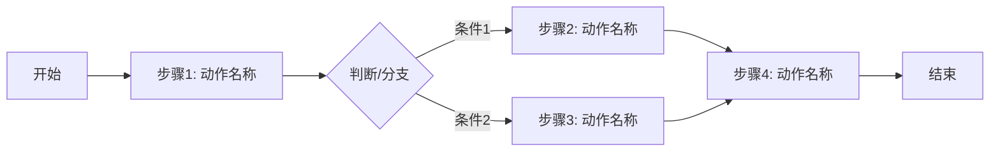
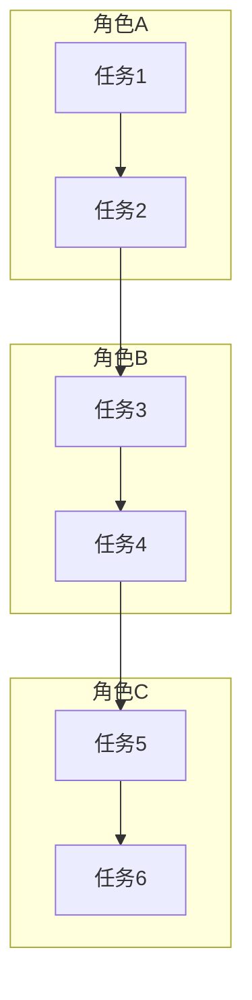
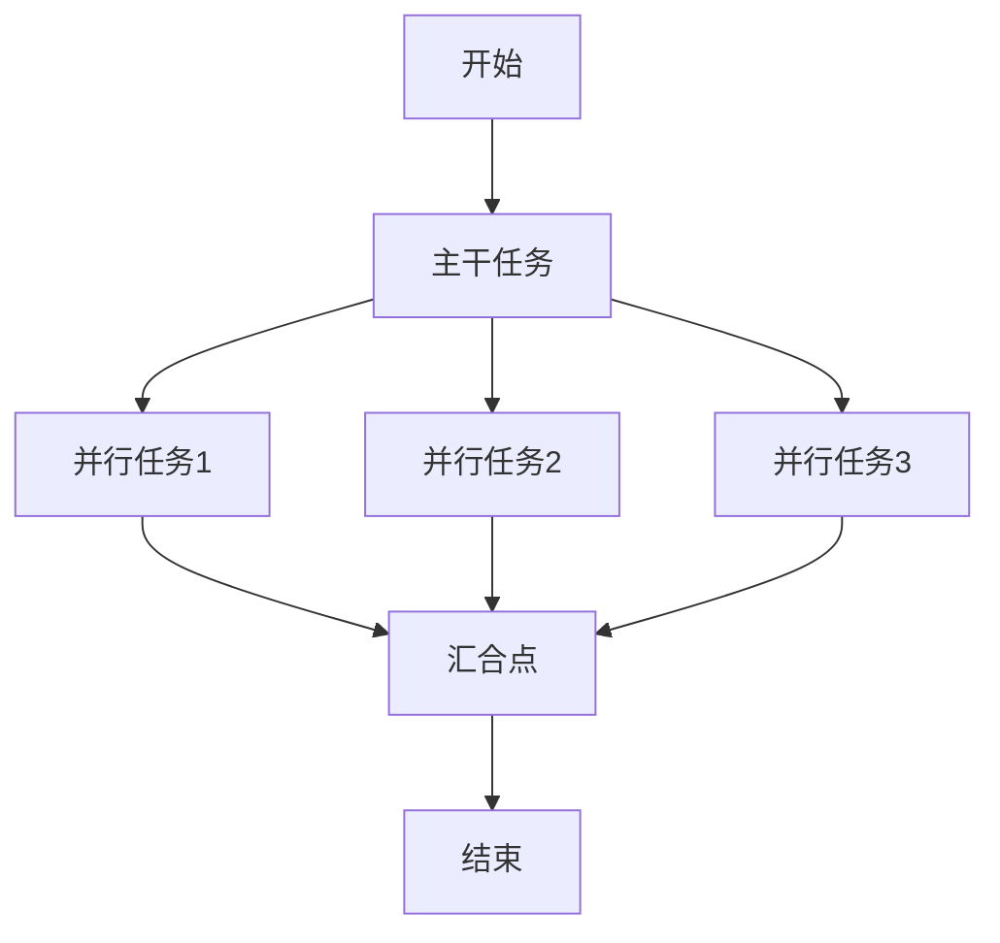

# 流程图模板

## 一、Mermaid流程图模板

### 线性流程



### 泳道流程（跨角色）



### 并行流程



---

## 二、ASCII流程图模板

### 简单线性

```
┌─────────┐
│  开始   │
└────┬────┘
     ▼
┌─────────┐
│  步骤1  │ ──产出──→ [产出物名称]
└────┬────┘
     ▼
┌─────────┐
│  步骤2  │ ──产出──→ [产出物名称]
└────┬────┘
     ▼
┌─────────┐
│  判断?  │
└────┬────┘
     ▼
  ┌─┴─┐
  ▼   ▼
是   否
│   │
▼   ▼
A   B
│   │
└─┬─┘
  ▼
┌─────────┐
│  结束   │
└─────────┘
```

### 泳道式

```
┌────────────────────┬────────────────────┬────────────────────┐
│     运营           │      设计          │      技术          │
├────────────────────┼────────────────────┼────────────────────┤
│                    │                    │                    │
│  [确定需求]        │                    │                    │
│      │            │                    │                    │
│      ▼            │                    │                    │
│  [输出brief]─────►│                    │                    │
│                    │ [设计方案]         │                    │
│                    │     │             │                    │
│                    │     ▼             │                    │
│                    │ [输出设计稿]──────►│                    │
│                    │                    │ [技术实现]         │
│                    │                    │     │             │
│                    │                    │     ▼             │
│                    │                    │ [上线完成]        │
│                    │                    │                    │
└────────────────────┴────────────────────┴────────────────────┘
```

---

## 三、节点符号规范

| 符号 | 含义 | 使用场景 |
|------|------|----------|
| ○ | 开始/结束 | 流程起止点 |
| □ | 普通操作 | 具体执行的动作 |
| ◇ | 判断/分支 | 条件判断节点 |
| ▽ | 数据/产出 | 输入输出物 |
| ⟳ | 循环 | 重复执行的操作 |
| ⚡ | 关键节点 | 重要检查点/里程碑 |

---

## 四、流程图绘制原则

1. **从左到右、从上到下**：符合阅读习惯
2. **一个入口、一个出口**：避免死循环和复杂分支
3. **角色区分**：跨角色流程使用泳道图
4. **产出明确**：每个节点明确产出物
5. **异常标注**：关键节点标注异常处理方式

---

## 五、快速模板（填空式）

### 模板1：日常运营流程

```
[开始]
   │
   ▼
[接收任务] ──产出：任务清单
   │
   ▼
[任务分析] ──产出：分析报告
   │
   ▼
[执行操作] ──产出：执行结果
   │
   ▼
[结果检查] ──产出：检查报告
   │
   ▼
[异常处理] ──是→[重新执行]
   │           │
   │否         ▼
   ▼        [结束]
[归档记录]
```

### 模板2：跨部门协作流程

```
┌─────────────┐    ┌─────────────┐    ┌─────────────┐
│   部门A     │    │   部门B     │    │   部门C     │
├─────────────┤    ├─────────────┤    ├─────────────┤
│ 任务A1      │───►│ 任务B1      │───►│ 任务C1      │
│ (产出:)     │    │ (产出:)     │    │ (产出:)     │
│             │    │             │    │             │
│ 任务A2      │◄───│ 任务B2      │◄───│ 任务C2      │
│ (产出:)     │    │ (产出:)     │    │ (产出:)     │
└─────────────┘    └─────────────┘    └─────────────┘
     │                  │                  │
     └──────────────────┴──────────────────┘
                        │
                        ▼
                  [检查点]
                        │
                        ▼
                  [完成/返回]
```

---

*模板版本：1.0 | 最后更新：2026-03-19*
