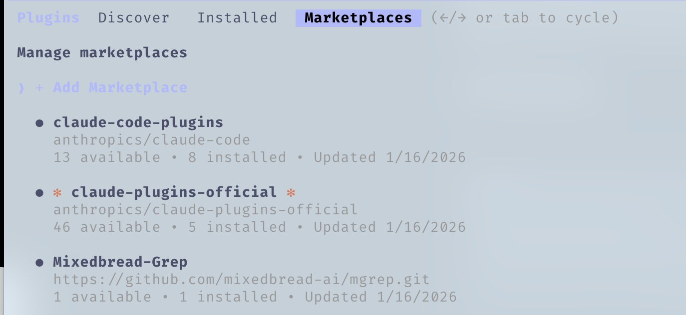

# 克劳德代码一切速记指南


---

**自 2 月份实验性推出以来，我一直是 Claude Code 的狂热用户，并与 [zenith.chat](https://zenith.chat) 和 [@DRodriguezFX](https://x.com/DRodriguezFX) 一起赢得了 Anthropic x Forum Ventures 黑客马拉松 - 完全使用 Claude Code。**

这是我经过 10 个月的日常使用后的完整设置：技能、挂钩、子代理、MCP、插件以及实际工作的内容。

---

## 技能和命令

技能就像规则一样运作，仅限于某些范围和工作流程。当您需要执行特定工作流程时，它们是提示的简写。

使用 Opus 4.5 进行长时间编码后，您想清除死代码和松散的 .md 文件吗？运行“/refactor-clean”。需要测试吗？ `/tdd`、`/e2e`、`/测试覆盖率`。技能还可以包括代码映射 - Claude 可以快速导航代码库的一种方式，而无需在探索中消耗上下文。


*将命令链接在一起*

命令是通过斜杠命令执行的技能。它们重叠但存储方式不同：

- **技能**：`~/.claude/skills/` - 更广泛的工作流程定义
- **命令**：`~/.claude/commands/` - 快速可执行提示```bash
# Example skill structure
~/.claude/skills/
  pmx-guidelines.md      # Project-specific patterns
  coding-standards.md    # Language best practices
  tdd-workflow/          # Multi-file skill with README.md
  security-review/       # Checklist-based skill
```---

## 钩子

挂钩是基于触发器的自动化，在特定事件上触发。与技能不同，它们仅限于工具调用和生命周期事件。

**挂钩类型：**

1. **PreToolUse** - 在工具执行之前（验证、提醒）
2. **PostToolUse** - 工具完成后（格式化、反馈循环）
3. **UserPromptSubmit** - 当您发送消息时
4. **停止** - 当克劳德完成回复时
5. **PreCompact** - 上下文压缩之前
6. **通知** - 权限请求

**示例：长时间运行命令之前的 tmux 提醒**```json
{
  "PreToolUse": [
    {
      "matcher": "tool == \"Bash\" && tool_input.command matches \"(npm|pnpm|yarn|cargo|pytest)\"",
      "hooks": [
        {
          "type": "command",
          "command": "if [ -z \"$TMUX\" ]; then echo '[Hook] Consider tmux for session persistence' >&2; fi"
        }
      ]
    }
  ]
}
```
*运行 PostToolUse 挂钩时在 Claude Code 中获得的反馈示例*

**专业提示：** 使用 `hookify` 插件以对话方式创建挂钩，而不是手动编写 JSON。运行“/hookify”并描述你想要什么。

---

## 子代理

子代理是您的协调器（主要 Claude）可以在有限范围内委派任务的进程。它们可以在后台或前台运行，为主代理释放上下文。

子代理与技能配合得很好 - 能够执行部分技能的子代理可以被委派任务并自主使用这些技能。它们还可以使用特定的工具权限进行沙箱处理。```bash
# Example subagent structure
~/.claude/agents/
  planner.md           # Feature implementation planning
  architect.md         # System design decisions
  tdd-guide.md         # Test-driven development
  code-reviewer.md     # Quality/security review
  security-reviewer.md # Vulnerability analysis
  build-error-resolver.md
  e2e-runner.md
  refactor-cleaner.md
```为每个子代理配置允许的工具、MCP 和权限，以实现正确的范围界定。

---

## 规则和记忆

您的“.rules”文件夹包含“.md”文件，其中包含克劳德应始终遵循的最佳实践。两种方法：

1. **单个 CLAUDE.md** - 一切都在一个文件中（用户或项目级别）
2. **规则文件夹** - 按关注点分组的模块化“.md”文件```bash
~/.claude/rules/
  security.md      # No hardcoded secrets, validate inputs
  coding-style.md  # Immutability, file organization
  testing.md       # TDD workflow, 80% coverage
  git-workflow.md  # Commit format, PR process
  agents.md        # When to delegate to subagents
  performance.md   # Model selection, context management
```**规则示例：**

- 代码库中没有表情符号
- 前端避免使用紫色色调
- 始终在部署之前测试代码
- 优先考虑模块化代码而不是大型文件
- 永远不要提交console.logs

---

## MCP（模型上下文协议）

MCP 直接将 Claude 连接到外部服务。它不是 API 的替代品 - 它是 API 周围的提示驱动包装器，允许更灵活地导航信息。

**示例：** Supabase MCP 让 Claude 提取特定数据，直接向上游运行 SQL，无需复制粘贴。数据库、部署平台等也是如此。


*Supabase MCP 列出公共模式中的表的示例*

**Claude 中的 Chrome：** 是一个内置插件 MCP，可让 Claude 自主控制您的浏览器 - 单击周围即可查看其工作原理。

**关键：上下文窗口管理**

对 MCP 保持挑剔。我将所有 MCP 保留在用户配置中，但**禁用所有未使用的**。导航到“/plugins”并向下滚动或运行“/mcp”。


*使用 /plugins 导航到 MCP 以查看当前安装的 MCP 及其状态*

如果启用了太多工具，压缩前的 200k 上下文窗口可能只有 70k。性能显着下降。

**经验法则：** 配置中有 20-30 个 MCP，但启用的工具数量少于 10 个/活动工具数量少于 80 个。```bash
# Check enabled MCPs
/mcp

# Disable unused ones in ~/.claude.json under projects.disabledMcpServers
```---

## 插件

插件打包工具，方便安装，无需繁琐的手动设置。插件可以是技能 + MCP 的组合，也可以是捆绑在一起的挂钩/工具。

**安装插件：**```bash
# Add a marketplace
# mgrep plugin by @mixedbread-ai
claude plugin marketplace add https://github.com/mixedbread-ai/mgrep

# Open Claude, run /plugins, find new marketplace, install from there
```
*显示新安装的 Mixedbread-Grep 市场*

如果您经常在编辑器之外运行 Claude Code，**LSP 插件**特别有用。语言服务器协议为 Claude 提供实时类型检查、转到定义和智能完成功能，无需打开 IDE。```bash
# Enabled plugins example
typescript-lsp@claude-plugins-official  # TypeScript intelligence
pyright-lsp@claude-plugins-official     # Python type checking
hookify@claude-plugins-official         # Create hooks conversationally
mgrep@Mixedbread-Grep                   # Better search than ripgrep
```与 MCP 相同的警告 - 请注意您的上下文窗口。

---

## 提示和技巧

### 键盘快捷键

- `Ctrl+U` - 删除整行（比退格垃圾邮件更快）
- `!` - 快速 bash 命令前缀
- `@` - 搜索文件
- `/` - 启动斜杠命令
- `Shift+Enter` - 多行输入
- `Tab` - 切换思维显示
- `Esc Esc` - 中断克劳德/恢复代码

### 并行工作流程

- **Fork** (`/fork`) - 分叉对话以并行执行非重叠任务，而不是发送垃圾邮件排队消息
- **Git Worktrees** - 用于重叠并行 Claudes，而不会发生冲突。每个工作树都是一个独立的结账```bash
git worktree add ../feature-branch feature-branch
# Now run separate Claude instances in each worktree
```### tmux 用于长时间运行的命令

流式传输并观察日志/bash 进程 Claude 运行：

<https://github.com/user-attachments/assets/shortform/07-tmux-video.mp4>```bash
tmux new -s dev
# Claude runs commands here, you can detach and reattach
tmux attach -t dev
```### mgrep > grep

`mgrep` 是对 ripgrep/grep 的重大改进。通过插件市场安装，然后使用“/mgrep”技能。适用于本地搜索和网络搜索。```bash
mgrep "function handleSubmit"  # Local search
mgrep --web "Next.js 15 app router changes"  # Web search
```### 其他有用的命令

- `/rewind` - 返回到之前的状态
- `/statusline` - 使用分支、上下文%、待办事项进行自定义
- `/checkpoints` - 文件级撤消点
- `/compact` - 手动触发上下文压缩

### GitHub Actions CI/CD

使用 GitHub Actions 对您的 PR 设置代码审查。配置后，Claude 可以自动审查 PR。


*克劳德批准错误修复公关*

### 沙箱

使用沙箱模式进行危险操作 - Claude 在受限环境中运行，不会影响您的实际系统。

---

## 关于编辑器

您的编辑器选择会显着影响 Claude Code 工作流程。虽然 Claude Code 可在任何终端上工作，但将其与功能强大的编辑器配对可以解锁实时文件跟踪、快速导航和集成命令执行。

### Zed（我的偏好）

我使用 [Zed](https://zed.dev) - 用 Rust 编写，所以它确实很快。立即打开，毫不费力地处理大量代码库，并且几乎不占用系统资源。

**为什么 Zed + Claude Code 是一个很棒的组合：**

- **速度** - 基于 Rust 的性能意味着当 Claude 快速编辑文件时不会出现延迟。您的编辑跟上
- **代理面板集成** - Zed 的 Claude 集成可让您在 Claude 编辑时实时跟踪文件更改。无需离开编辑器即可在 Claude 引用的文件之间跳转
- **CMD+Shift+R 命令面板** - 在可搜索的 UI 中快速访问所有自定义斜杠命令、调试器、构建脚本
- **最少的资源使用** - 在繁重的操作期间不会与 Claude 竞争 RAM/CPU。运行 Opus 时很重要
- **Vim 模式** - 完整的 vim 键绑定（如果您喜欢的话）


*Zed 编辑器使用 CMD+Shift+R 提供自定义命令下拉列表。跟随模式显示为右下角的靶心。*

**与编辑无关的提示：**

1. **分割屏幕** - 一侧是 Claude Code 终端，另一侧是编辑器
2. **Ctrl + G** - 快速打开Claude当前在Zed中处理的文件
3. **自动保存** - 启用自动保存，以便克劳德的文件读取始终是最新的
4. **Git 集成** - 在提交之前使用编辑器的 git 功能查看 Claude 的更改
5. **文件观察器** - 大多数编辑器会自动重新加载更改的文件，请验证是否已启用

### VSCode / 光标

这也是一个可行的选择，并且与 Claude Code 配合良好。您可以在任一终端格式中使用它，并使用“\ide”自动与编辑器同步，启用 LSP 功能（现在对插件来说有点多余）。或者您可以选择与编辑器集成度更高且具有匹配 UI 的扩展。


*VS Code 扩展为 Claude Code 提供了本机图形界面，直接集成到您的 IDE 中。*

---

## 我的设置

### 插件

**已安装：**（我通常一次只启用其中 4-5 个）```markdown
ralph-wiggum@claude-code-plugins       # Loop automation
frontend-design@claude-code-plugins    # UI/UX patterns
commit-commands@claude-code-plugins    # Git workflow
security-guidance@claude-code-plugins  # Security checks
pr-review-toolkit@claude-code-plugins  # PR automation
typescript-lsp@claude-plugins-official # TS intelligence
hookify@claude-plugins-official        # Hook creation
code-simplifier@claude-plugins-official
feature-dev@claude-code-plugins
explanatory-output-style@claude-code-plugins
code-review@claude-code-plugins
context7@claude-plugins-official       # Live documentation
pyright-lsp@claude-plugins-official    # Python types
mgrep@Mixedbread-Grep                  # Better search
```### MCP 服务器

**配置（用户级别）：**```json
{
  "github": { "command": "npx", "args": ["-y", "@modelcontextprotocol/server-github"] },
  "firecrawl": { "command": "npx", "args": ["-y", "firecrawl-mcp"] },
  "supabase": {
    "command": "npx",
    "args": ["-y", "@supabase/mcp-server-supabase@latest", "--project-ref=YOUR_REF"]
  },
  "memory": { "command": "npx", "args": ["-y", "@modelcontextprotocol/server-memory"] },
  "sequential-thinking": {
    "command": "npx",
    "args": ["-y", "@modelcontextprotocol/server-sequential-thinking"]
  },
  "vercel": { "type": "http", "url": "https://mcp.vercel.com" },
  "railway": { "command": "npx", "args": ["-y", "@railway/mcp-server"] },
  "cloudflare-docs": { "type": "http", "url": "https://docs.mcp.cloudflare.com/mcp" },
  "cloudflare-workers-bindings": {
    "type": "http",
    "url": "https://bindings.mcp.cloudflare.com/mcp"
  },
  "clickhouse": { "type": "http", "url": "https://mcp.clickhouse.cloud/mcp" },
  "AbletonMCP": { "command": "uvx", "args": ["ableton-mcp"] },
  "magic": { "command": "npx", "args": ["-y", "@magicuidesign/mcp@latest"] }
}
```这是关键 - 我配置了 14 个 MCP，但每个项目只启用了约 5-6 个。保持上下文窗口健康。

### 钥匙挂钩```json
{
  "PreToolUse": [
    { "matcher": "npm|pnpm|yarn|cargo|pytest", "hooks": ["tmux reminder"] },
    { "matcher": "Write && .md file", "hooks": ["block unless README/CLAUDE"] },
    { "matcher": "git push", "hooks": ["open editor for review"] }
  ],
  "PostToolUse": [
    { "matcher": "Edit && .ts/.tsx/.js/.jsx", "hooks": ["prettier --write"] },
    { "matcher": "Edit && .ts/.tsx", "hooks": ["tsc --noEmit"] },
    { "matcher": "Edit", "hooks": ["grep console.log warning"] }
  ],
  "Stop": [
    { "matcher": "*", "hooks": ["check modified files for console.log"] }
  ]
}
```### 自定义状态行

显示用户、目录、带脏指示器的 git 分支、上下文剩余百分比、模型、时间和待办事项计数：


*我的 Mac 根目录中的状态行示例*```
affoon:~ ctx:65% Opus 4.5 19:52
▌▌ plan mode on (shift+tab to cycle)
```### 规则结构```
~/.claude/rules/
  security.md      # Mandatory security checks
  coding-style.md  # Immutability, file size limits
  testing.md       # TDD, 80% coverage
  git-workflow.md  # Conventional commits
  agents.md        # Subagent delegation rules
  patterns.md      # API response formats
  performance.md   # Model selection (Haiku vs Sonnet vs Opus)
  hooks.md         # Hook documentation
```### Subagents```
~/.claude/agents/
  planner.md           # Break down features
  architect.md         # System design
  tdd-guide.md         # Write tests first
  code-reviewer.md     # Quality review
  security-reviewer.md # Vulnerability scan
  build-error-resolver.md
  e2e-runner.md        # Playwright tests
  refactor-cleaner.md  # Dead code removal
  doc-updater.md       # Keep docs synced
```---

## 要点

1. **不要过于复杂** - 将配置视为微调，而不是架构
2. **上下文窗口很宝贵** - 禁用未使用的 MCP 和插件
3. **并行执行** - fork 对话，使用 git worktrees
4. **自动化重复** - 用于格式化、linting、提醒的挂钩
5. **确定子代理的范围** - 有限的工具 = 集中执行

---

## 参考文献

- [插件参考](https://code.claude.com/docs/en/plugins-reference)
- [Hooks 文档](https://code.claude.com/docs/en/hooks)
- [检查点](https://code.claude.com/docs/en/checkpointing)
- [交互模式](https://code.claude.com/docs/en/interactive-mode)
- [内存系统](https://code.claude.com/docs/en/memory)
- [子代理](https://code.claude.com/docs/en/sub-agents)
- [MCP 概述](https://code.claude.com/docs/en/mcp-overview)

---

**注意：** 这是细节的子集。有关高级模式，请参阅[长格式指南](./the-longform-guide.md)。

---

*与 [@DRodriguezFX](https://x.com/DRodriguezFX) 一起赢得了纽约大楼 [zenith.chat](https://zenith.chat) 的 Anthropic x Forum Ventures 黑客马拉松*