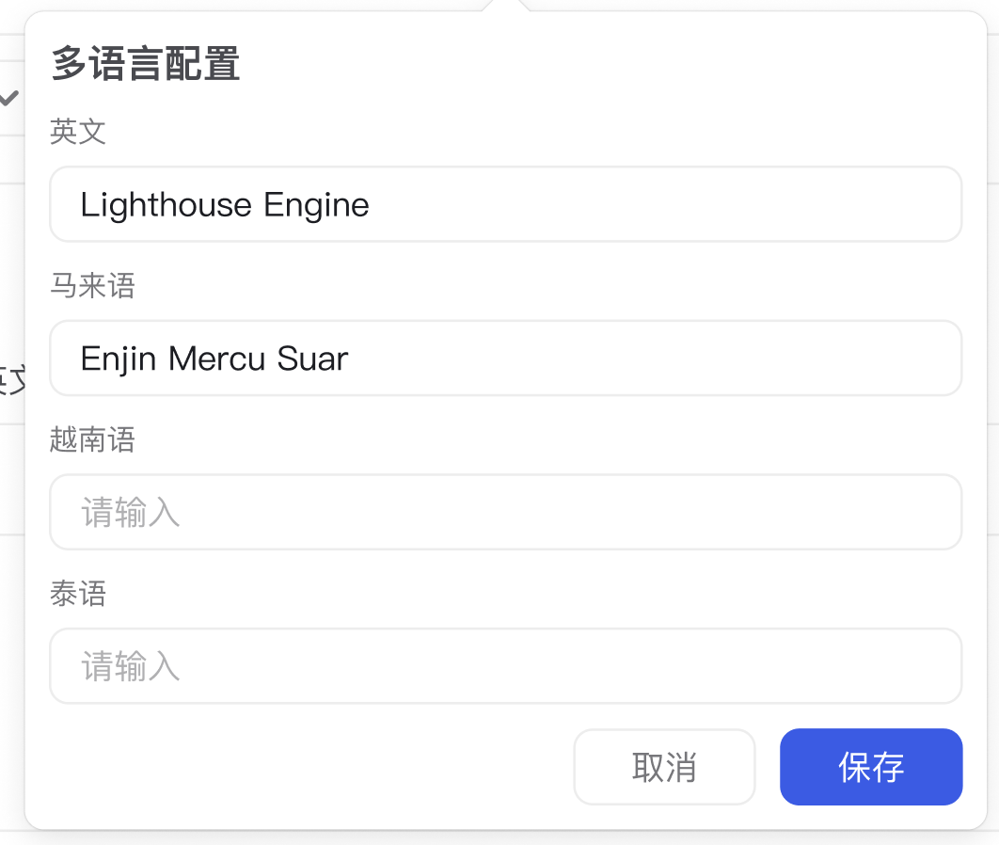

# MultiLangSetting 组件

## 简介

MultiLangSetting 是一个多语言设置组件，提供了一个便捷的界面来管理不同语言版本的文本内容。

## 特性

- 支持多种语言设置（英语、马来语、越南语、泰语）
- 基于 Popover 的弹出式表单
- 表单验证支持
- 国际化支持
- 自定义样式支持

## 使用方式

```tsx
import MultiLangSetting from '@/components/business/MultiLangSetting'

// 基本使用
<MultiLangSetting
  info={{
    en_US: "English text",
    ms_MY: "Malay text",
    vi_VN: "Vietnamese text",
    th_TH: "Thai text"
  }}
  onSave={(values) => {
    console.log('保存的语言设置:', values)
  }}
/>
```

## Props

| 属性 | 类型 | 默认值 | 说明 |
|------|------|--------|------|
| info | `AiManage.Lang` | - | 语言设置信息 |
| onSave | `(value: AiManage.Lang) => void` | - | 保存回调函数 |

## 样式

组件使用 Ant Design 的样式系统，并添加了以下自定义样式：

- 弹出框宽度：400px
- 表单项标签宽度：120px
- 表单项标签字体大小：12px
- 表单项间距：10px
- 图标颜色：使用主题色
- 图标悬停效果

## 依赖

- antd
- @tabler/icons-react
- react-i18next
- antd-style
- ahooks

## 注意事项

1. 组件使用了 `memo` 进行性能优化
2. 使用了 `useMemoizedFn` 优化回调函数
3. 表单数据会在保存后自动重置
4. 弹出框状态由组件内部管理

## UI图


