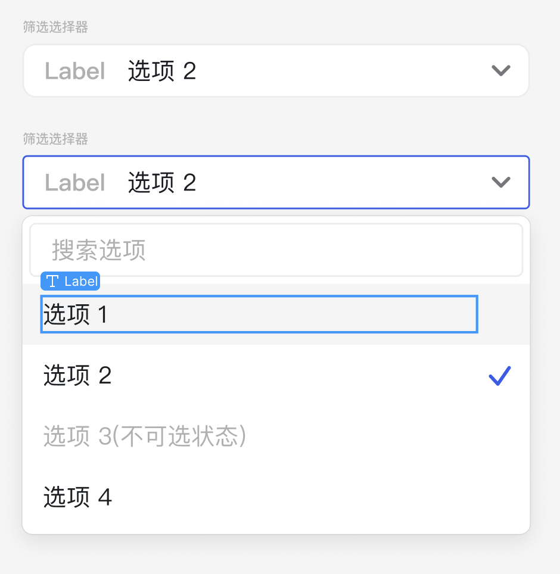
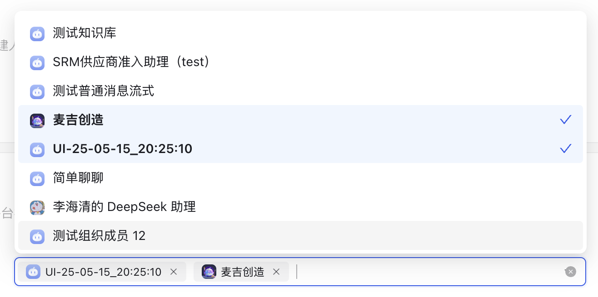

# SearchSelect 组件

## 简介

SearchSelect 是一个基于 Ant Design 的 Select 组件封装的搜索选择器组件。它提供了搜索过滤功能，允许用户通过输入文本来筛选选项。

## 特性

- 支持搜索过滤选项
- 继承 Ant Design Select 组件的所有属性
- 自定义样式支持
- 国际化支持
- 响应式设计

## 使用方式

```tsx
import SearchSelect from '@/components/business/SearchSelect'

// 基本使用
<SearchSelect
  options={[
    { label: '选项1', value: '1' },
    { label: '选项2', value: '2' }
  ]}
  placeholder="请选择"
/>

// 带搜索功能
<SearchSelect
  options={options}
  showSearch
  onSearch={(value) => console.log(value)}
/>

// 复杂下拉滚动功能
<SearchSelect
  placeholder={t("addAgentPublishThird")}
  options={options}
  onPopupScroll={handlePopupScroll}
  onDropdownVisibleChange={handleDropdownVisibleChange}
  loading={loading}
  showSearch
  showAvatar
  showInput={false}
  mode="multiple"
/>
```

## Props

组件继承自 Ant Design 的 Select 组件的所有属性，并添加了以下特性：

| 属性 | 类型 | 默认值 | 说明 |
|------|------|--------|------|
| options | `SelectProps['options']` | `[]` | 选项数据 |
| className | `string` | - | 自定义类名 |
| onSearch | `(value: string) => void` | - | 搜索回调函数 |

## 样式

组件使用 Ant Design 的样式系统，并添加了以下自定义样式：

- 最小宽度：130px
- 前缀文本样式：加粗、14px 字体大小
- 占位符文本颜色：使用主题色

## 依赖

- antd
- react-i18next
- antd-style

## 注意事项

1. 组件使用了 `memo` 进行性能优化
2. 搜索功能默认开启，可以通过 `showSearch` 属性控制
3. 搜索过滤是基于选项的 label 属性进行的 

## UI图


