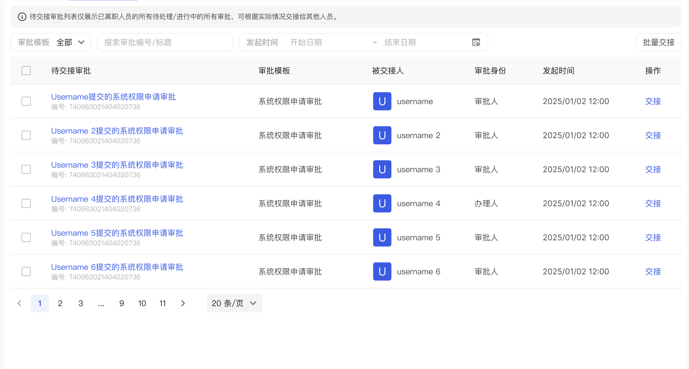

# TableWithFilters 组件

`TableWithFilters` 是一个增强型表格组件，提供了过滤条件和操作按钮的布局支持。

## 功能特点

- 支持顶部额外内容展示
- 支持过滤条件组合
- 支持操作按钮组
- 继承 Ant Design Table 的所有特性
- 使用 Flex 布局实现响应式设计

## 属性说明

该组件继承了 Ant Design `Table` 的所有属性，并额外扩展了以下属性：

| 属性名 | 类型 | 必填 | 描述 |
|--------|------|------|------|
| className | string | 否 | 自定义类名 |
| style | React.CSSProperties | 否 | 自定义样式 |
| extra | React.ReactNode | 否 | 表格顶部额外内容 |
| filters | React.ReactNode[] | 否 | 过滤条件组件数组 |
| buttons | React.ReactNode[] | 否 | 操作按钮组件数组 |

## 使用示例

```tsx
import TableWithFilters from '@/components/business/TableWithFilters';
import { Input, Button } from 'antd';

const Example = () => {
  return (
    <TableWithFilters
      // 表格相关属性
      columns={columns}
      dataSource={dataSource}
      
      // 顶部额外内容
      extra={<div>额外内容</div>}
      
      // 过滤条件
      filters={[
        <Input placeholder="搜索关键词" />,
        <Select placeholder="选择状态" />
      ]}
      
      // 操作按钮
      buttons={[
        <Button type="primary">新建</Button>,
        <Button>导出</Button>
      ]}
    />
  );
};
```

## UI图

