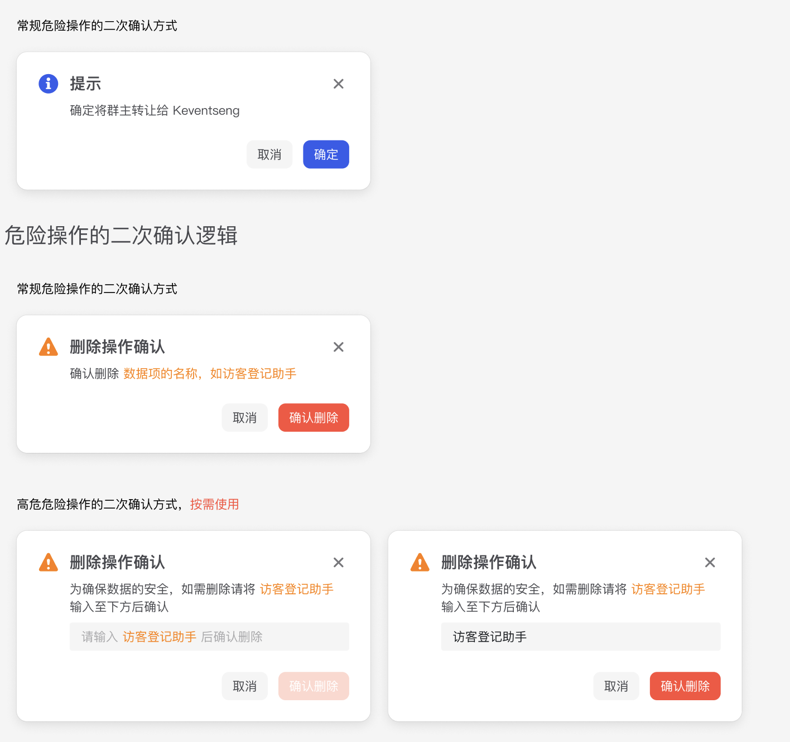

 # WarningModal 组件

## 简介

WarningModal 是一个警告/危险操作确认弹窗组件，支持二次确认功能。它基于 Ant Design 的 Modal 组件封装，提供了不同危险级别的警告提示和操作确认功能。

## 特性

- 支持危险级别区分（警告/危险）
- 支持二次确认功能
- 支持自定义按钮文本
- 支持国际化
- 响应式设计
- 自定义样式支持

## 使用方式

```tsx
import WarningModal, { DangerLevel } from '@/components/business/WarningModal'

// 基本使用
<WarningModal
  open={true}
  title="删除确认"
  content="确定要删除这个项目吗？"
  onOk={() => {
    console.log('确认操作')
  }}
  onCancel={() => {
    console.log('取消操作')
  }}
/>

// 带二次确认
<WarningModal
  open={true}
  title="危险操作"
  content="删除项目"
  needConfirm={true}
  dangerLevel={DangerLevel.Danger}
  onOk={() => {
    console.log('确认删除')
  }}
/>
```

## Props

| 属性 | 类型 | 默认值 | 说明 |
|------|------|--------|------|
| open | `boolean` | - | 控制弹窗显示 |
| title | `React.ReactNode` | - | 弹窗标题 |
| content | `React.ReactNode` | - | 弹窗内容 |
| needConfirm | `boolean` | `false` | 是否需要二次确认 |
| dangerLevel | `DangerLevel` | `DangerLevel.Warning` | 危险级别 |
| okText | `string` | - | 确认按钮文本 |
| cancelText | `string` | - | 取消按钮文本 |
| onOk | `(e: React.MouseEvent<HTMLButtonElement>) => void` | - | 确认回调 |
| onCancel | `(e: React.MouseEvent<HTMLButtonElement>) => void` | - | 取消回调 |
| ...其他属性 | `ModalFuncProps` | - | 继承自 Ant Design Modal 组件的属性 |

## 枚举类型

### DangerLevel
```typescript
export enum DangerLevel {
  Danger = "danger",
  Warning = "warning"
}
```

## 样式

- 弹窗宽度：400px
- 居中显示
- 不可点击遮罩层关闭
- 警告图标大小：24px
- 危险级别颜色：
  - 危险：橙色
  - 警告：主题色
- 按钮间距：12px

## 依赖

- antd
- react-i18next
- ahooks
- @/components/base/MagicModal
- @/components/icons/IconWarning
- @/components/base/MagicButton

## 注意事项

1. 组件支持二次确认功能，需要输入与内容完全相同的文本才能确认
2. 不同危险级别使用不同的按钮样式
3. 弹窗关闭时会销毁内容
4. 确认按钮在需要二次确认时会根据输入状态禁用
5. 支持自定义按钮文本，默认使用国际化配置

## 国际化配置

需要在国际化文件中配置以下键值：

```json
{
  "common": {
    "button": {
      "cancel": "取消",
      "confirm": "确认",
      "confirmDelete": "确认删除"
    },
    "deleteConfirmTip1": "请输入",
    "deleteConfirmTip2": "以确认删除",
    "pleaseInput1": "请输入",
    "pleaseInput2": "以确认",
    "diffTip": "输入内容与提示不一致"
  }
}
```

## UI图


