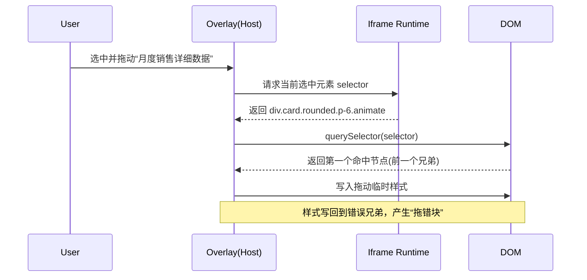
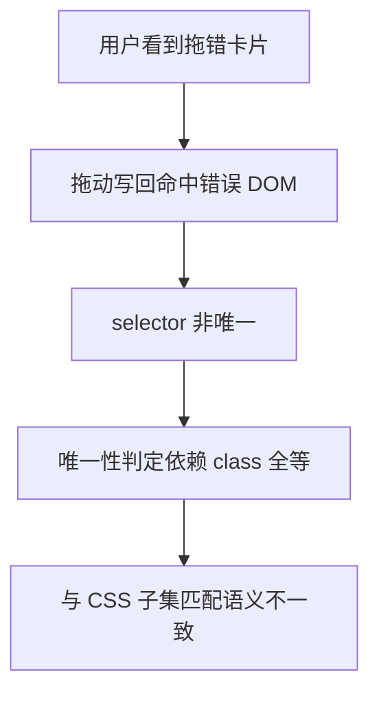
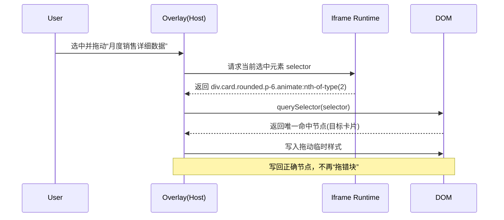
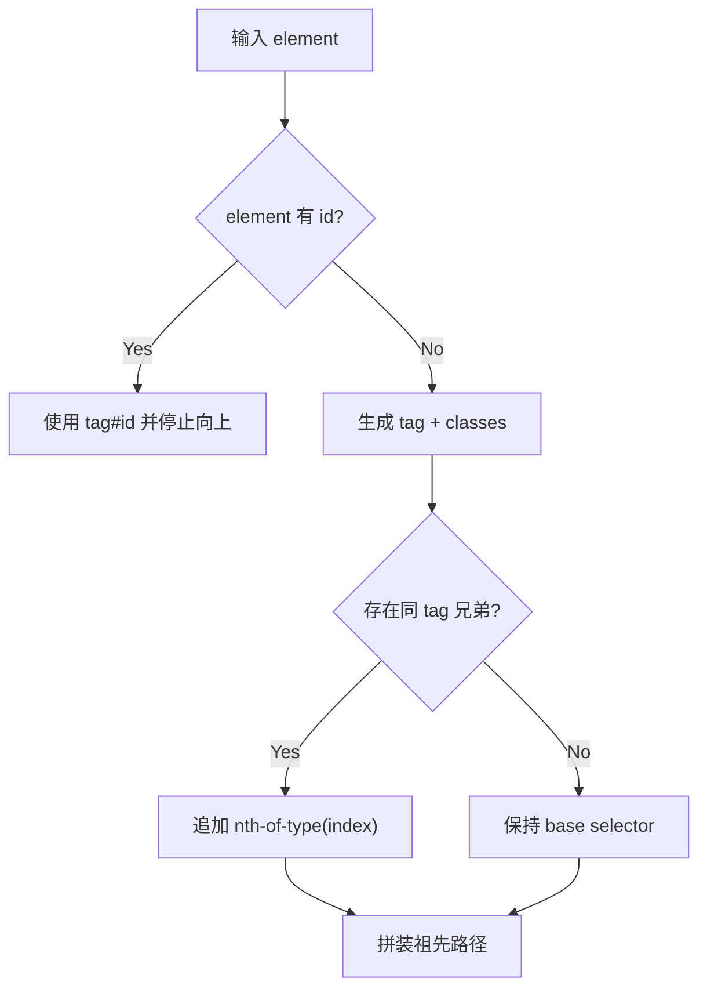

# 设计：HTML 编辑模式拖动命中错误兄弟节点

## 1. 概览
- 关联 `bugfix.md`：`./bugfix.md`
- 受影响范围：
  - `iframe-runtime` 选择器生成工具：`src/opensource/pages/superMagic/components/Detail/contents/HTML/iframe-runtime/src/utils/dom.ts`
  - 拖动链路对 selector 的消费（`querySelector` 命中）
- 非目标（本次不改）：
  - 不引入 `data-editor-id`
  - 不重构拖动协议与消息模型
- 约束条件：
  - 必须维持 `id` 优先选择器策略
  - 必须保证已有无冲突场景行为不退化

## 2. 问题复盘
### 2.1 用户可见现象
- 触发条件：存在两个相邻同 tag 卡片，后一个卡片 class 是前一个卡片 class 的子集
- 实际结果：拖动“月度销售详细数据”时，实际移动“产品综合性能评分”
- 期望结果：只移动当前被选中的卡片

### 2.2 失败路径（时序图）

## 3. 根因分析
### 3.1 根因结论
- 根因：`getElementSelector()` 的“唯一性判定语义”与“浏览器 CSS 匹配语义”不一致
- 根因类型：算法语义不一致（selector 唯一性策略缺陷）

### 3.2 证据链
- 证据 1（代码路径）：
  - 旧逻辑仅在“同 tag 且 class 全等兄弟 > 1”时补 `:nth-child()`
  - 旧逻辑将 class 集合排序后做全等比对，忽略了 CSS 子集匹配语义
- 证据 2（复现片段）：
  - `assets/selector-collision-snippet.html` 中前兄弟多 `mb-8`，仍会被 `.card.rounded.p-6.animate` 命中
- 证据 3（测试）：
  - `dom.test.ts` 新增 class 子集冲突场景，验证 `querySelectorAll(selector)` 在修复前存在多命中风险
- 仍缺失证据：
  - 尚无覆盖 iframe 真正拖动手势链路的 E2E 自动化用例（当前以单测 + 手工验证兜底）

### 3.3 根因分解图

## 4. 方案设计
### 4.1 候选方案对比
| 方案 | 改动面 | 回归风险 | 可验证性 | 结论 |
|---|---|---|---|---|
| A. 继续 class 全等 + `:nth-child` | 小 | 高（仍会漏子集冲突） | 中 | 否 |
| B. 同 tag 兄弟即补 `:nth-of-type` | 小 | 低 | 高 | 是 |
| C. 引入 `data-editor-id` 稳定锚点 | 大 | 中 | 中 | 否（超出本次边界） |
| D. 只改拖动命中，不改 selector 生成 | 中 | 高（其它动作仍风险） | 中 | 否 |

### 4.2 选定方案
- 方案描述：
  - 保留 `id` 优先
  - 无 `id` 时保留 `tag + class`
  - 只要存在同 tag 兄弟，附加 `:nth-of-type(index)`
- 为什么选它：
  - 直接修正“判定语义与浏览器语义不一致”的根因
  - 改动集中于 selector 生成工具，范围小、验证直接
  - 能同时降低拖动以外编辑动作的潜在误命中风险
- 为什么不选其它：
  - A 无法覆盖 class 子集冲突
  - C 改动面和迁移成本超出本次修复目标
  - D 治标不治本，会留下其它 selector 消费点风险

### 4.3 详细改动点
- 修改文件：
  - `src/opensource/pages/superMagic/components/Detail/contents/HTML/iframe-runtime/src/utils/dom.ts`
  - `src/opensource/pages/superMagic/components/Detail/contents/HTML/iframe-runtime/src/utils/__tests__/dom.test.ts`
- 关键逻辑前后：
  - Before：筛“同 tag + class 全等兄弟”决定是否补 `:nth-child`
  - After：筛“同 tag 兄弟”决定是否补 `:nth-of-type`

### 4.4 修复后路径图

### 4.5 选择器决策图（修复后）

## 5. 影响分析
- 用户可见变化：
  - 相邻相似卡片拖动时，命中节点从“首个匹配”修正为“目标唯一节点”
- 必须保持不变：
  - 元素带唯一 `id` 时继续优先 `id`
  - 无同 tag 兄弟时不额外追加位置索引
  - 嵌套标题等子节点仍能映射到正确业务容器
- 相邻能力影响：
  - 任何依赖该 selector 的定位行为（潜在包含拖动、样式写回、局部编辑）都会受益于唯一性提升

## 6. 测试与验证计划
### 6.1 自动化测试矩阵
| 场景 | 旧行为 | 新行为 | 用例位置 |
|---|---|---|---|
| class 子集冲突（复现场景） | 可能多命中 | 唯一命中 | `dom.test.ts` 新增 case |
| 嵌套标题节点命中 | 存在误命中风险 | 唯一命中目标分支 | `dom.test.ts` 新增 case |
| 同 tag 兄弟基础场景 | `:nth-child` | `:nth-of-type` | `dom.test.ts` 更新断言 |
| `id` 优先场景 | 通过 | 继续通过 | `dom.test.ts` 既有 case |

### 6.2 手工验证
- 步骤：
  1. 打开问题页面并进入 HTML 编辑模式
  2. 分别拖动“月度销售详细数据”和“产品综合性能评分”
  3. 点击卡片标题与空白区后再次拖动
- 观察点：
  - 每次拖动仅影响当前选中卡片
  - 不出现前一个相似兄弟被误移动
- 通过标准：
  - 多次重复操作（含切换选中目标）均无误命中

## 7. 发布与回滚
- 发布前检查项：
  - 聚焦单测通过：`dom.test.ts`
  - 手工复现页验证通过
- 监控点：
  - 编辑模式下“选中元素 selector”与“实际写回元素”一致性日志（如后续补埋点）
- 回滚条件：
  - 出现选择器失配导致的误编辑/误拖动回归
- 回滚方案：
  - 回退 `dom.ts` 此次变更，并临时关闭相关能力或切回安全分支

## 8. 风险与后续
- 剩余边界：
  - 仍缺 iframe 内拖动链路的 E2E 自动化测试
- 后续建议：
  - 收敛仓库内多处 selector 生成实现，避免规则分叉
  - 为删除/复制/撤销补“相邻相似兄弟”稳定性回归用例
