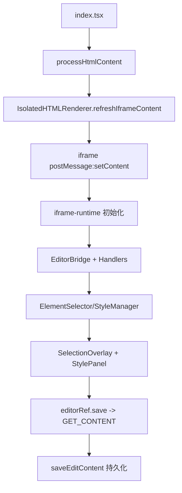

# HTML 编辑器自顶向下学习路径

本文面向“先建立全局，再进入源码细节”的学习方式，帮助你快速形成 `HTML` 编辑器模块心智模型。

## 1. 建立全景（先看这 5 个入口）

1. `index.tsx`：页面容器、文件版本、保存挂载、HTML 预处理与渲染分发。
2. `IsolatedHTMLRenderer.tsx`：iframe 生命周期、消息白名单、编辑器 UI 编排。
3. `hooks/useHTMLEditorV2.ts`：V2 编辑器核心桥接（MessageBridge + 命令 API）。
4. `iframe-bridge/bridge/MessageBridge.ts`：主容器到 iframe 的协议层。
5. `iframe-runtime/src/runtime/EditorRuntime.ts`：iframe 内部运行时编排层。

## 2. 核心主链路（从加载到保存）

## 3. 推荐阅读顺序（按抽象层）

1. 容器层：`index.tsx` + `IsolatedHTMLRenderer.tsx`  
理解“外部页面如何喂给 iframe 内容、何时进入编辑态、保存入口如何暴露给父组件”。

2. 协议层：`useHTMLEditorV2.ts` + `MessageBridge.ts` + `iframe-bridge/types/messages.ts`  
理解“请求/响应、命令、事件”三类消息如何组织。

3. 运行时层：`iframe-runtime/src/runtime/EditorRuntime.ts` + `handlers/*`  
理解“命令如何落地到 DOM、历史栈如何运转、选择事件如何上报”。

4. 交互层：`components/SelectionOverlay/*` + `components/StylePanel/*`  
理解“父窗口叠加选框如何与 iframe 内真实元素同步、拖拽旋转缩放如何合并历史记录”。

5. 资源层：`htmlProcessor.ts` + `utils/fetchInterceptor.ts` + `utils/*`  
理解“资源路径替换、动态请求拦截、保存前清理注入标签”的安全链路。

## 4. 抓主线的 3 个高收益问题

1. 为什么是“父容器渲染叠加层 + iframe 内执行真实 DOM 修改”的双层结构？  
答案在隔离安全与编辑体验兼顾：渲染隔离在 iframe，控制与 UI 在父层。

2. 为什么拖拽/缩放/旋转要走 `BEGIN_BATCH_OPERATION -> APPLY_STYLES_TEMPORARY -> END_BATCH_OPERATION`？  
答案在于将高频交互合并为一条可撤销历史，避免 undo 栈爆炸。

3. 为什么保存前会先关闭文本编辑态再 `GET_CONTENT`？  
答案在于避免 `contenteditable` 等临时编辑属性污染最终 HTML。

## 5. 复杂模块优先级

1. `iframe-runtime`（内部引擎与命令执行）
2. `iframe-bridge`（消息协议与跨窗口生命周期）
3. `SelectionOverlay`（跨坐标系交互与批量操作）
4. `StylePanel`（样式命令编排与 store 状态联动）

对应深挖文档：

- [模块清单与职责地图](./ModuleMap.md)
- [Iframe Runtime 深度解析](./IframeRuntimeDeepDive.md)
- [Iframe Bridge 深度解析](./IframeBridgeDeepDive.md)
- [SelectionOverlay 深度解析](./SelectionOverlayDeepDive.md)
- [StylePanel 深度解析](./StylePanelDeepDive.md)

Sources: 资料来源 ：

src/opensource/pages/superMagic/components/Detail/contents/HTML/index.tsx
110-260
src/opensource/pages/superMagic/components/Detail/contents/HTML/IsolatedHTMLRenderer.tsx
750-1367
src/opensource/pages/superMagic/components/Detail/contents/HTML/hooks/useHTMLEditorV2.ts
148-640
src/opensource/pages/superMagic/components/Detail/contents/HTML/iframe-bridge/bridge/MessageBridge.ts
31-307
src/opensource/pages/superMagic/components/Detail/contents/HTML/iframe-runtime/src/runtime/EditorRuntime.ts
19-244
