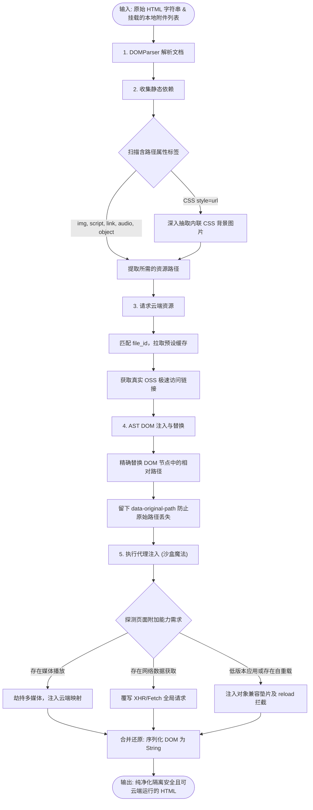
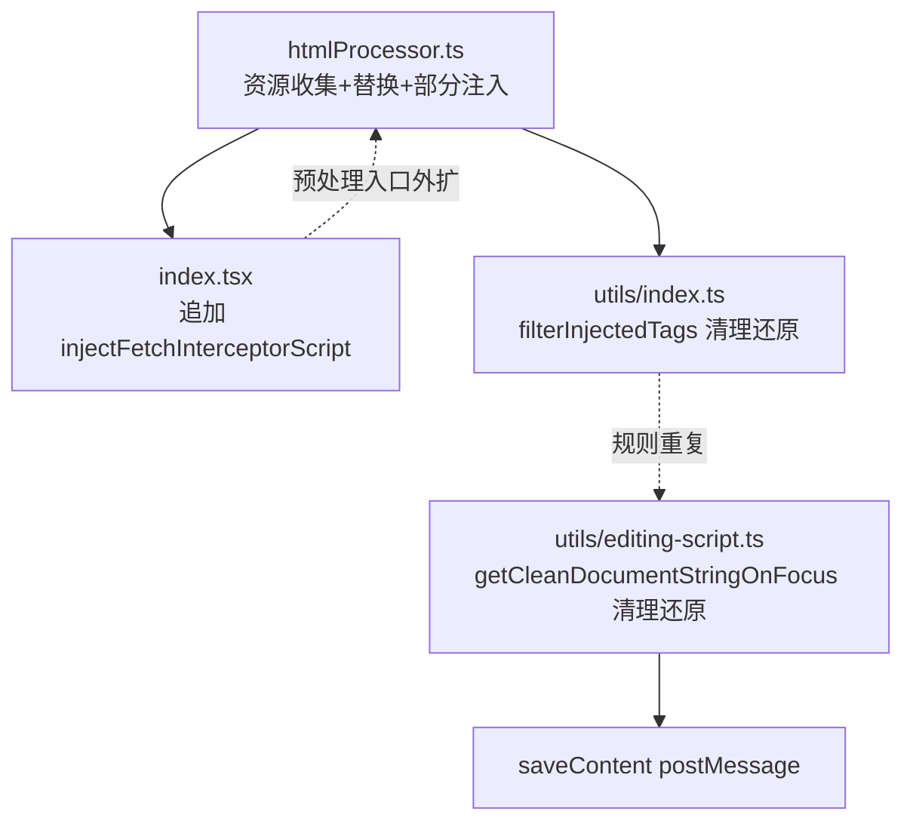

# HTML 预处理引擎 (HtmlProcessor)

在 SuperMagic 中展示用户上传的本地 HTML 压缩包，直接使用相对路径加载是行不通的（因为无法直接访问客户端的本地相对路径文件，且存在跨域和安全问题）。因此，`htmlProcessor.ts` 是在 HTML 字符串被推入 iframe 渲染之前的**最核心防线和转换器**。

## ⚙️ 核心处理流程

核心方法：`processHtmlContent(input: ProcessHtmlContentInput)`
它是一个纯函数式的异步处理器，接收原始 HTML 字符串和相关的元数据附件列表，输出已经被净化且“链接被掉包”后的安全 HTML 字符串。

1. **解析与搜集依赖 (DOM 解析)**
    - 使用真实的浏览器 `DOMParser` 将原始文本解析为 Document 树。
    - 提取业务幻灯片特征（在 `metadata?.slides` 不存在时，探测 `<script>` 标签是否包含 `slides` 数据）。
    - 遍历并收集所有具有局域指向特征的标签与属性，包括：
        - `` 的 `src`
        - `<link rel="stylesheet">` 的 `href`
        - `<script>` 的 `src`
        - `<iframe>` 的 `src`
        - `<source>`, `<video>`, `<audio>` 的 `src`
        - `<object>` 的 `data`
        - 以及深度 CSS 规则匹配：行内 `style="background-image: url(...)"` 甚至 `<style>` 块内部的资源引用。

2. **资源加载 Hook 拦截 (资源到 OSS URL 的转换)**
    - 上述提取后，根据 `file_id` 集合发起批量网路请求 `getTemporaryDownloadUrl` 计算真实的 OSS 临时访问签名链接。拦截并接管超链接点击与资源发现，**统一调度路径解析逻辑**。
    - 通过正则表达式和 DOM 替换技术，将工作区路径（`src` 和 `href` 等）精确转换为预签名 URL。
    - **巧妙的回退设计**：使用 HTML 注释 `/*__ORIGINAL_URL__:xxxx__*/` 或自定义属性 `data-original-path` 来强行记忆该链接的原始位置，这样当用户在界面中编辑完 HTML 需要重新打包覆盖保存（`saveEditContent`）时，能够原样恢复回去，保证源文件路径不被破坏。

3. **运行时增强注入（Processor + 容器协作）**
   为保证原本本地能跑的 HTML 在云端也能无缝运行，当前链路由多个位置协作注入：
    - **`htmlProcessor.ts` 内注入**：`injectMediaInterceptorScript`（音视频场景）、`Array.prototype.at()` polyfill、`window.location.reload()` 替换逻辑。
    - **`index.tsx` 外层注入**：`injectFetchInterceptorScript`（XHR/Fetch 劫持）在 `processHtmlContent` 之后追加。
    - 这套机制能工作，但“同一条预处理链路分布在多个文件”的设计会增加后续维护成本。

### 管道处理流程图

## 📊 性能优化设计

为了满足极其高频复杂 HTML 渲染情况，处理器实现了针对并发获取 URL 的池化缓存：
`collectFileIdsFromHtml` 方法能够在早期预先收集所需要加载的 File ID 集合，进而一次性拿取 URL 建立 `preloadedUrlMapping` 缓存。在后续正式调用 `processHtmlContent` 时可以直接命中缓存，极大地规避了由于 N 个小图片引发 N 次串行异步请求导致界面的白屏闪烁。

## 🧭 设计评估：当前“分散式预处理”是否有问题？

结论：**有问题，且已经进入“可运行但难演进”的状态**。主要不是“文件多”，而是“职责边界与数据契约分散且重复”。

### 主要问题点

1. **入口分裂，预处理职责不闭合**
    - `processHtmlContent` 处理完成后，`index.tsx` 还会再做 fetch 拦截注入，导致“预处理主链路”并非单一入口。

2. **清理/还原逻辑重复实现**
    - `utils/index.ts` 的 `filterInjectedTags` 与 `utils/editing-script.ts` 内 `getCleanDocumentStringOnFocus` 长段重复，后续极易出现修一处漏一处。

3. **规则与实现存在错位风险**
    - 示例：`object` 标签在收集阶段按 `src` 扫描，但替换阶段又按 `data` 分支处理，容易形成“看似支持、实则失效”的隐性缺陷。

4. **字符串正则替换过重**
    - 大量 `updatedContent.replace(...)` 依赖 HTML 序列化细节，遇到属性顺序变化、引号变化、嵌套结构变化时易脆断。

### 问题链路图

## ✅ 优化方案（分阶段落地）

### Phase 1（低风险，先止血）

1. **统一“预处理入口”**
    - 约束：页面层只调用一次 `processHtmlContent`，由处理器统一返回“最终可注入内容”，容器层不再追加预处理逻辑。

2. **抽离共享清理器**
    - 新增共享 `htmlRestore/htmlSanitizer` 模块，`filterInjectedTags` 与 `editing-script` 统一复用一套实现。

3. **修复规则错位与注释漂移**
    - 统一 `object` 的属性策略（`data` vs `src`）。
    - 修正文档/注释和真实代码不一致描述，降低误导维护成本。

### Phase 2（结构治理）

1. **插件化预处理管道**
    - 形态：`parse -> collect -> resolveUrls -> rewrite -> inject -> serialize`
    - 插件建议：`resourcePlugin`、`cdnPlugin`、`mediaPlugin`、`reloadPolyfillPlugin`、`dashboardPlugin`。

2. **从“字符串替换”迁移到“DOM 语义改写”**
    - 以结构化 `ResourceRef`（tag/attr/originalPath/fileId）驱动替换，减少 fragile regex。

### Phase 3（质量保障）

1. **补齐三类回归测试**
    - 资源替换正确性（含 CSS url/inline style/object/iframe）。
    - 清理还原幂等性（注入后还原、重复保存不漂移）。
    - 嵌套 iframe + 动态加载链路一致性。

2. **增加可观测性**
    - 输出处理阶段耗时、替换计数、注入计数、还原计数，便于定位“预处理导致的编辑异常”。

Sources: 资料来源 ：

src/opensource/pages/superMagic/components/Detail/contents/HTML/htmlProcessor.ts
1-616
src/opensource/pages/superMagic/components/Detail/contents/HTML/index.tsx
283-307
src/opensource/pages/superMagic/components/Detail/contents/HTML/utils/index.ts
535-824
src/opensource/pages/superMagic/components/Detail/contents/HTML/utils/editing-script.ts
2314-2515
