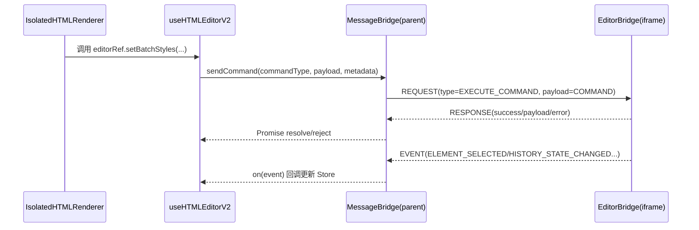

# Iframe Bridge 深度解析（主容器通信层）

`iframe-bridge` 是主应用侧对 iframe-runtime 的协议封装层，核心目标是把“跨窗口通信”抽象成稳定的编辑器 API。

## 1. 职责边界

1. `MessageBridge`：协议编解码、请求超时、事件订阅、实例销毁。
2. `useHTMLEditorV2`：桥接生命周期管理、暴露编辑器能力（save/undo/redo/样式命令）。
3. `StylePanelStore` + Context：承接 selected element / history / selection mode 的 UI 状态。

## 2. 协议模型

## 3. MessageBridge 关键机制

1. **来源校验**：仅处理 `event.source === iframe.contentWindow` 的消息，减少跨实例串扰。  
2. **版本校验**：仅处理 `version === MESSAGE_PROTOCOL_VERSION` 的新协议消息。  
3. **请求超时**：`request()` 写入 `pendingRequests`，超时自动 reject 并清理。  
4. **销毁语义**：`destroy()` 会移除监听器并清空 pending/eventHandlers，防止内存泄露。

## 4. useHTMLEditorV2 生命周期重点

1. `iframeLoaded + sandbox=iframe` 时创建 `MessageBridge`。
2. 监听 `EDITOR_READY` 后标记 runtime 就绪。
3. 编辑模式切换使用显式状态机：`idle -> activating -> active -> deactivating`。
4. 内容替换后触发脚本重注入：`contentInjected` 翻转会触发桥接重建与重进编辑态。

## 5. API 分层（对上层暴露）

1. 查询型：`getContent/getCleanContent/getHistoryState/getElementComputedStyles`。
2. 命令型：`setBatchStyles/setBatchStylesMultiple/adjustFontSizeRecursive/deleteElement/duplicateElement`。
3. 生命周期：`enterEditMode/exitEditMode/enableSelectionMode/disableSelectionMode`。
4. 批处理：`beginBatchOperation/applyStylesTemporary/endBatchOperation/cancelBatchOperation`。

## 6. 重点风险点

1. 多实例场景中若不销毁旧 bridge，容易出现“重复响应/事件泄露”。
2. content 更新后旧 selector 可能失效，需调用 `CLEAR_SELECTION` / `resetEditorState`。
3. 交互高频操作若都写历史，会导致 undo 粒度过细；当前通过 batch 规避。

Sources: 资料来源 ：

src/opensource/pages/superMagic/components/Detail/contents/HTML/hooks/useHTMLEditorV2.ts
68-230
233-339
341-600
603-640
src/opensource/pages/superMagic/components/Detail/contents/HTML/iframe-bridge/bridge/MessageBridge.ts
31-93
98-194
199-307
src/opensource/pages/superMagic/components/Detail/contents/HTML/iframe-bridge/types/messages.ts
6-20
30-98
103-183
src/opensource/pages/superMagic/components/Detail/contents/HTML/iframe-bridge/stores/StylePanelStore.ts
99-255
src/opensource/pages/superMagic/components/Detail/contents/HTML/docs/multi-instance-improvements.md
1-120
