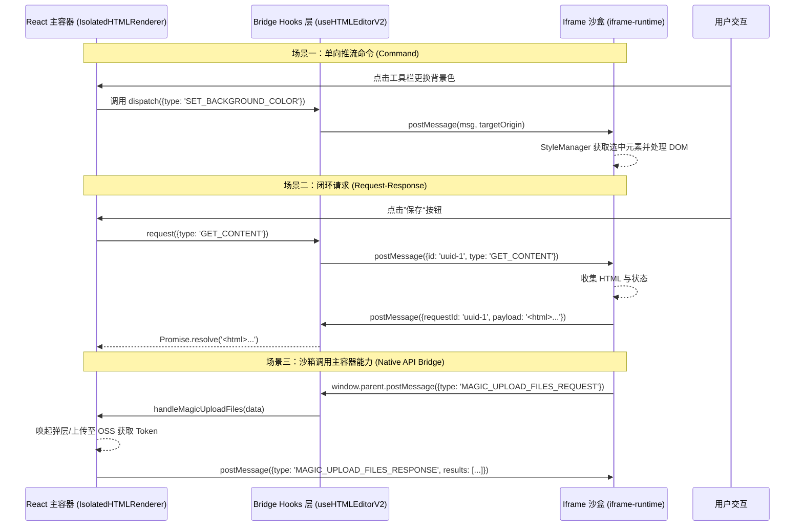

# Iframe 渲染与跨域隔离设计

为确保在 SuperMagic 中能安全呈现来自外部或 AI 生成的网络片段，模块重点依赖了一套自定义的 Iframe 桥接逻辑系统。

## 🛡️ 沙盒安全策略

组件的核心基石是由 `IsolatedHTMLRenderer.tsx` 挂载的沙盒实例：
通过标准的宿主 `<iframe>` 环境执行内容，配合业务上的隔离域名（当前还是同源域名，接下来计划使用非同源域名确保安全性）或 Content-Security-Policy，限制 iframe 的源操作权限。

主要防御点：

- **同源风险避免**：将复杂且含有脚本指令的 HTML 内容放归沙盒，防止污染宿主 React 环境上下文。
- **动态资源拦截**：通过注入宿主通讯挂载网络拦截脚本，严格控制对核心域接口（如 Cookie 获取、跨域 API 篡改）的侵入。
- **存储隔离 Hook 机制**：确保不同项目、不同网页间的 `LocalStorage` 等是完全相互隔离且不污染主域的，不仅防止恶意脚本相互影响，同时也支持将沙盒内特定的配置项安全持久化保存。

## 🌉 桥接通信系统 (Iframe Bridge)

如何让外面的一层壳（React 组件栏）和里面的独立执行小世界（内部 HTML）交流是一个最大难题。
`iframe-bridge` 和 `iframe-runtime` 组合解决了这个痛点：

### iframe-runtime（端内执行沙箱代理）

- 被编译为一个极简的 Vanilla JS Bundle，悄悄注入或内嵌执行于 `iframe` 网页开头。
- 提供 `EditorRuntime`：统一监听全局键盘事件、鼠标选择动作（ElementSelector）。
- 提供 `StyleManager`：维护了丰富的样式编辑器工具集（文字颜色、背景、尺寸批量修改和拖动重定位）。
- **页面操作 Hook 拦截与事件委托**：捕获用户在 iframe 中的所有交互行为，将普通的鼠标点击转化为携带目标节点自定义属性、DOM 路径以及真实渲染盒子数据的结构体，实现跨域通信与状态同步。
- **元素级 AI 编辑基石（指哪改哪）**：在发生用户选区时，自动提取 XPath 及所处片段的节点元数据（甚至包含节点截图信息缓存）。通过桥接通道将这些信息提供给向大模型请求的 Prompt，以此确保 AI 精准理解和编辑意图，实现所见即所得的极智修改。
- 将自身所有动作通过 `window.parent.postMessage` 上报出去。

### iframe-bridge（主应用容器驱动器）

- 基于 React 的上下文 Context 及自定义 Hooks 构建，如 `useHTMLEditorV2`。
- 定义了一套高阶规范用于发包与接包：
    - **命令模式 (Command)**：比如宿主告诉 iframe “我要把选中的字变红”（如 `SET_TEXT_COLOR`），一去不回。
    - **请求响应模式 (Request-Response)**：宿主询问 iframe “那你的内部高度现在是多少了？”（如 `GET_CONTENT` 或 `GET_COMPUTED_STYLES`），需要携带 UUID 等待内部回传结果闭环。
- 主容器也会在这里把超级麦吉域内独有的能力赋能给里面的沙盒，比如允许沙盒直接调用 `window.Magic.uploadFiles` 唤起主容器的文件上传弹层及网络传输，最后将上传完真实的 OSS 链接塞回给沙盒继续使用。

### 双向通信时序图

## 🔍 画布焦点与视口控制

针对各种宽广屏幕和移动端的 PPT 乃至数据大屏画板展示需求，主控 `IsolatedHTMLRenderer.tsx` 内部特别强化了缩放（ZoomControls）与选框叠加层逻辑（SelectionOverlay）。

- 实现了自动居中算法与 Trackpad 等触控设备的双指 Pinch-to-Zoom 捕捉。
- `isPptRender` 模式：智能裁剪并撑满屏幕，使得任意尺寸网页被约束在合适视野中呈现。

Sources: 资料来源 ：

src/opensource/pages/superMagic/components/Detail/contents/HTML/IsolatedHTMLRenderer.tsx
1-350
src/opensource/pages/superMagic/components/Detail/contents/HTML/iframe-runtime/index.ts
1-100
src/opensource/pages/superMagic/components/Detail/contents/HTML/iframe-bridge/useHTMLEditorV2.ts
