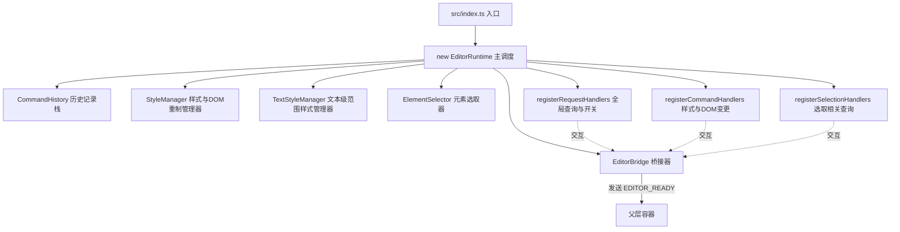
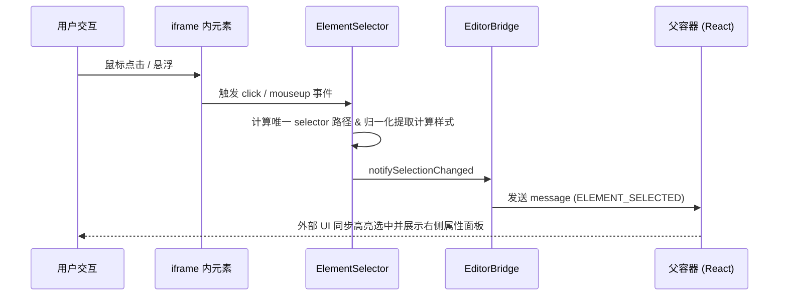
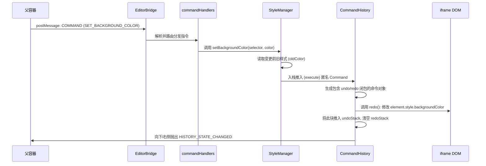
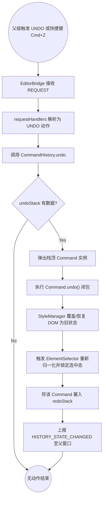
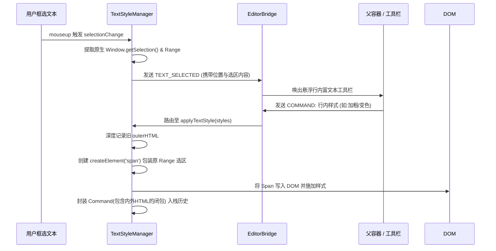

# Iframe Runtime 深度解析（iframe 内编辑引擎）

`iframe-runtime` 是真正修改和操作目标 DOM 的核心执行层。外部父容器（React 应用）与其实际环境是完全隔离的。父容器主要负责 UI 交互并发起消息指令，而 `iframe-runtime` 则负责接收控制命令、解析指令、稳定且精细地改写 DOM 并维护状态历史（撤销/重做）。

---

## 1. 架构与运行生命周期

当前 `iframe-runtime` 项目经过了精细的重构（解耦了庞大类，应用了单一职责原则）。其核心组件协作图谱如下：

**应用生命周期**：

1. `iframe` 被注入并运行 `src/index.ts`。
2. 实例化 `EditorRuntime`：初始化 `CommandHistory` 并按职责切分注册 Handlers（命令处理、请求处理、光标与选择处理）。
3. 挂载完成后，`EditorBridge` 向上抛出 `EDITOR_READY` 信号，告知父元素引擎准备完毕，可以建立双向通信通道。

---

## 2. 消息驱动调度与处理器拆分 (Handlers)

为了贯彻**开闭原则 (Open-Closed Principle)** 与 **单一职责 (SRP)**，所有的通信能力按类别由不同 Handler 挂载：

- **`requestHandlers`**：主处理查询与模式控制（例如：`GET_CONTENT`, `UNDO`/`REDO`, `CLEAR_HISTORY`, `ENTER_EDIT_MODE`, `VALIDATE_CONTENT`）。其中不涉及可撤销的修改。
- **`commandHandlers`**：这是核心的“写”操作入口。由它派发各类变更调用 `StyleManager` 或 `TextStyleManager` 处理例如背景色、文字颜色、字体、批量样式、以及增删节点。这类请求一定会被 `CommandHistory` 捕获以支持撤销。
- **`selectionHandlers`**：专注特定选择数据的投递（如果层计算 `GET_COMPUTED_STYLES`）。

---

## 3. StyleManager 实现的深度剖析

`StyleManager` 是最重量级的组件（~1900行代码），其核心难点并不是给元素加减 CSS，而是如何**将复合 DOM 变更完美地映射到可回退的历史队列中**。

### 3.1 历史记录 (History) 入栈机制

1. 每个独立的样式调用（如 `setBackgroundColor`）前，`StyleManager` 都会将其包装为一个具有独立 `undo` 和 `redo` 闭包的 Command 推入 `CommandHistory` 的栈（默认限制 50 层）。
2. **高频拖拽或渐变**：使用 `applyStylesTemporary`，此方法直接透写改写 `element.style`，但**不压入历史栈**。这保证了在用户拖拽调整位置时内存与性能极度平稳。
3. **批量原子操作 (`beginBatch` / `endBatch`)**：对于拖拽多选改变样式或组件配置面板内多维度的改变，引擎通过 beginBatch 将一串操作记录为 "一条历史"，撤销时可以完整退回。

### 3.2 节点销毁与复制（防重入设计）

- **节点删除**：不仅仅是 `element.remove()`。删除前需要缓存其 `nextSiblingSelector` 或同级索引 `siblingIndex`，这样撤销 `undo()` 时可以精准插回原来的层级与索引位。
- **对于画布及多媒体状态保持**：诸如 Canvas 的绘制态、Video 会有 `currentTime`。`StyleManager` 专门封装了诸如 `CanvasElementData` 一类对象，并在删除或重建时提取 `canvas.toDataURL()`。当 undo 恢复画布 DOM 时，再次投递 base64 进行图像恢复。

### 3.3 递归复杂修改

- **级联缩放 (`adjustFontSizeRecursive`)**：比如用户缩放一个根元素的所有字体，引擎需要计算根与孩子之间的相对缩放 `scaleFactor` 并修改，但这只是“一次交互”，故所有子树层级的更改集合都会一并封装入一次原子 Command 栈。

---

## 4. 棘手的文本精准操作 (TextStyleManager)

如果说 `StyleManager` 是管控“块级元素”的 DOM 改写，那么 `TextStyleManager` 就是管控行内文字深层选区 (Rich Text Selection) 的专家。

1. **`Range` 与包裹拦截**：当用户在预览态框选某几个文案（而不是整个段落），`TextStyleManager` 会获取原生的 `Range`。在进行样式突变（如加粗或着色）时，会使用 `document.createElement('span')` 将选区文本动态包裹，然后再对此 Span 施加样式。
2. **选中区丢失的自我修复**：当发生 `undo/redo` 时，`innerHTML` 可能会发生整个重组，原生 `Range` 会丢失。`TextStyleManager` 会在历史入栈时，提前读取被选中字符串及所在的容器 `containerSelector`，并在历史恢复后，尝试逆向搜索文本节点位置 `restoreTextSelection`，从而无感恢复用户的选区焦点状态。

---

## 5. 核心工作流图解

为了更清晰地呈现上下游模块的联动过程，以下收录了跨模块联动的四个核心交互流。通过集中阅读这些工作流，能快速在脑海中建立完整的操作链路。

### 5.1 子模块链路交互（用户选中元素与反向驱动 UI）

子模块 `ElementSelector` 是整个运行时中负责捕获用户交互并向上抛出事件的“雷达”，它的交互链路如下：

### 5.2 常规修改流程样例（设置背景色与历史入栈）

以下展示一笔交互是如何从父容器下发，经过 Handler 路由处理，实际改写 DOM 并完成历史快照的。

### 5.3 撤销与重做 (Undo / Redo) 核心执行流图

无论发生什么多复杂的原子操作组合，统一按照这个标准流进行状态倒退。注意以下流程图使用了标准字符保护，避免导致语法分析报错。

### 5.4 行内文本加粗着色处理工作流

与直接修改外层容器不同，修改富文本区域内的具体字集有独立的包裹捕获流程。

---

## 6. 读取源码的核心切入点建议

为降低心智负担，阅读 `iframe-runtime` 的最佳顺序：

1. **指令分发**：阅读 `src/handlers/requestHandlers.ts` 和 `commandHandlers.ts` 了解外部驱动内部能力全貌。
2. **文本选区魔法**：阅读 `TextStyleManager` 中的 `applyTextStyle` 和 `restoreTextSelection` 了解选区劫持技术。
3. **撤销重置的微操**：阅读 `StyleManager` 的 `applyCommand` 以及其中关于 `SpecialElementData` 的处理机制。
4. **选择态联动**：阅读 `ElementSelector.ts` 及其在 `notifySelectionChanged` 时如何逆向告知父亲 `ELEMENT_SELECTED`。

---

**Sources: 资料来源 ：**

- `iframe-runtime/src/index.ts`
- `iframe-runtime/src/runtime/EditorRuntime.ts`
- `iframe-runtime/src/core/EditorBridge.ts`
- `iframe-runtime/src/core/CommandHistory.ts`
- `iframe-runtime/src/handlers/requestHandlers.ts`
- `iframe-runtime/src/handlers/commandHandlers.ts`
- `iframe-runtime/src/managers/StyleManager.ts`
- `iframe-runtime/src/managers/TextStyleManager.ts`
- `iframe-runtime/ARCHITECTURE.md`
