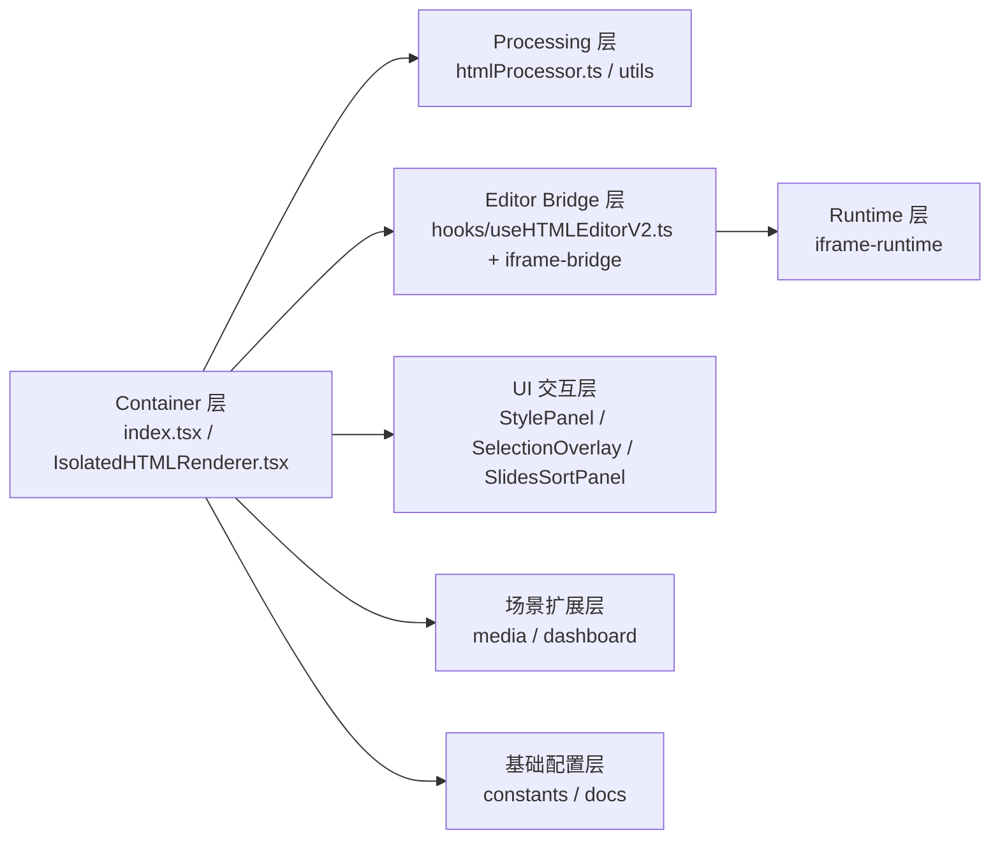
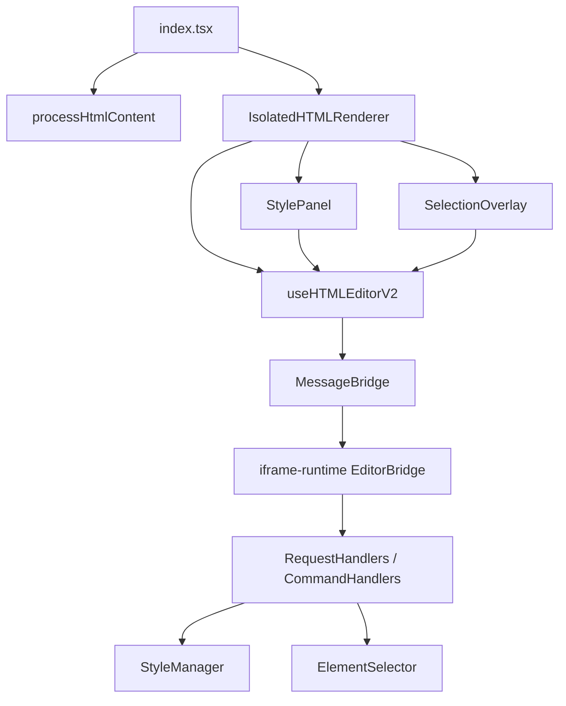

# HTML 目录模块地图（逐模块职责）

目标目录：`src/opensource/pages/superMagic/components/Detail/contents/HTML`

## 1. 总体分层图

## 2. 根级文件模块

| 模块 | 主要文件 | 作用 |
|---|---|---|
| 页面编排入口 | `index.tsx` | 聚合文件版本、内容预处理、渲染态/代码态/编辑态切换、保存回调注册。 |
| 隔离渲染器 | `IsolatedHTMLRenderer.tsx` | 承载 iframe 初始化、消息白名单、编辑工具条、选区叠加层、保存触发器。 |
| 资源预处理器 | `htmlProcessor.ts` | 解析 HTML，定位相对资源并替换为临时下载 URL，注入必要脚本与标记。 |
| 导出菜单 | `useExportMenuItems.tsx` | 统一导出源文件/PDF/PPT 的菜单项和按钮。 |
| 样式入口 | `styles.ts` | 根容器样式。 |

## 3. 子目录模块

| 目录 | 关键文件 | 作用 |
|---|---|---|
| `components/StylePanel` | `StylePanel.tsx`、`hooks/useSelectedElement.ts`、`controls/*` | 编辑工具栏与样式面板，负责把用户输入转成编辑命令。 |
| `components/SelectionOverlay` | `SelectionOverlay.tsx`、`hooks/useMoveHandle.ts`、`useResizeHandles.ts`、`useRotateHandle.ts` | 父窗口渲染选中框/悬停框，并处理拖拽/缩放/旋转/删除/复制交互。 |
| `components/SlidesSortPanel` | `index.tsx`、`hooks/useSlidesSort.ts` | PPT 场景下对 slide 顺序拖拽重排并落盘到 `magic.project.js`。 |
| `components/LogPanel` | `LogPanel.tsx` | 开发态查看 iframe runtime 日志（`GET_LOGS` / `CLEAR_LOGS`）。 |
| `hooks` | `useHTMLEditorV2.ts`、`useZoomControls.ts`、`useIframeScaling.ts` | 编辑生命周期、通信桥注入、缩放计算与手动缩放控制。 |
| `utils` | `fetchInterceptor.ts`、`mediaInterceptor.ts`、`full-content.ts`、`editing-script.ts` | 运行时注入脚本、fetch/XHR 拦截、内容拼装与兼容性工具。 |
| `iframe-bridge` | `bridge/MessageBridge.ts`、`types/messages.ts`、`stores/StylePanelStore.ts` | 主容器侧协议层与编辑状态仓库。 |
| `iframe-runtime` | `src/runtime/EditorRuntime.ts`、`handlers/*`、`managers/*` | iframe 内部编辑引擎，执行命令、维护历史、回传事件。 |
| `media` | `useMediaScenario.ts`、`utils.ts` | 音/视频场景附加逻辑（speaker 编辑、`magic.project.js` 更新）。 |
| `dashboard` | `DashboardIsolatedHTMLRenderer.tsx`、`utils.ts` | 数据看板场景的独立渲染与 `data.js` 同步更新。 |
| `constants` | `z-index.ts`、`portal.ts` | 编辑器层级与 portal 常量。 |
| `docs` | `multi-instance-improvements.md` 等 | 模块内部实现说明与重构记录。 |

## 4. 复杂度分级（建议优先级）

1. `iframe-runtime`：命令执行、撤销重做、元素状态恢复最复杂。
2. `iframe-bridge`：跨窗口协议、生命周期与超时治理。
3. `SelectionOverlay`：跨坐标系交互与批处理历史合并。
4. `StylePanel`：文本选择/多选元素两套样式更新路径并存。
5. `htmlProcessor + utils/fetchInterceptor`：资源替换与运行时请求拦截链路长。

## 5. 关键调用关系（阅读导航）

Sources: 资料来源 ：

src/opensource/pages/superMagic/components/Detail/contents/HTML/index.tsx
110-260
src/opensource/pages/superMagic/components/Detail/contents/HTML/IsolatedHTMLRenderer.tsx
750-1367
src/opensource/pages/superMagic/components/Detail/contents/HTML/htmlProcessor.ts
308-616
src/opensource/pages/superMagic/components/Detail/contents/HTML/useExportMenuItems.tsx
19-90
src/opensource/pages/superMagic/components/Detail/contents/HTML/components/StylePanel/StylePanel.tsx
32-340
src/opensource/pages/superMagic/components/Detail/contents/HTML/components/SelectionOverlay/SelectionOverlay.tsx
32-208
src/opensource/pages/superMagic/components/Detail/contents/HTML/components/SlidesSortPanel/index.tsx
17-169
src/opensource/pages/superMagic/components/Detail/contents/HTML/components/LogPanel/LogPanel.tsx
70-215
src/opensource/pages/superMagic/components/Detail/contents/HTML/hooks/useHTMLEditorV2.ts
148-640
src/opensource/pages/superMagic/components/Detail/contents/HTML/iframe-bridge/bridge/MessageBridge.ts
31-307
src/opensource/pages/superMagic/components/Detail/contents/HTML/iframe-runtime/src/runtime/EditorRuntime.ts
19-244
src/opensource/pages/superMagic/components/Detail/contents/HTML/media/useMediaScenario.ts
19-147
src/opensource/pages/superMagic/components/Detail/contents/HTML/dashboard/DashboardIsolatedHTMLRenderer.tsx
54-188
