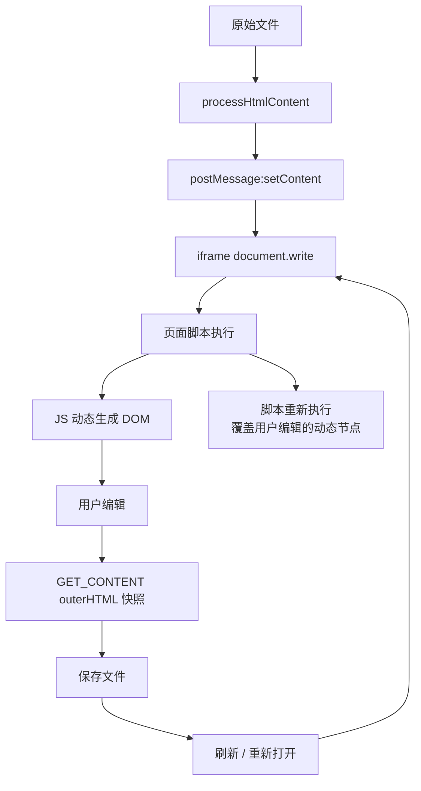
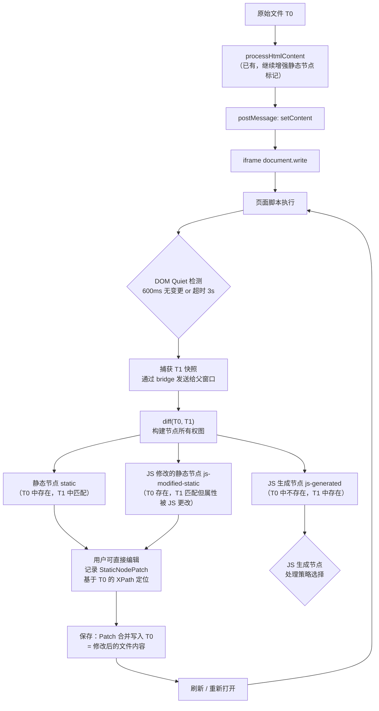
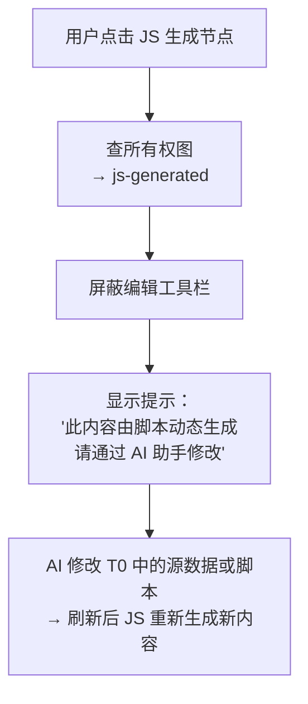
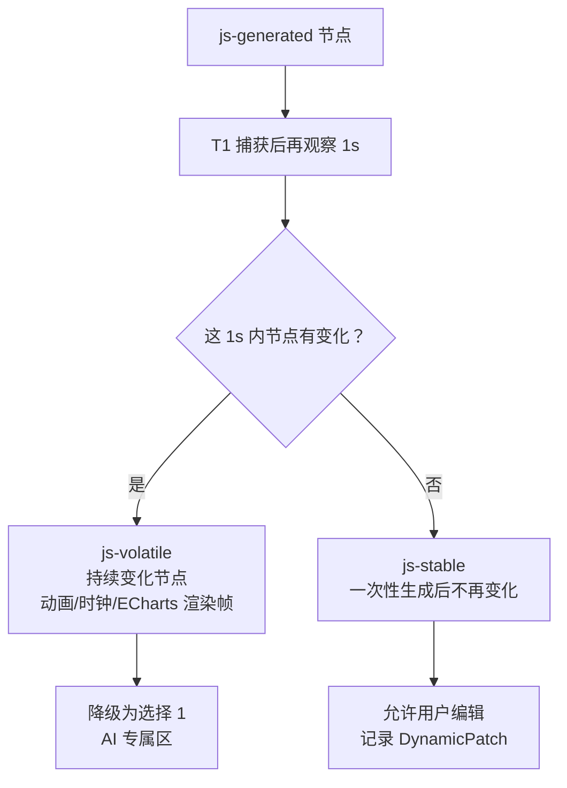
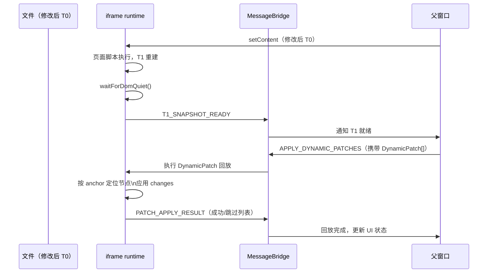

# HTML 在线编辑：动态 DOM 冲突解决方案(构思中)

本文为 SuperMagic HTML 在线编辑场景的动态 DOM 问题提供**唯一推荐方案**，基于"静态 HTML（T0）vs 脚本执行后 DOM（T1）diff"作为核心机制。

相关背景文档：

- [HTML 在线编辑重构分析与实施建议](./OnlineEditorRefactorGuide.md)
- [HTML 预处理引擎 (HtmlProcessor)](./HtmlProcessor.md)
- [核心渲染与通信设计 (IframeRenderer)](./IframeRenderer.md)

---

## 问题定义

### 现状冲突链路



### 两个核心问题

**问题 1：动态节点缺少预处理**

`processHtmlContent` 只处理原始 HTML 字符串，对 JS 运行时动态生成的节点（图表容器、媒体元素、业务脚本 append 的节点等）无法做资源路径替换和可编辑标记。

**问题 2：刷新后脚本重放覆盖用户编辑**

保存时将 `document.documentElement.outerHTML` 作为文件内容，但刷新后脚本重新执行，动态重建 DOM，覆盖用户在动态节点上的改动。这是当前最核心的痛点：**"已保存"不等于"刷新后可复现"**。

---

## 解决方案：双快照分治（方案 E）

### 核心思路

引入两个坐标系：

| | 定义 | 来源 |
|---|---|---|
| **T0** 静态基线 | AI 生成的原始 HTML 文件内容（脚本执行前） | 已有，`processHtmlContent` 的输入 |
| **T1** 动态结果 | 页面所有脚本执行稳定后的 DOM 快照 | 新增捕获 |

通过 `diff(T0, T1)` 建立**节点所有权图**，区分每个节点是"HTML 文件所有"还是"JS 脚本生成"。

**保存策略根本改变**：

- 旧策略：保存 `outerHTML`（混合了静态 + JS 动态内容）→ 刷新后脚本重跑覆盖动态内容
- 新策略：将用户对**静态节点**的修改合并写回 T0 文件 → 刷新后脚本从修改后的文件出发运行，用户改动天然保留

### 整体流程



---

## JS 生成节点的两种处理策略

这是整个方案中唯一需要做策略决策的部分。

### 策略背景

diff(T0, T1) 识别出 `js-generated` 节点后，我们需要决定：**用户能否编辑这些节点？编辑后如何在刷新时恢复？**

这里有两个选择：

---

### 选择 1：AI 专属区（禁止用户直接编辑）

**思路**：对 `js-generated` 节点，屏蔽所有用户编辑工具，引导用户通过 AI 来修改。



**适用场景**：

- ECharts / D3 图表（JS 生成的 SVG 路径/圆弧/坐标，用户手改毫无意义）
- 动画、轮播、时钟等持续动态更新的内容
- 通过 JS fetch 数据后渲染的列表、卡片

**优点**：

- 实现简单，只需要在选中逻辑中查一次所有权图
- 语义清晰，用户知道"这里是 AI 的地盘"
- 不需要任何 Patch 存储和回放逻辑

**缺点**：

- 如果 JS 生成的节点包含用户希望直接修改的文字/图片，体验受损

---

### 选择 2：动态 Patch 回放（支持用户编辑 JS 生成节点）

**思路**：对 `js-generated` 节点，允许用户编辑，但将修改记录为 Dynamic Patch（基于 T1 的结构锚点），在刷新后 DOM 稳定时重放。

#### 子分类：稳定 vs 易变

在执行 Dynamic Patch 之前，需要进一步区分 JS 生成节点的稳定性：



#### DynamicPatch 结构

```typescript
interface DynamicPatch {
  // T1 中的结构锚点（多重 fallback，越靠前越稳定）
  anchor: {
    contentHash?: string      // 节点文本内容 hash（如果文字没变，最稳定）
    parentXPath: string       // 父节点在 T1 中的 XPath
    nthChild: number          // 在父节点中的位置
    tagName: string           // 标签名兜底
  }
  changes: Array<{
    type: 'text' | 'attribute' | 'style' | 'innerHTML'
    key?: string
    value: string
  }>
  failStrategy: 'skip-silent' | 'skip-warn'
}
```

#### 回放流程



**锚点失效处理**：

| 情况 | 处理 |
|---|---|
| contentHash 匹配 | 精确定位，应用 Patch |
| Hash 不匹配但 parentXPath + nthChild 匹配 | 位置定位，应用 Patch，记录警告 |
| 全部失配 | 跳过此 Patch，通知用户"部分动态内容无法恢复" |

---

### 策略选择建议

| 维度 | 选择 1：AI 专属区 | 选择 2：Dynamic Patch 回放 |
|---|---|---|
| 实施成本 | 低（1 周） | 中高（3~4 周） |
| 用户编辑体验 | 有限制，需要 AI 介入 | 完整，支持直接编辑 |
| 回放可靠性 | 100%（不需要回放） | 取决于锚点稳定性（稳定节点约 90%+） |
| 适合场景 | 图表/动画/数据渲染 | 一次性 JS 生成的文字/图片 |
| 推荐时机 | Phase 1 先上，兜住兜底 | Phase 2 按需扩展 |

**建议**：先实施选择 1，通过埋点统计"用户在 AI 专属区的点击频率"，如果高频，再投入选择 2 的开发。对于 ECharts / 动画类节点，选择 1 永远是正确答案。

---

## 分阶段实施计划

### Phase 0：建立 T0/T1 双快照（1~2 周）

目标：让父窗口在每次编辑会话开始时，能同时持有 T0 和 T1。

- 在 iframe runtime 注入 `waitForDomQuiet()`，捕获 T1 后通过 bridge 发送给父窗口
- 父窗口存储 T0（已有）和 T1（新增）到编辑会话上下文

```javascript
// iframe runtime 启动阶段（setContent 执行完毕后）
function waitForDomQuiet(onQuiet, quietMs = 600, maxWaitMs = 3000) {
  let timer = null
  const started = Date.now()
  const observer = new MutationObserver(() => {
    clearTimeout(timer)
    if (Date.now() - started >= maxWaitMs) {
      observer.disconnect()
      onQuiet(document.documentElement.outerHTML, 'timeout')
      return
    }
    timer = setTimeout(() => {
      observer.disconnect()
      onQuiet(document.documentElement.outerHTML, 'quiet')
    }, quietMs)
  })
  observer.observe(document.documentElement, {
    childList: true, subtree: true, attributes: true, characterData: true
  })
  timer = setTimeout(() => {
    observer.disconnect()
    onQuiet(document.documentElement.outerHTML, 'initial-quiet')
  }, quietMs)
}

waitForDomQuiet((t1Html, reason) => {
  bridge.emit('T1_SNAPSHOT_READY', { html: t1Html, reason })
})
```

### Phase 1：构建节点所有权图（1~2 周）

目标：父窗口能告知每个节点的所有权类型。

节点匹配优先级：

```
1. 相同 id 属性
2. 相同 data-original-path（已有资源标记，天然稳定）
3. 相同 tag + class + 父节点内 nth-child 位置
4. 相同 tag + 文本内容 hash
```

匹配结果：

```typescript
type NodeType = 'static' | 'js-generated' | 'js-modified-static' | 'js-removed'
```

Phase 1 同步任务：**统一两条清理链路**

> 当前存在两套独立的 HTML 清理实现：
> - 父窗口侧：`editing-script.ts:2314` `getCleanDocumentStringOnFocus()`
> - iframe 内侧：`requestHandlers.ts:39` `ContentCleaner.cleanDocument()`
>
> 这两个实现产出不同，必须在 Phase 2 之前合并为一个统一实现，确立唯一的"干净 HTML"定义。

### Phase 2：改写保存策略（2~3 周）

目标：`GET_CONTENT` 不再返回 outerHTML 快照，而是返回 T0 + StaticPatch 合并后的 HTML 字符串。

```typescript
interface StaticNodePatch {
  xpathInT0: string    // 节点在 T0 中的 XPath（稳定，T0 文件不变则永远有效）
  changes: Array<{
    type: 'text' | 'attribute' | 'style' | 'innerHTML'
    key?: string
    value: string      // 已恢复 data-original-path 的原始路径
  }>
}

// 保存时：将 Patch 应用到 T0 字符串，产出新的文件内容
async function buildSaveContent(t0Html: string, patches: StaticNodePatch[]): Promise<string> {
  const parser = new DOMParser()
  const doc = parser.parseFromString(t0Html, 'text/html')
  for (const patch of patches) {
    const node = evaluateXPath(doc, patch.xpathInT0)
    if (!node) continue
    for (const change of patch.changes) {
      applyChange(node, change)
    }
  }
  return serializeToHtmlString(doc)
}
```

**这一步完成后，刷新覆盖问题从根本解决。**

### Phase 3：JS 生成节点处理（1~2 周）

目标：实施"选择 1：AI 专属区"，兜住所有 JS 生成节点。

- 用户点击 `js-generated` 节点时，查所有权图
- 屏蔽编辑工具栏，展示 AI 编辑引导提示
- 为 `js-volatile` 节点（ECharts、动画）永久标记为 AI 专属

同步完成：为 JS 生成节点补资源替换标记（使用 MutationObserver，范围缩小到仅 `js-generated` 节点，避免 ECharts 误处理）

### Phase 4（按需）：Dynamic Patch 回放

目标：对 `js-stable-generated` 节点支持用户编辑和刷新后回放（选择 2）。

- 先通过埋点收集"用户在 AI 专属区的点击频率"，确认有真实需求后再投入
- 实现 DynamicPatch 存储、T1 重建后的回放逻辑、锚点失效的降级处理

---

## 与现有架构的关系

| 现有模块 | 变更说明 |
|---|---|
| `processHtmlContent` | 继续增强静态节点标记（`data-original-path` 等），无需大改 |
| `GET_CONTENT` handler | 核心改造点：从 outerHTML 快照改为 T0+Patch 合并输出 |
| `messenger-content.ts` | 新增 `T1_SNAPSHOT_READY` 事件处理，新增 `APPLY_DYNAMIC_PATCHES` 请求 |
| `getCleanDocumentStringOnFocus` | Phase 1 与 `ContentCleaner.cleanDocument` 合并统一 |
| `MutationObserver` 逻辑 | 范围缩小到仅 `js-generated` 节点，移除全量监听 |
| 选中与工具栏逻辑 | Phase 3 新增：查所有权图，对 `js-generated` 节点屏蔽编辑工具 |

---

## 验证与回归建议

### 核心回归场景

| 场景 | 验证点 | 对应 Phase |
|---|---|---|
| 编辑文本/样式/图片后刷新 | 改动是否仍在 | Phase 2 |
| 点击 ECharts 图表 | 是否显示 AI 引导而非编辑工具 | Phase 3 |
| 点击一次性 JS 生成文字 | 是否可编辑，刷新后是否保留 | Phase 4 |
| 高频动态更新页面 | DOM Quiet 是否在超时兜底内正确捕获 T1 | Phase 0 |
| AI 重新生成内容后 | 原有 StaticPatch 是否正确失效（不回放到新 T0） | Phase 2 |
| 资源路径替换 | JS 生成节点的图片/视频路径是否被正确替换 | Phase 3 |

### 关键指标

- **刷新后编辑保留率**（目标 >95%，针对静态节点编辑）
- **DOM Quiet 超时率**（超时说明页面有持续动画，应标记对应节点为 `js-volatile`）
- **StaticPatch 应用成功率** vs **DynamicPatch 应用成功率**（分开统计）
- **节点所有权图命中率**（匹配成功的节点占比，目标 >85%）

---

## Sources: 资料来源：

- `src/opensource/pages/superMagic/components/Detail/contents/HTML/utils/messenger-content.ts` (130-145)
- `src/opensource/pages/superMagic/components/Detail/contents/HTML/utils/editing-script.ts` (2314-2370, 2437-2495)
- `src/opensource/pages/superMagic/components/Detail/contents/HTML/iframe-runtime/src/handlers/requestHandlers.ts` (37-57)
- `src/opensource/pages/superMagic/components/Detail/contents/HTML/htmlProcessor.ts` (308-380)
- `src/opensource/pages/superMagic/components/Detail/contents/HTML/utils/nested-iframe-content.ts` (5-12, 161-205)
- `src/opensource/pages/superMagic/components/Detail/contents/HTML/utils/mediaInterceptor.ts` (234-241, 255-281)
