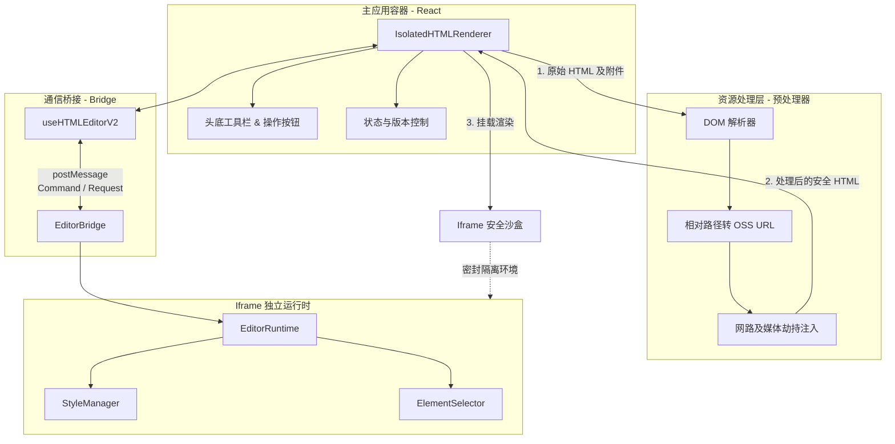

# 超级麦吉 HTML 渲染模块总览

`HTML` 模块位于 `src/opensource/pages/superMagic/components/Detail/contents/HTML/`，是超级麦吉（SuperMagic）核心能力之一，负责在隔离的环境下安全地渲染和编辑用户侧或AI生成的 HTML/PPT 内容。

## 🎯 业务定位与产品理念

在超级麦吉面对非技术人员（小白）需要进行网页或结构化数据收集的场景下，**零构建渲染**是该模块的核心诉求：它不再像常规开发那样需要漫长的打包部署流程，而是直接从对象存储读取原始制品，配合前端 Hook 拦截及路由伪装机制，实现**秒级生产级网站体验**（即开即用、所见即所得）。

围绕这一诉求，HTML 内容的渲染必须满足以下几个核心基准：

1. **安全性（同源隔离）**：执行包含潜在不受信任 JavaScript 脚本的定制 HTML 必须在强隔离的 Sandbox 环境（如无 Cookie 权限的 `iframe`）中运行，防止 XSS 和主文档污染。
2. **丰富的编辑与交互能力**：在隔离渲染的同时，需要支持用户对渲染内的文本和样式进行修改（在线编辑），以及圈选、缩放等富文本/画板级别的交互。
3. **人机协同：元素级 AI 编辑（指哪改哪）**：通过底层事件委托与节点识别，捕获用户鼠标选中的精准 DOM 树路径与 XPath 元数据，使得大模型能够突破视觉盲区，一句话即可精准替换或修改网页特定部位，彻底解决宽泛描述带来的幻觉问题。
4. **资源全链路 Hook 拦截**：因为安全限制和跨端设计，HTML 内部指向的本地资源映射无法直接展示，必须由预编译器或请求劫持器动态转换为 OSS（对象存储服务）的真实 URL 路径。

## 🏗️ 架构组成

该模块采用**主应用容器（Host）**和**沙盒运行时（Iframe Runtime）**分离的架构：

1. **容器层（`index.tsx` & `IsolatedHTMLRenderer.tsx`）**
    - 作为 React 组件挂载在主应用中，提供通用功能项（头部工具栏、操作按钮等）。
    - 管理加载状态、文件历史版本（借助 `useFileData` 等 Hook）。
    - 维护一个真正的 `iframe` 容器用于注入安全的 HTML 内容。

2. **资源处理与预编译器（`htmlProcessor.ts`）**
    - 负责在真实注入 `iframe` 前对 HTML 源码执行预处理。
    - 分析 `link`, `img`, `script`, `audio`, `video` 等各种静态媒体标签。
    - 解析局域路径并在渲染前请求 OSS 拿到带有 Token 的临时下载 URL（URL替换）。
    - 嗅探特定业务特征（如 PPT 的 `slides` 数据提取、各类注入脚本埋点等）。

3. **沙盒通信桥梁（`iframe-bridge/`）**
    - 提供主容器如何安全而有效地与 `iframe` 内部互相收发消息的基础 Hook 层封装。
    - 定义标准的通讯数据结构，支持请求响应模型（Request-Response）以及单边命令广播（Command）。

4. **独立运行时引擎（`iframe-runtime/`）**
    - 作为一个完全独立的子工程编译（有着独立 `package.json`），其打包出的产物作为环境基座运行在隔离的 `iframe` 里。
    - 彻底掌控 `iframe` 内部的 DOM 树选择、直接进行 HTML 的 `contentEditable` 样式操作支持（如设置颜色、字体大小等），将内部用户的光标/点选动作反馈给主容器。

### 架构全景图

## 🧱 相关文档

- [HTML 编辑器自顶向下学习路径](./HTMLEditorTopDownGuide.md) - 按“入口 -> 协议 -> 运行时 -> 交互 -> 资源”顺序快速建立全景认知。
- [HTML 模块地图（逐模块职责）](./ModuleMap.md) - 覆盖 `HTML` 目录下各子模块作用、依赖关系和复杂度分级。
- [Iframe 核心渲染与通信设计](./IframeRenderer.md) - 解析沙盒模型及主客双向通信桥基建。
- [HTML 字符串预处理引擎](./HtmlProcessor.md) - 详解静态资源挂载、网络请求代理与替换策略。
- [Iframe Bridge 深度解析](./IframeBridgeDeepDive.md) - 主容器通信协议、生命周期与实例隔离。
- [Iframe Runtime 深度解析](./IframeRuntimeDeepDive.md) - 运行时命令执行、历史栈与元素选择机制。
- [SelectionOverlay 深度解析](./SelectionOverlayDeepDive.md) - 父窗口叠加层的拖拽/缩放/旋转协同机制。
- [StylePanel 深度解析](./StylePanelDeepDive.md) - 样式面板命令编排与多选/文本选择路径。
- [在线编辑重构分析与实施建议](./OnlineEditorRefactorGuide.md) - 聚焦在线编辑链路、重构必要性与分阶段改造方案。
- [在线编辑重构新人上手计划](./RefactorOnboardingPlan.md) - 面向新同学的分阶段学习与实践路径。
- [模块贡献者分析](./Contributors.md) - 以提交与改动维度观察模块演进脉络。

Sources: 资料来源 ：

src/opensource/pages/superMagic/components/Detail/contents/HTML/index.tsx
1-200
src/opensource/pages/superMagic/components/Detail/contents/HTML/IsolatedHTMLRenderer.tsx
