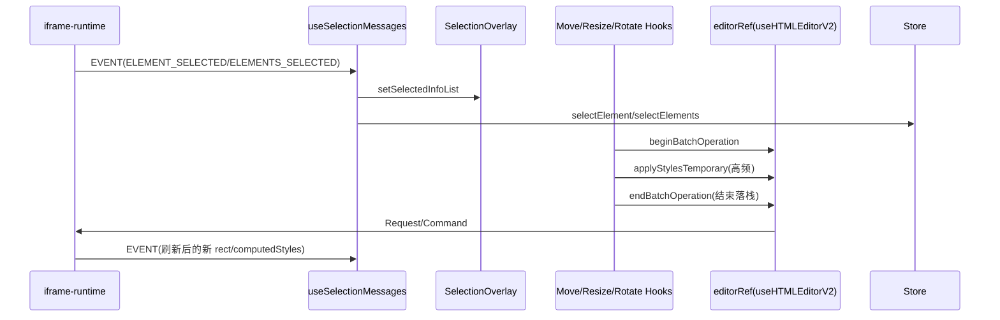

# SelectionOverlay 深度解析（父窗口交互叠加层）

`SelectionOverlay` 的定位是“渲染在父窗口、映射 iframe 元素”的交互层，负责选框绘制和拖拽/缩放/旋转等复杂手势。

## 1. 架构角色

1. `SelectionOverlay.tsx`：主容器，组合消息同步、滚动缩放同步、handles 子系统。
2. `useSelectionMessages`：消费 iframe 事件，驱动本地选中态与 StylePanelStore。
3. `useMoveHandle / useResizeHandles / useRotateHandle`：交互手势实现与批操作提交。

## 2. 数据流

## 3. 为什么交互不卡顿

1. 拖拽/缩放/旋转过程中，先乐观更新父窗口选框，再异步推送临时样式。  
2. 高频阶段不写历史，只在 `stop` 时 `endBatchOperation` 写一条历史。  
3. 操作结束后 `refreshSelectedElement`，以 iframe 真值回填 rect 与 computed styles。

## 4. 三类手势关键细节

1. 移动（Move）  
使用 `position: relative + top/left`，并做边界约束，保证元素至少部分可见。

2. 缩放（Resize）  
按 handle 方向计算 `width/height`，最小尺寸保护，RAF 合并临时更新。

3. 旋转（Rotate）  
维护连续角度，支持 `Shift` 吸附 15 度，避免跨 360° 时视觉跳变。

## 5. 与 Store 的联动原则

1. 选中事件必须同步到 `StylePanelStore`，保证工具栏读到最新样式。  
2. 切换选中元素前会尝试 `disableTextEditing`，避免旧元素残留编辑态。  
3. 多选态与单选态共存：overlay 用 `selectedInfoList`，工具栏用 store 的 selector 列表。

Sources: 资料来源 ：

src/opensource/pages/superMagic/components/Detail/contents/HTML/components/SelectionOverlay/SelectionOverlay.tsx
32-209
src/opensource/pages/superMagic/components/Detail/contents/HTML/components/SelectionOverlay/hooks/useSelectionMessages.ts
18-221
src/opensource/pages/superMagic/components/Detail/contents/HTML/components/SelectionOverlay/hooks/useSelectionHandles.ts
23-202
src/opensource/pages/superMagic/components/Detail/contents/HTML/components/SelectionOverlay/hooks/useMoveHandle.ts
22-235
268-491
src/opensource/pages/superMagic/components/Detail/contents/HTML/components/SelectionOverlay/hooks/useResizeHandles.ts
21-135
156-263
src/opensource/pages/superMagic/components/Detail/contents/HTML/components/SelectionOverlay/hooks/useRotateHandle.ts
21-90
151-259
292-340
