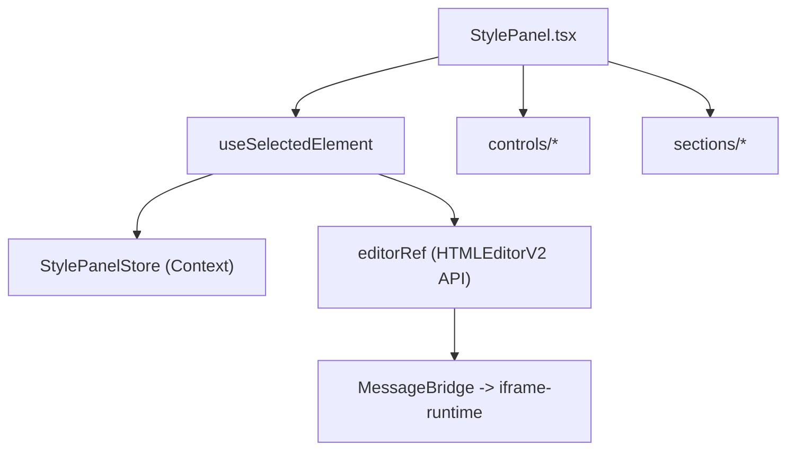

# StylePanel 深度解析（样式工具栏与状态中枢）

`StylePanel` 是“编辑意图 -> 编辑命令”的前端编排层，本身不改 DOM，而是通过 `editorRef` 调度 runtime 命令。

## 1. 模块结构

## 2. 单选/多选/文本选择三种模式

1. 单选元素：直接读取 `selectedElement.computedStyles` 并写回单元素命令。
2. 多选元素：从 `selectedElements` 取 selector 数组，使用 `setBatchStylesMultiple`。
3. 文本选择：走 `applyTextStyle(containerSelector, styles)`，避免误伤整元素。

## 3. 核心更新路径

1. `useSelectedElement.updateStyle`  
自动识别“文本选择 vs 元素选择”，并在单选时回拉 computed styles 以更新 UI。

2. `StylePanel.handleStyleChange`  
统一入口，命令发送后触发 `onStyleChange` 回调供外层联动。

3. 字号增减  
使用 `adjustFontSizeRecursive`，确保“容器及子元素”一次操作可撤销。

## 4. 状态仓库设计（StylePanelStore）

1. 同时维护 `selectedElement` 与 `selectedElements`，避免模式切换时互相污染。  
2. `historyState` 与 runtime 的 `HISTORY_STATE_CHANGED` 事件对齐。  
3. `textSelection` 独立建模，支持“部分文本样式编辑”的 UI 正确性。  
4. 通过 Context Provider 实现实例隔离，避免多 iframe 之间串态。

## 5. 工程注意点

1. 样式按钮 disable 条件必须同时看单选与多选状态。  
2. 多选不强行同步统一 computed style，避免“混合值”误导用户。  
3. 文本编辑期间刷新策略需谨慎，避免 focus 丢失导致输入中断。

Sources: 资料来源 ：

src/opensource/pages/superMagic/components/Detail/contents/HTML/components/StylePanel/StylePanel.tsx
32-123
146-221
223-340
src/opensource/pages/superMagic/components/Detail/contents/HTML/components/StylePanel/hooks/useSelectedElement.ts
10-55
98-155
160-210
src/opensource/pages/superMagic/components/Detail/contents/HTML/iframe-bridge/stores/StylePanelStore.ts
99-177
182-255
src/opensource/pages/superMagic/components/Detail/contents/HTML/iframe-bridge/contexts/README.md
1-45
