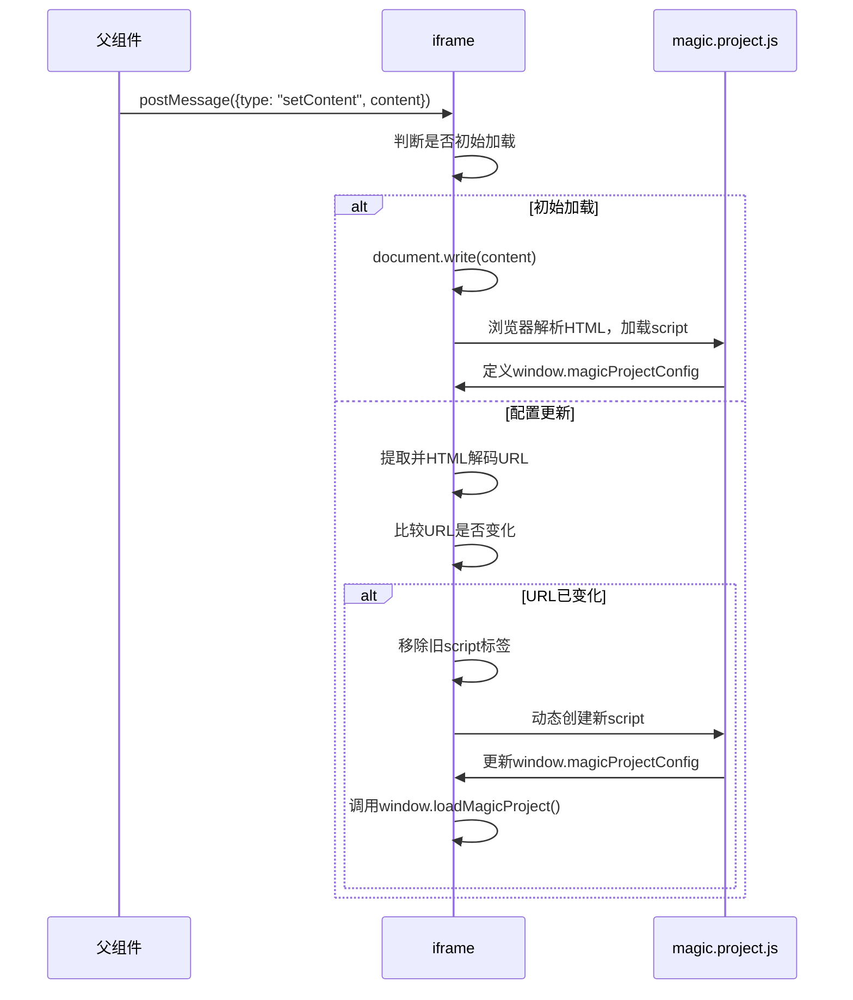

# Magic.project.js 动态重载问题修复文档

## 📌 问题概述

### 问题表现
当编辑 `magic.project.js` 配置文件后，媒体场景HTML页面无法正确重新渲染：
- 页面内容显示为空白或部分渲染失败
- `display:none` 等CSS样式控制失效
- 必须手动刷新页面才能恢复正常

### 影响范围
- **场景**：所有包含 `magic.project.js` 的媒体场景（音频/视频）
- **触发条件**：编辑 `magic.project.js` 配置文件
- **用户体验**：严重影响，需要手动刷新

### 技术背景
- React 18 + iframe隔离渲染 + postMessage通信
- iframe内使用 `document.write()` 进行初始渲染
- `magic.project.js` URL包含TOS临时凭证签名（每次更新都会变化）

---

## 🏗️ 技术架构

### 核心渲染流程


### 关键文件
- **`messenger-content.ts`** - iframe内脚本，处理内容更新（本次修复点）
- **`IsolatedHTMLRenderer.tsx`** - iframe容器组件
- **`HTML/index.tsx`** - React父组件

---

## 🔍 问题本质

### 两个核心问题

#### 问题1：`document.write()` 的局限性

当页面 `readyState = complete` 时，使用 `document.write()` 写入的 `<script src="...">` 标签：
1. ✅ Script 标签被写入 DOM
2. ❌ **浏览器不会发起网络请求**
3. ❌ Script 永远不会执行

**验证方法**：
```javascript
// 在已加载完成的页面上
document.write('<script src="https://example.com/test.js"></script>');
// script 标签存在于DOM中，但不会触发 load 或 error 事件
// 既不会加载，也不会执行
```

#### 问题2：HTML实体编码未解码

从HTML字符串regex提取的URL包含HTML实体编码（如 `&amp;`），但直接赋值给 `script.src` 时，**浏览器不会自动HTML解码**：

```javascript
// HTML字符串中的URL
<script src="https://example.com?a=1&amp;b=2"></script>

// Regex提取的URL（保持HTML编码）
var url = "https://example.com?a=1&amp;b=2";

// 赋值给script.src（浏览器不会解码）
newScript.src = url;
// 浏览器实际请求：https://example.com?a=1&amp;b=2 ❌
// TOS服务器签名验证失败，返回403

// 正确的URL应该是
// https://example.com?a=1&b=2 ✅
```

**对比场景**：
```javascript
// 场景1：浏览器解析HTML时
<script src="https://example.com?a=1&amp;b=2"></script>
// 浏览器自动解码src属性，实际请求：https://example.com?a=1&b=2 ✅

// 场景2：JavaScript动态创建
newScript.src = "https://example.com?a=1&amp;b=2";
// 浏览器不解码，原样发送：https://example.com?a=1&amp;b=2 ❌
```

### 问题链
```
1. magic.project.js URL变化
   ↓
2. iframe接收新HTML（包含&amp;编码的URL）
   ↓
3. 尝试用document.write()更新（readyState=complete）
   ↓
4. 浏览器不发起script加载请求 ❌
   ↓
5. 改为动态创建script，但URL未解码
   ↓
6. 请求错误的URL（带&amp;）
   ↓
7. TOS服务器签名验证失败，返回403
   ↓
8. Script加载失败，页面渲染异常
```

### 为什么手动刷新能恢复？
- 手动刷新时，浏览器直接解析HTML文档
- `<script src="...&amp;...">` 由HTML解析器处理
- 浏览器自动解码 `&amp;` 为 `&`
- 请求正确的URL，script成功加载

### TOS签名机制
```javascript
// magic.project.js URL 示例
https://example.com/magic.project.js?
  X-Tos-Algorithm=TOS4-HMAC-SHA256&
  X-Tos-Credential=...&
  X-Tos-Date=20260206T034132Z&
  X-Tos-Signature=cd76ac9422cd86bbbf2bae4c385e6fa0c16b53324dd644a71918b4e39020d367
```

- `X-Tos-Signature` 是对整个URL的HMAC签名
- URL中任何字符改变都会导致签名验证失败
- 在HTML中必须编码为 `&amp;`，但请求时必须是 `&`

---

## 💡 解决方案

### 核心思路
1. **避免使用 `document.write()` 更新外部script**：在非初始加载场景，改为动态创建script标签
2. **HTML解码提取的URL**：使用 `textarea` 元素自动解码HTML实体

### 修改位置
**文件**：`src/opensource/pages/superMagic/components/Detail/contents/HTML/utils/messenger-content.ts`

### 完整代码
```javascript
function handleMessage(event) {
  try {
    if (event.data && event.data.type === "setContent") {
      var isInitialLoad = document.scripts.length <= 2;
      
      if (!isInitialLoad) {
        // Extract magic.project.js URL from old and new content
        
        // 从DOM元素直接读取src属性（浏览器已解码）
        var oldScript = document.querySelector('script[data-original-path="magic.project.js"]');
        var oldMagicProjectUrl = oldScript ? oldScript.src : null;
        
        // 从HTML字符串提取URL
        var extractMagicProjectUrl = function(htmlContent) {
          // 支持两种属性顺序
          var match = htmlContent.match(/<script[^>]+src="([^"]+)"[^>]*data-original-path="magic\.project\.js"/);
          if (!match) {
            match = htmlContent.match(/<script[^>]+data-original-path="magic\.project\.js"[^>]*src="([^"]+)"/);
          }
          return match ? match[1] : null;
        };
        var newMagicProjectUrl = extractMagicProjectUrl(event.data.content);
        
        // ✅ 关键修复：HTML解码提取的URL
        if (newMagicProjectUrl) {
          var textarea = document.createElement('textarea');
          textarea.innerHTML = newMagicProjectUrl;
          newMagicProjectUrl = textarea.value;
        }
        
        // 比较URL是否变化
        if (oldMagicProjectUrl && newMagicProjectUrl && oldMagicProjectUrl !== newMagicProjectUrl) {
          // 移除旧script
          var oldScriptInHead = document.querySelector('script[data-original-path="magic.project.js"]');
          if (oldScriptInHead && oldScriptInHead.parentNode) {
            oldScriptInHead.parentNode.removeChild(oldScriptInHead);
          }
          
          // 创建新script
          var newScript = document.createElement('script');
          newScript.src = newMagicProjectUrl; // 现在是正确解码的URL
          newScript.setAttribute('data-original-path', 'magic.project.js');
          
          newScript.onload = function() {
            // 重新渲染依赖config的UI组件
            if (typeof window.loadMagicProject === 'function') {
              window.loadMagicProject(window.magicProjectConfig);
            }
            window.parent.postMessage({ type: "contentLoaded" }, "*");
          };
          
          newScript.onerror = function(e) {
            // Fallback: 请求完全重载
            window.parent.postMessage({ type: "requestReload", content: event.data.content }, "*");
          };
          
          document.head.appendChild(newScript);
          return;
        } else {
          // URL未变化，忽略更新
          return;
        }
      }
      
      // 初始加载使用document.write()
      document.open();
      document.write(event.data.content);
      document.close();
      
      // 重新绑定事件监听器
      setupMessageListener();
      setupClickListener();
      setupKeyboardListener();
      setupDOMLoadListeners();
      applyAnimationState();
      
      window.parent.postMessage({ type: "contentLoaded" }, "*");
    }
    // ... 其他消息类型处理
  } catch (error) {
    console.error("处理消息时出错:", error);
  }
}
```

### 关键改动说明

**1. 区分初始加载和更新**
```javascript
var isInitialLoad = document.scripts.length <= 2;
```

**2. 提取URL时兼容两种属性顺序**
```javascript
var extractMagicProjectUrl = function(htmlContent) {
  var match = htmlContent.match(/<script[^>]+src="([^"]+)"[^>]*data-original-path="magic\.project\.js"/);
  if (!match) {
    match = htmlContent.match(/<script[^>]+data-original-path="magic\.project\.js"[^>]*src="([^"]+)"/);
  }
  return match ? match[1] : null;
};
```

**3. HTML解码URL（关键修复）**
```javascript
if (newMagicProjectUrl) {
  var textarea = document.createElement('textarea');
  textarea.innerHTML = newMagicProjectUrl; // 触发HTML解析
  newMagicProjectUrl = textarea.value;     // 获取解码后的值
}
```

**4. 动态替换script标签**
```javascript
// 移除旧script
oldScriptInHead.parentNode.removeChild(oldScriptInHead);

// 创建新script（使用解码后的URL）
var newScript = document.createElement('script');
newScript.src = newMagicProjectUrl;
newScript.setAttribute('data-original-path', 'magic.project.js');
document.head.appendChild(newScript);
```

---

## ✅ 修复效果

### Before（修复前）
```
编辑magic.project.js → 页面无法更新 → 必须手动刷新
```

### After（修复后）
```
编辑magic.project.js → 页面自动更新 → 状态完全保留
```

### 验证清单
- [x] 打开媒体场景HTML页面（音频/视频）
- [x] 编辑 `magic.project.js`，修改 `metadata.speakers`
- [x] 页面自动更新，显示新的说话人信息
- [x] `display:none` 等样式控制正常
- [x] 无需手动刷新
- [x] 页面播放状态保持不变

---

## 🔧 技术要点

### 1. HTML实体解码方法

**使用 `textarea` 元素（推荐）**：
```javascript
function decodeHtml(html) {
  var textarea = document.createElement('textarea');
  textarea.innerHTML = html;
  return textarea.value;
}
```

**原理**：浏览器的HTML解析器会自动解码 `textarea.innerHTML`，然后通过 `value` 获取解码后的文本。

### 2. 浏览器行为差异

**HTML解析**（自动解码）：
```html
<script src="https://example.com?a=1&amp;b=2"></script>
<!-- 浏览器请求：https://example.com?a=1&b=2 ✅ -->
```

**JavaScript操作**（不解码）：
```javascript
newScript.src = "https://example.com?a=1&amp;b=2";
// 浏览器请求：https://example.com?a=1&amp;b=2 ❌
```

### 3. `document.write()` 的局限性

- ✅ 初始加载（`readyState = loading`）：正常工作
- ❌ 已加载完成（`readyState = complete`）：外部script不会加载

### 4. 动态script加载最佳实践

```javascript
// 移除旧script
oldScript.parentNode.removeChild(oldScript);

// 创建新script
var newScript = document.createElement('script');
newScript.src = decodedUrl; // 使用解码后的URL
newScript.onload = function() { /* 加载成功 */ };
newScript.onerror = function() { /* 加载失败 */ };
document.head.appendChild(newScript);
```

---

## 📖 参考资料

### 相关技术文档
- [MDN: document.write()](https://developer.mozilla.org/en-US/docs/Web/API/Document/write)
- [MDN: HTML Entities](https://developer.mozilla.org/en-US/docs/Glossary/Entity)
- [MDN: Dynamic Script Loading](https://developer.mozilla.org/en-US/docs/Web/API/HTMLScriptElement)

### 相关代码文件
- `src/opensource/pages/superMagic/components/Detail/contents/HTML/utils/messenger-content.ts` (修改点)
- `src/opensource/pages/superMagic/components/Detail/contents/HTML/IsolatedHTMLRenderer.tsx`

---

## ✍️ 文档信息

- **创建日期**：2026-02-06
- **版本**：2.0（精简版）
- **标签**：bug修复, iframe, HTML解码, 动态script
- **状态**：已完成
