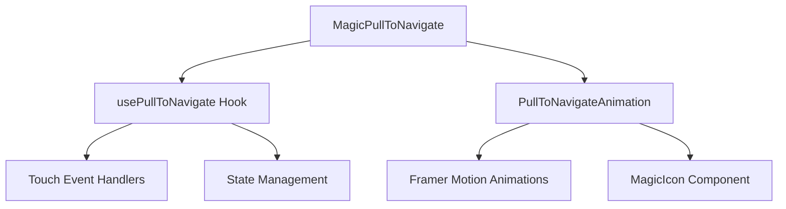

# MagicPullToNavigate 组件架构

## 目录结构

```
MagicPullToNavigate/
├── index.tsx                           # 主组件入口
├── hooks/
│   └── usePullToNavigate.ts           # 下拉导航逻辑 Hook
├── animations/
│   └── PullToNavigateAnimation.tsx    # 下拉导航动画组件
├── demo.tsx                           # 使用示例
├── README.md                          # 组件文档
└── ARCHITECTURE.md                    # 架构说明（本文件）
```

## 组件关系



## 设计原则

### 1. 组件化封装
- **主组件** (`index.tsx`): 负责整体布局和组件组合
- **Hook** (`hooks/usePullToNavigate.ts`): 负责触摸事件处理和状态管理
- **动画组件** (`animations/PullToNavigateAnimation.tsx`): 负责视觉效果和动画

### 2. 关注点分离
- **逻辑层**: Hook 处理所有触摸交互和状态管理
- **视图层**: 动画组件专注于视觉效果
- **组合层**: 主组件负责将逻辑和视图组合

### 3. 可复用性
- Hook 可以独立使用，适配其他UI组件
- 动画组件可以接收外部状态，灵活控制
- 主组件提供完整的开箱即用体验

## 数据流

### 1. 用户交互流程
```
用户触摸 → Hook监听事件 → 计算下拉距离 → 更新状态 → 动画组件响应 → 视觉反馈 → 触发导航
```

### 2. 状态管理
```typescript
interface PullToNavigateState {
  isActive: boolean      // 是否激活下拉状态
  pullDistance: number   // 下拉距离百分比
  isRefreshing: boolean  // 是否正在导航
}
```

### 3. 事件处理
- `touchstart`: 记录初始触摸位置
- `touchmove`: 计算下拉距离，更新状态
- `touchend`: 判断是否触发导航，执行回调

## 技术栈

### 核心依赖
- **React**: 组件基础框架
- **TypeScript**: 类型安全
- **Framer Motion**: 动画效果
- **antd-style**: 样式管理

### 外部依赖
- **@tabler/icons-react**: 图标库
- **MagicIcon**: 项目内部图标组件

## 性能优化

### 1. 组件优化
- 使用 `memo` 避免不必要的重渲染
- 使用 `useCallback` 缓存事件处理函数
- 使用 `useRef` 避免状态更新导致的重新绑定

### 2. 动画优化
- 使用 `transform` 属性进行动画，避免重排
- 合理设置动画时长和缓动函数
- 使用 `AnimatePresence` 优化进入/退出动画

### 3. 事件优化
- 合理设置 `passive` 选项
- 在必要时使用 `preventDefault`
- 及时清理事件监听器

## 扩展性

### 1. 自定义动画
可以通过替换 `PullToNavigateAnimation` 组件来实现自定义动画效果：

```tsx
<MagicPullToNavigate
  onNavigate={handleNavigate}
  customAnimation={MyCustomAnimation}
>
  {children}
</MagicPullToNavigate>
```

### 2. 自定义触发逻辑
可以直接使用 `usePullToNavigate` Hook 来实现自定义的下拉导航逻辑：

```tsx
const { isActive, pullDistance, isRefreshing, containerRef } = usePullToNavigate({
  onRefresh: customNavigateHandler,
  threshold: 100,
  resistance: 0.3,
})
```

### 3. 主题定制
通过 `antd-style` 的主题系统可以轻松定制组件样式：

```tsx
const customTheme = {
  colorPrimary: '#1890ff',
  borderRadius: 8,
}
```

## 测试策略

### 1. 单元测试
- Hook 的状态管理逻辑
- 动画组件的渲染逻辑
- 事件处理函数的正确性

### 2. 集成测试
- 组件间的数据传递
- 完整的用户交互流程
- 异步刷新操作

### 3. 视觉测试
- 动画效果的流畅性
- 不同状态下的视觉表现
- 响应式布局适配

## 维护指南

### 1. 代码规范
- 遵循项目的 TypeScript 规范
- 使用统一的命名约定
- 保持组件的单一职责

### 2. 文档更新
- 及时更新 README 文档
- 维护 API 文档的准确性
- 更新使用示例

### 3. 版本管理
- 遵循语义化版本规范
- 记录重要的变更日志
- 保持向后兼容性 