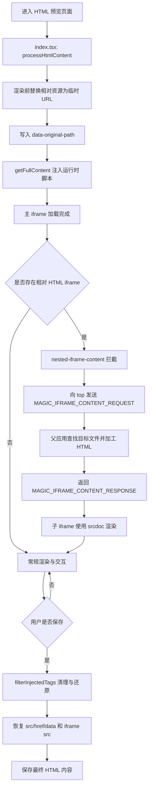
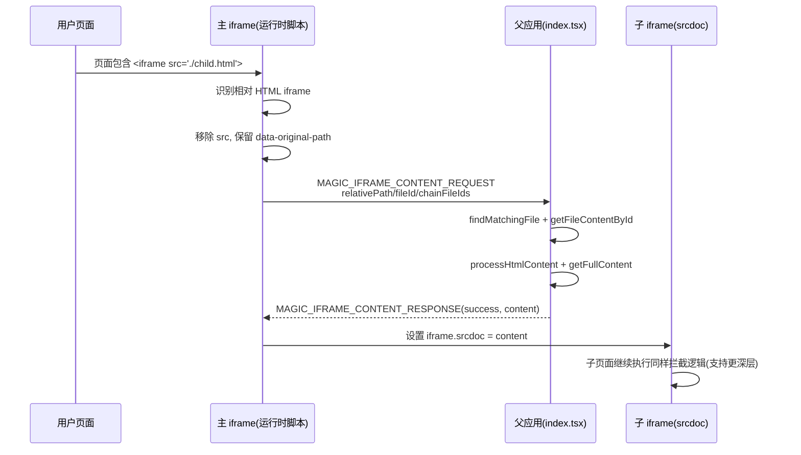
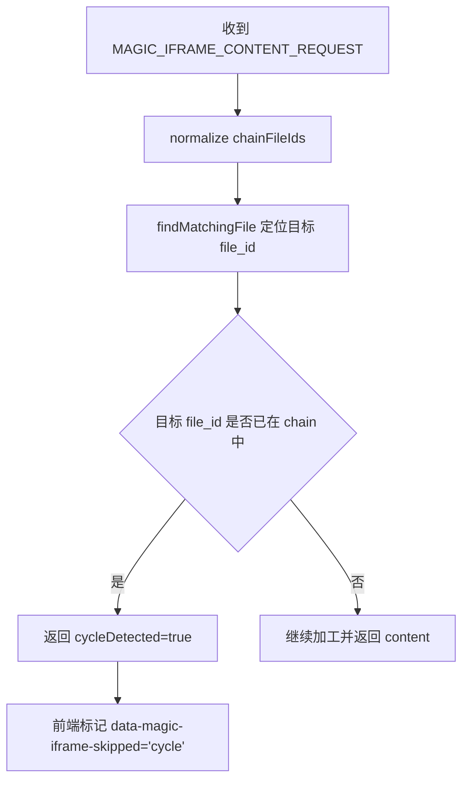
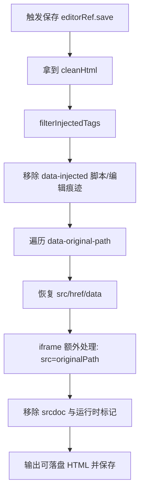
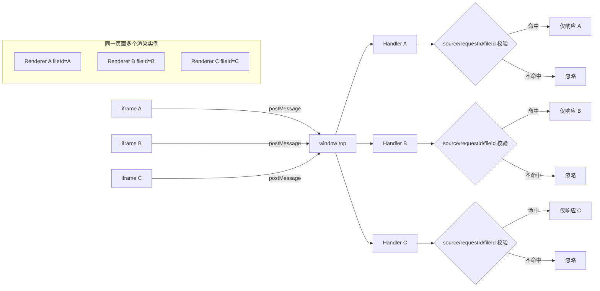

# HTML Iframe 节点处理文档

## 1. 文档目标

本文档用于说明 `HTML` 内容渲染链路中，针对 `iframe` 节点（尤其是相对路径 HTML iframe）的处理方案与边界，便于：

- 快速理解当前实现
- 定位问题与回归风险
- 持续追踪后续需求

## 2. 范围与术语

- **主 iframe**：`IsolatedHTMLRenderer` 承载的顶层预览 iframe
- **嵌套 iframe**：主 iframe 内容中的 `<iframe>`
- **叶子 iframe**：多层嵌套中的最内层 iframe
- **相对 HTML iframe**：`src` 指向 `.html/.htm` 且为相对路径
- **运行时拦截**：页面已渲染后，通过注入脚本监听并处理 DOM 变化

## 3. 处理链路总览

### 3.1 渲染前（父应用）

1. `index.tsx` 调用 `processHtmlContent`
2. 将可替换资源路径转成临时 URL
3. 对被替换节点保留 `data-original-path`，用于保存时还原

关键文件：

- `htmlProcessor.ts`
- `utils/index.ts`（路径解析工具）
- `index.tsx`

### 3.2 运行时（主 iframe 内）

1. `getFullContent` 注入运行时脚本
2. `nested-iframe-content.ts` 拦截相对 HTML iframe
3. 通过 `postMessage` 请求父应用获取“加工后的子 HTML”
4. 子 iframe 使用 `srcdoc` 渲染加工结果

关键文件：

- `utils/full-content.ts`
- `utils/nested-iframe-content.ts`
- `utils/fetchInterceptor.ts`

### 3.3 保存时（编辑模式）

1. 保存链路调用 `filterInjectedTags`
2. 清理注入脚本/编辑痕迹
3. 基于 `data-original-path` 还原 `src/href/data`
4. 对 `iframe` 额外还原 `src` 并移除 `srcdoc`

关键文件：

- `utils/index.ts`
- `utils/editing-script.ts`
- `hooks/useHTMLEditorV2.ts`

## 4. 场景清单

### 场景 A：单层相对 HTML iframe

- 示例：`<iframe src="./demo.html"></iframe>`
- 处理：
  - 运行时识别 `.html/.htm` + 相对路径
  - 阻止浏览器直接加载原地址
  - 请求父应用加工目标 HTML 后，以 `srcdoc` 注入

### 场景 B：初始化阶段 src 已变成绝对 URL

- 现象：渲染前处理后，`src` 可能是 OSS URL
- 处理：
  - 运行时优先读 `data-original-path`
  - 仍按“相对 HTML iframe”流程处理

### 场景 C：多层嵌套（A -> B -> C）

- 处理：
  - 请求发送到 `window.top`，确保跨多层可达
  - 使用请求来源 `fileId` 计算目录基准解析相对路径

### 场景 D：嵌套页内相对资源（img/css/script）

- 处理：
  - 父应用拿到子 HTML 后再次调用 `processHtmlContent`
  - 将子页面内相对资源转换为可访问 URL

### 场景 E：循环嵌套（A -> B -> A）

- 处理：
  - 维护 `chainFileIds`
  - 命中循环时返回 `cycleDetected`
  - iframe 标记 `data-magic-iframe-skipped="cycle"`，跳过继续递归

### 场景 F：编辑后保存还原

- 处理：
  - 还原 `src/href/data`
  - 对 `iframe` 强制恢复 `src=originalPath`
  - 移除 `srcdoc` 与运行时标记

## 5. 消息协议

### 5.1 嵌套 iframe 内容请求

- 请求类型：`MAGIC_IFRAME_CONTENT_REQUEST`
- 响应类型：`MAGIC_IFRAME_CONTENT_RESPONSE`

请求字段（核心）：

- `requestId`
- `relativePath`
- `fileId`
- `chainFileIds`

响应字段（核心）：

- `requestId`
- `success`
- `content`
- `error`
- `cycleDetected`

### 5.2 资源 URL 解析请求

- 请求类型：`MAGIC_FETCH_URL_REQUEST`
- 响应类型：`MAGIC_FETCH_URL_RESPONSE`

## 6. 需求追踪（可持续维护）

建议按以下编号追踪，变更时同步更新状态。

| 需求 ID | 描述 | 当前状态 | 关键文件 |
| --- | --- | --- | --- |
| IFR-001 | 相对 HTML iframe 可渲染 | 已实现 | `nested-iframe-content.ts`, `full-content.ts` |
| IFR-002 | 初始化阶段可识别 `data-original-path` | 已实现 | `nested-iframe-content.ts` |
| IFR-003 | 多层嵌套可达（消息到 top） | 已实现 | `nested-iframe-content.ts`, `fetchInterceptor.ts`, `full-content.ts` |
| IFR-004 | 嵌套页内相对资源可转换 | 已实现 | `nested-iframe-content.ts`, `htmlProcessor.ts` |
| IFR-005 | 循环嵌套检测并跳过 | 已实现 | `nested-iframe-content.ts` |
| IFR-006 | 编辑保存时还原 iframe 数据 | 已实现 | `utils/index.ts`, `editing-script.ts` |
| IFR-007 | 多实例隔离与 source/origin 收敛 | 待增强 | `index.tsx`, `fetchInterceptor.ts`, `nested-iframe-content.ts` |

## 7. 后续需求记录模板

每次新增需求建议按以下模板记录，避免上下文丢失：

```md
### [IFR-XXX] 需求标题
- 背景：
- 触发场景：
- 预期行为：
- 当前行为：
- 影响范围：
- 设计决策：
- 风险与回滚策略：
- 验证用例：
- 上线观察指标：
```

## 8. 回归测试建议

每次改动 iframe 链路至少回归以下用例：

1. 单层相对 HTML iframe 渲染
2. 多层嵌套 A -> B -> C 渲染
3. 循环嵌套 A -> B -> A 跳过处理
4. 嵌套页内 `img/css/script` 相对资源加载
5. 编辑后保存，`iframe src` 正确还原，`srcdoc` 不落盘

## 9. 常见排查路径

1. 看 DOM：目标 iframe 是否存在 `data-original-path`
2. 看消息：是否发出 `MAGIC_IFRAME_CONTENT_REQUEST`
3. 看响应：是否收到 `success/cycleDetected`
4. 看保存结果：是否残留 `srcdoc` 或运行时标记
5. 看路径基准：请求 `fileId` 对应目录是否正确

## 10. 相关文件索引

- `index.tsx`
- `htmlProcessor.ts`
- `utils/full-content.ts`
- `utils/nested-iframe-content.ts`
- `utils/fetchInterceptor.ts`
- `utils/index.ts`
- `utils/editing-script.ts`
- `hooks/useHTMLEditorV2.ts`

## 11. 整体运行流程图

### 11.1 总体主流程（渲染 -> 运行时拦截 -> 保存）



### 11.2 嵌套 iframe 运行时时序图



### 11.3 循环嵌套检测流程



### 11.4 保存还原流程（编辑模式）



### 11.5 多实例并行的消息隔离流程（对应 IFR-007）



### 11.6 隔离策略建议（实现清单）

为避免多实例串扰，建议在消息处理器中逐步收敛到以下策略：

1. `event.source` 必须匹配当前 renderer 绑定的 iframe window
2. `requestId` 使用实例前缀（如 `rendererId + random`）
3. `fileId` 仅允许当前文件和允许的嵌套链文件
4. 可选增加 `rendererId` 字段用于强隔离
5. 异常请求统一丢弃并打点（便于排查串消息）
