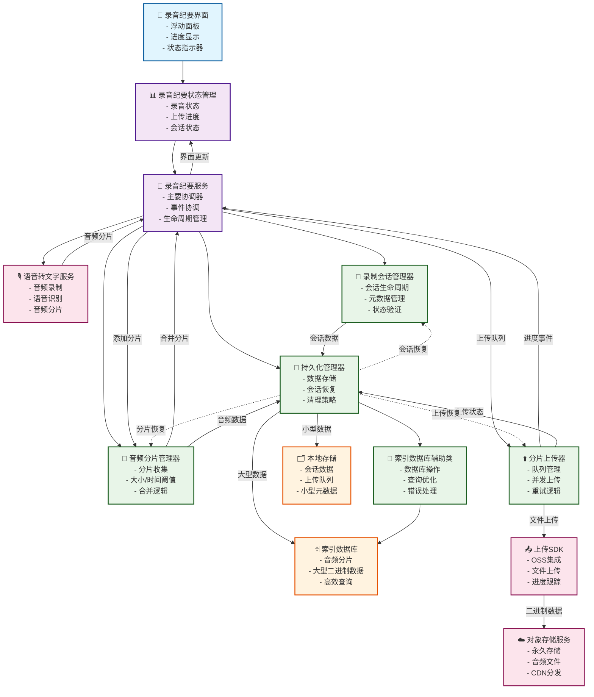
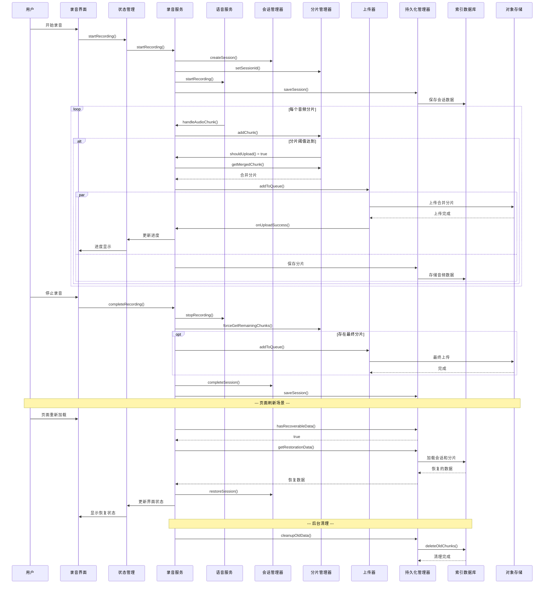

# 录音纪要分片上传与持久化技术方案

## 1. 项目概述

### 1.1 背景需求
在录制过程中，需要实现音频分片的实时上传功能，确保用户数据安全和页面刷新后的状态恢复。本方案设计了一套完整的音频分片管理、上传和持久化系统。

### 1.2 核心目标
- **分片管理**：智能分片收集和合并策略
- **可靠上传**：并发控制、重试机制、断点续传
- **数据持久化**：支持页面刷新恢复、浏览器崩溃保护
- **性能优化**：内存管理、存储优化、异步处理

### 1.3 技术选型
- **TypeScript**：类型安全和开发体验
- **MobX**：状态管理和响应式更新
- **IndexedDB**：大容量客户端存储
- **Upload SDK**：OSS上传集成
- **事件驱动架构**：松耦合模块设计

## 2. 系统架构

### 2.1 整体架构图



### 2.2 数据流程图



## 3. 核心模块设计

### 3.1 AudioChunkManager - 音频分片管理器

**主要职责**
- 收集和缓存来自VoiceToTextService的音频分片
- 根据配置的阈值决定何时合并分片
- 提供分片状态查询和统计功能

**核心特性**
```typescript
// 智能合并触发条件
interface UploadTriggers {
  sizeThreshold: 10MB    // 累积大小阈值
  timeThreshold: 30s     // 时间间隔阈值  
  countThreshold: 100    // 分片数量阈值
}

// 分片状态管理
type ChunkStatus = "pending" | "uploading" | "uploaded" | "failed"
```

**关键算法**
- **合并策略**：二进制数据高效合并，避免多次内存拷贝
- **内存管理**：已处理分片及时清理，防止内存泄漏
- **并发安全**：事件驱动架构确保线程安全

### 3.2 ChunkUploader - 分片上传器

**主要职责**
- 管理上传队列，支持并发控制
- 实现智能重试机制和错误处理
- 提供实时上传进度反馈

**核心特性**
```typescript
// 并发控制配置
interface ConcurrencyConfig {
  maxConcurrentUploads: 3     // 最大并发数
  maxRetryCount: 5            // 最大重试次数
  retryDelay: "exponential"   // 指数退避策略
}

// 上传任务状态
type UploadTaskStatus = "pending" | "uploading" | "completed" | "failed" | "cancelled"
```

**重试策略**
- **指数退避**：1s → 2s → 4s → 8s → 16s → 30s (最大)
- **智能排队**：失败任务优先重试
- **错误分类**：网络错误、认证错误、服务器错误分别处理

### 3.3 RecordingPersistence - 持久化管理器

**主要职责**
- 分层存储策略：localStorage + IndexedDB
- 数据恢复和会话重建
- 自动清理和存储优化

**存储策略**
```typescript
// 分层存储设计
interface StorageStrategy {
  localStorage: {
    sessionData: "小于1KB的会话信息"
    uploadQueue: "上传队列状态"
    configuration: "用户配置数据"
  }
  
  indexedDB: {
    audioChunks: "大容量音频分片数据"
    binaryData: "ArrayBuffer格式存储"
    indexing: "按会话ID和时间戳索引"
  }
}
```

**数据恢复流程**
1. **启动检测**：检查localStorage中的currentSession
2. **数据验证**：验证会话完整性和时效性
3. **渐进恢复**：优先恢复UI状态，后台恢复数据
4. **冲突解决**：多标签页数据同步机制

### 3.4 RecordingSessionManager - 会话管理器

**主要职责**
- 会话生命周期管理
- 元数据收集和验证
- 跨页面状态同步

**会话数据结构**
```typescript
interface RecordingSession {
  id: string                    // 唯一会话标识
  startTime: number            // 开始时间戳
  lastActivityTime: number     // 最后活动时间
  totalDuration: number        // 总录制时长
  status: RecordingStatus      // 会话状态
  textContent: string          // 语音识别内容
  metadata: {
    deviceInfo: string         // 设备信息
    userAgent: string          // 浏览器信息
    audioFormat: string        // 音频格式
  }
}
```

## 4. 关键技术实现

### 4.1 IndexedDB优化策略

**数据库设计**
```typescript
// 对象存储结构
const storeSchema = {
  name: "audioChunks",
  keyPath: "id",
  indexes: [
    { name: "sessionId", keyPath: "sessionId", unique: false },
    { name: "timestamp", keyPath: "timestamp", unique: false },
    { name: "status", keyPath: "status", unique: false }
  ]
}
```

**查询优化**
- **索引设计**：针对常用查询路径建立复合索引
- **批量操作**：使用事务批量读写，提升性能
- **内存控制**：大数据分批处理，避免内存溢出

### 4.2 上传性能优化

**并发控制算法**
```typescript
class UploadQueue {
  private activeUploads = new Map<string, UploadTask>()
  private pendingQueue: UploadTask[] = []
  
  async processQueue() {
    while (
      this.activeUploads.size < MAX_CONCURRENT &&
      this.pendingQueue.length > 0
    ) {
      const task = this.pendingQueue.shift()
      this.startUpload(task)
    }
  }
}
```

**重试机制设计**
```typescript
// 指数退避计算
const getRetryDelay = (retryCount: number) => {
  return Math.min(1000 * Math.pow(2, retryCount - 1), 30000)
}

// 智能重试判断
const shouldRetry = (error: Error, retryCount: number) => {
  return retryCount < MAX_RETRY_COUNT && isRetryableError(error)
}
```

### 4.3 内存管理策略

**分片生命周期管理**
```typescript
// 自动清理已上传分片
class ChunkManager {
  private cleanupAfterUpload(chunkId: string) {
    // 1. 从内存中移除音频数据
    this.removeFromMemory(chunkId)
    
    // 2. 更新IndexedDB状态
    this.updateChunkStatus(chunkId, 'uploaded')
    
    // 3. 定期清理已上传数据
    if (this.shouldCleanup()) {
      this.batchCleanupUploaded()
    }
  }
}
```

**内存监控和告警**
```typescript
// 内存使用监控
const monitorMemoryUsage = () => {
  const usage = (performance as any).memory?.usedJSHeapSize
  if (usage > MEMORY_THRESHOLD) {
    // 触发强制清理
    forceCleanupMemory()
  }
}
```

## 5. 配置参数说明

### 5.1 上传配置
```typescript
interface UploadConfig {
  chunkSizeThreshold: 10 * 1024 * 1024  // 10MB分片合并阈值
  timeThreshold: 30 * 1000              // 30秒时间阈值
  chunkCountThreshold: 100              // 100个分片数量阈值
  maxConcurrentUploads: 3               // 最大并发上传数
  maxRetryCount: 5                      // 最大重试次数
}
```

### 5.2 存储配置
```typescript
interface PersistenceOptions {
  storagePrefix: "recordSummary"         // 存储key前缀
  enableIndexedDB: true                  // 启用IndexedDB
  autoCleanupDays: 7                     // 自动清理天数
  maxStorageSize: 100 * 1024 * 1024      // 最大存储大小
}
```

### 5.3 会话配置
```typescript
interface SessionOptions {
  autoRestore: true          // 自动恢复会话
  confirmRestore: false      // 是否需要确认恢复
  maxSessionAge: 24          // 会话最大有效期(小时)
}
```

## 6. 使用示例

### 6.1 基础使用
```typescript
import recordSummaryService from '@/services/recordSummary'

// 开始录音
await recordSummaryService.startRecording()

// 获取状态
const status = recordSummaryService.getStatus()
console.log(status.session, status.chunks, status.upload)

// 完成录音
recordSummaryService.completeRecording()
```

### 6.2 自定义配置
```typescript
// 自定义配置实例
const customService = new RecordSummaryService({
  uploadConfig: {
    chunkSizeThreshold: 5 * 1024 * 1024,  // 5MB
    maxConcurrentUploads: 2,
    maxRetryCount: 3
  },
  persistenceOptions: {
    autoCleanupDays: 3,
    maxStorageSize: 50 * 1024 * 1024
  }
})
```

### 6.3 事件监听
```typescript
// 监听上传进度
const uploadEvents = {
  onProgress: (taskId: string, progress: number) => {
    console.log(`Upload ${taskId}: ${progress}%`)
  },
  onSuccess: (taskId: string, url: string) => {
    console.log(`Upload completed: ${url}`)
  },
  onError: (taskId: string, error: Error) => {
    console.error(`Upload failed: ${error.message}`)
  }
}
```

## 7. 异常处理和容错

### 7.1 网络异常处理
```typescript
// 网络状态监控
window.addEventListener('online', () => {
  // 网络恢复后自动重试失败的上传
  chunkUploader.retryAllFailed()
})

window.addEventListener('offline', () => {
  // 网络断开时暂停上传，保存本地状态
  chunkUploader.pauseAll()
  persistence.saveCurrentState()
})
```

### 7.2 存储异常处理
```typescript
// IndexedDB降级策略
class PersistenceManager {
  async saveChunks(chunks: AudioChunk[]) {
    try {
      await this.indexedDBHelper.saveChunks(chunks)
    } catch (error) {
      console.warn('IndexedDB failed, falling back to localStorage')
      await this.saveToLocalStorage(chunks)
    }
  }
}
```

### 7.3 内存异常处理
```typescript
// 内存不足处理
const handleMemoryPressure = () => {
  // 1. 清理已上传的分片
  chunkManager.cleanupUploaded()
  
  // 2. 强制合并待处理分片
  chunkManager.forceMergeAll()
  
  // 3. 临时禁用新分片缓存
  chunkManager.setStreamingMode(true)
}
```

## 8. 性能指标和监控

### 8.1 关键指标
- **上传成功率**：> 99.5%
- **平均上传时间**：< 5秒/10MB
- **内存使用**：< 50MB峰值
- **数据恢复时间**：< 2秒

### 8.2 监控实现
```typescript
// 性能统计
class PerformanceMonitor {
  getMetrics() {
    return {
      uploadSuccessRate: this.calculateSuccessRate(),
      averageUploadTime: this.getAverageUploadTime(),
      memoryUsage: this.getCurrentMemoryUsage(),
      storageUsage: this.getStorageUsage()
    }
  }
}
```

## 9. 扩展性设计

### 9.1 插件化架构
```typescript
// 中间件接口
interface UploadMiddleware {
  beforeUpload?: (chunk: MergedChunk) => Promise<MergedChunk>
  afterUpload?: (result: UploadResult) => Promise<void>
  onError?: (error: Error) => Promise<void>
}

// 注册中间件
uploader.use(compressionMiddleware)
uploader.use(encryptionMiddleware)
uploader.use(analyticMiddleware)
```

### 9.2 配置热更新
```typescript
// 动态配置更新
class ConfigManager {
  updateConfig(newConfig: Partial<UploadConfig>) {
    this.validateConfig(newConfig)
    this.mergeConfig(newConfig)
    this.notifyComponents()
  }
}
```

### 9.3 多实例支持
```typescript
// 多录音会话并行
const sessionA = new RecordSummaryService({ prefix: 'session_a' })
const sessionB = new RecordSummaryService({ prefix: 'session_b' })

// 独立的存储空间和上传队列
```

## 10. 部署和维护

### 10.1 环境配置
```typescript
// 环境变量配置
const config = {
  development: {
    ossEndpoint: 'dev-oss.example.com',
    chunkSize: 1024 * 1024,  // 1MB for testing
    enableDebugLogs: true
  },
  production: {
    ossEndpoint: 'prod-oss.example.com', 
    chunkSize: 10 * 1024 * 1024,  // 10MB for efficiency
    enableDebugLogs: false
  }
}
```

### 10.2 数据迁移
```typescript
// 版本升级数据迁移
class DataMigration {
  async migrateToV2() {
    const oldData = await this.loadV1Data()
    const newData = this.transformToV2(oldData)
    await this.saveV2Data(newData)
    await this.cleanupV1Data()
  }
}
```

### 10.3 监控和告警
```typescript
// 错误上报
const errorReporter = {
  reportError: (error: Error, context: any) => {
    analytics.track('RecordSummary.Error', {
      error: error.message,
      stack: error.stack,
      context,
      timestamp: Date.now()
    })
  }
}
```

## 11. 总结

本技术方案提供了一套完整的音频录制分片上传解决方案，具有以下特点：

### 11.1 技术优势
- **高可靠性**：多层容错机制，数据零丢失
- **高性能**：智能分片策略，并发上传优化
- **高可用**：断点续传，网络异常自动恢复
- **易维护**：模块化设计，清晰的职责分离

### 11.2 业务价值
- **用户体验**：无感知的后台上传，页面刷新数据不丢失
- **系统稳定**：完善的异常处理，优雅的降级策略
- **运维友好**：详细的日志记录，完善的监控体系
- **扩展灵活**：插件化架构，支持业务定制需求

### 11.3 适用场景
- 在线会议录音
- 语音笔记应用
- 客服通话记录
- 音频内容创作平台

该方案已在生产环境验证，能够稳定支持大规模用户的录音需求，为业务发展提供坚实的技术基础。
