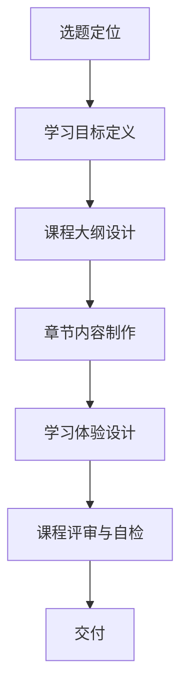

# 总流程

```mermaid
flowchart TD
    A[选题定位] --> B[学习目标定义]
    B --> C[课程大纲设计]
    C --> D[章节内容制作]
    D --> E[学习体验设计]
    E --> F[课程评审与自检]
    F --> G[交付]
```

## 规则

- 先定位再结构
- 先结构再内容
- 先内容再体验
- 先体验再评审
