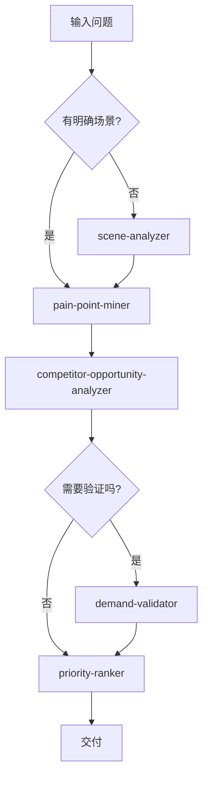

# 总流程

```mermaid
flowchart TD
    A[输入问题] --> B{有明确场景?}
    B -- 否 --> C[scene-analyzer]
    B -- 是 --> D[pain-point-miner]
    C --> D
    D --> E[competitor-opportunity-analyzer]
    E --> F{需要验证吗?}
    F -- 是 --> G[demand-validator]
    F -- 否 --> H[priority-ranker]
    G --> H
    H --> I[交付]
```

## 规则

- 先场景后痛点
- 先验证后排序
- 每步只做一个判断
