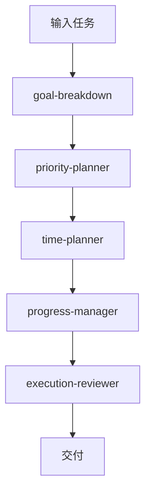

# 总流程

```mermaid
flowchart TD
    A[输入任务] --> B[goal-breakdown]
    B --> C[priority-planner]
    C --> D[time-planner]
    D --> E[progress-manager]
    E --> F[execution-reviewer]
    F --> G[交付]
```

## 规则

- 先目标，再动作
- 先优先级，再时间
- 先计划，再跟踪
