# 1. CEO和高层视角看待一家公司的“操盘”

成熟公司CEO如何管理和思考公司的运转

***

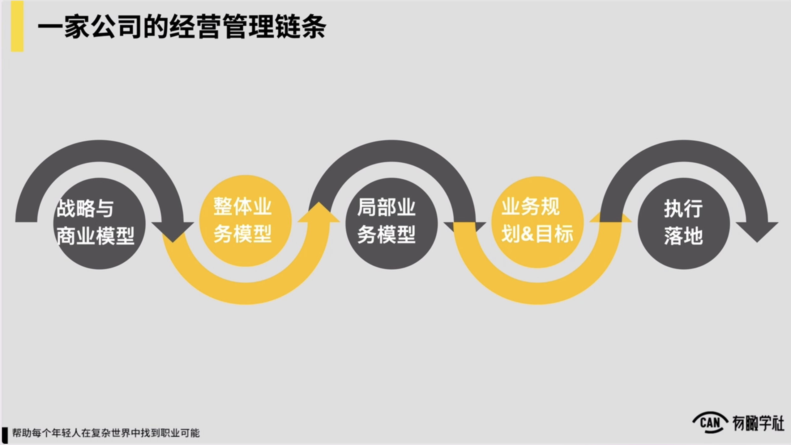

随后我们就进入到第一小节，CEO和高层视角上看待一家公司的操盘到底是怎样的？我们在之前的导论部分有提到这么一个图，就一家公司的经营管理链条，它是有5层次：

首先第一个层次是我们这家公司的战略和我们的商业模型是怎样的，然后往下第二个层次是我们处理个公司处理体的业务模型它应该是怎样的。第三个层次往下再拆分到局部，局部可能就一个部门，局部的模型又是怎样的，再往下可能基于我们的局部业务模型，我们在每一条战线下会形成我们的业务规划，形成我们具体的每条线的目标，最后是执行落地。

我们在导论上有分享过这么一个图，一家公司的经营管理链条。

以上，现在我们基于这样一个经营管理的链条，把视角稍微转换一下，因为上面这张图它是一个第三人称的视角来看待一家公司的运营，来看待一家公司的处理个管理链条，是我们站在1第三方的视角去理解说公司它的管理应该有这么5层次，但是现在我们转换一下视角，我们把它变成一个第一人称的视角，也如果我们自己是一个CEO和本身一个管理者，按照刚才的这样一张图，我们要操盘一家公司，我们的工作到底该怎么去展开

我们把人称和视角稍微转一转，简单来一下，直接我们就把它翻译到位。

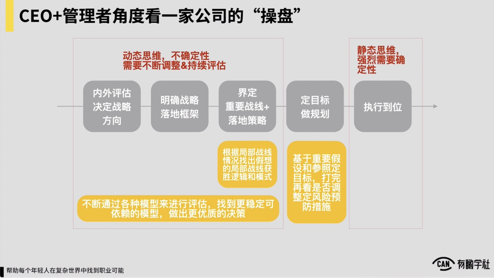

如果我作为1CEO或者1管理者，按照上边的这5层次，我自己的工作是这样的：

**内外评估决定战略方向：**&#x9996;先我会在内部和外部去获取很多信息，来进行评估和思考，来决定我们这家公司的战略方向。然后约有了方向约是什么？说我在什么时间要进入到一个什么市场下，市场它也许存在着一些什么样的机会，这是我们所评估的战略方向，例如我要进入到下沉市场，然后在下沉市场里边重点可能去做消费或重点去做服务之类的，这约一个战略方向。

**明确战略落地框架：**&#x63A5;下来说明确我们战略落地的框架，说我们要进下市场，要在下面市场里边重点去打这种居家的一些服务，我们战略落地的框架到底是怎样的，例如我们先从些地区开始做起，然后以什么样的产品，以什么样的服务形态开始去落地，我们要明确我们的战略落地的框架，这是往下的一步，

**界定重要战线+落地策略：**&#x518D;往下说我们要继续再往下去拆分，我们要界定我们的重要的战线，还有我们落地的策略到底是什么，例如下沉市场里边一共有5类服务值得做，我们当前优先先做一类，先从个地区，什么类型的人群，是先从老年人做起，还是从小孩子做起，还是从别的什么样的这种例如妈妈的人群做起还是怎么样的，我们要界定我们重要的战线，以及我们落地的策略，我们落地的策略是更多的就以说线上社群分销这样的方式来去落地，还是以说线下可能连锁经营门店的这样的方式来去落地，还是发展什么地区合伙人的方式来落地，我们要明确我们落地的策略。

**定目标做规划：**&#x6709;了策略之后，再往下一步定目标做规划，对我们每一条战线下的目标规划到底是怎样的，最后我们要把它执行到位。这是作为1CEO和1管理者，如果从刚才那5层次上去看待一家公司操盘，我们的工作方法对我们的要求约会是这样的。
![[assets/一家公司的操盘工作流程.jpg]]

以上，我们再往下再一步，从某种角度如果我是一个CEO或者我是一个管理者，你会发现在这样一个流程里边的工作方法里边的前三步，前三步里面我的工作方法是什么？

我的工作方法一方面肯定是外部不断地获取到很多的信息，我要了解行业和市场上在发生着什么样的变化和动态，同时我要不断的通过各种模型来进行评估，我要不断的去寻找各种各样的模型，对到底模型是什么，我们后边会进一步讲，各位只需要简单的理解说我在这儿我脑海中会输入和去评估各种各样的模型就以上。

包括我们刚才讲的，例如我们如果是通过社群裂变的方式做，还是说通过线下连锁门店的方式来做，这就已经是两种不同的模型。

对我们要评估各种各样的模型，找到其中对我们而言是更有利更可依赖的模型，做出更优质的决策。在前三步不管是在我们评估战略方向的时候，还在我们明确落地框架的时候，还是在我们界定重要战线的时候，我们都需要不断的去输入，不断去评估各种各样的模型。，这是在工作方法的前三步。

然后再进一步讲在第三步，也我们界定重要战线和明确我们落地策略的时候，时候是十分需要我们根据局部战线下的情况，然后去找出来假想的局部战线的获胜逻辑和模式的，就像我们刚才的，

如果我们进入到例如假设是西南地区的下沉市场里面去，我们又要在局部战场里边要去具体的评估，说战场里边如果要做下沉市场里边做服务，面对老年人面对妈妈，面对小孩子，当前市场格局是怎样的，各位各自都是怎么玩的，然后我到底面向群人，通过一个什么样的玩法或策略来去切入，我的获胜的概率更大。

，所以在局部战线下，我们也需要再去做一轮的这样的重要的评估。，然后约是这样，然后再往后定目标和做规划部分，对于我们作为一个管理者而言，很多时候在基于我们的一些重要的假设，和我们的参照来去定目标，例如我们认为在下沉市场里面，如果是通过连锁加盟的方式，在我们刚才讲的什么西南地区这样的地方去做一些家庭的上门服务，我们认为更有机会。

这样我们会有个假设，我们会认为说地方存在机会，可能半年内我们要开多少家店是合理的，然后这些店开出来之后能支撑我们的收入增长到一个什么样的范畴，于是我们定出来一个目标，根据定完目标，随后往下执行，执行完之后打完一轮，我们再查看符不符合我们预期，如果不符合我们再调处理。

包括这里边我们可能也会事先去定一些风险预防的措施，一旦说我们手中有两张牌，我们a策略b策略，这两张牌打完就没了，如果打完达不成目标，我们要不要给自己备一个c这样一个这种策略或一个兜底的方案，这是我们要评估的。

，所以从某种角度这是我们作为CEO或者管理者，看待一家公司它的操盘，它的运作，它的一些业务上的一些规划，约是这样的一个逻辑。

以上，基于这张图，可再做另外一个诠释，是什么你会发现这里边存在一个十分重要的东西了，管理者和操盘手的视角和一线执行者的视角之间会有一个十分显著的差异是什么？我们作为一个管理者或者作为一个操盘手，在前面这三块的事儿上，评估战略方向，明确落地框架，界定重要战线和我们某条线上的落地策略。

这三部分对于我们而言，它都需要一个动态的思维，因为市场上的很多东西本质上是不确定的，我们一定要不断通过市场上的很多变化，用户的需求的变化，行业动态的变化，经济形势的变化，新产品新技术的变化，竞争对手的变化等等，根据这些东西来去不断的调处理和持续评估我们的战略方向，该往走，我们某条重要战线下到底该以什么样的策略来去应，它本身是需要的是动态思维，而且这里面市场的变化越快越频繁，往往就需要我们调处理的也更加的快，更加的迅速。

，这是我们作为操盘手的视角，对我们会有的要求。但是你会发现如果我们是一个执行者，我想这门课程里边也会有很多人会遇到这样的困境，如果我们是一个执行者，往往我们的思考的视角和我们思考的逻辑更多的时候是一种静态思维。

我们往往在业务当中作为一个执行者，他典型的状态等靠要，什么叫等靠要，我一定要等到我的上级告诉我一个明确的方案或者是目标，然后有了较为明确具体的这样的这种方向，好随后甚至我可能要向上级去要一个靠谱的行动方案，好随后我才可去执行，我才可去完成我的行动，这是作为操盘手和作为一个一线的执行者之间在思考的方法和思维的这种层面会有的一个十分巨大的差异。

因此，为了更好的去说明我们作为一个操盘手，然后是怎么运用这样一个方法去驱动管理一家公司的，以及更好的说明这种动态思维静态思维的差异。我们随后再来通过两个案例来具体来说明一下。第一个案例是2020年春节前后的西贝，各位都知道，而2020年的春节发生了一件十分重要的事情，我们的新冠病毒疫情。那1月23号武汉，因为这次疫情就出现了封城的情况，封城之后一个月因为疫情导致全国各地线下的这种实体的餐饮，线下服务等等这些行业受到很大的冲击。

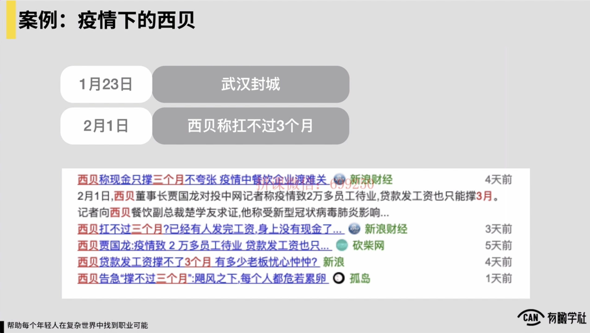

到2月1号的时候，西贝的CEO董事长贾国荣就正式对外发布了一个消息，说西贝有可能在账上的现金，可能以当前的情况来看，2万多的员工待业，然后可能撑不过三个月。所以对西贝来讲，是因为这次疫情受到了一个十分的冲击的。

那么疫情之前的西贝到底是一家怎样的公司，它的业务约是个什么样的情况我们根据2018年可以查到的一些公开的数据，可以从中简单的可以了解一下西贝这家公司。我们会看到西贝它是一家餐饮企业，在全国各地有360多家的门店，有2万多名员工，它的主营的这种业务核心两个部分，一个部分就在门店的堂食，另外一个部分它的外卖的业务。

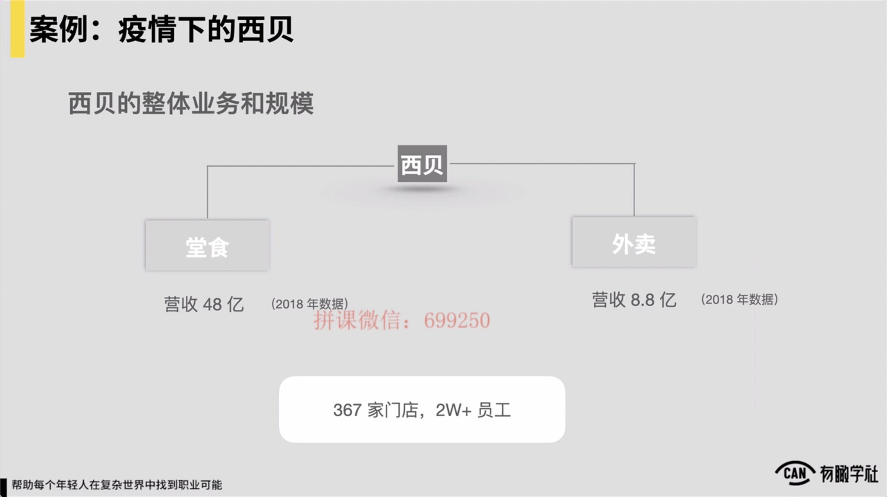

以2018年可以看到的数据来看，在堂食部分通过300多家门店，它一年的营收是48亿。而在外卖这部分的业务，以2018年数据来看，它年度的营收差不多是8.8亿，这是在疫情之前西贝这家公司现实的情况。

，那么2020年初的时候，西贝这家公司内部已经设定了一个发展的这种规划和目标，他们是要求各地区堂食和外卖营收的总和，在2020年里边年度要上涨15\~20%，他们有这样一个这种目标。

，但是确实在20年春节突如其来的疫情，导致处理个这家公司原定的很多的计划，原定的很多的方案完全被打乱，经营开始变得困难重重。

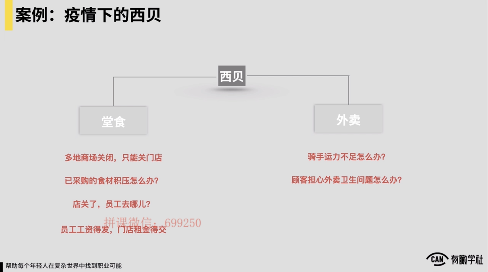

所以在这种情况下，你会发现市场很多时候很残酷的面临到这样一个残酷的冲击，西贝到底该怎么办于是西贝的高层对吧就开始思考说我们该怎么来去应对。毫无疑问当时的西贝20年的西贝春节前后面临的情况是这样一个情况，首先在既有占他们收入绝大部分的比例的堂食这块业务上，目前的情况是多地的商场本身都是关闭的，所以它的门店根本开都开不起来。然后在库存里边，西贝采购了十分多的食材，这些食材是会积压的。而且我们都知道采购的很多食材是有保质期的，如果说食材不能及时的转化成我们的菜品被销售出去，这些东西对我们而言打硬的成本了。

当这些食材可能坏掉之后，对我们而言可能一大笔的成本损耗就出去了，然后我们的很多门店关掉了，我们的员工也没有地方可去，并且我们还得照样发工资，门店的租金还得交，这在堂食这一块基本堂食这一块的业务，因为这样一些情况基本就完全没有办法去开展了。对另外一块来看，外卖这块业务似乎在疫情期间还是有可能的。但外卖这一块，如果西贝想做，他又会面临到说过去这一块不是他的强项，然后他的外卖配送的骑手运力不足，这时候该怎么办？

顾客担心外卖的卫生的这样一种问题，因为疫情期间很多人的饮食这块是十分注意的，对于卫生对于健康各位关注的权重上升到了前所未有的高度，所以顾客会担心外卖的卫生问题，这时候我们该怎么来办。所以评估完了之后，2万多员工的西贝并没有坐以待毙，他们马上就积极的开展起来了，自救的行动。

通常自救就奔着外卖这一条业务线来去开展。

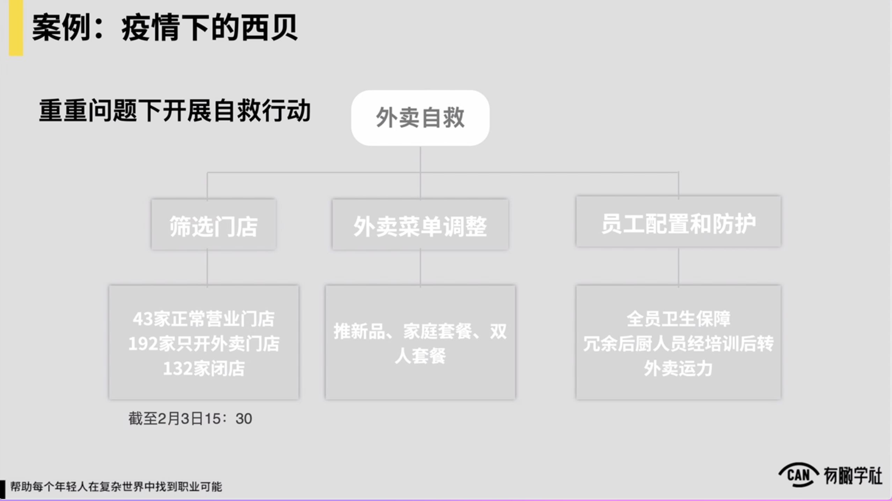

，首先他们筛选门店，300多家店，43家正常营业，192家只开外卖，132家关店，暂时不营业，这是截止到2月3号3:30的时候，短短的两天多时间里边，他们就做出了这样的决策，在外卖方面进行了菜单的调处理，然后推出了新品，推出了家庭套餐双人套餐，更好的去适应用户可能在春节疫情期间被关在家里面对出不去，然后这样一个特殊的场景，有很多人家里边很多人说一家人聚在一起，又不想做菜，或者就情侣两个人，

就住在一起，然后又不想天天下厨，包括出去采购买菜之类的，也有很多感染的风险，就不想出去了，特殊场景下用户可能对产品的需求是不一样的，所以推出了一些新的这样的这种产品。

第三块就在员工的配置和防护方面开展了一系列的行动，全员加强卫生保障，冗余的这种后厨人员，然后迅速经过培训之后转成外卖的运力，来帮助还在营业的200多家的这种门店，可把它的外卖业务去顺利开展起来。这样一系列的自救行动也很快落实到了一线。

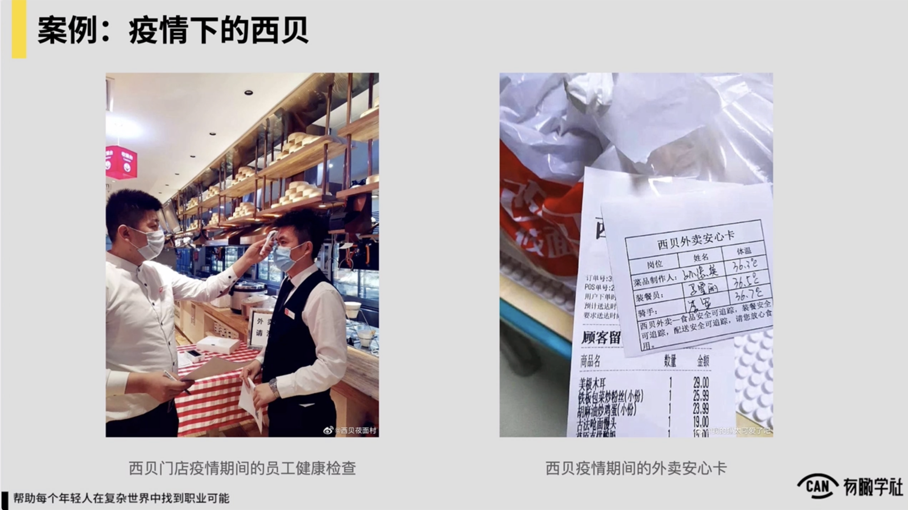

从西贝在2月3号之后发布的一些公告当中，我们也可以看到在营业的门店里边疫情期间，西贝显著的加强了很多卫生健康方面的检查，而在他们的外卖的业务上，然后通常也把一些用户的这种体验和对用户的这种健康卫生的承诺去落实到了十分细节的这种部分，包括给每一份外卖都会附加一个外卖的安心卡，告诉各位说是外卖是谁制作的，他们今天的体温是怎样的，让用户让我们的客户可足够的放心。

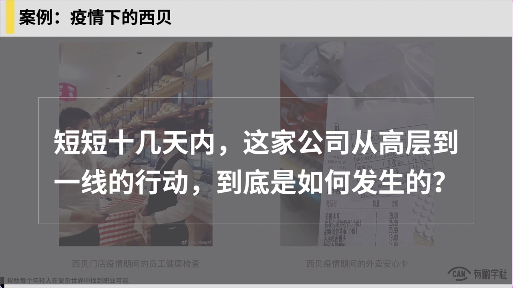

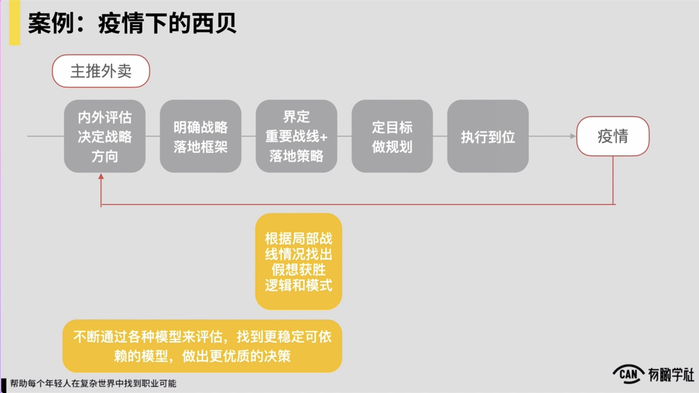

前前后后从2月1号西贝的董事长发布那样一个悲伤的通告，到2月十几号之后，西贝已经全员然后就投入到了这种自救行动当中去。短短一共就十几天，这家公司从高层到一线有了一系列的行动，所有这些行动到底是怎么发生的？时候我们就可以回到本节，起初的时候我们给各位分享的CEO和管理者在操盘一家公司的时候，它的一个基本的工作流程上面来，你会发现西贝2020年春节期间，他遇到的情况是说原本公司的高层已经评估决定了一个战略方向，也有我们的重要的战线，也定了目标，做了规划，

但各位执行的过程中，原本春节应该是一个营业的高峰期，因为突发的市场变化，因为疫情来临，导致处理个高层层面要重新来去评估很多事情，最终决定推翻我们原有的很多规划，推翻我们原有的一些业务的结构和模型来去决定说主推外卖，然后再随后再围绕着主推外卖这样一件事儿，又落地了一系列的这种策略和我们的目标还有规划，确保我们在一线的执行动作到位。

本质上是这样一件事情。

对这里边你就会发现，就像我们提到的，作为一家公司的高层，很多时候我们要不断通过市场上的很多动态的变化，来在前三步战略方向落地框架，还有重要战线的部分上，不断动态的来去做思考，并且在当中一定要不断根据很多模型来进行评估，包括西贝在决定要推外卖的时候，外卖这里边它的业务到底是一个什么样的模型，例如外卖要求说一定菜品和餐品要更少要更标准，然后一定要求说我的配送的团队，我的骑手的团队一定要有足够的这样一种储备，这是它的一个业务的逻辑和业务的模型。

那么就要以模型来去倒推说我们的工作规划到底应该是怎样的，这是20年前后西贝在这家公司上发生的事情。

从某种角度我们借用案例简单总结一下，想给到各位一个什么样的反馈？那在操盘手视角下，各位各位一定要记住，你是必须动态的来看待企业经营发展中的各种问题的，尤其是在快速变化的市场环境当中就更是如此。

我们在这举的西贝的这样一个例子，它是因为遇到一个不可抗力，疫情这样的一个这种情况，带来了很多变化，冲击了我的业务，导致我原有的规划必须全部推翻。但是我们假思考，如果我们在一个激烈竞争充分竞争的一个市场上，我们遇到的不是疫情，遇到的是竞争对手在不断的调处理他的策略，不断在很犀利的攻击我们。

各位请问时候你还能很静态的去看待我们的工作我们的计划吗？

我们还能说我们半年定了一个目标，目标就放在这儿，这半年我们就按照这么干，不管了，管它市场上有什么变化，管它用户的需求有没有发生变化，用户的购买力有没有发生变化，市场上的竞争对手有没有一些新的动作都不管，我们就这6月就这么干，你能想象吗？很难想象的。

所以越是在快速变化市场环境当中，越会要求我们如果是把自己看作一个操盘手，我们是必须要动态的去看待企业经营发展中的各种问题的，这跟一线执行层的视角完全不同。

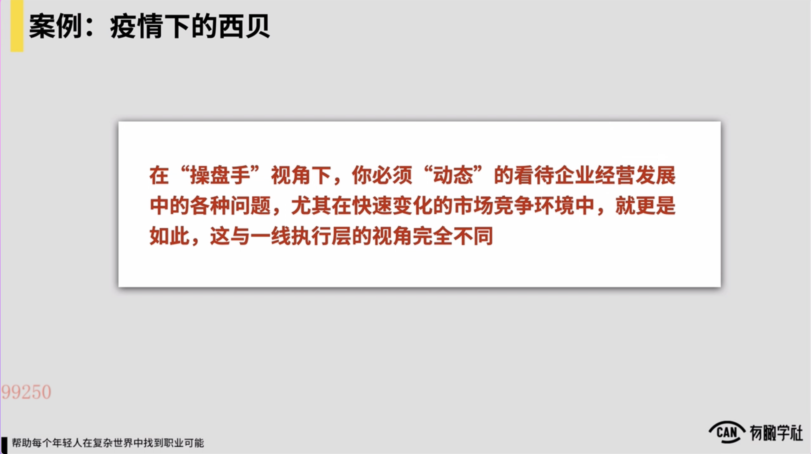

所以很多人有些时候都会抱怨说我们公司的上级变得太快了，太善变了，然后我觉得他十分不靠谱，但是我觉得这里边不可否认，可能存在一部分时候是上级确实没想清楚，但是也有很多的时候是说市场的环境必须倒逼着你必须要快速的想发生变化，你的业务里边必须快速的去响应，来应对一些市场上面调挑战更多的时候，我相信会是这样的一个这种情况。

如果你希望自己成为一个操盘手，我觉得你就不能再让自己停留在那种静态思维里面，你必须要学会动态的来看待一些经营决策的这样的一些这种问题，并且动态去响应市场上的一些变化。因此，这是这样一个案例。

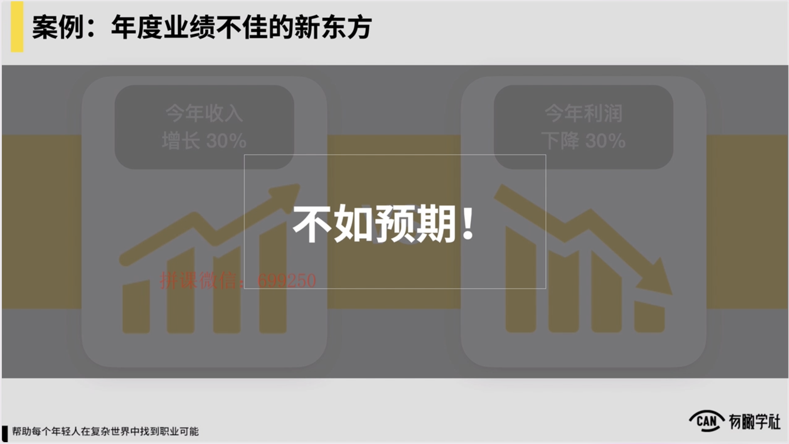

我们随后再来看二第二个案例是年度业绩不佳的新东方。我们假设如果你是新东方这家公司的CEO今年的处理个业务的情况，然后就放在你面前了，然后你下边的团队下边的中层管理者们给到你这样的一个这种数据，你发现今年的收入增长了30%，但是今年处理体新东方这家公司的利润下降了20%，这样一个数字意味着什么意味着可能说它跟我们年初做的一些规划，我们拿到了这样的一个这种业绩，那跟我们年初原本的预期是不相符的。

我们原本年初的预期说我们今年的收入要增长至少百%，假设这样一个认为，他没有达成我们的预期，利润应该是说也有一定幅度的增长，而不是要持续下降，假设现在你是CEO这样一份报告摆在你面前，你该怎么去分析怎么去理解，这当中到底出现了什么问题从某种角度我觉得我们要挖掘原因，有两个层面我们需要去审视它，一个是从业务的层面，另外一个是从财务的层面，

因为我们看到两个数字，第一个是说我们业绩的增长不如预期，第二个是我们的利润可能有下降，这二者我们要分别来去做一些这种分析。

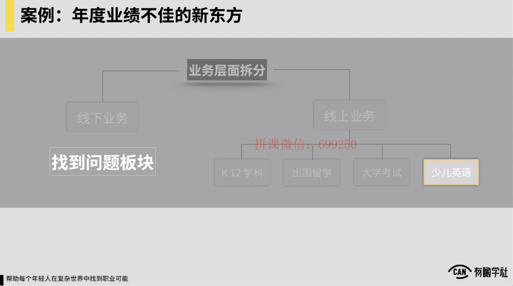

首先先看业务，在业务层面我们首先还要做一个拆分，在新东方这家公司里边，我们会发现我们到线下业务和线上业务这二者是分开的，而线上的业务里头又分为说k12学科，英语、出国留学英语、大学考试英语，还有少儿英语等等。，我们年初做规划的时候，预计说今年的收入要增长一倍以上。

对年初既然做了这样一个规划，我们肯定应该有逻辑，我们肯定应该是说当时我们有个判断，这一倍以上的增长到底是从来的，有几块的业务分别去支撑起来，所以当时我们就发现回顾了一下，我们就发现说我们在开设学科、出国留学、大学考试、少儿英语这几块里头都有一些增长的预期，也根据这预期定了一些计划，于是我们到年终时候，既然业绩不达标，我们就把所有这几块业务的情况都做了一些回顾，回顾完之后可能就发现问题所在了，我们发现似乎在k12学科英语出国留学大学考试这几块，它的增长的这种目标基本都是达到的，但是在少儿英语部分似乎跟我们的原有的这种预计差的较为远，在少儿英语里边我们就进一步再来做拆分。

我们就又发现在少儿英语里边，我们是说年初定计划的时候，我们就把它切割成了两个方向，一个方向是重点打一二线城市市场，另外一个方向重点是打下沉市场。，我们也发现似乎这一年干下来，在少儿英语板块下，一二线市场的这种目标虽然说也没达成，但差的不算多，但相反在下沉市场下，距离我们原有的预期差的就较为大了。

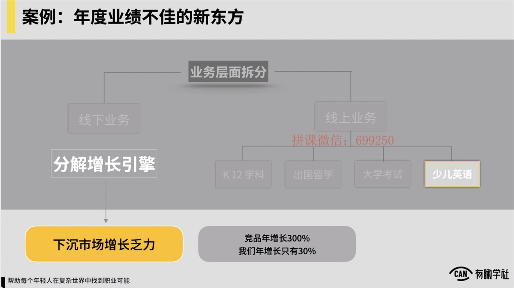

我们分解一下增长引擎，发现说下沉市场部分竞品的这种年增长达到了300%，而我们的年度增长只有30%，远远不及我们原有的预期，所以核心这样一分解就发现我们的业务上在少儿英语业务下，在下沉市场重要的战线下面，然后我们的有些工作出了问题没有做因此，而且这里边竞品做的肯定是比我们好的，

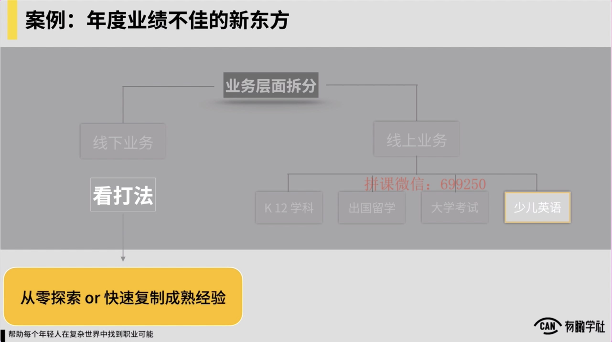

因此，这里边如果要进一步再往下去找问题，我们就要去看我们在下沉市场这块的打法了，我们要具体再查看，行业里边你看这么多家公司这么一些竞品，人家增长能做到300%，我们一定要去思考到底我们的打法是说我们要快速复制别人已有的成熟经验，还是要重新探索，理论上如果我是新东方这家公司，我的像资金我的人都是不缺的，我应该极致的去思考，如果别人已经有一套成熟的打法，我能不能通过砸钱快速复制这样一个打法，或者是说直接就把对方团队的一些这种成熟的员工就挖过来，

快速复制成熟的经验，实际是否应该这样？

还是说市场里边完全没有成熟的打法，我必须要重新探索，我作为一个管理者或者我作为一个CEO，我是应该这么来去分析所有的问题，来帮助我找到说到底业务上我的增长的预期没有达成，问题出在儿，以及随后我该怎么调处理。因此，这是在业务的层面，我们做了一下这样的一种挖掘，约就界定了一些原因。另外一块是针对我们的利润下降，我们可能得从财务的层面上再来做一些拆分做一些分析。

同理财务层面上还是先把我们各条业务线去梳理出来，因为我们面临的情况是说我们的利润下降了20%所以我们也是要逐个业务线k12学科大学英语，这些逐次去做回顾做一些回顾，然后来去查看我们因为每条业务我们都有一个原定的，例如它的利润成本的结构，那么就要看到底这里边是条业务线，是因为它的利润下降了，还是说它的成本比我们原本预期要高很多，

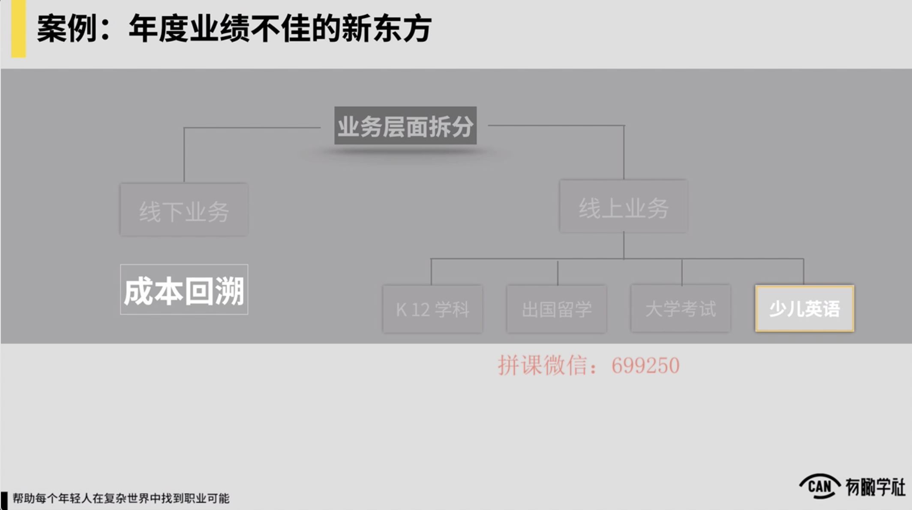

我们要去再做一轮评估，于是我们做了这样的评估，做了一下成本的回溯，那回溯完了之后，我们发现问题的板块还是出在少儿英语这上面，对少儿英语下我们再进一步的去做拆分，我们发现它的成本比我们原有的这种预期要高很多，但利润并没有显著上涨，于是我们就再去做一个成本结构的追踪。

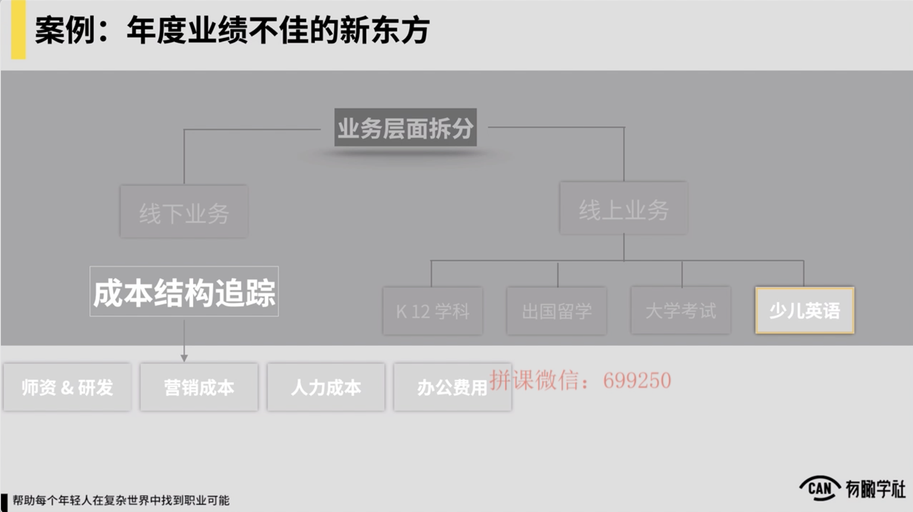

然后少儿英语在下边它主要的成本就分成说师资研发的成本，营销的成本、人力成本，还有办公费用的成本这4块，那么这4块再做一轮回溯，我们又发现说核心的问题出现在我们处理个这一年，我们的营销成本增长了300%，但是我们的收入只增长了30%，远远不及我们正常的一个状态和预期。

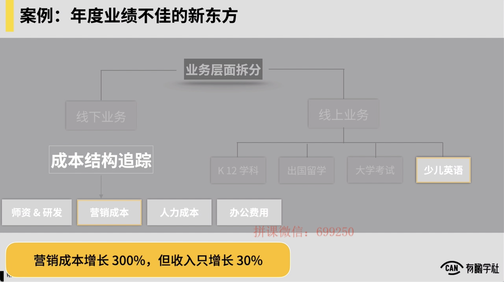

当你看到了这样的一种信息之后，随后你要做的如果你是一个管理者或CEO，你现在要做的就较为明确和简单了，那就要找到少儿英语板块下的营销这块的负责人，找他来问一下，到底是怎么处理的？为什么营销成本增长300%，但收入只增长30%，能不能给到一个合理的解释？，尤其是状态跟行里边普遍情况都完全不一样，如果能给到合理解释，我们再来看怎么来做。如果给不了合理解释，对不起人我们就干掉，所以假设你是个CEO或者是一个管理者，你看到这样一个问题，你背后的思考逻辑大体应该是这样的。

因此，这是新东方案例，我们对案例也进行总结，案例我们想给到各位的一个认知是什么？如果你进入到一个已经较为稳定的赛道当中，并且你在赛道里边你的业务模式也逐渐稳定下来之后，作为一个管理者或作为一个操盘手，你必须学会用模型来去评估管理和驱动各种各样的业务，模型到最后往往就会落实到很多数据和指标上面来。

你会发现在刚才我们举的新东方例子里边，我作为一家公司CEO一线发生了什么，具体各位在做什么，每个月上多少课，这些事儿我未必需要一一去关注的，但是我就评估好几个模型，刚才我们的例子里边一个是业务层面的逻辑，一个是财务层面逻辑，这二者对我是两套模型，后边我们也会再提到，然后我们是通过这两个模型来去评估，说到底我们的业务出了什么问题，到底我的利润下降是因为什么？我要根据模型来去做一些管理，来驱动各种各样的这种业务的。

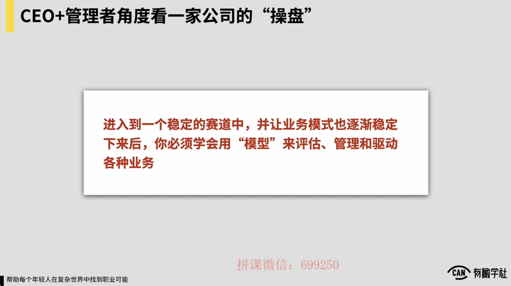

所以如果作为一个操盘手，当你的公司或你所在行业，它的一些机会或者行业的格局逐渐稳定下来之后，你在做经营管理的时候，很多问题都必须要回归到模型上面来，这是例子想给到各位的一个重要的认知。

这两个例子都想完了之后，我们也许再可以来处理体做一些总结了，你会发现一家成熟公司的 Ceo肯定是最大的操盘手，尤其公司的规模越大，操的盘子就更大， CEO怎么来管理和思考一下公司的运转？

从某种角度是说CEO同时要向外看和向内看，向外看关注市场变化，看很多的空间，看很多潜在的机会，然后向内看要以经营的逻辑来评估各种业务模型和经营模型，找到我们业务当中存在的问题，而过程当中一定是要根据外部环境变化的快慢和我们当前业务成型的程度来不断动态进行调处理的。

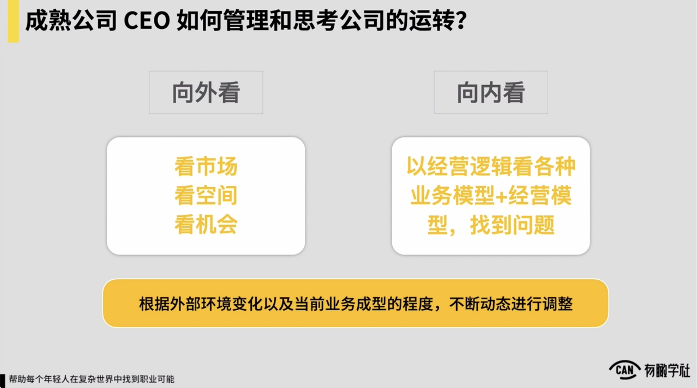

理论上就像我们的，我们外部环境变化越快越频繁，我们当前业务的成型成熟的程度，然后如果越低，我们调处理或者迎接变化的这样的这种状态就要也变得更加的敏捷。但如果说我们所在行业格局已经相对稳定了，然后我们这家公司的核心的业务逻辑也较为成熟，也许我们不需要那么频繁的来去进行变更，从某种角度是这样的。

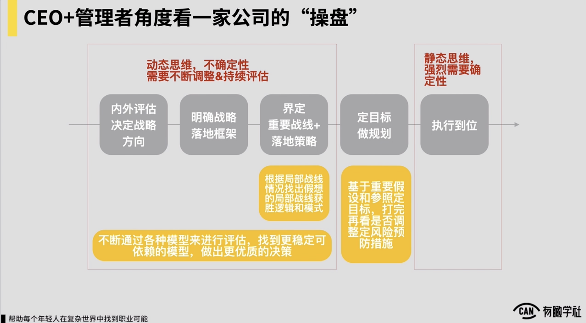

到了时候再回过头来看，我们在本节起初给各位分享的一个CEO和管理者操盘一家公司运转的这样的一个方法论，或者这样的一个这种思考框架，也许各位会理解起来会更加的深刻，这里边一定区分好我们说的动态思维和静态思维，如果你作为一个执行者，你需要的是确定性，你脑海中的思维更多是静态的，但如果你想成为一个操盘手，各位一定要先学会动态思维，以及一定要开始建立起来基本的认为，用模型来去评估和界定你所看到的很多的这样的这种业务。这是第一小节我们想跟各位去分享的。

***

1.向外看：看市场（市场动态）、看空间（增长空间）、看机会（新的跑道）

2.向内看：以经营的逻辑看各种业务模型+经营模型，找到问题

1.1.2 案例2：假设你是新东方CEO，发现收入增长30%， 利润下降30%，挖掘其中原因。

业务层面：

业务板块拆分→找到问题板块→分解增长引擎→看打法

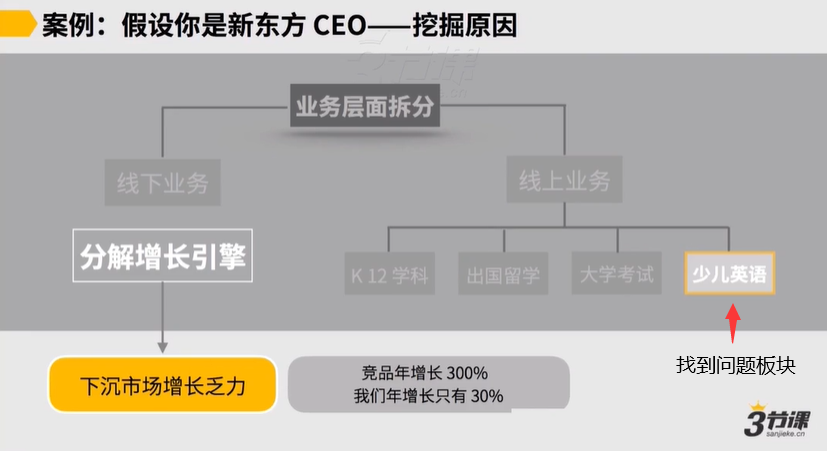

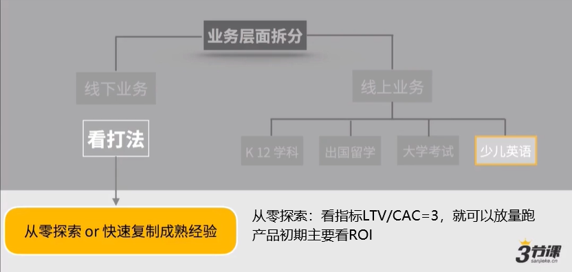

财务层面：

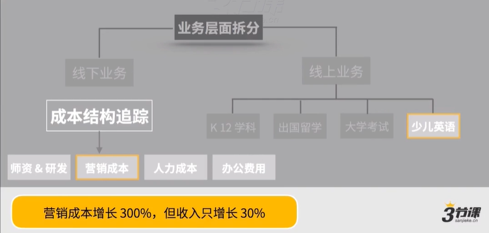

