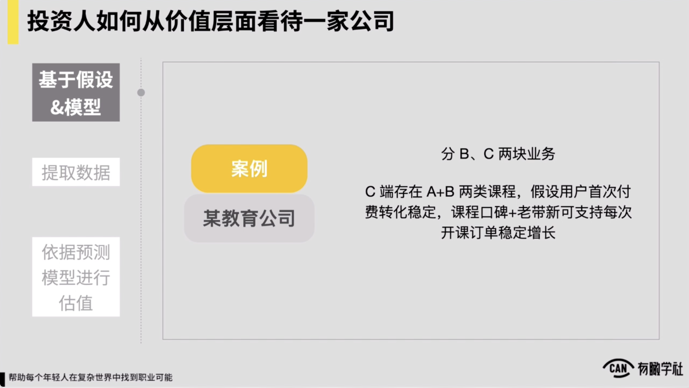
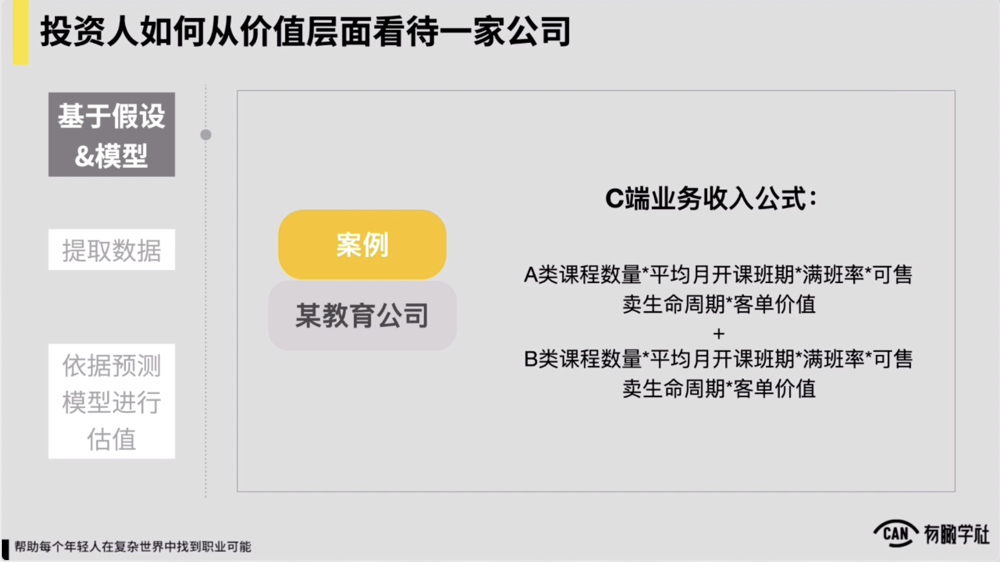
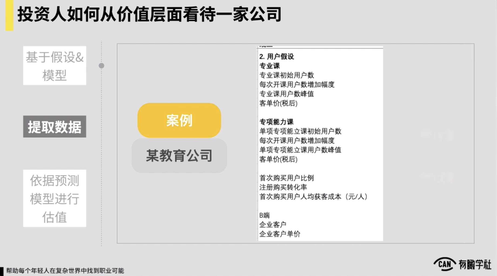
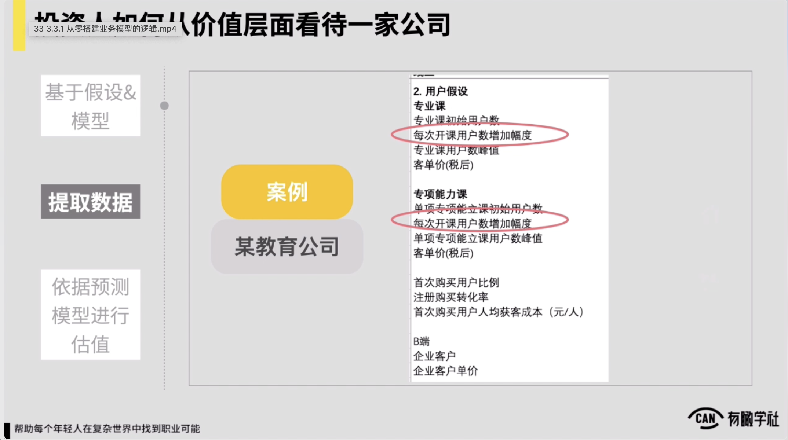
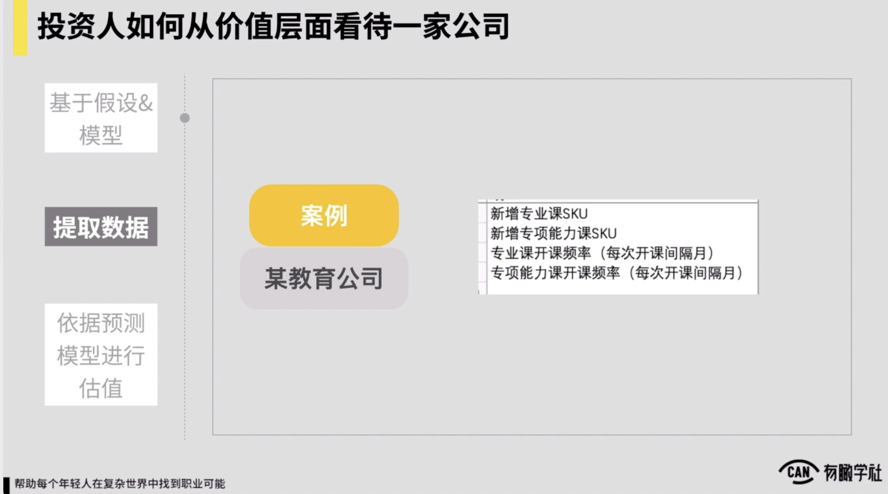
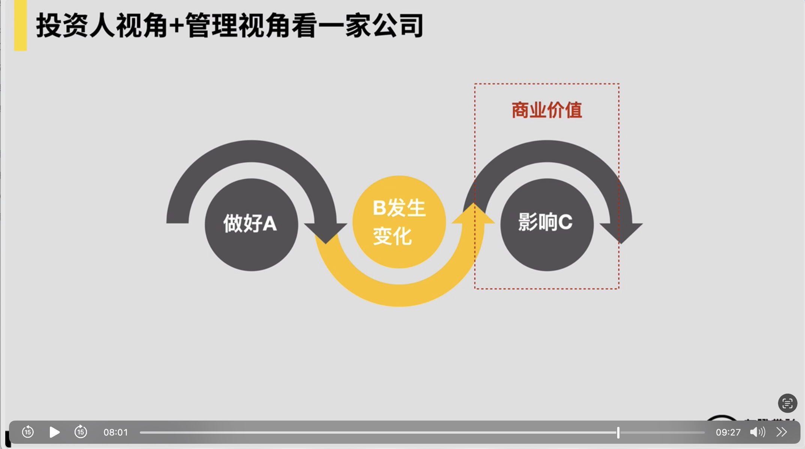
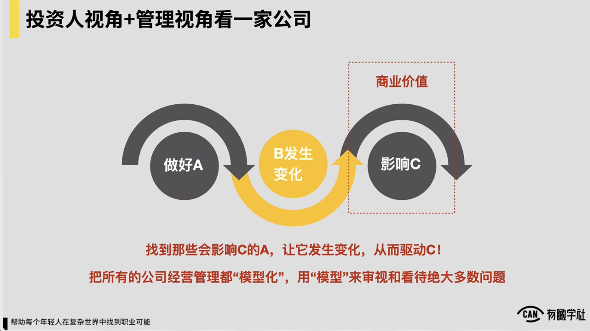
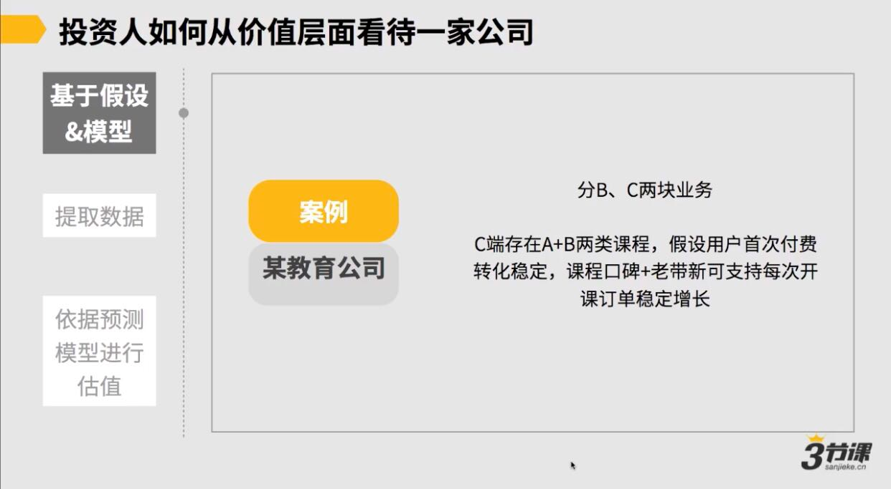
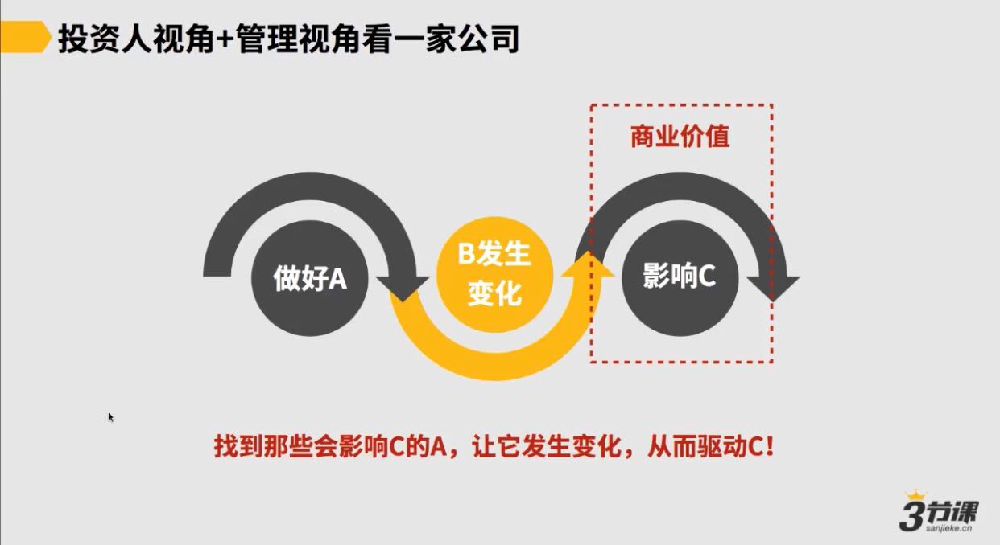

# 2. 如何评估和预估一家公司的“价值”

***

因此，那么随后我们就进入到我们第一部分的第二小节。第二小节我们要跟各位讲的是怎么评估和预测一家公司的价值。对怎么理解这件事，你会发现我们作为一家公司的CEO或者高层，包括说我们作为一个操盘手，从某种角度我们都是要负责一项业务，如果我们是一家公司的最高的管理者，那么最终一定对这家公司的商业价值负责，但是有很多的这种业务，它在发展过程当中可能都还不算十分的成型，如果在这样的状态下，我们到底怎么去评估一家公司的价值？

这件事上我们也想给各位去简单进行分享，那么我们直接进入到这样一个话题，如果你是一个CEO或者你是一个投资人，你面对到一家公司，你怎么去评估它的价值？从某种角度我觉得核心一般来讲，从投资人或CEO的视角来去评估一家公司的价值，核心就看两个部分：一叫做**这家公司当下挣钱的能力**，一年到底挣1,000万还是挣1亿还是10亿。

第二个看**这家公司的成长性**到底是怎样的，从某种角度我觉得CEO或投资人去评估一家公司的价值，就看这么两件事儿。同理评估这二者也都需要模型。，那也再举一个例子，让各位来较为深刻的理解一下这件事儿。

例如如果是一个投资人，我现在看到这么一家公司，然后通常这家公司的情况约是这样的，就一家教育公司，这家公司的业务分成两个板块，分成b端、c端两个板块。

在c端这家公司存在ab两类的课程，他们的业务里头现在形成一个基本的假设，假设是怎样的，说我这家公司我的用户首次付费的转化率只要是稳定的，我的课程口碑和我课程里边的这种用户的老带新就可以支持我的一门课程，在每次开班的时候，我的订单是可以稳定增长的，至少在两年内约是这样的。

，这是这家公司的基本的这种假设。

对从投资人的角度，我尤其是看到一些中早期的公司，它往往是这样的，我们先了解这家公司的业务里边能否形成一些基本的这种业务假设和业务逻辑。基于业务逻辑，我们又形成了一些模型，然后看到模型之后，我们会找一些数据来去验证模型，最终根据我们验证完的模型，我们会形成一个我们的预测的这样的这种模型，来这家公司形成一个估值，约是这样的认为。

，第一步如果我们发现业务里头我们的基本假设是这样的，我们自然就往下，随后我们就形成了一个说这家公司在c端业务下，它的收入公式怎样的，对他收入公式我有两类课程，

这两类课程按照我们刚才讲的逻辑，它都是这么一个认为，我平均月开班课程的这种班期，乘以我的满班率乘以我的可售卖一个课程可售卖的生命周期，比如我们刚才讲了一个课程，至少可能在两年的时间里面，然后它的一个售卖的情况都会是较为正常的，它售卖周期可能至少是两年，再乘以我们的客单价。

同理在b类课程上可能也是这样的一个这种情况，这家公司的收入通常在当前情况下，c端业务里边它会是这样来去构成的，那拉出来这样一个公式到底有什么用从某种角度拉出来这样一个公式，你会发现说如果我想让这家公司的收入增长10倍或者更大的增长，从某种角度我的一些可重点关注的这种变量或者重点关注的发力点，在这公式上就已经很清楚了。

，例如我要么就增加我的a类课程的数量，或者b类课程的数量，或者增加它开班的频次，或者提升它的满班率，或者提升它的客单价，或者延长它的这种生命周期之类的，这都是我可以考虑的事情。

我评估这家公司到底有多大的这种增长的可能性，我就要回到模型上面来。看说这家公司到底它a类课程顶天了能做到多少，然后它的这种课程的生命周期有没有延长的，可能它的课程的售价到底能涨到多高，然后他的这种满班率到底可能应该是一个什么样的状况更合理，我要从各方面来进行评估，理解意思。

随后当我有了这样一个假设也形成这样一个公式之后，我就会提取一些数据，例如我的a类课程叫专业课，我的b类课程叫专项能力课，

然后我还有b端的一些情况，因此，我作为一个投资人，我就提出了一些相应的业务数据的需求，我会请说这家公司的 Ceo帮跑这样一些数据，我根据这些数据再来去评估说我刚才的这样一个这种对这家公司的业务的理解到底到位不到位，到底它的一些核心假设成立不成立，以及这家公司增长的潜力到底有多高，于是我提了一些这种核心的数据，你会发现我在这儿，我在提出数据需求上面，我可能重点去加入了这么一个数据，叫做说每次开课用户数的增加，为什么会有这样一个数据？

你会发现数据为了帮验证，说最开始我在跟这家公司CEO去沟通的时候，他提出那样一个假设，说我的课程的首次付费用户转化率如果是稳定的，我的口碑足够因此，我每次开班之后，在一段时间内，我的每次开班的用户的付费人数，付费的报名数它就会自然增加，我要通过这样一个数据去验证假设成立不成立。

那么随后如果我看过数据了，数据告诉我说确实至少在一年一年多的时间里面，这样的一个业务假设在这家公司当前情况下还是较为成立的，好我就可以回到收入公式上面去了，我就在那收入公式上一项一项的去看，去看我的当前的例如课程的数量，当前的用户付费的这种转化率，当前的客单价，以及当前我们专业课专项能力课，现在的开课的频率约是怎样的，

包括市场上我们前端的流量的情况，转化率情况约是怎样的，我要去评估一下说当前这家公司要想增长，它最大的挑战在里？最大的可能性和上限到底在里？我就会看这样一些这种数据，看完数据之后，最后就回归到我们到预测模型里边来，预测模型直接跟我们的收入公式有关，我们通常就评估完了之后，约形成一个结论，说这家公司未来一年约能上线，例如5门a课程和6门 b课程开课频率有机会增加可能150%，然后总体上在未来一年之内，这家公司有形成550%倍以上的这种收入增长。

这当中的主要的这种风险什么？说这家公司前端流量的这种获取的能力不够强，或者是说增加了更多的这种课程之后，它的转化率降低之类的，从某种角度我作为一个投资人，我处理体去评估一家公司的价值，大体这样一个逻辑，先有业务假设，形成模型，提取数据验证假设和评估我们的模型，最后根据我们的预测模型来对这家公司未来的走势来进行一个评估和判断。

所以这一小节讲完之后，我们再来回溯一下，从投资人或者管理的视角来看待一家公司，它的本质是什么你会发现它的本质一定是说我先锁定了这家公司的商业价值，假设商业价值它是一个c我核心往前倒推，我脑海当中一定要有各种各样的模型，

我最终是通过做好a a影响了BB发生了变化，最终b的变化带来了c的提升，一定是这样一个逻辑，所以从某种角度我们作为投资人或者作为管理者，我们就要在脑海当中去建立起来很多这样的模型，我们要找到那些会影响c的a让a发生变化，a驱动了b最终驱动了c约是这样一个逻辑。

所以我们一定要学会一定要有意识，慢慢的学会把所有公司的经营管理都逐步的变成模型化，我们才有机会成为一个更合格的操盘手，用模型来审视和看待公司经营管理过程中的绝大多数问题，这也是对于我们作为操盘手的一个十分基本的要求。

最后一二小节我们都简单汇总到一起做一个总结，那一家公司经营管理必然高度依赖于很多模型，那在市场和模型都不稳定的时候，你作为一个操盘手或者是一个管理者，你是必须保持动态的思考的。因此动态思考的视角和建立以及可优化各种各样的模型，是一个操盘手的必修的功课，这是我们在前面两个小节的内容里边想核心给到你的一个认知。&#x20;

***

### 2.1 如何评估一家公司的商业价值

1.挣钱的能力（现在的挣钱能力）

2.成长性(未来的增长性，比如能否在5年内获得几十倍的增长）

### 2.2 投资人如何评估一家公司的价值

**从所处阶段上：**

对于早期公司，找到做大的可能性

对于成熟公司，一定看模型！根据增长速度、盈利能力计算估值和增长空间

**从业务上：**

1.考虑这家公司依据的假设&模型是什么

2.提取数据

3.依据预测模型进行估值

### 2.3 投资人视角+管理视角看一家公司的共性

投资人和管理者，关注的都是一家公司的商业价值能否得到合理增长。

他们都需要根据一个业务模型，找到那些能影响商业价值的因素。

