# 3. 一个商业系统中的3大模型及其关系

***

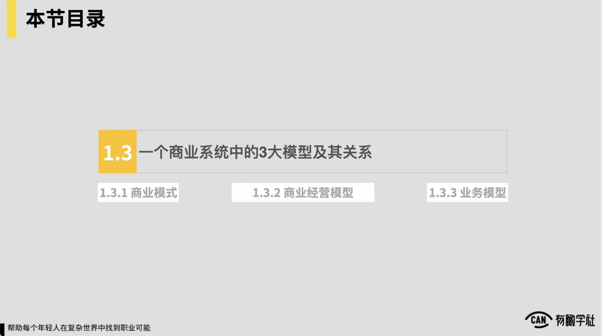

### 1.3 一个商业系统中的3大模型及其关系

因此，随后我们就将进入到我们第一部分的第三小节，在前两节里面我们一再提到了作为一个操盘手，可用模型对吧去评估或者审视一家公司一个业务是十分重要的事情。第三小节我们就想帮助你建立一些最基本的概念，我们将会给你分享一个商业系统里边的常见的三大模型以及它们之间的关系，我们不妨就直入主题引出这三个重要的概念。

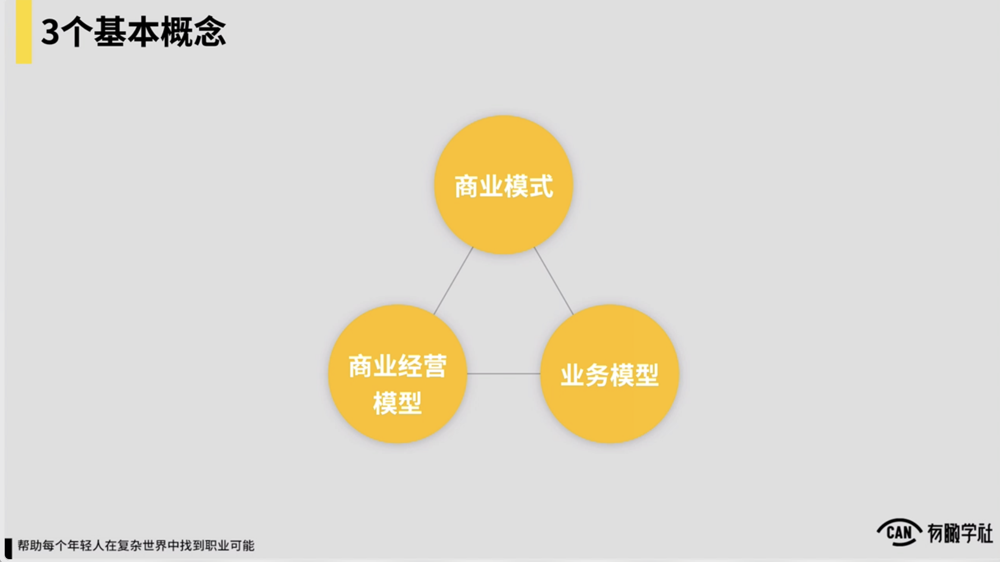

一个商业系统当中会存在三大常见的模型，分别是什么？分别叫做第一商业模式，第二商业经营模型，第三叫业务模型。这我们在此要跟各位介绍的三大常见的模型。

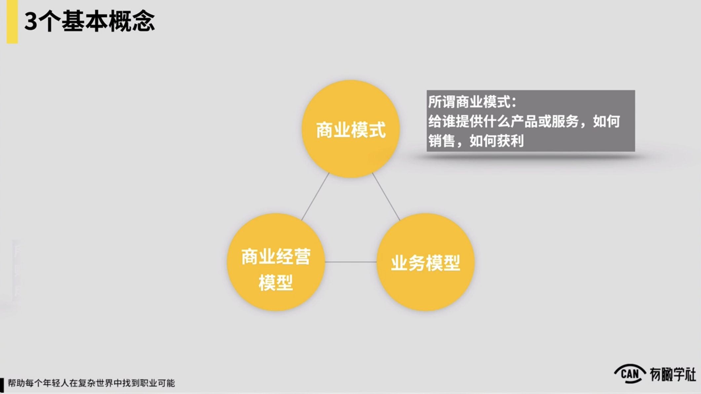

这三者到底是个什么东西？依次来查看。首先商业模式所谓的商业模式到底是什么？从某种角度商业模式是说一家公司到底它面向一个什么市场，比如面向to b的市场还是to c的市场还是to g的市场。提供什么样的产品或者服务，怎么去销售，如何来去获利，例如是撮合很多人来去交易，获得抽成，还是说他是做流量卖广告，还是说他就自己生产一些这种实物的产品来去销售。

这是所谓的商业模式，一家公司面向什么市场，提供什么样的产品或服务，怎么销售，如何获利，这是商业模式。

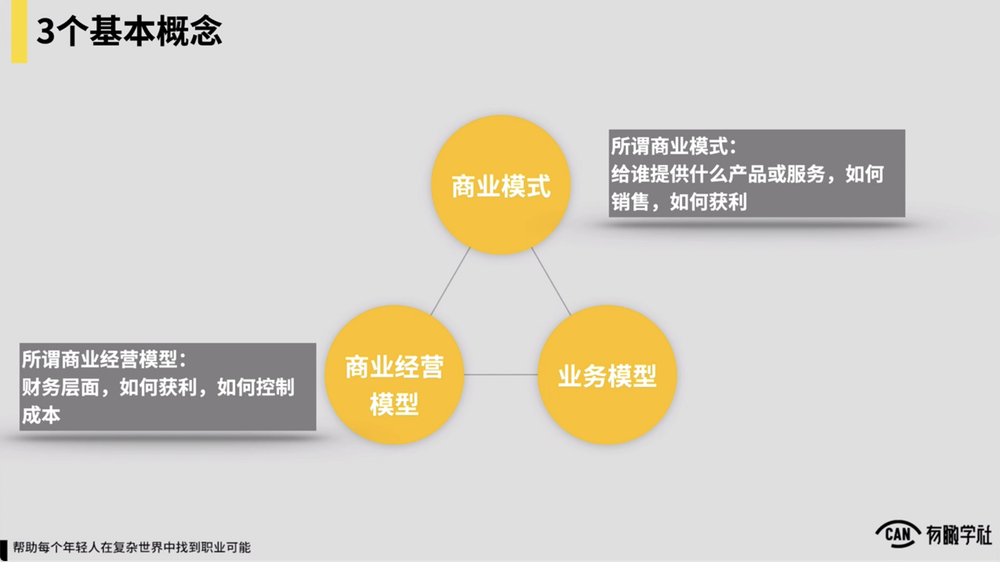

第二个概念叫做商业经营模型，什么是商业经营模型？商业经营模型也可以直接就称作是财务模型。他讲的是说一家公司的在财务或经营的层面，处理个公司它成本收益的情况是怎样的，它的利润如何产生，然后它的成本结构里边主要分成几个大的成本板块，怎么可对于它处理个的成本收益的结构进行监控和优化，是叫做一家公司的商业经营的模型。

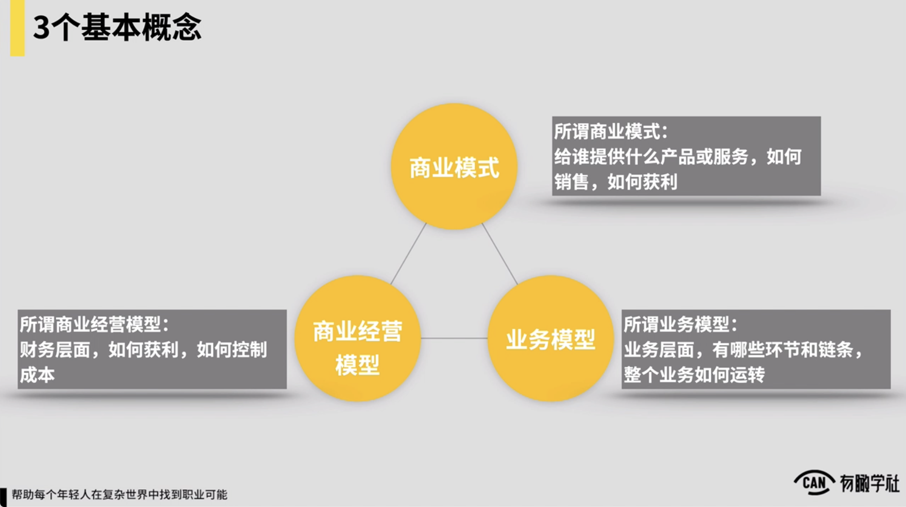

第三个我们的业务模型，什么叫做业务模型？业务模型我们处理体的业务怎么来去运转，业务模型像之前我们提到的，它又会分成说处理个公司全局的业务模型和局部的业务模型这样的区分，进一步的区分，我们将在第二章里边更具体来展开，但是在这儿我们就简单理解一下，业务模型处理体讲的说处理个我们的业务是如何运转的，有些业务环节和链条来构成我们处理个这家公司最核心的商业价值的产生，是如何被驱动增长的，有些环节和链条来去影响到我们商业价值的提升，这是我们所谓的业务模型。

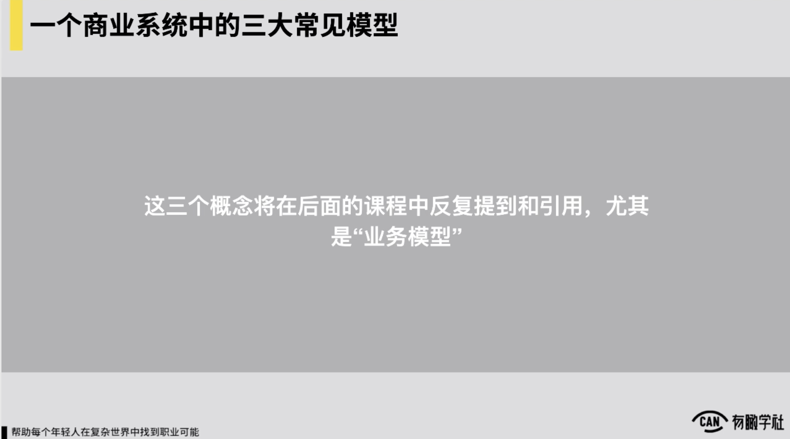

在概念的层面，我们就简单这么来理解这三大常见的模型就以上。

那么这三个概念将在我们后面的课程当中，就这门课程后续内容当中被反复的提到和引用，尤其是业务模型，在这门课程当中的戏份和占比是十分的重要的，在此各位先有个基本认知就以上，我们稍微的展开一点点，依次再介绍一下这三大模型。

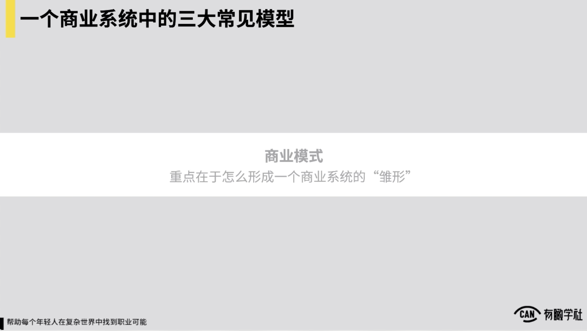

首先还是商业模式，然后商业模式它的重点就在于说怎么形成一个商业系统的雏形，或者说有几类常见的商业系统，这商业模式。

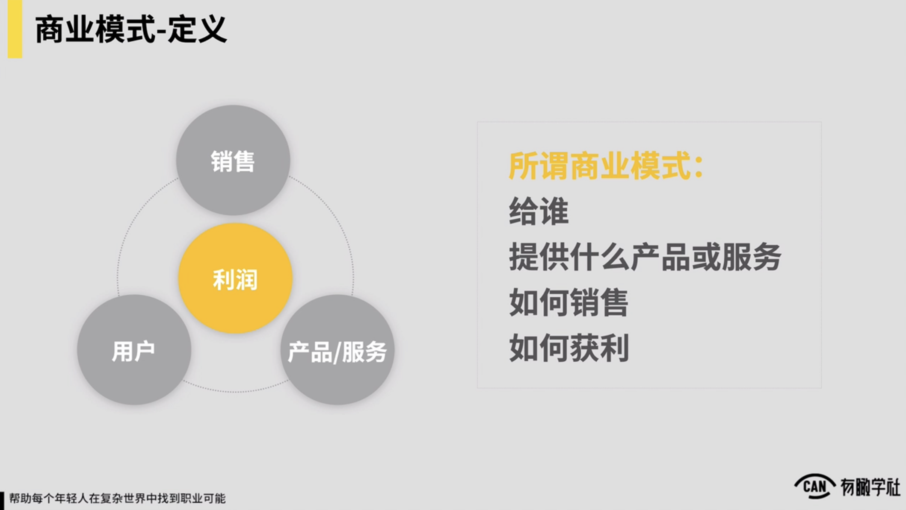

，然后就像我们前面提到的所谓商业模式，面向什么市场，提供什么样的产品或服务，怎么销售，如何获利，这是所谓的商业模式它的一个基本的定义。

如果是我们基于互联网的这种环境来看，你会发现在互联网所在的这种环境，互联网泛互联网的行业里边，常见的商业模式会有几种。

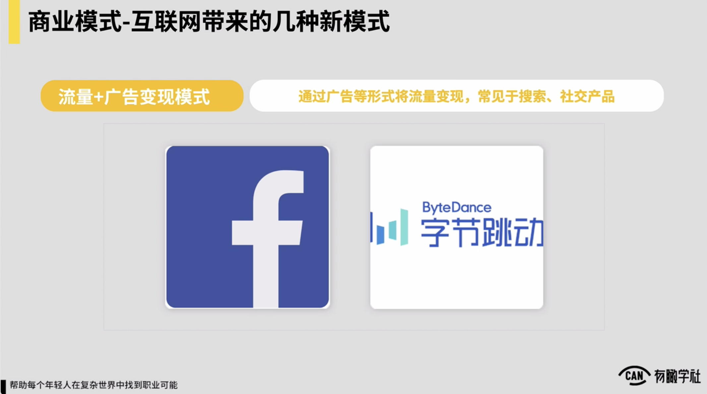

我们简单来介绍一下常见商业模式核心就4种，第一种叫做to c做流量加上to b做广告的这样一种变现模式，这是第一种模式，核心说我通过to c做了很多的这种流量，可能也不止to c To，b也可以做流量，我就拥有了十分多的这种流量，后续我就基于我拥有的流量，通过广告这样的形式把流量来进行变现。

常见像我们搜索的这种产品，社交的产品或者一些媒体的这种产品，都是采用这样的这种商业模式的，例如我们的Facebook，例如像头条字节跳动这家公司，它的头条或像抖音等等这样的一些产品，它核心的商业模式都是这样一种商业模式，流量加广告变现的模式，这是我们给各位介绍的第一种商业模式。

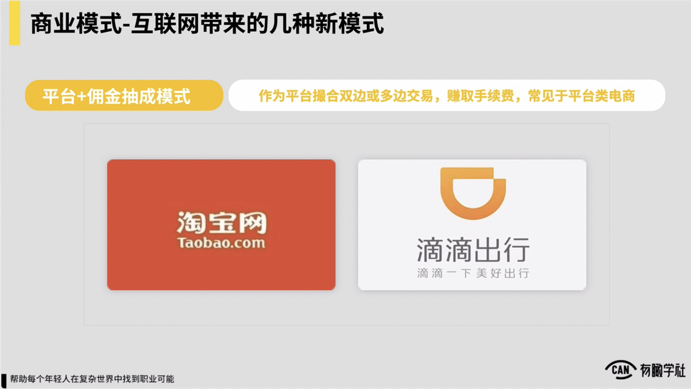

那么第二种商业模式是叫做多边平台加上佣金抽成的模式，这种模式下通常说你作为一个平台撮合双边或多边来在你平台上进行交易，你从中赚取抽成赚取手续费。常见很多平台类的电商。采用的这样的这种商业模式，例如像淘宝、天猫、滴滴、京东等等这样的这种公司，他采取的都是这种平台加上佣金抽成的这样的一个这种模式。这是互联网的这种逻辑下第二种常见的商业模式。

那么第三种常见的这种商业模式to c或者to b的产供销的模式。这什么意思？它通过自主生产和销售一些产品和服务来赚取收入。，就这么一个逻辑，这也是最常见的在我们传统的这种商业逻辑里边最常见的一种模式。

常见的我们像一些制造业、零售业，包括像在线教育等等这样的一些这种行业，它采用的都是这样的这种模式，我自己来生产产品，自己来设计我的这种供应链，搭建我的供应链系统，自己来去做好我处理体的这种产品的销售。，然后包括像亚马逊的Kindle三节课，然后包括像很多这种制造业，有些这种零食品牌等等，它都是这样的这种商业模式。这是我们给各位介绍的第三种商业模式，产供销模式。

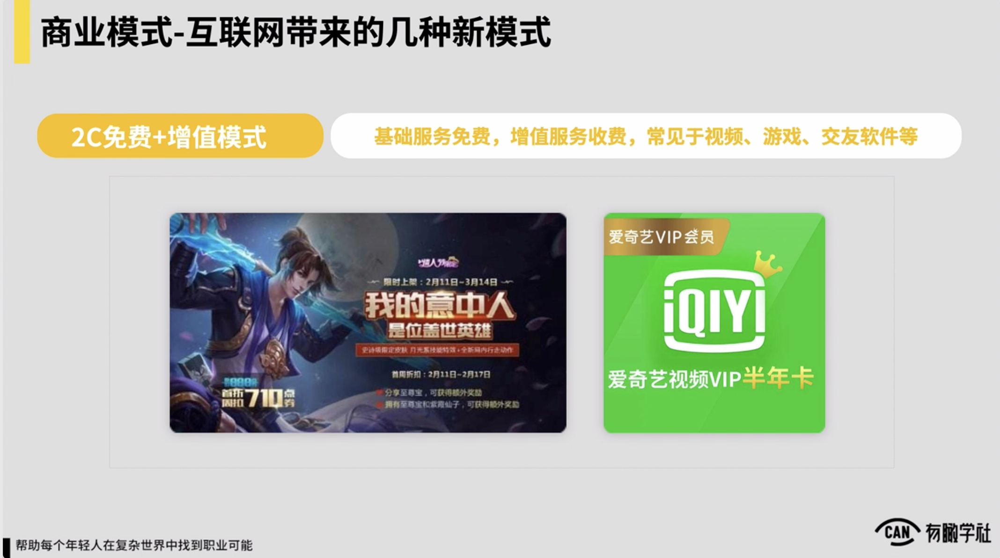

那么第四种商业模式就叫做to c免费加上增值服务变现的这样的一种模式，它通常采用的是说基础的服务免费不要钱，但是我的增值服务是要收费的，采用的是这样的这种方式来去变现。常见的比如像一些视频网站，游戏一些交友软件等等，这样的一种产品，它采用的都是这样的一种模式。包括像爱奇艺腾讯视频，包括像什么王者荣耀，包括像什么探探等等这样的一些这种产品，包括像很多什么狼人杀等等这样的一些在线这种产品，它采取的都是这样的一种这种商业模式。

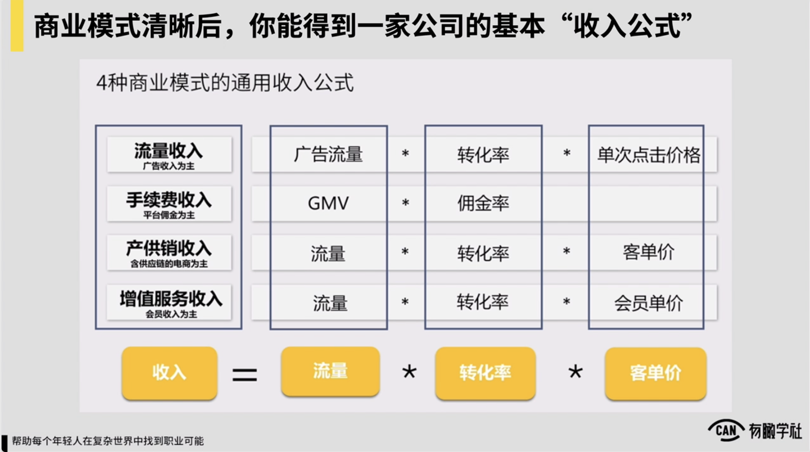

所以以上我们就给各位介绍了4种在互联网的环境下常见的商业模式，那么商业模式对于我们在做操盘做经营管理时候，它会影响什么？从某种角度商业模式清晰之后，你可能就能得到一家公司最基本的收入公式。，当然每家公司它的业务的情况一定千差万别，这就牵扯到了我们要具体去分析每家公司的业务以及后边的业务模型的重要性，但是如果只看一个最基本最简单的1逻辑，4种商业模式它对应的4种通用的收入公式。

对我们在收入上来讲，任何一家公司如果我们画一个通用的这种收入公式，任何一家公司它最基本的收入也许都可以去形成这么一个结构，就流量乘以转化率乘以客单价。然后约是这么一个最基本的结构。

在这样1这种结构下，如果我们采用的是刚才讲的4种不同的这种商业模式，你会发现我们这家公司的收入的这种公式稍微有点不一样的，如果我们是流量加广告来去变现的这么一个模式，我们的收入公式等于什么等于我们的广告的流量数量乘以我们的点击的这样一个这种转化率，再乘以我们的单次点击的一个价格。构成了我们这家公司它的一个这种收入的公式。

我们想驱动这家公司的收入去增长，要么我们就提升我们单次点击的价格，例如可让我们的用户变得更精准，让我们用户的这种例如消费的这种意愿和消费这种场景变得更加的顺畅，让我们用户的质量变得更高，等等，这些都可以提升我们的点击价格，我们也可以提升我们站内处理体的流量，也可以提升我们用户点击广告的转化率，这都是可以去提升我们收入的潜在的这种思考的方向。

，如果我们是采取平台加上抽佣这样的一种商业模式，我们处理体收入公司就应该等于我们的GM v乘以我们的佣金率。

所以对于很多像淘宝天猫这样的平台来讲，gmv就处理体站内的年度这种收入总收入会是总体交易流水收入会是他们十分核心的一个指标。

，然后这是这样一种模式，如果我们是产供销收入这样的方式，通常我们最基本的这种收入公式流量转化率，客单价约是这样的，所以通常不同的商业模式背后对应的一家公司基本的收入公式会是不太一样的，这是商业模式它会影响到的东西。

当然收入公式东西，每家公司依据它具体业务情况，我们要梳理出来的状态，最后可能都会有很大差异。在此我们只需要有个基本的认知，后面的内容我们还会延伸，再来讲这一点。

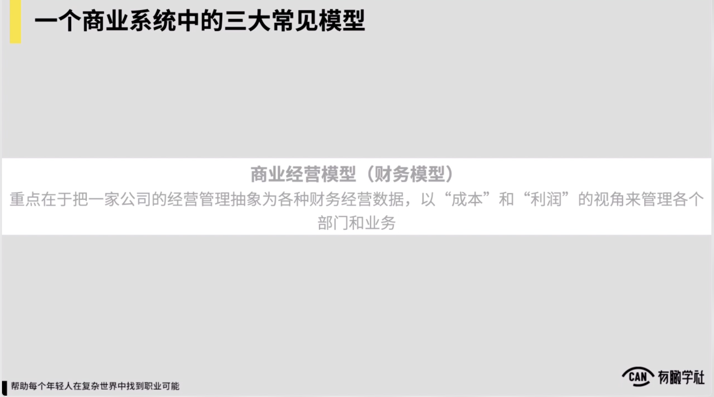

因此，上面我们讲完了商业模式，往下我们再来聊一下商业经营模型或者叫财务模型。对商业经营模型它的实质和重点是在于我们要把一家公司的经营管理抽象为各种财务经营数据，然后以成本和利润的视角来管理各个部门和业务。这是什么意思？说在一家公司的上级或管理层眼中，我们做的一切的工作，包括我们每一个部门。

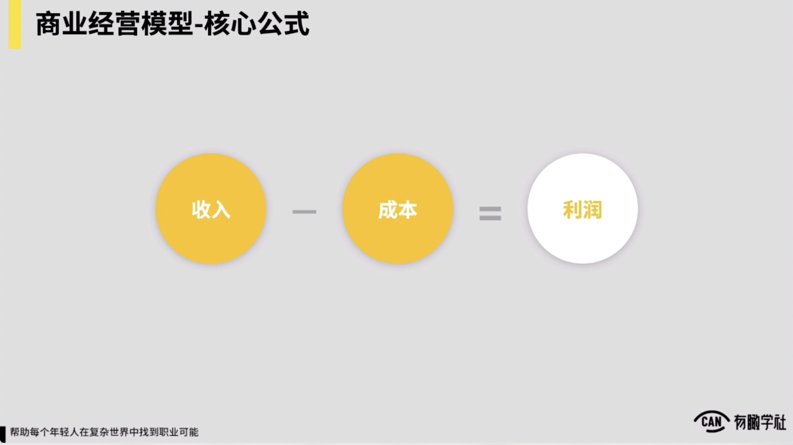

在他们脑海中如果是一个优秀管理者，他都会把这些所有的每个部门每一项工作，它是抽象为成本和利润这样的一个这种关系的，对这样它才能对处理家公司更好的去做管理，约是这么一个逻辑，所以我们在商业经营模型里边是存在一个核心公式的，公式是什么？它十分简单，收入减成本。等于利润约这么一个公式。但是围绕公式，我们要想作为一个公司的管理层，要想使用好公式，我们还需要再进一步知晓一些概念。

，所以随后要跟各位普及的第一个概念是一组词，查看这组词是什么？

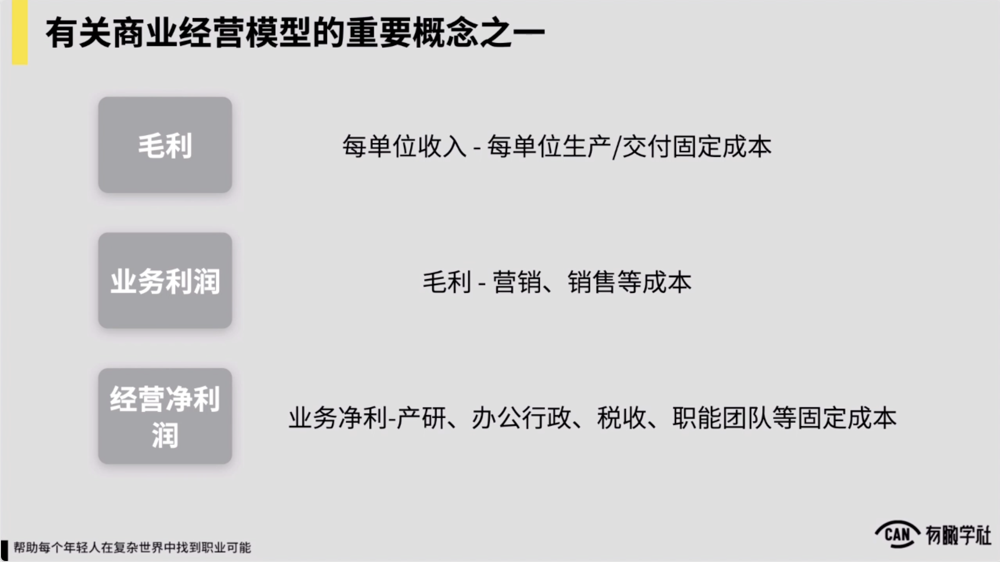

第一个词叫做毛利，毛利，这是每一个。你开公司或每一个你要做点小本生意的人，反正都需要理解的一个词。毛利是什么意思？简单说说你每单位的收入减去你每单位生产和交付的固定成本。

对我举例子，例如你说我开了个餐馆，然后我每卖出一份鱼香肉丝。然后可能收入是50块钱，然后这份鱼香肉丝可能我的固定的一定是例如里边放300克肉，放多少油，再放其他的什么样的这种佐料。然后这些东西是我每卖一份鱼香肉丝出去，我一定要付出去的固定成本。

，约是意思，所以我的鱼香肉丝的毛利应该是等于说我刚才说的这50块钱，减去我的生产，可能还包括一些服务人员上的这种固定成本。

，然后所以这是毛利的概念。毛利在一家公司里边是评估的是说我们的产品它的盈利空间到底是大还是小，毛利，约是这么一个数据。对随后第二个概念叫做业务利润，什么叫业务利润？简单说业务利润在一家公司里边，反正最常见的定义它等于毛利，减去我们的营销、推广、销售等等这样的这种成本。

换句话，你看我们但凡要想做生意对我们肯定得给我们的产品定价。然后我们有了产品定价之后，我们每生产一个产品肯定会有我们的固定的这种生产成本和交付成本。然后这产品我们肯定得想怎么卖，我们肯定要花一些什么渠道费用，市场费用。有销售团队，销售团队卖出去了，我们还得给销售团队一些奖励或者提成。

然后肯定会有营销或者销售的成本，所以当我们的定价把生产的固定成本减去再减掉营销销售成本之后，随后的得到的数字如果它为正，就证明说我们业务对它是基本可盈利的了，而且数字越大，就证明我们业务的盈利能力它可能越强，约就这么一个逻辑，所以这是第二个词叫做业务利润。

随后还有第三个词在公司管理的过程中，第三个词叫做经营净利润。经营净利润相比起业务利润来，它又有什么不同？简而言之，通常它就等于我们的业务利润减去一般一家公司里边的像什么产研、办公、行政、房租、税收、职能团队等等这样的一部分的一系列的固定成本。

，所以这是我们的经营净利润。

所以这三个词你约进行懂了，你约也就知道说一家公司里边我的上级。他约是怎么来管理一家公司的财务情况的。而且事你但凡往下再想一层，你就会发现所有的我看待业务利润，我看待经营净利润等等，所有的这些事儿最后一定会一一对应到每一个团队身上，换句话，我这家公司当前经营的情况是好还是不因此。

例如我是要提升我的业务利润，要保证它为正，还是说当前对我们处理个公司的净利润我需要做进一步的提升，我都会有一个逻辑能去下手了，所以这样看来就会更理解说。有些公司的上级当他要保证公司的盈利能力提升的时候，他为什么要裁员？为什么裁员的逻辑是要从某一个部门去下手。你就约会建立一个基本认知了。

以上，我们再进一步用一个例子让各位来更具象认识一下，然后例如以教育行业为例，教育行业很多教育公司里边它的常见的组织结构，公司里边的部门划分约都逃不开，可能有这样的一些部门，例如有我们的教研团队，有我们的教学团队，有我们的流量获客或叫增长的团队。有我们的销售转化的团队，有我们的产品研发团队，还有其他的职能团队等等。

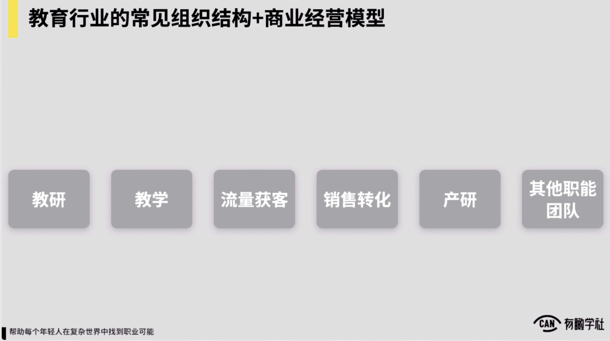

这是一家教育公司反正常见的一个组织架构。

这么一些部门，这么一些人员是你公司里边肯定约率就逃不开的。如果是这么一家交易公司。它的处理个商业经营模型要去对应到所有的这些部门上，约会是一个什么样的认为？它是这样的一个认为，例如这家公司它的毛利可能就等于什么？可能就等于我们每个课程的单价减去我们教研团队的成本，这做一个摊销，例如我们开发了很多课，要摊到每门课上边。

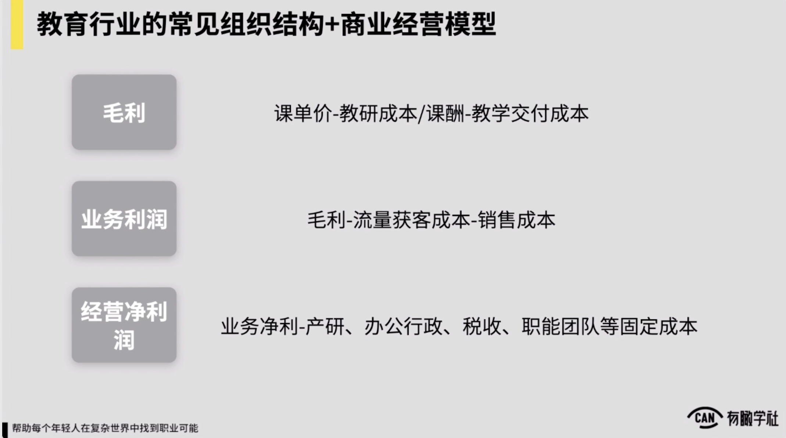

教研团队的成本约是多少，还有这门课程我要支付出去的课程，也应该。算作我的固定的课程研发的支出的一部分，再有还会包括什么？还会包括我的教学交付成本。

，例如我的教学团队。然后每服务一个用户就每完成一个订单的服务，同样成本我要摊出去，然后摊完之后对约每个人是多少钱就会算一个数，于是得到我的毛利，它等于客单价减去我的教研成本，还有课酬，再减去我的教学交付成本，得到我这家公司的一个毛利，通常我们会在管理的时候对会对一家公司可能要提要求，会说它的毛利至少要在百分之多少。

例如要在70%以上或者65%以上，提这么一个基本的要求。

以上，随后再往下这家教育公司，它的利业务利润应该等于什么？通常就等于我们的毛利减去我们流量获客的成本，再减去我们的销售成本。流量获客成本里边既包括了我们例如去投放在市场上要花的钱，也包括了我们的例如团队的成员的成本。对销售成本，包括说团队成本，加上一些销售团队的什么奖金激励等等，还有一些辅助物料，这样的一些这种成本，这些都会记到销售成本里边，所以这是业务利润，教育公司的业务利润。

再往下这家教育公司的经营净利润。它会等于什么？一定就等于我们的上边的业务利润，再减去我们的什么产研办公行政税收，还有职能团队等等，这样的一些固定成本了。

，所以以一家教育公司来举例，你约就会知道我们每家公司的毛利，业务利润，还有经营净利润。

约是怎么算的。

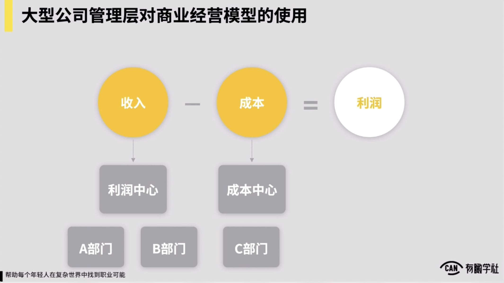

好在基础上，假设我们是一家公司的管理层。我们会对于商业经营模型怎么来去更好的使用，十分简单follow公式，我们往往会把公司里边不同的部门。把他们界定分为说利润中心和成本中心两种选项其中之一，这也是在做财务或者在做公司的管理时候，然后很重要的一个概念和思路。

可能例如我们的部门可能ABC这三个部门，假设例如我们的hr部门。它显著这家公司内部可能一个成本中心，所以我们对部门在定指标或者做管理的时候，我们一定会关注说它的成本对要控制在一定范围内，然后以及在这基础上是否有机会进一步的去提升处理个部门的效率。

就让他的成本或者是人效可得到进一步的提升，而还有一些部门对他可能身上会承载着我们的利润或者我们的收入提升。

所以我们会像这样的部门定目标的时候，就会把收入目标去交给他来背，同时在基础上。也是你具备了收入，同时你还要控制我们的像毛利或像基金利润等等这样的一些重要的指标。

在知晓信息之后，你是可以结合我们刚才讲的所有的内容去思考和判断，说我当前在公司内所处的一个部门到底是属于一个利润中心还是属于成本中心。由此你在你上级面前该怎么向他去证明说我做的工作是有价值的，怎么跟他的一些思考来对齐。你就约会有思路了。这一部分我们在后面的课程当中还会进一步提到，在这儿可能就先做个引子

因此，关于毛利业务利润，然后还有经营净利润，以及包括成本中心利润中心。

这么一系列的概念和名词，我们就简单普及到这儿，随后我们要跟各位聊有关商业经营模型的第二个重要的概念，概念叫做**核心经营单元**，核心经营单元以上，在聊核心经营单元之前，我们就要先进入到这么一个问题里面，不同的公司在进行业务管理的时候，他的收入等等这样的核心指标一般会有一个什么样的团队来负责。

看几家公司。

**第一个是美团。**

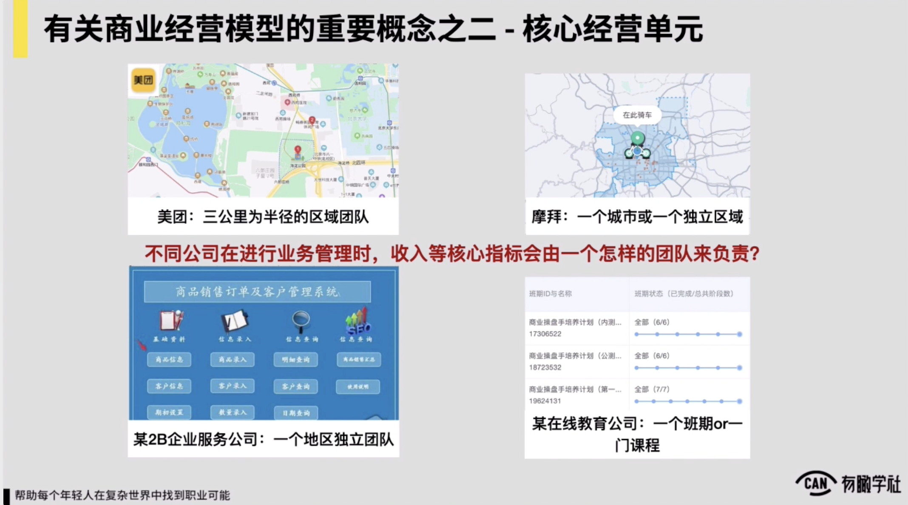

美团我不知道各位了解不了解，美团在相当长一段时间里面，他们是以一个三公里左右的半径划定了一片区域。例如你说北京市海淀区的北太平庄片区或北京市海淀区的中关村片区。他们是约一个三公里为半径的这么一个区域，建一个团队来去建一个独立的运营团队，我在这三公里左右的半径的这么一个区域里边。

我可能要建一个BD团队去BD商家，要有我的配送团队。

完成我的取餐和配送，同时也会去做一些在早期的时候就以这么一个半径做一些定向的地推，从而所有的核心的指标，例如我的商家数，我的什么订单数，我的什么用户的好评度，还有我的gmv等等。

都是由每一片区域的团队的负责人他来去负责的，每一个区域里边都会有约例如七八个人或者10来个人的样子。他们就一起来协同，反正以区域为单位来去作战，约是这么一个认为，这是美团。

再来看膜拜共享单车的膜拜在它中早期的时候。它是怎么来去拆分自己的一些这种核心指标的，一般去摩拜也跟美团会有点相似，它往往是以说一个城市或者也是一个独立的区域。来去独立背一块的指标，只不过摩拜就不像美团这样，它会以三公里为半径。

来去划定自己的片区了，它通常例如在北京市什么海淀区、朝阳区，还有东城区西城区这样。

在上海也是像黄浦区杨浦区，然后长宁区等等，类似这样的一种方式来去划定，也是每个区域里边有一个独立团队，团队来监测。说我区域里边，然后我的单车数量，然后有多少区域里边的单车。它可能不同的时间段该怎么来去调动，该怎么来去做一些调度。

然后等等这样的一些工作都是每一个区域团队自己来去安排。同理也是每一个区域团队独立来为区域里边的订单量 Gmv还有平均每个单车的使用率。然后来去一同来负责，所以这是摩拜。然后再往下某to b的企业服务的公司。

对在to，b企业服务公司里边，通常我们会看到较为常见的逻辑，它是会以说地区来建独立团队，或者会以行业来去建一些独立团队，例如像神策数据、阿里云等等，华为云等等这样的公司，他们一般很多公司都是说要么是分地区。

每个地区可能有一个独立的，包含我的售前售后，还有说客户成功等等这样的一系列的团队，要么我办一行业。

例如像制造业一个大行业，像我们的服装行业可能又是一个大行业，像我们的什么互联网行业又是一个大的行业。就我按行业来去建构我的处理个的团队的配置，当我的团队结构这么建起来之后，同理也是我的所有收入，我的指标都会背到这么一个独立团队身上去。

而例如像在线教育的一些公司，然后往往它有把收入，还有说像一些用户满意度，还有像什么完课率等等这样的这种核心指标，会猜到说一门课程或者甚至可能更小，有猜到说一个班期升上去，然后同理也是说每个课程就被视为一条产品线，产品线下对可能也是有一个独立的团队独立去为他的处理个的收入负责。

你会看到在不同的公司里面，根据它的业务属性不一样。每家公司它收入拆解的逻辑或者它收入构成的逻辑，还是会有十分的差异的，这就引出来了，我们要跟各位说的概念叫做核心经营单元，所谓核心经营单元指的说一家公司在进行业务管理和收入拆解的时候，往往会按照特定的业务逻辑去拆解组合，而形成了一些更易于被管理的收入构成的单位。

例如就像我们刚才提到有些公司说他会把收入拆到说我按地域来去划分。甚至可能说像一些比如像房地产的中介的这样一种行业。他会把他的收入拆到每一个门店上面，他的收入是由诸多门店的收入来构成的。有拆到某个团队上面，有可能我拆到每一个人上面，这都是有可能的，这种拆分上的差异是因为说每家公司它的业务逻辑是不一样的。

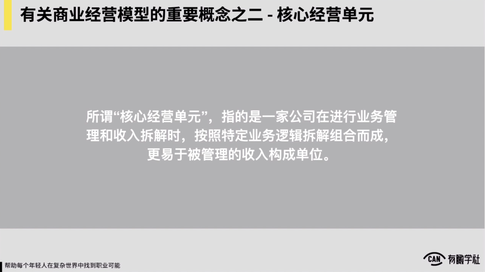

，所以这就导致了它的核心经营单元会不一样。核心经营单元也我们从一家公司管理上较为合理的收入构成的单位，约是这样。

以上，我们为什么会引入这么一个概念叫核心经营单元。

它是这样的一家公司的核心经营单元如何构成？

往往也决定了我们从管理算账的角度，像毛利业务利润等等这样的一些核心的数据到底该怎么计算，以及公司内部的这种部门协作关系。和目标的制定，我们到底该怎么来确定，就像我们刚才提到的。

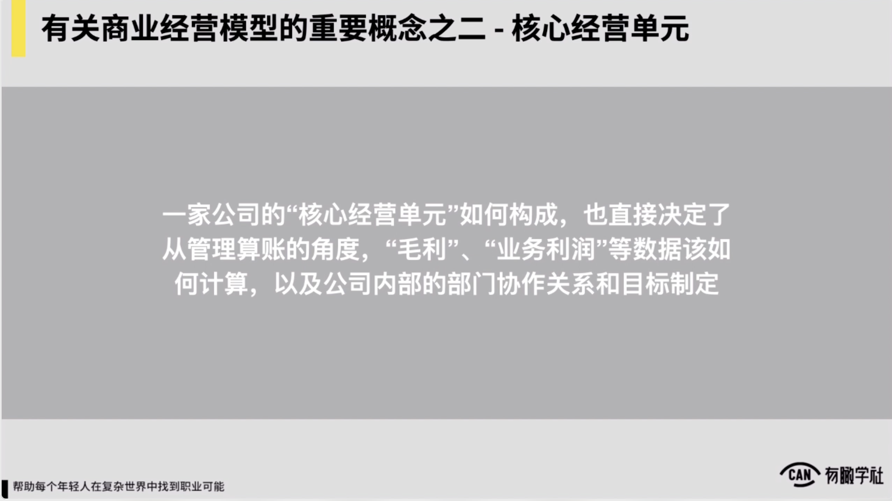

比如以美团的早期，如果它是以三公里左右左右的半径。为一个区域来去计算我的处理个的收入，例如我算业务利润的时候，我肯定每一个独立的三公里半径的这么一个区域团队，我也许都需要去考核他们的 GM v加上他们的业务利润。包括像摩拜这样的公司在中早期的时候发展的时候。

我也一定会该城市去考核，说你看每个城市它的业务利润约是一个什么样的情况，所以当例如我处理个的业务利润可能不太好的情况下，因为毛利可能就像共享单车这样的行业来，我每个单车生产成本还是相对固定的，但业务利润在每座城市一定就会有差别了。

所以个城市它的业务利润做得不因此，我就会找城市的老大可能去做问责，也会这些目标制定也会影响到说他们不同的部门。该怎么样去彼此来做一些协作，例如你说一像摩拜或美团。一座城市的老大，然后他可能需要去在一段时间里边提升说我的单车或者我的单个门店的经营的效率，或者说某个订单的配送的效率。

需要跟我们的一些中台部门或产业部门去做协作。

协作上面他他们就一定涉及到我要有一些目标的对齐，所以这是我们跟各位分享的第二个重要的概念，各位关于核心经营单元概念，也在这儿先建立一个基本的认知。

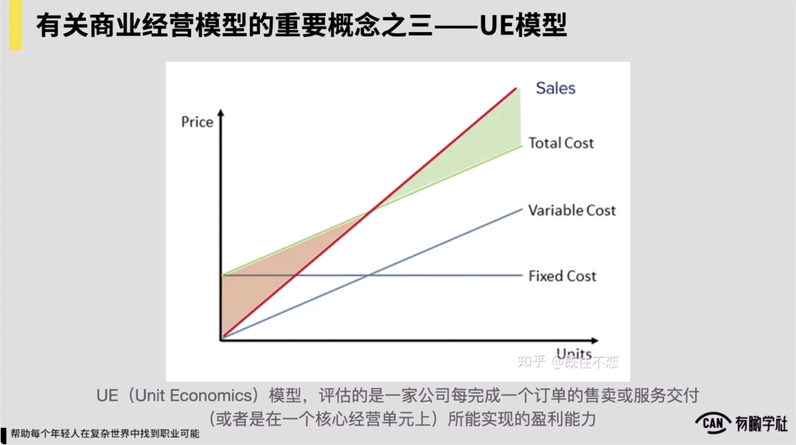

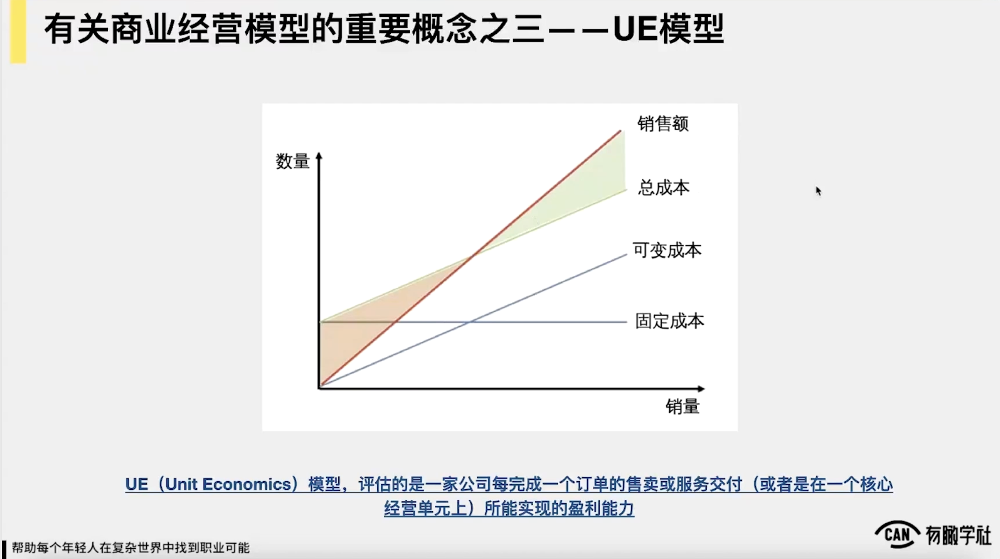

因此，随后我们就要给各位分享有关商业经营模型的第三个重要的概念，它叫做UE模型。那么什么叫UE模型？UE是两个英文单词的缩写，叫做unit economics，也UE模型，也我们的叫做单位经济模型。它是评估的是说一家公司每完成一个订单的售卖。

或是服务交付。

或者是在一个核心经营单元上所能实现的盈利能力约是怎样的？

这是UE模型的作用，UE模型怎么来评估这件事，我们摘取了这么一张在知乎上找到的图，跟各位来最简单的来理解一下这件事，首先我们肯定要界定我们要评估的 Unit它到底是什么。对在大部分公司里边，可能我会按一个订单来去评估。

当然也有的公司会按照一个核心清单员，例如一家线下门店。来去评估说我的每个 unit它的盈利能力约是怎样的，怎么评估简而言之，在UE模型的语境里边会把我们的成本分成说固定成本和可变成本两部分。

对什么叫固定成本？什么叫可变成本？我给各位举个例子，例如我开一家线下的餐饮店，你看我开这个店，初始的时候我肯定要采购一批设备肯定要采购一批设备，然后以及我们公司可能固定的给一家餐饮店，一年假设有个100万的品牌宣传的费用，然后这两部分可能就会做成说这家餐饮店这一个店每年的固定成本，也说不管我这家店一年最后我能卖多少个订单，能接待多少位客人出去，这部分钱反正这家店我就必须得花的，就叫做固定成本了。

，还有一部分叫做可变成本，什么叫可变成本？说我每多卖一份订单或每多成交一个用户。然后我的成本都会伴随着订单量的增加和客户数量增加而随之增加的。例如我们的菜品采购的费用。或者是我们用来去做精准的获客的这部分的费用，例如我们在一些周边地区要发一些什么代金券优惠券。然后这些代金优惠券被算作我的获客成本，它也是每一个用户进来了。

使用一个代金券，是我要把它算作是一个支出的，这些所有的成本都会叫做是我们的可变成本。

对因此，有了固定成本有了可变成本之后，你会发现我们评估店它的盈利能力，约就会呈现出来有这么一张图，这张图上。首先我们会有我们的销售额，然后以及会有我们的固定成本和可变成本，还有我们的总成本。

，通常你会发现可能这家店的盈利点会出现在某一个规模上或某一个时间点上，例如你说我平均每天或平均每个月，我的成单量我的订单量突破可能一个多少的数字了，比如突破1000订单，单月可能有个5000订单，约是这么一个数字的时候，我这家店就一定能实现稳定盈利了，找到这么一个点。

所以这UE模型的一个基本应用逻辑，在一家公司里面，我们一般都会从管理角度要密切的监测UE模型，从而来帮助我们判断我们这家公司将来面向未来它的盈利能力约是怎样的，以及我们的盈利点。有在一个什么样的时间段，或者在一个什么样的条件下，它才会出现，这是优异模型。

因此，那么随后再进一步来看两个例子，来了解一下UE模型在我们日常管理当中它的应用到底是怎么应用的。我们第一个例子是某线下连锁奶茶店，它的单店的UE模型这家公司。它去测算它的处理个的经营的核心经营单元，通常是按照说我的单店来去评估说每个店的盈利能力是怎么样的，对单店流域模型体现在一张数据表上是什么认为？

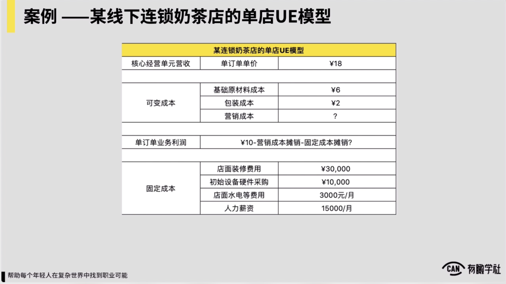

查看。首先它的单店的核心经营单元的营收，它是按照每个订单这样来算的，它单个订单的单价18块，也我平均每卖一杯奶茶出去，我收入是18块。这18块钱里边，它有几部分的可变成本，在可变成本有三部分组成，首先是我们基础原材料的成本，就我卖一杯奶茶。

我的那些配料，我的什么珍珠，我的布丁等等那些东西，我平均每杯奶茶的基础原材料成本是6块钱，然后会有我的包装成本，我每杯奶茶的包装成本需要去付出两块钱，然后还有营销成本，在这儿我们打了一个问号，为什么？

因为每家店它的营销工作可能做得好或者不好还是会有点变量的，它不像包装成本和原材料成本那样。它是十分恒定的一个数值，所以营销成本是每家店的情况，有一定的波动。这是我们的可变成本。

再往下有我们有几块的固定成本，固定成本有两部分是按每个月来算的，每个月我们都会有这么一笔支出，还有两部分它是按照一家店。反正我每开一家店，我就要固定投入这么些钱这样来算的，然后按每月来算，有我们的店面水电的费用是3000块钱一个月，有我们人力的薪资，例如每个店雇2\~3人。

然后我们每个月的薪资支出约是15,000月，这些都是我每个月固定反正要支出的，不管我卖了多少杯奶茶。然后在处理家店上我要支出的固定成本，有我们店面的装修，还有初始的一些设备硬件的采购，然后一共加起来可能有个4万块钱。

所以这是这处理家店的单店的UE模型，所以在基础上，如果我们要去算说这家店他每卖一个订单，就每卖一杯奶茶出去到底能不能挣钱，他会是这么一个算法，也我们的单个订单的单价18块减去我们的现在可变成本里边恒定的数字，是8块钱。

那18-8=10块钱，这10块钱我们还要减掉两部分的费用，一块我们营销成本的摊销，每家店。然后我的营销成本一个月支出约在一个什么范围，然后我摊销到每个订单上是多少钱，以及我的固定成本的摊销约又会是多少钱，然后处理个单个订单的业务利润。它最后是这么来去算出来。这是这家店的单店优异模型。

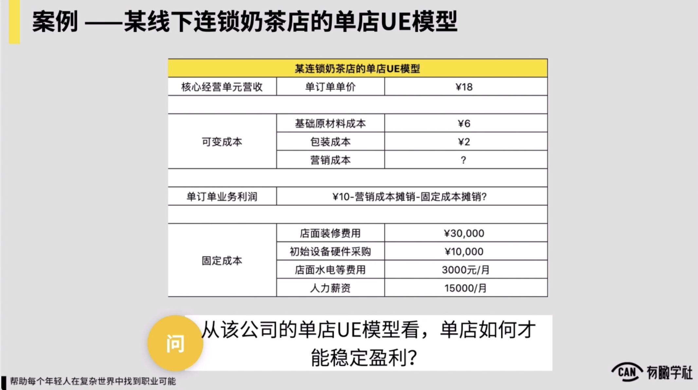

以上，如果是我们已知上面这么一些背景信息，从这家公司它的单店优异模型来看，那单店如何才能稳定盈利如果按照我们前面讲过的优异模型的逻辑，你会发现我们的思路很说第一我们要控制每个订单的营销成本。让每个订单营销成本不能超过一个数字。同时在基础上，我们应该去追求说我们单店的订单数至少每个月要大于一定的数值，这样我们才能做到。

我们单月的收入，然后它是可cover住我们单月要支出的固定成本的，例如假定我们的答案是说我们要控制营销成本不超过两块钱每单，那就意味着我们单个订单的收入减去我们的可变成本，通常可能还会有个8块钱左右，这是我们的利润的空间。潜在利润的空间。

我们还要让他每月能稳定大于我们的固定成本，我们在表里边可以看到每个月要支出的固定成本十分稳定的数值是18,000。在18,000的基础上可能还会有什么店面装修初始硬件采购之类的，它是一次性的投入，但是它一定也会需要去摊销到每个月，假设我们认为这4万块钱分两年摊销到每个月头上，平均每个月。

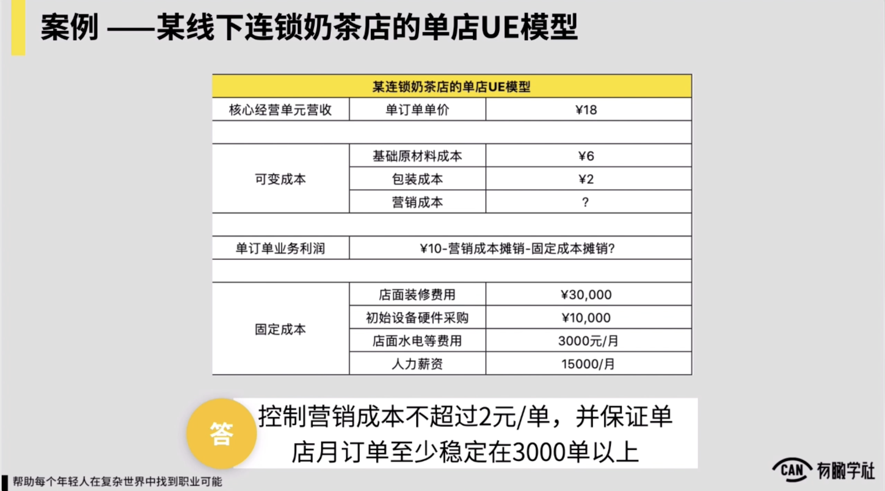

还有个2000块钱左右的摊销，所以我们每个月的固定成本约在2万左右。现在我们在算账上我们要保证的基本的结论，能做到我们每月的订单量乘以8，它能稳定的大于2万。所以从角度来，我们也许就保证我们单店的月订单量至少稳定在3000单以上。只要我们能控制营销成本不超过两块钱，每单每月的订单量在3000单以上，也许我们店单店就可稳定盈利了。

因此，这是一个例子，一个奶茶店的单店优异模型。

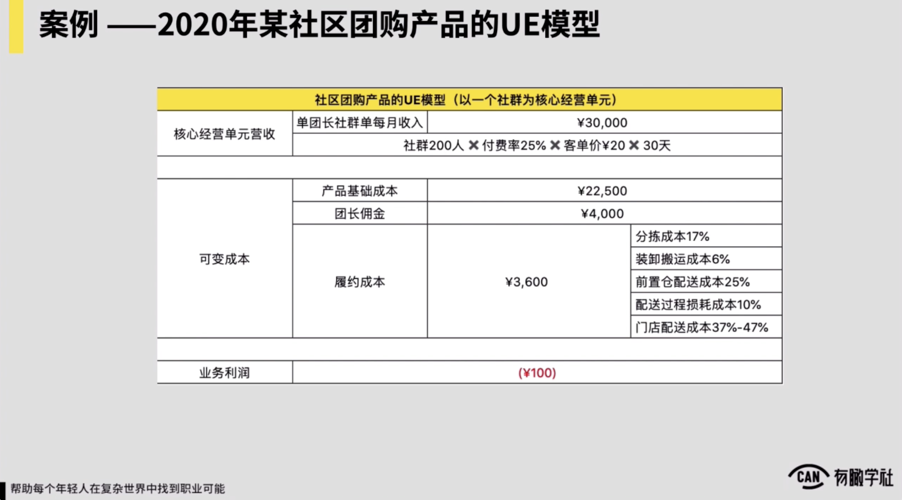

好我们再来看另外一个例子，然后2020年各位都知道社区团购是十分火的，在赛道上几家大厂它的竞争也十分的激烈，所以我们现在看到的2020年对吧某家大厂它的社区团购产品的优异模型，优异模型它是以一个社群，或者说是以一个团长作为核心经营单元，相当于我一个团长在一个地方。

我运营了一个群，这一个群他每个月可为我稳定贡献多少收入，它的成本又是多少，它是这么来去拆分和核算的。

看从数据上查看，具体查看运营模型，运营模型它是以说单个团长每个社群我每个月能为我贡献多少收入？我们看到从现在数据上来看，社群的平均人数是200人，付费率25%，客单价是20块钱，然后乘以30天每天都会有稳定的订单产生，所以我当个团长，在一个社群里边，每个月能为我带来的收入约是3万块钱，这是在收入的部分。

然后再来看成本，因为我是以一个社群来作为我的核心经营单元来去测算，所以社群里边似乎就没有什么固定成本了，全都是可变成本，而我的可变成本，由三部分来去组成。

第一部分叫做我产品的基础成本，也说我通过社区团购卖给我的终端用户，可能像米面粮油之类的，这些米面粮油我肯定得向厂家进货。我进货的成本就叫做基础成本。

因此，所以这部分进货的基础成本是22,500，约是70%多的一个基础成本，随后肯定我要给到团长佣金，所以团长的佣金10%出头一点，现在看起来约是每个月4000块钱的样子。

再有往下还有一部分成本叫做履约成本，什么叫履约成本？例如我的分拣的成本，还有我的装卸搬运的成本，还有我的前置仓的配送的成本，还有我配送过程中。例如有一些菜或者生鲜它被压坏了，可能我得更换一下。所以会有一些损耗，所以我会有损耗的成本。

以及还有一部分门店配送的成本，相当于社区团购它的基础模式是说我从每个城市的中心仓，我要把相关的货品配送到我的每个门店里边，这会产生一个配送成本。

然后我再从门店我每个门店都视作是一个前置仓，我再从每个门店去配送到我的终端用户手里边，所以在前置仓这还会有一笔配送成本，所以它会有这么两块的配送成本，如上这些分拣、装卸、搬运、前置仓配送，过程中的损耗等等，这些全都加起来，我们统一称之为履约成本。

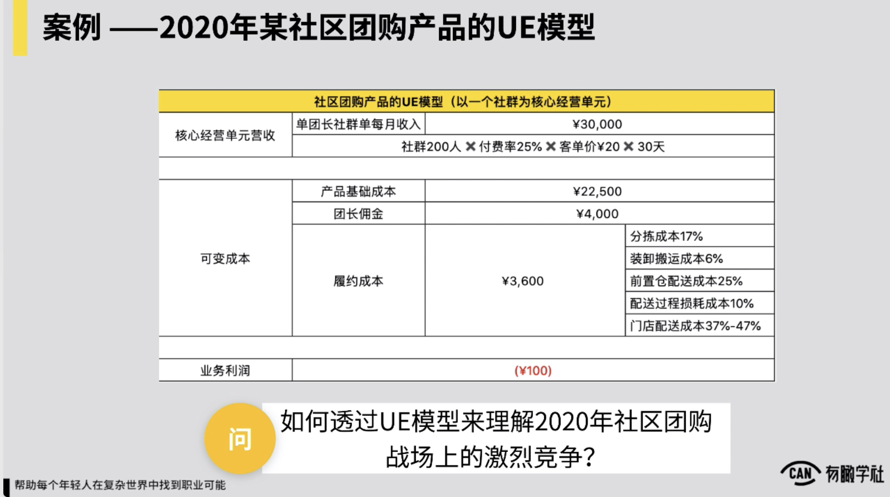

所以我们看到这家公司它的履约成本每个月来去看平均约是3600这么一个状态，所以如果我们是以一个社群每月对吧作为一个核心经营单元来去看，处理个我们的营收减去我们的可变成本约是多少钱，我们发现以现在的数值来看，我们每个月约会亏损个100块钱，我的技术成本22,500，加上团长佣金4000，加上我的履约成本3600。拢共加起来是30,100，而我们每个月的营收是3万块钱，所以我们每个月在运营模型上我们会亏损100块钱。

那么假设我们已经看到了这么一个诱因模型，我们如何透过它来理解2020年社区团购战场上的激烈竞争，这么多家巨头入局。然后每家巨头都做大量的这种补贴，包括我们如果现在是这家公司的管理者。我们看到这么一个模型，我们在决策上怎么来去思考，在竞争决策上会怎么来去思考。

你会发现如果社区团购它的处理个的运营模型约是这样，我们在竞争上面可能基本的思路是说我们要在基础成本加履约成本上形成我们自己的稳定优势，我们能通过我们自己内部流程系统，还有一些协作分工方式等等，这样的一些优化或调处理。让我们能把基础成本和履约成本控制在一定的数字范围之内。我们会向内部的团队可能提这样的要求。

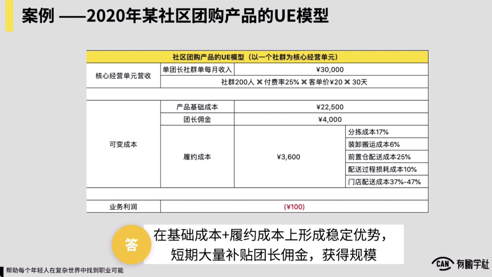

同时为了打好这场仗，我们在短期需要去大量补贴团长的佣金，通过团长作为一个重要的抓手，来帮助我们获取到更大的用户规模，以及去培养起来用户的消费习惯和消费忠诚度。所以社区团购战场上2020年在打的仗，本质上它是这么一场仗，这么来去思考你就会理解一些问题，就会理解的较为透彻一点。

好到这儿我们关于商业经营模型或叫财务模型，处理个我们就介绍的差不多，我们在这一部分里边给各位介绍了三块的重要概念，第一块是说关于毛利业务利润和经营净利润。

各位要知晓这三个名词它们之间的基本关系。第二块我们又给各位分享了核心经营单元这么一个概念，每家公司的核心经营单元他的业务逻辑和业务的模式是会不一样的。最后我们也给各位介绍了一个在投资或者在管理层面上经常用的一个工具，叫做UE模型。所以总而言之，无论是投资人还是公司管理层，各位现在看过我们上面例子之后也会较为有认为了。

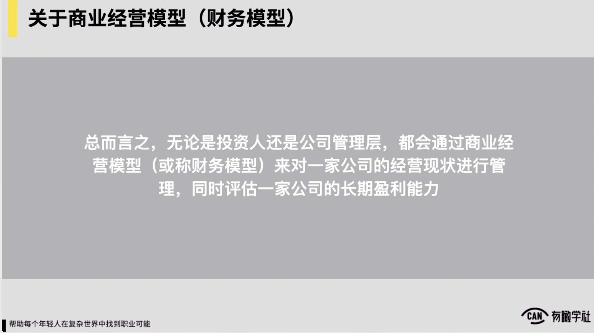

他们都会通过商业经营模型或者叫财务模型来对一家公司的经营运营现状进行管理，同时会评估说这家公司长期对它的盈利能力和发展的可能性和空间到底在里，这是我们的商业经营模型和财务模型这一部分。

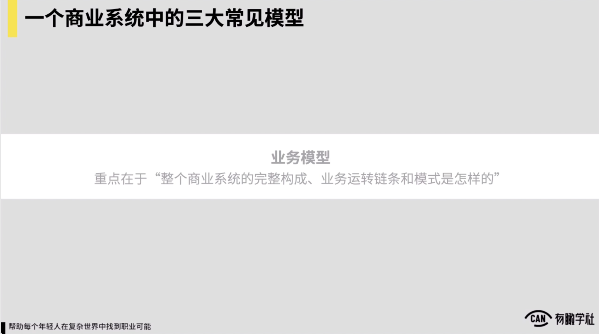

因此，那么最后我们再来查看三大模型的最后一个业务模型，如果说商业模式它是一个商业系统的基础结构，而商业经营模型和财务模型它说我们用数字来去评估这家公司的经营现状，还有未来的盈利，可能业务模型到底是什么？业务模型它重点就在于是说我要把处理个商业系统的完处理构成，业务运转的链条，还有它的模式。各个子系统之间的协作关系约是怎样的，要把东西来描述清楚。

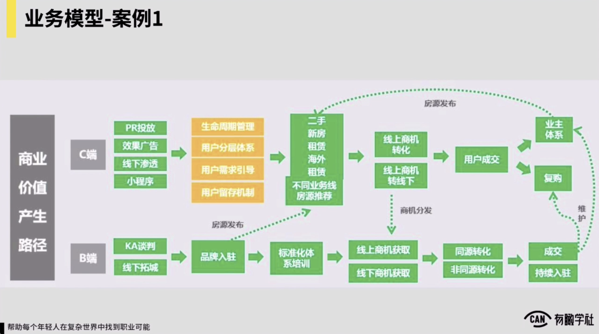

可来看几个例子，第一个例子，这是一家房产交易平台，它处理个业务的全貌。我们通过这么一张图就基本的描绘出来了。对它的处理个业务，我们通过这张图你可以看到它是撮合b端和c端来去完成交易， B端我们的像一些房地产商或者是我们的一些像二手房的租赁方等等这样的一些客户，他是我们的b端，而c端我们个人的这种购房者或租房者。

它的基本的业务逻辑是说拓展大量 b端的房源。入驻我的平台，然后同时在c端通过流量的引流或者一些投放。来去获取到c端的这种销售线索或者用户的资料。

然后用户的资料获取完了之后，我会通过一系列的运营机制。把用户可能匹配到像不管是二手房、新房租赁，还有海外房源等等，然后不同业务线的这种房源身上，我会跟用户来做一个匹配，匹配完了之后。

然后我们还会对用户做进一步的沟通和转化，有涉及到线下的带看，或者是线上的一些在线的看法。最后就看完也把所有的疑惑都解答完了之后，产生用户的成交，成交完了之后。后续可能还会有一个业主的体系的这么一个维护。

通过处理个这张图这家房地产交易平台。它的处理个业务是怎么运转的，然后我的处理个现金流，包括我的处理个的收入商业价值是如何产生的，从前到后。要经历些环节，经历些业务链条，然后我们分别有几个端的工作。要去支持处理个业务链条可顺畅运转，通过这么一张图就能描绘的较为清楚。

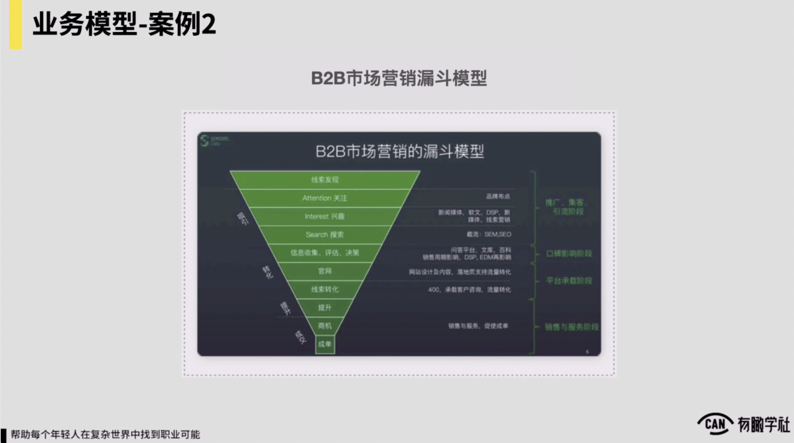

，所以这是第一个案例，当然我们的业务模型也有这种偏宏观处理体的业务模型，以及偏局部细节一点的业务模型。比如看第二个案例，第二个案例一家 b to b的公司，一家企业服务的公司，它的处理个市场营销的这么一个漏斗。这家企业服务公司，它通常商业模式肯定是一个产供销的模式，我面向一些企业。

会销售我的产品或销售我的某种服务，从处理个营销上来，它一定会有一个漏斗模型，从最前端对我的线索发现再到用户可能产生关注，再到可能我用一个小的钩子激发起用户的兴趣，再到后边我会收集到用户更多的细节的信息来帮助用户进行评估和决策，最后我销售来做跟进。完成像线索的转化，还有最后的这么一个成交。

如果是把这家b to b企业服务公司，它的处理个市场营销，我们看作一个子系统，你会发现通过这么一个漏斗模型，我们也是可以较为好地描述出来说子系统它是如何运转的。，所以这是一个偏局部一点的业务模型。

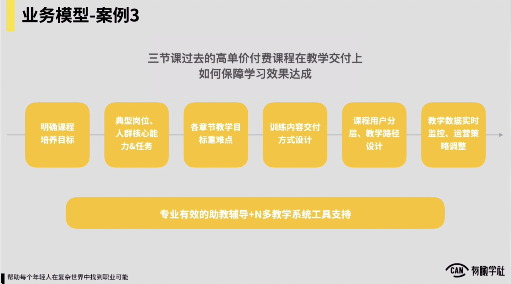

那么再来看一个三案例，三我们过去三节课的一些高单价的付费课程，例如我们有些高单价的课程，约收费在6000\~8000左右。这种高单价的付费课程在教学交付上是怎么来保证用户的学习效果达成的，我们也有约这么一张图来去描述它，首先我们每门课程一定会有一个课程的培养目标，例如我们曾经做过一个数据分析师的这么一个培养计划。

然后我们课程的培养目标希望把一部分985、211理工科背景的大学生能培养成了像滴滴、美团或者像一些字节跳动等等这样的一线公司里边的初级的数据分析师，所以这是我们的课程的培养目标，往后有了培养目标之后。

我们会再进一步去拆分说典型的岗位人群他的核心能力要求，还有工作任务都有些，例如一个数据分析师，我们发现他的日常工作里边。

然后典型涉及到大量的这种取数，提速，还有要大量的做一些针对活动或针对某个产品的专项分析，以及可能还会做一小部分这种数据挖掘的工作。

所以我们就会发现他要掌握的核心能力，例如十分熟练的使用SQL，十分熟练的使用Python上的某些小工具，以及对于例如常见的一些商业分析的基本工具和方法，他要熟练掌握。这些是他必须具备的任务。再往下我们就会根据这些核心的能力要求，还有任务去设定我们每门课程，每个章节的具体的教学目标，还有它的重难点。

这些重难点都明确了，再往后我们可能在每个章节去做一些什么训练，要让用户怎么去完成能力提升上，要会再去做一些细化的设计。再往后我们每门课程对它典型用户分成好几类，例如我们可能同样是数据分析师这么一门课程。他有一些数据分析基础的人可能约是怎么样的，而完全没有数据分析基础的人，或者对于说数据当中的像逻辑代数逻辑运算等等这样的一些基础，可能都不是十分扎实的人。

可能又是一群人。

我们要对用户做分层，对于每类不同的用户，我们要设计一个不同的教学路径，然后教学路径再清晰了，在实际的教学过程中，我们又要去做教学数据的实时监测，就每一章我们的像完课到课作业提交或者是用户的互动等等，这样的一些数据，我们都要做实时的监控，从而根据数据我们要及时的做一些运营策略上的。

调处理这么。

一套流程或者这么一套工作方法，我觉得也可以视作是我们过去在三节课的教学交付上。

为了保障学习效果达成的这么一个业务模型，所以在这儿我们也不用展开的十分多十分深入，因为我们在后面的课程里边会有处理处理两章的内容来帮各位更细致更深入的去了解。到底什么是业务模型以及怎么应用，所以各位建立一个初步的印象就好。

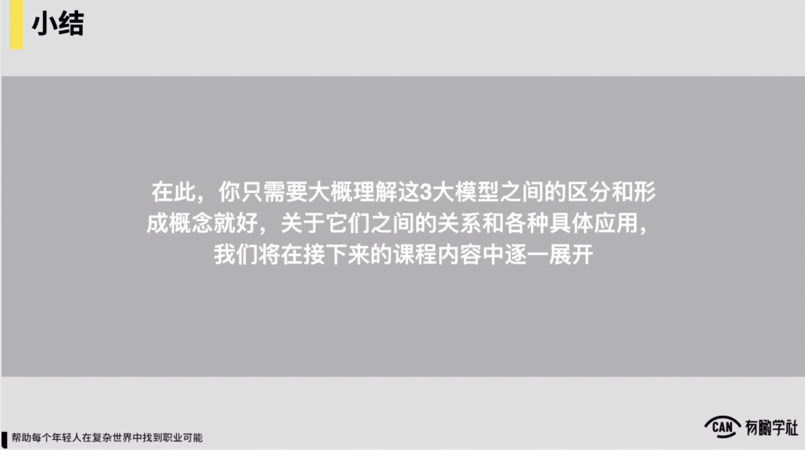

对处理个我们关于三大模型的介绍可能就初步到这儿，在此各位我觉得只需要约理解这三大模型之间的区分，它们可能各自约是个什么关系。形成一些基本概念就以上。关于他们之间的更深入的这种关系，还有各种具体应用，我们会在随后课程内容里边逐一来去展开。

**1.商业模式**：给谁提供什么产品或服务，如何销售，如何获利

**2.商业经营模型**：财务层面，如何获利，如何控制成本

**3.业务模型**：业务层面，有些环节和链条，处理个业务如何运转

###
