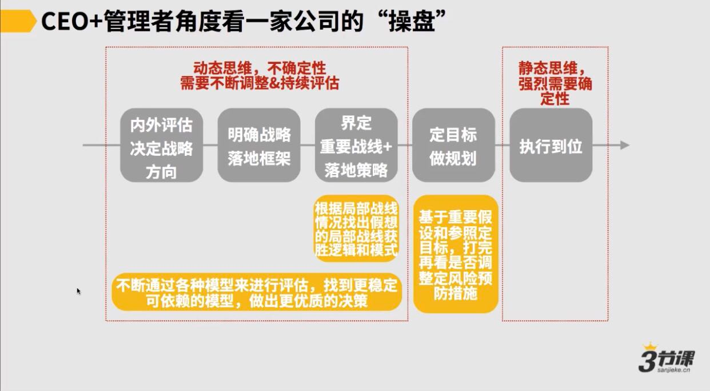

# 总结：

### 第三方视角看一家公司的操盘：

### CEO+管理者视角，看一家公司的操盘：

CEO和管理者应该做什么去驱动一家公司的运转和操盘

在公司的危急时刻或者中早期公司，前3步的动态演化周期1-2周，或者1月

成熟稳定的公司，半年或1年调处理1次，比如阿里每半年调处理一次组织架构

一家公司的经营和管理，是高度依赖于许多模型，建立各种模型和优化各种模型，是操盘手必做功课。

基于模型来与上级交流，是达成同频的基本，也是最经济最高效的沟通方式
