# 难点1：上级当前阶段究竟在关注什么？

### 1.企业在生命周期不同阶段的经营重点

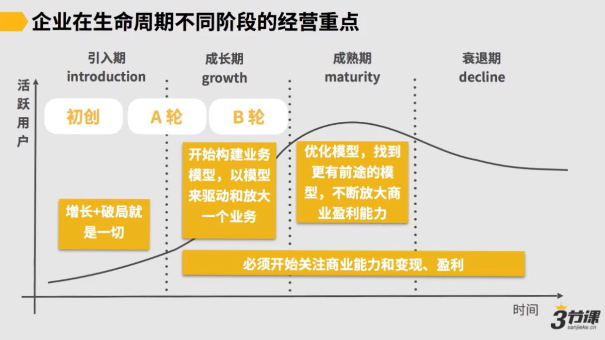

从A轮前后的阶段要关注变现能力，开始构建业务模型，以模型来驱动和放大一个业务

B轮开始优化和升级原有模型，把1倍的增长放大10倍，以实现快速增长

### 09 2.1.1 企业在不同阶段的经营重点.mp4

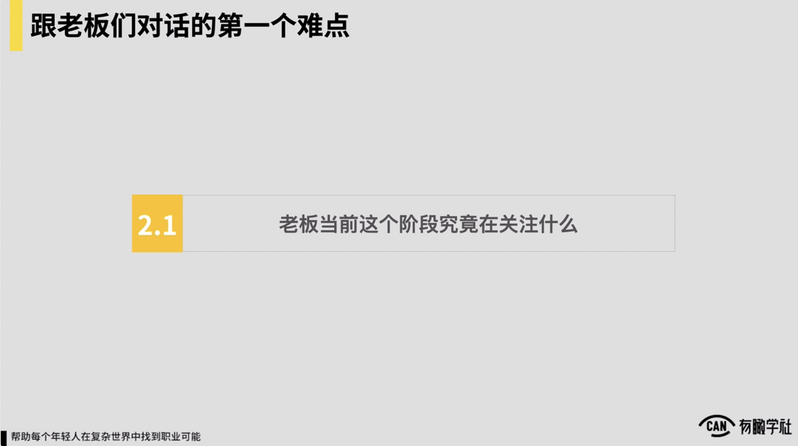

所以我们随后重点解决前两个问题，我们进入到第一个问题，怎么能去知道说一家公司上级当前阶段他究竟在关注什么？对他而言最重要的命题到底是什么？当然我们要加一个前提了，是说靠谱的上级对然后如果说你的上级是我们前面讲的那种拍脑袋，然后经营这家公司为了我开心对做不做大不要紧，挣不挣钱不要紧，对如果是这样的一种认为，我觉得是说我们随后讲的逻辑就完全不适用了。

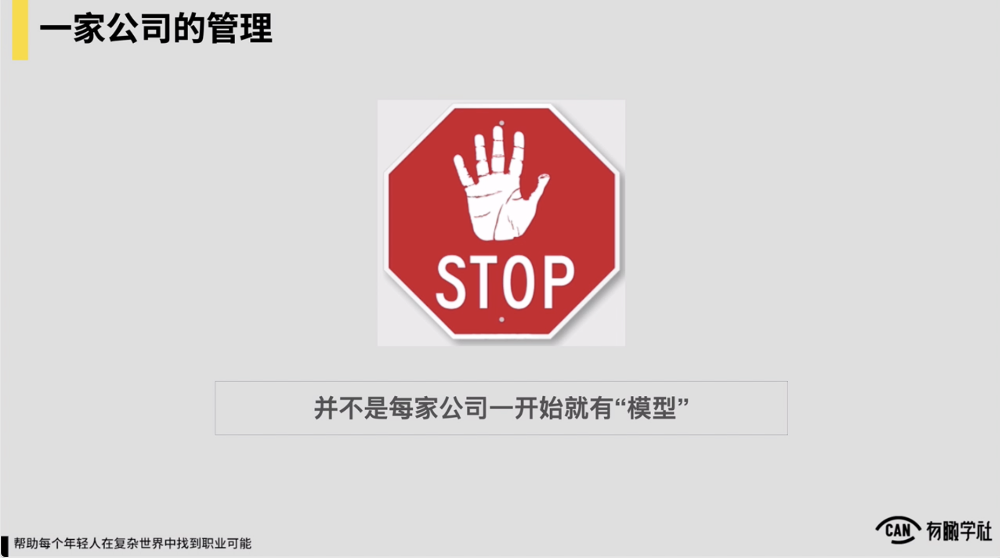

好我们进入到第一个问题，怎么去可去知道上级当前这阶段最关注的事情是什么？这里面我觉得是说我们要抛出来一个重要的信息和前提，我们一定要知道，并不是每家公司，我们刚才说了对一家成熟公司的经营者和管理者而言，他所有的思考最终一定要回归到模型上面，

一定要回归到我的这种商业经营的模型，我的业务模型回到这上面，但是并不是每家公司初期的时候，它就会有一个模型存在，然后各位一定要深刻的去理解。

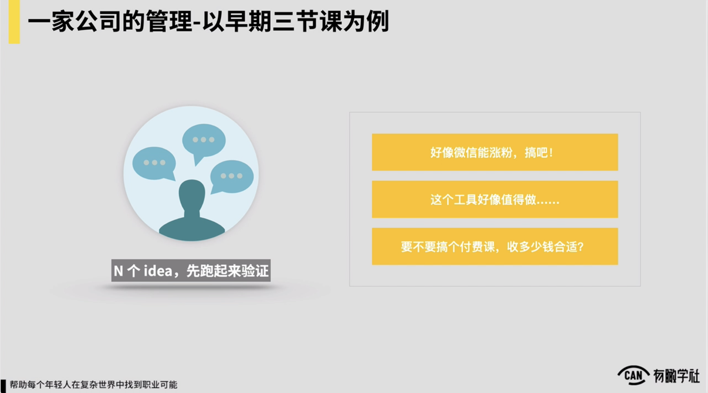

然后举例子来，以三节课为例，是2015年年底创业的，三节课的第一年，2016年那一年，通常内部存在着n个业务方向，存在着n个idea，例如可能认为说似乎16年说微信似乎还能涨粉，我们写的文章当时甚至说做之前我们也不知道这件事会怎么样，反正就写文章

写完之后发现我靠似乎写篇文章能涨粉，而且很快可能在三四个月时间里面就涨到了10万粉，所以似乎是认为说操微信这能涨粉我们就进行于是就持续在微信开始进行进行涨粉，但那时候根本没有什么说到底这家公司怎么挣钱，这家公司将来的什么业务模型是怎样的，没有。

反正说想到这么些事儿各种干，干到块，反正就跟打井一样，5地方同时打，个地方可能出水了对好我就接着往下去干，约就这样的认为，包括说那一年里边我们也做了好多工具对有做了一些什么说给产品经理们提升自己这种产品的设计和产品架构，帮他们提升效率的，有一些这种工具我们做了好多，当然最后就死了，然后也在想说要不要进行个付费课，然后收多少钱合适，反正当时完全没概念。

初期收199，后来收到499，再后来收到699再后来收到就1000多对反正慢慢摸，包括当年还做了一个社区，也后来就成功的把它给做死了，十分光荣对所以在第一年时候你会发现我做了好多的事情，他的工作是完全没有逻辑的。

基本就我们说的5地方，我们有5件事似乎都能干，先干，然后就去打水对就去凿井，个地方出水了，好我们持续就干一干，对例如微信能涨粉了，这课做出来之后发现说似乎有人买

好我们就往上面持续投一投精力，然后持续去做一做，把这些做得更因此，约是这么个逻辑，这三节课第一年典型的认为，但是在2019年的时间，处理个我们在思考三节课这家公司该怎么管的时候，你发现我们所有的逻辑就回归到说它完全是以商业价值为核心来去思考的了。

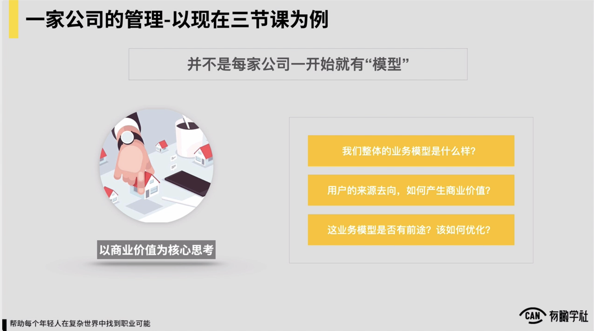

我们这时候更多时候再去做管理的时候，就回到我们前面说的CEO的和管理者的这种思考视角上来，我们就会去评估说我们处理体的业务模型现在到底是怎样的，现有的业务模型下我们要获得增长对到底怎么去驱动，怎么能提升我们的用户价值？如果这一个模型是不可驱动的，这家公司就没办法管理了，以及模型到底还有没有前途对模型它到底能支撑我们的收入增长两倍还是三倍，还是只能增长一倍？

如果只能增长一倍，假设是说我们的期待是三节课，将来希望说我们还是至少能看到20倍以上的增长，我们怎么去优化业务模型，我们要找到一个更有前途的业务模型，所以你发现三节课的处理个这家公司的管理工作，可能我们会思考的会是这样一些问题，所以你会发现这两件事儿似乎就很不一样了，

背后我觉得是说投资人和管理者视角上，我们评估不同阶段的公司评估逻辑也是不一样的。

对在早期的公司里边，早期初创的公司里边，我们评估逻辑十分之简单，就这家公司认为说有机会在一个行业一个赛道里边去做大，然后我们就进行，然后做完之后到底能做多大不知道，但是至少看着说有点能做大的可能对那就进行。

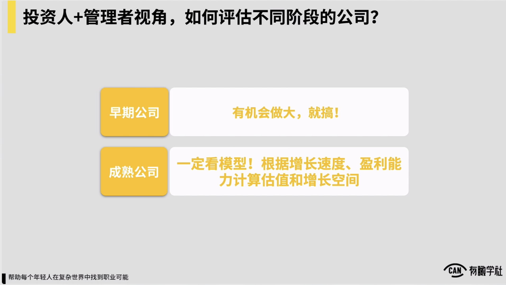

，所以在早期公司里边它是这样一个逻辑，所以在中早期的公司里边就一件事儿，帮这家公司找到它能被做大的可能性，就这么一件事儿。怎么找不重要，你能找到就行，对找到一个机会，不管我是做流量，还是我是做收入，还是我是做用户，还是说是做什么，反正找到一个机会找到一个可能性就ok，在早期的公司里面，然后成熟公司就一定是看模型的，根据它的增长速度，盈利能力等等去估算它的估值和增长空间，这是投资人和管理者的视角，在不同阶段的公司里边他是这么去评估的，对。

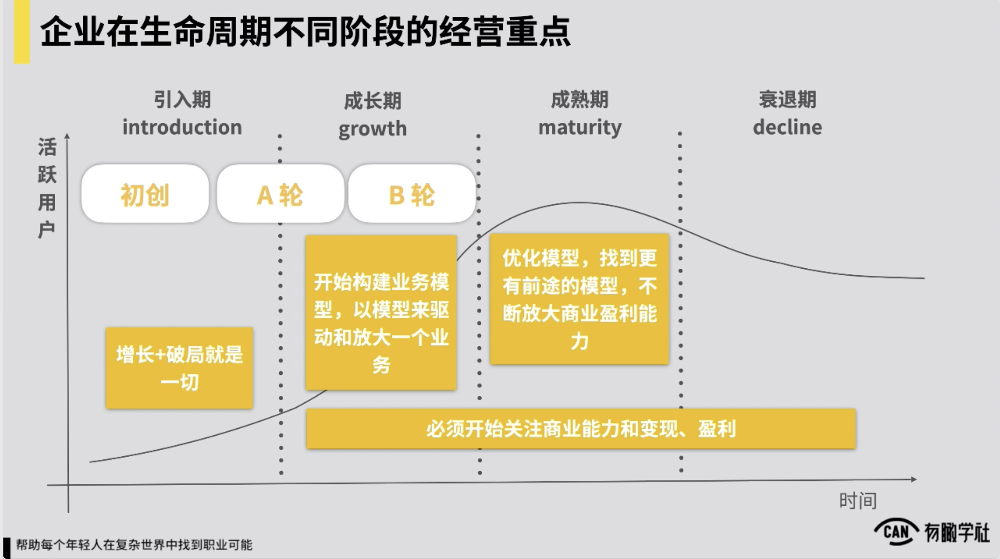

然后所以回归到我们会有这样一张图了，然后一家公司在它的处理个发展的生命周期里边，对我们在很多课程里面都讲说处理个的这种生命周期这样一个概念对所以生命周期的概念应该就不太用解释了，对那一家公司在处理个它发展生命周期里边，如果说我们以它的融资的这种轮次来做划分，例如在它的中早期初创的阶段

我们假设是在它发展的引入期，或者叫做十分早期的探索期，然后在可能即将进入快速增长的阶段，他拿a轮融资的时候，然后快速增长的阶段，基本说它的b轮融资的时候，对我们约以逻辑来做个划分，如果这样来看，在它的初创期的时候，它的处理个经营管理的这种重点增长和破局，一切找到这家公司能被放大的这种可能性。

，这是阶段时候这一家公司的重点。

但是一旦这家公司它的发展开始进入到a轮左右的阶段了，一般来讲一家公司在资本市场里面，它到了a轮左右的阶段，就必须要开始关注它的商业能力和它的变现和盈利，所以在a轮前后的阶段就一定要开始去构建我的业务模型，去构建说我这家公司

它的业务到底是怎样的，一共有些环节，我是怎么来驱动我的业务增长，我要搭就搭建出来这样一个模型，以模型来去组织说我的团队该引入什么样的人，我的团队资源该怎么去分，配团队架构该怎么去搭建，在a轮左右阶段，这就一定要初步有个自己的模型。

而到了说b轮往后对首先b轮一定是说放大之前的模型，但是到了b轮阶段也会出现一种现象，我过去的模型不ok了，就像我们的，假设我过去的模型只能驱动说我家公司的业务能有一倍的增长，但是我想追求10倍的增长我怎么办？

所以很可能很多公司在到了b轮左右的阶段，它处理个的这种业务模型是需要去升级和优化的，去通过优化升级找到更有前途的模型，然后不断的去放大自己的这种商业上的盈利的这种能力，包括看十分多的这样的这种公司，例如不管像滴滴还像美团

他公司发展到了一定的阶段，它都会去升级它的业务模型，例如滴滴可能从之前对吧完全平台就做出租车，到了它到b轮阶段对就一定要去接入说我自己要去运营司机，然后司机就不再是说完全是出租车公司自己来掌控司机，我要自己来做供给，我要去自己把供给能力要解决因此，然后于是就引入了像快车或者像专车这样的这种模块。

，所以到了某个阶段之后，一家公司要追求更大的增长，它一定是需要去升级和优化它的处理个的这种业务模型的。，所以这是处理个一家企业在生命周期不同阶段，它的经营重点是怎样的，我们通过这样一张图来解释。

***

### 2.一项业务持续运转的基本逻辑(业务模型）

**业务的定义**：一个能独立产生商业价值的“经营单元”

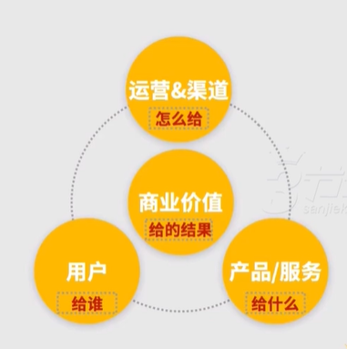

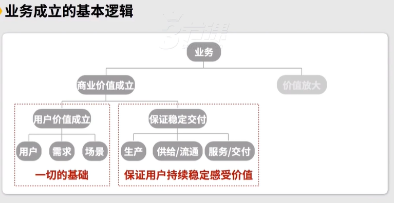

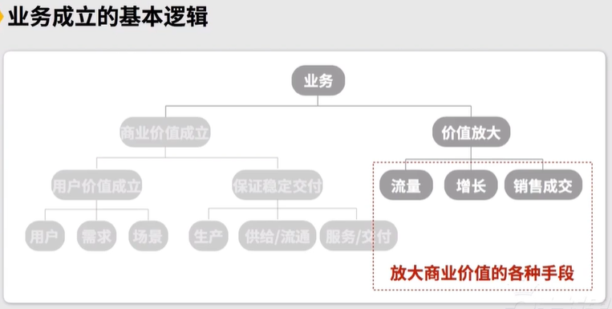

**管理公司的逻辑：**

1.先验证前提成立：用户价值明确？需求真实？场景稳定？

注意，用户价值是否明确，怎么判定？

假如黄有璨讲1堂课，有很多人来报名，但这也不能证明用户需求为真！因为用户报这门课的预期是各不相同的，用户需求是不明确的：有的是抱着好奇的心理，有的是抱着解决问题的心理，有的是抱着招聘的心理。所以产品背后可能糅杂了用户多种需求，多种场景，导致用户价值不稳定，这样的产品是无法被驱动和放大的。

而用户需求稳定的状况应该是这样的：这门课的报名用户中，批量存在想要找工作的需求。根据需求构建交付方案，之后再稳定交付方案，再往后就追求用更低的成本去交付。

注意有些用户需求最然明确，但不可被满足。比如想成为CEO……

2.如果用户需求真实明确稳定，就要构建稳定的交付方案，进一步追求降本增效

3.通过营销等手段搭建增长模型，持续放大获客转化能力，并提升增长引擎效率

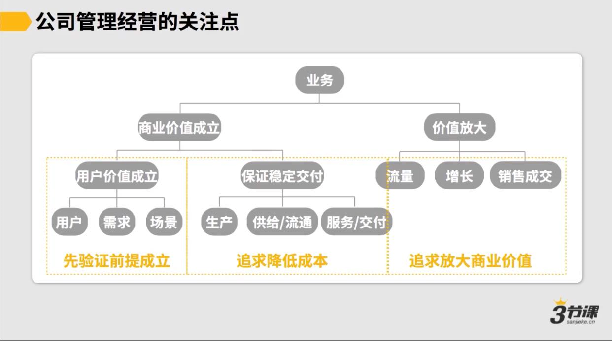

### 10 2.1.2 业务的基本逻辑.mp4

所以在这儿我们可能又要补充一个简单的这种概念，对我们一直在说业务到底什么叫业务，我们最简单给个定义，然后通常一个业务一个可独立产生商业价值的经营单元，他通常说我一个业务一定有说他的明确的用户，有他明确的产品，有他明确运营和渠道，然后这三件事组合在一起，我能产生商业价值，不管商业价值，它是收入还是流量对反正它能独立产生商业价值，然后事就可以视作是一个独立的业务。

这是我们所提到的到底什么是一个业务，为什么要引入东西，跟我们随后要讲的是有关，然后我们刚才理解了一家公司，它发展过程中在不同阶段，然后它的经营决策重点会是怎样的，这算是有一部分的信息了，但我们还差另外一部分的信息是什么？

一项业务或者说一家公司或一款产品，它要可持续的运转，我觉得有几个基本前提还会有几个基本要素，这几个基本要素到底是什么？这也会决定我们后边再聊业务模型的时候，到底一家公司业务模型该怎么去梳理，跟事会直接相关，所以一个业务要想持续运转，要想能被放大对它会有些基本前提？我觉得首先会分两个大块的前提，那说业务它的商业价值要能成立，以及价值要可被放大。

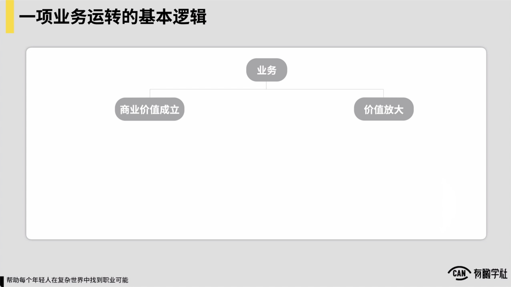

对商业价值成立里边又拆分成两个要素。

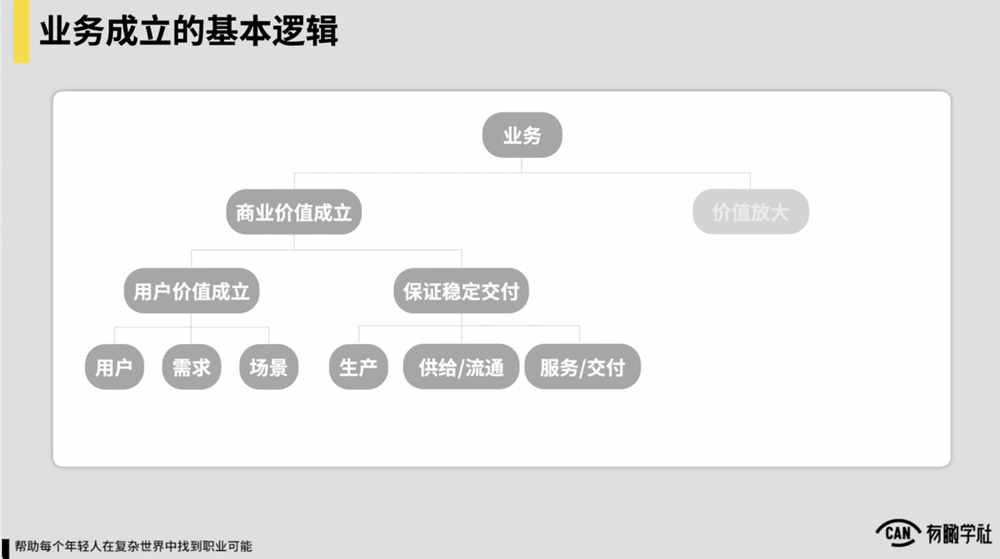

，首先是说我的用户价值要能成立，也说我的产品是存在市场上明确的用户需求的，它的用户需求场景都很明确，用户需求真实存在，且用户愿意投入一定的成本，不管成本是说投入的是他的钱，还是投入的是他的时间，对他愿意投入成本来使用我的产品。

，这是最基本的前提。另外一个基本前提是说我不仅要可验证和明确市场上存在这么一类需求，我还得去保证说我的产品或我提供的服务对它是能稳定的满足用户的需求的，它能给到用户稳定的交付，对这里边保证稳定交付就涉及到了说我们的生产怎么解决，我们的供给和流通怎么解决，我们的服务和交付是怎么解决的。

，所以这是我们商业价值成立，它会有这样两个基本的要素，首先是说用户价值要成立，需求要为真，其次是说稳定交付要能保证，也说用户的需求可稳定的满足他。

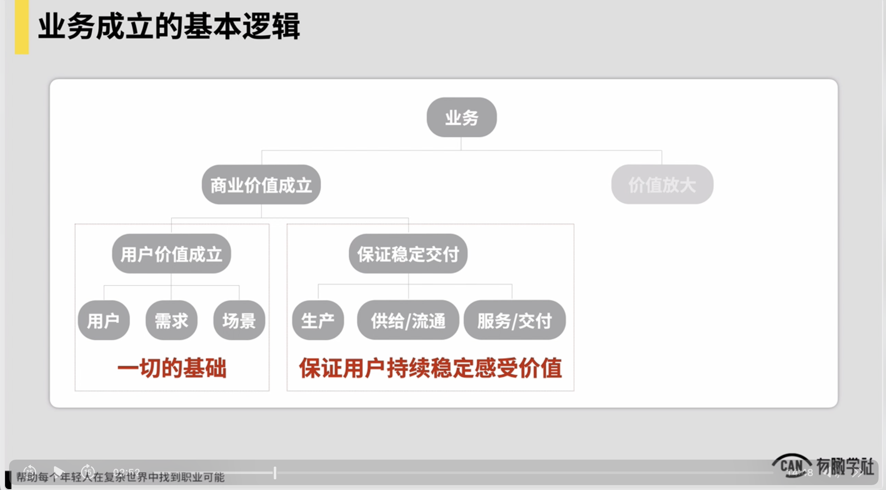

这是我们一项业务它要可成立，它要可持续被放大的前两个基本前提。用户价值要成立是一切的基础对稳定交付我们要保证用户能持续在我们产品当中能十分稳定地感受到说我们我们的产品是有价值的，他要能认可我们的产品对不然他怎么能持续留下来，或持续愿意为我们产品付费，对所以这是两个基本前提。

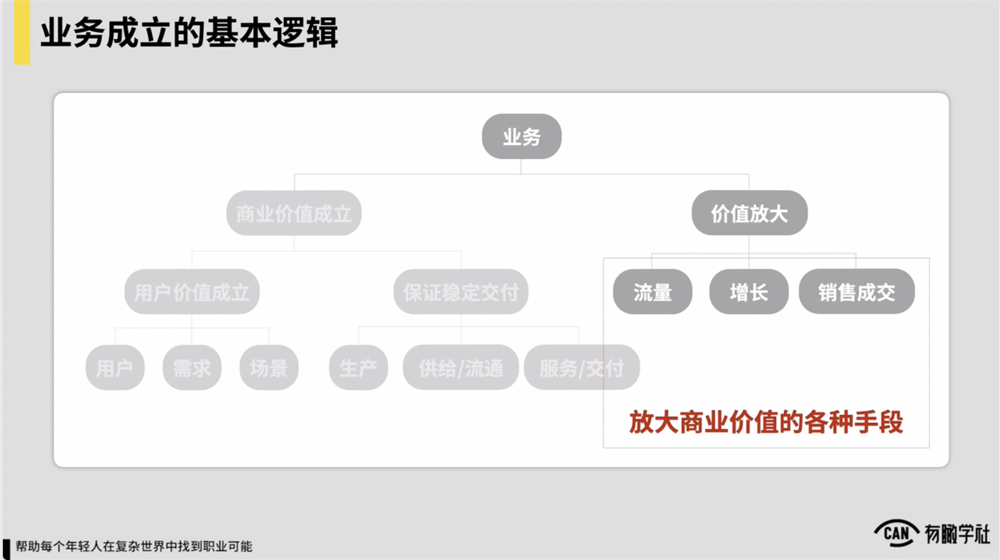

第三块说我们的商业价值一旦成立了，我们也要具备另外一个基本的这种条件，商业价值还要是能被放大的。不然说在一个业务里边，例如我们前两天还见了一个朋友，朋友可能在技术领域里边是一个十分牛的讲师，他自己讲课讲得十分

它的产品它的服务可能都还可以，然后也有用户愿意认可他，但是他发现说他过去就自己是个小工作室的模式，然后他就没有说把商业价值去怎么去放大的能力，在营销上该怎么去处理，搭一个什么样的模型，通过什么样的渠道完成流量怎么去转化，他完全没概念，也完全没有做，基本就完全依靠自己的影响力

去一期可能吸引个十几个20用户来报名，约这样的一种认为，所以你发现它的业务它的商业价值是没法放大的，所以商业价值要可放大，也是一个重要的前提。

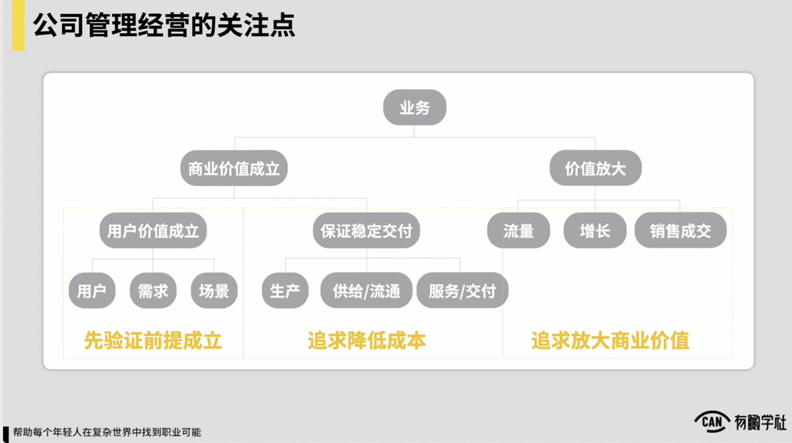

所以通常我们就发现说一个业务它要可成立，它要可去顺畅的运转起来，核心要具备的三大要素用户价值要成立，需求要为真，交付和用户的体验要可稳定的保证，以及说产品它本身的这种商业价值是可借由我们的营销或增长的手段要能被放大的，约这么三个基本的这种前提。

换句话，我作为一个上级，我作为一家公司的CEO，我要去管好这家公司，我首先去看的是说这三个事儿到底成立不成立，然后我才可去想说这家公司到底怎么管。，约是这样一个认为。以上。假设这三件事都能成立，我作为一个管理者，管理一家公司的基本逻辑很什么？很可能例如一家公司刚成立，我优先可能像我们刚才的，我们肯定是说各个地方去凿井，凿完井之后发现有个地方有这种增长的可能性，

然后我们扎进去之后，看说到底这里边它的这种用户价值是否成立的，这里边是否存在一个明确的这种用户需求。

，因为有可能说有个地方我们凿了井出来，但是它可能这里边是一个小的风口，但是它是个概念，里边并没有明确的用户需求，我举例子区块链对可能很多这种例如做区块链的朋友，在19年或18年的这种时间里边，可能也曾经通过去做一些区块链相关的业务

发现说这里边我可能有个机会短期能获得一些增长，但是它的长期说这里边用户价值，用户的需求明确不明确，用户需求是否稳定的，对不好，也包括说举例子说三节课初期假设说黄永灿讲了一堂课，拿出来一卖说也有很多人来报的，但这也并不意味着说这件事背后我们的用户需求就一定为真，为什么？

因为很多用户来报这门课，他的预期可能完全是不一样的。

有的人可能就说我靠黄灿似乎写本书十分的对我就看他讲了个啥，我是抱着好奇的心理来参加这门课，有的用户是说我靠黄灿讲这门课十分的，这门课的我预期他能帮我解决我的业务问题，对还有的人可能说我说黄灿讲这门课里边可能有很多的学生，很多用户对干活十分的，我是个上级我要来去招聘对他是抱着招聘的需求来参加这门课程。

对处理个下来之后你发现说这样一个产品背后它糅杂了十分多的用户需求，所以它的用户的价值是不稳定的，首先用户需求场景反正就不统一也不明确。

所以事儿如果是说它的产品面向用户需求都不稳定不明确，它根本就无法被驱动，无法被放大，所以在公司管理经营的时候，我说管理的视角上，首先是说我也持续会去看说我的产品它用户价值成立不成立，用户需求稳定不稳定，

如果用户需求稳定，我举例子说我们就找到说黄山还是做了这么一门课，然后这门课程里边确实有一类用户，这类用户批量的存在，例如他们要找工作，随后说好我们的解决方案能不能稳定地交付给他们一些价值，价值是能满足他们需求的。

我要去构建一个解决方案，就我们的内容怎么设计，我们的服务怎么设计对然后我们就要把事要去想清楚了。然后以及想清楚了之后，后边我的这种管理这种思考上，我再例如交付部分一旦交付能稳定了，我所有的思考说交付部分我怎么去降低我的成本，怎么去提升我的效率，以及最后一部分就在价值放大上

那也是我要去找到一个基本的模型和一个基本逻辑，通过营销或增长的这种手段，搭建一个增长模型或一个增长的引擎，持续去放大，说我的获客我的转化的这种能力，在这里边我也需要不断去提升我处理个营销引擎的效率，让我营销引擎里边能做到说我每花一块钱进去，我获得的这种回报和获得产出可变得更高。

，所以在公司的经营和管理这种关注点上，约会是这样的一个这种逻辑。所以回过头来，如果各位当前在一个业务里面，各位当前在一家公司里面，我觉得各位可能要去思考对说我所在业务当前的核心问题到底是什么，这时候我觉得是说各位可以去问这样几个问题，首先一定是说我们要去看我们这家公司当前到底处于一个阶段，就像我们说的不同的阶段，早期可能说我们先打打井

到底个井能让我们有增长的可能性，然后去先思考这样的问题，如果我们已经打完井了，发现在地方对然后可能我们做两件事儿能带给我们增长的这种空间和可能性了。

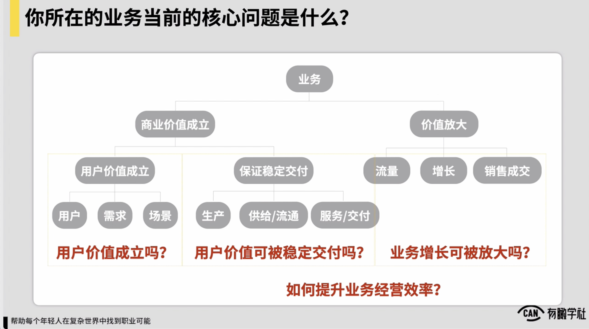

随后要问的问题可能我们现在这张图上他提到三个问题，首先我们的用户价值成立吗？其次我们的用户价值不可稳定被交付对也有可能说有些用户需求真实成立，但是它不可被稳定交付。，就像我们的，例如你说每个人都想成为一家公司CEO对举的例子较为极端，但你说我们能有一个产品保证能帮任何一个人都成为一家公司CEO吗？对太扯了听起来，所以有些用户需求虽然明确，但是它的背后是不可被稳定交付和满足的。

，然后所以这是我们要考虑第二个问题。

第三个问题就我们的业务增长不可被放大。，然后所以通常打完井之后，我们要思考的这家公司的这种经营管理上要思考的核心问题这么三个问题。

假设我是上级，然后这三个问题如果都满足了，以上，那么继续往后走，通常在稳定交付着价值放大着，我们就都会给自己构建出来一个基本的业务模型，这家公司就会有一个基本的业务模型了，我们随后就回归到说好到a轮左右阶段，我们的模型要基本成型，基于模型去管理和驱动这家公司的成长，到b轮左右阶段，我们我们要去审视说模型到底有没有前途，

它能驱动我们这家公司到底能有几倍的增长，有多大增长空间，我们处理个思考是这样的，以及在所有的过程当中，不管我们的模型是要升级还是不要升级，我们也一定要不断去思考到底怎么持续提升我们业务经营的效率。

对换句话，对一家公司上级而言，最重要最核心的问题就这么几个问题。

首先我的公司处于个阶段，我当前到底是说就要一个增长的可能性，还是说是要去优化我的模型，还是要去放大我的模型对然后如果我已经有了增长了，我三个业务要能被放大的三个基本前提成立不成立？它的用户价值现在是稳定的吗？是明确的吗？它的用户价值的用户需求的这种满足是口碑稳定交付的吗？

它的业务增长是口碑放大的，然后以及如果上述三个问题都成立，我基于一个模型怎么去提升我的业务经营的效率？上述这几个问题构成了一家公司的上级和一家公司CEO在这家公司发展的不同阶段，他所要关注的所有核心的问题，所有核心的问题。所以通常你怎么去评估说你公司的上级，你们公司的上级当前对他而言最重要最痛的问题到底是什么？上面逻辑我觉得通常就可以给到你一些参照了。

在这儿就可以再额外加一句，我们之前提到的三大模型，在不同阶段的公司里面，他们的关系可能也会是有点不太一样的。

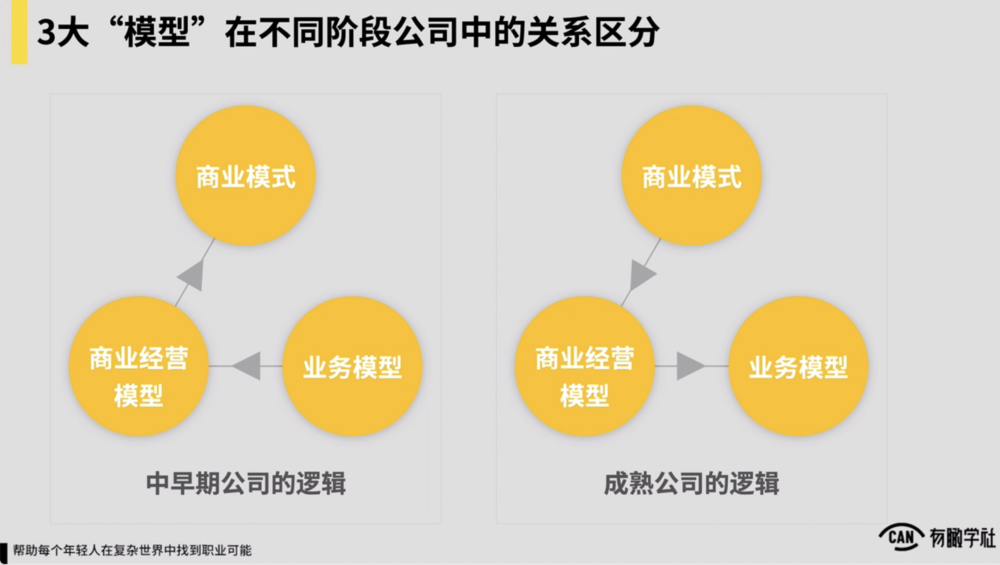

然后一般如果是在一家中早期的公司里面，我们提到的三大模型，业务模型、商业经营模型和商业模式之间，它的一个逻辑是说在中早期公司里边我们要先把业务跑清楚，例如我们可能做一个课或者做一个什么功耗的矩阵，对初期可能这家公司到底能不能挣钱，能挣多少钱，然后一年下来，然后我的什么成本利润，然后约是怎样的根本不重要，我们要先跑业务对先把业务可跑通。

业务上我们找到一个逻辑，说我们的流量能持续增长，我们的转化率能稳定，先有这么一件事儿，然后再往上推再去推说我们一年我们的主要成本有些，然后我们到一年下来能挣到多少钱，然后最终再往上推，再去评估说到底事儿能不能对我们构成一个稳定的长期可以持续发展的一个这种商业模式，所以在中早期公司里面它是这么一个逻辑。

先重点关注业务模型，然后再往上去推，约是这样的。

但是如果我们是在一家较为成熟的公司里面，你发现逻辑是反过来的，在成熟公司里面他的思考一定更多是自上而下的，在成熟公司里面做很多决策，一定说优先围绕着我的商业模式或者商业经营模型来去看，比如像在阿里或像在百度这样的公司

例如像阿里的主要的这种核心的商业模式，平台交易抽成可能为主。当然 B有to c的生意对他会推导出来说我在一线去发展很多业务，一定不能背离我的主要的这样一个这种商业模式，

包括说我的处理个的今年的这种商业经营模型约是怎样的，我的利润可能有些业务可能因此，些业务可能不因此，不好我把些可以砍掉，在些业务下，我可以例如再额外的投一些钱，投一些资源，去开展一些新的尝试，他会是从财务或者从商业经营的这样一种角度可能去评估的，包括些业务今年的这种运转效率，些部门今年运转效率可能很低，成本十分高

他做评估，再往下才会推导出来说我们真正在业务上要做些什么样的变化。所以在成熟公司和中早期公司里面，这三大模型之间的关系以及它的这种侧重可能也会是不一样的，这是这一块也十分想给各位补充的一个重要的信息。

以上，所以我们简单做一个这种小结，我们讲的第一个问题部分，首先是说不同阶段公司在经营管理上的关注重点一定不一样的，早期公司只关注如何破局增长和生存，中早期公司它重点就围绕着业务成立的三要素来进行思考的，这是在中早期公司，然后中后期的公司，一定会把一切都用模型来进行评估，他一定是说我有一个模型，基于模型思考怎么放大我的效率，怎么寻找我更大的增长空间。

***

### 3.上级关注：业务当前的核心问题是什么？

**早期阶段：**

四处打井。探索增长的可能性，找到方向。

**A轮前后：**

构建出基本的业务模型。明确业务模型中的3核心问题：

1.用户价值成立吗？

2.用户价值可被稳定交付吗？

3.业务增长可被放大吗？

基于业务模型去驱动业务增长和人员搭建。

**B轮，快速增长阶段：**

思考如何提升业务经营效率

审视业务模型能提升多少倍的增长空间

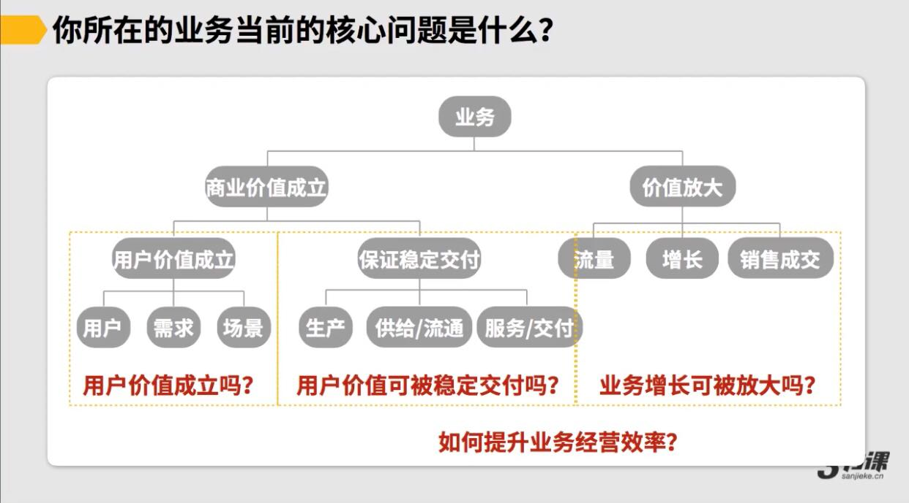

这是一家公司CEO在不同阶段关注的所有核心问题

**自我反思笔记：什么样的工作成果在高层视角上才是有价值的？**

**1.我稳定了某个重要的交付（对应”商业价值“的”保证稳定交付“环节）**

**2.我放大了收入（对应”价值放大“）**

**3.我提升了效率，降低了成本（对应处理体降本提效，提高处理个环节周转率）**

**4.我创造了具有商业想象力的新产品**

***

### 4. 小结

1.不同阶段的公司，在经营管理上的关注重点一定不同。

2.早期公司只关注“如何破局、增长和生存”，重点围绕业务成立的3要素进行思考。

3.中后期公司则一定会把一切都用“模型”来进行评估，放大效率，寻找空间。
