# 难点2：如何在一些决策、判断类问题上更好跟上级们同频？

**商业经营中的常见决策逻辑和工具**

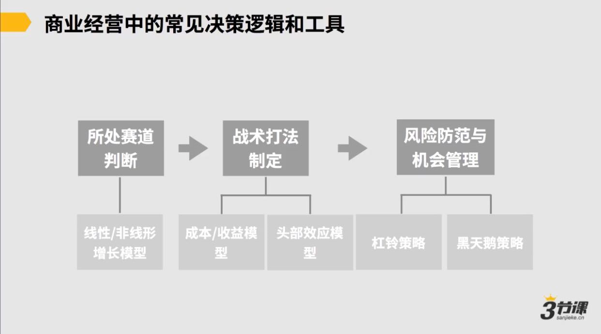

通过这些逻辑可以更好的理解上级为什么做决策，我们也因此有了能跟上级同频交流的抓手，这些模型也可以帮助我们自己去做决策和判断。

### **1.线性/非线性增长模型**

**1.1 基本逻辑1：**

在生产、供给、销售链条中有机会实现边际成本为0的业务，或者是聚集效应更强的行业，是更有机会实现指数级增长的。反之，则更像是偏线性增长逻辑。

比如：2B行业、线下零售、传统线下教育遵循线性增长曲线

社交产品、在线工具、在线娱乐平台遵循指数级增长曲线

**1.2 基本逻辑2：**

无论是处理个公司的增长，还是某个玩法和渠道可能带来的增长方面，可能都会存在线性增长/指数增长逻辑。所有大的生态型产品，一定也遵循着偏指数曲线的“生命周期”逻辑。

比如

比如私域流量，更偏线性增长的逻辑，如果依靠私域流量放大增长，增长越快，人力成本越高，也不太可能在1-2年内实现收入量级的几何级提升。

社交产品的用户关系链拉新，这种玩法是指数级增长逻辑。

拼多多拼团的方法，是用户驱动的玩法，没有人力的堆砌，也是指数级增长逻辑。

**1.3 作用：**

监控并预测业务的增长走向，合理操盘，不断为业务寻求新的增长空间

**1.4 常见场景：**

* 判断所处赛道和玩法是线性增长模型还是指数级增长模型，如果是指数级增长模型，判断处于什么周期，据此做决策

* 2B销售驱动的业务——线性增长

* 社交及其他规模效应极强的业务——指数级增长

* 判断微信公众号当前还值不值得做

### **2.成本/收益模型**

**基本逻辑：**

ROI=营收/成本\*100%

成本包括了时间、金钱、其他资源等等

**常见应用：**

辅助决策——

评估一个部门的业绩和价值

评估一件事值不值得投入

评估一笔钱值不值得花

### 3.头部效应模型

**基本逻辑：**

在任何一个赛道下成为头部，一定会是一种较优策略。

如果你在当前的一线战场无法成为头部，可能最好的一种策略，先返回二线战场，成为二线战场头部后，再携带在二线战场中获得的势能杀回一线战场。

**常见应用：**

制定发展策略、战术打法时的决策和思考。

### 4.杠铃策略+黑天鹅策略

**基本逻辑：**

1.风险分散——大部分资源投入到风险稳定、产出稳定的项目上。少量资源投入到风险高、收益高的项目上。

2.对那些看不清楚未来，但一旦发生带来颠覆式影响的事情，保持少量资源投入。

**原则：**

80%以上的资源为核心目标达成负责，给到确定的主战场。

20%以内的资源为风险+不确定性负责，但带来回报的战线或探索更远的未来。

**常见应用：**

在十分不确定、难以预测的环境下规避风险，并合理管理各种出现的机会。

***

### 11 2.2 如何在决策判断问题上跟上级同频.mp4

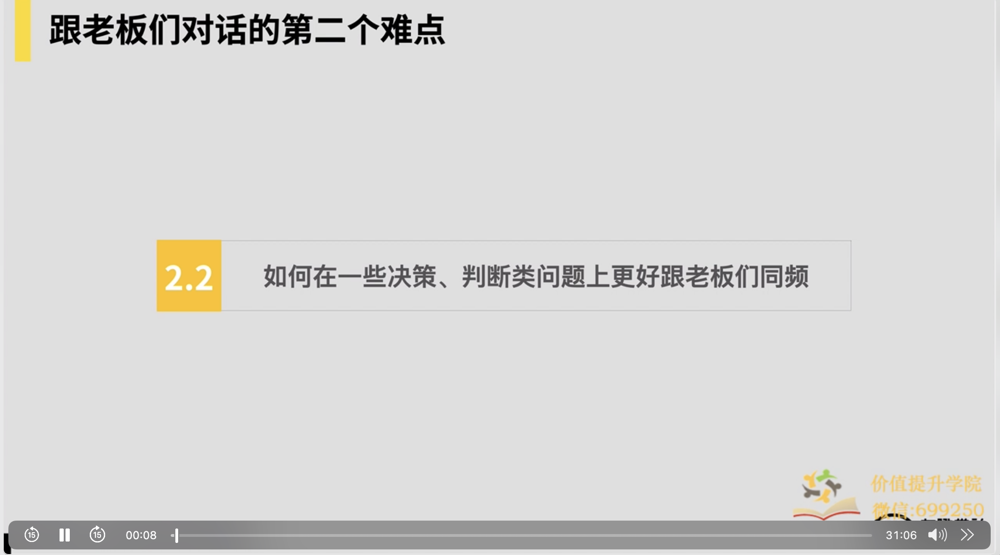

以上，这是我们跟各位讲到的第一个难点跟上级对话的第一个难点，要去判断清楚上级当前阶段究竟在关注什么。以上，随后我们进入到二第二个难点是说如何在一些决策判断类的问题上，来更好跟上级们同频。

然后这里边我们先给各位一个基本的这种逻辑结构，因为问题背后就像我们的，我们重点要解决是说在有很多问题的决策和思考上，我们希望给各位两个小的交付，第一个是说各位自己在做一些思考决策的时候，有些工具和使用。

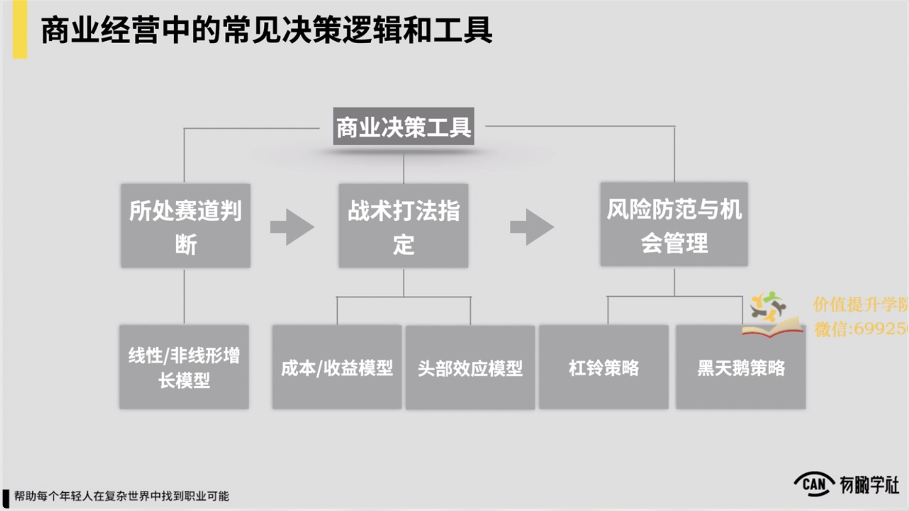

第二个是说约在上级们做很多决策和思考的时候，我也许也可约知道一些上级们的这种决策思考逻辑，所以这是这一部分想帮各位解决问题，我们给了各位一个基本的这种框架，首先是说在商业经营中，在商业经营中，然后我们通常需要决策的部分，有这么一个基本结构，基本我们就像前面我们提到一个上级的视角

我们对于说自己所处的赛道是个什么赛道，我们要做个判断，预计我们对赛道判断，我们预测一下未来赛道里边它的形式会怎样的，这是第一部分，我们往往是说先判断所处的赛道，然后根据前面的判断去制定我们的战术打法，战术打法定完之后，我们会再做一些风险防范和机会管理。

所谓风险防范就不用解释机会管理是什么意思说我们已经定下来，我们就这么打，市场上又出现两个机会，这两个机会我们该怎么去选择怎么去判断对然后所以这是商业经营里边常见的一些这种决策的场景和结构。对不同类型的这种决策，我们也给了一些这种简单的工具。然后随后我们就会针对这几个工具一一来去做一些介绍。

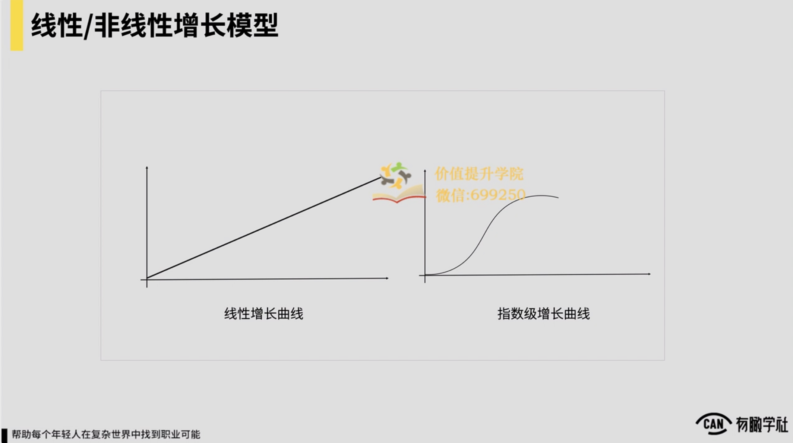

，首先是说在判断自己处在什么赛道上，我们再会给各位一个工具叫做线性模型或者是非线性的这种增长模型，这是一个这种小的工具。它是什么？通常就在我们所有的这种增长的过程当中，不管是在一个渠道，还是在一个行业里边，它的这种增长基本都可以分为这么两类模型。

一类线性增长模型呈现是一个直线，核心逻辑说我往里做一件事儿，或者投入一个资源投入的越多，对应的反正一个对等的这样等比例的这种关系。所以投的越多等比例的我的这种收入或者用户就在增长对这是一种模型。

另外一种模型说跟产品生命周期曲线是一样的，它会是一个说指数级增长的这样一个这种模型对这两个模型反正各位在很多商业书籍上通常就看到也很多，我就不做过多的解释了，反正这是关于他们是什么，对它的基本逻辑是什么？

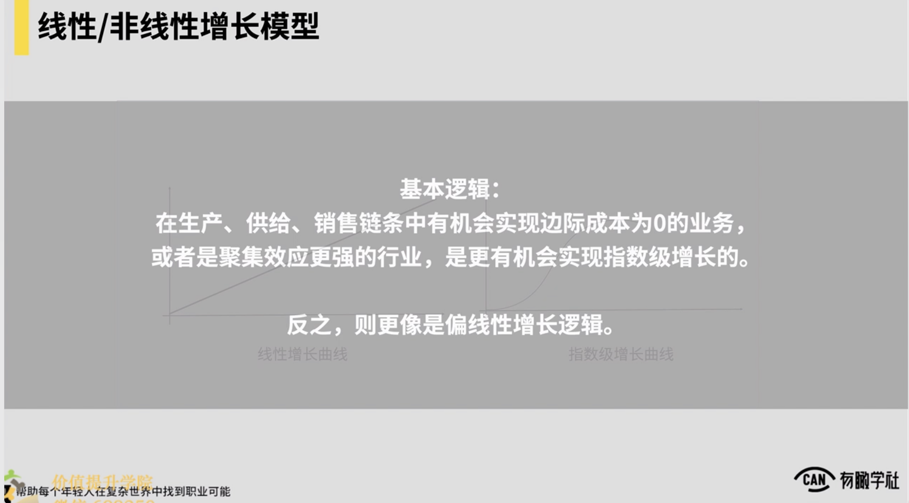

我们每个人所在的公司里边我们的业务类型不一样，然后它背后的基本逻辑是说在一些生产供给销售链条里面，有些业务有些公司的产品它是有机会实现说我边际成本无限为0的，或者是说有一些行业它的聚集效应是更强的，在这样的行业这样的业务当中，它的这种业务的增长是更有机会实现指数级的增长。

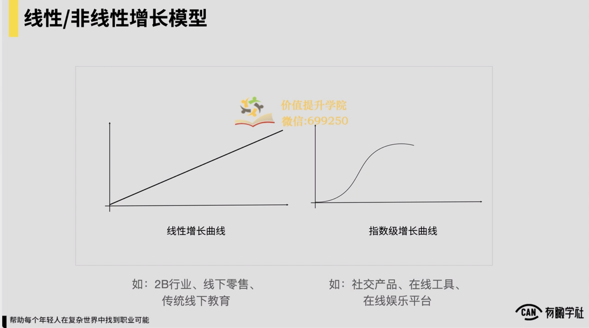

如果相反，它的增长就更偏是线性的增长。，约是这样的一个认为。我们举个例子，例如像 To，b行业线下的零售店，或者传统的线下教育，这三个行业和业务它的增长相对来讲更接近于是这种线性增长逻辑。为什么就to，b行业是一个销售驱动的事情，核心说我一个销售对10家客户

一个销售一年反正到头了，我就磕100客户，中间有个转化率，转化率反正有高有低，但约能算出来一个基本的逻辑，所以最后这家公司的逻辑一定是说我的销售团队越庞大，然后我对接的客户越多，然后我的增长可能就可越高，约是这样一个逻辑，线下零售也是一样的，它高度依赖于说我线下门店的数量，所以我到底开了多少家门店，跟我处理个这家公司的增长就会有直接关系，还有线下传统教育也是一样，又涉及到有门店有网点，又涉及到有老师

这几件事都不边际成本为0的，所以像这几个业务它的基本增长就更偏这种线性增长逻辑。

但是还有一些这种产品和逻辑，比如像社交产品、在线工具、在线娱乐平台对你发现这几个产品它的供给侧，还有它的这种例如在营销侧，都是十分有机会实现说边际成本为0的。对我可能同一个这种供给逻辑，我服务100人也是逻辑，我服务1亿个人也是逻辑。就像这样的这种业务，它就更有机会实现指数级的增长，所以这是关于这两个模型。

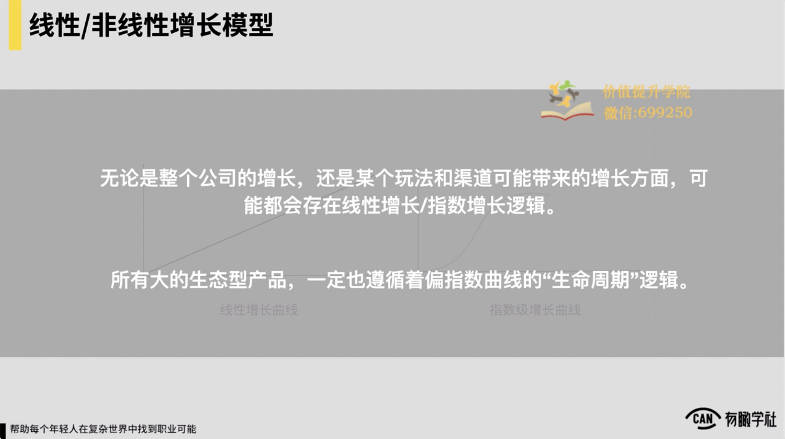

，这儿可能要补充再提一嘴的是说无论是处理个一家公司的增长，还是说某个玩法或者渠道可以带来的增长方面，它都存在线性增长或者指数增长的逻辑，以及所有大的生态型产品，也一定遵循着偏指数曲线的生命周期的逻辑。

这两句话什么意思？我给各位举个例子，例如我们在增长里边有一些玩法，举例子私域流量是一个玩法，对但私域流量很多时候是说按刚才我们讲的逻辑，它显著会更偏是说这种线性增长的逻辑的。

所以你要是说我要去寄希望于说通过私域流量的方式去放大我一家公司这种增长，我觉得是说有两件事，第一是说这件事它一定是说一个对人力的事情，一定是说我增长越快，我的人力成本一定会越重，对要有预期的。

第二个是说因为它是一个这种线性增长的逻辑，所以通过私域流量去放大一家公司的增长，也不太可能说在一两年内我让这家公司的这种收入增长的量级提升放大说好几个几何级数，也不太可能。

，所以这显著的就我们说偏线性增长的玩法，但是还有一些玩法，它完全是有机会去做到这种指数级增长的这样的一种逻辑。

就像例如很多的像社交产品，它早期对就完全通过说用户的这种关系链，或者通过像纯nps的方式去做用户的拉新，这件事你会发现里边完全没有任何的成本，完全没有任何的成本，它完全是一个边际成本为0的这样的这种玩法，所以这样的玩法不跑通则已，一旦跑通了，它一定是有机会去实现我的指数级增长的这样的一种逻辑的，包括很多产品，例如通过像策略，包括像拼多多这样的一种产品

通过一些在微信生态里边的这种拼团的玩法，它完全是一个用户驱动的玩法，所以中间你完全没有任何的这种人力的投入和人力的堆砌，所以这样的一种玩法就十分有可能帮你带来指数级的增长。，所以这是关于第一句话。第二句话是讲的是说所有大的生态型产品对也一定遵循着偏指数曲线的生命周期逻辑，这是什么意思就像我们看微信，还有看小红书，还有看什么大众点评或美团对其他都是属于这种生态型的产品，生态型产品意味着说有很多公司会通过这样的产品去获取流量，甚至直接变现或者收入的。

，如果你是在这样的生态产品里边去玩去做生意，你也得去思考说产品当前它处于它生命周期个阶段了，它还有多大的这种增长空间

就像我们一直在讲说微信现在肯定没有红利了，微信现在如果是说你还是凭借常规的做法，在里面是说你可借由红利获得的流量和增长，几乎可以等同于为0，所以在微信里面要么说你说我的内容或者说我的运营显著强于其他人，否则你完全寄希望于说平台的红利能带给你增长，很难的

但也许比如当下假设是在小红书的2019年在小红书的短视频这样一个板块里边，或者在快手的生态里边，有可能我们还是有机会去获得一些红利的。，所以这是线性和非线性增长模型背后它的一些基本的逻辑，对。线性和非线性模型它给到我们的作用，让我们在公司的经营或者我们自己在做日常工作当中会有的作用。然后核心我们会用它来监测和预测我们处理个业务的增长走向，预测完了之后我们就可以合理操盘，不断为业务寻求更好的新的这种增长空间。

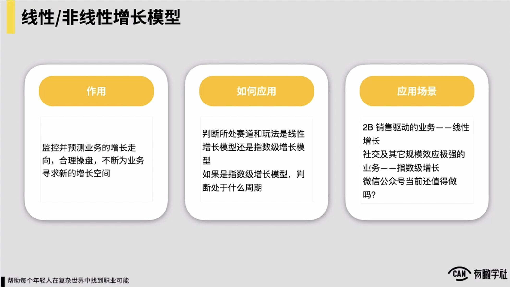

怎么应用应用，核心说我们当前对如果你是公司的高层，可能想的我们在一个什么行业什么赛道里面，然后如果你是说我是一个小部门的领导，或者说我是一个偏这种项目的负责人，你可能核心判断的说我们当前用的玩法到底是一个线性增长模型还是指数级增长模型，如果它是一个指数级增长模型，我们要判断当前我们已经处于处理个增长曲线的什么周期了，是说增长曲线可能才刚刚开始，还是说它还没跑通，还是说增长曲线已经快到了它的生命周期的衰退的阶段，

我们要据此来去做判断，通常说我们在一个旧的玩法，比如就像假设说你可能做一家公司，你过去两三年都一直在用微信来作为你这家公司核心增长引擎，到了18 19年很可能你的处理个增长引擎就到了它的末端了，你必须要去给自己开辟新的增长引擎，找到新的增长战线对所以我们一定要去判断说我们的增长引擎处于什么周期，据此来去做一些这种决策。

所以应用的几个场景，我们刚才讲的案例里边基本也都有讲到了，所以就不再过多的赘述了。所以这是对于第一个决策逻辑和工具，线性模型和非线性的模型，它主要是帮助对于说我们所处的赛道，我们当前的这种玩法来做一些判断。

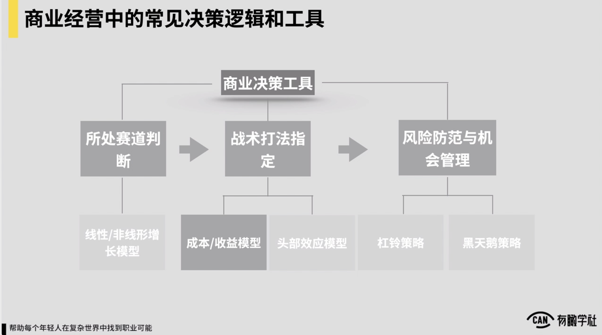

，然后据此做完判断之后，我们就可以知道说我们随后可能该去怎么去思考，该去怎么来去做，对包括上级们很多时候决定说我们要做一件新事儿，还是不要做一件新事儿

很多时候也会跟他对于一个赛道一类玩法，或者说一个特定的行业，当前的这种判断直接有关。

所以我们很多时候看到上级做了一个判断之后，我们要去思考一下背后他的逻辑可能到底是什么。然后随后我们继续往后，我们的第二个决策工具就十分常见了，叫做成本收益模型。这件事我说所有人都知道，但并不是所有人都能把它用得很因此，因为我们在日常工作当中很多时候都会接到各种各样的这样的这种需求，接到各种各样的事儿，有各种各样的想法。然后很多人在有了一个这种想法之后，我们怎么去判断想法到底做还是不做

很多人在没有把成本收益模型作为一个十分稳定的这种思考习惯的时候，他很可能在做一些想法决策的时候，可能他的这种决策和判断还是较为拍脑袋的，还是较为不稳定的，但是如果说成本收益模型对你而言已经是一个十分稳定十分坚固的思考习惯了，你会发现你接到的所有的事儿，你有的所有的想法，包括说你去评估团队里边的任何一个人，他的工作的价值大还是小，都可以回到成本收益模型上面去，例如有人会来找说我们一起办个活动要不要办？

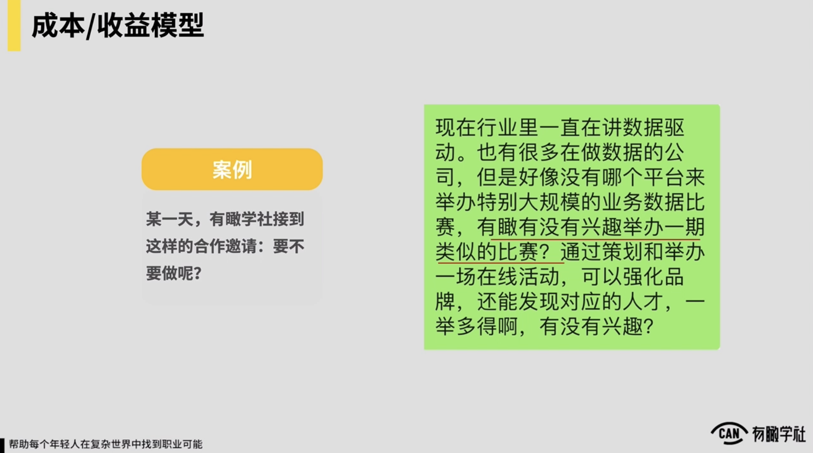

如果你没有成本收益模型这样一个评估，你很觉得说似乎这件事儿对对方也是一个不错的品牌，然后我们这儿似乎有一些资源可以去接上，办了之后反正肯定会带来一些什么曝光，带来一些什么传播之类的，对你这样想

但是如果你明确的脑海里头有一个成本收益模型，我觉得你一定会去想说这件事我要投入什么成本，我对它预期收益到底是什么，收益对我当前也是重要的。

，一定会这样去想的，所以我觉得是说成本收益模型里边，对于一个操盘手而言，我觉得这是一个必须要养成思考习惯的这样的这种决策的依据和决策的工具。

一定要知道你做所有事情最终都看收益，你做所有事情也需要投入成本，你的成本包括你的时间金钱和其他资源，甚至说我觉得对于一个合格操盘手，到最后应该是能较为合理的去估算出来，说我团队里边每一个人对他约例如会值多少钱，我自己的时间约会值多少钱，我把我的时间投到一件事上面去，我最终期待看到一个什么样的回报，回报值不值得我投入，我觉得要进入到这样的一种思考逻辑里面去的。

所以成本收益模型这件事儿，我觉得是说它的逻辑并不复杂，做但是问题是说很多人并没有在这件事上养成一个十分稳定的思考习惯，然后它的作用一定就帮助我们辅助做决策，使用的场景就像我们评估一笔钱值不花，评估一件事值不值得投入，评估部门的业绩和价值，

核心都是看成本收益模型，一个部门我们投了多少人在里面，我们花了多少钱在里面，它给我们带来多大的产出，怎么去评估，它一定要找到一个评估逻辑的。当然了这里边会涉及到例如像类似于像产品研发这样的部门，或像品牌这样的部门，或者类似于像什么hr行政这样的部门对怎么去评估它的价值，很多人来讲模糊，问题不要急，我们会放在后面的内容里边来给各位解答。

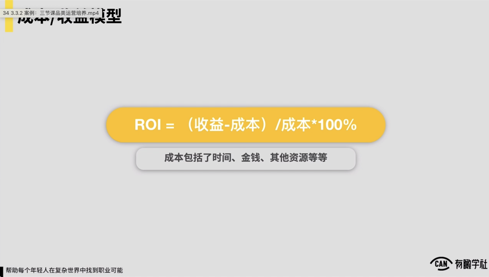

在这儿我觉得各位就形成一个牢靠的意识，成本收益模型一定是操盘手，必须要养成一个基本思考模型，包括我们在跟上级跟上级去沟通的时候，很多事情一定是讲成本和收益的，我们要说这件事要做还是不要做，一定回归到它的成本和收益上面去对然后我在上面投多大成本看多少回报，跟上级沟通一定是这样的，沟通是更高效的。

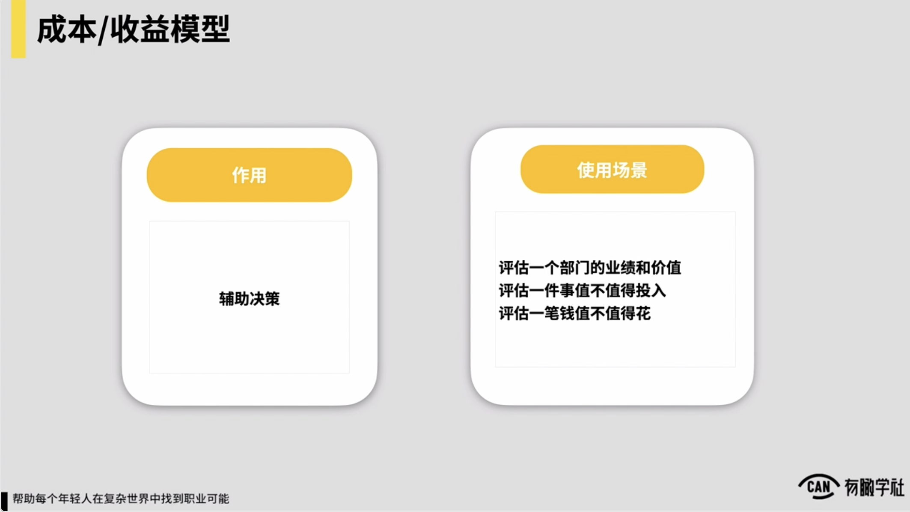

所以这是成本收益模型。

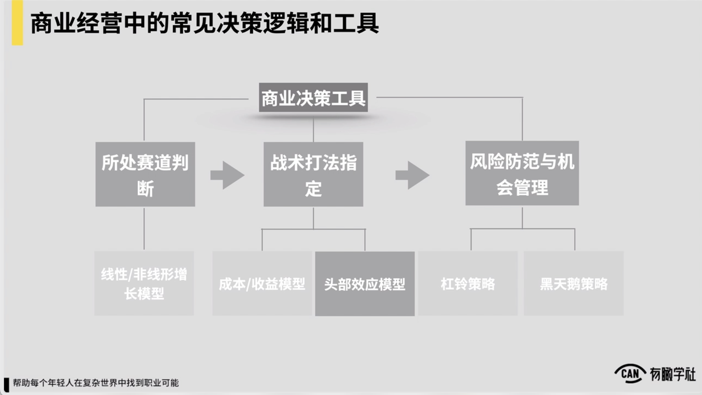

我们要讲的第三个这种决策的工具叫做头部效应模型。头部效应模型这件事也不复杂，不管我们叫它杠杆效应，还叫它28法则都可以有很多的叫法。

，但这里边我觉得是说它指向的核心的这种逻辑的决策，是一定在于说我们在任何一个赛道里边，我们成为一个头部的玩家和选手，我们所获得的收益一定会远远胜于那些说我没有在头部，我在腰部和在尾部的人，他的效应可能都不是一两倍，是几十倍甚至上百倍，是这样的一个这种逻辑。

，然后这里面是说可以给各位分享一个例子，一个很有趣的例子，我有个朋友叫彭小六，有人可能知道他他是一个现在也算是一个说这种知识网红和大v和IP对写了好几本书，最早可能也是在个人学习成长知识管理领域里边开始积累起来自己的这种个人品牌IP。对小六他个人的成长和个人的发展是十分有意思的。，然后他自己可能开始通过写作来经营自己的个人品牌，已经是2016年的下半年。

，很多人都知道2016年的下半年，那个时候，处理个微信公众号的生态，因为那个阶段每个人说我想通过写作经营自己个人IP，都会想到说我要写个公众号对但在那个阶段里边，微信公众号已经是一个较为成熟的生态了，这意味着什么？

处理个在个人成长知识管理领域里边，有很多人已经牢牢的占据住了他们在每个这种细分的领域下，他们的个人的位置，例如在知识管理里边有什么战损，有什么萧秋水，有什么彩童等等，然后在个人成长里面也有很多的这种人什么时间管理，这里边也有十分多人就不一一细数了。

所以小六在当时他一方面想通过写作来进行自己的个人IP，另外一方面就发现说在微信公众号里边我写起来太费劲了，没人看我无法快速的获得原始积累，虽然说微信是一个显着更大的生态，于是时候他就做了一个思考，他就想说我不在微信写，我在个地方写他就到处看各种平台，看了知乎，发现在知乎上可能他也写不过其他人，然后又到处找，最后找到一个平台叫简书，简书在那时候是一家创业公司还是一个发展中的平台。

，然后小六就上简书看了一圈，发现在简书上似乎就自己机会大一点，为什么他发现在简书上自己只有一个对手，但在其他地方自己有n多个对手，然后他在简书上就发现说在时间管理个人成长领域里边只有一个人在吭哧吭哧写，而且人他的这种粉丝和关注度在站内是最高的，但即便这样，人当时在简书站内的这种粉丝和关注度可能也大几万的样子，所以在小六看起来完全是一个可以追上的这种差距，于是小六就痛下决心放弃微信的生态，把自己所有精力都投入到简书生态里边，他详细的研究了他对标的这个人，然后他的例如处理个在简书里边的是怎么玩的，怎么打的，研究了一段时间发现两件事，第一件事是发现说似乎他对标对手通常是说每三天写一篇，然后每写一篇发出来之后反正就涨粉

反正就涨粉，在检出站内约是这样的。

以及他又发现一件事儿，发现早期的简书通常是一个说它的内容还较为稀缺，因为没有那么多的APP，所以他发现早期简书通常是一个这样的逻辑，你只要写得多写的越多，然后进了简书的官方推荐越多，然后你就能涨粉，你涨粉就越多，所以在简书早期战略他发现说如果他要PK过对手，逻辑简而言之，写的比他多，质量有一定保障，持续得到推荐就以上。

于是他就详细地制定了一个针对对手的打法，对通常对手三天写一篇，他一天写三篇，而且对手聊的所有题，他一定会跳出来，用另外一个角度再聊一遍，而且聊完一遍之后还各种艾特人，请别人来去参与对说你觉得我的观点可能怎么样？

，然后就在减速治疗上详细的打法，这样情况下吭哧吭哧你就跑了四五月，四五个月跑完下来之后不出所料，然后他确实就在减缩战略上就超过这个竞争对手了，竞争对手也是一个行业里边的大v是谁我就不了，到今天还很有名，然后随后说小六超过了竞争对手之后，他也觉得不保险，于是你又巩固了三个月，继续一天三片的速度又巩固了三个月，直到他觉得说我跟竞争对手跟大v之间差距认为一时半会对方追不上了，于是这时候就收回来，再减速就减少投入，但是这时候你发现小六自此刻开始他身上就有了一个标签，他也给自己就贴上标签叫什么叫简书一哥，

因为他在简书处理个简书站内是粉丝数最高的一个人，在江湖上也开始就拿着身份就开始各种的去做自己的个人品牌的经营，时候奇妙的事情就发生了，当他已经是一个简书一哥之后，他发现自己在写微信公众号，涨粉的速度蹭蹭的。

，然后当他是一个简出一哥之后，有各种的电视台主动来找他对说我们邀请你上个节目，有出版社来找他说我们一起出本书，对他就有了各种各样的这种机会。你发现所以它在简书平台里边，虽然说简书的平台，它的生态和影响力远远不及微信，但它在简书里边获得头部的位置，极大的赋能了它后续的发展。

所以这是一个十分典型的利用头部效应来去赋能自己的发展，来打一场逆袭战役的这样的这种较为经典的案例。

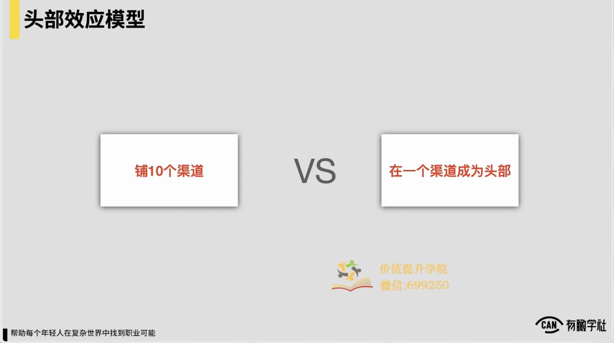

案例在推演下来，我觉得在我们很多的工作当中都可以去用头部效应来赋能我们一些思考的，例如对很多中早期公司而言，到底是说我的产品上线之后，我要同时铺10渠道，10渠道我都吭哧吭哧花点资源对接一下

接上去还是说我尽力在1渠道打爆，成为头部，例如你做一堂课对你到底是说我做出来之后，我在什么腾讯课堂云课堂，然后什么千聊什么得到所有的这些平台，然后我可能都介入都去做一波推广宣传，还是说我集中就在一个渠道，我就在例如假设就在什么腾讯课堂，先成为说腾讯课堂上卖的最好的，例如一个职场类的课程。

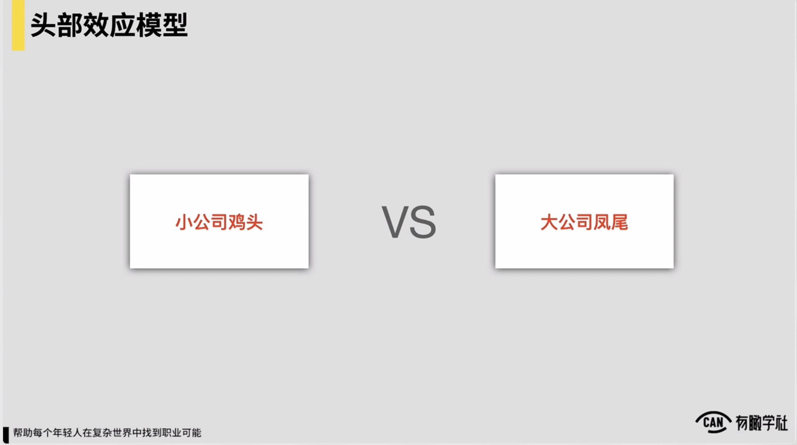

一定是后面这种策略会让你后续这款产品的运营和发展和增长可获得更高的势能。再包括说对我们个人的职业生涯的选择和判断而言，我觉得也存在逻辑的，到底你是说我选择在一家小公司里边扮演一个核心的角色，还是我要在一家大公司里边，在一个不那么知名不那么重要的部门里边

做一个执行者，很多时候也是你在小公司里边成为一个核心的角色，参与了十分多重要的这种项目，获得十分多重要的业绩，一定会比你在大公司里面平平稳稳的待个两三年，要对你个人的职业发展可能获得空间要远远要更大。

，所以这是关于头部效应。

对在头部效应地方，然后我们简单总结一下，这里边会有两个指向，第一个指向是说在你公司的发展，或者说你个人的成长里边都是这样的，任何一个赛道下边你如果能成为头部，对你来说一定会是一种较优的策略。这是第一句话。

还有二第二句话叫做说如果你在当前的一线战场无法成为头部努力了，你也付出了很多的这种时间和资源对但你发现说我靠很苦，就像小鹿一样对他在那个时间去写微信公众号肯定写不过其他人，你没必要在这硬拼。所以这时候可能最好的一种策略叫做说你先退回二线战场，在二线战场里边先成为头部，这时候你就在二线战场里边，你成为绝对头部之后你就有势能，你这时候再携带你在二线战场里边获得的势能，杀回一线战场，这时候对你来讲更优，例如包括对我来说也是这样的

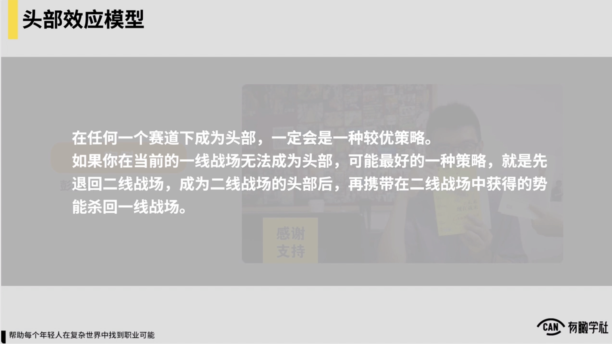

然后像我这样一个说早期没什么学历，没什么背景没什么经验的人，你说我要进大厂，不可能

所以我就自己例如去创业，自己创业折腾了半天，折腾了这么三五件事儿，虽然说也没有什么大的成就，但通常创业过程当中还是做了一些重要的这种项目，每个项目反正都是我来去驱动和发起的，至少我所处的细分行业里边似乎我就有点影响力有点失能了。

我在携带失能又在2014年的时候重新进了大厂

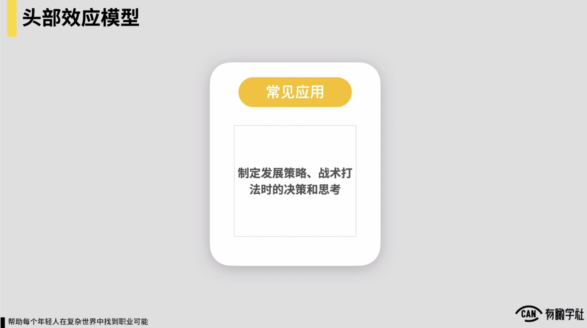

再到大厂里边去继续我的这种职业生涯和职业成长，也是逻辑，所以关于说头部效应这样的一个这种模型，它很多时候也能指导我们的一些这种决策的依据，所以很多时候我说我们在制定策略跟上级对话，或者我们在思考上级们的一个这种策略时候，头部效应可能很多时候我觉得也是一个较为常见，能去帮权衡，或者帮判断一些事情的一个基本的工具，这是我们要讲的第三个工具。

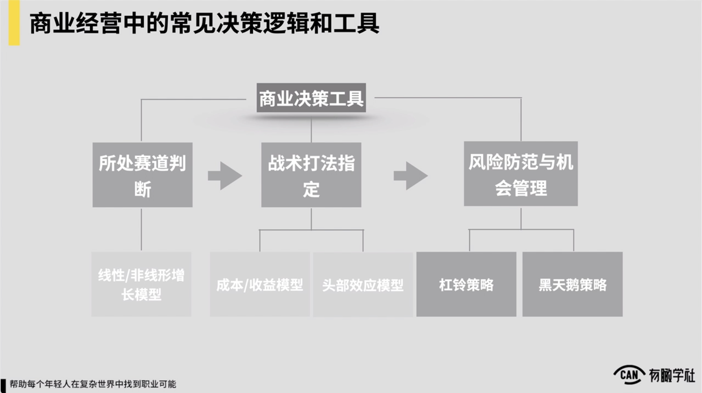

最后是第四个工具，第四个工具指向的是我们的风险防范和机会管理，第四个工具同时是两个名词加在一起，杠铃策略和黑天鹅策略。

，然后这两个东西是什么意思？我们先来还是通过案例来查看，因为我们在工作中经常会遇到这样的问题，就明年我们预期要增长200%，我们做了个a方案，a方案我们是约率相信他能达成的，但中间也还有一些风险对风险如果无法达成，我们到底该怎么办？，然后这是一类典型的问题。

第二类问题说我们团队有20人，然后我们现在手中可能有两三件事可做，这20人我们到底怎么去安排最妥当的，对是平均分配资源吗？还是在资源的投入上应该有些什么样的不同？对然后也是我们要思考的。

第三个我们很多时候都会遇到说我们当前在做这件事，我们当时在一个市场里边在做一件事情，突然另外一个市场里边似乎有点机会下沉市场，说例如像2018年很多公司都会面临到，似乎虽然我在进行一线人群进行得十分的，似乎下沉市场说有点机会，拼多多进行得十分的，下沉市场对我要不要进行，我们没进行过，对这件事反正要进行，进行不进行的钱不知道。

，然后又要我们投资源，但是似乎有机会有多大不知道，对这件事到底要进行还是不要进行，个问题对然后以及可能类似像在2019年的时候也会有这样的一个问题，例如似乎看起来快手似乎有点机会，也是从下沉市场开始要往一二线人群里边去切，所以似乎快手有点可能要在一线人群当中要大有作为了。

所以如果我们是一家主要用户群体，面向一二线人群的这样的公司，微信公众号可能当前我们也还能有很多的收益，但是无法预期它有很大的增长了，快手事我们要做还是不要做？

我们该怎么去评估我们在里边投入多大的这种资源和成本，

所有这些说我们要去应对我们的工作中的风险，或者说要去应对我们工作中存在的一些这种机会，然后怎么去平衡，就所有的这些机会，我们该怎么去选择的时候，用到杠铃策略加黑天鹅策略，杠铃策略和黑天鹅策略，这两个名词各位在百度都可以会查到它的定义。

最简单来讲，所谓杠铃策略它背后逻辑分散我的这种风险，把我的资源平均要可能以一个这种模型逻辑，分布式的投到各个不同的领域里边去，就像我们在投资的时候，一个组合投资的策略，我们投一些股票，投一些这种货币基金，再投一些例如常规这种理财产品之类的，它最终这些东西组合在一起能保证说我们的年均收益相对是较为稳定的，且是为正的，它本质上是这样一个这种认为，这典型的杠铃策略，黑天鹅策略是什么意思

各位也都知道黑天鹅概念就在市场上，因为它的不确定性十分大，尤其在当今商业环境经常会出现一些各位无法预见的小概率的事件，事件发生了之后，它绝大部分概率90%以上的概率不会产生啥影响，但是他一旦成功了，一旦这件事出现了，对他有颠覆处理个行业，这是黑天鹅概念背后的一个逻辑。

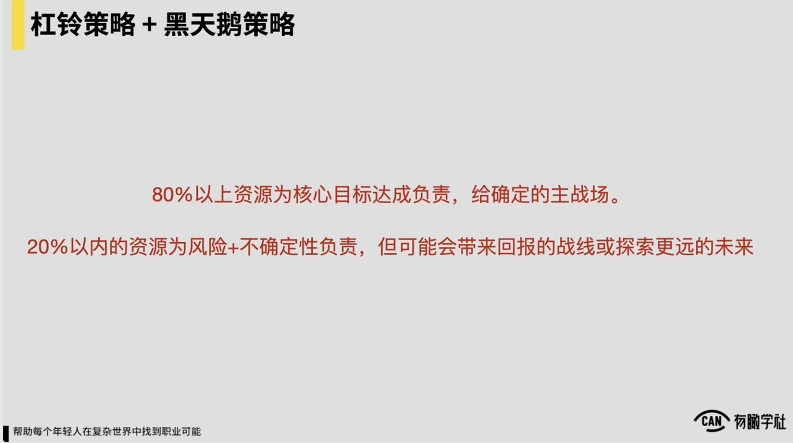

所以杠铃策略和黑天鹅策略会怎么指导我们的决策，然后通常给到各位建议会是这样一个建议，就我们在很多的工作当中可以以这样一个逻辑去思考，我们80%以上的资源为我们核心目标的达成负责，给到我们有确定性的主战场。同时20%以内的资源到底这地方这当中是15%还是10%还是百分之多少对你自己看情况来定就行了。

但是总体上大的原则就20%20%以里资源为风险和不确定性负责，然后可以去投入给到说那些虽然当前来看不确定性十分大，有很大风险，但是将来有带来更多的回报，或者是有可能帮我们探索出来一条说未来三年后我们的一个增长引擎投入给这样的这种战线里面去，但前提是你的这种资源

资源可能已经能做到说我的资源相对来讲还算有点充裕了，如果你说我就一个人对这时候你是没有什么资源的，但你说我的团队里边有笔钱了，也有约例如二三十个人了，这时候你是有资源的，需要去考虑资源怎么去分配。

，如果按这样逻辑，我们回归到刚才那几个场景，举例子，你说像快手事儿，当前要做不要做，我觉得最简单的做法说你团队有10人，如果说微信公号当前还是你明年，你的增长目标达成的主要的战线，8人去做微信公号，两个人做个快手，然后以两三个月的周期去留意一下他们做的情况到底怎么样，

能不能找出水来，这里面能找出水来，好我追加资源投入，找不出水来，拜拜，我果断就砍掉就以上。约就这么一个这种逻辑。

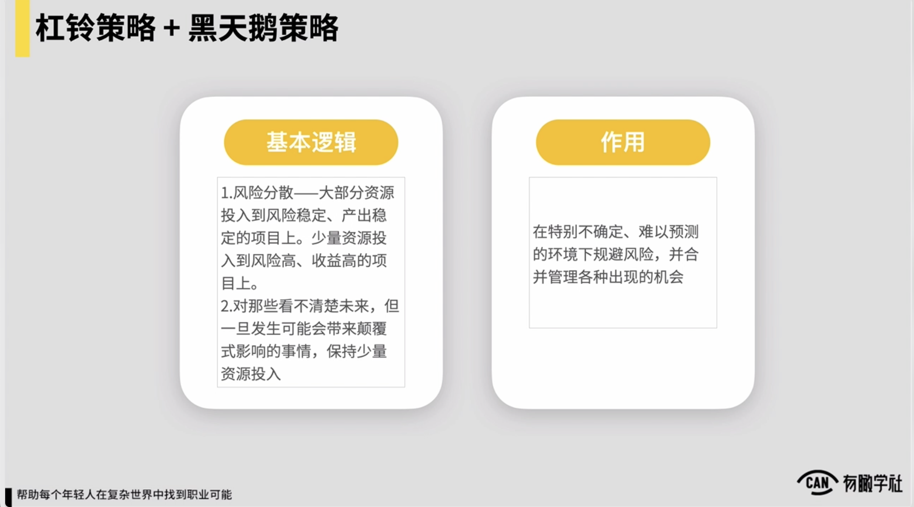

所以这是所谓的杠铃策略和黑天鹅策略，所以有些时候上级们对吧也会有一些决策说可能我们在某个时候，虽然有件事我们看起来没想清楚，但是我们还是要投两三个人说他要去做一做，他要在里边定个计划，就干个三个月就干个半年，逻辑是什么？

很多时候有可能上级们背后想的说我们要去为未来去做一些探索做一些准备，虽然说在做出决策的时候，我也不知道他们能不能出成果，甚至有90%以上就不能出成果，但这件事还是得干，并且还是需要我们在一线的这种执行的同学们去以使命必达的这种意识，要去保证我们的执行是到位的，要去能得到成果，不然如果你说因为我的执行不到位，影响了成果的产出

这本质上我觉得是我们在一线已经失职了，我们的执行的这种结果的反馈无法去支撑我们高层做出一个科学和合理的决策，这时候是有十分大的问题的，所以这是关于杠铃策略和黑天鹅策略。

所以它基本逻辑风险分散是一个对那些看不清未来，但一旦发生会带来颠覆性影响的事情，保持少量资源投入，在你的资源反正有一定充裕的情况下，然后作用反正就在十分不确定难以预测的环境下，他们帮助你去规避风险，合理管理各种出现的机会，这是这样的一个这种决策的工具。

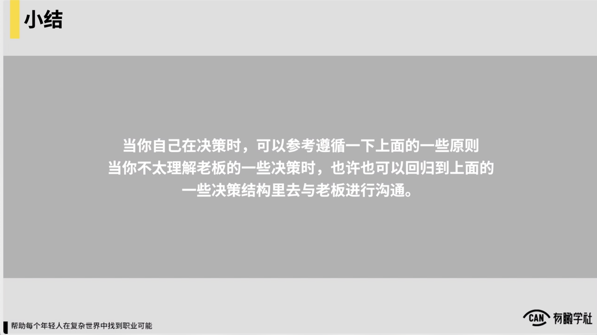

所以最后今天的内容我收个尾，今天我们在第一章的部分核心讲了三块的内容，第一块从投资人或者CEO的视角来去看待一家公司它的这种经营和管理约是个什么逻辑，引出来一个重要的结论是说那一家公司到一个阶段之后对它一定是以模型来看待一切的事情，我们一定要把所有的事情，这家公司所有的经营都模型化，通过模型通过数字来跟高层去对话，是最经济最高效的方式。

，所以这是第一个逻辑。

第二个重要的信息是我们讲的说在一家公司发展的不同阶段，作为公司的高层和管理者，他最关注的事情到底是什么？我们也给了一个基本的这种逻辑，给了一些重要的工具，这些事儿也是各位可以用来去自省来去看待，说你当前所在公司你上级们到底最重要的关注的是什么

第三个部分我们给了各位一些常见的在商业经营的这种层面，然后就较为常见的一些这种决策的工具，然后也希望通过这些决策工具帮助各位更好去理解说上级们有些时候做了一个决策，它背后有是什么逻辑，包括说我要跟上级们去确认他的决策是否这样去做出的，我至少有个工具可以依赖了，对我可以通过这些工具去跟上级们去对话，约理解说上级们可能有些时候会怎么思考，包括说这些决策工具，很多时候也许也可去帮助我们自己在做一些工作的时候，然后去更好的做一些决策和判断。
