# 难点3：上级在抛出一个想法的时候，Ta可能想要什么答案？

在一个想法面前，靠谱高层上级们有自己的逻辑思考层次，先思考确认上级问的是个层次的问题，再在不同的层次上给出有效的反馈，才能同频。

### **1.验证战略方向的假设**

**真实想法：**&#x6211;们在什么市场、做什么产品才更靠谱？

**靠谱回复：**&#x6700;好明确需要重点验证什么，提供可行性分析（如供、需两侧的分析和局部调研）就好。

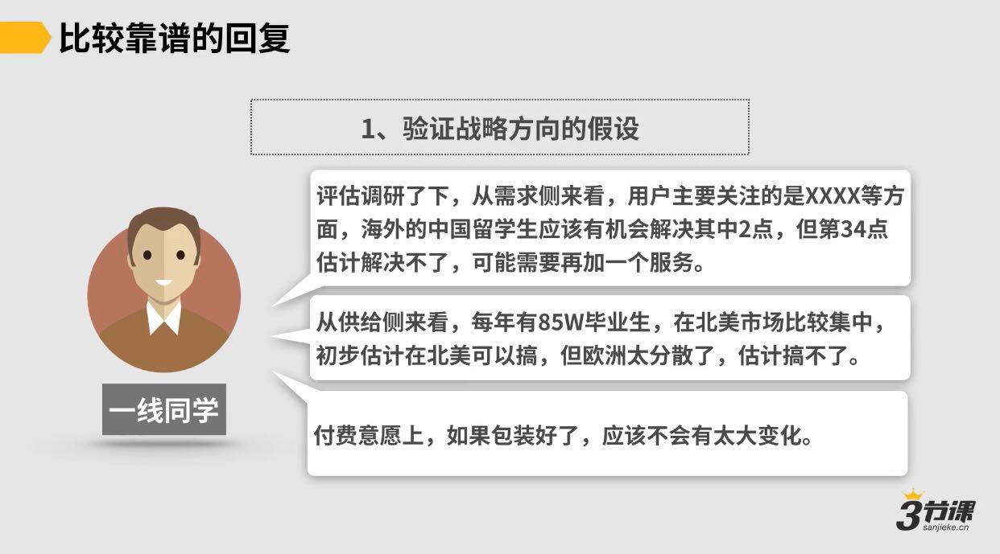

### **2.评估商业模式或业务模型**

**真实想法：**&#x6211;们当前业务的供给、交付、营销等方面是否需要升级？按照某个逻辑设想，靠谱程度有多大？

**靠谱回复：**&#x6700;好按照一些基础假设，提供财务模型估算、是否会影响现有业务模型的信息。

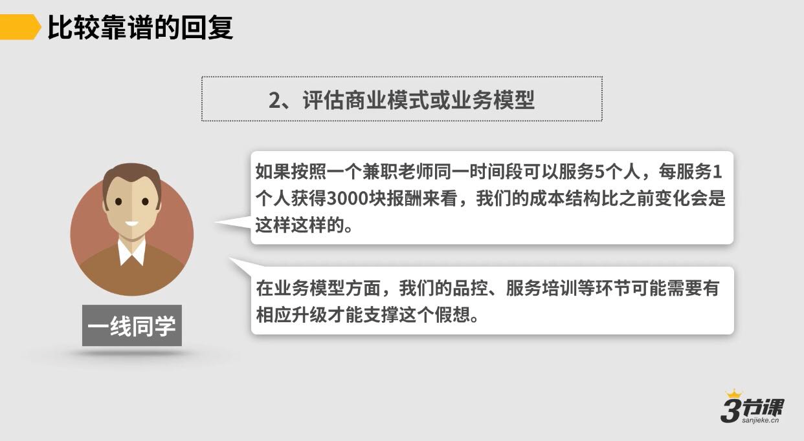

### **3.了解业务模型中各分支模块怎么搭建**

**真实想法：**&#x5982;果已经明确了交付部分要升级换种玩法，那么新的交付方式到底怎么做？分成些模块？

**靠谱回复：**&#x63D0;供关于处理个独立业务的处理体模型，并告知重点难点。

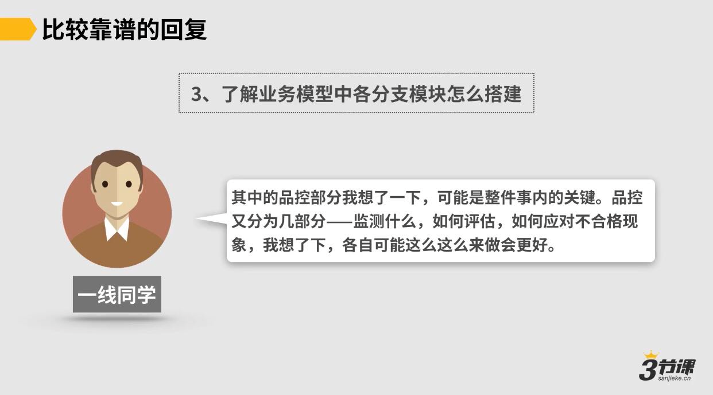

### **4.了解执行落地的路径是怎样的**

**真实想法：**&#x4E8B;情事了，随后怎么干成？

**靠谱回复：**&#x7ED9;计划+规划+里程碑

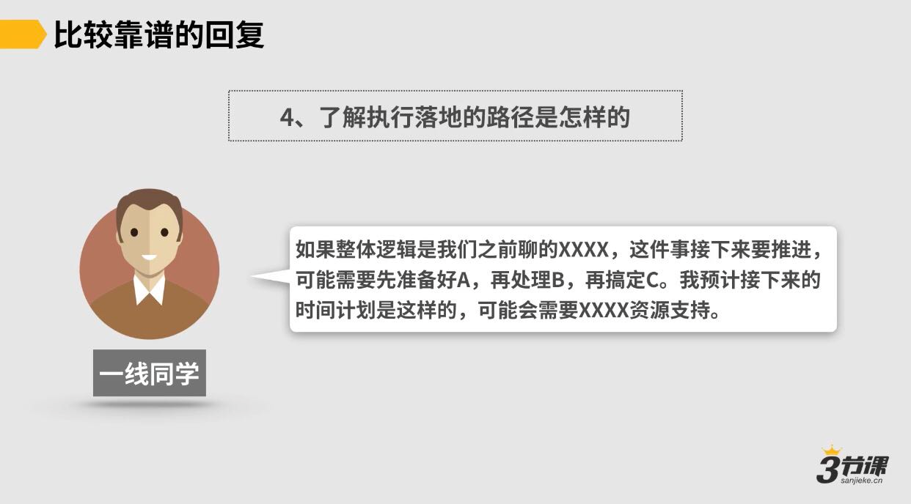

### **5.讨论如何才能在某件事上执行得更好**

**真实想法：**&#x6574;件事中间可能有一个十分难完成的点，该怎么处理？

**靠谱回复：**&#x76F4;接聊怎么进行

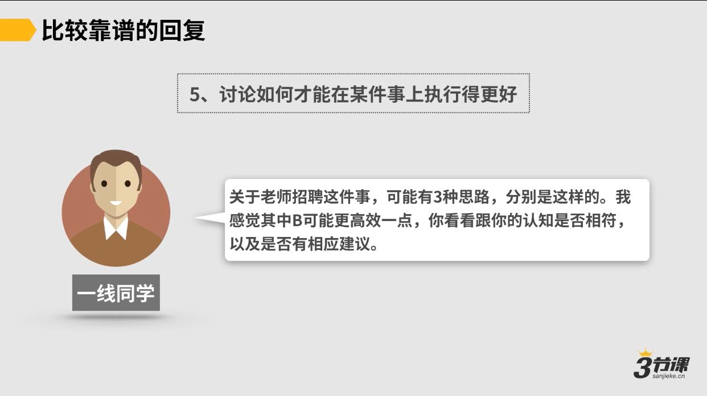

### 上级的2种思考路径

1.自上而下&#x20;

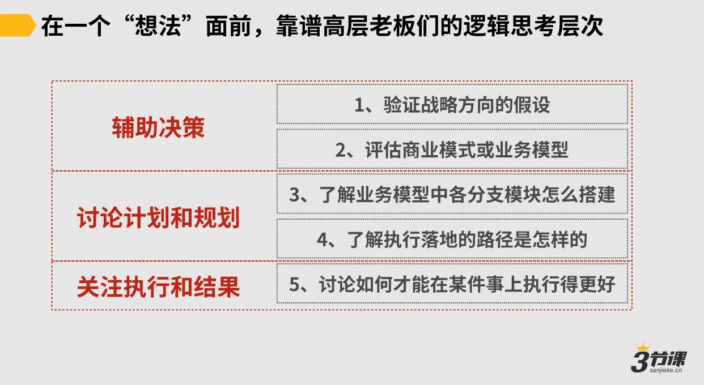

2.先解决重要问题的达成，再去想处理体的战略规划

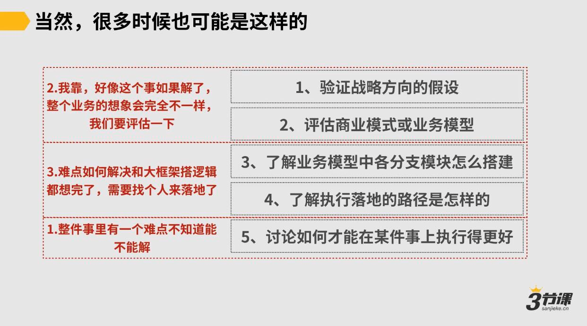

***

### 12 2.3 上级抛出问题后想得到什么答案.mp4

我们直接进入到第三个难点，上级在抛出一个问题的时候，他到底背后想要获得什么答案？对进入到部分的时候跟各位去分享一句，可能各位听过之后都会心一笑的一句话，

行业里边有一句不成文的俗话，这句俗话来自于黄永灿对然后叫做不怕上级不干活，只怕上级有想法。，然后很多时候我们都十分担心对说上级没事，反正他不找我，事就还好对他在那自己喝茶，或者自己在自己打个游戏开心一下，这事可能对我都还好。

，但突然有一天上级跑出来跟我了，说我有三个想法，这事就太可怕了，对三个想法我该怎么处理对三个想法背后都是需求，我得揭锅。，然后更可怕是揭完锅之后做出来的东西上级还不认对这事就更可怕了。，所以不怕上级不干活，只怕上级有想法。但是有些时候上级也十分的，我身边有个朋友，他是一家留学咨询公司的一个上级，我听他讲过一个真实的例子，通常说是在2019年的时候他自己创办的一家公司。

2019年上半年的时候，然后因为过去他们的例如留学咨询公司里边的老师和这种规划师，然后通常都是在国内雇佣的全职的员工，所以在2019年上半年的时候，他就想到因为全职员工第一个是成本较为高，第二个是说反正对于很多的这种留学生在真正去到国外之后要提供一些后续的服务，有留学生有这样的需求，然后要提供一些后续服务，似乎事承接不了，于是上级就冒出来一个想法说现在反正在互联网上众包这种模式十分的，

我们这家公司能不能考虑一下，让我们的老师都变成国外的中国留学生，对有没有这样，背后反正他的想法说是否东西反正说有可能成本可以降低，然后还能给到用户更强的这种服务，然后他就有一天就跟他下边一个核心的中层leader就，你思考一下做个方案我们聊聊，就抛了这么一个想法。

，然后中层的 Leader然后可能就想了一下，然后吭哧吭哧花了两周，可能想了一下说我要招什么国外中国留学生，我可能先在国外所大学对我要先去开始进行，这所大学里边我要招，我提前得跟校方对然后做些什么样的这种沟通，然后要花多少钱，然后怎么去处理做这么一个方案给到上级。

，然后给到上级之后上级就震惊了，然后通常就说我靠你给我东西我完全不是我想要的，这时候反正各位就都很别扭对上级心目中的os就跟我们前边讲到的一样，对我想要的东西就那么1234，然后你怎么就不理解这时候上级和一线的这种同学之间，他们之间就存在着巨大的这种gap。在这种巨大干部背后一个想法背后，很多时候上级都会抛想法，他抛想法的背后，他是想获得一些信息，就像我们的，他是希望通过在一线获得一些信息来支持我的思考或者决策。

，所以上级在抛一个想法的时候，他有可能到底是想获得一些什么信息难就难在这了，因为很多时候上级们抛出来一个想法之后，他背后他想获得信息，有可能层次是不一样的。

换句话，上级有可能问你的问题这么一个问题，但上级有可能说在今天明天后天三个场景下，同时问的都是你这样同样一个问题，但背后他的需求可能已经发生了改变，很多时候这样的，作为我们在一线或在中层的这样一种leader层面，很重要的一点我们要十分深刻理解，一个上级抛了一个想法，背后他的逻辑思考层次有些，也说他有几层的需求，我们要把事要进行明白

进行清楚事之后，我们才可做到真正的跟上级去同频和对话。

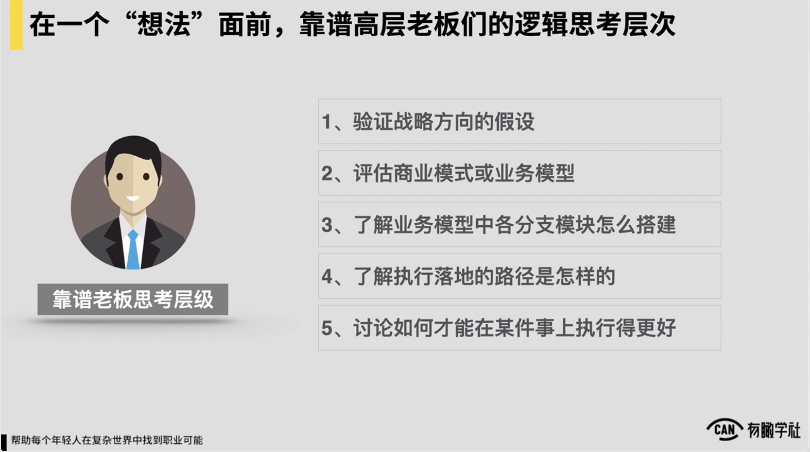

所以我们就一个个来看，等上级抛了一个想法之后，很多时候他的这种逻辑思考的层次有5层依次来看。第一层是叫做说我抛了一个想法，我抛想法背后有想要验证我的战略方向上的一个假设。，例如我可能抛一个想法背后，我是想验证说我可能往市场下，然后按这么一种模式去做这事儿，ok还是不ok，有没有可能可去凿开这样的一种需求，对可能我的真实需求这样一件事情，这是我的第一个逻辑思考的层次。

第二个逻辑思考层次叫做是说我说方向我想的差不多了，约要打往这地方打，对例如要打下沉市场，我想的差不多了，但是我想要评估一下我们的商业模式或成本模型，例如按照这么一个模式打我的成本是多少，对然后我的处理个的这种经营模型是怎样的，然后我说在处理个成本结构里边，我是把ab这两块调处理一下，还是 Ab这两块高一些，我可能重点去调c

我想要评估一下这件事情，然后我处理个的业务模型，不管是我的营销还是我的交付，的处理个的模型约应该是怎样的，这有我想我作为一个上级抛个想法背后我想要获得的第二层的信息，第三层的信息可能说我也有前边两件事儿我都进行明白了，

这事儿反正约就往这方向打，也就模式。

但是我十分想了解一下说业务模型当中可能有两个分支的模块怎么来搭建，例如就像我们刚才提到的，对于说国外留学生的，例如请他们来做老师，这部分人因为是兼职，所以有可能对他们的培训是一个还十分的事情，这件事过去也没发生过，所以我有可能十分想进行清楚说到底这方面培训事我该怎么来去做可能更靠谱。所以这是有可能我背后想获得的第三个信息。

第四种可能前面几件事我都内心里边有谱了，我重点想了解的是说执行落地的路径，就这么件事我们就要干了，这时候可能才到我们刚才说到说一线同学，我希望他给我一个详细的方案，所以这是第四个层次。

那么第五个层次可能说我有可能说跟我下边的同学就要讨论，到底在某件事上怎么才能执行的更因此，例如也有可能我跟他抛了一个想法，背后我要聊的说到底我们怎么才能更快速的去招聘到更多的国外的留学生，

有这样的。所以在同一个想法背后，我作为一个上级，我的思考的层次有分成这么5层的，在每一个层次下，我想获得的信息和我希望下边的同学给到我的反馈不一样的。

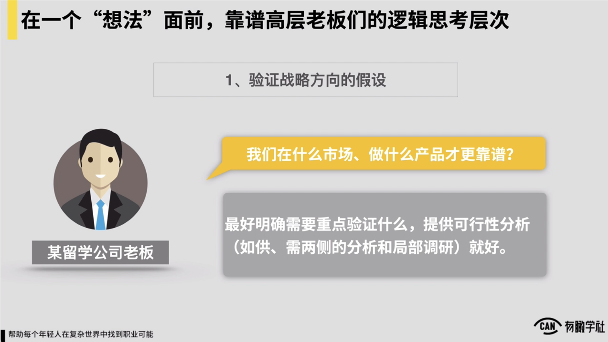

我们再展开来依次查看，首先如果是在第一个层次上，我抛了一个想法，我背后是想验证我们的这种战略方向的假设，这时候我内心里面有着的问题是什么，是这样的，我们到底在什么市场做什么产品才更靠谱更有前途，所以这时候我内心里边对于我下面的同学，对我下级的同学，我希望他给到我的反馈是这样的。

最好他能给明确说就我们要做的这样一款产品，然后要重点验证什么，他的需求成立不成立，事儿能不能进行，然后给我提供一些可行性的分析，例如供需两端的这种分析和局部调研，他帮简单的反馈或论证一下，说这件事儿靠谱不靠谱，或者说往个方向做更靠谱就ok了，

我内心里面需要的是这样的反馈。

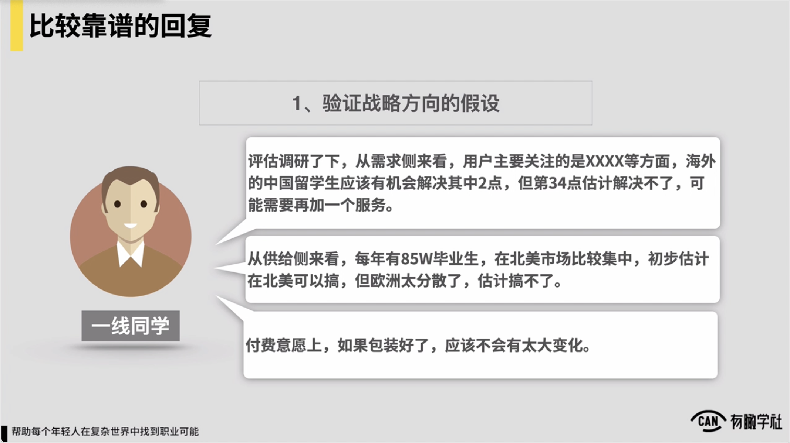

所以假设例如我同样抛了这样一个想法，一线同学们如果我的需求是这样的，一线同学们给到我什么样的反馈会更ok，这样的。，例如时候假设一线同学告诉我说我评估调研了一下，从需求侧来看，用户可能他在出国留学方面重点关注的是1234这么4方面，海外的中国留学生应该有机会解决其中两点。

但是第三点和第四点，例如像什么文书等等这样的东西，因为海外的中国留学生自己之前出国的时候他也没进行过文书，所以他可能解决不了的

第三四点可能就解决不了。所以如果我们是想要让海外的这种中国留学生来去做我们的老师，有可能我们得在基础服务的层面上再附加一个我们公司里边自营的服务，对这样的一个认为。

那么从供给侧一个需求侧一个供给侧，从供给侧来讲，每年有85万这种中国的毕业生，就各级这种高中的或者是本科的毕业生去到海外留学，其中他们在北美市场较为集中，所以估计在北美来进行是ok的，但在欧洲太分散了，估计进行不了。

付费意愿上面，如果包装以上，对用户的付费意愿不会有太大变化，有可能你给到我这样的信息，对一个上级而言就较为受用了，所以这在上级的第一层的这种需求上，他的需求约是这样的，有可能你给到这样的反馈对他而言会更ok。

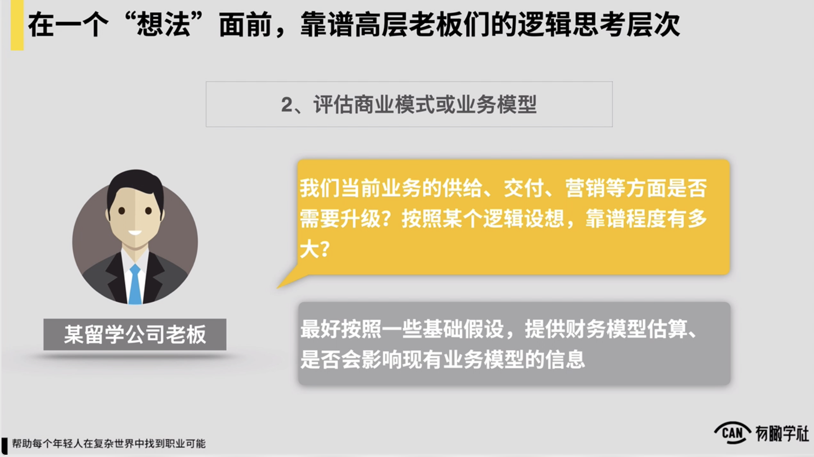

那么再来看在上级的第二层需求上，如果上级抛一个想法背后，他想验证的是说我的商业模式或业务模型ok不ok对这时候他内心里边他潜藏着的问题，是说我们当前如果要做这么一件事儿，我们当前的业务的供给、交付营销等等这些方面是否要升级，如果按照当中某一个假设或某个逻辑来设想，靠谱程度有多大，

所以在时候内心里边希望各位能给到我的这种反馈，是说最好我下面的人按照一些基础的假设，提供一些比如像财务上或者是这种成本上的估算，是否会影响到现有的这种我们的业务的模型或业务逻辑的这样的这种信息，对我内心里面可能需要的是这样的反馈。

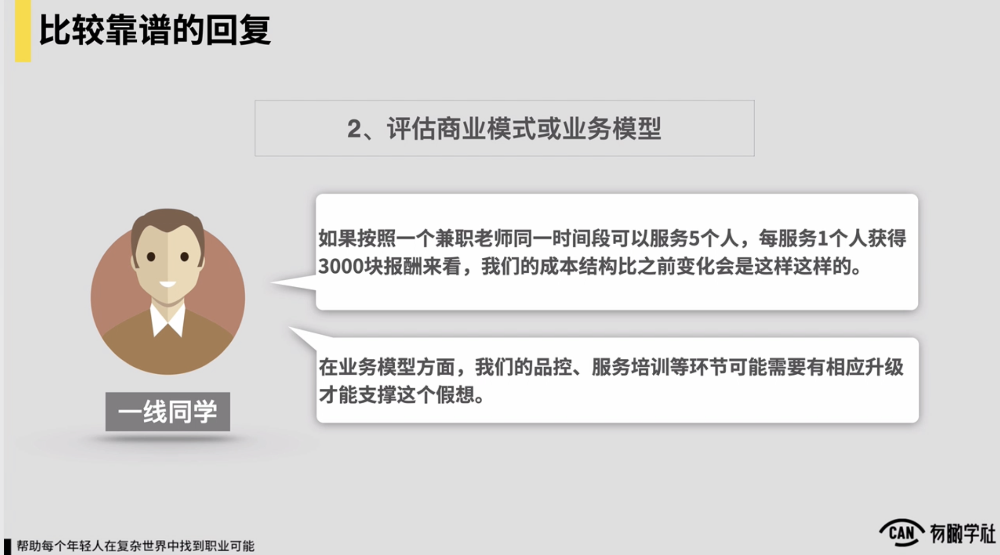

所以这时候假设我下边的同学他这么来告诉我说我们按照这么一个假设，所以1兼职老师同一时间段可以服务5人，每服务1人我们付给他3000块钱报酬来去看，按照这么一个假设，我们的成本结构相比之前变化会是这样的，比之前可能省了多少钱，对这样的一种反馈，以及在业务模型方面，如果再引入说兼职的老师，我们的品控服务培训等等，这些环节需要有相应的升级才能支撑，我们的假想如果升级不发生支撑不了的，这时候我可能需要的是这样的一种反馈了，这是我的需求，如果在第二层的层面上，我下边人给到我这样的反馈更靠谱。

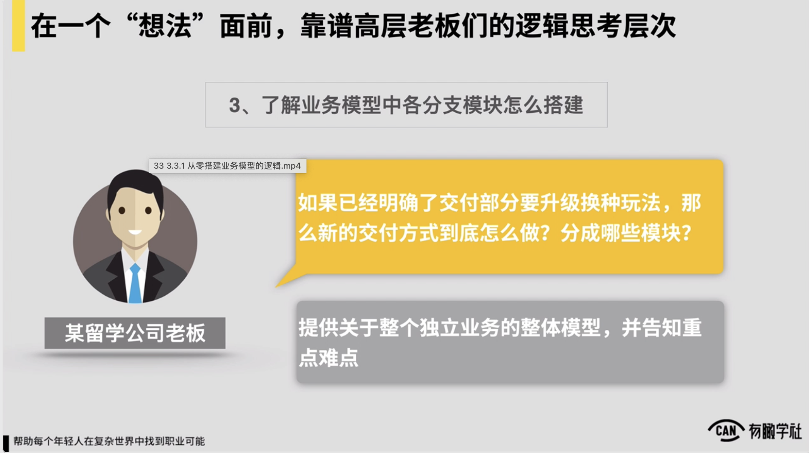

继续再往下，我的需求再往下一层，可能我会说我想要的是了解我业务模型当中各个分支模块怎么来去搭建对这时候举个例子，我内心里边有的问题这样的，说举例子，假设我们是一家服务的公司，或者我们一家出国留学咨询的公司，如果我们已经明确了交付部分，我们要升级换一种玩法，新的交付方式到底该怎么做，会分成些模块，当中某些模块可能怎么来去进行

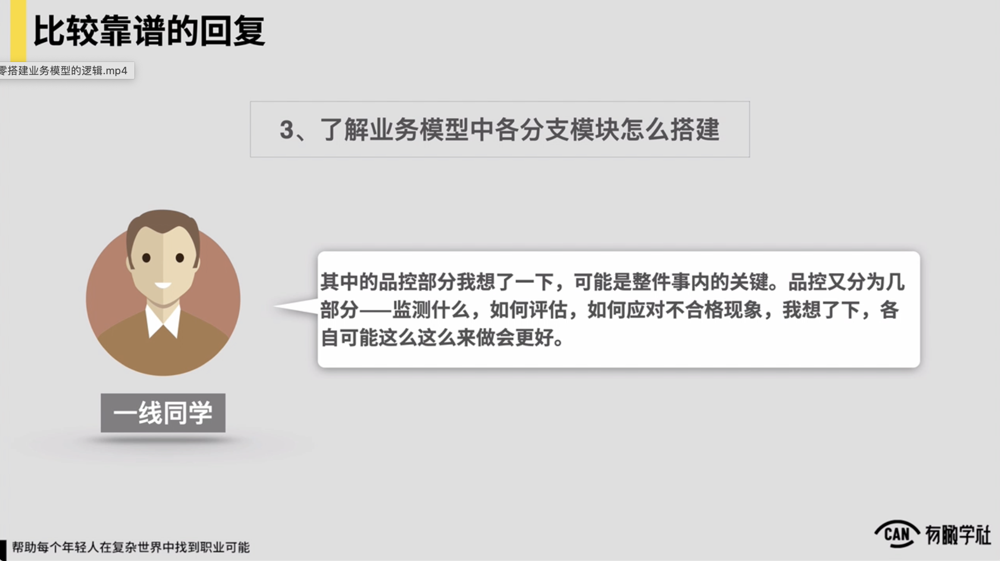

这时候下边的人给到我的信息最好是说关于处理个独立的这种业务，就独立的交付部分，它处理体的模型会变成什么样，并告诉我说当中的重点难点在里，这样对我来讲可能更ok。对例如假设是下面同学就告诉我说处理件这件事情有可能我们第一要招聘，要招聘到这种很多合格的大学生，然后要培训，

培训完了对他们可能要做一系列的运营或者管理，然后当中可能还有品控，处理个约就这么一个逻辑。

但是当中的所有东西我都想了一下，我觉得当中品控是处理件事的关键。

品控又会分成好几个部分，例如我们到底要监测什么，怎么来评估我的所有的这些兼职的这种海外留学生，他们的服务合格不合格，怎么来应对一些不合格的现象，对这里边可能分成这么几部分，我自己想了一下，可能这几部分各自这么来做可能更好。

，这时候可能就跟我我作为一个上级，跟我就把这件事就聊清楚了，

有可能所以在层次上，我需要的是这样的信息，再往下，假设我的需求是说再往下一层是要了解处理个落地执行路径，这时候我内心里面潜在问题基本说事儿事儿了，对我需要的说到底怎么才能干成，这时候就较为简单了，基本说我需要下面的同学就给我计划给我规划，告诉我们要store给我结果就ok了，对所以这时候下面同学他应该给到我的回复，是这样的。

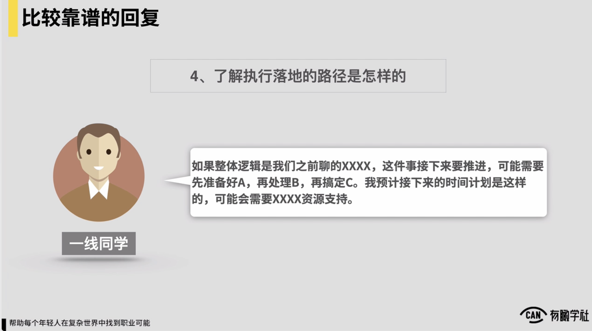

说如果处理体逻辑是我们之前聊的，说12345就按这么着来处理这件事，随后要推进。我们的计划说先准备好a再处理b再完成c随后的时间计划是这样的，预计可能在两个月之后对然后把处理件事可能就进行完，给到你一个什么结果，可能当中会需要什么资源来去支持。，所以当我们要聊到说出计划出规划的时候，你要给我的具体的方案，以及你需要资源支持要告诉我。

，你问我要资源，然后你来给我结果，我觉得下级跟上级之间在这种假设所有的判断的问题都全部明确完了之后，较为理想的合作方式基本就这样的。

下级告诉我说这事应该怎么做，我需要什么支持，好我给你支持，然后你给我结果，是较为舒服的一种状态。

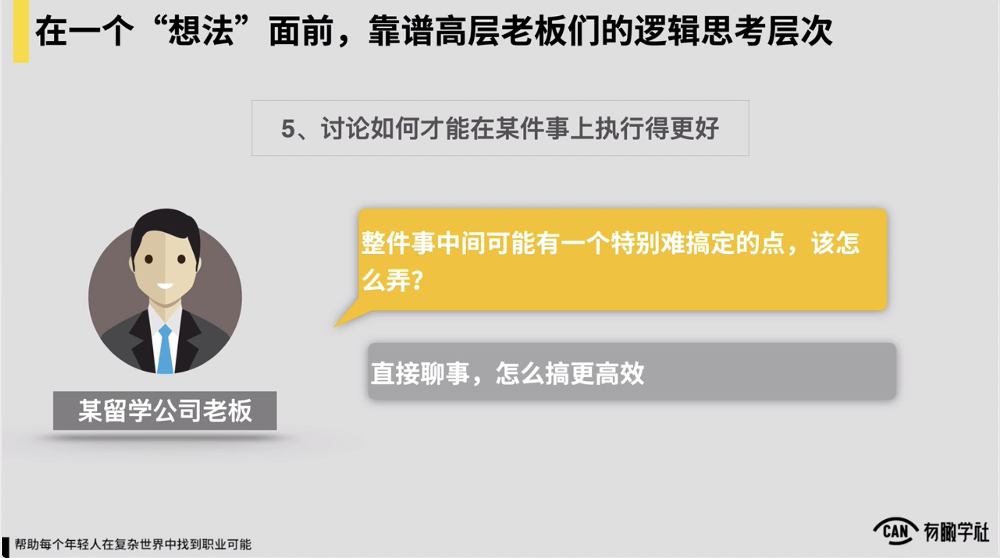

以上，最后一个层次说也许我们也有可能在聊的是，我们就在具体较为低调的讨论，到底在什么事儿上能执行的更因此，这时候可能我内心里面的问题说处理件事中间有可能有一个十分难完成的点，我已经看到点了，点到底该怎么处理？&#x20;

然后所以时候下面人就直接跟我聊这件事儿就ok了，这件事到底怎么进行更高效对例如就像刚才我们讲的，说有可能老师的招聘或培训其中较为难的，

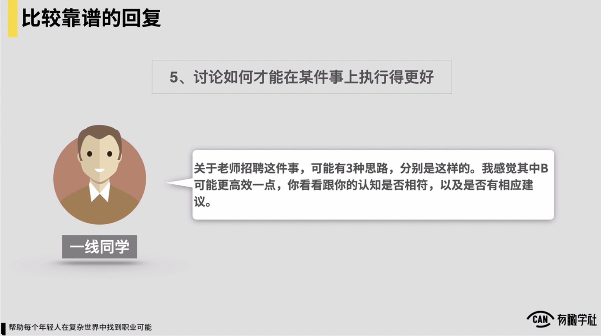

有可能我们要聊，反正就聊老师招聘这件事怎么处理对有可能说假设有老师招聘，下边人可能就告诉我说这件事有三种思路，分别是这样的，ABC我认为其中b可能更高效，你查看跟你的认知是否相符，以及是否有相应的建议，这样就ok了。

所以这是通过一个例子我们展开来聊了一下，就在上级抛个想法背后，他背后的需求是可能有这么5层次的，我们简单归类一下，然后这5层次他可能再进行这种聚类，前两个层次验证战略方向的假设和评估商业模式业务模型，这两个部分我内心需求是需要说我需要一些信息来辅助做决策，然后3和4这两层，我是了解业务模型的分支模块怎么搭建或了解执行落地路径的时候，这时候是说大方向的决策我已经通常就拍下来了，通常约就有一个定论了，但是这时候我是想跟各位讨论计划和规划

一般来讲是规划的框架先明确，我们再落地成计划，但规划的框架如果都没有共识，直接落地成个计划，有可能各位想的还是不一样，对约是这样的，在最后一层我基本就关注执行和结果了。

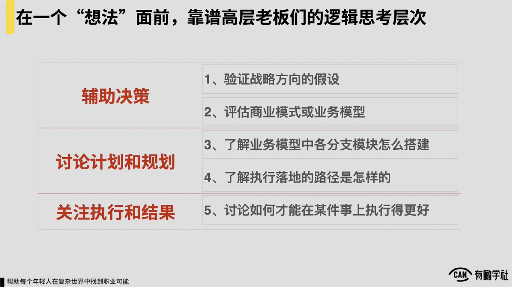

对很多上级反正他的一个这种思考的路径和层次，在他要做出一个重大决策的时候，一般是从上到下的，当我们在上级有些时候抛出一个想法之后，我们要与上级同频，简而言之，基本说我们要先思考确认，包括那些当中，如果你认为到说我觉得上级跟我抛了一个想法对他背后他的需求是否这样的？对过去你不知道

现在听完这课你也许就约有些认为了，你也许就可以约有些判断说上级你想要的信息是否这样的，跟上级确认一下对确认完了之后，你再在不同的层次上给到他有效的反馈，这样是更有助于说你跟上级之间去统频道，所以这一小节核心的内容，然后当然我们要补一下。

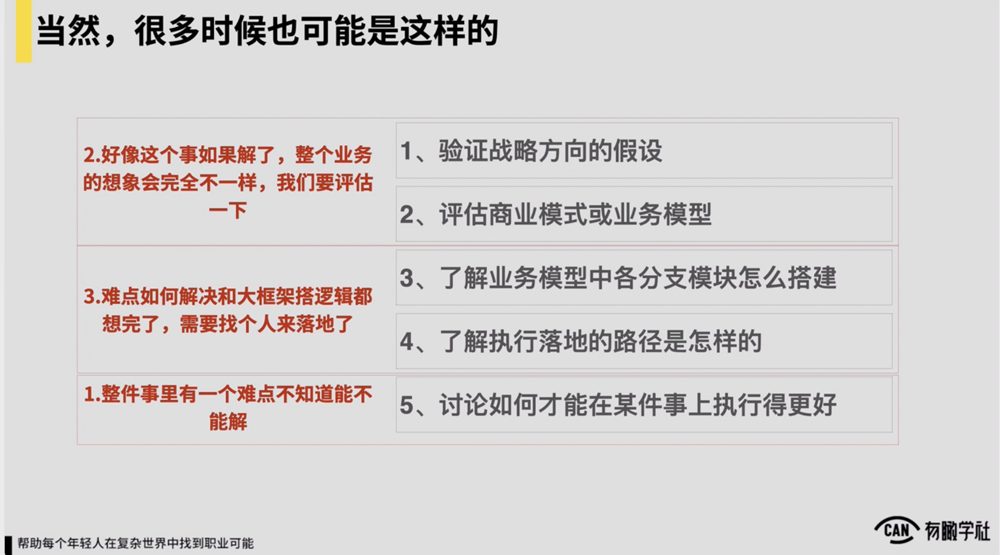

，很多时候我们也要理解一下，说上级们的思考路径也有这样的，他也有这样的，还是这5层次，他有可能很多时候是说我可能先看到了，说处理件事里边有一个难点，事儿十分难，我不知道它能解还是不能解，

例如举例子，假设就我们说的说海外的留学生，然后如果招过来，他帮服务，说国内的这些想留学的小孩子，他的文书的服务到底能进行还是不能进行对就这事我不知道，我就得抛出来

得有个人告诉我说这事能进行还是不能进行，到底怎么处理更因此，有些时候可能这是我的第一思考的切入点。

然后当事我有个答案之后，随后然后我会进入到上边的层次，可能说似乎事如果解了处理个业务里边，然后例如我们的成本会降低50%，或者我们的增长有可能提升30%，事儿就十分值得评估一下了。

对评估完了之后，好再进入到第三个部分难点如何解决，大框架如何搭？逻辑都想完了，这时候我需要找个人来落地了，我可能再找人来落地。

，所以有些时候上级们的这种思考的思考问题的这种层次，他有是这样的，先看到一个十分重要，过去可能没有被解决好的一个难点，对我在难点上可能要先跟各位去讨论

就看事怎么解，然后难点讨论完了，标即立即进入到最高的地方去，说难点如果被解决以上，处理件事就完全不一样了，我们的业务想象力就打开了，然后我再通过已有的信息，重新去规划我的业务。

所以有些时候上级们的这种思考层次也有这样的。

各位在这一节我觉得重点需要各位去消化或理解的，基本说各位首先要理解，上级抛个想法背后他的思考会有这么一些层次，然后在这些层次下上级们的思考路径既有自上而下的，就先战略，然后模型，然后落地到说这种规划和计划，再然后是执行，也有说先解决了一个重要问题，它的执执行和达成，然后我立即再上到上面去重新想我的处理体的这种规划，处理体的这种战略方向，对这两种思考路径都是有可能的。所以这也是在这一节希望各位重点去消化或者理解的。
