# 难点4：如何评估我的工作价值，确保我的工作在上级眼中是重要的？

### 1. 什么样的工作成果在高层视角上才是有价值的？

1.我稳定了某个重要的交付

2.我放大了收入

3.我提升了效率，降低了成本

4.我创造了具有商业想象力的新产品

### 13 2.4.1 什么样的工作在高层来看是有价值的.mp4

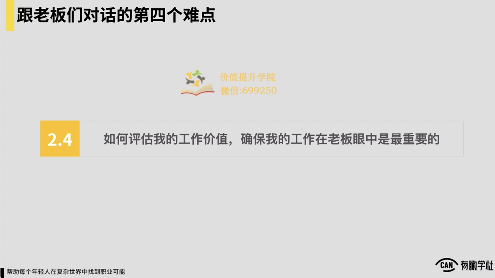

因此，随后进入到另外一个部分，第四个问题。第四个问题也十分重要，第四类问题跟上级对话，第四类难点如何评估我的工作价值，确保我的工作在上级眼中是重要的。因为我们当中有很多人举例子，例如我知道有很多做产品的同学们，尤其是在这种业务驱动业务导向的公司里面，然后做产品的同学们很多时候经常会有个苦恼，我这儿上线了五六个版本，

然后我做了好多工作，然后画了无数图，写了无数文档，然后做了无数项目管理，上线五六个版本对然后干了干了，我怎么向上级去证明说我做工作是有价值的不清楚，不知道怎么说就十分痛苦对就十分的无奈也无辜，反正我也十分的，我也十分的，对你就不清楚，上级也理解不了。对就很痛苦，问题我觉得对很多人来讲也是十分重要的，所以问题我们也得展开来好好聊聊。

处理体上我们还是回归到这样的一个这种模型，我们先让模型所有的内容反正都去给它呈现出来，对一个公司而言，它的发展经历说初创、a轮、b轮这三个阶段

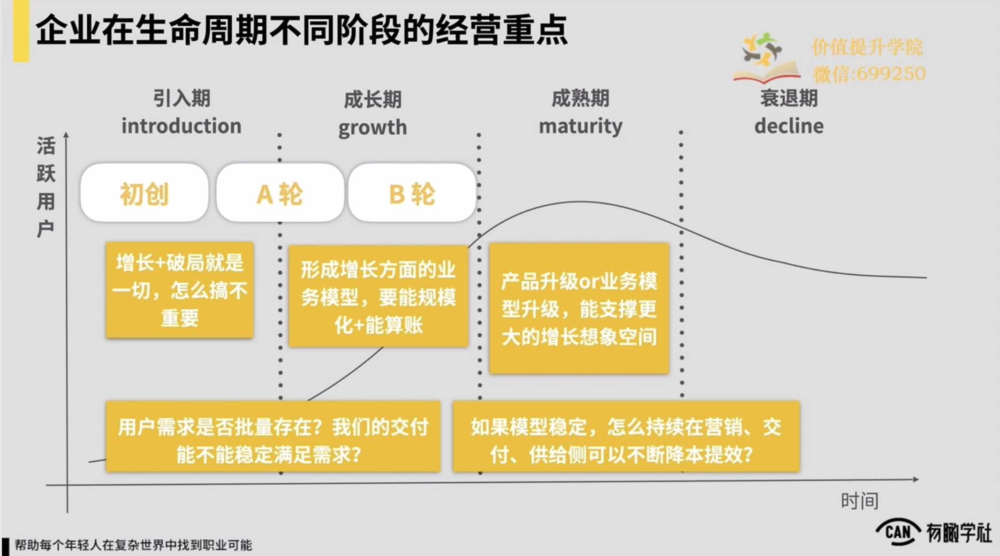

然后我们昨天有提到，我们再简单回顾一下，一家企业在生命周期不同的阶段，它经营的重点最早的时候基本说增长破局一切怎么进行都不重要，先增长先有流量或者先有收入再，然后有了一些流量有一些收入之后，通常我会去开始去思考说到底我进行到的这部分流量或完成这部分收入背后用户需求是否批量稳定的存在，我们的交付能不能稳定的满足用户的需求，因为只有说我们的交付，我们的产品能稳定满足用户的需求，我们的产品才是一个标品，只有标品才是可规模化增长的。

如果说我提供给用户的产品根本不是一个标品对举例子可能说很多人也很喜欢跟我聊天的，对但跟我聊天事儿不同人聊下来完全不同的感受，这事儿就完全不是一个标品，以及我的时间也十分有限，对这事儿你说我能依靠说就卖我的时间就卖说我跟人聊天这件事儿，然后我就成立一家公司对我就收入无限增长了就不可能

所以增长破局解决了之后，一定要思考说用户需求是否批量存在，我们的交付能不能稳定满足需求，再往后可能就到了a轮左右的阶段，到a轮左右阶段一定要形成我们增长方面的业务模型，而且这时候的业务模型一定是说要可规模化和支撑我们处理个能算账的，

然后再往后如果我们的模型稳定，我们这时候就开始去思考说我们怎么持续在营销交付供给三侧可以不断的降本提效，以及再往后走到b轮往后的阶段，我们也许要不断去思考说我们的产品和业务模型是否需要升级以来，去支持我们的业务上有更大的这种增长的想象空间，这是我们讲过的一个基本的逻辑。

以上，如果按照基本逻辑，因为这基本说一个高层或者一个企一家企业的CEO它随着这家公司发展阶段的变化，我脑海中注重最重要的几个问题，所以如果说我就围绕着这么几个问题，我们要来查看，什么样的工作成果在高层视角上才是有价值的。我觉得抛开过程，例如我们上下一个版本或我写了三个文档，这都是过程，过程都是不重要的，我们只看结果，我觉得就这么4类成果在高层的视角上是有价值的。

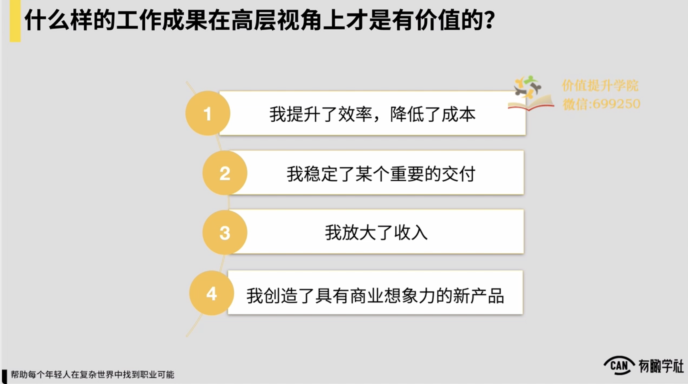

第一类成果叫做说我提升了效率，降低了成本。我原本的一个业务运转流程是这样的，对它之前的这种效率可能较为低，现在经过我的一系列工作它效率变高了，而且我能证明它效率变高了，对事儿对高层来讲是make sense的。

第二种这种成果是叫做说我稳定了某个重要的交付，就像很多人来三节听课，如果我们的交付不稳定，例如100学员来听了，20人因此，40人不因此，然后40人说就那样对这件事我觉得是说也很难想象说产品或这家公司可去规模化成长。，所以如果我做了一些事情，说我稳定了某个重要的交付，这件事对高层而言也是十分有价值的。

第三个我放大了收入，就不用了，对一听就懂。第四个叫做说我创造了一个具有商业想象力的一款新的产品，这件事儿也是具有价值的。举例子说一个人在一家公司里面说我找到一种方法，对可以十分快速的反正去进行出来说假设是大几十万的什么私域流量，这些私域流量反正对我这家公司而言个流量池，它肯定有商业价值的。

所以一个人如果说他独立的，反正能完成了一个说具有商业想象力的新产品，或者一个团队可能也不只是一个人，对这件事在高层的视角上而言也是十分的有价值的，所以拢共来看，我觉得就这4类成果对高层而言，我觉得是会更有价值的。

***

### 2. 在不同公司不同阶段如何评估工作价值？

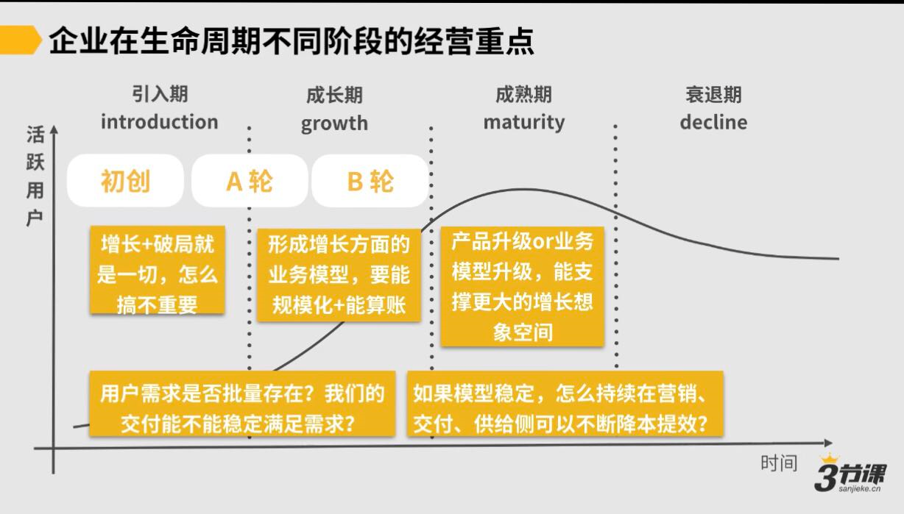

**2.1 早期公司评估逻辑：**

1.自己的工作能否为公司的增长破局贡献价值？

2.能否为某个稳定存在的需求找到一个可规模化的解决方案？

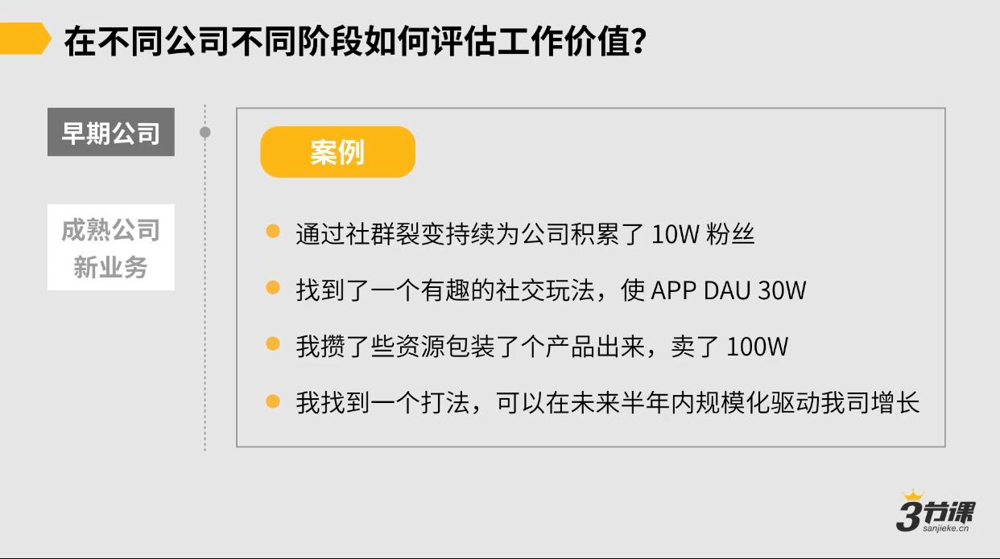

**2.2 成熟公司新业务评估逻辑：**

* 能否快速证明or证伪一个想法？

* 在公司战略框架和优势资源内，定义了一个有更大想象力的需求和解决方案

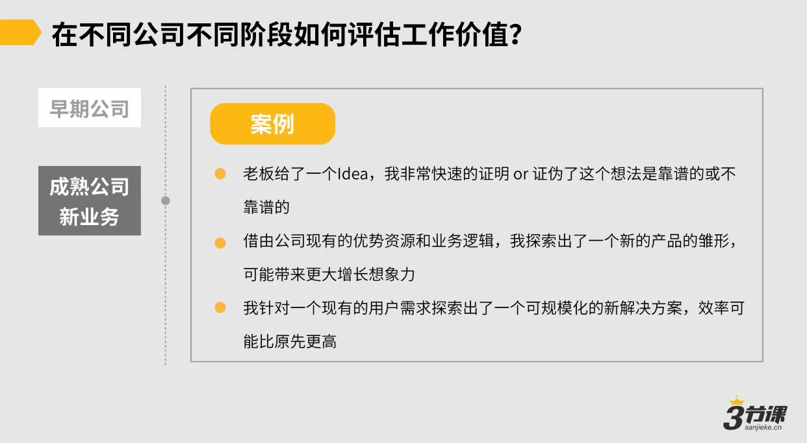

**2.3 成熟公司的成熟业务线，价值评估逻辑：**

* 判断是在成本中心还是利润中心？

* 如何降本提效？

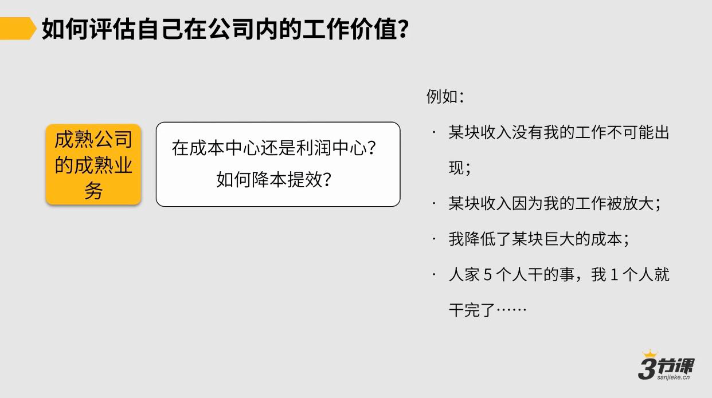

成本中心，不直接面向市场，不产生收入。管理要点：如何在稳定保障系统运转的同时不断降本提效。

利润中心，直接面对市场，能对外销售获得收入。管理要点：如何以更高效率挣到更多钱或获取更多流量。

**传统产业的商业经营模型**

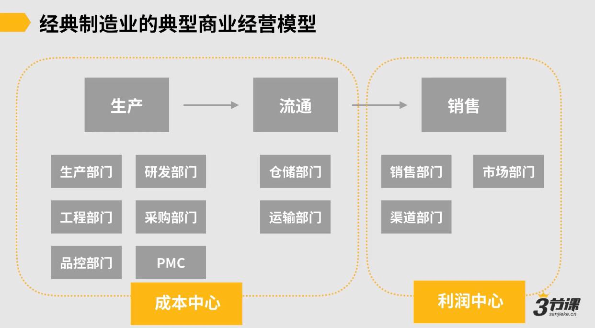

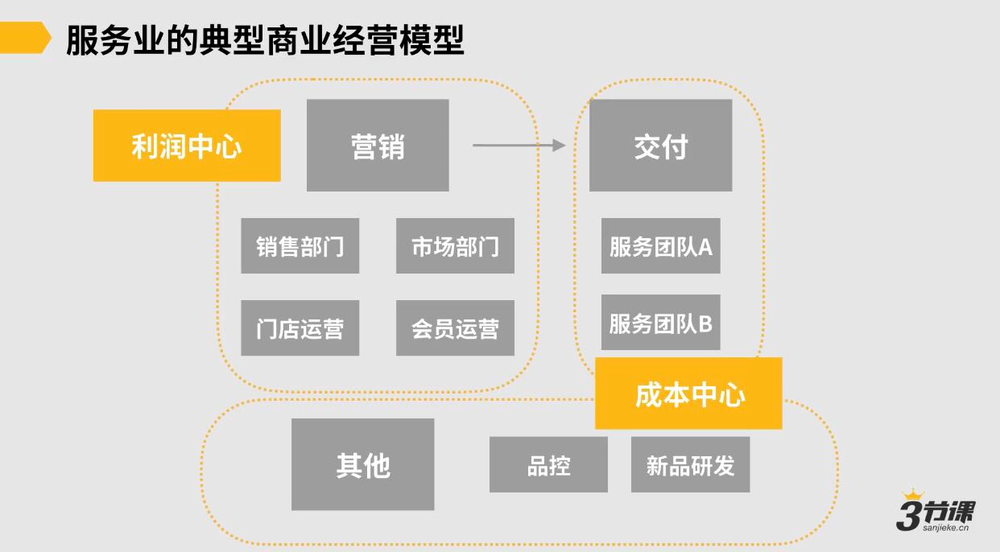

**互联网行业的商业经营模型**

一种是由业务驱动，产研为业务部门提供支持。

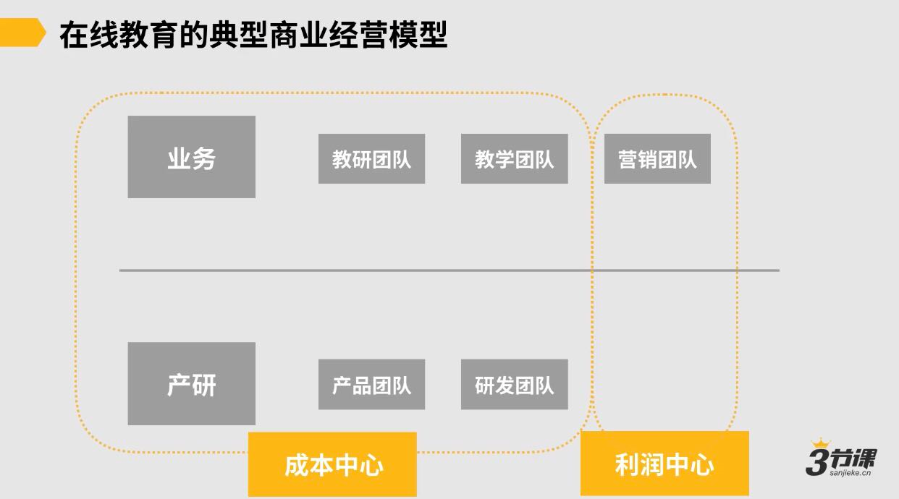

一种是由“体验+产品”驱动增长，产品即业务

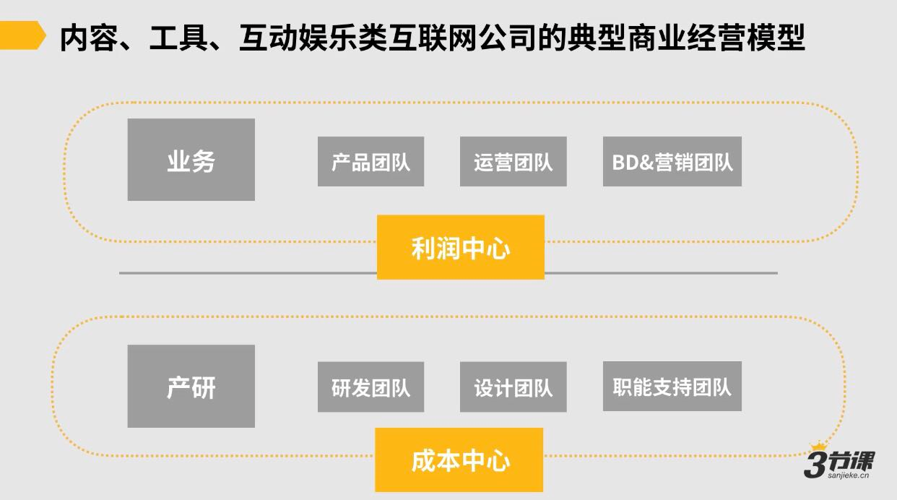

### 14 2.4.2 不同公司不同阶段如何评估工作价值 -早期公司和成熟公司新业务.mp4

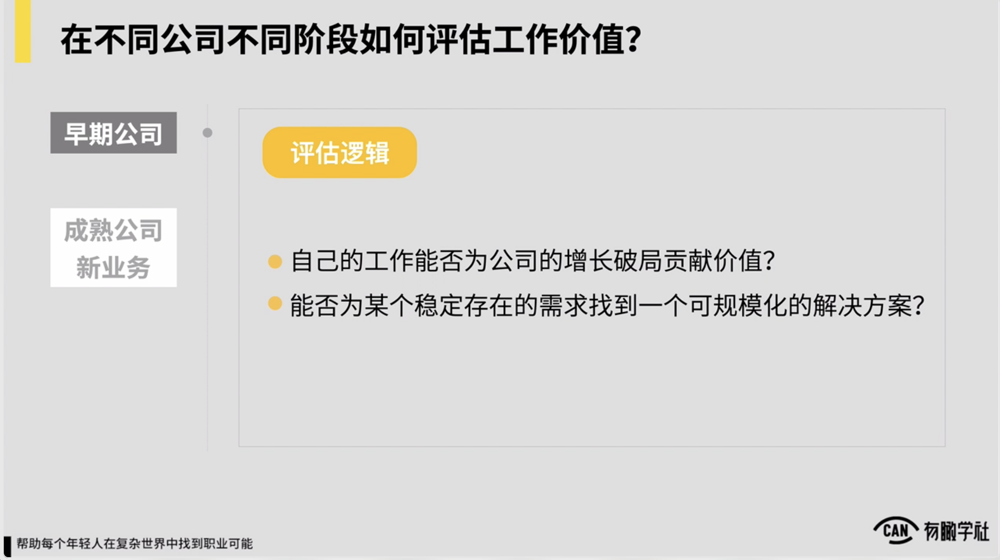

我们随后再细一步来，在不同公司不同的阶段，到底我们该怎么来去评估说我们自己的工作价值。，如果是在早期的这种公司，我们就分三类的状况，分三类状况来说。

第一类状况我们身处一家早期的公司，在一家早期公司里面，我觉得是说早期公司里面最重要的事情可能就这么两件，我们再把它再细化一点，第一个说如果我是一个个体

或者我是在一个部门里面，我觉得评估我们的工作有没有价值，我要拿出一个成果来告诉上级说我的工作是有价值的，这时候可能最好拿出来成果是怎样的，就两部分，要么是说我的工作为公司的增长破局贡献价值，这家公司之前它的增长对吧完全找不到方向，然后我做一件事情，然后让它增长能找到方向，早期公司里边这件事是有价值的，要么说我为一个稳定存在的需求，找到了一个可规模化的解决方案，不管规模化解决方案，它面向的是增长还是交付都ok，在早期公司里面这样的，早期公司里边要么是破局，要么说我做一些事情，让我的处理个业务对它可规模化增长了，或者让我的业务满足了可规模化增长的前提，这两件事儿都是很重要的。

然后所以如果你在一家早期公司里面工作，你交给你上级的成果，如果指向是这两部分，且你马上板上钉钉的能跟上级拿出一些这种数字，或者拿出一些实际的结果出来告诉上级，你看这就这么点东西，他能证明说我们的业务可规模化了，你上级一定会很开心，一定对你另眼相看。

甚至在早期公司里边有人如果可解决好这两个问题，他一定会得到这家公司上级的嘉奖或者是升迁的。

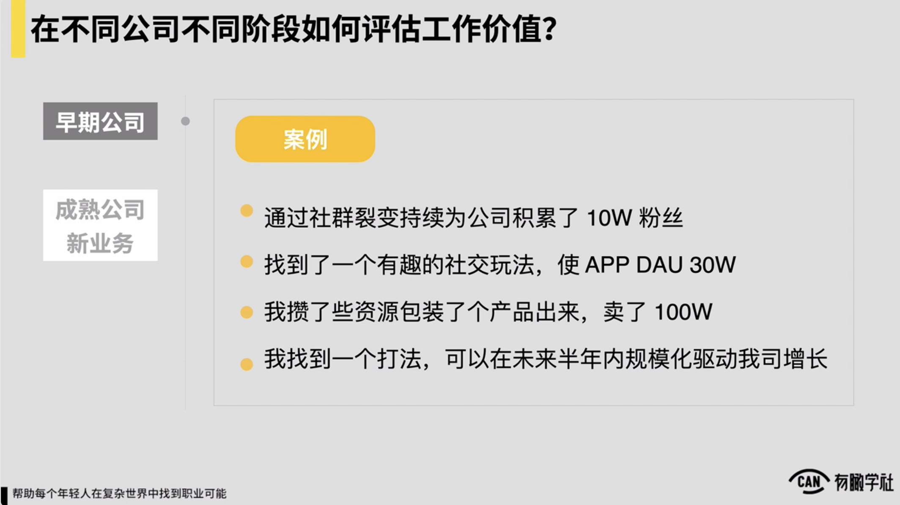

然后所以这在早期公司对随便举几个例子，例如举例子，在一家十分早期的公司里边，通过社群裂变为公司积累了十几万粉丝，找到了一个有趣的什么社交互动的玩法，让我的 APP之前的dau说可能就一两万甚至几千的样子，现在可能增长到了二三十万，又或者是说我传了一些资源包装出个产品出来，先甭管后边能不能持续

但是产品我先卖了100万了，我公司有收入了。，又或者是说我找到一个特定的打法，可以在未来半年内规模化的驱动，我司它的业务能实现增长对这几种认为我觉得对早期的这种公司而言都是十分重要的。，所以这对于说如果你身处一家早期公司，在阶段到底该怎么来去评估，向你的上级去证明说你的工作是有价值的。

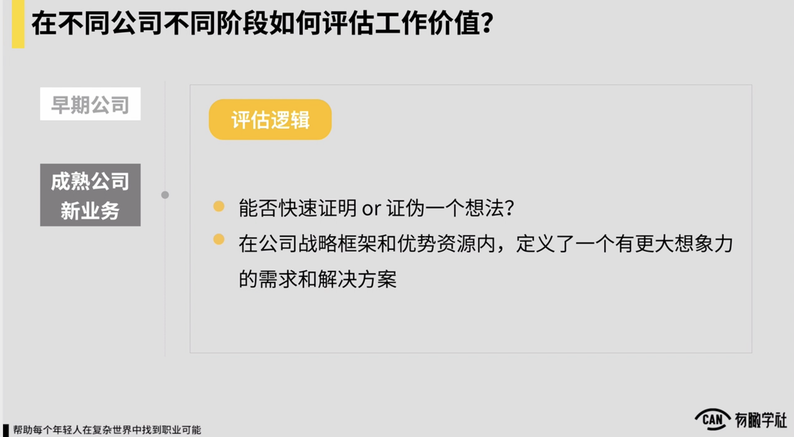

因此，随后进入到第二种情况，我们当中还有一部分同学说我身处一家成熟公司的新业务，然后随便举例子 yy假设头条要做金融，然后什么滴滴可能在之前某个阶段可能也曾经想做过卖二手车之类的，

这通常就属于是成熟公司里边的新业务，如果你是在一家成熟公司的新业务线上评估你工作有没有价值，我觉得是说通常就这么两方面。要么你就说我快速证明或者证伪了，我的一个这公司的高层提出的想法。

因为新业务肯定说是要等待被证明或者被证伪的，如果我能快速的做一系列工作，直接就告诉我上级说想法靠谱或者是不靠谱，板上钉钉的把这事盯死，说他yes或者no，事对高层而言我觉得一定是有价值的。

要么说我们在公司的这种战略框架或者公司的这种已有的优势的资源范围内，我们定义了一个有更大想象力的需求，或者是有更大想象力的这种解决方案，这一种对公司高层而言也是十分乐于看到的。

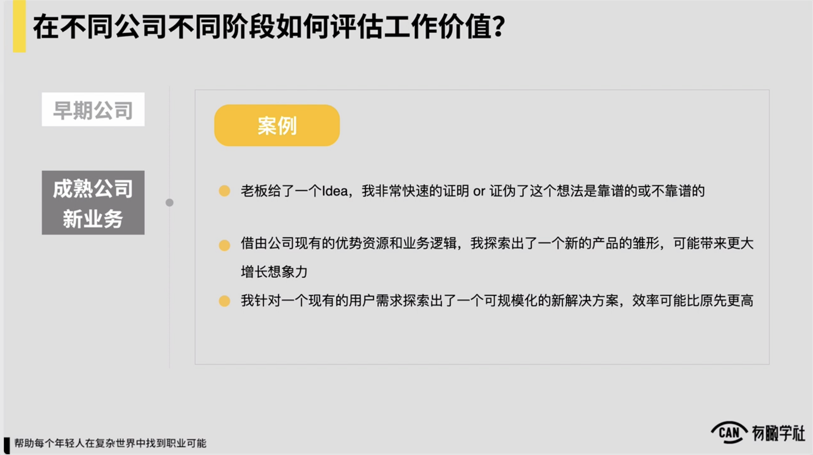

，也举几个例子，例如上级给了一个idea，我能十分快速的证明或证伪了，想法靠谱或不靠谱，对可能对成熟公司的新业务的上面的同学而言，是十分能让上级另眼相看的事情。

要么说我借由公司的优势资源或者嫁接在公司现有的这种业务逻辑上，探索出来了一个新的产品的雏形，带来更大的这种增长的想象力，对然后例如举例子，就像我们的，一个人可能在头条借由头条的什么增长的这种算法之类的对假设是他在什么面向什么下沉市场的大妈，面向群体里边，他又做出来一款什么游戏的或者是什么购物的什么兴趣推荐产品，事儿十分的make sense。

，所以这是第二种认为。

第三个可能说我针对一个现有的用户需求，探索出来一个可规模化的解决方案，效率可能比原先更高。像我们上一趴举到的说在一家较为成熟的留学咨询公司对然后我嫁接它现有的资源，它的所有的这种用户，还有跟高校的合作，反正这些事都还在

但只不过我在供给侧做了一些改变，让处理个我的业务的运转效率可能比原先更高，事也是很make sense的，但这几件事都是需要说要给答案给结论的事情，都一定要给到高层答案和结论。，所以如果你是在一个成熟公司，在一个大厂里边的这种新业务上，你的成果往这几方面靠，是上级较为乐于看到的。以上，这是两类不同的公司。

***

### 3. 一些常见的用于团队价值评估的指标

价值评估最终要落到指标上。

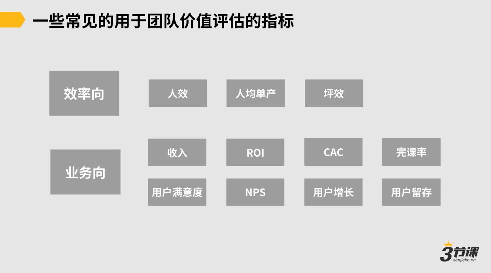

**提醒**

在业务导向的部门中，收入被放大或者交付被稳定可能也是由一个链条或模型来决定的。

我们需要先让链条成立，再让链条运转效率足够高。

比如，在一家教育公司里做体验课的项目，一定是先确保体验课能带来稳定的转化，然后再去想怎么提高人效比。

### 15 2.4.3 不同公司不同阶段如何评估工作价值-成熟公司成熟业务.mp4

随后还有第三类的这种情况。对第三类的情况说我在一家成熟公司的成熟的业务线下，举例子我可能在滴滴对但当前可能就在滴滴做快车，或者做专车的运营，或者说我在百度对做我的什么广告的收入，产品的商业产品的这样的运营。，或者我在腾讯的Q1就做腾讯的Q1会员的这样的这种运营

以上，如果你是在这样的成熟公司成熟业务线下会有什么不同，会有一个不同十分简单，成熟公司的成熟业务，只看一件事情，挣钱的能力或者我商业价值的增长。

然后这里边就有一个极简的这种经营公式，公式反正理解起来就完全没有什么理解成本对收入减成本等于利润再加公司那边，然后东西是简而言之的，但是把它往下落一层，如果是落到我们在这家公司里边到底处于什么样的部门，因为刚才我们讲的早期公司，或者是说是在成熟公司里面的新业务

然后反正我要探索一个这种新的一个产品，或者要让产品能规模化增长，可能它内部的这种例如部门和部门之间的这种什么边界隔阂障碍还没有那么明显的。

但如果你是在一家成熟公司成熟业务，它内部的什么部门的划分，这时候就已经十分稳定了。

所以我们需要把经营公式再进一步下沉到我们一家公司里边，它不同部门到底在他公司里边在扮演着什么样的角色，所以我们要进入到另外一个逻辑里面，财务的逻辑，我们分别在几个行业下，可能简单来查看，财务逻辑上一定是说我这家公司里边有一些部门它是带来收入的，有些部门它对我的经营而言硬的成本

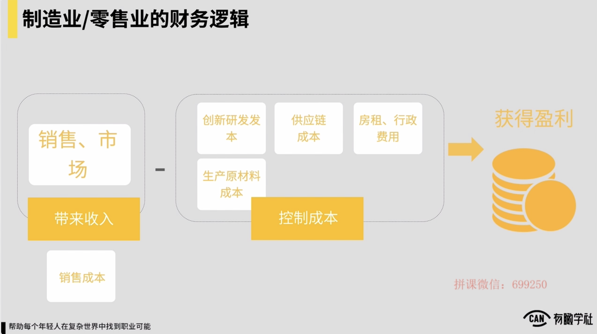

例如对于在制造业或零售业来，销售部市场部等等这样的部门它是带来收入的，当然销售部的工作也会产生销售的成本，对这是必然。

在后边的有一系列部门的这种工作上，例如我到这种研发的部门，然后生产的这种车间的这种部门，供应链的这种部门，还有我的什么行政的部门等等，在这些部门通常他对我来说产生的可能成本。

，所以从财务逻辑上来看，我们一方面肯定是说带来收入，另外一方面要控制成本，约就这么一个这种逻辑，所以这是财务逻辑上，同理在其他行业里边也都差不多。

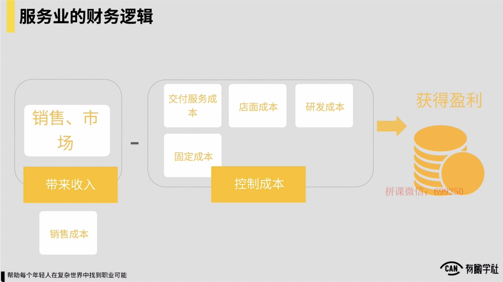

然后例如服务业，然后也是销售市场部是带来收入的，无非说它的业务的这种逻辑可能不太一样，所以在内部的部门的划分上对包括在这一类行业下，它主要的成本的来源可能也会有不一样，对例如对服务业而言，有说它的一些交付服务的这种成本，店面的这种成本成为说较为硬的这样的一种成本。

在服务业行业里边是较为通是常见的一些这种情况，所以这是在不同的行业下，反正如果是回到我们这种商业经营的逻辑下，一定都会最终反正会是说把我的收益和成本分摊到各部门上面去，然后最终我就来看这些部门之间的工作怎么能让我产生更大的商业收益就ok了。

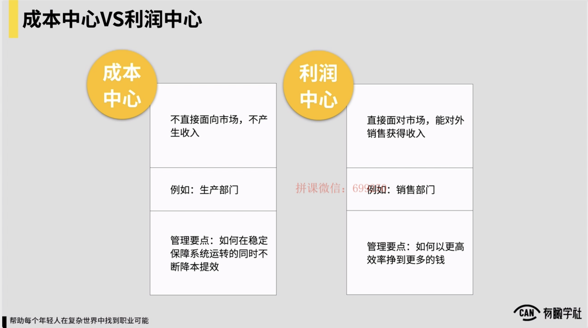

于是在这儿我们就又推演出来两个概念，这两个概念叫什么？叫成本中心和利润中心。

，简单说在一家公司里面，我们最简单理解，这本身是一个商学院的名词概念，我们不需要把它在什么定义上边就变得很科学很严谨，我们就十分简单来理解它，简单说在一家公司里面，我们最简单的理解通常说有些部门或有些团队它不是直接面向市场，不直接带来收入的这样的部门，在一家公司里面我会把它叫做是成本中心，在管理层面上，我们对成本中心的管理的要点，基本说在稳定保障我们处理个的这种业务链条运转的同时，要不断降本提效，这是对于成本中心在管理上的核心的要点。

另外一类的部门就叫做利润中心，对利润中心基本那些直接面对市场，能通过他的工作，能持续给我们这家公司带来收入带来增长的这样的部门，比如像销售部门对对这类部门它管理的要点通常也简而言之，如何以更高的效率挣到更多的钱或者提升更多的商业价值。例如有些公司可能我暂时不看钱，看流量就怎么以更高效率能进行到更多的流量，对也是有可能的，这是引出来的两个概念。

以上，引出这两个概念之后，我们随后把这两个概念再进一步再落到看三类最常见的这种行业，我们简单抽象一下，三类最常见的行业里边，它的商业经营模型是怎样的？

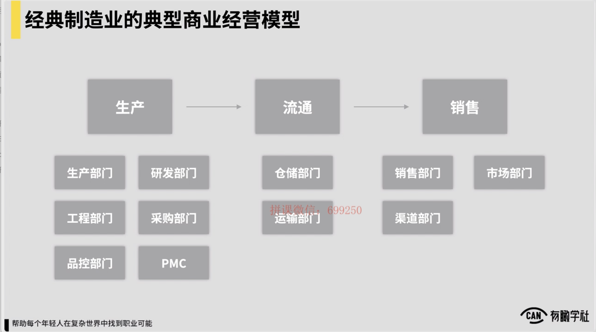

我们先看第一类行业叫做制造业的这种商业经营模型，当然我们就选择了一个十分简单的模型，就像我们说的事如果要展开，它会是一个十分庞大而且复杂的这种体系，所以我们就抽象一点，然后抽象出来一个极简单的这样的一种版本。

简单说在制造业里边，它的处理个的业务的这种流程和业务的逻辑基本说我肯定先生产，然后再有这种相应的流通，流通完了之后，最后可能在例如这种店面里边或者在终端或者渠道部分会完成销售

这是一类制造业的定经典的这种商业的逻辑，当然也有可能有一些制造业，例如大宗商品的这种制造业，它有先生产再销售再流通对然后从说我厂房就直接发到直接去到这个客户那个地方了，也有可能的，对不重要，只要各位理解基本逻辑就行了。

在生产的部分下，我们有这么多部门，生产部门、工程部门、品控部门、采购部门对然后什么pmc的部门等等。流通的部分有仓储部门，有运输和配送的部门，销售部分有什么渠道部、市场部等等。

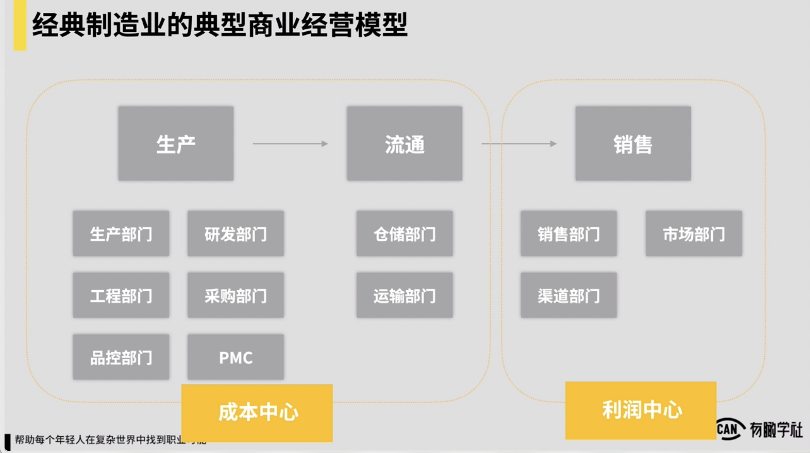

，如果在语境下，在经典制造业的这种商业经营模型下，你会发现我们的生产和流通环节下，这几个部门因此，它可能都是属于我们行业或者这一类公司里边的成本中心，而销售的环节下的这些部门，它通常是属于我们的利润中心，所以对左边的这些团队，他管理的要点稳定我的业务运转的链条，同时我要不断降本提效，

如果我是一家成熟公司，约管理要点这样的。

对考核他们的方式你看我链条供给要稳定，中间反正有品控，有例如我配送速度的这样一种保障之类的，这些东西我都要保障。在层面下你效率能不能给我提升？能提升对事就值得嘉奖，不能提升，甚至效率下降了，对不起问责约是这样的。利润中心就较为简单了，反正挣钱对这对于说制造业它约是这么一个逻辑。

然后我们再来看服务业的可能一类同样抽象的我觉得也简而言之，服务业的这种典型的商业经营模型，它通常是一个说营销获客到交付对交付完成之后，当然有可能后边用户会有部分，我们就没有在模型上去给它展现出来了。

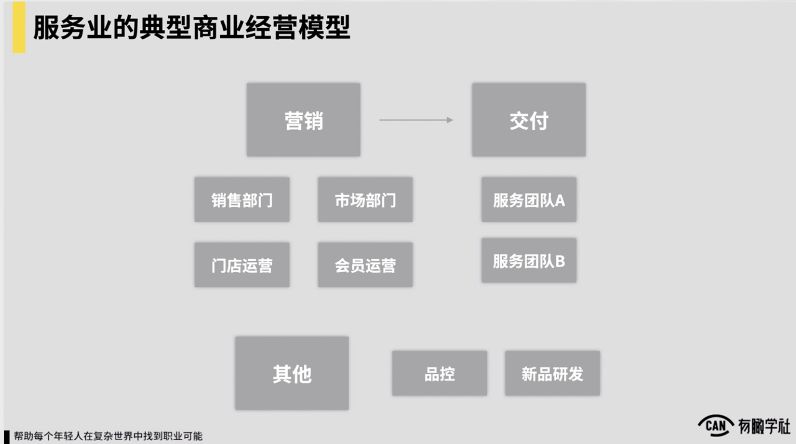

最简单来看，反正服务业的逻辑基本说我们有营销获客有交付的部分，交付，因为我们给用户提供的服务不一样，

所以有说a有b类型的服务，有c类型的服务，所以我们内部的这种团队划分，当然还有一些其他职能，例如有像品控的这种职能，或者有像新的这种产品研发的职能，甚至可能还会有一些像it技术的等等这样的这种职能都有存在。

，这里边可能说像我们的服务团队也会按照我们的这种产品线就分成说 ab这几个这种服务团队，营销部门里头有像门店运营，然后是会员运营的这种部门，然后直接线下销售转化的这种部门等等，还有像专门获取这种线索获客的这种市场部门等等。

，然后所以有构成这样的一个这种商业经营模型和分工。

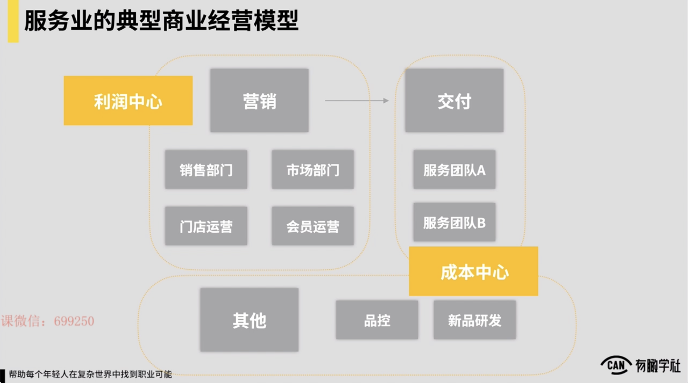

，在分工下，你也会发现对于服务行业的它的像交付团队，还有像其他的一些像什么我们提到的 It研发部门等等这样的这种团队而言，它通常这家公司里边基本可能一个成本中心，然后营销的这部分的种植基本一个利润中心，所以也是在成本中心里边，我们的核心的这种工作还是就像我们刚才讲的保障链条运转降本提效，约这么一个逻辑，对服务业来，那么随后我们刚才看的都是说这种偏有点产业性质的这样的行业制造业或服务业，对很多人可能都是互联网行业出身的，都是典型的互联网人，各位也会觉得说似乎你讲的反正这两个行业的这种经营模型跟互联网都不太一样，所以互联网行业它的商业经营模型到底是怎样的，确实会有一点点不太一样。

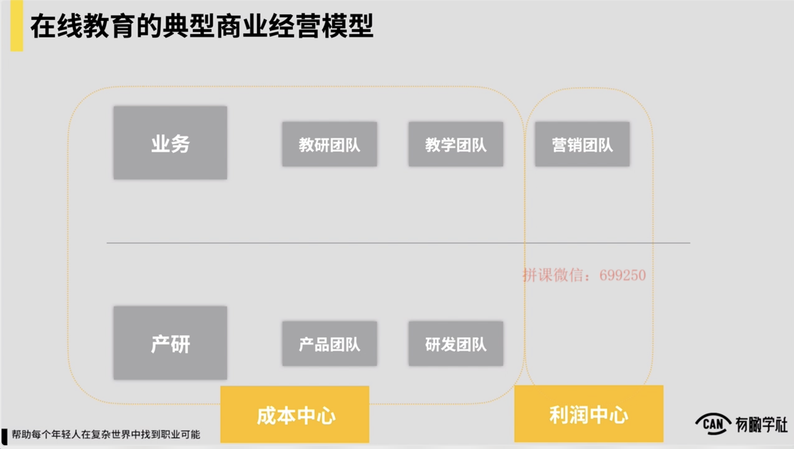

我们也十分简单来查看，首先先以在线教育，我们以两类不同的互联网公司来查看，说典型的互联网公司的经营模型长什么样？有两类不同的公司，首先先以在线教育为例，在线教育是一个典型的重业务的这样的一个这种产业，在这一类公司里边你会发现我们的处理个的这种内部的团队这种划分，被分为是说业务团队和处理个的这种产研团队和处理个产研团队。

，当然还有一些职能团队我们就没有放在里边，然后约会是这样一种区分。

它的基本逻辑在这一类公司里边基本是说我业务团队核心去解决说我的例如产品的增长和产品的稳定交付的问题，是这样一个逻辑，例如从处理个的我的例如产品的生产是由教研来解决的，产品的售卖和增长是由营销来解决的，然后产品的服务和交付是由教学团队来解决的，

这些都是在业务链条上的，到底产研团队在扮演着什么样的角色

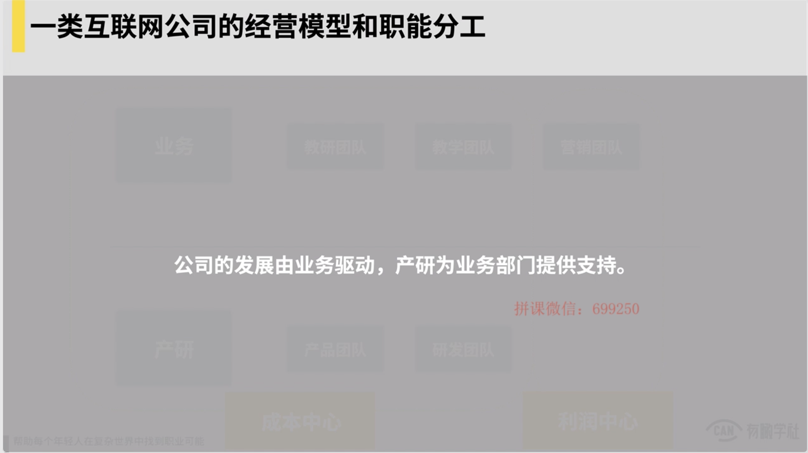

在这一类公司里边，在这种重业务强业务驱动的这样的这种公司和团队里边，产研团队在较长时间里边核心扮演的是说我要去提升，也是提升我前端业务运转的效率，以及为前端的业务运转，因为它是在线的对我要为前端的业务运转提供必备的一些工具和系统的支撑。例如以三节课为例，对产研团队他要完成的，例如三节课在线的学习系统，能实现良好的交付当中的一个必备的前提条件。如果东西它都不稳定，它都没办法使用，我们的交付是无法稳定达成的。

同理，例如产业团队里边也必须要去做很多偏这种说业务后台业务中台的这样的这种工具，来帮助我们这种教学的同学和教研的同学去提升他们的工作效率。所以就在线教育这种重业务链条的这种公司里边，它的这种不同部门之间的关系是这样的。

，如果按照关系，你会发现如果按照成本中心利润中心的这样一种逻辑来去看，本质上在例如当业务前提是业务是稳定的，可能我们的教研教学、产品研发这些团队，他有可能在这家公司的经营模型经营逻辑里边都被看作是成本中心，也说考核去管理这些团队的这样的一种目标，说先要让他把交付要稳定，在交付稳定的同时，我们通常就要去看它的运转效率怎么能提升，而营销团队通常可能在完全以它的增长和利润为逻辑来考核的。

所以存在一类互联网公司的经营逻辑和职能分工。这一类互联网公司里边，它典型说公司的发展是由业务驱动的，产研是为业务部门来提供支持的，然后这是一类典型的互联网公司，产研为业务部门提供必要的工具和系统，以及通过一些这种效率工具来去不断的放大我业务部门的工作效率，约是这样的一个逻辑，所以这两者之间在这类公司里边它的配合关系是这样的。

然后我们再来看另外一类公司，对假设我们回归到假设是说是类似像内容社区等这一类，它是偏向于内容工具互动娱乐这样导向的这样的公司，这些公司它的商业经营模型可能又是怎样的？

，你会发现在这类公司里边，可能它又会稍微有一点点不太一样了，它是这样的，我们直接来看图，它是这样的一个这种认为。

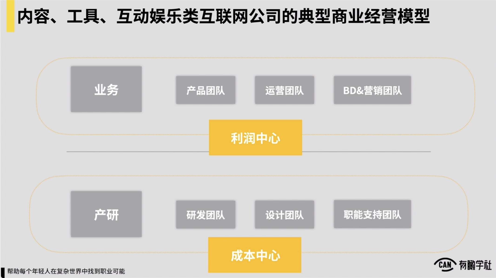

因为在这类公司里边，例如它是重工具或者是重这种内容的这样的服务，这些服务你发现是说用户在线上

他完全是说自主决策、自主消费、自主体验，中间不需要有重服务来介入，中间完全不需要有重服务来介入，因为它不需要有重服务来介入，你会发现很多时候它通常说产品及业务，所以它这类公司它的业务的增长很多时候是可以由产品体验本身来去驱动的，也说我产品体验只要做到极致，例如一个游戏只要好玩

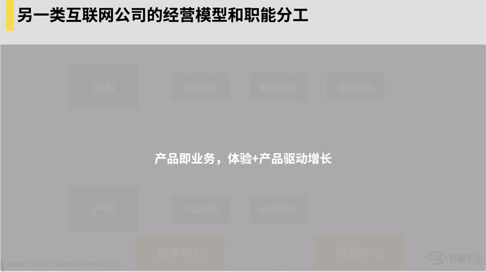

只要足够好玩，然后它增长就蹭蹭的往上涨。然后一个工具，例如什么就像什么墨迹天气这样的工具，它做得足够因此，也是它的增长就蹭蹭就往上涨。

，所以在这类公司里边，本质上产品经理他算是一个业务人员，他要为业务指标去负责的，当然他是跟运营一起来配合了，包括我们的BD营销团队之类的，也是这样的一种认为，而下边才是我们的研发团队、设计团队、职能支持团队之类的。

，所以这类公司里边它的逻辑会有一点点不太一样。所以我们就发现有两类互联网公司，另外一类互联网公司它的基本逻辑说产品及业务产品就不再是一个说这种支持辅助性的部门了，它的很多时候是说这类公司里边是体验和我的产品好不因此，能驱动我这家公司的增长的。，所以这是另一类互联网公司的这种经营模型和职能分工。

***

### 4. 两种自我价值评估方式

第一类：经验和手感

第二类：模型和数据

&#x20;

### 16 2.4.4 如何评估自己的工作价值.mp4

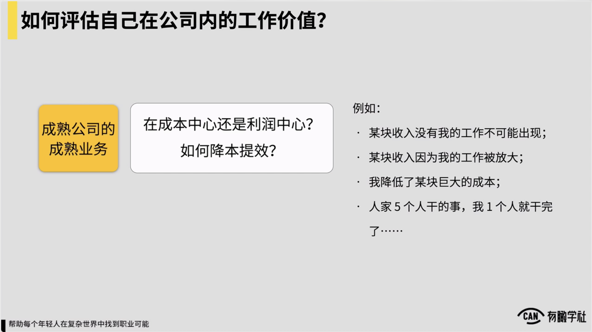

所以所有这些东西都讲完了，我们前边把几类不同的公司给各位分了一下类，分完类之后，我们再回过头来看，在成熟的公司的成熟业务里面，我们核心该怎么评估自己在公司内的价值简而言之，基本说我们首先要判断自己在这家公司里边，我们到底是在成本中心还是在利润中心来去做我们的工作。如果我是在成本中心，那保证稳定交付的时候，同时怎么可降本提效。如果我是在利润中心，通常怎么去不断的放大我的收入的增长，

所以在这类公司里面，然后我怎么去证明我的工作价值，例如如果你能做到说某一部分收入没有我的工作，我为他提供了一个必要的支持，或者我做了一件重要的事情，就驱动了它的上涨，没有我的工作不可能出现很好的或是说某块收入，因为我的工作被放大了，也很好的，或者是说我降低了某一块巨大的成本，或者是说人家5人干的事儿，我1人干就干完了，这些都很好的。

这些都是你在成熟公司的成熟业务里边去向上级证明你做的工作是足够有价值的，十分好的方式。

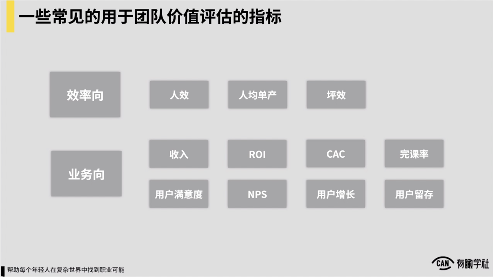

以上，上边几部分都讲完了，随后我们简单再给各位去普及一下一些常见的用于团队内，不管是对个人还是对一个部门去做价值评估的一些指标。

这些指标也分为两种，一类是业务上的指标，还有一类效率上的指标。，然后通常分这么两类指标，业务上的指标常见的有这些，你会发现这些指标也是一样，它要么指向的是我们的这种收入增长，或者商业价值增长，要么指向的是我们的交付要稳定对所以你会发现常见业务项指标会有些收入roicac完课率、用户满意度、nps用户增长、用户留存率等等，这些都是我们常见业务上的这种核心指标，这是一类指标。

还有一类是我们效率项的这种价值评估的指标，效率项价值指标，例如像我们的人效比人均单产，我们的线下门店经营的平效等等，这些都属于是效率上的这样的一种指标。仅说人效，反正人效事儿在不同的部门里边它就有十分多的这种评估方式。

举例子，我们像评估说我们像公司里边类似于像hr团队的工作，是可以通过人效来去评估的。，例如在a公司里面，说 A公司处理个业务的这种部门，然后可能例如有个200人，当然a公司为了支持这200人对他营销团队有10员工，但BB公司说干的事儿跟a公司在什么招聘薪酬，然后内部的文化组织这方面也都差不多，但b公司有150人，但b公司只有三个hr。

，那两者一相比，你会发现说如果他们做事都差不多，显著是b公司啥更值得被嘉奖，更值得被肯定，所以这是两类常见的不同的这种指标，人均单产事也是一样的。

然后不管你是评估说像销售团队看人均单产，像一些生产团队也会看人均单产，就一个人在单位时间里边他贡献的产出是怎样的。

，然后一个人在一个月里边，例如他是生产了100商品，还生产了80商品，还是说一个人在一一个月里边，例如他是同样做销售的工作，对他带来100万收入，还是20万收入，还是多少万收入

甚至可能在某些行业里边，像人均单产人效这样的这种指标都能找到行业里边通式的参照，例如举例子，对于像什么咨询公司这样的这种业务来讲，通常它内部的这种人效说一个人一年可能平均能创造，例如约是150\~200万的这样的这种产值，这样的这种咨询公司是较为有前途的，在行里边你经常都能找到类似这样的这种参照。

，所以这是给各位在这儿介绍的，评估一个团队的价值，最终会落到指标上。指标有两类导向，业务上和效率上的到底用什么指标来衡量，你取决于说你当前所在这家公司它在什么阶段，以及你所在的部门对这家公司里边到底是一个成本中心的这样的一个这种属性，还是说它是一个利润中心的属性？

，本质上就这么一个逻辑，所以这一趴处理个讲完之后，我希望会对很多的这种同学来，会能起到一些这种反思或者是触动的这样的一种作用，能让各位更清晰就知道说如果我要跟我的上级去对话，也许怎么向他去证明说我做的工作是有价值的，那事变得更加清晰。

然后所以到这为止，我觉得第二节的这种主题主体的部分约也讲的差不多，在这儿可能也有一个小小的提醒，那是什么？在业务导向的部门里边，收入被放大或者交付被稳定，可能也是由一个链条或者模型来决定的。

我举例子，例如假设你在一家教育公司，这家教育公司需要也通过一个比如体验课的这样的一个方式对去实现我用户的转化，你会发现怎么让用户来上体验课里边我怎么服务，然后服务完了怎么去做我的销售和转化的动作。

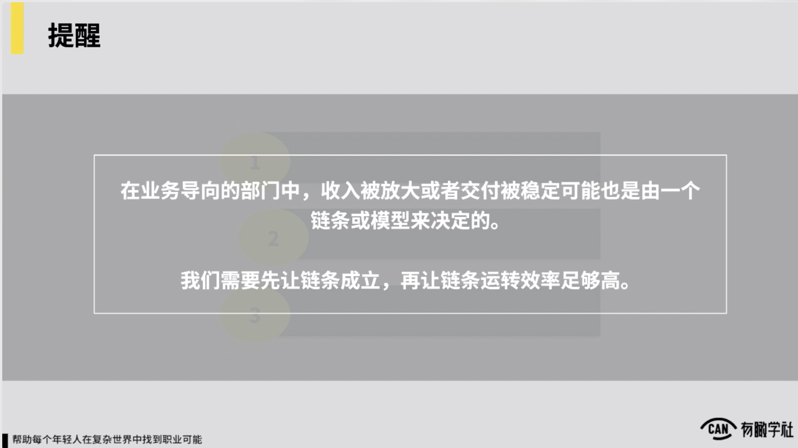

这里边你发现也有一个小的链条，也有一个小的模型，所以如果你在一个业务部门里边，在一个业务导向的部门里边对你发现说我做这件事反正也有一个小的模型，还是一样的逻辑，它只不过成嵌套的逻辑，我们还是需要说先让链条能成立，它能带来说较为稳定的转化，然后再考虑让链条的运转效率足够高。

所以举例子说你在一家交易公司里边去做一个体验课的这样的一种项目，对你要回答的问题一定应该是说我先让体验课能带来稳定的转化，然后再去不断放大体验课运转的效率。

例如去看他的什么销售的人均单产，去看说我每个销售在同一时间段能服务的这种用户的数量之类的，应该是这么一个逻辑，所以这是一个小小的这种提醒，这一节我觉得到这儿基本就讲的差不多了，但是也会出现说还有部分的同学他可能也会有疑问，会有什么疑问？

举例子，假设我是一个说做品牌或做策划的这么一个工作者，对在品牌和策划领域或行当里边，很多时候是说我们的创意，我们的策划要做足够因此，然后就能打开足够大的这种势能，或者说我认为我可能在某些事上有个手感的，例如举例子，假设是我一直在一个渠道去发一类文章，或者一直在一个渠道去做一类的这种活动，我连着做半年这事儿凭借我的手感和直觉，然后这件事一定能给我带来回报，

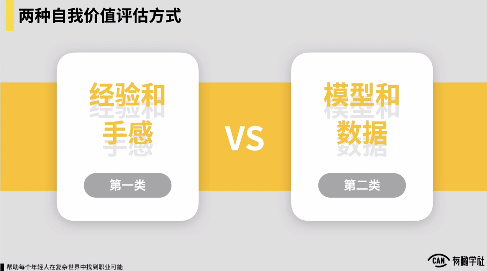

但这件事如果按照我刚才讲的逻辑，似乎很难去评估，所以在这儿也要在最后给各位补充一个小的认知，我自己认为在处理个商业环境里边去做自我价值的评估，如果是向上去做自我价值评估，一定是有两类方式的，第一类就凭借我的经验和手感，举例子就像我说就黄永灿对然后曾经可能写过很多的内容，这些内容可能约在个地方怎么发，然后能带来多大流量，我有手感的。

，所以我告诉你说对然后我的工作价值你啥也别管我，让我吭哧吭哧干个半年，然后这半年时间我可能啥成果都没有，但半年后我也许在某个地方我就给你带来大几百万的流量了，是这样的。，然后事儿别人听起来玄学，对但是对于一些顶尖的高手而言，他可能确实会有这样的这种经验或者手感。，所以这是一类自我价值评估方式。

第二类我们说的按照数据和模型，然后不排除确实会有人说我在某件事上有极强的经验和手感，如果你是这样的人，然后你在某方面确实有说这种强烈的天赋或者强烈的这样的这种独特的认为，我觉得你可以走第一种的，可以走第一种逻辑的，但前提是上级信你，要么你过去有牛逼的成就

要么反正你说服力很强大，让上级信任你都ok。，但是对于绝大多数人而言，我觉得是说一定是绝大多数人是更适用于我们讲的这种逻辑，按照模型和数据来跟上级对去证明说我的工作到底有什么价值，然后所以绝大多数人我还是十分建议说往我们讲的逻辑来靠。

***

&#x20;
