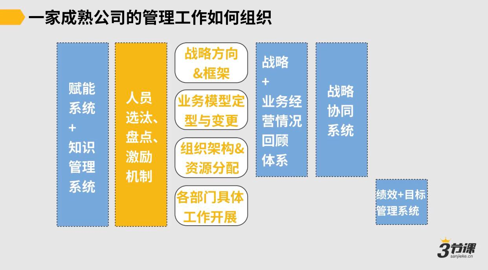
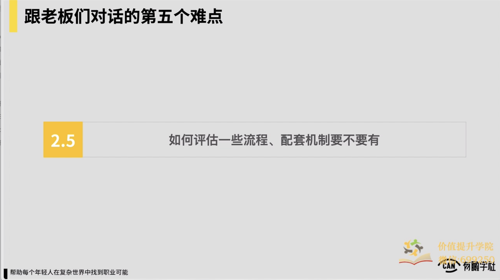
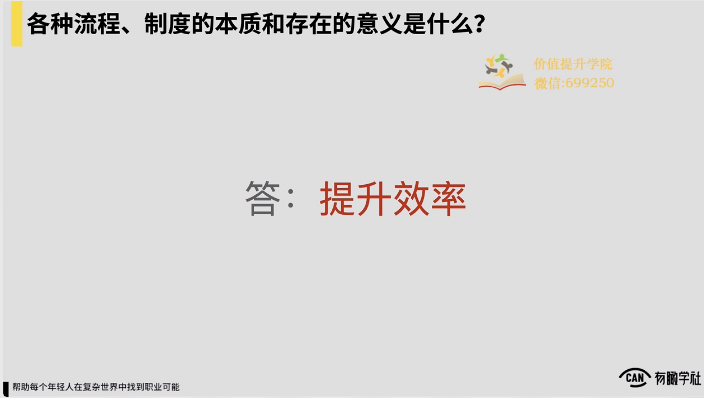
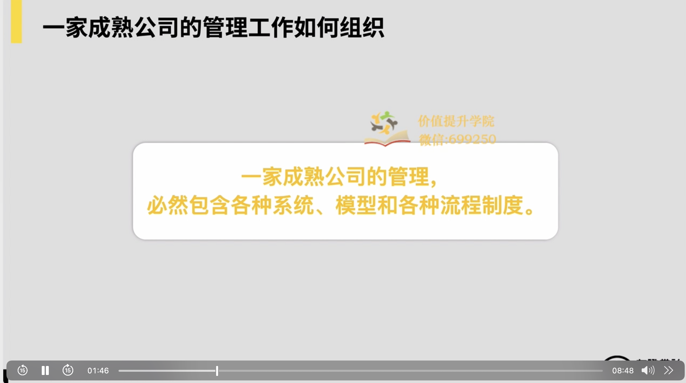
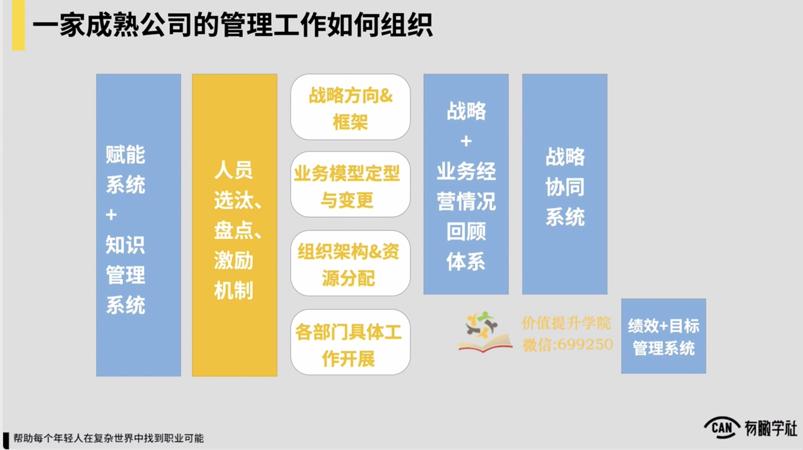
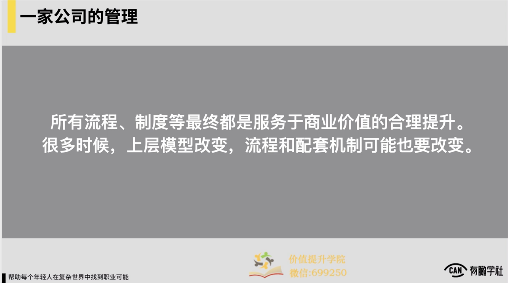
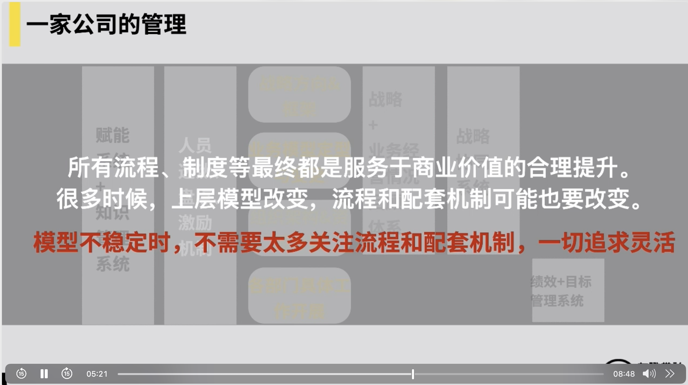
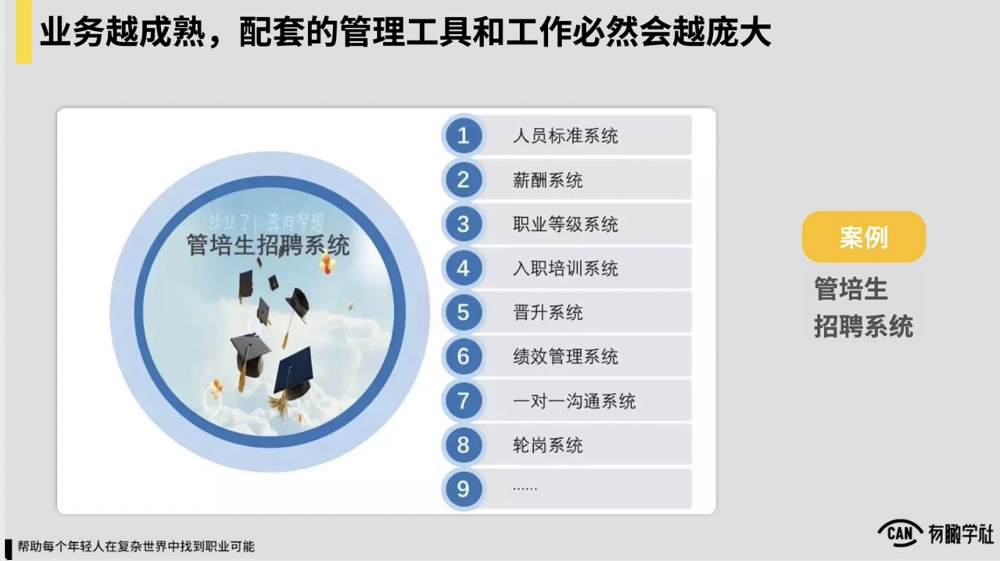
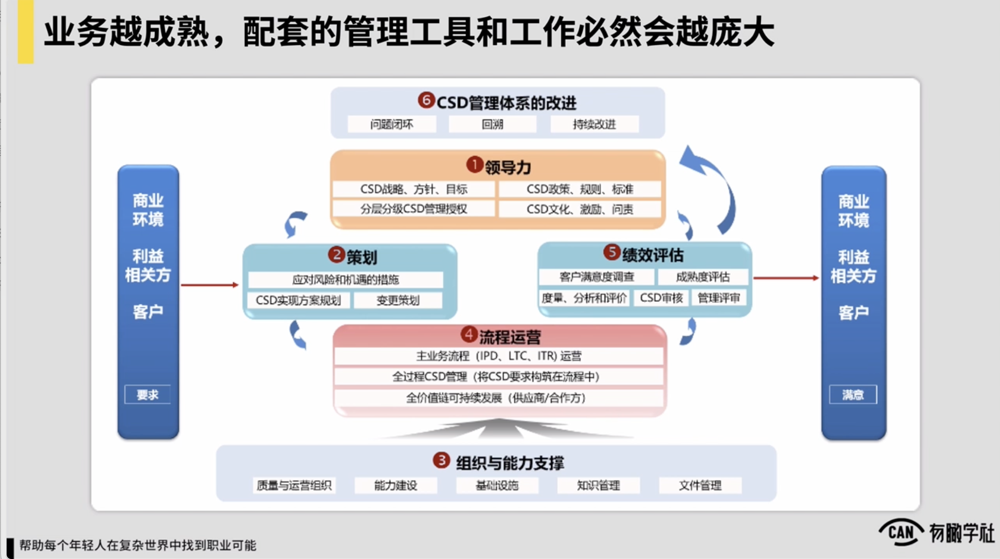
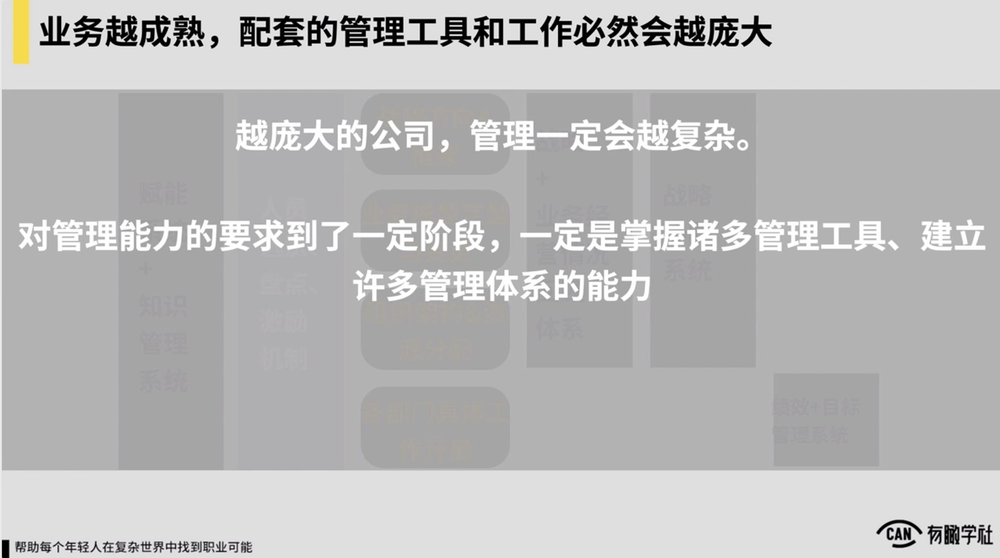

# 难点5：如何评估一些流程、配套机制要不要有？

流程、制度的本质和存在的意义是：提升效率。

一家公司的商业逻辑或业务模型相对定型的基础上，它可能存在的管理机制是👇

所有流程、制度等最终都是服务于商业价值的合理提升。

对于中早期项目，模型不稳定时，不需要太多关注流程和配套机制，一切追求灵活。管理服务于业务，一切职能部门和支持部门都要为业务服务！

对于成熟公司，一些管理机制有可能构成基础支撑，因而不可动摇。业务越成熟，配套的管理工具和工作必然会越庞大。

上层模型改变，流程和配套机制可能也要改变。

### 17 2.5 如何评估某些流程、机制要不要有.mp4

以上，随后我们再进入到第三个问题，如何评估一些流程配套机制，要不要有问题我们会快快的收掉，然后因为在很多同学，例如身在大公司工作的同学经常都会有这样的问题，说在公司的管理或在一些这种日常的对话等等这些层面上

就认为说老师有一些这种较为累赘的流程，或者说公司的管理机制让我觉得很痛苦，然后这些东西反正跟上级聊，或者说跟在内部跟其他人聊，又很难去把它去摘清楚，所以这时候反正在流程制度面前我就很难受了，包括一家公司，如果我来去管理一个团队，什么时候有些配套机制可能我也拿不准，尤其对于说我们很多同学自己过去都没有带过团队来，所以部分我们需要做的简单让各位去理解一下各种流程制度它的一些本质，它存在的意义，包括我们在一个商业组织里边到底该怎么去看待它，我就简单让各位理解一下就ok了。

，所以这儿我觉得是说我们先抛第一个问题，各种流程制度再加公司里边，它存在的意义和本质到底是什么？答案十分简单，就4字，提升效率。对很多时候流程和制度给一家公司的管理带来的效率。因为有了流程，我们不需要说每一次做一件事儿，我们都要找人去问，对我们就按流程来就ok了。，所以流程制度它存在的意义，再加公司再加商业组织里边，它存在意义一定是提升效率。

以及如果按角度来看，一家成熟的公司的管理必然包含了各种系统模型和各种流程制度。因为简而言之，就像我们说的一家公司的经营到最后看模型，当这家公司已经可被一些模型去抽象出来，被一些模型去驱动和管理以上，这时候我觉得是说我们一定要配套上一些流程，上一些制度，

让这家公司的运转它变得说更加的高效，更加的精细，例如随便举例子，假设我在一家成熟的公司里边，这家公司常规的工作逻辑就像我们图上简单抽象一下，它通常是说分成说战略方向和框架的确定，业务模型的定型和变更，组织架构和资源的分配，再往下落到说各部门具体工作的开展。

你发现如果我们这家公司它的业务模型已经相对稳定了，在围绕着这样的一个工作的机制，我首先这已经是一个工作的机制了，从上到下怎么决策，怎么去调配组织里边的资源，这已经是一个最小的工作机制了，围绕工作机制，我们有可能还要上一系列的配套的这种管理工具。

例如我们可能在内部会需要有一些赋能的系统或叫知识管理的系统，帮助我们把每一个部门他的一些常规的工作的这种方法，工作的手册，他过去项目经验全都沉淀下来，让后边来的所有的新同学做到说有据可查，然后我们也需要有战略和业务经营情况的这种回顾的这样的一个这种管理机制，

帮助做到说我们的业务经营状况，按周或者按月是可以不断被回溯和显示的，我们的战略到底有效不有效，也许至少是可以做到说按月或者按季度可去回顾的。然后我们的组织架构和资源分配完了之后，我们在内部也需要有一些说这种战略协同系统来保证各个部门之间它的目标

是可很好地形成说结合和互补的，而不是说ABC三个部门他们的目标完全在打架，然后最终就导致说反正内部的内耗会十分的严重，我们也需要有一些这样的这种系统，这样的一些这种管理机制或者工具以及落实到各部门的层面，我们必须要在各部门层面有我们的绩效或者目标管理的这样一系列配套的这种管理的机制和工具在上边。

蓝色的部分是所有我们在一家公司里边对事儿的管理的一些配套的这种机制或配套的一些工具，除了对事儿的管理，一定还需要有对人的管理，对例如我们的内部的人员选拔淘汰的这种机制，定期的这种人员盘点和轮岗的这样的一种机制，还有对我们内部的这种员工的激励晋升的这样的这种机制，这些部分也都必须要有。

但所有这些东西它都是建立在说我们的这家公司，它的商业逻辑和业务模型相对是定型的基础上，只有说你的基本的业务逻辑模型定型了，我附加这么多的管理的这种资源和工具在上面，才能提升这家公司运转的效率。但凡说你这家公司很多连基本业务层面都还没定型，它不太需要有这么多的这种管理系统和管理机制在上面的。

，所以那对一家公司的管理来，我们简单可能总结提炼一下，所有的流程制度等等，它最终一定都是服务于商业价值的合理提升的，以及很多时候我们上层的模型改变了，又有些流程和配套机制可能也会需要改变。

相反如果是说我们的上层模型都还没那么稳定，我们可能在一家公司就不太需要关注太多的流程和配套机制，一切追求灵活，一切为业务来去让路。

简单再提炼梳理一下，在中早期项目里边，我们认为管理和业务的关系通常是说管理服务于业务，一切职能部门支持部门，或者像我们配套什么流程工具之类的，都要为业务服务，怎么对业务更灵活，怎么对业务更因此，在中早期业务还没定型的时候，我们就怎么来就以上。

而如果在成熟公司里边，它通常变成另外一种状态，因为成熟公司它一定有核心的这种业务了，所以有些管理机制很可能已经就形成一些基础支撑了，所以在它的内部有些管理机制是不可动摇的。

我举例子，例如在腾讯这样的公司里边，它的员工晋升晋级的这样一种机制，它可能就已经形成了它内部不可动摇的一个基本管理机制，所以各位一定要理解这件事儿。理解了这件事儿之后，你才会更好理解说我在不同的公司里边面临这么多的这种管理的机制，管理的这样的条条框框，对我该怎么看待它？到底些东西的存在是不合理的，些东西的存在可能一定有它的合理性，可更客观的去看待它，以及我们要深刻的理解在一家公司里边业务越成熟，业务做得越大，我们配套的管理工具和工作必然会更加的庞大。

举例子这是某大厂的一个管培生的招聘系统对你发现在管培生的招聘上面，它背后就有一系列这种复杂的管理机制和管理的逻辑再去支持它。因为这是一个说世界500强公司一家房地产公司的它的内部的这样的一个管培生的这种招聘的机制。所以我们一定要深刻理解业务越成熟，公司越大，配套管理工具和工作必然会越加庞大。

包括再来看这张图看起来更可怕，对这是家公司，这是华为华为内部的，它可能处理个围绕着它的这种组织能力的提升，然后可能从绩效评估到流程运营到领导力提升，再到常规的一些组织和能力支撑，他就制定了一系列的这样一种配套的管理机制和工具。

，然后各位也要理解，反正从管理角度来看，我们的很多的东西，例如我们的会议，我们的什么绩效评估的这样的体系之类的，它都可以被我们视作是一个管理的工具。

如果你最终变成是一个一家公司的十分资深的管理者，你一定是说我应用和理解这些工具的能力要是十分深刻的。

，所以越庞大的公司，我觉得管理一定会越复杂，以及对管理能力的要求到了一定阶段，例如你往上成为一个更资深或者说更大型的这种公司的管理者了，到阶段你一定是要掌握的，工具管理工具会更多，甚至你自己也要有能力去在一家公司里面要建立起来很多的管理的体系，这才是说我们往上例如要成为更复杂更精深的这种操盘手，会对我们会有要求。但在起初的阶段，对我们很多同学也在当下阶段，很可能我们只需要理解流程和规则的意义，可初步应用好一些管理工具就足够了，所以这是在我们很多人当下阶段，对自己应该有的合理的预期。

