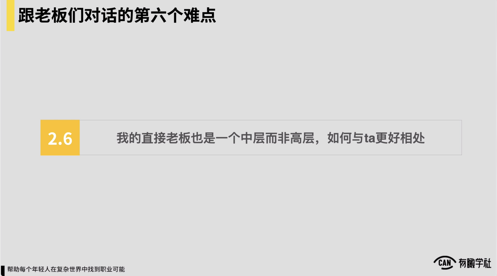
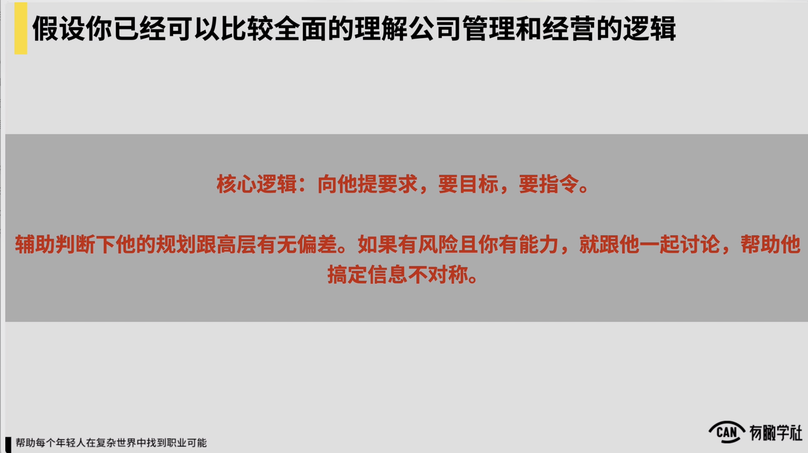
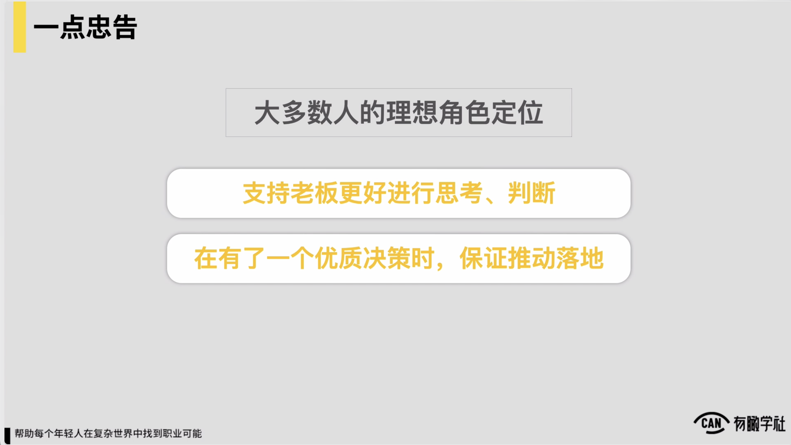
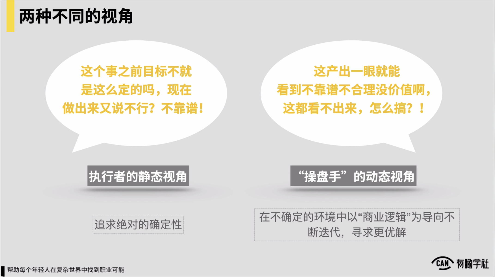
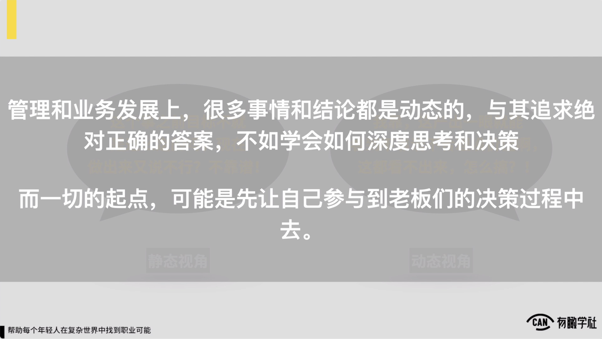

# 难点6：我的直接上级是中层而非高层，如何与ta更好共处？

核心逻辑：向他提要求，要目标，要指令，并给出答案。

### 1.支持上级更好的进行思考、判断

### 2.在有了一个优质决策时，保证推动落地

操盘手的动态视角：在不确定的环境中以“商业逻辑”为导向不断迭代，寻求更优解，不追求绝对的正确性。

一切的起点，是先让自己参与到上级们的决策过程中去。

### 18 2.6 直接上级也是中层，该如何相处.mp4

随后是第六个问题，第六个问题就会更加的快了。第六个问题是这样的，我的直接上级也是一个中层而非高层，我该怎么跟他更好的共处，我直接给一个小的建议和回答。我说核心的逻辑是如果你上完了我们的第一章，你已经较为好地理解了，说一家公司经营和管理的逻辑和层次是这样的一个这种体系，你是可以站在你的角度跟你的上级leader去良好的协作的，但是这种协作我觉得说你要向他提要求，对他要向你提的要求说他要告诉你说你要负责的问题是什么，以及我们部门

到底怎么去确保我们的工作对处理个公司运营是有价值的。所以他要给你东西，如果他给不了你东西，你要向他要目标要指令。对同理他给到你目标和指令之后，你应该给他答案，应该是这么一种关系对以及你上完了我们的第一章之后，如果是说在上层leader层面对然后他有些事如果想不清楚，你也可以做一件事情，你可以辅助判断一下，说他的规划他的思考跟高层有没有偏差，按照你的这种理解，如果说你发现他的一些规划可能有些风险，并且你有能力，你就跟他一起来探讨，帮他完成信息不对称，我觉得这样的这种关系可能对于说你的直系上级是个leader，这样的认为来说是更好的，然后最后给一点点忠告，还是强调一下给一点点忠告，我觉得是说对这门课程的大多数人还是要一再强调一下，一定是说我们理想的角色定位，一定是说先支持上级可更好的思考和判断。

上级有了一个优质决策的时候，保证角色可被推动落地，甚至说上级很多时候他的决策是错的，你要去用你的行动支持他，快速用行动告诉他说东西是错的，这样你们才能良好在一个频道上来去协作和工作，而并不是说我现在就要一步登天替代掉我的上级，这是给各位的一点忠告。

这里面还是回归到我们说到的两种视角，我们在执行的层面上很多视角是静态的，所以我们经常会想说上级之前给了我一个目标，目标之前就这么定的，现在我按目标做完了，上级又不行，上级是不靠谱

在执行的层面上我们很多是要追求的是绝对的确定性，但是如果往上一层，我们把自己当一个操盘手，对操盘手很多时候他的视角一定是动态的，对很多时候是说下面人做了一个东西，做到可能一半或做到30%，我自己一下去看，我就看到这东西可能就不合理，不靠谱没有价值了，但这时候下边人如果看不出来，并且没有给我及时反馈，然后我觉得说会不高兴，或觉得说事可能就不ok，

所以如果我们是站在操盘手的这种视角上，然后我们一定是说我们就不要那么强的要追求确定性，而是要以对说在不确定的环境当中，我们要可以商业逻辑为导向，不断的迭代，寻求一个问题的更优解，这才是操盘手基本的这种自我要求和基本的这种思考逻辑。

然后还是管理和业务发展上很多事情和结论都是动态的，我们不要追求绝对正确的答案，包括这门课程也不可能给到你绝对正确答案。

但是我觉得这门课程很好的地方是说它也许可带动你，可帮助你去理解说如何站在商业视角上去做深度思考和做决策。而对于我们这门课程当中大多数人而言，一切的起点说先让自己能参与到上级们的决策的过程当中去，这会是更合理的一个预期。以上，第一章的内容通常就到此结束。
