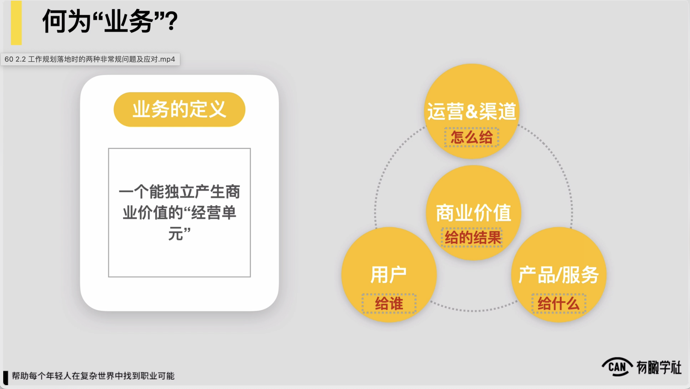
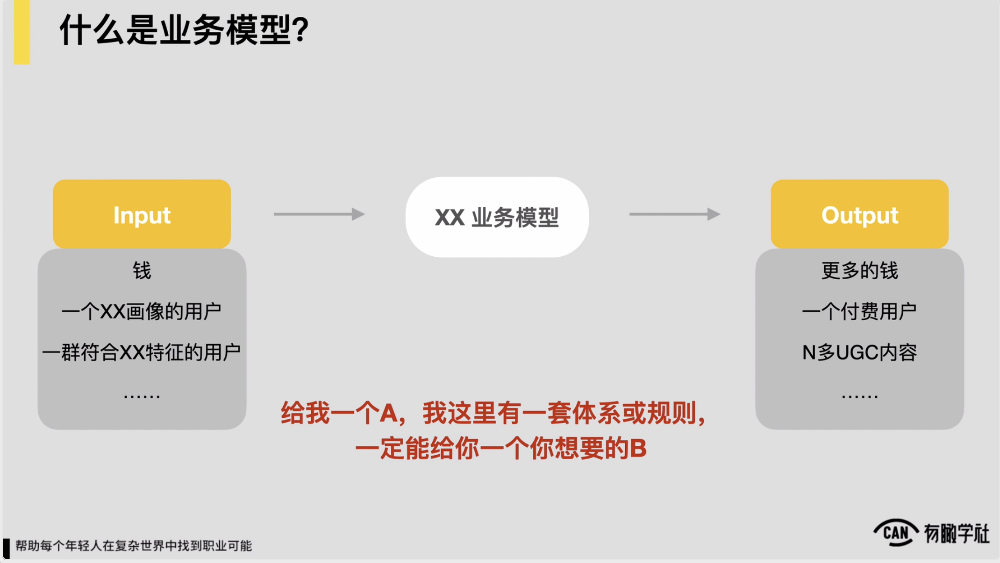
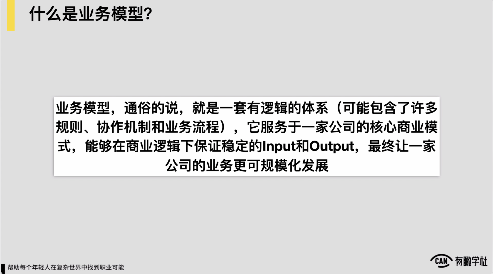
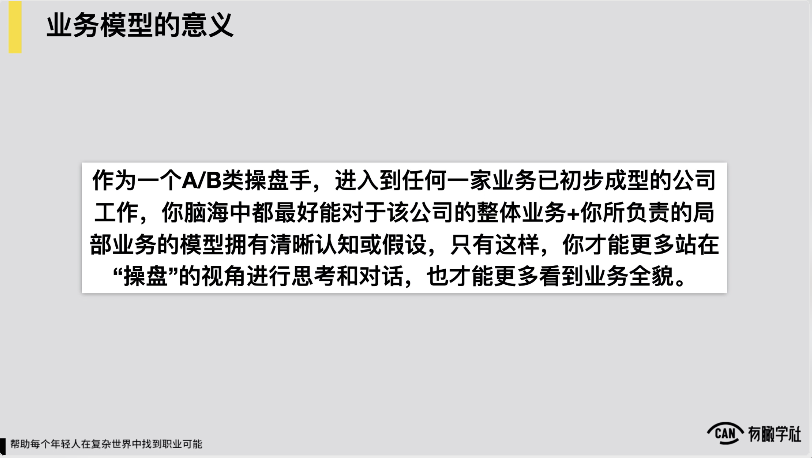

# 2.1. 业务和业务模型的概念和意义

### 22 2.1 业务和业务模型的概念与意义.mp4

因此，我们随后正式进入本章最为重要的第二小节，如何梳理加优化一家公司的全局加局部业务模型。在本节的起初，我们先简单回顾一下到底什么是业务，就像我们在第一章里边已经提到过的一个业务，我们对它的定义和理解一个**能独立产生商业价值的经营单元**。

这里边一个业务当中的基本要素包括了我们的产品和服务是什么，然后我们的用户是谁，我们通过什么样的渠道对来去触达到我们的用户，最后产出了一个商业价值，这我们的一个业务，然后一个业务一个能独立产生商业价值的经营单元，因此，这是业务。

基于这样一个理解和概念，去进一步查看到底什么是业务模型，我们提了很多次这样一个词了，我们再次来给它下一个较为准确较为直观的定义。

我先给到这么一个图，从某种角度可看到这么一个图上它有一个input，也有一个output中间我们的某某业务模型，对怎么理解这样一张图，我认为一个业务模型它本质上承载的是什么作用，它说我有一个稳定的input，例如我的input我有钱，我有一个符合什么特征画像的用户对然后这是我的稳定的input。

因此，我 Input给出来给到你，你这儿有一套业务模型，用户进到业务模型里边去，跟我们的产品跟我们的服务发生接触，或者说发生了很多的互动，对最后输出了一个output， output也是较为稳定的，它有是什么？有是更多的钱，或者说一个初始满足什么特征的用户，经由这样一套业务模型进入一套我们转化的模型之后，出来它就付费了，对它相对是稳定的，它付费转化率较为的稳定，或者是说它产出了n多的这种什么UGC的内容等等。

所以业务模型本质上，如果我有一些稳定的input输入到业务模型里边对最后我能得到一个稳定的output，或者简单一点来，那 A我这儿有一套体系或者是规则，一定能给到你一个想要的b这么一个东西，最粗放的对于业务模型的理解了，我们把这么一个认为再把它书面化一点，可能就变成这么一句话，叫做业务模型，通俗的讲一套有逻辑的体系，它可能包含了很多的规则协作机制或者是业务流程，它最终一定是服务于一家公司核心的商业模式的。

在一个稳定的商业逻辑下，它可以保证有稳定的input output，最终让一家公司的业务更可规模化的发展。站在角度上我们再去查看，例如我们最常见的一个收入公式，一家公司的收入等于流量乘以转化率前up值对你发现公式它背后一个较为简单的一个业务模型，业务模型的input是什么？我输入钱或者是某些资源某些渠道资源对然后因为这些钱给我带来了这种流量，中间我有一套的这种各种的运营机制或者体系，最终保证我初始投入的钱，最后我赚到了更多的钱，约就这么一个逻辑。

同理各位如果有印象，可能还记得我们在第一章里面提到业务模型的时候，也稍微举了一个小的例子，就三节课的付费课程怎么保证学习效果达成，对你会发现在业务模型里边也有一些稳定的input，就投入人服务资源，投入一些基本的这种生产的要素，最终可做到让可能符合某些特定特征的用户，一个例如985 211大学的理工科的这么一个学生，进入到课程里边来

他一定最后能得到一个稳定的体验和满意度，还有它的具体的一些像数据分析的技能之类的得到了稳定的提升，这是我们的稳定的input和output，对。

所以从角度来理解，业务模型让各位理解的更直观一些，那么业务模型对我们到底有什么意义？作为一个ab类的操盘手，我要给到各位的反馈是进入到任何一家业务已经初步成型的公司工作，你脑海中最好都可对该公司处理体的一个业务和你所负责的局部业务的模型拥有清晰的认知和假设。

因为任何一家公司如果它的业务已经初步成型了，对上级脑海当中一定是有一个模型的，只有说你说我对于这家公司处理体的业务和我所负责的局部业务都能有一个模型化的这种认知或假设了，我才能更多的站在操盘的视角上来进行思考和对话，跟上级更加同频，也才可更多的看到业务全貌，更好的去驱动我的业务去发展，包括也更好地审视到说我的业务当前面临的核心问题到底是什么，这是业务模型对于我们做一个ab类操盘手的意义。

