# 2.2. 业务和业务模型的构成与实质

## 业务模型的分类：

# 全局业务模型

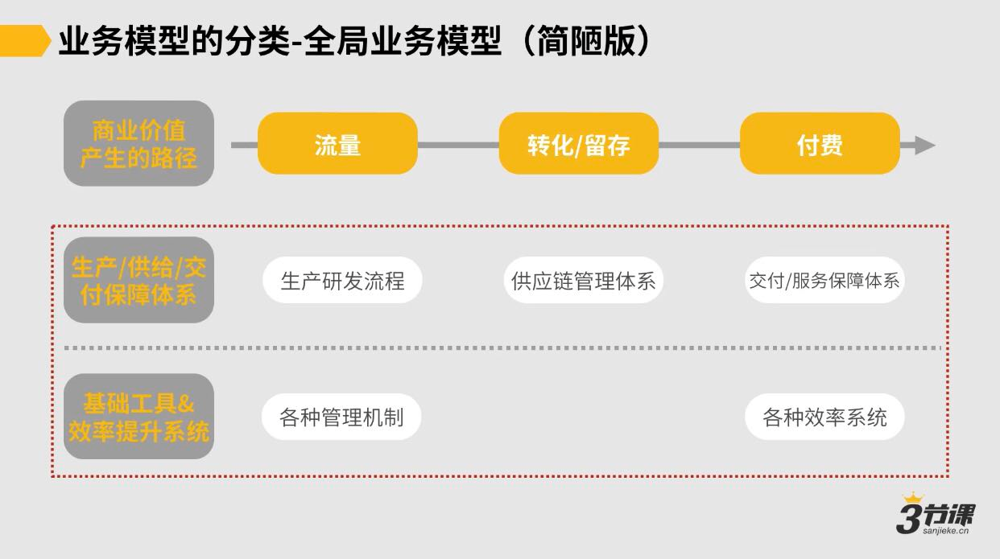

### 局部业务模型

即全局业务模型中的某个环节或某个模块

全局业务模型中，高层最关注、不能有任何偏移的，是“驱动商业价值提升”，或者说是业务增长相关的部分。

***

### 23 2.2 业务和业务模型的构成与实质.mp4

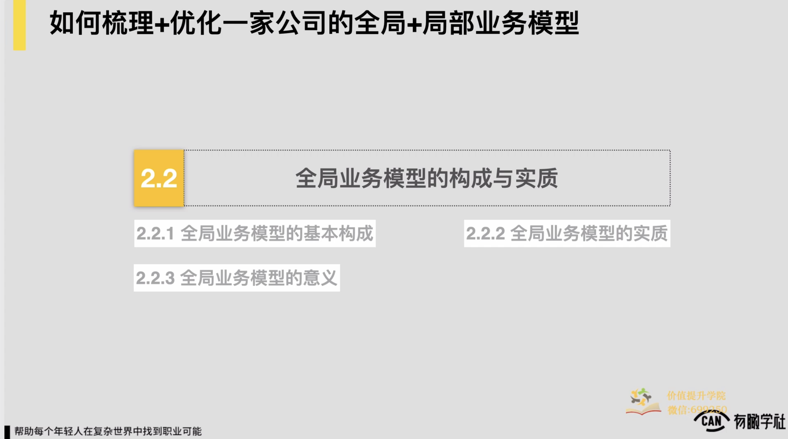

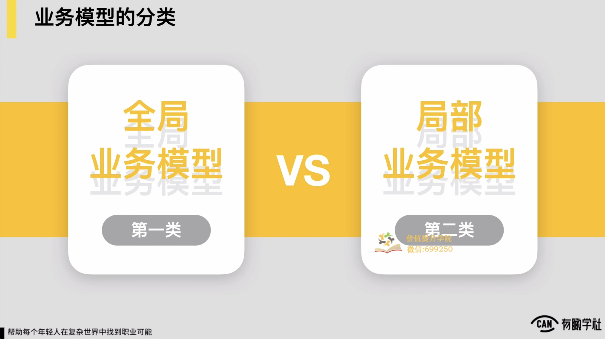

因此，上面就算是简单破了个题，随后我们就更具体来讲一下我们本节要讲的两类业务模型，全局业务模型和局部业务模型，这也是我们业务模型的两种类别。对我们依次来说到底什么是全局业务模型？

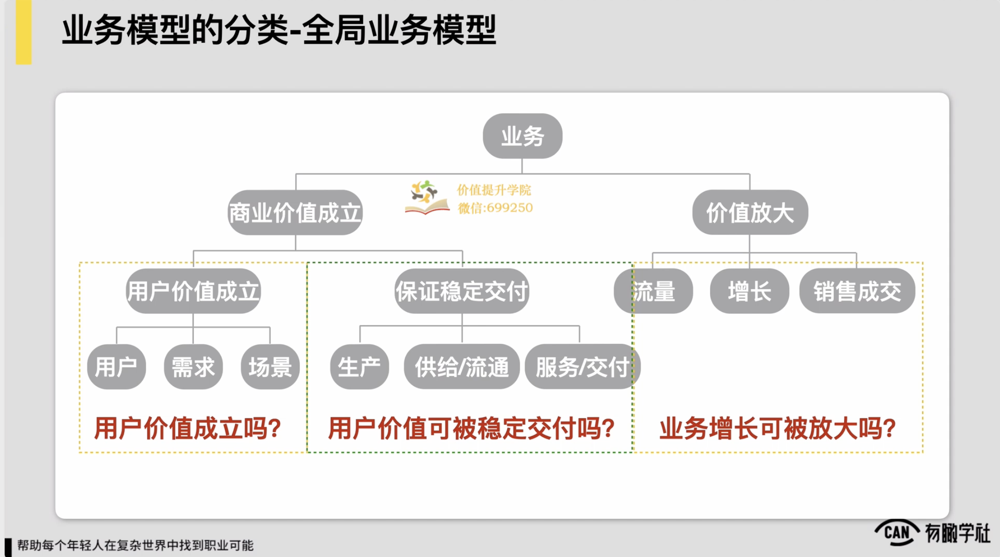

如果各位有印象，我们在第一章的时候也提到了这么一个重要的概念，说一个业务对它要想成立，它有三个基本前提条件，首先是说第一个用户价值为真，用户价值要成立，第二个是说用户价值可被稳定交付。第三个是说我们的业务增长是可以有个逻辑可被持续去放大的，对这是一个业务要可成立的三个基本的前提。

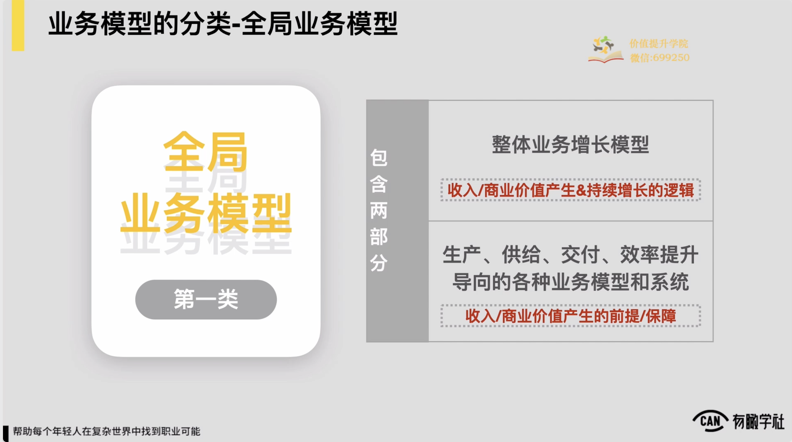

所以如果从角度来看，全局业务模型它本质是什么它本质上当我们的用户价值已经验证了是为真是成立的时候，我们要有两个方面的模型，它包含了两个部分，一个部分我们叫做处理体业务增长的模型，它核心我们的收入或商业价值能产生或者持续增长的一套体系，或者是逻辑。这是第一个部分。

第二个部分我们的业务当中，我们在生产、供给、交付效率提升等等这些所有的方面上导向的一些业务模型或者是系统，他们通常是我们一家公司的收入和商业价值产生的一些基本前提和重要的保障。所以全局运用模型通常包含了这么两大部分，所以当我们要把一家公司的全局运用模型要梳理清楚，具象的展现出来，我们差不多也会遵循这两大部分逻辑来去做梳理。

一般来说一家公司梳理它全局业务模型，我们首先会先梳理它的处理体业务增长的模型，处理体业务增长模型像我们刚才提到的，它一家公司的商业价值或者说收入可产生并且可持续的产生的这么一个基本的逻辑，它一般就体现为说我们的从流量到付费或者后边的用户的复购，持续可延伸到这么一条路径，这是最常见最简单的一个粗放的这种理解

东西会叫做我们处理体的业务增长模型，在这儿我们先举个例子，会把它讲的简单一些，后边我们会具体再展开来去，再展开具象的来，然后所以这会是第一层。我们一般来说会先把这一层的模型去梳理出来，梳理完了之后，随后在它的下面我们会再去做填充，下面的填充通常会跟上面的处理体业务增长模型会是一个较为对应的关系，通常下面那层我们的生产供给交付保障的体系。

通常任何一家公司只要说我是为用户提供服务的，不管我提供的产品是内容，还是是一个实体的实物，还是说是别的某种这种服务对理论上我一定会有一个生产研发的这种流程，来去确保说我的处理个生产端它是相对可控是稳定的，以及如果我的处理个产品里边涉及到说我有一些供应链的这样的这种管理

然后不管是说像有一些实物的这种什么配送仓储等等，还是说可能对一些服务人员的这种管理，还有一些像教育行业的什么开班计划等等，我一定需要有个供应链的管理体系，以及如果我是一家这种服务型的公司，我在我处理个的这种产品当中，我也需要有一个这种交付服务的保障体系来保障用户的体验和满意度。

，然后所以这是生产供给和交付保障的这种体系，它跟我们上边处理体业务增长的模型会一一对应，来去对上边我们的收入可持续增长形成基本的保障和支撑。

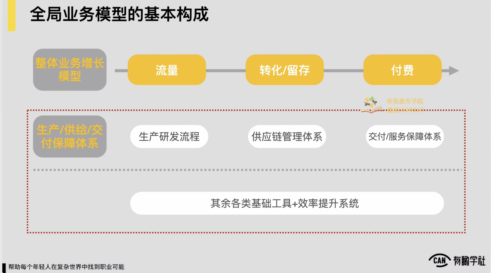

那么在最下面，可能对一家公司的全局应用模型来，还会有一些其他的各类的基础工具和一些效率提升的这种系统。

例如一家在线教育公司来，我们肯定就会有我们的在线学习系统，然后一些处理体的我们像教务管理的系统等等，有很多这样的这种系统，这是较为简单的去理解所谓的效率提升系统和基础工具，对于一家公司，如果它的业务长大到一定程度之后，比如像阿里这样的公司，它是会把很多业务里边共通的能力往后抽到后边来，成为一个强大的中后台的能力，建立起我们的这种中台的这么一个大的这种不管叫事业部还是怎么样

形成一个十分强的这种中台的这种能力，可能到了个阶段的，说它下边会有一些重要的中台系统来去在上边支撑各种类型不同的业务来去开展。

所以如果要大一点或宏观一点去理解，我们最下边这层说基础工具加效率提升系统到底是什么，有可能现在大公司里边的很多中台系统也有呈现为是这样的一个样子，我们在一家公司里面去梳理全局应用模型，它基本结构约就会是这么一个结构。

最上边是我们处理体业务增长的模型，下边是一些生产供给和交付的保障体系，最下面最底层是一些基础的工具和我们的重要的效率提升系统。当然这些在我们实际的梳理过程中，这些什么效率提升系统之类的，有一些可能没那么重要，可能我们就把它就略掉了，就不会去呈现出来，约是这么一个逻辑。

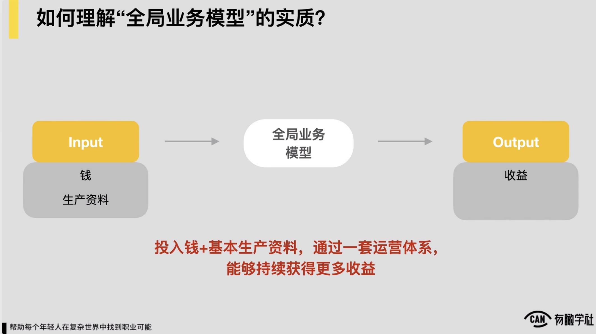

因此，到此为止，我们也许可以再重新去理解一下所谓全局应用模型它的实质是什么。因此，那就像我们在这一节开篇提到的，业务模型它可能说我前面有个稳定的input，我们后边要保证一个稳定的output。

本质上我们前期业务模型像 刚才讲到的这么两大重要的层次，一个是我们的增长的这种业务模型，另外一个是我们的交付供给生产的保障体系。

它本质上是这两层东西叠在一起，它本质上是个什么东西，它这么一套运营体系，我们投入钱，我们的input我们的钱加一家公司的基本生产资料，我们的前置模型一套运营的体系，最后 output更大的收益，帮助我们通过这么一套运营体系能持续获得更多的收益，所以这是一家公司全局业务模型的实质。

因此，再随后我们再进一步就像我刚才讲的全局业务模型，它是由这么两部分来去组成的，在这儿我们要给出另外一个十分重要的信息，是什么？我们说了全局模型里边是两部分，一是处理体业务增长模型，第二是生产供给交付效率提升导向的各种业务模型和系统，

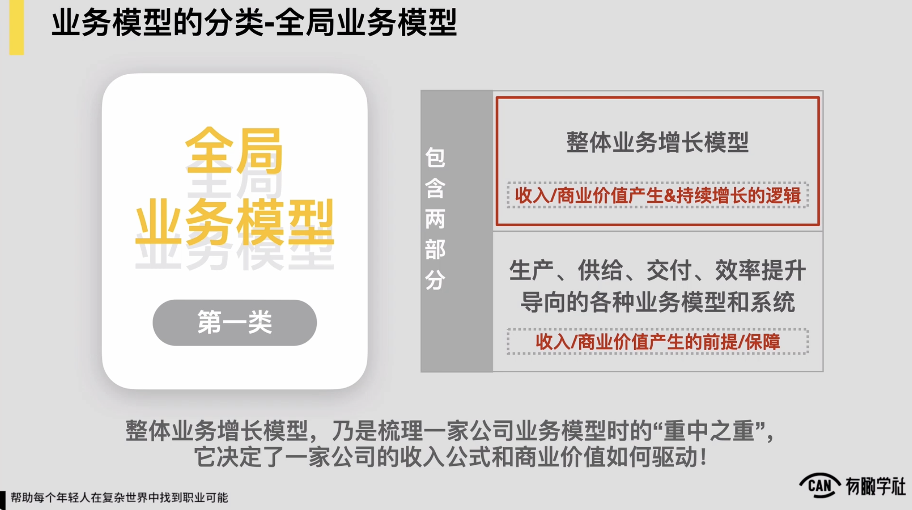

我们在这给到一个重要的信息，这两部分里面处理体业务增长模型乃是梳理一家公司业务模型时候的重中之重，它决定了一家公司的收入公式和这家公司的商业价值到底怎么来去驱动，这件事十分重要，以及处理体业务增长模型，如果你能梳理清楚，对于你去理解一下公司的业务，管理一下公司业务会是十分有帮助的。

相反如果你梳理不清楚，你会发现我的很多的理解，我跟上级的很多对话，很多的这种工作规划都会受到十分大的影响。

说到这儿我们不妨就来看一个更加具体一点的例子，因为上面我虽然给各位介绍了说我们梳理一家公司全局模型，可能就先梳理我们处理体业务增长模型，在这下边去对应我们收入产生商业价值产生逻辑对去填充很多这种供给交付的一些这种系统或者说保障体系就ok了，但是上边提的还是是较为粗放的。

如果你在梳理一家公司的处理体业务增长模型的时候，如果你最后梳理出来的东西只是一个简单的，首先是流量，然后随后是转化，最后是付费没了，如果这么一个简单东西放在这儿，东西并没有什么价值，怎么来理解？

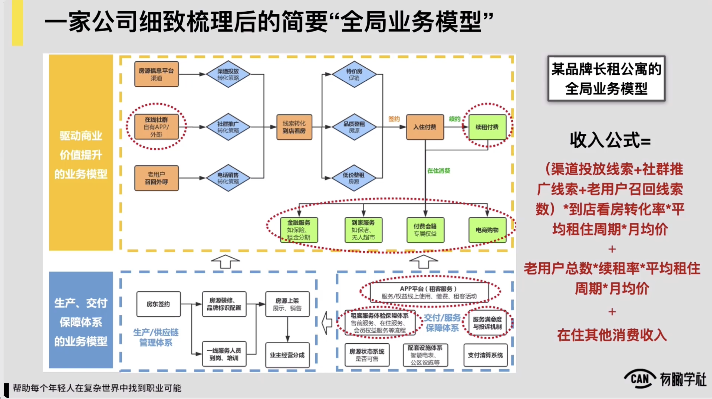

我们直接上图各位可以查看，这是一个某品牌长租公寓，然后我们一位学员在上完课程之后，他所梳理出来的处理体的它的全局业务模型，你可以看到业务模型里边也是上下两部分，上面这部分我们所提到的处理体业务增长模型，它在写的是驱动商业价值提升的业务模型，是一回事，这不重要，他画的很多红色的圈各位也可以忽略，这里边我说我们重点查看它具体的一些这种业务逻辑，可看到在上面它的处理体业务增长模型里边，它最前端的流量来源有三个流量的这种来源，第一个是它通过很多房源信息平台来去获取很多的这种流量

通过渠道投放的方式。

第二个是他们自己可能做了一些在线的社群在社区里面来做转化。第三个是通过电话的外呼来去对老用户对一些平台上沉默老用户做一些外呼，对这三个渠道拢共可能都拿到一些线索之后，有一个到店来去看房的这么一个这种逻辑。

看房后面他的房源分成三类，有一些促销的特价房，有一些品牌处理租的这么一些房源，还有一些低价处理租的房源，看完之后后边如果前面来看房的人满意了，就进入到签约的部分签约就付费了，到此才完成一个付费。

付费完了之后，理论上我就收到一笔钱对但收到这笔钱之后，后边我的收入还有可能有两种来源，第一种是续租，第二种在住期间可能用户还会有一些增值的这种消费，比如像一些什么金融服务到家的服务，然后一些会员或者像一些在住期间的这种电商购物之类的，这是它处理体的业务增长模型。

而下面是它的一系列的这种生产交付和保障体系，例如它的房东这块的一些 BD和供应链的管理体系，还有它的这种租客服务保障的一些这种配套的体系等等。看到这样一个图，我猜很多的同学们可能就有认为了。

在我们梳理业务模型的时候，我们要把一家公司的业务梳理到这样一个状态，它才是有意义的，而不是像我们前边那张PPT呈现的一样对可能流量然后一个留存，然后一个转化反正就没了，样的我觉得它不能去指导你任何业务上的这种经营和决策，所以各位要有认为。

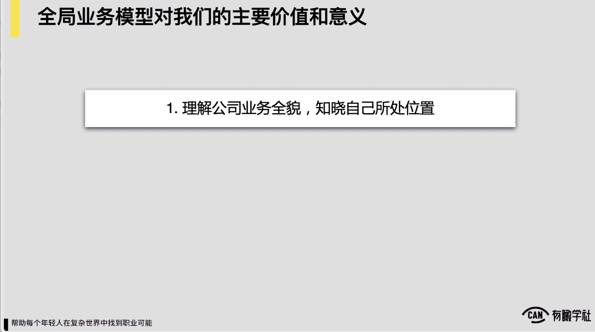

好往回退一步。

我们上面提到了说处理体在全局业务模型当中，我们的处理体业务增长模型才是重中之重，这部分梳理得清楚不清楚，会影响到我们的很多重要的决策，事怎么理解它本质上是这样的，只有你的处理体业务增长模型变得十分的具体和清晰，你作为一家公司或你负责的这项业务，它的收入或者增长公式才可清晰，于是你才更有机会针对你的业务问题进行高质量的分析和决策。

怎么理解这样一句话？

例如收入等于流量乘以转化率乘up值，这么一个公式，绝大多数互联网运营或产品人都知道。

，但你会发现如果你拿公式去分析很多具体的业务，说我现在要驱动我的收入增长，我到底该怎么去驱动

你发现很多业务是套不进去的，包括说例如你拿这公式来分析这家品牌长租公寓它的一个业务，你发现可能也很难去套的进去，但是我们像这张图上一样，我们把这家公司它的处理体业务增长模型梳理到这样一个清晰的颗粒度，发现说它前面有三个主要的获客渠道，中间它的产品线它的房源的来源主要有三条，然后它的收入来源除了初始的这种用户的入住签约的租费，还有续费的费用和他的在住消费的费用，也是他收入的重要的来源。

你发现我们把他的业务梳理到程度之后，我们会得出来一个完全不一样的收入公式，这时候我们得到收入公式是怎样的，是这么一个认为。

首先他的收入有三块重要的来源，第一块重要来源那我们说的我们前面有三种线索获取的这种渠道和手段，分别是渠道投放线索，加上社群推广线索，加上我们的沉默老用户的召回线索数，然后参与我们到店看房的转化率，乘以我们平均租住的一个周期，再乘以我们的月租费均价，这是我们的第一块收入，就外边之前没有住过我们房的这帮用户对我们就通过找线索邀请他到店看房，转化，然后最后就付钱，这是第一笔收入。

第二笔收入是我们的老用户的续租，所以这样可能有另外的第二个的收入的重要的这种支撑，我们的老用户总数乘以我们的续租率，乘以我们的平均租住周期，再乘以我们的月租费均价，这里边我们就可以去看，如果我们的收入公式窄到程度了，我们就可以去看说老用户的总数现在是多少，续租率是怎样的，平均租住周期和月均价是怎样的，这里边我们就有十分多的核心的这种业务指标是我们有机会去提升，或有机会去评估说它到底现在是低还是高，到底合格还是不合格的。

，所以这是我们第二块的收入的引擎。

第三块我们收入的公式基本我们在住期间的其他的消费收入，包括我们的什么电商到家，还有金融之类的，这里边可一块一块去看，摘得更细一点就可以再一块一块去看，你发现上边我们的处理体业务增长模型梳理的足够细了，之后，最终我们得出的收入公式是这么一个具体的公式，当我们的公式是这样一个具体公式的时候，评估，管理我们当前的业务

我们就更有抓手，所以这才是我们在这一部分想核心给到各位的一个要点，也是为什么我们说在梳理全局应用模型的时候，处理体业务增长模型才是它的重中之重。

也希望各位一定要记住，当你在梳理一家公司全局应用模型的时候，如果你不可把处理体业务增长模型梳理得十分的具体和细致，你的梳理很无效的，并不能帮助你去做更多高质量的分析和决策。

因此，案例讲完了之后，我们再来进一步查看全局业务模型，对于我们这家公司里边作为中层管理者或者是业务骨干来，到底会有些什么样的价值和意义，简单总结一下。

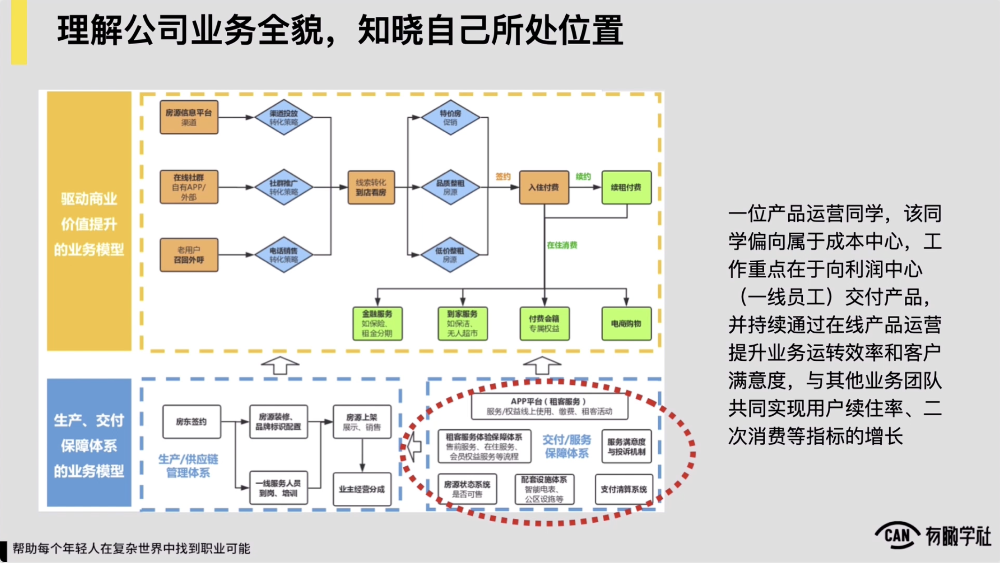

然后有三个方面，第一个方面它可以帮助我们理解公司业务全貌，更好地知晓自己所处的位置，包括说我在公司里边到底是跟些人有协作关系，我的工作的好与坏对影响到些部门或些同事。，然后这是一个十分重要的价值和意义。

比如可与刚才我们聊到的这家长租公寓，以它的处理个的业务来做一个背景，假定我们现在是这家公司里边产品运营部的一名员工，产品运营部他负责什么工作，他是负责我们处理个的偏中台这一部分，可能有一些系统，包括我们的什么租客服务体验的保障的系统，还有我们的一些房源状态的系统，还有我们一些用户的这种满意度，还有投诉的这样的一些管理的这种系统，

我主要负责这些系统的上线，还有跟业务方的对接，还有说他回头在业务方这边使用的流畅的程度，还有说它的使用的效率到底怎么样

假设我负责的是这么一档子事，事儿当我处理个梳理清楚了这家公司的全局业务模型，我对它的处理个业务链条，还有它的处理个收入增长的逻辑到底是怎样的，我有了一个全局了解之后，这时候我对于说我的工作的价值该怎么体现，我的工作会影响到谁，该跟谁协同就会十分清晰，我的工作肯定属于成本中心的，我部门的属性就属于成本中心的，所以我一定会十分关注成本和效率。

然后我的工作的重心是在于要向利润中心的一些一线业务员工去交付我的系统和产品，并且持续通过一些在线的产品运营的工作，对提升我们处理个业务的运转效率，还有客户的满意度。这里面一定有两种指标我要去关注和考虑，一种就像客户满意度这样的指标对我应该跟业务团队去共杯，共同的关注。

另外一种说像房源的状态系统上面对系统例如房源的登记更新是否及时，它可能直接会影响到我们处理个业务的运转效率和各位的沟通协作的效率，对所以例如像房源系统的这种更新的及时性，还有它的准确性之类的，这样的一些指标是我自己要去重点关注的，只有我保障以上这样的指标

处理个处理个业务的运转的效率才能有更好的一个保障。同时我的工作直接影响到其他业务团队，例如在实现用户的续租率，二次消费等等这样的一些指标。换句话，如果在我这儿，因为我的一些工作导致用户的这种满意度对是不够的，很可能满意度的不够，直接会影响到用户的续住率和二次消费

你看作为一个一线的员工，假设我之前脑海中并没有这么一个全局的对我业务的理解和思考，我所关注的所有的信息可能说你看上级交付给我说让我今天去推一个什么系统，系统我只要开会对跟我的业务方面可能聊清楚了，然后我把东西文档交给他们我就不管了

但当我对业务有了这么一个处理体的思考之后，你发现我站的位置就会不一样，而且我的关注的重点也可更好跟我的上级跟我们处理个公司的高层去实现同频的，从而我也有更大的可能性，能在这家公司里边去创造更大的价值。所以这是全局应用模型对我们的第一层的价值。

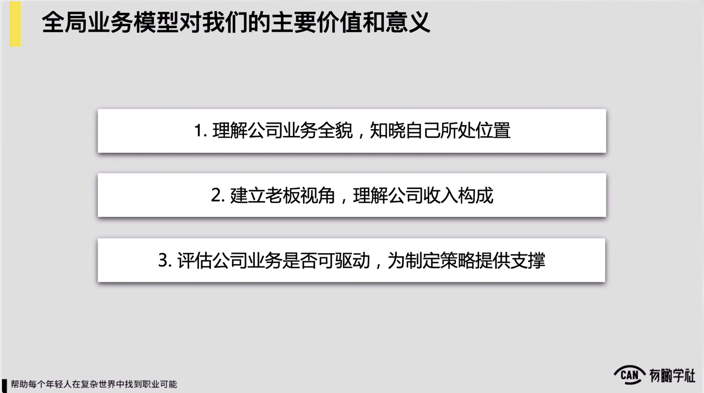

全局应用模型对我们第二层的价值毫无疑问建立上级的视角，理解公司的收入构成对以及在这基础上去理解说我们所做的工作能怎怎么更好的驱动公司的业务增长，在刚才我们聊长租公寓的案例的时候已经就提过了，我们就不再赘述。

还有第三层的价值是叫做说全局业务模型可以帮助我们评估一家公司的业务是否可驱动，而为我们在制定一些策略，或者要思考一些后边的工作方向的时候，对可以提供更好的决策依据和支撑。

这句话里面的是否可驱动，讲的说是否在一个业务模型里边，可找到一个明确的发力点，我在上面只要去加码对例如我只要持续放大流量，或者我只要在销售团队持续加人，我们的业务就能蹭蹭的往上就能持续增长了，他提到的是否可驱动，约是意思。

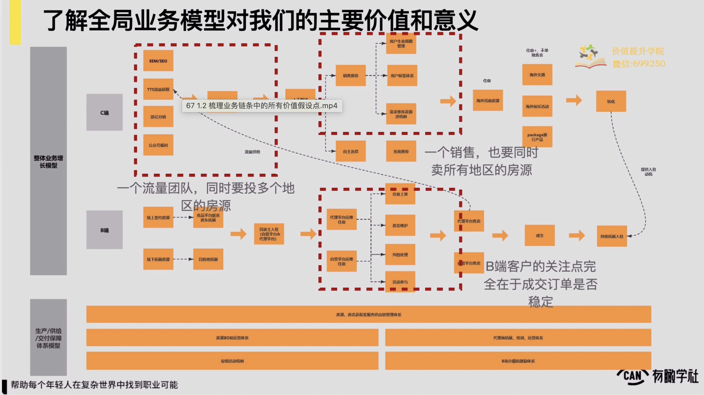

我们下面不妨也来通过一个例子来进一步理解一下。以上，现在在屏幕上有这么一张全局业务 模型的图，图的字可能较为小，但没关系，我给各位来简单的说明一下背景。这张图是一家主要做海外的目的地旅游的这么一家旅游公司，然后他们的一个业务模型的图也来自于我们的一位学员。

因此，我简单跟各位说一下这家公司在做的业务，这家公司它主要是以说像台台湾、日本还有东南亚作为说旅游的目的地，他们的一个主要的业务约是做啥？他们基本说在目的地掰城市，例如我做台湾的时候，我就先去做台南或者做高雄或者做台中

每座城市我通过去BD一些我的b端客户，也我的这种像一些特殊的民宿组，或者在当地能提供一些服务的服务商，例如能带我对去乘船出海去看个日出之类的，反正我就BD这么一些服务商，还有我的民宿的房主的这种房源，放到我的网站，放到我的平台上来。

同时在c端，他们会去通过投放对获取到一些销售线索。

销售线索来了之后，他会有个销售团队，销售团队就会跟进每个用户的需求，然后去给他推荐一些比如当地的这种房源民宿，还是说一些基本的这种旅行服务，然后最后客户会在这家公司的网站上或者APP上来完成成交和下单，约他们公司的业务这么一个情况。

这位同学当时他提交了他们公司处理个业务模型的时候，然后我就约看了一下，看完之后就跟他就聊了两句，就说你们公司反正业务要想持续增长

瓶颈和遇到的问题就会还十分的，因为业务模型上面就可能有一些硬伤

硬伤结构性的问题，然后模型可能就有点不太，约就跟他交流了两句，那么果不其然，他们公司当时往后可能做了半年左右的时间，确实在增长上遇到了极大的瓶颈，我为什么会根据模型就会判断说他们公司的业务增长可能就会遇到一些问题，我主要看到了有这么三个重要的点。

第一个点是我发现他们的流量团队是要同时在线上去投多个地区的房源的，也你看他们有台湾地区的房源对有日本的房源，有东南亚的房源，台湾又分别分成说像台中、台北，然后高雄、基隆等等，花莲等等这样多个地区，日本又分成什么京都、大阪、东京对然后也是多个完全不同地区，东南亚那边就更多了，反正一片

所以它同一个流量团队要投这么多地区的房源，对流量团队是很有挑战的，我要控制成本，我还要关注我的ry对你要说我就投一两个地区，事儿从控制ry的角度，包括去判断说我的流量质量的角度相对可控，也相对因此，优化到一个较为好的范畴，但是当我要同时管这么多个地区的时候，对一定我觉得这事儿是会有点压力的，这是我看到的第一个信息。

我看到的第二个信息是说他们的销售团队也很奇怪，他们的销售团队，然后在当时他去给我们画出来这么一个业务模型的时候，他的传递的信息是说他们一个销售要同时卖所有地区的房源，也说他们的流量团队

例如我投了a地区的流量之后，他并没有一个专属的销售团队来去对接a地区的销售线索，而是我投完的所有的线索

都随机的分配给我约一个十几二十人的一个销售团队， A销售有可能说今天我拿到的是地区的线索，明天我拿到的是地区线索，后天我拿到又是一个另外的全新的地区的线索，

所以一个销售要同时卖所有地区的房源，这件事我觉得对销售团队来说压力也很大，而且它的效率可能也不是说最高的一种状态。

那么我看到的第三个关键的信息你看他们的弊端，他们拓展了十分多的这种民宿组，一些当地的这种服务提供商等等对把自己当做一个平台式的这么一个业务在看待的，对但是你会发现 b端客户的关注点，完全会在于说我的成交订单是否稳定，换句话说我是一个台南的民宿组

你这家旅游网站来BD我说让我把房源挂上去做一些维护对我能拿到订单，好我初期我就配合你，但是如果我发现我把房源挂上去之后，连着好几个月订单都十分不稳定，或订单数都十分少，这时候会发生什么？这时候会发生的一定是说我就离开你平台了，我就不跟你玩了，然后因为我在你这挣不到钱对然后我一定就会把我的主要精力投到其他地方去，投到其他平台上面去。

所以这家旅游公司他们一个十分重要的工作是说我要保障我的b端客户，至少一批核心的b端客户，因为这帮b端客户是我的供应链，我要保障他们获得的订单是要稳定的，这样我才有资格或才有资本持续去卖对他们的房源或者他们提供的一些服务。

然而很不幸，在他们现有的这么一个业务模型下，对伴随着他们房源量的增加，伴随着他们例如所拓展的地区的增加，对你现在说我流量要投多个地区房源，我销售团队要卖n多地区的所有的这种房源，我觉得这件事一定是十分有压力的，因为过程中变量太多了

各位可以试思考，在这么一个业务模型里面对你说有谁能对一个地区的所有b端客户的这种订单量，订单量的稳定性能去负责吗？似乎不能对又有谁可对我例如每个地区的销售线索的二外，然后我投放的二外，还有我线索获取的成本的稳定性能对他负责吗？如果只看成本似乎在流量传媒上还可以

但如果要看到ry你发现事儿似乎也没人可负得了责，以及我们也可以回到我们所说的业务模型对很大程度上就评估说一家公司的业务是否可驱动，

回到逻辑上来，我们查看在业务模型里边，你们试思考，我如果持续在流量上去发力，我处理个这家公司的收入是会一定伴随着我流量供给的增加，例如我现在把流量对吧要扩大10倍，我就在上面去砸钱对我的收入是否也能涨10倍？你似乎发现不一定对事似乎还有很多变量的

并不是说我流量可能开得更大，我后边我的收入一定就会上涨，这里面会有我的销售团队转化率是否能稳定的问题，也有说

我的不同地区的房源的供给，它能否支撑说我每个地区的流量进来，它的需求能否匹配上的这样的一种问题，所以你发现它很难去简单的驱动，同理我是否可做到我只要坑坑的，在团里边增加我的销售团队的人员，然后我的收入就可快速的增长了。

你发现似乎也不一定

就像我们说的一个销售，如果要卖所有地区的房源，事本来就很难，我一定很难做到说有一个销售对所有地区的房源，它的情况，它的条件，它的特征，包括它的这种折扣活动之类的，我都能做到如数家珍，确实十分的

所以你发现模型它就找不到业务增长的驱动点，我并不知道我在个地方去持续加码，我的收入可蹭蹭往上涨

所以这我们所说的全球运营模型的其中一个重要的意义，是能帮助判断或者去思考说这一个业务它的驱动力是否明确，这也是另外一重价值。

所以一家公司的业务模型，如果你在梳理完成后，你发现在里边我找不到明确的驱动增长的逻辑和发力点，业务模型很可能也是有问题的，它可能就需要进行优化，甚至是重构了。这我们给各位总结的全局业务模型对我们的主要价值和意义三方面。

第一理解公司业务全貌，知晓自己所处位置。第二建立上级的视角，理解公司的收入构成。第三能帮助我们评估一家公司的业务增长是否可驱动，从而为我们制定一些策略做一些思考，对提供重要的支撑和依据。

因此，到最后我们就总结一下了，所以如果我们要去梳理一下公司全球模型，我们要绘制出来一个具象的图来去表现它，我们怎么来去梳理？

这里边一定是说我们要先梳理我们最为核心的处理体增长业务模型，有了这么一个处理体的业务增长模型之后，我们对应在当中的各个环节下，再去补充上各种的生产交付保障体系，慢慢的就能绘制出一家公司处理体业务增长模型的全貌。

当然了这里边的前提一定说这家公司的业务已经相对成型了，如果一家公司来讲十分草莽的初始的阶段，你说我这家公司当前块业务是稳定的我都不知道，可能也很难去梳理出来。当然这里边一定要记住，我们的梳理一定要足够细致和具体。
