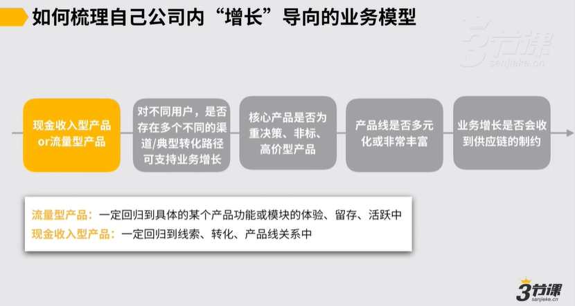
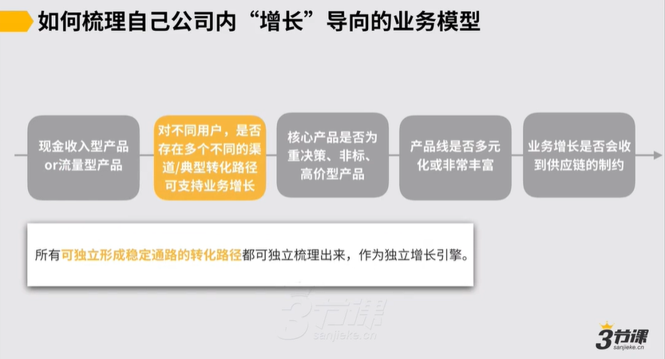
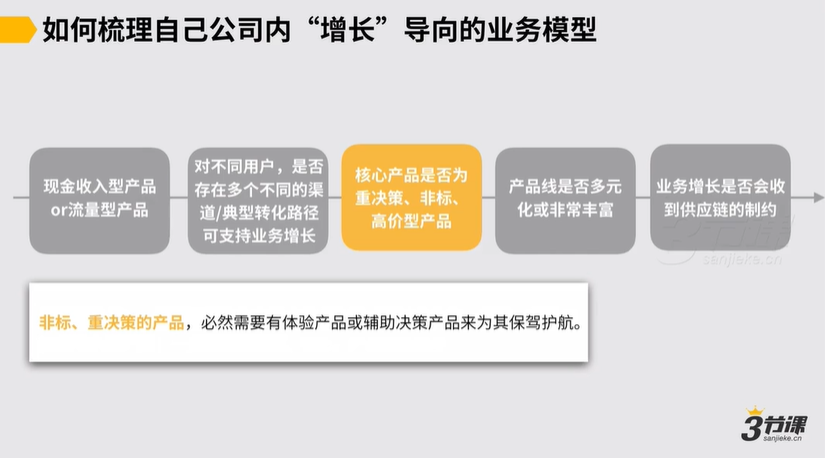
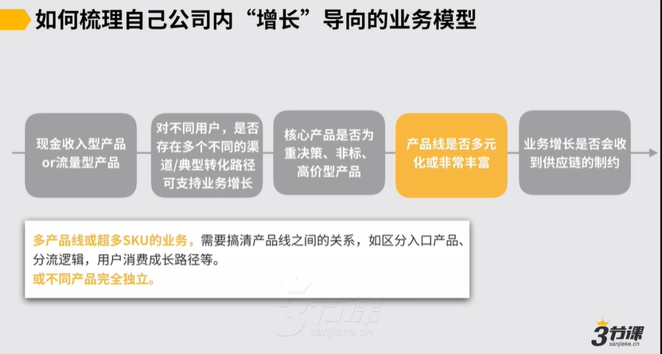
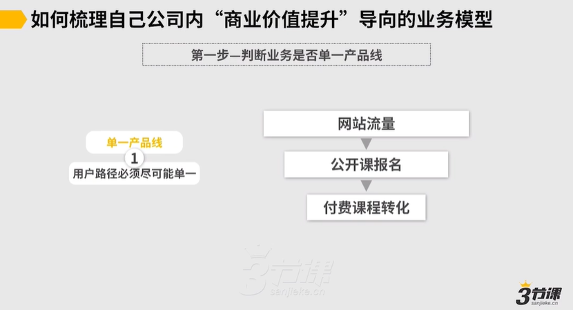
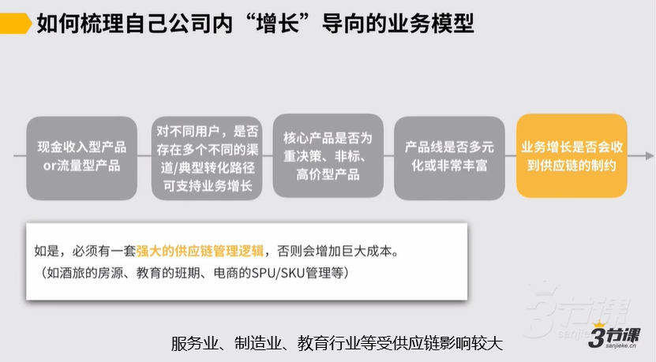
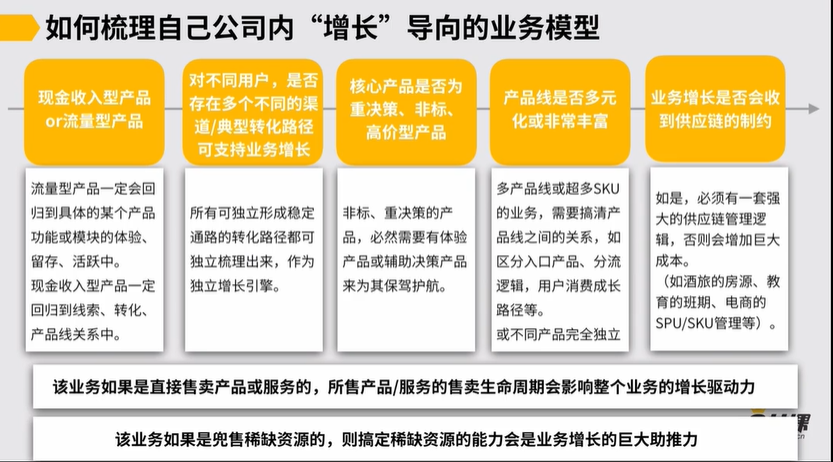
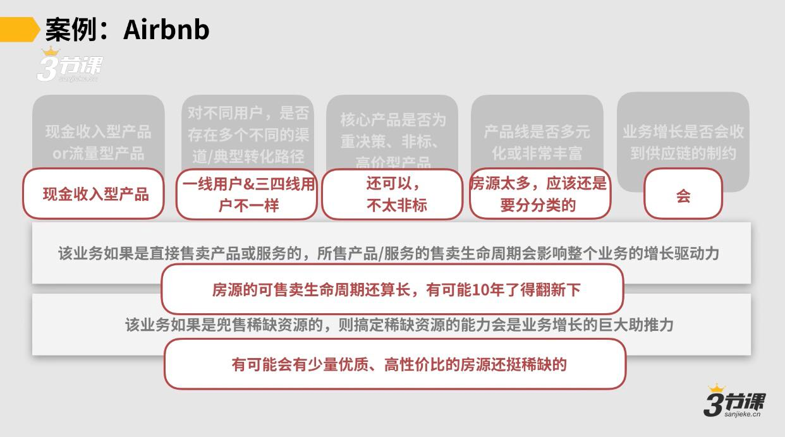
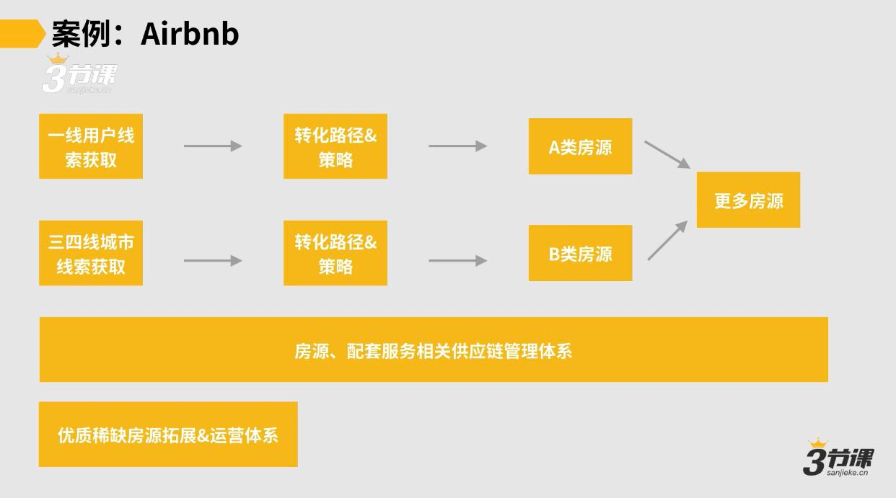
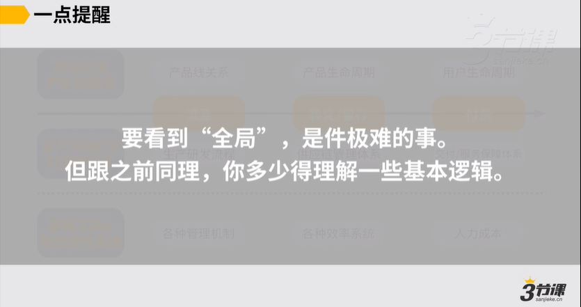

# 2.3.如何梳理处理体增长业务模型

## 3.如何梳理公司内“商业价值提升”导向的业务模型

从以下7方面来思考：

### 1. 判断是现金收入型产品or流量型产品

### 2. 是否存在多类用户，有多个不同的转化渠道/转化路径可支持业务增长

### 3. 核心产品是否为重决策、非标、高价型产品

### 4. 产品线是否多元化或十分丰富

### 5. 业务增长是否会受到供应链的制约

### 6. 如果是直接售卖产品或服务的业务，所售产品/服务的生命周期会影响处理个业务的增长驱动力。（是SKU驱动增长还是用户驱动增长）

比如，知识付费靠海量SKU驱动增长；在线教育靠用户增长驱动商业价值增长。

### 7. 该业务如果是兜售稀缺资源的，则完成稀缺资源的能力会是业务增长的巨大推动力。

### 总结：

### 案例：Airbnb

## 3.梳理业务模型的意义

### 1.对于早期业务

可以帮你进行清楚我未来有可能的模型是什么，我现在最重要的假设是什么？

应该有的心态：边干边不断动态思考+完善业务模型，逐渐跑通后定型

### 2.对于成熟期业务

可以帮你进行清楚你该重点关注什么信息，贡献什么价值，如何在一家公司里不跑偏。你做的所有工作都不能逆现有业务模型而行，应该可借助它或是强健/放大它。

***

###

###
