# 2.3.1 一个基本逻辑

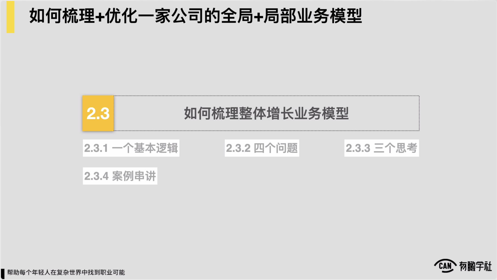

### 2.3.1 一个基本逻辑

因此，那么既然已经提到了梳理处理体增长业务模型这件事十分重要，到底怎么才能把东西梳理得十分的细致和扎实所以随后我们就要给到各位一个十分重要的方法了，方法叫做1基本逻辑，4问题和3额外思考，通过这样1方法，1+4+3的这样一个方法，能帮助各位把一家公司的处理体增长业务模型梳理得十分的细致和扎实。

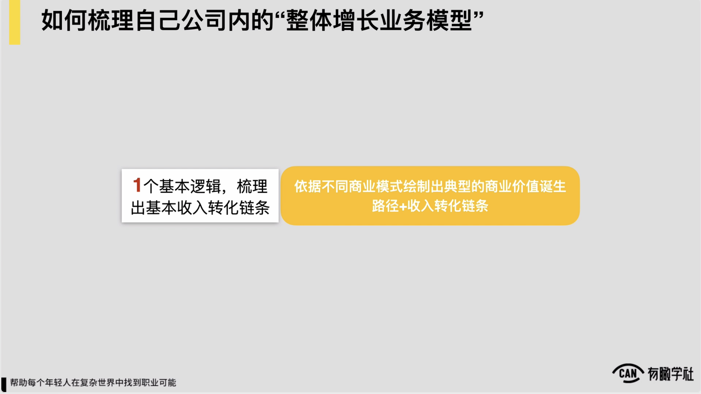

依次来看，首先是一个基本逻辑，一个基本逻辑是什么？说我们首先要依据一家公司它的商业模式到底是什么？根据它不同的商业模式，绘制出典型的商业价值诞生路径和这家公司收入转化的链条，这叫做一个基本逻辑，因为就像我们之前看到的一样，任何一家公司它处理体的增长业务模型一定会有一个转化的链条，一定说前边流量和用户在对最后他是怎么转化我们收入的这边一定有个链条，而这里边不同商业模式下，典型的收入转化链条和路径还是不太一样的。

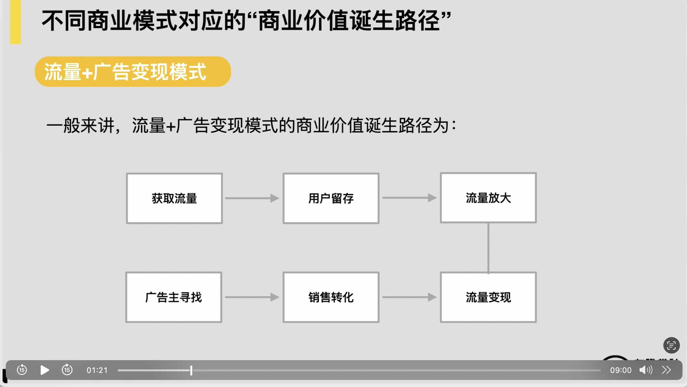

各位有印象，我们在第一章里边提到了常见的4种商业模式，互联网环境下的4种常见商业模式，我们就依次来查看。

首先是第一种商业模式，我们的流量加广告变现的模式，一般来说流量加广告变现模式，它的一个商业价值是怎么产生的？就如我们现在看到的这张图所示对我们一端是流量，就我们获取流量，然后持续做用户的维系和留存，从而我们自己的平台和产品上流量得到了放大。

另外一端寻找广告组，寻找这些销售线索，完成销售转化，最后实现了流量的变现。最基本的一个商业价值诞生路径约这样的，所以如果我们的业务是这样的模式，我们约就可以先把这么一个雏形先放在纸面上，作为我们处理体业务增长模型的一个基本的架构，对这是第一种模式。

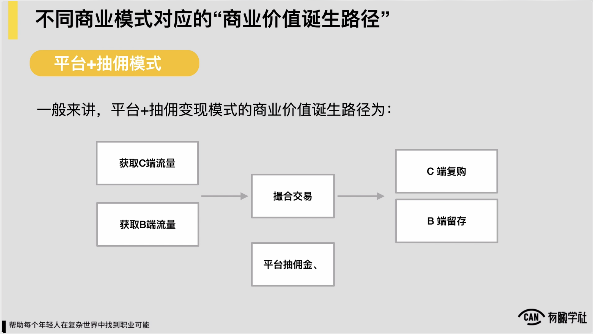

那么我们的第二种商业模式之前提到的平台加抽佣的模式，一般来说平台加抽佣变现的它的模式的这种收入产生路径约是怎样的

约这么一个认为，我们一端获取c端的流量或者说需求端的流量，另外一端就未必完全，你必须要是c然后另外一端就获取b端或者叫做供给端的这样的这种流量和资源，然后在平台上通过一系列的运营规则或者说方式来去撮合交易，撮合交易之后我们就产生了抽佣，产生了我们的收入，再往后我们可能c端要考虑做复购

然后b端要考虑做好他们的这种留存，所以约会是这么一个这种逻辑，这是我们的第二种模式，平台加抽佣的模式，同理如果你公司是这样的模式，你也可以把这样一个架构作为我们处理体业务增长模型的雏形，先放在纸面上。

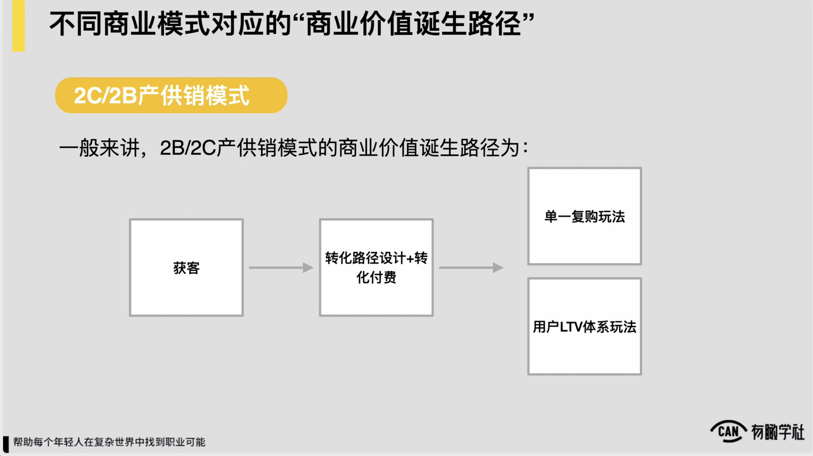

，然后第三种模式我们提到的toC加toB的产供销的模式，to c加to b产供销的模式，它的商业价值诞生路径就较为简单了，它一个线性的这么一个过程，就我们从前边对最早找到流量获客，然后中间一系列的我们的转化路径，具体怎么设计每家公司会不一样，反正经过一个转化路径，用户完成了转化付费，后边我们考虑一下，根据我们的产品形态是否需要有后面的这种复购。

复购又可能常见的有两种逻辑:

第一种我们做一个单一的这种复购玩法，例如定期我们就做个什么站内的促销，或定期就给用户把发个什么券就完事了，这是较为简单的复购玩法，

还有的可能需要去针对用户处理个的这种LTV用户生命周期的管理，去搭建一个用户LTV或用户生命周期的处理体的一个运营体系，所以to，c或to b的产供销模式，它的商业价值诞生路径一般这样的，这是第三种模式。

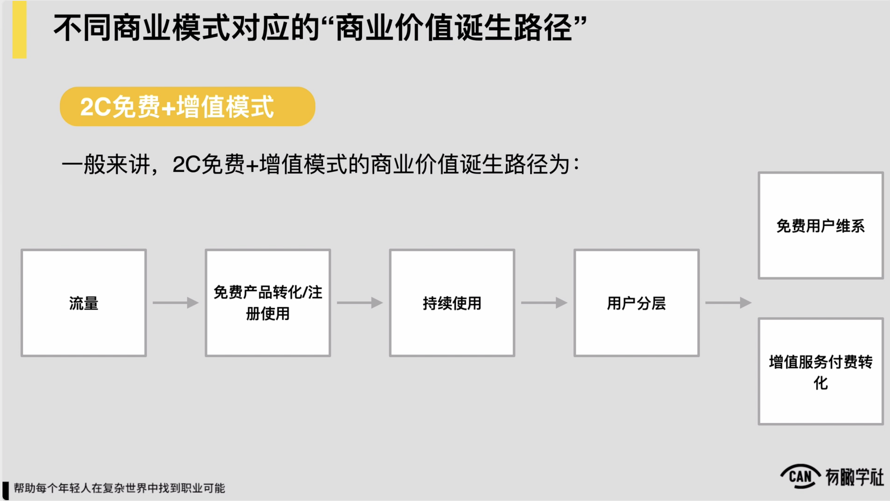

那么我们第四种模式我们提到的免费+增值的这么一个这种模式，一般来讲就免费加增值的模式，它商业价值诞生路径也是最早前面找到流量引入到我们产品当中来，完成我们免费产品的转化或者是注册使用，然后我们通过一系列运营让它可持续的使用。

在随后我们做一些用户分层，做完用户分层之后，可能有一部分用户还会继续的免费使用，另外一部分用户就实现了我们增值服务的付费的转化了，所以以上是我们的4种常见的商业模式，以及对应的我们一般的商业价值诞生的路径，约是这么一个认为。

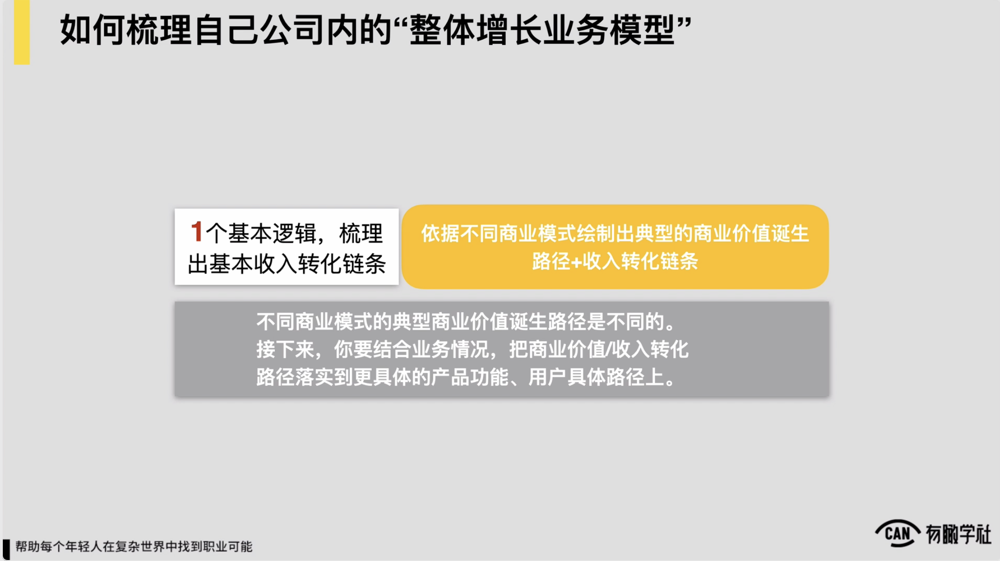

因此，那么通常当我们上门给了这么一参照之后，让各位可能先依据我公司的商业模式，把我们典型的收入转化的一个路径或叫商业价值诞生的一个路径，简单搭个雏形出来，还是较为简单，可以做到的不太复杂，但随后我们还要做一件事儿，随后我们说要结合我们业务的情况，把商业价值和收入转化的路径要落实到更加具体的产品功能和更具体的用户路径上，这件事对我们才会有意义。

不然如果只是刚才的这么一个雏形，对我们实际意义可能还是较为有限的。

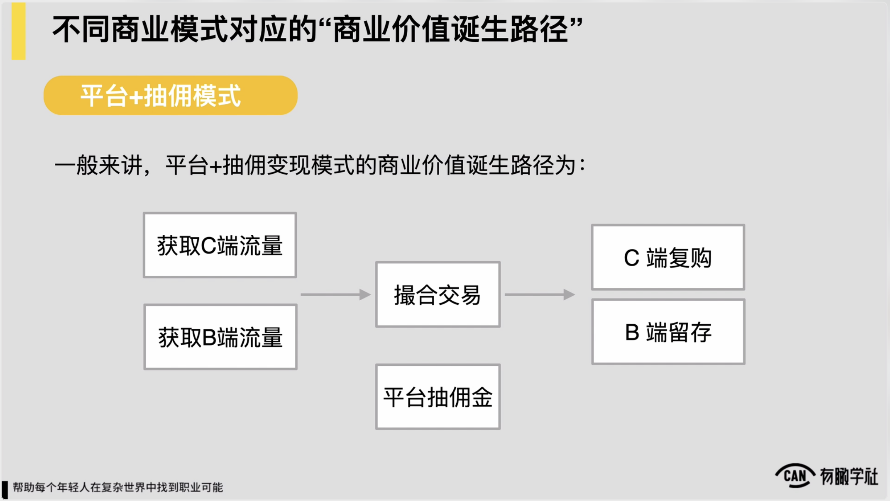

当我们做完这一步的具体落实了之后，会有什么样的不同？看几个例子对比。例如我们刚才有看过这是一个平台加抽模式，一般的商业价值诞生的路径和一个基本雏形，有一家房地产交易平台，它也是这种点型的一个平台，对撮合b端c端，然后从中抽佣，约是这么一个业务。

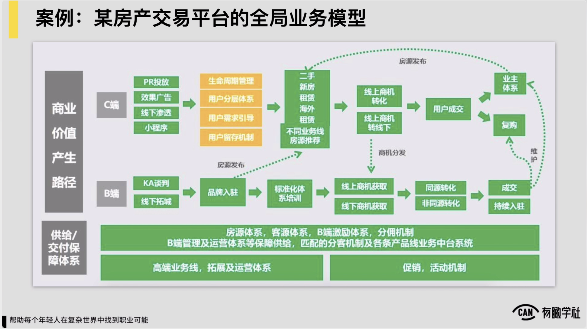

它处理体的一个全局业务模型，包括说它处理体的业务增长模型落实得足够细，落实到具体的每一个业务环节，每一块产品功能上之后，各位可以看到是如我们现在图上所示的这么一个样子，然后c端可能就从最前端说我们是p二来的流量效果来流量线下来流量还有小程序来流量都不一样，然后流量来了之后，我们会有一系列的机制

然后做一些用户分层，作为基本的这种用户引导，然后把这些所有的流量做一个分别的处理，在随后对应到我们不同的业务线，有二手房的业务线，新房的业务线、租赁的业务线，还有一些海外的这样的这种业务线对根据不同用户他的一个标签或者他的身份特征，对应推荐到我们不同的这种产品上去，再随后可能分为说线上或者是线下的转化，最后可能让用户去成交，c端约是这么一个路径。

而b端这块可能说也有一系列的从前边的拓展到邀请入驻，再到说它的一些相对标准化的这种体系的培训，再到去承接我们线上线下的一些商机，来完成这样的这种转化，所以处理个梳理细了之后，各位可以看到我们真实的这种业务状况约会是这样的，这是一个case。

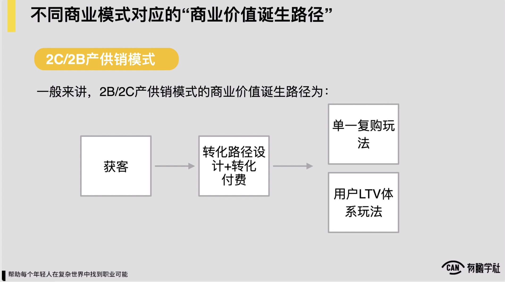

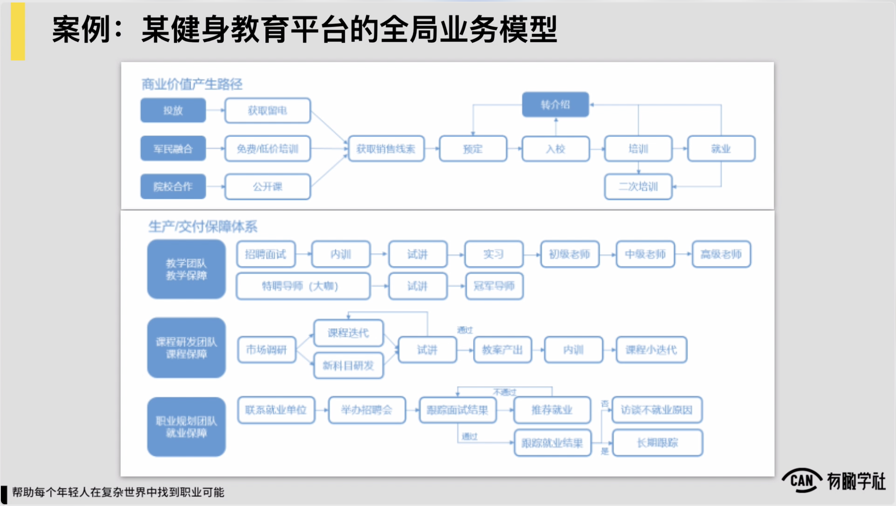

对第二个case我们也来查看一个to c to b产供销模式，它的一般商业价值或收入诞生的路径，我们刚才讲了约是这样一个认为对而一家健身教育平台它也是一个典型，我自己生产课程，然后卖出去培训很多的这种健身教练，约是这么一个业务的模式。它的处理个的业务模型梳理细了之后，你也会看到如我们图上所看到的约这么一个认为，也会是较为细致的，就落到了每一个具体业务环节业务流程，或者是我们的具体的某个产品功能上面。

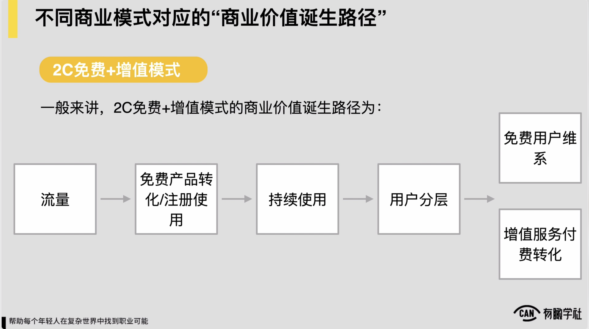

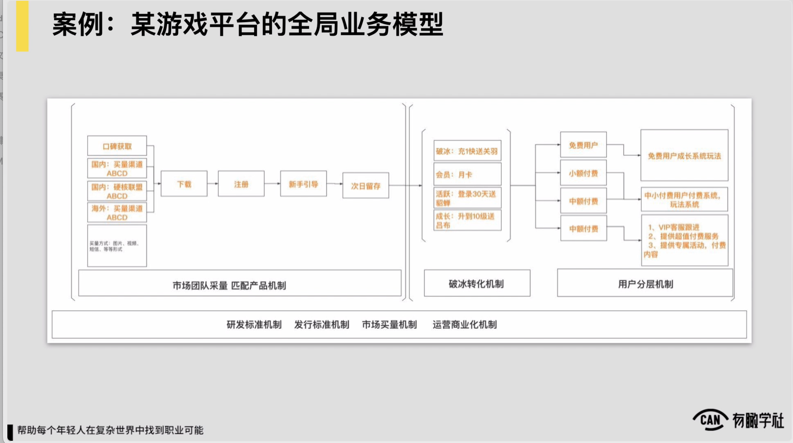

再看一个例子，我们前面提到的to，c免费加上增值服务的模式，它的一般收入诞生和商业价值诞生路径，刚才也提到约是这样的，而对于一家游戏平台的它的处理个的业务模型，或者说处理体增长的这种业务模型梳理细了，落实到我们每一个流程每一个产品功能上面去之后，约是这样的，从最前面各种渠道的买量，再到说用户下载，再到注册，再到新手的引导，完成次流，完成一个破冰转化的手冲。

在后边可能再有一个用户分层和用户成长的机制，对来持续实现说我用户在产品中的持续的付费，细化完了之后，约是这么一个认为。

所以上面是我们的三个例子，借助这三个例子讲完之后我们给各位总结一下，各位会看到商业模式往往是大同小异的，但实际的落地和操作过程中，各位一定要有认为，每一家公司的业务具体情况都是不一样的，这一定会导致我们的业务模型会十分不同，绝对不能一概而论。

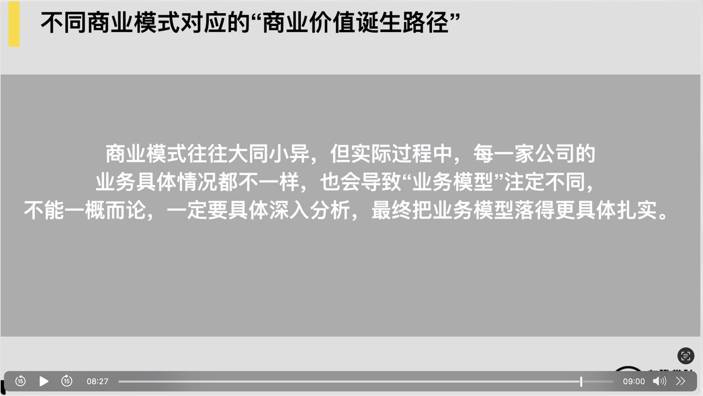

所以我们在具体梳理我们这家公司，我们当前的业务，它的一个处理体增长业务模型的时候，一定要具体深入分析，最终把业务模型能落得更加具体扎实，能落实到很多真实具体的业务环节，业务流程和产品功能上，这样出来的业务模型才是有意义的，而不是一个空空泛泛的这样的模型，然后以及各位一定要有认为，去梳理处理体增长的业务模型，也往往是深刻理解我们所在这家公司所在这项业务的一个十分好的机会。
