# 2.3.2 四个问题

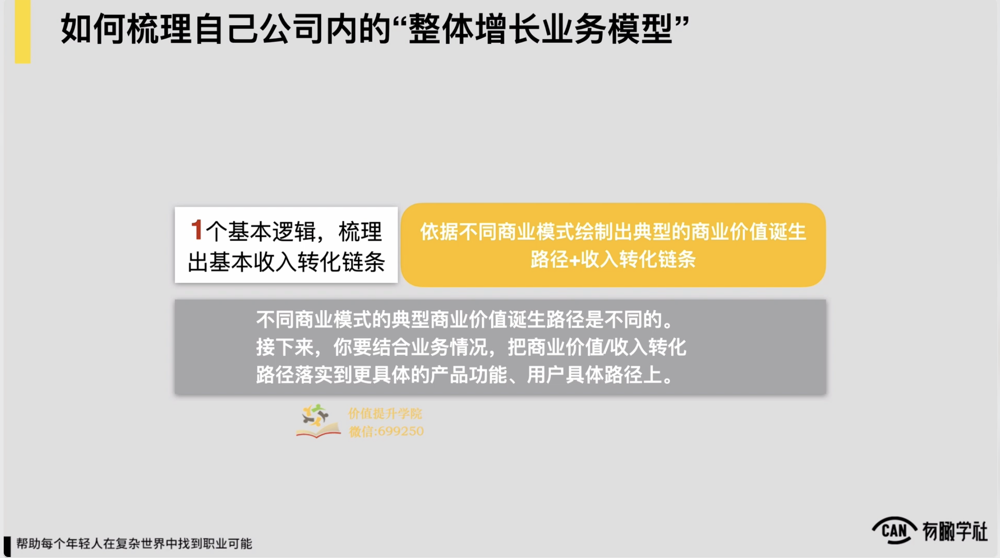

所以上面我们提到的要梳理一家公司处理体增长业务模型它的一个基本逻辑，通过基本逻辑，你所在这家公司或你业务的一个增长业务模型就能搭出来一个还不错的雏形了。当然搭出雏形到最后细化成我们刚才讲到那几个case当中的样子，中间肯定还会遇到一些障碍，这些障碍我可能也不知道说到底我要梳理到什么程度，或者说判断一个业务模型是好还是不好的标准到底是什么

但是一定还会有这些障碍，所以在一个基本逻辑之外，我们要给到各位处理个1+4+3工具的第二层，那我们要通过4问题来帮助我们自己去完善和细化我们处理体的增长业务模型，让它变得更加的具体和扎实，也帮助完善一些自己的思考。

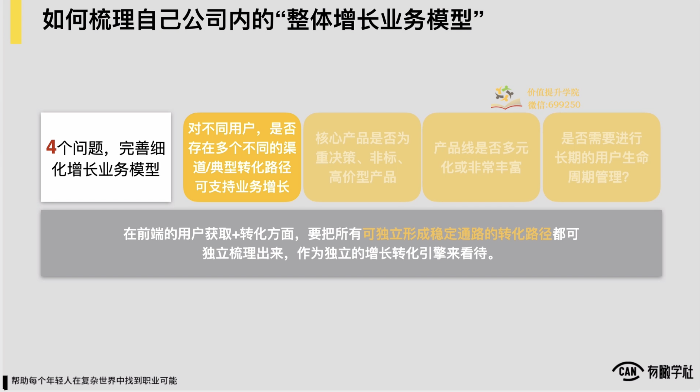

那么这4问题我们就依次来查看，首先是第一个问题，我们要问自己的第一个问题，如果我们通过前面的一个基本逻辑已经搭出来了，我们处理个业务在收入诞生或者说在增长转化上的一个基本的链条，随后我们要问自己的第一个问题，我们处理个增长转化或收入产生链条里边，我们是否存在说对不同用户或者是不同的渠道，然后我们的典型的转化路径和转化的一些玩法，增长的一些玩法是完全不一样的。

如果有，请各位记住，我们在前端的用户获取和转化方面，我们一定要把所有可以独立形成稳定通路的转化路径都要梳理出来，作为独立的一个增长转化引擎来看待。

这句话可能还是有点抽象，它到底是什么意思？

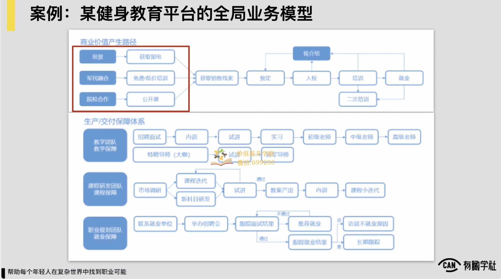

我们直接来看，例如在我们刚才看到的例子里面，某健身教育平台的全局应用模型，我们会看到在它的最前端关于怎么获取销售线索里面，它分出来了三条路径，对三条路径分别是第一个通过投放加上可能留一个表单对让用户就可留下他的一个个人资料，然后后边打电话触达他就ok了。第二个是通过军民的一些融合来做一些免费低价的培训，相当于前边有一个体验课，类似这样的这种认为来去获取一些销售线索。

第三个通过一些高校院校的这种合作，通过一些公开课来去获取到销售线索，你会发现这三种路径它获取线索的方式都是不一样的，但是它都能帮助我们业务能稳定地获取到一些线索，所以我们在梳理业务模型的时候，这三条路径就要分别各自去独立列出来。

，为什么要这样做？

在直接涉及到我们最后的收入公式到底会怎么来去陈列。

，因为我们一直在说我们处理体的增长业务模型梳理清楚了之后，对我们最大的价值，这家公司的收入公式它可以被我们梳理得十分清晰，我们就知道怎么来去驱动这家公司的收入或商业价值能获得增长。，所以当我们可能在前端的获客或在转化上存在这种多条路径，每一条路径都能稳定的给我们带来一定的这种收入或者像线索的时候，我们一定要把它分别列出来，在我们的业务模型里边作为几条独立的路径来看待，约意思。

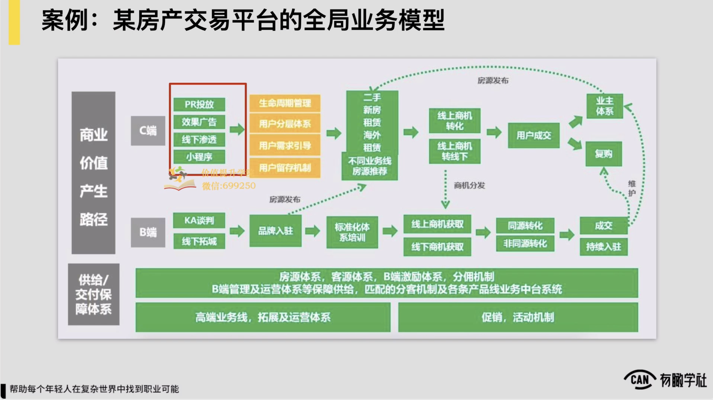

以及我们刚才也看到另外一个例子，就某房地产交易平台的全局业务模型上，约也是逻辑，就你会发现它在前端c端的前端获客上面，通过PR投放，通过效果广告，通过线下渗透和通过小程序都可以获取到一些这种销售线索的。当然这列出来的每一条线索，我们也没有必要说我非要穷尽对我列出来的每一条路径，它都一定是说要能给我们稳定持续的能带来一些我们的线索，或者说我们的收入，或者说我们的订单或者我们的这种用户增长一定要是稳定持续的，这样我们就把它放在处理个我们的业务模型里面。

&#x20;Ok了，约意思。

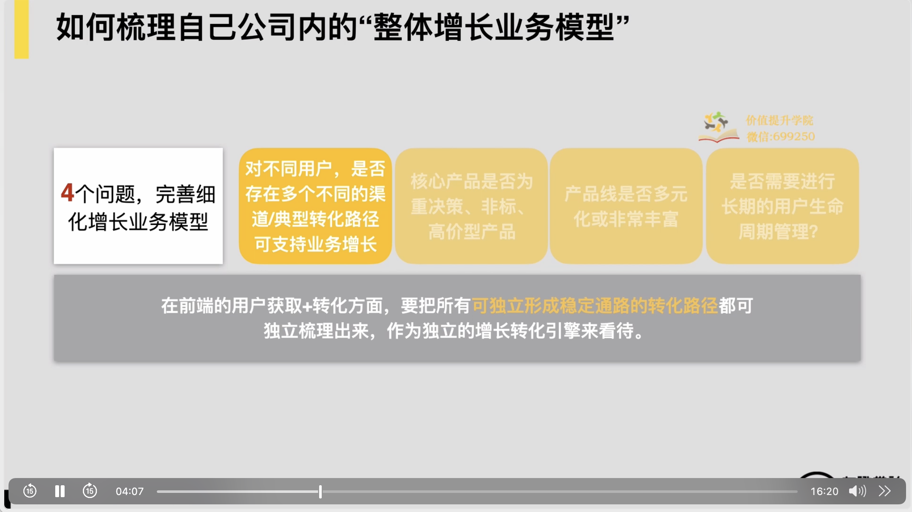

所以这帮助细化自己的处理体增长业务模型的4问题当中，第一问，我们要思考我们的业务当中，当我们有了一个收入转化的路径之后，是否我们业务当中存在说不同的用户它存在多个不同的这种渠道或者典型转化路径，可以支撑我们的业务增长的，如果有我们就把它分别要去列出来，这是第一个问题。

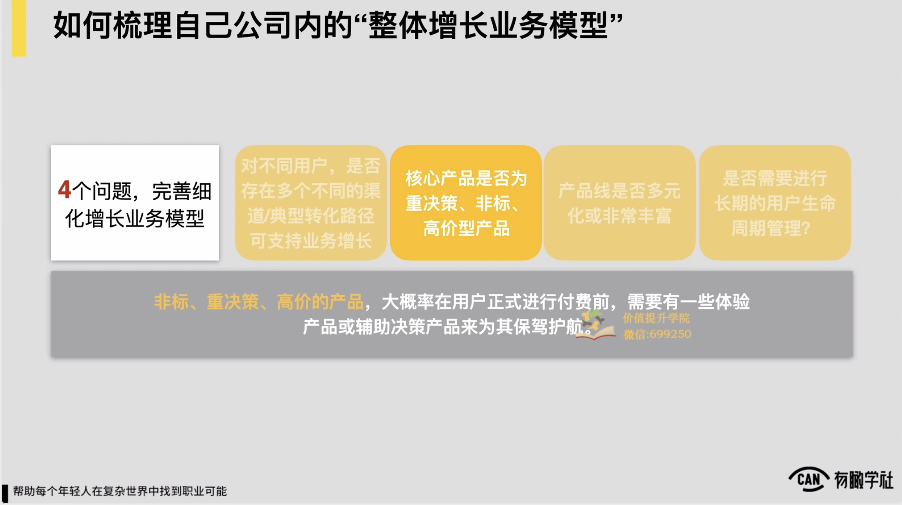

随后要问自己的第二个问题什么？我们要去思考我们公司的核心产品是否一种说重决策非标高价的这么一个产品。

，问完问题之后，他会怎么帮助梳理我们处理体增长的业务模型，它背后存在这么一个逻辑，说非标重决策和高价的一些产品。

例如像什么例如买房或者说买一个高价的课程，或者说像一家公司要采购一套复杂的系统等等，这些产品一般来讲它的要么就价格很高，要么就决策方可能十分的多，所以决策会较为复杂，然后并且一个产品在市面上可能也不是那么标准的，它是一个非标品，就像例如我一家公司要采购一个咨询服务之类的，它是一个非标品

对这些产品你要让用户正式进行付费之前，约率是需要有一些体验产品，或者说辅助决策型产品来为你的业务保驾护航的。

，包括说各位经常看到的，可能在一些教育产品里边有一些针对用户学习情况或能力情况的测评，包括可能对像房地产公司都有一些定期的组织的这种主题的看房活动，包括像很多咨询公司也都会有一些较为轻的这种什么公开课，或像一些体验的这样的这种产品等等，这些都是属于说它业务当中的这种体验产品，或者说辅助决策性产品。

所以这是你可以在梳理处理体增长业务模型的时候问自己的第二个问题，如果你公司的产品核心产品是这么一种认为对在你处理个增长转化链条上，肯定得加入一个重要的环节，你必须要把大量的流量引入到你的体验产品或者辅助决策产品上。

，所以这是所谓4问题中的第二问。

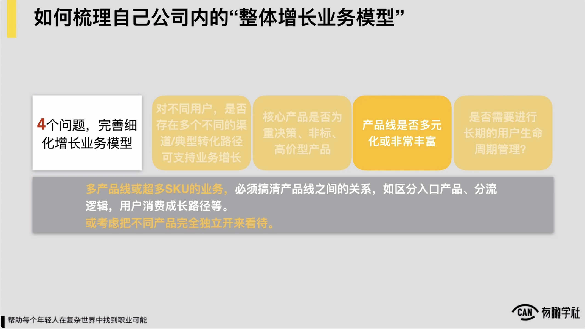

那么第三个问题是什么？第三个问题就十分重要了，那说我们公司的产品线是否是多元化的或者是十分丰富的？这里边问完问题之后，它会引发一个重要的行动，我们的多产品线或者超多sku的这样的这种业务，我们自己在梳理业务模型之后，就必须要进行清楚我们各个产品线之间的关系。

，例如我们要区分我们的入口产品，各个产品线之间流量进来之后，它的分流逻辑是怎样的，包括说背后用户是否存在一个他消费的典型的复购路径，或者说用户的这种成长路径之类的，必须要把逻辑梳理清楚，或者是要么你干脆就考虑把不同的产品完全独立开来看，也说a和b这两个产品，它对应的可能独立的两个业务模型，甚至配套的也是两个独立的团队来分别去负责，这样也会较为清楚和简单。

不然就容易出现一种什么状态，就容易出现说可能你公司里边有n多的产品线，这产品线之间关系又不清楚，所以直接就导致说各产品线在上线之后都在抢流量，或者说对于你的决策和判断来讲，到底我现在资源就这么多，我就一个团队去做推广和引流对我到底推个产品不推个产品，我判断不了，就根本没有一个逻辑了，所以问题是十分重要的。

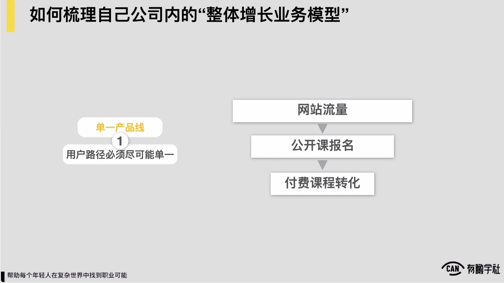

所以问题问完之后，一定会推导出来一个行动和结论。如果我们公司的产品线是较为单一的，我们处理体例如收入诞生的路径或用户转化的路径，肯定就要尽可能的单一，让我们处理体的这种业务的模型和业务的链条才足够简单，更容易被驱动。

例如假设这是一家在线教育公司卖的课程，拢共只有一门课，对理论上典型转化路径就说外边流量到一个公开课，再到付费课程转化，这样是最简单的最容易驱动的转化路径，尽可能的要单一就ok了。

，这是一种情况，产品线单一的情况，相反如果产品线十分的多元和丰富，就像刚才说的这时候必须要去考虑我们产品线之间的分类和各产品线之间的关系。

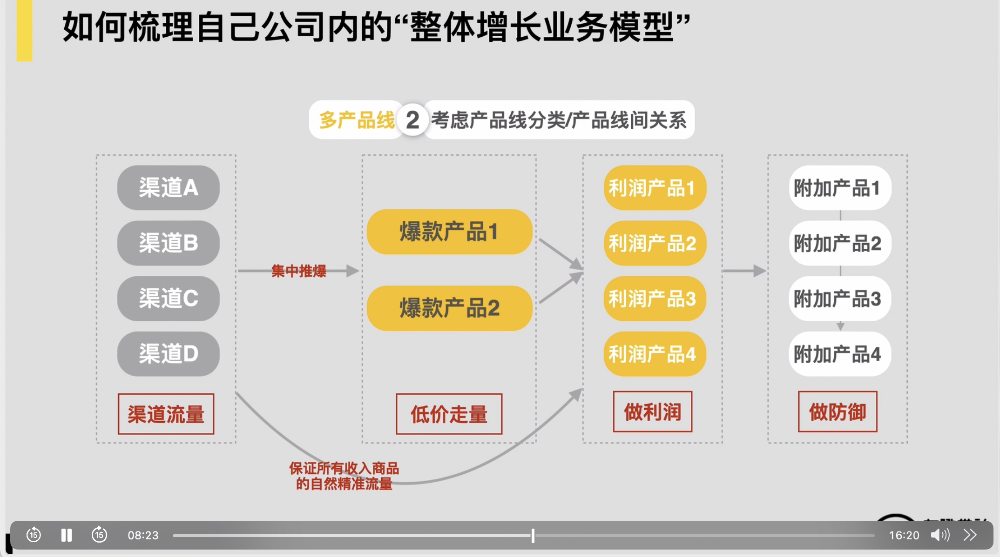

这儿我们给各位展示了一个例子，例子是某家电商公司，他们公司里边可能说产品线会十分的多，可能约有个几百个sq约这么一个认为，在这样的情况下，为了让它的业务更容易被驱动，为了让它的增长更加的容易被管理和持续，对他们的产品线就做了这么一个区分。

然后他们的产品约就分成三类，第一类产品他们叫做爆款产品，对爆款产品他们的预期说单价变得十分低，但肯定挣不到钱，他们核心用爆款产品来做什么，走量就ok了，所以爆款产品他们这些产品上线之后的定位就必须要打爆，必须例如每个月至少可能卖个几万单以上的这样的这种订单，事才算有意义，这是第一类产品。

第二类产品是叫做他们的核心利润，产品，利润产品是什么意思？说我每卖一个出去，我一定要能赚到钱，我的利润空间是足够的对所以这是它的第二类产品叫利润产品。它的基本逻辑说我是通过爆款产品来给利润产品带货，也说我让很多的用户在先体验了我的一款爆款产品之后，我会针对这些用户来做后续一些复购的这样的这种引导，对来让我能更好挣到钱，这是第二类产品。

那么它的第三类产品叫做附加产品或叫做防御型产品。这种产品是什么意思？它是说我举个例子，好比像很多的这种手机的店铺，它核心的这种利润产品有某几款手机对但是你会发现手机这样产品有很多的周边用户购买周边的频次有些时候可能还十分的，然后那就会出现这种情况，例如一个用户买了一个手机，他肯定要买很多的周边，例如什么手机壳贴膜等等，手机壳贴膜这种东西，你说我要通过它来挣钱，这可能十分的，用户确实购买它的频次会更高

所以我做一家手机店铺，理论上为了给用户提供更一体化的服务，或者让一个用户他能把他消费行为都尽量留在我的店铺里边，你发现很多时候我就尽量还是提供一些像贴膜壳或者一些手机的这种周边等等，要提供一些这样的产品，这些产品对我而言叫做防御型产品，为什么叫防御型产品？因为我店铺如果没有，用户就会纷纷跑到其他店铺去买，他买的频次还很高，如果其他店铺如果大量这样的产品，把很多用户他的消费习惯都粘在那之后，你会发现将来也许用户就不到我的店铺来逛了，所以会存在这么一类产品叫做防御型产品。

所以这家电商公司当他把他产品线做了这样的一个分类之后，他发现他产品线之间的关系相对较为清晰了，基本说集中推爆款产品，然后爆款产品带我的利润产品来赚钱，最后后边有些防御产品，防御产品就满足用户的消费需求和一些消费场景的，卖多少挣不挣钱可能都还因此，我主要挣钱的东西还是利润产品，所以我的产品线约就这么一些分类。

当分类清楚之后，你发现我处理体的运营的这种策略也就较为清晰了，外边有ABCD4渠道，我在这4渠道上，反正把流量核心就导到我的爆款产品1和2上面，让这爆款产品集中一定要可推爆就ok了，这样你发现我内部几个团队之间的这种分综合和业务逻辑都会是十分清晰的，不会出现那种说我有几百个sq，我前面这4渠道，然后几百skew我还都纷纷渠道都要管都要推，那一定管不过来，我的业务一定要经营不好的。，所以处理体增长业务模型里边有一个十分重要的问题，我要去看我公司内部产品线是否十分多十分丰富，如果是我一定要去给产品做分类，并且要进行清楚产品线之间的关系，这是一个十分重要的问题。

因此，那么最后我们的第四个问题，第四个问题是这样的，我们这样一个产品和业务当中是否需要进行长期的用户生命周期管理和维护？

，这直接涉及到说我们向用户提供的服务对到底是说是那种用户的使用周期和频次会很短的使用个一两次马上就走了，用完即走。这样的一个这种产品和服务，还是说我们是需要用户长期持续的使用养成习惯，持续粘在我们这儿的。如果是所有用户生命周期较长的产品，必然会涉及到说让用户在成为注册或付费用户后，我们需要有一套成熟的用户运营的体系来来对用户进行粘性或者复购等等这方面的一些管理，所以问题也是帮助把我们的处理体增长业务模型会梳理的更加的细致的。

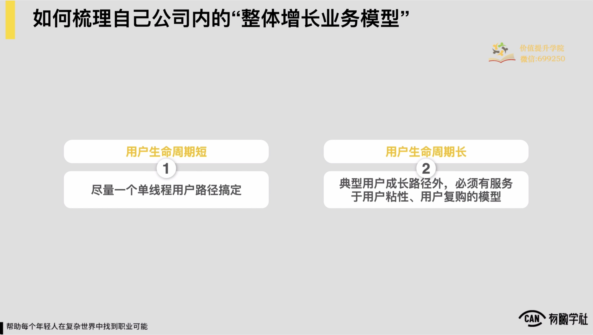

对具体展开来一下，如果我们的用户使用生命周期是较为短的，肯定我们的业务模型里边增长的业务模型里边肯定也是尽量一个单线程的用户路径就完成了，如果我们的用户使用生命周期是更长的，肯定就会存在说我们典型用户的使用成长路径之外，肯定要有一些服务于用户粘性用户复购的这么一些体系或是模型来去支撑它。

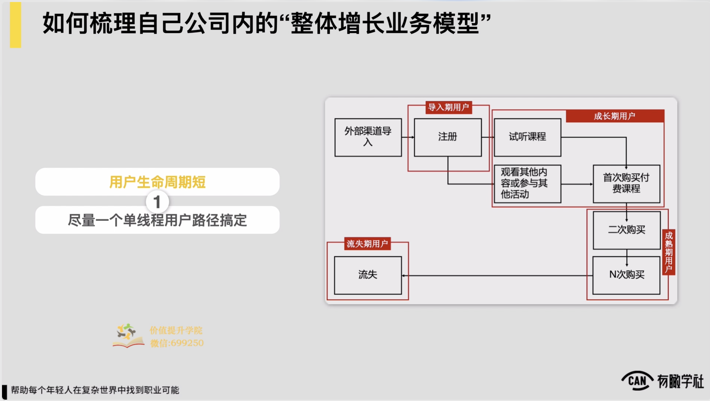

例如假设我们的用户生命周期是较为短的，例如就像什么托福雅思这样的一个这种业务，然后我们处理体的增长业务模型核心一个用户的路径，外部渠道导入对然后完成注册领取试听课。随后有个转化逻辑让用户完成首次购买，然后随后可能最多有个二次附加的一些购买，随后可能就不需要他留在我们产品里边了，就流失了，所以我们处理体的增长业务模型约就这么几步，就这么一个简单路径就足够了，这是用户生命周期短的情况下。

相反如果我们用户生命周期是较为长的，例如一个用户可能要在我们产品里边持续，我们希望它典型的状态下，持续使用个2\~3年，例如像懂球帝这样的这种产品，肯定说用户使用完了之后，他肯定希望让很多用户养成使用习惯，长期成为忠实的这样的一种用户。

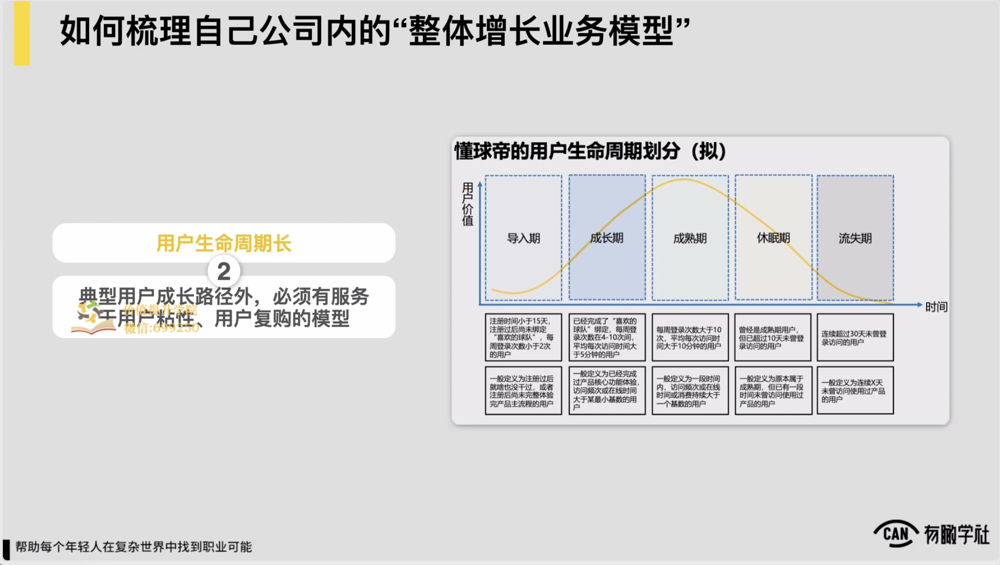

所以那懂球帝这样的产品一定会是到说在用户完成注册使用和出色流程之后，他后边一定会有一个基于用户的生命周期做长期用户的分层和长期用户的维系这样的一个这种逻辑。

屏幕上的这张图各位看到的一个懂球帝站内用户生命周期划分和用户生命周期管理体系的一个基本的用户分层的逻辑，他依照一个什么样的标准和规则去给他站内的不同阶段的用户做划分，以及可能针对每一类用户，他随后可能都会有一些针对性运营策略，是一个简单的这种用户分层运营体系的基础的雏形。

，约这么一个认为。

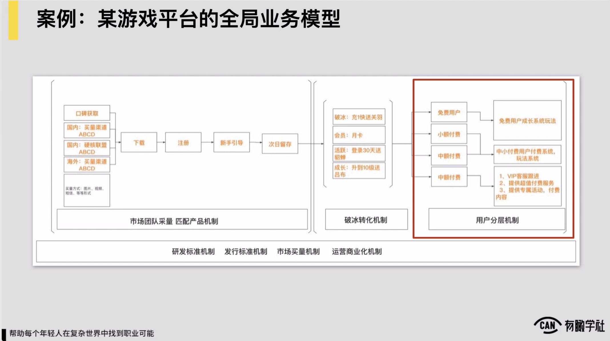

然后随后我们回到我们前面举过几个案例里边去，你会发现我们前面提到游戏平台，它的全局应用模型里面，我们最后的这么一个用户分层的机制，或者说用户成长体系的这么一个机制，它我们所提到的，我们希望用户长期留在我们的平台里面，它会持续的来使用

然后所以我们就在用户首次的注册体验加上首次破冰转化了之后，我们后边有了这么一套用户分层的一个运营机制。

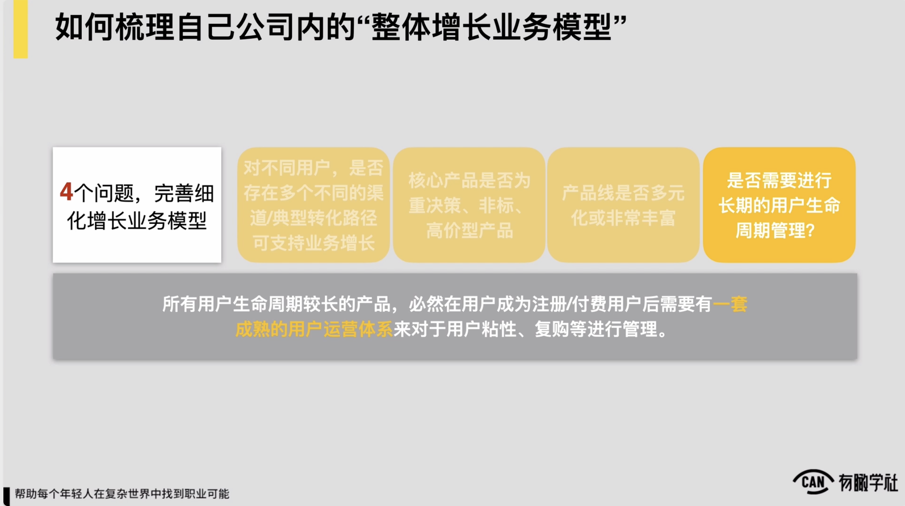

这里边它有两个逻辑，第一个是把用户做不同的分层对免费用户、小额付费用户、中额付费用户和大额付费的这样的一种用户对做了这么一个分层，并且针对这几个层次之间的用户，他还有一套用户成长体系的一个逻辑，每一层的用户我会给到他一些什么样的运营策略，给到他一些什么样的权益或者是福利对通过这么一套机制最终来完成第一个你长期黏住我们的用户。

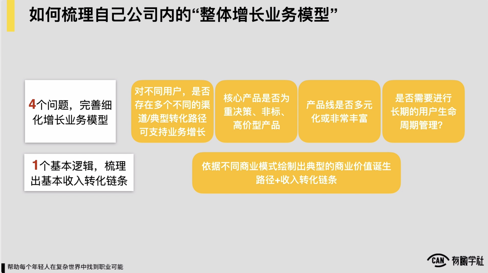

第二个把我们站内所有这些用户他的这种价值去给它最大化。这我们要问自己的第四个问题，到底我们的用户是否会长期的使用我们的产品？我们要不要对用户做这种长生命周期的管理和维护，问题也会帮助我们更好的细化我们的增长全局的一个业务模型。到此为止，我们的1+4可能就给各位分享完了一个基本逻辑加上4问题。
