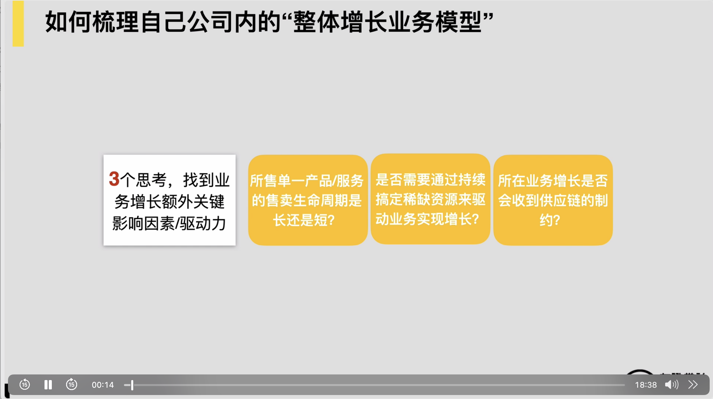
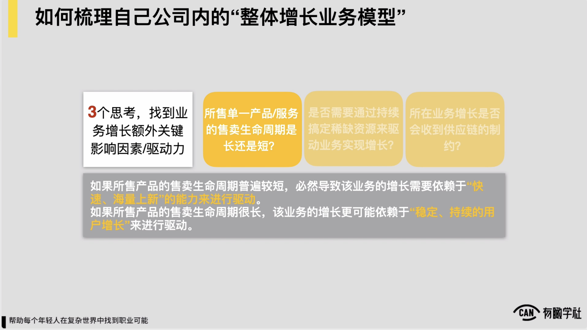
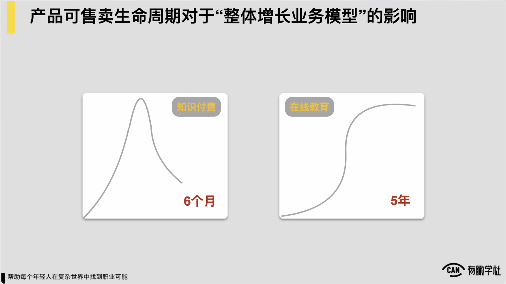
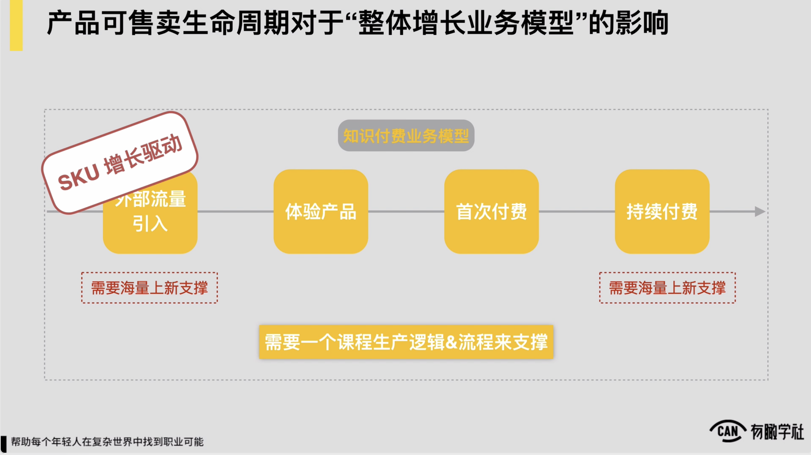
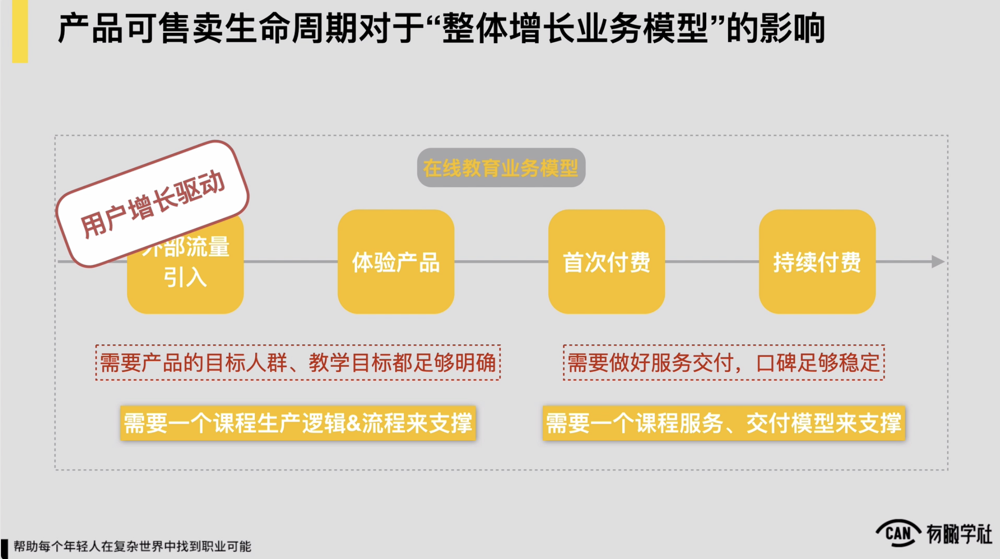
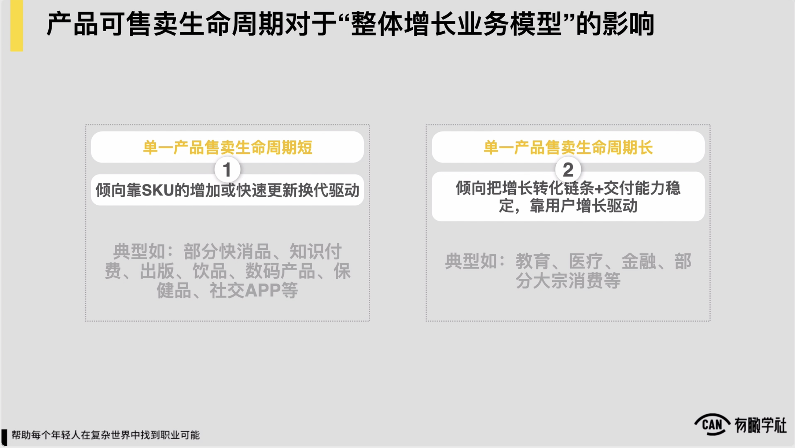
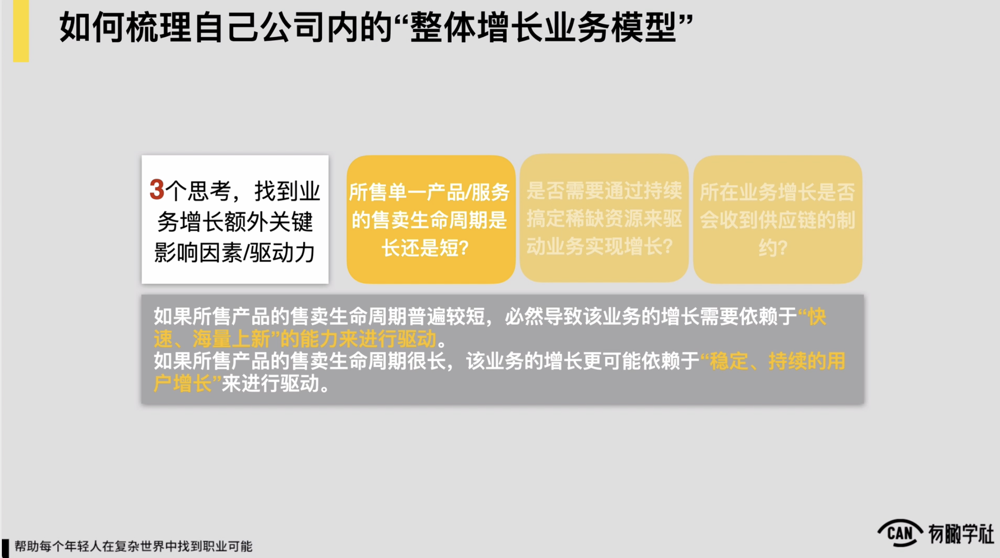
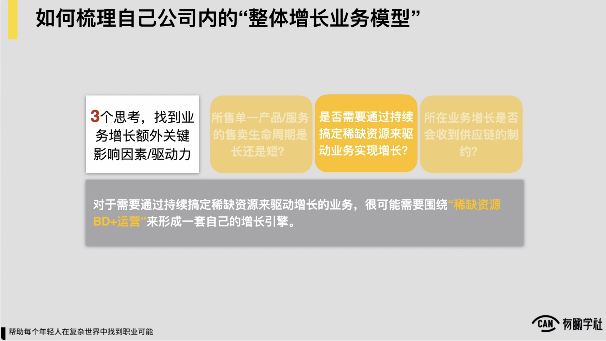
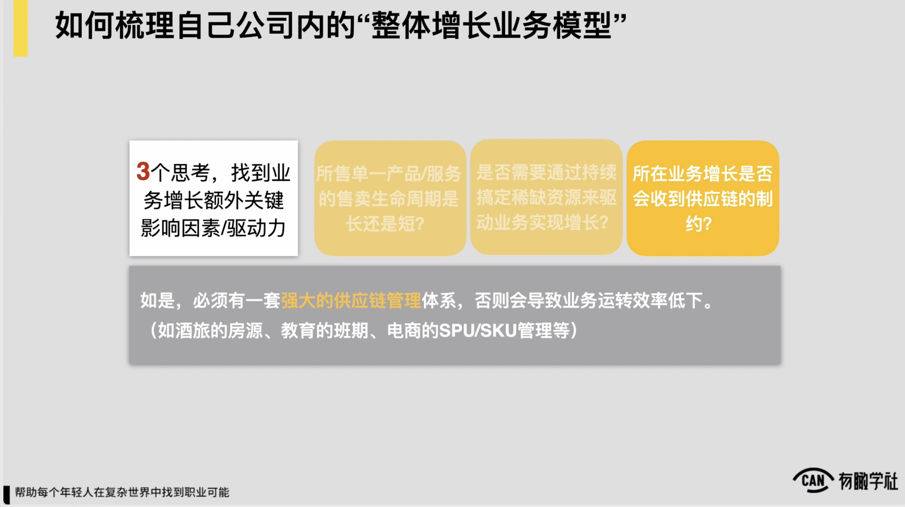
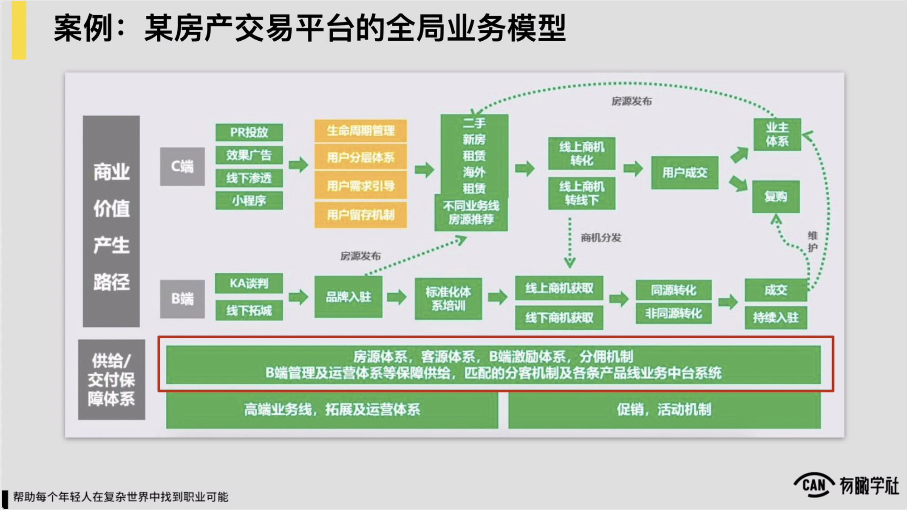

# 2.3.3 三个思考

随后除了1+4之外，我们还有3，三是什么？还有三个额外的思考，通过这三个额外的思考，我们上边通过1+4已经把我们处理体增长业务模型梳理的可能较为细致了，基本能做到了，但是为了帮助我们更好去找到说我们的业务的增长还会不会受到一些额外的关键因素的影响，我们还会有三个重要的思考，我们也依次来查看这三个思考方向。

第一个思考方向叫做你所售卖的单一产品或者服务，它的售卖生命周期到底是长还是短？问题是这样的，如果你所售卖的产品它的售卖生命周期普遍较短，例如你说我上线一个产品或一个服务，最多就只能卖几个月，几个月之后这东西卖不动了，对必然会导致什么？必然会导致业务它的增长很需要依赖于快速海量上新的这样的能力来去进行驱动。

所以你在你的业务模型当中，一定要有一块海量持续的这种快速上新的一个业务的逻辑来支持你的业务增长的模型。，然后这是一个逻辑，但相反如果你所售卖的产品的生命周期，售卖生命周期较为长，例如一个产品上线至少卖个好几年时间，这样业务的增长就更可能稳定依赖于说它的持续稳定的这种用户获取和用户的增长来去进行驱动。，所以这是问题背后会导致的两种不同的分支。

为了让各位更好理解问题，到底对于我们的处理体增长业务模型有什么样的影响？

我们在这儿也给各位讲一个真实的例子，对例子是这样的，在2019年的上半年的时候，我们在三节课处理体回顾了一下这三节课过去上线过的所有的课程，以及也在行业里边找了很多知识付费类的课程，它的一个售卖的数据来做对比，前前后后约看了有个100多个课程它的一个售卖的情况。

然后在当中我们就发现典型的所有的课程，它的销售数据变化的曲线，满打满算通常无外乎就两种，对两种？第一种约这么一个这种曲线。，通常绝大部分知识付费的课程和少量三节课的课程都会符合曲线。典型是什么认为？上线之后头两个月时间里边迅速打爆，打包完了之后，好它的售卖的数据就快速开始下滑，慢慢就滑落到一个低点，达到一个低点之后，通常后边就再也不会回来了。这是一种典型的它的销售收入的变化的曲线。

另外一类曲线通常是三节课的另外一类课程，就像早年三节课的像什么运营PE的课程，包括像什么增长黑客的课程，高阶用户体系的课程等等，然后都近似于这样的曲线，它是一个什么认为？就初期投上线半年以内，它的收入增长和订单增长的数据都十分的缓慢。

，但是慢慢的它会逐渐的升高，逐渐慢慢缓慢的升高，通常是一种说第一年假设我可能就卖个50万，第二年我卖了100多万，第三年我卖了三四百万，第四年我还在涨对可能又卖到约可能有个六七百万的样子，约是这么一个曲线，对。

然后显著前一类的课程和产品，我们发现它的可售卖的生命周期通常就在6月，前6月时间一个课程上，他获取收入通常占了处理个课程收入的超过90%以上。，然后后边这一类课程，我们发现它的售卖生命周期能达到5年之久，到底是什么造成了这两种巨大的差别？在三节课的课程里面也有一小部分课程，它的一个售卖数据变化曲线也是我们左半边这样的一个样子的，所以我们也把这些课程就做了大量的对比和研究，最后就发现一个有趣的种结论。

我们发现但凡是主打大IP主打话题的这样的这种课程，一般来讲它售卖生命曲线都会像左边图一样更接近于左边这样一个图。

而但凡是三节课内，比如像早年我们提到的什么运营PT产品，PEA的课程，你发现这样的课程并没有主打说个大IP个十分好题对然后相反它的一个售卖生命周期的这种曲线会更接近于像右边图一样。

这儿各位想必就很好奇了，一般来讲一个课程有大IP，有很好题，有很高的势能，这不好事吗？为什么它的生脉生命周期反而会变短，对我们也做了大量调研，最后发现这件事儿它跟一个学习产品内在的本质是十分相关的。什么意思？例如假设说我们推了一门课程，主打的是黄友灿，黄永灿讲了一个课十分牛逼，你必须得来买对这时候你会发现，因为我们主推是黄永灿这个人，很多人来报名这个课，他可能并没有稳定明确的学习预期。

，我只是知道说黄灿讲了一个课，这课牛逼，然后于是很多人可能都纷纷就跑来就付钱报了一个课程，但这当中每个人的预期是完全不一样的。

然后有的人觉得说我想找到一份运营的工作，有的人纯好奇，就觉得说黄灿好久没出来了，然后来听听看他到底讲了个什么样的东西，有什么新的思考，还有的人说我是一个创始人，我就过来可能就挖黄灿在坑里边有一些对象，我可以挖一下

你发现在这样的情况下，这门课程里边它的用户的构成，用户的预期都是十分离散十分分散的。如果当我的用户是这样千奇百怪的一个用户，我注定没有办法让我产品形成一个稳定的需求和稳定的交付预期，各位能理解吗？而当一个课程本身它的用户的预期十分分散的时候，课程注定不可能产生口碑。

，因为你肯定没办法，一个课程我满足十几种需求绝对做不到对但相反，当我们例如像p一p二的课程，或者像什么用户增长专家训练营类似这样的一种课程，我们的预期很明确，包括像现在的操盘手计划这样的课程预期十分明确，我们希望帮助各位从很多执行的岗位培养各位成为说ab类的操盘手，预期就十分聚焦十分清晰，相反如果说你不是这样的人，我们还会劝退你，对是这么一个认为。当我们的用户目标画像十分清晰，预期很明确的时候，这门课程它更有机会做出来足够好的交互效果和口碑。

而对于学习产品而言，当一个课程有了口碑之后，你发现它的售卖生命周期才可被拉长。

，所以这两类课程背后之所以会出现两种完全不一样的这种售卖订单增长的轨迹和售卖生命周期的差异，背后的逻辑在于这儿。

对这样的逻辑它会影响什么？这样逻辑必定就像我们前面讲的，它必定会影响说我同样是卖课程，也许看起来我在我的增长或者收入链条上，可能对支付费对教育都是这么一个链条，都是说我外部要找流量引入进来，然后有个体验产品转化一下，然后让他首次付费，后边我希望通过用户的什么老带新或者用户的二次消费对再去做持续付费，链条就这么一个链条。

但是对于知识付费而言，你发现在链条里边，它的对一家知识付费公司而言，在链条里它的收入要想持续增长，因为每一个产品注定只能卖最多6月，所以它一定需要海量的上新来支撑，它要有海量的这种话题选取和上新的这样的能力，这也是为什么各位会看到不管像得到喜马拉雅等等，对头部的支付费平台，它一定要每逢1\~2月或两三个月要不断的推陈出新，上线大量的这样的一种新的产品，不然它的收入增长是没有办法持续去维系和驱动的。

，所以它背后一定会有一个海量上新的客人生产逻辑和流程，来去帮助我们完善他公司的处理体的这么一个这种业务模型。，所以这样的一个业务模型就像我们前面讲到的，它就更偏sku的增长，sku的定期上新和更新迭代来去驱动的。

而对于教育来讲，对在线教育来讲，它的处理个收入产生链条也是这么一个链条。相对而言在它的业务逻辑里边，它可能并不需要有那么多海量的产品，他可能更需要什么？就像我们提到的，我们更需要说我们产品的目标人群，教学目标需求的足够明确，以及我们的服务交付要做的较为因此，口碑要足够稳定。只有做到了这样一个认为，我们一款产品才能做到说至少能卖4\~5年对所以相对而言对于一家教育公司而言，你发现它处理体增长的一个模型下边可能需要的是这么两套东西来去支撑。

第一个也是一个课程生产的逻辑和流程，但课程生产逻辑流程里边会更加的关注我们目标人群是否清晰，然后我们的教学目标设计是否合理，对但对于知识付费来讲，我们更关注的说我们怎么去快速的选出来很多爆款题，很多爆款的大IP，这么一个逻辑。

另外一块我们也需要一个课程服务和交付的模型来去支撑处理体增长的业务模型，这块就服务于我们的说交付和口碑足够稳定。所以你发现对于一个在线教育的业务，它的处理体增长的这么一个逻辑就更偏是用户增长来去驱动的，在一个稳定的链条下由用户增长来驱动，而不需要有海量的持续的上新。

所以有了这么一个例子，也许能帮各位更好的理解，就我们在第一个思考背后，然后它到底我们思考的答案怎么样，会怎么去影响我们的业务模型。

，最后我们再总结一下，就像我们提到的，如果我们当前所在这家公司是以主要售卖某些产品和服务为主营业务的，并且我们单一产品售卖生命周期较为短的，它的一个增长就更多的时候会倾向sku sq的增加，或者是快速更新迭代来去驱动。

，例如像部分的快消品知识付费，出版行业一些什么饮品、数码产品、保健品，甚至包括部分的社交APP，因为社交APP也是说用户可能很快对于某一类社交玩法就会感到厌倦，就会需要追求新的这种社交玩法，

所以它也会不断需要有新的社交玩法来驱动它的这种增长，所以约这么一个逻辑，这样的一些这种行业和公司，它是有更多的要靠sq的增加产品的更新迭代来去驱动它增长的。

而对于说单一产品售卖生命周期较为长的这样一种业务，他就更倾向于说把我们的增长转化链条和交付能力变得足够稳定，足够标准依靠我们的用户增长来去驱动典型，包括像教育、医疗、金融，还有部分的一些大宗消费，这些行业和这些领域里边，用户的需求在很长时间里边它都是恒定的，我并不追求说你在领域下，你说我小孩子要学语文学数学

你今天给我包装出来三个新课，明天给我包装出来三个新课有什么意义，我我就这么一个需求，我认为小孩子必须要他的作文能力要足够因此，对所以你只要有一个产品它交付能力足够稳定，产品卖5年8年甚至可能更长时间，都是有希望的。，所以在这样的这种业务里边，我们可能更多就靠用户增长驱动，在我们交付能力和转化链条足够稳定情况下，靠用户增长驱动就ok了。

因此，这是我们三个额外思考当中的第一个思考，所售的单一产品服务的售卖生命周期长还是短。

随后就进入到我们的第二个额外的思考是什么？说我们这么一个业务是否有必要通过持续完成一些稀缺的资源来驱动业务实现增长。如果对于一部分业务，它需要通过持续完成稀缺资源来驱动增长的这样的业务，很可能我们就必须要围绕着稀缺资源的BD和运营，这套体系对我们处理个的这种增长业务模型就十分重要了，那么围绕着东西来形成一套自己的增长引擎，这是什么意思？

举例子这位同学他的业务做线下的这种会展，对它做线下会展，它通常是说是按行业分别去做的，在行业里边一共就有两三家这种头部的一些比如像行业媒体，或者像一些行业协会之类的，从某种角度很可能对他而言我进行一场展会，或者我今年一共我5行业分别去打这几个行业的这种头部的行业协会，或者一些头部的媒体，我能完成多少家，通常就已经决定了我今年到底能做到多少收入，各位理解吗？

在背后的实质是这么一档子事儿，如果他们公司的业务想梳理一个他的收入公式，你发现他的收入公式是围绕着他到底能完成多少家行业协会，多少个行业的头部媒体，围绕着逻辑来去组织的，我完成一家，这部分对我就意味着一块收入，所以是这么一个认为。

同理可能还有一些业务，包括我们刚才提到的像房源的一个售卖租住平台在里面，包括以前我曾经做过的像招聘这样的这种业务，你都会发现在这样的这种业务里边，它是一个多边平台的这么一个业务，这样的业务里边一定会存在说供需两侧里头在某个阶段一定会有一侧有某些资源，它是较为稀缺的。

例如我还记得在2014年我们可能做 It互联网招聘的这么一个业务的时候，当时处理个行业里边都十分缺前端工程师，所以当时我们处理个围绕着我们站内的流量来怎么来去增长，我们就做一件事儿，能不能持续去BD进行到一批前端工程师的简历，一个月我们只要进行到三五百份前端工程师的简历，把它就放上来，面向行里边放出去，说你只要注册成我们招聘网站的用户

然后你就能看到这些简历，而我们的流量就蹭蹭往上涨。

我们站内的注册的企业数量，注册的上传的这种职位的数量就蹭蹭往上涨，所以约是这么一个逻辑。

所以各位一定要去思考，就你所在领域，你的业务里边是否有必要或者是否需要通过持续完成某些稀缺资源来驱动你的业务实现增长，或者说有一部分的稀缺资源能否成为你业务增长的一些核心的驱动力。你思考完了，如果是，一定有必要围绕地方单独去构建一套体系，构建一套运营的一个模型，且它一定是你的处理体增长业务模型当中必不可少的一部分，所以这是第二个的额外思考。

我们继续往下，我们1+4+3当中的最后一个额外思考是什么？我们要思考我们所在的业务它的增长是否会受到供应链的制约。因为有一些业务它的增长是十分依赖于供应链这块的一些能力的，如果你所在业务是这样的业务，那就必须要求你的处理体增长业务模型当中，它在下边必须有一套十分强大的供应链管理体系来支撑，否则一定会导致你的业务运转效率是低下的。

例如什么比如像酒旅的房源的这块的供给和管理，比如像教育行业教育业务的一些例如排班，然后老师的这种分配等等，然后这样的一些这种管理，包括我每个班级的满班率对然后怎么可管好它，包括像电商的一些sku和sku它的一个数量或者仓储库存的这么一个这种管理等等，这些东西都极大地影响着一个业务它的这种增长的空间，这是什么意思？这么说一下。

例如对于教育行业来，假设是例如你是在一家教育公司，你们公司只有三个老师，3老师例如带班，每个人一个月只能带一期班，一期班只有200人，换句话说你一个月能售卖的最多的订单顶天了，可能例如200或者最多一个月有两个人开班，就400订单，过了这400订单，对不起你没得卖了，你这家公司的收入上限就这么多，并且相对的因为你的班期是有限的，你还得要保证你的满班率。

换句话说是什么？例如你说我一个班上限是200人，我班只招了100人，我还得开

但开完之后我的服务的资源，我的供给的资源已经被占用了，意味着我在同期就不可能有其他的班期可售卖了，我增长的上限就一定会受到影响，所以我的供应链管理就必须要十分的强大，我的排班开班，它跟营销跟增长之间的售卖之间的关系到底是怎样的，我应该有一套什么样的体系，可去保证我的排班是足够合理的，还能保证说我每个班开出来，我的满班率至少在80%以上，

如果我做不到这一点，我处理个业务运转的效率就十分低下，相对的对酒旅电商，包括什么像滴滴出行等等类似这样的这种业务也是一样的。

，我们再来查看，例如我们前面举那个例子，房产交易平台的这么一个这种业务模型，你会发现房产交易这件事儿，它也是高度以地域为中心的，这一定会涉及到什么？例如我是一个房产交易平台，我业务的扩张，我一定会以地域或者以城市为中心去展开，

当我进入到一个城市之后，因为我是一个平台，一定涉及到说我城市里边我的供给侧的来源，我的房源的来源，能不能迅速的可有一定基数的保障，以及我可能不仅是说我常规的供给的数量有保障，我供给的质量在当中还要有一定保障，包括这里边是否涉及到，我可能一定要在城市里边第一时间第一批获取到一些什么类型的房源，一些更有稀缺性的这样的房源，对于我在城市里边去快速占领市场，快速扩张会更加有帮助，我必须要形成这么一套打法。

当打法形成之后，同理你会发现我在供给侧的一些保障体系里边，就像这张图上提到的，我的像房源体系，客源体系， B端这块的一些什么激励分佣体系等等，这些东西它是可帮助保证我的供应链供给侧的能力，跟我营销上的需求是可无缝衔接在一起，并且不会互相影响互相制约的。这我们所的，如果你的业务对它的增长会受到你供给侧的供应链这块的一些资源的制约，一定要求你在供给侧部分一定要有一套逻辑或有一套配套的这种业务运行的机制，来跟我们的营销增长之间形成联动，就更好支撑我们的营销和增长发生。
