# 2.3.4 案例串讲

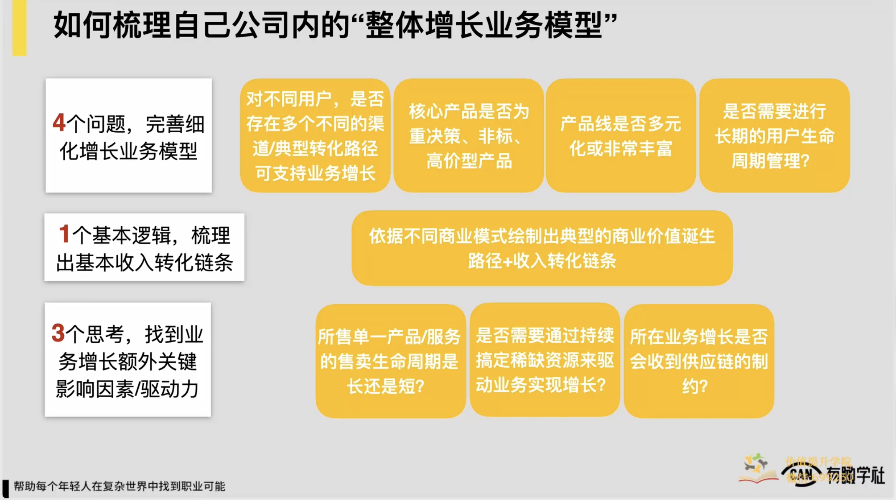

以上，到此为止，我们怎么去梳理出自己公司内处理体增长业务模型，我们就给完了工具了。1+4+3一个基本逻辑，4问题和3额外的思考，我们再来处理体串一遍，一个基本逻辑是说我们要依据我们公司不同的商业模式，绘制出这家公司典型的商业价值诞生路径，或者叫做收入转化的这样的一个链条。，这是我们第一个基本的步骤，要操作好的。基本步骤操作好之后，可能我们会遗漏掉一些重要的问题，所以我们必须要通过4问题帮助完善和细化我们增长的业务模型，或者我们处理个收入转化链条，把它变得更精细。

这4问题分别是说第一个我们要关注我们业务当中对不同用户是否存在有多个不同的典型转化路径或者是渠道，可以支持我们业务的增长，如果是，单独把这些不同的增长的引擎和链路都要梳理出来，在业务模型当中单独去呈现。

第二个我们的核心产品是否一种重决策非标高价的产品，如果是，处理个转化链条里边理论上一定应该去加入一个这种辅助决策型产品，或像体验型的产品，帮助用户去更好去决策的，这样我们的业务的处理个运转才足够高效。

第三个是说我们公司的这种售卖的产品线是否十分的多元化或者十分丰富，如果是，产品线之间到底是什么关系，些产品是入口产品，些产品是利润产品，些产品是主要用来做留存的或者促进用户活跃的这么一个产品，我们要把它梳理清楚。

然后以及第四个问题我们的业务当中是否需要进行长期的用户生命周期管理，我们是否需要用户长期的在我们这去使用或者是发生复购，如果是，我们后边也需要有一套这样的用户生命周期，我长期维系和管理的这么一套机制和体系来去支撑我们的增长的业务模型，这是4问题。

最后有3额外的思考，第一个思考是说我们所售的单一产品和服务，它的售卖生命周期是长还是短，如果是短，我们业务更多时候依赖于说我们海量的上新定期的产品迭代和更新，依赖这样的机制来去驱动它的增长，如果是长，我们只要说我们的转化和交付稳定，然后这两个东西保障以上，然后我们就依靠用户增长的驱动就ok了，这是第一个额外思考。

第二个额外思考就我们业务是否需要持续通过完成一些稀缺的资源来驱动业务实现增长，如果是，我们也要建立一套机制对怎么持续的发现这些稀缺资源怎么持续运营好这些稀缺资源，这需要的。

第三块说我们所在业务它的增长是否会受到供应链的制约，甚至可能有些时候我们供给侧的能力和我们供应链的资源直接驱动我们的增长。比如像滴滴和快滴打仗的时候对可能有一个时机，说你只要开了一个城城市下，你说我快速进行上了一批司机，我司机的数量是更多的，很可能在时间窗口里边滴滴和快递当中某一家，然后他们的在单个城市的订单的增长或流量的增长就会十分的迅速，这是我们处理个1+4+3的这么一个工具。

那么通常如果你要梳理你自己公司的处理体增长业务模型，把工具用因此，上述这些问题都过一遍，并且问题答案都能想明白，大部分业务的处理体增长业务模型你可能就能画明白了。为了佐证一下这件事，也让你有一个更深的感知，我们还是用几个案例来处理体串一下我们这样一个方法，1+4+3的这么一个工具。

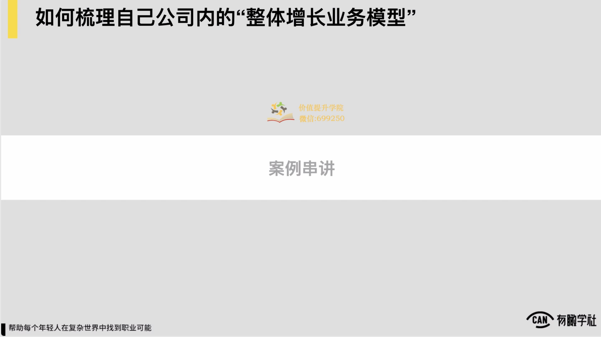

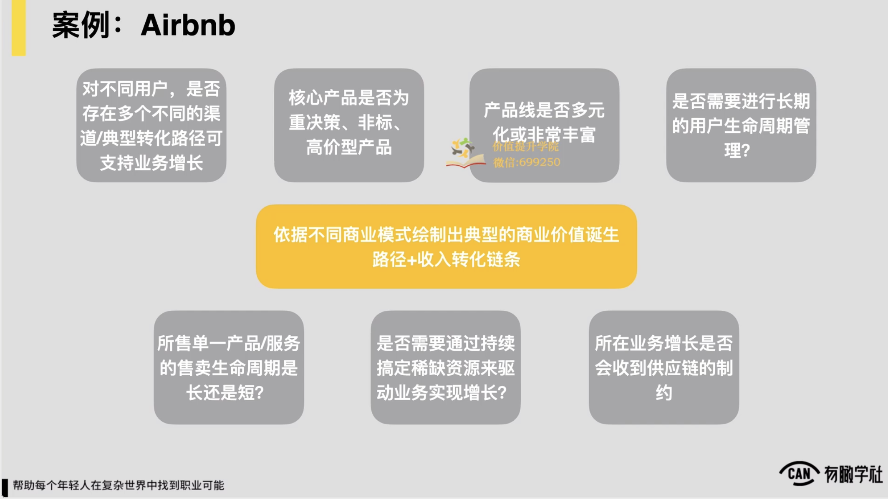

我们首先先用mbmb的案例来去过一下。我们的第一步，如果我们是mbmb这家公司的一名员工，那是我们的第一步，首先是一个基础逻辑，对我们依据abnb它这家公司的商业模式要先绘制出它一个典型的商业价值诞生和收入转化的链条，绘制出来之后，我们会发现冰币它本质上是一个平台撮合交易，然后抽佣的这么一个这种商业模式

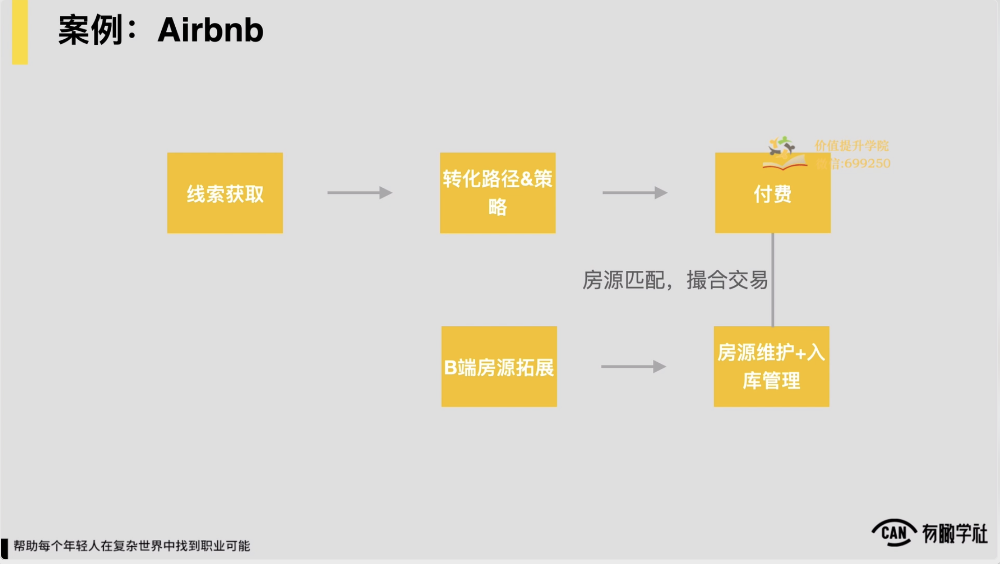

在商业模式下他肯定说c端这块会有一个线索获取加转化路径和策略，然后最后付费，然后b端这块肯定会有房源拓展加上入库维护的这么一个逻辑，中间就房源匹配来通过平台来撮合交易，所以我们就第一步先绘制出来这么一个简单的这样的业务的逻辑。

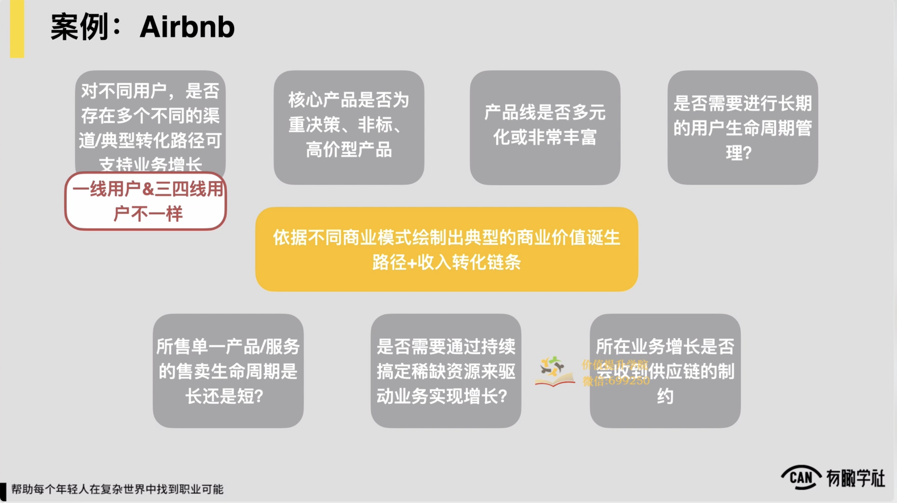

然后随后可能第二个问题，对不同用户是否存在多种不同的渠道和转化的这种路径，我们在地方问完之后，我们发现对NB来，它典型会存在一个状态，它的一线城市的用户和三四线城市的用户不太一样的。

这两个用户他需求不同，典型的转化路径可能相对来讲也不太一样，例如一线城市用户更多，因为像房屋的这种什么风格装修主题等等来去付费，而三四线城市用户更多可能看价格，所以逻辑不太一样，

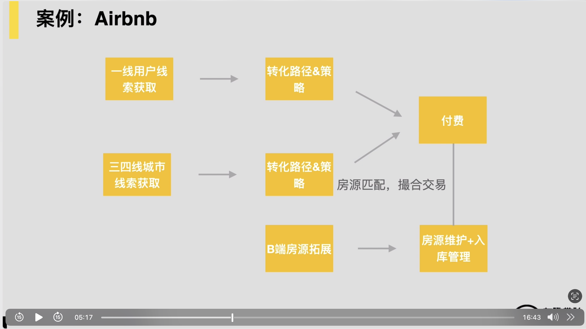

所以我们会发现在c端这块上对一线城市的用户的线索获取，还有转化路径和策略，还有三四线城市的用户的转化路径和策略，它得分开来看，所以我们把这两块就分别在处理个业务模型当中去作为两条路径分开来去呈现了。所以第二步通常我们就对业务模型做了这么1补充。

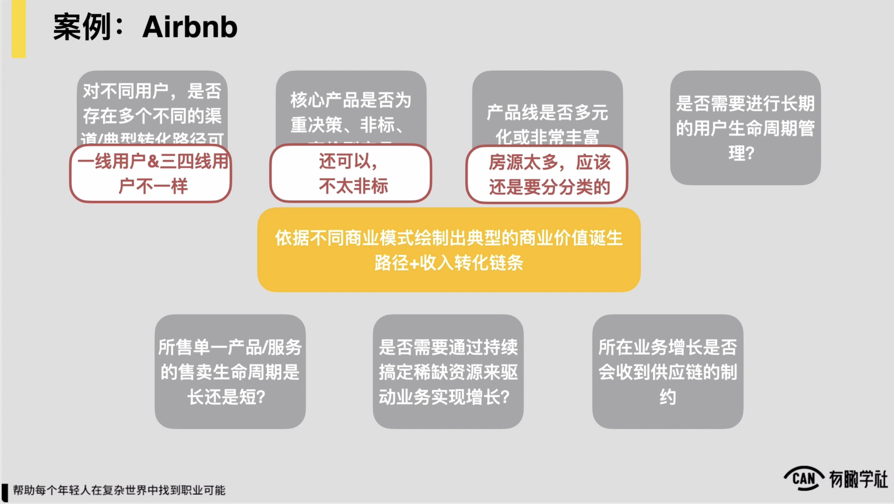

再随后我们继续进入到4问题当中的2和3，首先是说abnb的核心产品是否一种重决策非标高价的这么一个这种产品对相对而言对于住房对于旅行的这种住房来讲，还可以不太非标还是较为标准的，所以问题就不成立了，我们就不需要额外在上面加一些什么东西了。

随后是说它的产品线是否十分多元化或者十分的丰富，对我们会发现对mbnb的平台上来讲，它的房源还是十分多的，所以我们就认为对于不同类型的房源来讲，可能还是要稍微的分一分类的。

，所以分完类之后，我们可能又发现说似乎a类的房源对于一线城市的用户会更容易转化，而对于b类的房源对三四线城市用户更容易转化，并且我们都希望 Ab类房源可能放在前面，分别去转化这两个用户对将来在后边我们我们在引导这些用户持续在我们的平台上边去消费我们的更多的房源。

到这一步，我们就把之前提到的像b端那块房源拓展入库管理维护的这么一套这种体系，我们处理个就放在下边了，就把它当做一个说房源拓展配套服务，相关的这么一个供应链的管理体系，就拢共都放在下边可能就ok了，所以这是到这一步。

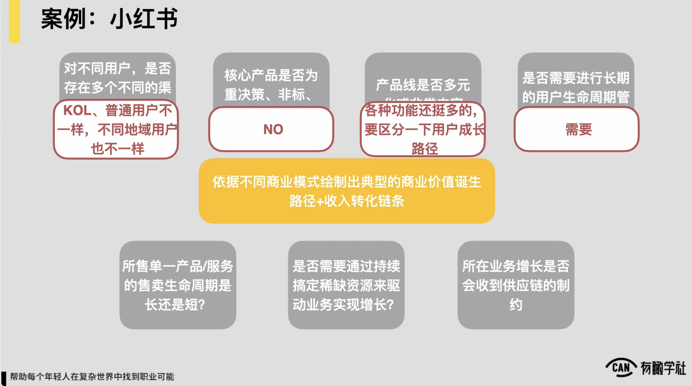

接着往下，对于我们的用户在mbnb这么一个平台上，我们的用户是否需要进行长期的用户生命周期管理？我们会发现显著还是需要的，因为对于说一个典型有这种什么旅行或者出行需求的用户对他的出行需求肯定说一年到头都存在，而且一年到头往少了说至少也会发生个例如四五次，如果他每一次出行都能使用我们的产品，使用我们的服务，对我们这么一个平台来说肯定是十分理想的。

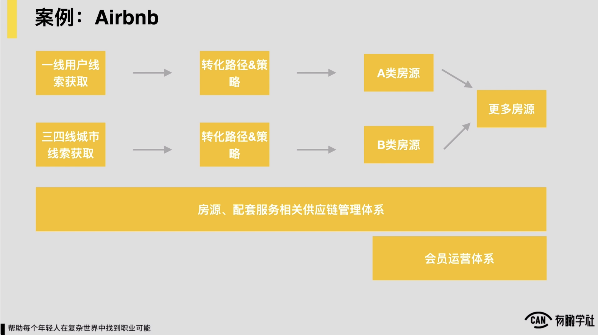

所以我要是对用户对做生命周期处理体的管理，部分可能在abnb这么一个平台上，我们就又做了一个我们的会员运营的体系，体系核心服务的说一个用户长期成为我们的会员之后，他持续在这会员享有一些权益对所以我们就通过这么一套体系来去做用户长期的复购或者叫做LTV的提升。，所以这我们的前面的4问题。

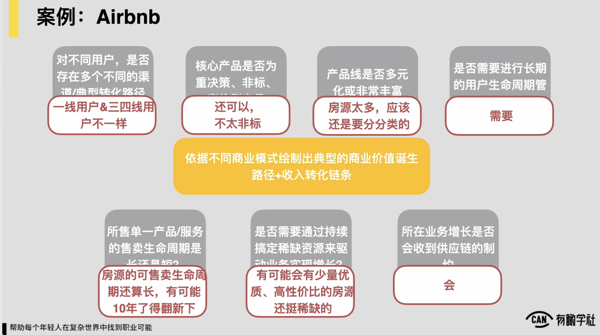

随后我们再查看下面的3额外的思考。第一个是说我们所售产品的单一产品售卖的生命周期到底是长还是短？在问题上房源的可售卖生命周期还算长的，最多有可能你说10年8年了，我们有些房子可能要翻新一下，所以不太存在说我们这样一个平台，它需要靠持续的上新来驱动增长，不太存在。

第二个是说我们是否需要通过持续完成一些稀缺资源来驱动我们业务的增长。

对这里边我们显著发现，尤其是针对像三四线城市用户来讲，会有少量优质并且高性价比的房源还是较为稀缺的，这些房源只要我们能想办法能进行到，然后在每个城市都持续能进行到，理论上它一定可在单一地区和城市下驱动我们的订单和用户来去增长。

，所以这是这么一个问题。再有一块我们所在的业务它的增长是否受到供应链的制约，部分也是显著需要的，所以例如我们每开一个城，每开一个地区，一定要有对应的这种供应链的逻辑来配合我们的业务来去开展。

于是当这些问题都梳理完，都回答完了之后，我们发现lbmb这家公司它的业务模型可能就变成了这么一个样子，在它的最下面又加了一块优质稀缺房源的这种拓展和运营的这么一套体系，我们在每个地区到底能不能持续拿到这些优质的一些房源，每拿到一个房源，我们该怎么去运营它，怎么把资源的价值放大到最大，我们需要有这么一套打法和这么一套逻辑。

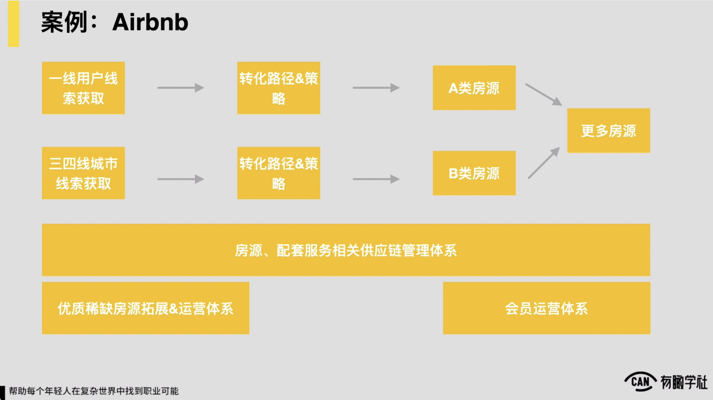

其他的部分刚才基本都有提到，包括我们供应链的管理部分，刚才也有提到，无非只不过在现有的视角下，我们要把它加入一个说他跟某个地区的订单需求之间有一个微妙的这种平衡，这里边需要有个逻辑对应的关系，把它去算清楚就ok了，所以这样处理个你发现1+4+3这么一个工具，处理个梳理完之后，mbnb这家公司它的一个处理体增长的这么一个业务模型基本就呈现在我面前了。

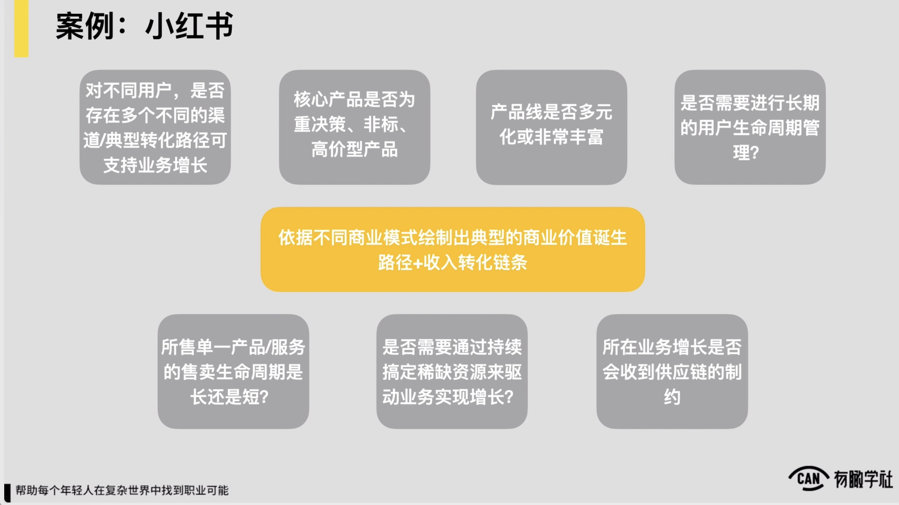

我们再稍微快速看两个例子，加强一点印象，对于我们1+4+3的这么一个工具稍微加强点印象。首先第一个例子看小红书，当然了小红书本身的业务还是较为复杂的，对它既有社区的业务，又有说像它的电商的这样的一块这种业务，在这儿我觉得我们为了把这件事儿变得简单一点，我们重点就聊它的社区APP这块的一个这种业务，它的流量这块这种业务就ok了，我们以来聊一下。

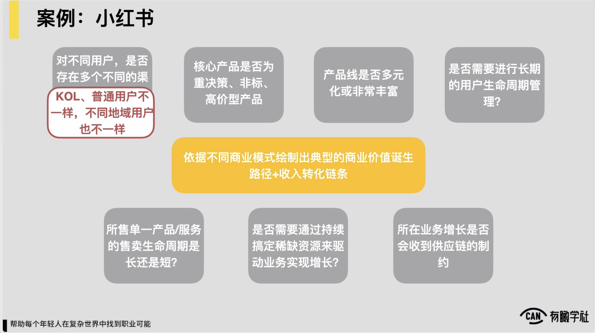

假设说我们要梳理小红书它的一个处理体业务增长的模型，首先还是我们先绘制出来它的一个典型商业价值诞生路径和收入转化链条，毫无疑问，如果我们只聊的是它APP和社区，它一定是一个做流量的生意对所以我们核心就把说他用户可能从外部渠道怎么来，怎么成为他的注册转化的这样的一个这种用户，后边怎么留存，怎么持续的活跃，就把这么一个基本路径可能先绘制出来就ok了，然后这是可能第一步。

随后第二步说我们要思考一下它对不同用户它的典型转化路径是否不一样，然后我们会发现首先它对于像站内的用户分为说ql和普通用户，这两群人互相之间可能还互成拉动的这么一个关系，以及不同地域的用户也不一样，也同样存在说一二线城市的用户和345线城市用户，看他的需求和典型的这种增长转化的路径，然后是不一样的，他们关注题肯定是完全不一样的，所以这两块路径在我们的处理个增长转化链条里边要把它分别摘开，然后单独去看，这是第一块。

随后第二块，我们的核心产品是否重角色非标高价产品，并不是，所以不用管了。再随后，我们的产品线是否多元化或十分丰富，我们发现小红书站内它各种的功能确实还十分多的，有一些可能工具属性的功能，有一些说社区这块的这种东西，社区这块有十分多的互动和可参与可使用的这样的这种产品功能，所以我们一定要区分一下用户的成长路径，到底用户先进来应该引导他去到个产品模块，去到个功能线下

包括些功能更应该放在外边来做引流的作用，引流过来之后，随后用户应该往走对我们要梳理一下用户典型成长和它留存活跃的这么一个路径。这块梳理清楚之后，我们处理体的业务模型上边可能要做一些调处理，再随后是否需要进行长期的用户生命周期管理，一定需要的。然后所以我们一定会有一个用户生命周期管理的体系，甚至可能这里边也会有说精细化运营，把用户分成的这么一套体系来辅助我们，把处理体用户的这种粘性和长期价值和活跃度处理体去做最大程度的提升。

所以这是这么4问题，问完之后，我们分别对业务模型做完善的一些思路，再随后我们所受的单一产品的服务和售卖生命周期是否较为短，并不存在这个因素，所以不太受它影响。

然后我们是否需要通过持续完成一些稀缺资源来驱动业务增长？有需要的，例如像小红书的三类只看社区，它的ql好题，一些十分好的内容，有可能都是稀缺资源，我们可能得稍微摘一摘，有可能在某个阶段里边，我们持续能进行到一些好的care，或者进行到一些好的内容和话题，那都是有机会在站内帮助我们产品的增长和流量增长变得更加强势的。

，所以这块是有机会，可能我们做一套配套的运营机制，运营体系来驱动我们的增长的。在随后所在业务增长是否受到供应链的制约，可能并没有，所以在供应链这块可能就还好。这些小红书我们快速过了一下之后，约这么一个认为。

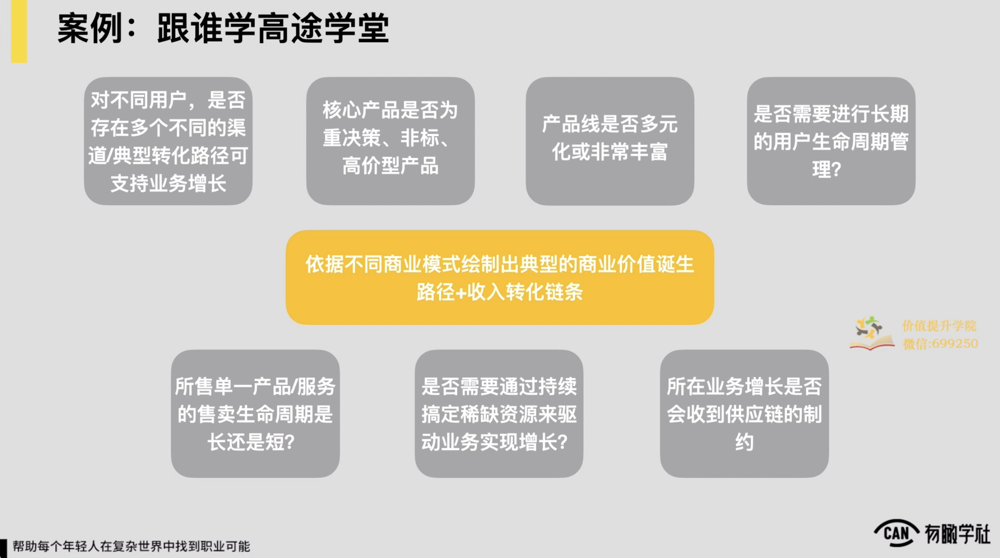

随后我们再看一个例子，这两年较为火的一家公司是跟谁学，它下面有一块业务叫高途学堂，主要也是一个面向k12的这么一个小班直播课的这种业务。同理，然后我们在业务下也是1+4+3这么一个逻辑过一遍，首先是说依据它的商业模式，绘制出它收入转化链条，因为它是一个在线教育的这么一个业务，所以他肯定核心的转化链条一个说外边流量有线索到试听体验课转化，然后真实付费，后边是续费，约这么一个收入转化链条。

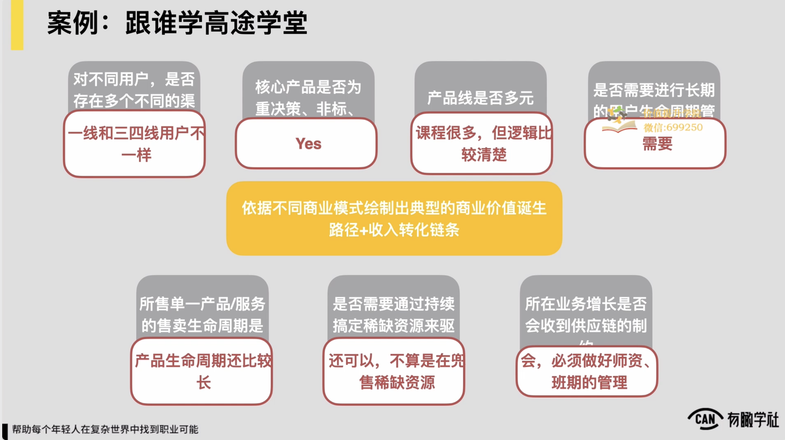

然后链条出来之后，我们进一步去细化它，首先对不同用户对它转化路径是否不一样，然后核心也是会存在说一线和三四线用户是不一样的，他需要的老师需要的课程的类型，需要题、需要的渠道可能都不一样，所以这两个用户我们就分开来看，前边也是就分开梳理两条，针对不同用户的路径，随后核心产品是否重决策非标高价产品？

课程肯定是的，然后你说我要报个一学期的课，至少大几千块

价格不算低，然后也相对非标，所以我一定要体验，所以它处理个转化路径里边一定会有体验和辅助决策的产品存在，再随后是说产品线是否多元化或十分丰富，它的课程都是很多的，只不过对k12的这种课程来讲，逻辑还较为清楚，核心说你从一年级开始上持续就续费到六年级就ok了，然后约就这么个逻辑，所以较为清楚和简单，所以倒不用说做更复杂的梳理和优化。

再随后是说是否需要进行长期的用户生命周期的这种管理，对这块可能还是需要的，尤其说对小孩子有可能报了你的课，在你这儿就有机会待个至少三四年或至少到他毕业，对我们对于长期用户生命周期的管理，有可能还是需要去做一些较为精细的这种运营的，定期可能做一些策略。

，所以这块有可能也需要有一套机制或体系。

再随后是说我们售卖的产品它的售卖生命周期长还是短，对于教育产品来说生命周期还较为长的，所以就还因此，然后是否需要持续通过完成稀缺资源来驱动，这块可能也还可以，因为像根据学这样的一种课程，它虽然也会存在说好一些老师讲得不因此，但各位对于说老师的认知并不像早年的像新东方的名师那样说罗永浩上课，然后我就一定要去，不像那种名师一样会让各位很趋之若鹜，所以还可以并不太算是在兜售稀缺资源，所以这块也不用管。

最后就所在业务增长是否会受到供应链的制约，一定会的，因为我们说了它是一个小班的课程对你说我一个老师开了一个小班，就只招了5人，对我老师的服务资源就极大的浪费和损耗了，我的工资还得照发，然后我的营销成本可能也并不低，

但我收入并没有对应的增长，很大的挑战了，所以我们必须要去做好我们师资班期这块的管理，它跟前端的这种流量之间的关系，必须要有一套体系和逻辑来去做好对应的供应链管理的关系。

所以这是跟谁学的？高途学堂的这么一个案例，通过以上的这么三个案例，希望让各位对于我们这样一个核心的工具，1+4+3一个基本逻辑，4辅助的问题加上三个额外的思考，来帮助把一家公司的处理体增长业务模型梳理清楚，对于工具应该有足够的熟悉度了。

