# 2.4 一些总结与提醒

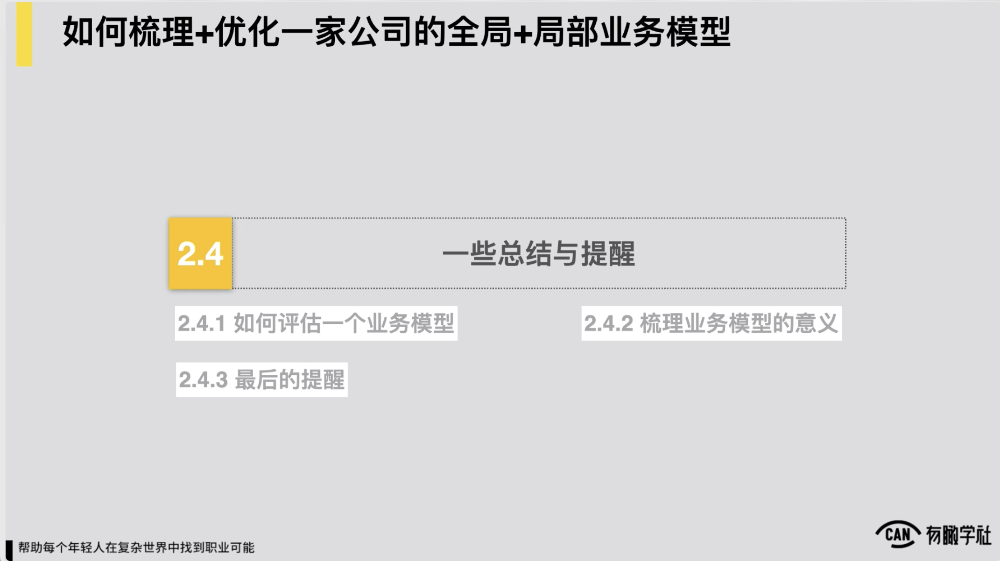

到这儿全局业务模型，我们约都给各位去分享了一些东西了，随后我们首先给各位去聊一个话题，到底怎么评估，一个业务模型好还是不好？

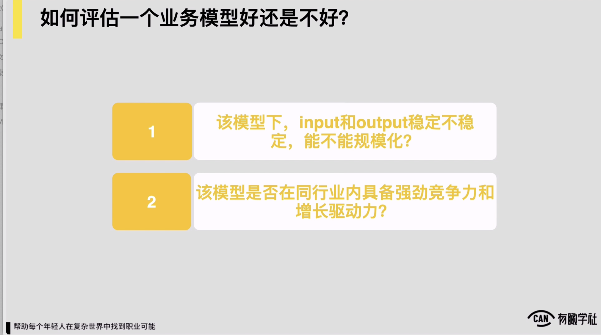

既然说到业务模型的竞争力，我们再来从另外一个角度深化一下各位对业务模型的理解。理解业务模型我认为它是有一个表象和内核的这么一个区分的，怎么理解？我觉得业务模型看起来它的表象对我们各位从直观认知上来，似乎一系列的流程图形和角色分工

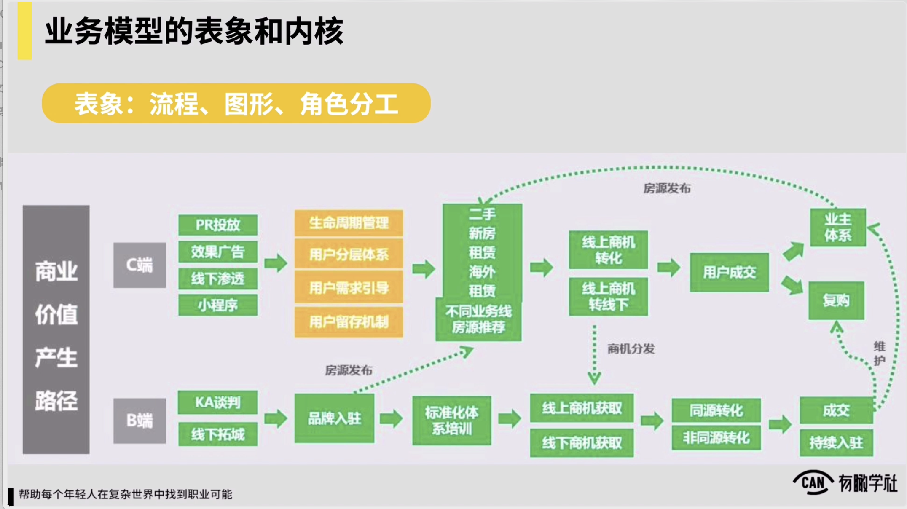

例如我们之前举过的这么一个例子，某房地产交易平台它的处理个的一个模型约长成这样对看起来一系列的流程图形，还有角色分工，但是实际上它的内核是什么？

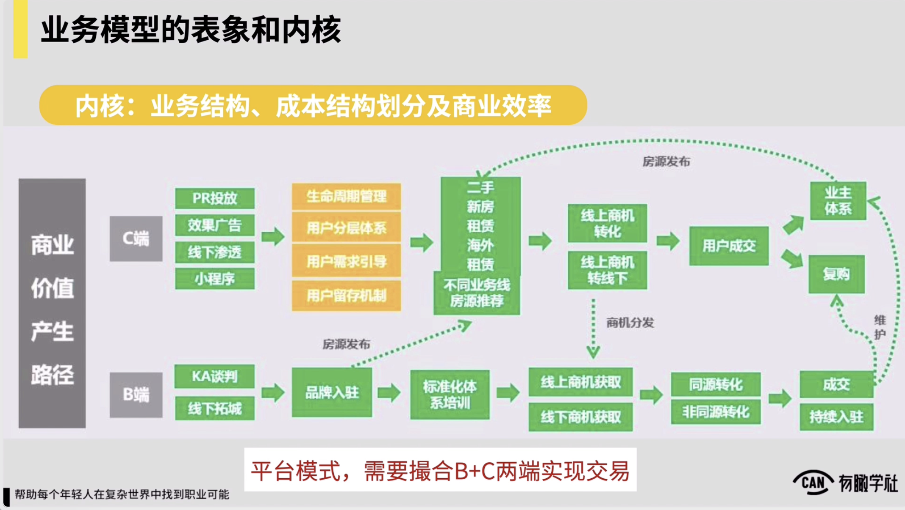

它的内核是说是一家公司的业务结构，成本结构的划分，还有商业效率对到底因为这样的业务模型产生什么样的变化？例如我们再来重新从内核的角度理解这么一个业务模型的时候，我们关注到几个重要的点。

第一我们会发现这家房地产交易平台，它的商业模式是个平台模式，它肯定是要撮合BC两端实现交易对所以在基础上它核心要看些数据，肯定会有说b端我的房源供给约是怎样的， C端我的流量的这种获取，还有我的交易量约是怎样的，从中我才能收取一系列的佣金或者是抽成

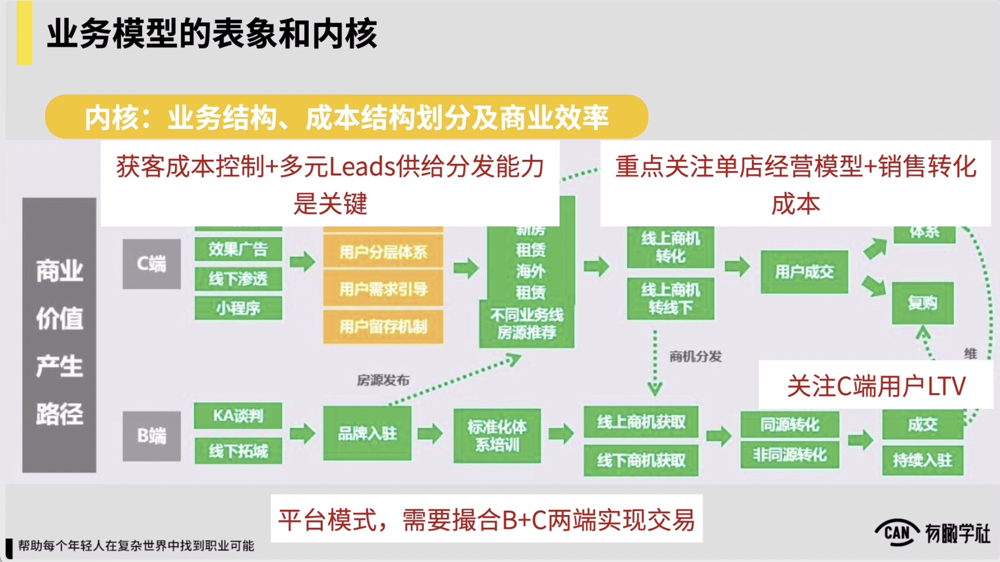

所以这是它的基本的商业模式。商业模式决定了我们后边会看一些什么样的重要的数据。随后我们在c端部分，我们会发现它的获客成本的控制，以及说它的多元粒子的供给分发的能力，是一个关键。

为什么我们会看到它的业务模型里边，是说我通过多个渠道来去实现获客，并且我获取到这些例子，我要分发到不同的房源上边去做匹配，部分如果我想要规模化获客，按理说我肯定不说我面向每一类不同的房源，我都分别去做投放，这样就会怎么，在我投放和获客上就会较为的低效，我应该能做到是说我通过一套投放的这么一个逻辑，我在所有地方反正都投这么一个素材，都投这么一套东西

用户进来之后说留一些表单或者填写一些信息，然后再往后我可对不同类型的例子去做分发，这样我的获客成本的控制，还有我的多元粒子的供给分发能力，才能做到说足够有保障，所以部分它的解决方案是一个关键，部分如果做得好，我是可把处理体处理个集团内的获客成本都控制在一个范围内的。

不然如果是说例如我的租赁线，我的新房线，我的海外房源的线对我都分别要去做投放，那就意味着说我内部肯定在每一条线下，我都要单单独去核算它的粒子的流量的获取成本了，管理起来相对就会有一点复杂，对约是这样，这是我们能看到的第二个关键的元素。

那么第三个关键的元素可看到，在线下的我获取到线索之后，进入到线下，要到门店去做带看，要做成交的这么一个部分，这家公司它一定需要在成交环节上关注我单店的经营模型，以及关注我处理体的销售转化的成本。

也说在成交环节上，我一定会把成交这一个关键的数据拆分到我全国各个地区n多的店铺，n独者下的门店拆分到角度上去来做管理，并且我对单个门店的 leader对对它的要求里边一定要有说你每个店铺的它的基本的成本结构上，我可能要去做一个监测，把每个店铺把每个门店当做一个我的核心经营单元来去做看待，在这基础上我的销售转化的成本，我每个店铺的基本的运营成本约是怎样的

为了cover住成本，我每个月对我要给每个门店至少供给多少个例子，每个门店每个月至少要完成多少个成交订单，我可能这么来去核算，来保证我处理个业务对它的发展是健康的，是可以预期能盈利的，所以这是第三个我们能看到的关键。

第四个我们会看到这家公司它的业务结构里边也是关注用户的LTV的用户在首次完成了购房之后，后边持续在用户成为业主之后做一套业主的维护体系，将来你会看看对我过去曾经实现过成交的客户是否从中可以挖掘一部分出来，例如他有住房改善的需求，或者他有租赁更换的需求了，对持续还能产生一部分复购，我会在 C端用户的维护上可能也需要有一套体系来去关注处理个用户的 LTV和用户的持续的复购率。

所以一个在业务理解上走得极深的一个管理者，一个操盘手或者一个高手。当我看到业务模型的时候，我关注的肯定不是说这些表象的流程协作分工之类的，我是可通过这些表象看到更深一层的，看到我们刚才所说的这些东西，而这些东西它一定会被转化成我们的商业经营模型或者我们的财务模型，从而更好来帮助我们对家公司来做管理。

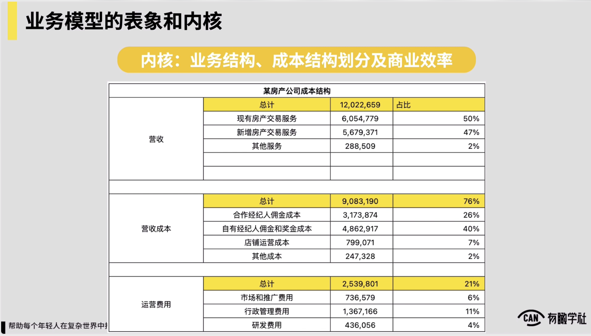

例如我们刚才说的这家房地产交易平台对它的处理个财务模型，如果follow我们刚才看到的那一个大的业务结构，从管理上我们就一定会把费用会把我们的成本就区分成这么几部分营收，这就不了，我们的成本里边一定会有我们的市场和推广的成本，

我们流量获取的成本一定会有我们每个单个店铺运营管理的这样的一种成本，还会有我们给到经纪人的，有合作经纪人，也有我们自有的经纪人

他的佣金还有说抽成也会有一些其他的店铺里边的日常的像行政或者一些财税等等类似这样的这种成本，然后以及我们处理个集团里边也会有研发的人员

我们的研发的团队也需要占据一部分的成本，最后我从管理上对是一定要让我每一个团队每一个部分帮助我通过一系列的工作，通过一系列的它的局部业务模型的优化，帮助我把处理个的成本结构，比如说每个团队你一定要把这一块的费用控制在一个什么样的比例范围内，比如我的流量团队

你就要给我设计一套系统，搭建一套机制，确保我的处理个的流量推广的成本占我处理收入的比重不能超过6%或者10%，

假设是这么一个认为，他们就会根据目标来去完成他所谓的工作，最后我每一个团队每一块的工作他都能帮助我把成本控制在这么一个范围之内，于是我们处理个这家公司的盈利和发展就会较为积极和健康，你从角度再重新理解一下，说不同的业务模型对它的竞争力到底差异在里？你可以理解为不同的业务模型，它对一家公司在某个阶段对吧所带来的这种成本优势，好或在竞争上的结构性优势完全不一样的。

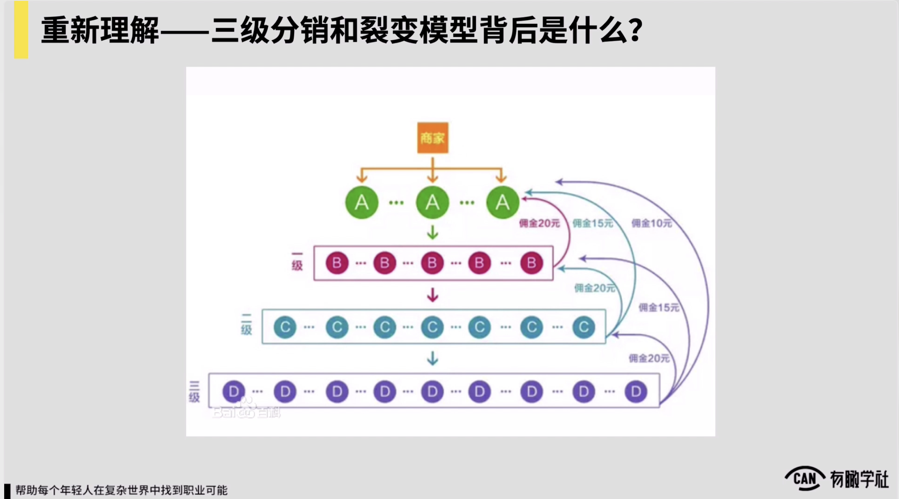

比如我们再举一个例子，我们所有做运营做增长的人，可能对于说像三级分销或者裂变这样的一个模型都不陌生，但是我们过去关注三级分销和裂变，往往可能很多人只关注说它的流程，它的玩法可能怎么样，

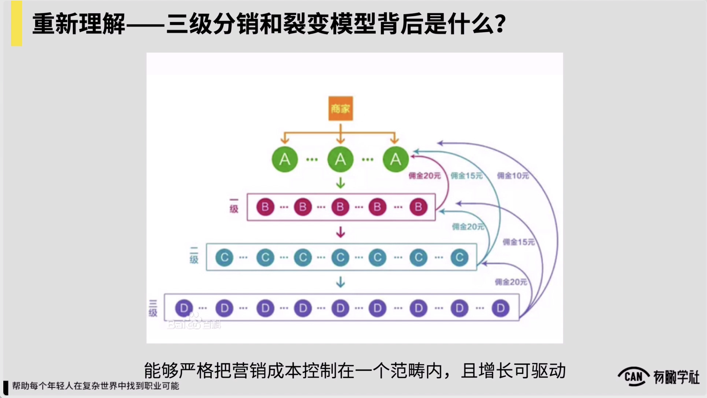

但实质上三级分销和裂变模型作为一种增长获客的模型，它的背后是什么？它的背后说对一家公司在某个阶段来，它可帮助你把营销成本控制在一个既定范围之内，并且增长是可驱动的。什么意思？查看这么一组对比，例如同样有两家公司，一家公司在获客和流量上对它通过投放来去驱动的，是一个投放获客的模型。另外一家公司可能就搭了通过一个三级分销体系来去驱动它的获客和流量增长。

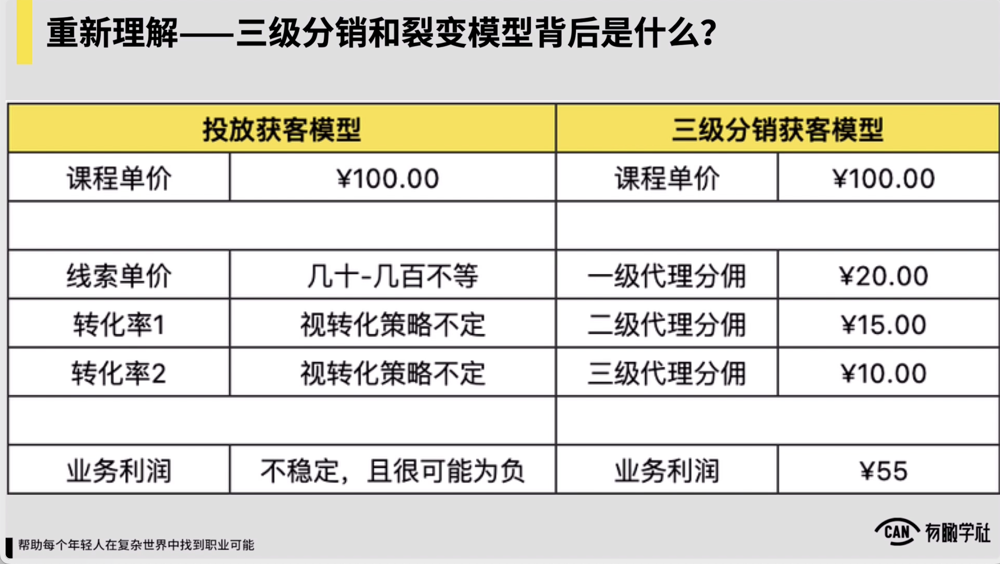

这两家公司在他获客部分上差异在？查看，你会发现如果我是前者，我是一个通过投放来获客的这么一个业务模型，本质上我要保证我的业务利润有足够的空间，可以长期为正长期有盈利的可能性，我一定要保证我的线索的单价，我单个例子的获客的单价应该是能控在一个范围内的，并且我的转化率对也保证在一个范围之内，我才可做到我的业务利润可稳定为正，这是对我的核心的要求，

一旦说在处理个行业里边，在一个阶段，因为竞争的加剧也因此，因为各种不可控因素也因此，我的获客成本无限上升，我的业务利润就不稳定了，且很为负投放的获客模型，约是这样一个认为，相比起来三级分销的模型，它的好处在？

它可以做到例如我稳定的设定说你看我给一级代理肯定一个分佣的额度，二级代理和三级代理也分别有个分佣的额度，从激励机制上我就把它控制在一定范围内，就一级代理最多，反正他能拿到可能有百分之多少的比例

处理个这样一套管理机制下来，你会发现我的处理个的获客成本它将是更为可控的，只要一二三级代理分别都认可我们给他的分佣比例对他是有刺激有动力的对不管我获客可能规模是在每个月1000，还是每个月可能1万或者是几十万，你发现我处理个的获客成本，它约就能精确的控制在这么一个范围之内。

所以三级分销的获客模型相较于投放获客模型，是在说我们在线的这种投放流量，如果它的成本起伏十分大的时候，三级分销模型它对处理个我的成本控制会更加精确的，并且这些代理只要愿意帮我干活

我的增长驱动力就一定存在，我在每个地方反正都分别去拓展我的代理，让他去把工作去做起来，我的用户的规模化增长就找到一个逻辑可去驱动了，所以这才是它背后真正的差异。

当然我们这儿也不是说三级分销模型就一定会比投放获客模型因此，对一家公司来，你说我要去做无限的规模化的扩张，尤其到了我对流量的需求要十分大的时候，

你做投放这事一定是早晚的，只不过是说在一家公司发展的某个阶段，如果你的业务形态是十分适合做分销的，分销模型它对你成本结构的控制更加的精确，也更加的可控，投放事儿

确实说变量会较为多，我市场上的很多变化竞争格局之类的，不因我的主观意志而去左右的，

所以这也是一个很典型的例子，帮理解不同业务模型背后它的核心竞争力差异到底在里，我们不同的业务模型它带给我们的成本结构是完全不一样的。如果一个业务模型在某个阶段里边能带给我们比竞争对手拥有更大的成本上的优势，那就意味着什么？我们就可以拿更多的资金补贴去打我们的竞争对手，这时候我们在竞争当中就占据了极大的主动。

好比2019年跟谁学这家公司跑出来的在线名师大班直播课，这么一个模型，它真正的犀利之处，真正的竞争强大的优势是在于说它的处理个成本结构，它的毛利可以做到比过去像k12领域里边的其他的产品模式，像什么一对一或者像什么录播双师课之类的，可能都有个10点左右的成本结构的优势，至少10点左右的成本结构优势，所以你发现根据这家公司对它在处理个的成本结构上就拥有1十分巨大的优势，它可以把这笔钱拿到市场上，面向我的竞争对手可能做补贴

我在资本上就去碾压你。

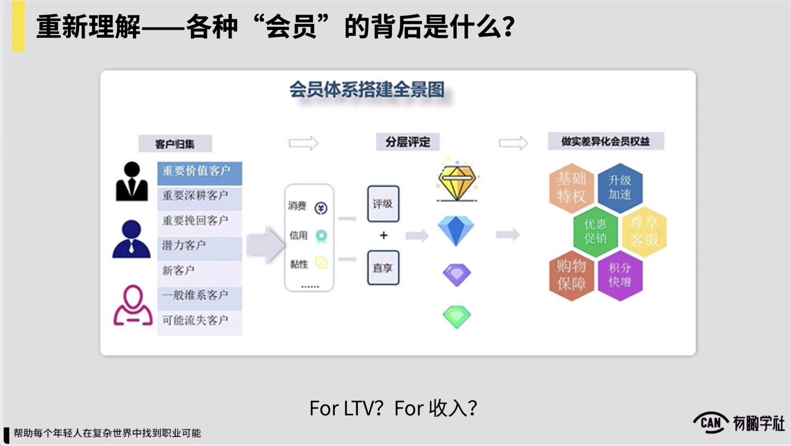

同理，当你带着这样一个视角去看待各种业务模型的时候，我也建议你要看到内核，就不要把焦点只关注在事儿上，而要关注它处理个的业务结构背后的成本的模型，对到底带来一些什么样的差异，就好比说我们同样要做会员

很多人可能都会问我一个问题，说你看老黄我要搭一个会员体系，会员体系到底该怎么搭，但你要可理解在不同公司里边，我要做一个会员所服务的目的，是完全不一样的，例如我常见的会员，我觉得就有两种

一种我做一个会员，本质上是为了去放大和延长我用户的LTV还有一种我做会员对会员本身对我一个商业化产品，我是要在会员身上去看收入的，这两种导向我在会员的设计上会是完全不一样的，

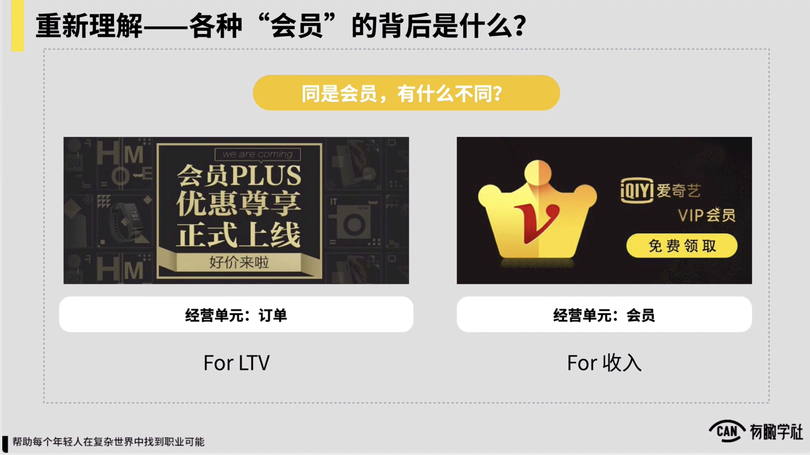

例如你像京东plus等等这样的这种会员，它本质上为LTV来去服务的，而比如像爱奇艺的会员，它本身我的会员，一个商业化产品，前者我设计的重点一定应该关注用户，购买完会员之后，我怎么更高频的触达用户，怎么更高频的去刺激用户多次的消费，

肯定设计关注重点会在这儿，而后者我设计关注重点就应该是说怎么增强会员权益它的价值和吸引力，让用户愿意为支付更高的费用和更高的单价，对约是这么一种思路。

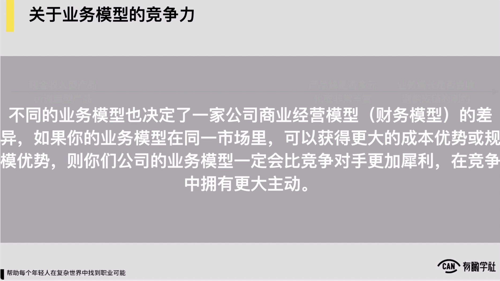

因此，关于上面延伸讲的这部分业务模型的竞争力，这部分我们再来做一个小总结。本质上各位一定要知道，不同的业务模型往往也决定了一家公司商业经营模型和财务模型的差异，如果你的业务模型在同一市场里可以帮助你获得更大的成本优势，或者是规模化优势

你们公司的业务模型一定就会比竞争对手更加犀利，在竞争中会占有更大的主动性，所以各位在关注和理解业务模型的时候，一定也要慢慢让自己拥有这么一个视角，

从业务模型的表象慢慢可更多的看到它背后的本质，看到它背后的财务模型成本结构约会是怎样的。

随后下一个话题，我们聊一下梳理业务模型对于你个人的意义，对于你作为一个ab类操盘手的意义到底是什么觉得事得分开看，如果你在一家早期公司，你所负责业务是一个早期业务，我觉得梳理业模型，它的重要的意义是在于说你要进行清楚，说我后边有可能去奔或者去跑或去验证依赖的一个模型是什么，以及我当下最重要的假设又是什么？

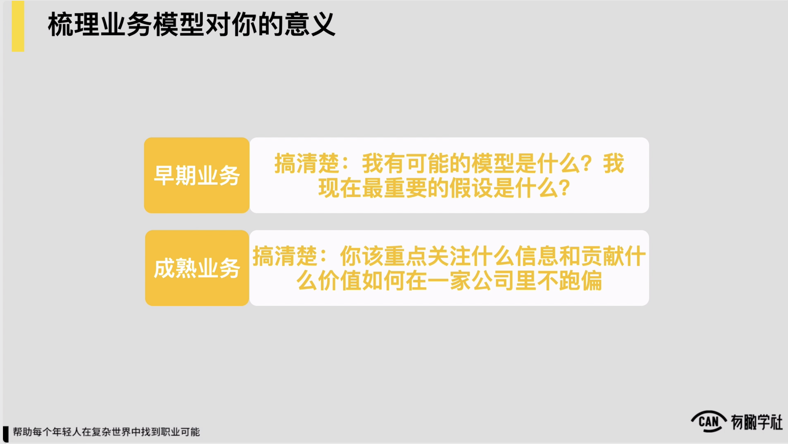

当我们带这种模型的视角和思考去看待我们的一些这种业务，会有助于我们在一些中长期这些想象上会变得更加的清楚的，这是对于早期业务。

而如果你身处一家成熟业务当中，我觉得梳理业务模型对你意义，它可能就变成了说你要重点关注，然后你要进行清楚你到底该重点关注什么信息和到底你在一家公司里边该贡献什么价值，才可在一家公司里头不跑偏。

这件事我认为对很多人来说也是十分重要的。

因为我观察到行业里边有很多的人他们都会处于一种什么状态说我在一家公司里边我也在做着很多事儿，我也很累，看起来我背的指标也不轻，但真正所有事情都做完了之后，我做这些事情到底跟这家公司的核心业务有什么关系我并不知道。

，所以很多时候我觉得是，怕你做的这件事情可能看起来再不起眼，最好他都能跟我们这家公司最核心最主要的业务模型是能衔接起来，能提供价值，能发生关系的。这样我觉得你做的工作跟这家公司的核心的业务才可更加的直接，更加清晰。

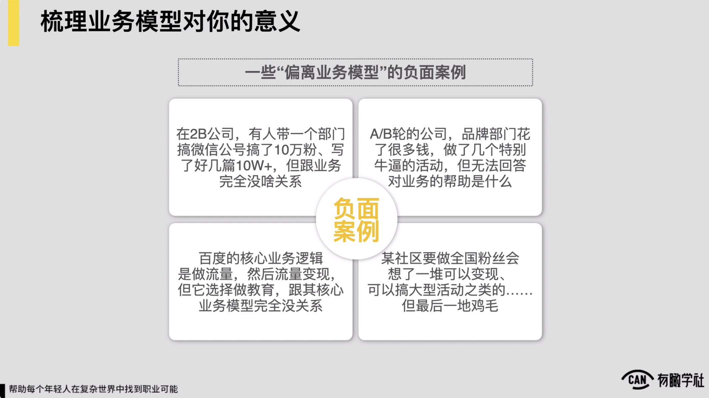

那么在这儿我们不妨直接来看几个典型跑偏的这样的一种案例，可能有一些人在一家公司里边对吧做了很多事儿，但完全偏离了我们核心的业务模型，跟我们业务模型之间是个什么样的关系，完全回答不清楚，于是越做越迷茫，越做越得不到认可，

典型这样情况也是很多的，看几个案例，第一个案例是这样的，例如在一家to b的公司，有人带着一个什么新媒体部门

进行微信公众号，做裂变涨粉，确实很短时间进行了10万粉，写了好几篇的10万加的文章，但对不起，对于这家to，b公司它核心的一个业务链条来讲，你说我进行了10万微信公号的粉丝，我写了20篇10万加跟我公司的核心业务有啥关系？我公司本身是要通过给企业售卖产品和服务来盈利的，你说我有10万粉，然后我写了20篇10万加他怎么能给我带来收入，怎么能给我带来企业这边的转化线索？回答不清楚，因为回答不清楚，对不起，所以这件事儿一点价值都没有，这是第一个负面的案例。

第二个负面的案例是这样的，就一家ab轮阶段的公司，我的品牌部门花了十分多的钱，做了好几个十分牛逼的活动或者事件营销，但同理对不起，没办法回答对我业务的帮助到底是怎样的。，例如也有可能说一家ab轮的公司，它可能也是一家教育公司或者一家医疗公司对它的品牌部门老大过去从一个媒体出来的，它依赖的这种路径说在媒体我们做品牌做PR

要做很多的线下活动，做很多事件营销，请大咖来去讲，确实花了很多钱做了好几次活动，行业里边最顶级的大咖全都请到了，阵容十分的强大，然后在媒体上也有了十分多的曝光，

就说某某公司做了好几个线下活动很牛逼，但对不起，说完所有这些事之后，对我的主营的医疗的这种业务，对我主营的这种像教育的这样的业务，到底有啥价值也讲不清楚，然后它的衔接的这种关系反正也不是很清晰，所以也就在上级心中就觉得也没什么价值，然后品牌部门老大也很痛苦。

对第二类的典型负面案例。

那么第三个典型的负面案例，说某知名的社区，一个社区它核心的这种业务肯定是做流量，或者通过优质内容，通过一些kl的这种互动对来去做流量做用户粘性，对它核心的业务的关注点。但有一天他们这家公司的社区运营部门的老大对一拍脑袋说我们是否要做一个全国粉丝会，我们的很多的这种用户对我们还是十分的，他们分散在全国各地，然后我们是否可以做一个全国的粉丝会牵起头来就开始做了。

做了两个月之后，在全国建起来了约几百个群，投了五六个人，这几百个群他们后来又想了一下说群建起来了，这帮人天天在里边聊天也十分的，但后边可做啥没想清楚，再后来又想了一堆说是否可以借由粉丝会来变现，进行一些什么大型活动之类的，开发了好几个周边，组织好几个地区里边，反正做了一些什么地区粉丝的见面会

做完这些之后最后有啥意义对社区的优质内容的增加，对社区流量的增加，或者对于说社区至少几千万体量用户的粘性的增加，然后带来的职业价值完全不明显，他做所有这些东西跟他主要的核心业务逻辑和业务模型并没有任何关系。所以最后就一地鸡毛总监反正那四五个人，干了约四五个月，通常也没什么成就，然后讲也讲不清楚对最后总监就被上级干掉了。所以很悲伤的一个故事，第三个负面案例。

那么第四个可能典型的负面案例，说由于百度来看，那么百度的它的核心的业务模型是什么？它核心的业务模型和逻辑，通过一个搜索工具来去做流量，快速做起流量对然后有了流量之后我就流量变现。

但是百度可能在2013 14年的时候，当时就做了一个决策，说我们自己要做教育，对各位又知道，就像我们可能已经展现过了一家教育公司，它核心的这种业务模型高度依赖于我的教研教学交付等等，然后跟百度本身的强大的流量能力并不一定有很强的直接关系。

相反这可能意味着说在我现有公司的基因之外，我要去在我现有公司的核心基因之外，我开创出来一些新的基因，它并不是一个说把我已有的基因，把我已有的一些核心资源和能力进一步放大，并不是这么一个逻辑，而是说我要开辟一块新的战场，去深深再长出来两块新的基因，约是这么一个认为。

，所以百度做教育从13 14年以来一直就做得十分痛苦，先后自己做过百度教育频道，收过好几家公司，但十分悲伤，一直到现在一直到2019 20年的样子，百度的教育板块一直以来都是十分的失败的，到最后他收进来几家公司，通常到最后也就慢慢的消亡了，渺无音讯了。

，所以这是4典型的我做的事情，偏离了业务模型的典型案例。

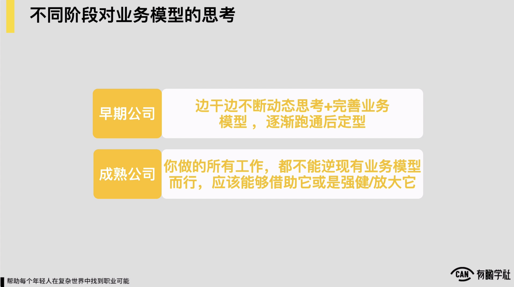

所以借着这几个典型的负面案例给各位一些忠告，如果你身处一家早期公司对然后我作为一个ab类的操盘手，我对业务模型该有什么样的思考，我最应该做的边干活，边不断动态思考加完善我家公司的业务模型，逐渐跑通之后定型去规模化的放大它和驱动它。如果身在一家早期公司，我应该有着这样的思考。

而如果我身处一家成熟的公司，我一定应该有这样的意识，我当前做的所有的工作都不可逆现有业务模型而行，应该是说我做的所有的工作，要么可借助模型它当中的某些核心资源，要么说我做的所有的东西都是为他服务的，都一定可帮助业务模型对变得更加的强健，或者变得更加的规模可增加，或者是效率可提升。

，所以这是在早期公司和成熟公司，我们作为一个ab类操盘手，我们对业务模型这件事儿应该有了一些思考。那么在这一节最后一点想跟各位分享的说梳理应用模型，对于我们自己作为一个ab类操盘手而言，还有什么意义？或者说深刻理解应用模型这件事对我们还有什么意义我觉得还存在一个很重要的意义。

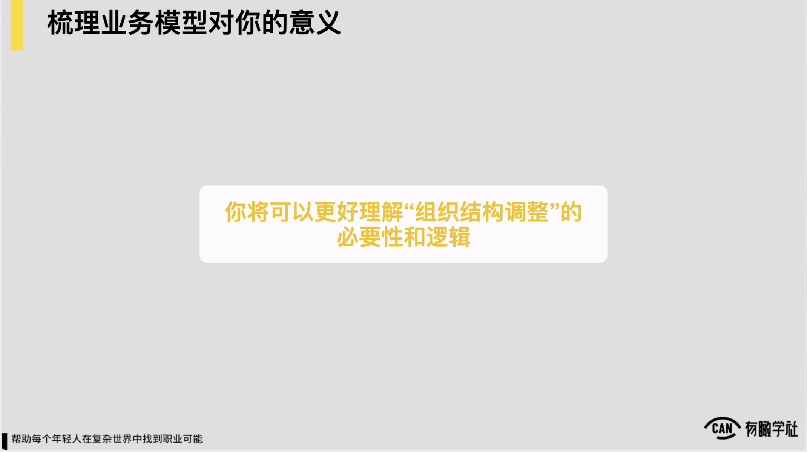

我们如果对业务模型这件事儿理解足够深，我们将可以更好地理解在一家公司里边组织结构调处理的必要性和逻辑，因为我所知有十分多的执行层的同学，甚至说很多中层的同学在一家公司里边是十分害怕和忌讳看到组织结构调处理和变化这样的事情的。但很多时候我觉得我们作为执行层或作为中层的人，很多时候对组织结构的调处理觉得很发怵，或者觉得说就很难以接受，或者觉得说变化太多了，上级不靠谱，很大程度上是在于说我们对业务模型这件事儿理解并不足够深刻，因为很多时候我们组织结构的调处理都是为了去服务于我们业务模型的放大，或者说是去服务于我们业务模型的升级的。

么换句来，当你选择了一类业务模型和一类业务的打法和逻辑，你必须要有对应的组织架构来去匹配它，这样这一套打法和这套模型对它的价值才可被放到最大，而不是说我可能我的组织结构永远都是这样，我的分工部门分工对就这么一个逻辑。我业务不管怎么调，我的部门都不变对对不起你这家公司也是没有前途的。

那么简单举个例子，例如三节课曾经经历过这么一次业务升级，约是在19年的时候，19年之前三节课内部的业务的逻辑和模型，约是这样一个认为，外边会有很多的渠道，内部也会有很多的这种课程，这些课程基本按照每个品类，比如像运营新媒体、营销产品，每个品类都有一堆的课程，这么来去组织的，在渠道和课程这块的结合，怎么去更好的去实现课程售卖或者收入，约逻辑是说定期根据市场上的热点和一些动态来去选择不同题做选品，再根据不同的这种课程的特点做一些策划。

例如举例子说像滴滴顺风车的那么一个事情出来了，对说滴滴可能在顺风车司机的控制，或者说像一些品控反垃圾等等些方面上，可能有些东西做的不够因此，对在当时可能就会根据这么一个行业里边的这种热点肯定做一些这种解读，解读完了之后可能在例如顺带去推一个像策略产品类似这样的这种课程来去吸引到更多的用户来去参加，并且这样的课程每一个课程策划以上之后，说他近期该去结合什么热点，制定什么样的这种营销策略，会去针对每个课程单独制定一系列营销计划。

，所以通常是说可以理解为从业务模型的角度，根据市场热点和话题为中心，然后以市场热点为话题，组织内部的客人生产和教学运营和营销的资源来组织去不断去打，每一次话题抓得准，背后打完一波之后一波收入，约是这么一个认为。

，所以在过去这样的业务模型和业务逻辑下，这种职能分工约是分成有三个部门，这三个部门分别叫做什么？第一个渠道市场部，他们主要就管外边的渠道怎么去投放，怎么去制定营销的一些计划，投放流量采买的一些计划，这是渠道市场部主要的职责。

第二个部门叫做品类运营部，品类运营部通常说每个人负责一个品类，品览章近期有些什么热点题要关注对可能我就要做一些策划了，策划完了之后，结合这些话题，我适合近期主要去推个课，在课上我应该是引入一个大咖，一起来做一些互动，还引入一个大厂的什么资源，策划一场活动怎么去推，品类运营人要去负责，所以他是处理个营销计划的发起者。

最后还会有教学服务部，教学服务部基本就负责所有具体每个课程的研发升级改造和教学的这种服务，通常它跟品类运营也是密切配合的，就品类运营发起了一个营销计划，教学服务可能要去响应，约是这么一个逻辑。

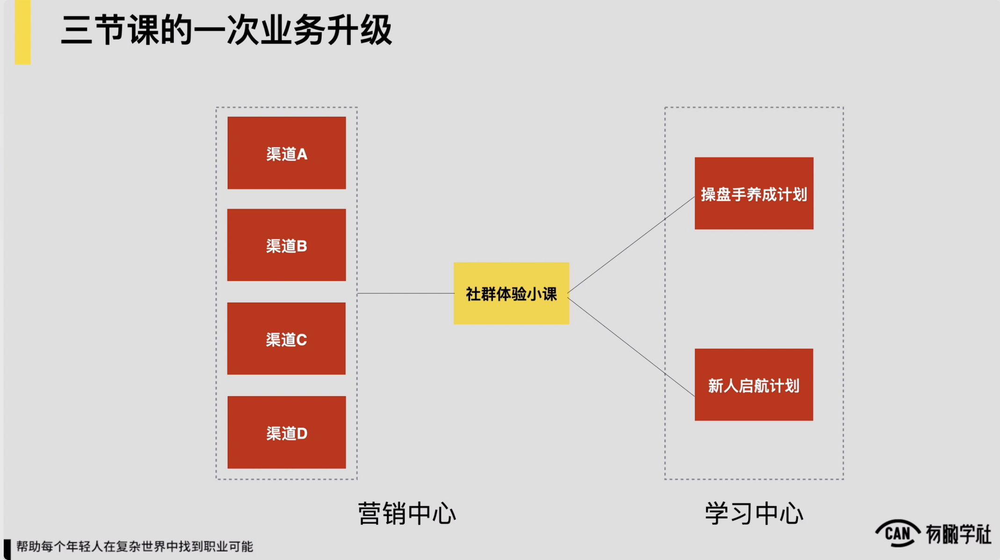

随后可能在2019年的下半年的时候，三节课产生了一个业务的这种升级，产品可能也完成了升级，处理个的业务模型也完成了升级，变成了这么一个认为，就过去主要是通过说话题策划和对单个课程的这种活动的这种包装，通过这样的方式去完成课程售卖。

但是在2019年下半年之后改了业务模型，变成了通过社群体验的小课来去集中进行转化，同时转化后边的课程可能也就变成了说少量的几类课程，例如操盘手软件计划，新人启航计划，后边转化的标的也变得更少了。

，所以在这样的一个新的这种业务模型下，毫无疑问组织结构一定要发生变更，来去适应新的这样的一种业务模型，于是三节课内部的组织结构就变成了说营销中心学习中心变成这么一个结构，营销中心负责所有的从渠道流量推广，而小课的销售转化的这么一个这种路径的把握，最后对订单和收入负责，还有对相应课程的满班率负责，营销中心处理个所有这一摊事儿都管学习中心重点，就管说我们产品的研发交付的稳定，然后学习目标教学目标的达成和口碑的达成，以及在单个课程上面对通过它的升级和一些持续的这种口碑的产生，给营销中心提供相应的营销弹药，就变成了这么一个这种业务结构。

所以这算是三节课一个小小的case分享给各位，希望帮助各位能更深刻的理解，当我们的业务模型出现了变化和升级，我们的战略出现了变化和升级，很多时候我们组织结构的调处理是必要的，组织结构在今天这种市场变化十分多，外部的挑战十分激烈的这样的这种环境下，我们组织结构定期来做一些这种优化和调处理是十分有必要的。

包括像阿里这样的这种公司，各位如果有机会去认真关注一下，你会发现阿里通常也会是差不多每半年保持做一次这种组织结构的调处理和升级，以匹配它最新的战略和最新在业务模型业务设计上的一些这种升级。

那么最后在本节的末尾想要给到各位一个小的提醒。，然后就像我们所有看到的就一家公司，它的经营和管理是一件十分复杂的事情，中间有十分多的业务细节逻辑要去梳理要去思考。

所以对于一个中层和对一个之前还在执行层的人，要想看 到全局是一件十分难的事儿，但是跟我们之前讲的同理，如果你有志于想成为一个ab类的操盘手，一定要理解一些基本逻辑，当你脑海中开始有一些模型的意识，你约知道说全机油模型是这么一个认为，然后我们局部也需要通过一些模型

保证我们有稳定的input output，然后不断去思考我们所负责局部它是否标准的，能不能规模化，通过这样的方式跟我们的上级去对话，可做到跟我们上级保持在一个频道上，能给到他支持，如果你作为一个ab类操盘手，你能做到这一点，我十分确信他已经就可给到你十分大的帮助了。，所以这算是最后本节的一些小的提醒。这一节的内容我们就讲到这。
