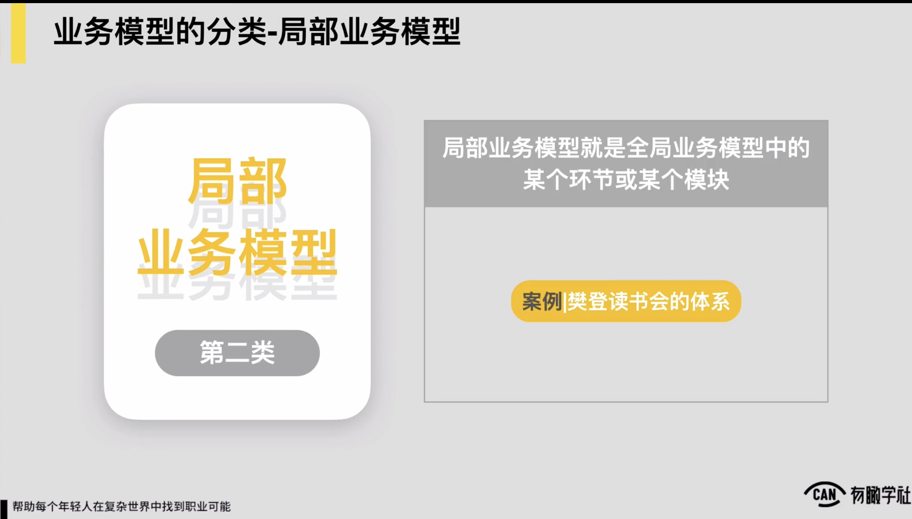
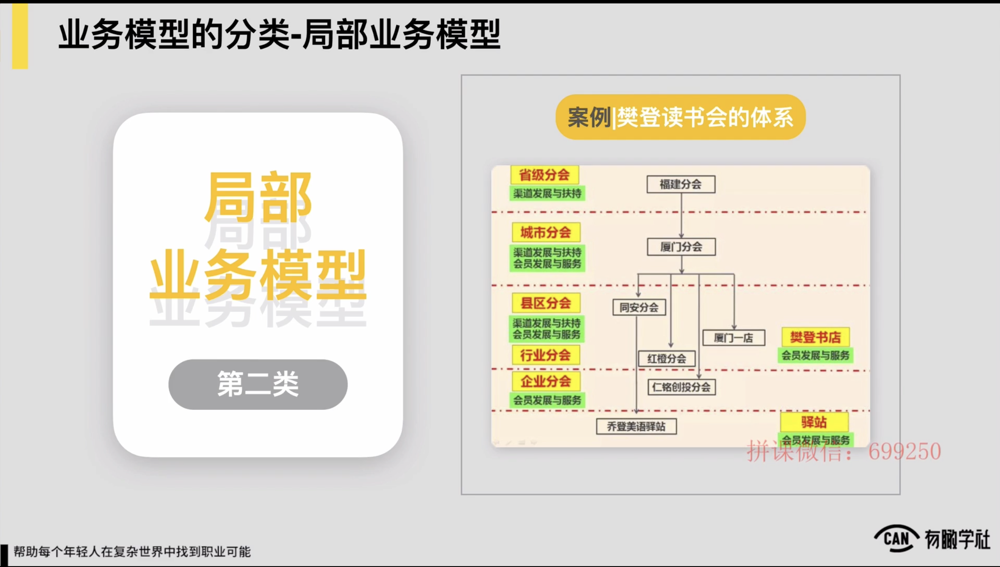
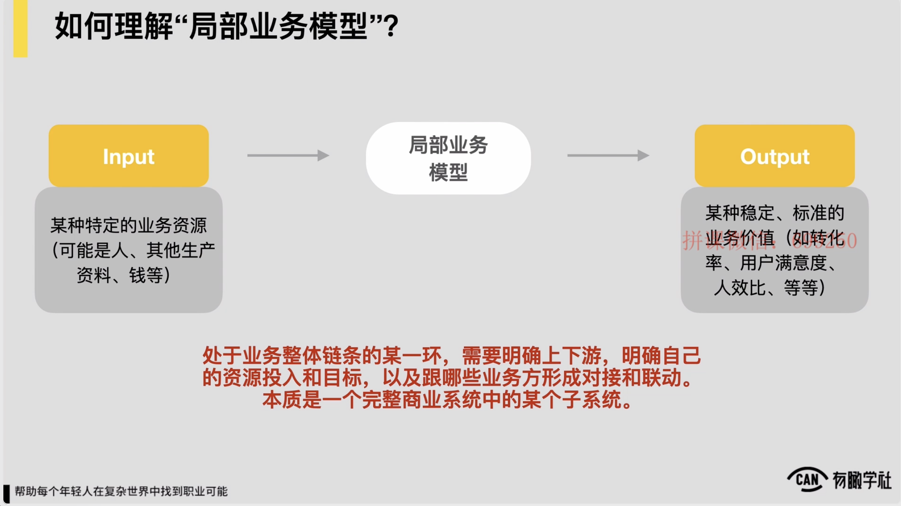
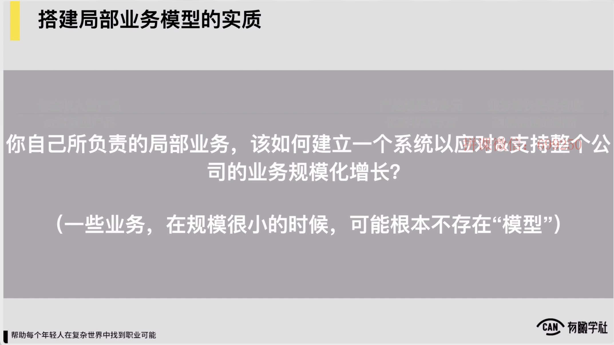
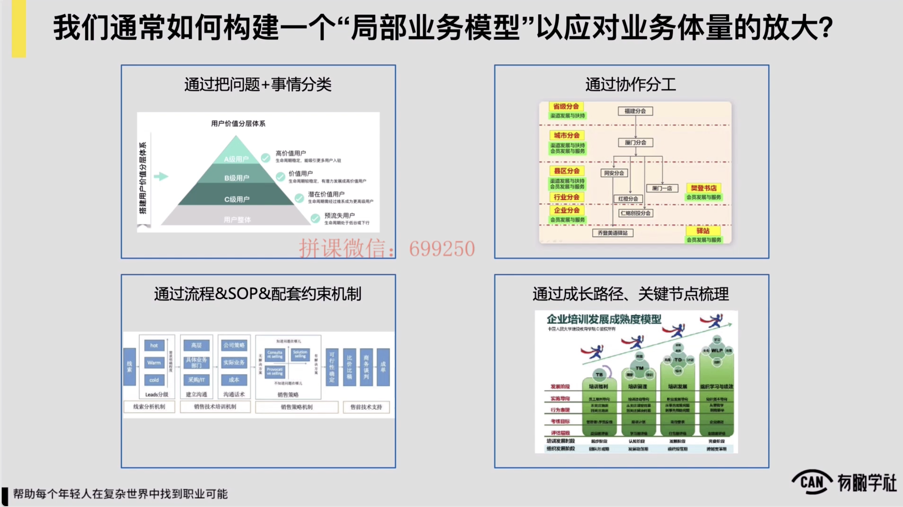
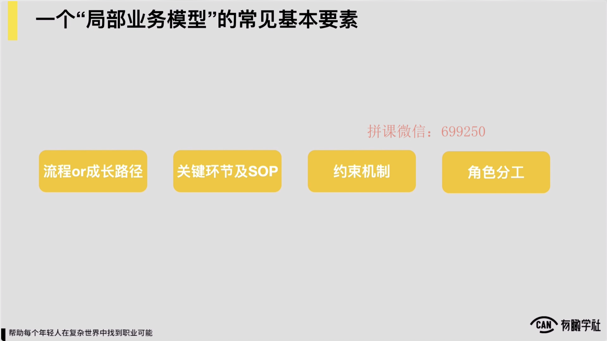
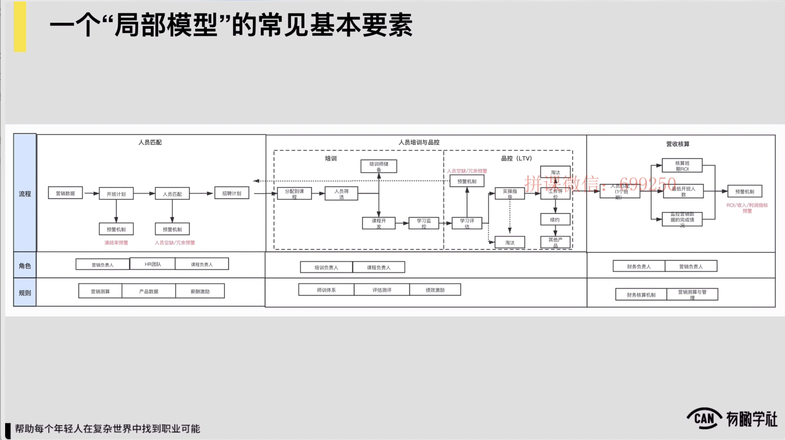
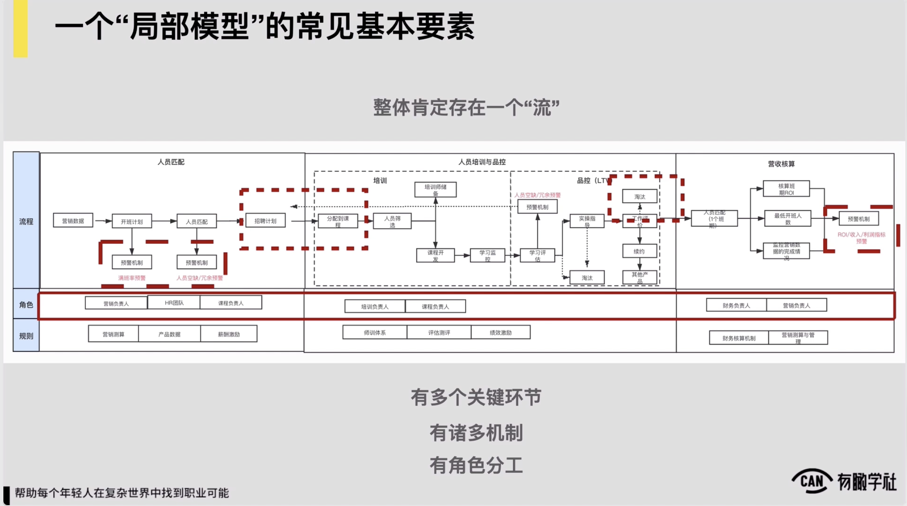

# 3.1.1 如何理解局部业务模型

随后我们进入到另外一个部分，局部业务模型，就像我们说过的局部业务模型，它的理解可能就更加的简单了，它我们全局业务模型当中的某一个核心业务环节或者某一个模块，对我们对模块单拿出来把梳理清楚，说这块的业务模型是怎样的，就ok了。

例如我们举个例子，以樊登读书会这么一家公司，这么一个核心的产品和业务来去看，它会内部存在着一个十分重要的一块局部业务模型是什么？它在各地区的分销或者城市合伙人的这么一套体系，对体系约是怎样的？我们会发现体系它是以每一个省一个地域为中心来去搭建的，在每一个省他们都搭建起来了。

这么4层的一个这种结构，分别是说首先它会有一个省级的分会，其次省下边会有各个城市的分会，城市下边会再做到县区的峰会和企业的峰会，它做的最深的是把峰会落实到企业当中去。通常从官方来讲，它对省级分会主要提供的是渠道发展和扶持，然后给一些政策，给一些资源，给一些配套的相关的支持。

然后在城市峰会往下，这一级城市县级和企业都会承载着它的会员发展和服务，都会承载着这块的一个需求，就给到这些分会，给到一些意义的空间，给到一些资源和政策的支持，让他们去帮助樊登读书会发展相应的会员

而在县级这一级它配套的又会开设说像樊登书店这么一个实体店，通过这样的实体店来支撑，说好你在县级有一个这种分会，县级分会的所有的这种活动就可以到我书店来去办，

把书店的活动的这种承载量可能也尽量的排慢，这样让它形成一个很强的这种支撑，再到可能企业再往下一级，可能又会涉及一些像小的驿站等等这样的一些基本的这种设计逻辑，通过这样一套处理个的这种体系，再加上中间有一个三级分销利益分成的这么一个体系，可支撑说樊登读书会在各地区都有一套自己十分强大的这种地区和城市合伙人的体系，帮助他去实现十分激进的一个这种会员数量的增长。

以上我们就以樊登读书会的城市合伙人和地区合伙人这么一套体系，展示了一个典型的局部业务模型。我们也来简单总结一下，到底我们怎么去理解局部业务模型它本质上是个什么东西还是回归到我们在本节开篇说的业务模型，本质上它一定有个稳定的input，output对于一个局部业务模型来，它的input某种特定的业务资源，人一些其他的生产资料钱等等，它的output一定是某种稳定标准的业务价值。

例如我们的某个环节的转化率，例如我们用户的满意度，例如我们的人效比，例如我们的收入等等。，所以这是一个局部用模型，典型的input output。

我们要总结一下，本质上一个局部业务模型，它一定处于业务处理体链条的某一环，我们要梳理它，肯定需要去明确在业务链条当中我们的上下游到底是什么，我们明确自己的资源投入和目标，以及跟些业务方要形成对接和联动。

本质上这东西都梳理清楚了之后，一个局部业务模型，它实际上一定是一个完处理商业系统当中的某一个子系统，这是一个典型的局部业务模型，它的逻辑。

我们再来进一步聊清楚一个重要的事情，搭建一个局部业务模型，它的实质到底是为了干啥，对到底是为了解决啥问题，我觉得一定要进行清楚。

本质上一家公司要存在一个局部业务模型的时候，它是说我们自己所负责的某一块局部业务，我们需要去建立一个系统，以应对和支持处理个公司业务的规模化增长。

它本质上就每一个局部业务模型，它所解决的问题都是为了解决说当我们的公司的业务量对吧在逐渐增大，可能它的规模也在逐渐发展的壮大，我们的业务量对要增加10倍或者20倍的时候，对我们可能需要有个系统来确保说即便我们的业务量放大到这么大，我们局部业务还是可以顺利运转的，约是这么个意思，所以一些业务在规模很小的时候，根本不存在模型这么一说的。

，我给各位举个例子，就好比说你在一家公司里边管客服团队对例如你说最初的时候，我们客服团队一共也就两三个人，这两三个人基本说每天只要有用户打电话来或者用户在线留言，及时的接收，及时的回复，把客户的需求解决就以上，然后早上对吧9点上班，晚上五六点钟该下班就下班，约就这么个事儿，你说他需要有什么复杂的管理机制吗？因为初期我们用户的咨询量，用户客户的需求本身就不那么多

这时候我觉得我们似乎就不需要有任何的机制，也不需要有任何的模型，它很粗放的管理就行了。

，所以这是一个客户团队，例如有一两两三个人的时候，但是当你的处理个的业务量发展的足够大，例如我已经是一个说每月可能有个几万订单的这么一家公司了，甚至可能有几十万订单的这么家公司了，我客服团队也逐渐的要增加，例如客服团队要涨到可能有个几十个人或者上百个人

这时候你发现我内部就一定需要有说处理个我客服问题的分类，我客服的处理的处理个流程，还有我客服团队的一些工作的什么考核或品控的机制等等，一定会需要有这么一些配套的机制或一个完处理的配套系统来确保说我客服团队的管理

它是高效且稳定的，包括说我们看行业里边在客服科森特的部分，像携程这样的公司是十分的知名的，它处理个在携程的体系内对有个几千人的这种客服团队，然后他确保说我可能每天成百上千的这样客服的咨询对然后可能就进来之后，都可高效的在我处理个系统内部做流转做分发，并且所有用户的问题都能及时的得到处理和响应。

所以我们各位一定要进行清楚这件事，我们在聊局部业务模型的时候，如果说你现在的公司对一个小工作室，我只有一两个人甚至两三个人对我现在为了完成我的作业，我非得把我们公司在做的事情对要描绘成一个多么复杂的模型，我觉得你是在yy对你完全是在无中生有，并且模型你画不画，我觉得他都没有什么实质的意义，但是我觉得你真正应该关注和思考的是说我们这家公司假设我的业务体量对要增长个10倍或者20倍，在那个情况下

我所负责的局部他是否需要建立一些机制或者建立一些系统

来帮助说我们公司的业务仍然是可以高效和稳定运转的，包括我们在学习或者再去借鉴其他公司一些成熟的业务模型的时候，我们本质上在思考和关注的也是说你看这家公司它业务体量能到这么大了，对他每天的像客服的需求已经有这么大的体量了，对他仍然能通过这么一套机制来确保说我的处理个客服体系是可以完善而高高效的运转的，我们真正该思考关注的是这么一件事儿。

因此，到这儿，我们一个局部业务模型到底长什么样？或者说我们要在一个局部业务上对考虑说我的业务量要增加10倍之后，我要建立一个怎样的机制和系统来去应对它的时候，我们该怎么思考对所以我们随后进一步来聊一下，如果我们现在负责某块业务，像我们说的我们在负责客服这块工作对如果我们的业务体量会有10倍20倍的增长，我们该怎么去构建一个局部业务模型来去应对业务体量的放大？

我觉得通常我们这么对会有4方面的思路，来帮助我们构建一个局部业务模型，来应对业务体量的放大，从一个简单的工作状态

到说一个系统性的这么一个工作状态，对第思路第一种思考思路叫做说把问题和事情分类，就像我们说的

如果我们过去的客服就两三个人，但是随着我们客服体量客服反馈量的增加，从每天可能1020客服咨询，到时候我每天有上千数万个客户咨询，我们第一个思考思路，我们就一定要把问题和事情分类，例如用户咨询的问题常见会分成些类别，我们先做一个分类

分类完了我们每类问题怎么来处理，才会更加的高效，所以这是第一种的常见思路。

第二种常见思路，一定说我们在每类问题下，也许我们都需要有一些流程和sop还有一些配套的约束机制，对例如针对一个用户来咨询我的酒店对要退房或者要更换入住日期。好针对这样的问题，我们在流程处理上该怎么来去处理，包括说我们的处理之后的满意度对是否也应该有个监控，有个简单的品控对可能这是第二个的思考思路。

第三个思考思路一定也要考虑这当中各位的分工协作是怎么样的，例如为了应对一个每天对有几万个用户咨询量的这么这么一套客服体系，一定是说有人在前边对负责说对问题做分类或者对问题可能做分发，有人可能要对问题做实际的处理过程中还会涉及到可能有几拨人的对接和协作，以及还有人可能需要来对我们客服工作人员的工作来做品控或抽查。

所以一定也要考虑这里边的协作分工是怎样的，最后我们也需要去考虑说这当中是否存在，不管是面向用户，还是面向我们自己工作人员的某种成长路径，还有说这里边是否存在一些关键的节点，就好比说为了激励我们的客服团队成员，因为他们每天天长日久的

要去应对很多客服工作也十分的，怎么来激励他们，怎么让他们在这件事上可干得更有动力也许搭一套客服团队的成长体系

然后从初级客服到客服主管，再到客服经理，再到高级什么客服总监或者客服的培训专家之类的，我们需要去搭这么一套成长的路径，才可确保说我们处理个团队它的稳定性，它的持续发展的动力是存在的，所以当我们要在一个业务局部对去试着构建一个业务模型，应对业务体量放大的时候，我们通常的思路有这么4思考方向，我们需要去思考，第一随着我们业务体量放大了，

我们一些待处理的问题，还有事情是否做一些分类，包括我们是否需要对用户的类型要做一些分类。第二我们随着业务体量放大了对我们是否需要去建立一些流程，建立一些sop，建立一些配套的约束管理机制。再次，随着我们业务体量放大了，我们是否需要在这其中

也需要去考虑做一些角色上的区分，并且对每个角色的职责。可能做定义，让各位更好的来做协作分工。第四过程中对随着我们业务体量放大了，我们是否需要考虑面向用户也因此，面向我们自己团队内部的成员也因此，或者面向我们服务的对象也因此，对需要设计一个成长路径，并且在成长路径当中也许还会有一些关键节点。

所以不管是我们要去梳理一家成熟的公司对它的某个业务部门的业务模型，还是说我们要去从0面向一家新公司，假设它业务体量要增加了

我们要去搭建一个局部业务模型的时候，从视觉化呈现的角度，一个局部业务模型，它会有些常见的机基本要素，有4种常见的要素在视觉化呈现上，第一一个局部业务模型里边对往往会有很多的流程或者是有一个显著的成长路径，这是第一个要素。

第二个要素在一个局部业务模型上，它可能也会有很多的关键环节，还有说在某些环节上对为了处理好它，需要有一些配套的sop。第三一个局部业务模型里边对也会存在很多的约束机制。

而第四一个局部业务模型里边可能也会存在一些重要的角色分工，我们把局部业务模型看作是一个系统，系统我们要把它对吧视觉化的来做呈现或来做展示，或者要去试着来搭建它对它有这么几块的要素来去构成。

我们也来看一个例子，例如现在我们所看到的是一家教育公司，它供应链的管理的局部业务模型，所谓它的供应链我的处理个的师资和我的服务团队服务人员，可看到局部业务模型，它是说根据我前端的营销的数据，还有开班计划，来去判断说我到底可能在下一个季度下个月里边需要有多少个的老师对可随时可以上岗去服务我的用户，在我的开班计划形成之后，

我会不断去招生，我会储备好我的所有的师资。

过程中要对这些师资做一些培训，也要做一些考核对然后在我的开班招生完成之后，我会把每一个师资匹配到说我的每一个班期上面，让我所有的师资去服务我的学员，并且在班期服务的过程中对我也需要对这些师资去做品控做监测对然后来完成他们的工作评价，以及在班期结束之后，我也需要对根据他们的服务的数据和业绩去做相应的收入核算，每个老师对他每个月到底能拿走多少钱，本质上我觉得约是这么一套系统。

，这是1教育公司它的供应链管理的1简单的局部业务模型， Follow模型，我们查看我们上边提到的4要素，在模型里边是否都存在，第一模型里边肯定处理体存在一个流

它的处理个流程最前端就根据我的营销数据，我会推导出来我的开班计划，开班计划里边就可推导出来说我到底在下个月需要有多少个老师，然后再往后对可能说我要做老师的招募和培训，要把老师匹配到班级上，最后老师要完成班级的服务，以及我要去给老师要核算他们的业绩和收入，所以它处理体肯定存在一个流，所以流程要素在处理个业务模型里边肯定是存在的。

因此，这是我们的第一个要素。第二个要素我们就发现这里边一定也会有多个的关键环节存在，例如我们老师的招聘计划的形成，是一个关键环节对例如我们在老师服务完之后，定期对老师要做考核品控，以及要淘汰一部分老师，淘汰怎么来做，它可能也是一个关键环节，这里边还有很多的关键环节，我就不一一来去点名来去说明了。

再往下你也会看到局部业务模型里边也存在着诸多的机制，例如我们开班计划的预警的机制，我们人员匹配的预警的机制，

然后包括说我们可能绩效管理激励的机制，我们做品控的这样的机制，我们跟财务人员去做收入核算的这样的机制等等，它一定会存在诸多的约束机制，以及最后

这里边一定也存在说有明确的角色分工，包括说我们在最前端对做人员匹配的监测的时候，我们营销团队的负责人跟我们的hr团队，跟我们的每个课程的负责人之间，他该怎么来协作，在我们做营收核算的时候

我们财务的负责人跟我们营销团队的负责人，还有跟我们负责供应链的同学，他们又该怎么来去协作，所以在局部业务模型上你会发现我们刚才提到的四大要素，四大常见的要素流程，n多的关键环节，还有说诸多机制，还有说角色分工，这四大要素在业务模型里面都是存在的。因此，那么到这儿我们关于局部业务模型，我们就讲完了what和why，局部业务模型到底是什么，对它为什么会长成这么一个认为？
