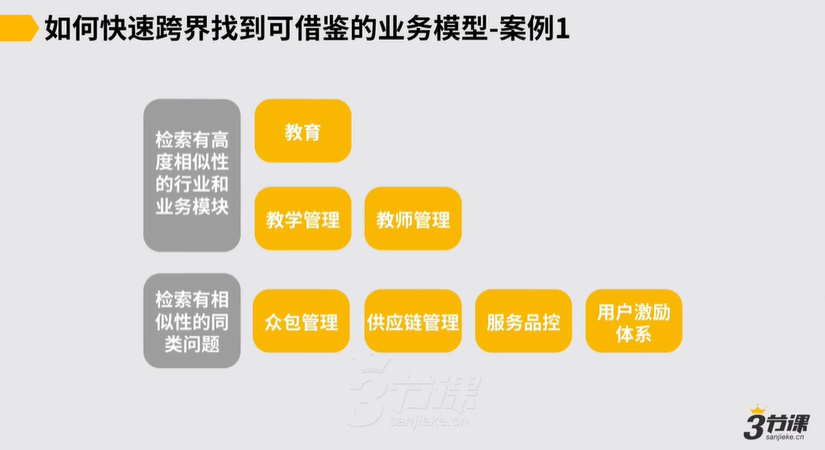

# 4.1.2 案例1-三节课助教运营.mp4

**举例：如何搭建三节课的助教运营体系，这件事怎么借鉴行业的业务模型来做？**

1.首先思考这件事的本质：助教相当于辅导老师，围绕老师需要如何管理

2.先检索相似性的行业和业务模型：教育行业的教学管理+教师管理

3.再跨行业检索相似性同类问题：除了上述模型，还有些问题没有被解决？再去行业内检索，有些公司已经成功解决了类似问题。比如，众包管理问题、供应链管理问题、服务品控问题、用户激励体系、优质社交圈如何维系的问题。👇

***

我们也来看两个例子，比方讲假设说三节课的助教运营这样一件事儿对然后假设说搭建一个说助教运营的处理个的运营的体系，然后这件事儿怎么去借鉴其他行业的这种业务模型来去做，所以在这件事儿里头，我们首先一定要去思考说助教运营这件事儿本质上它是一个什么样的问题，

有可能我们就定义出来，假设说它会涉及到说首先教学管理的问题，有一部分例如教师培养教师培训的这样的一种问题，因为助教有可能一定程度上也许承载的是一个辅导老师的角色，

也许会有这么两类的这样的这种问题，首先就去检索说跟三节课业务有高度相似性的行业和对应的业务模块，也许我们就看到一定是很多的教育公司里面，他们的教学管理的模块和他们的教师管理教师培训的模块到底是怎么做的，这两部分我们一定就可以去行业里边拿到一些成熟的解决方案，

拿这些成熟解决方案之后，不管是人家有一套体系，人家有一套机制，人家有一套流程之类的，我们很多东西就可以借鉴了。

但是对于三节课的助教运营而言，到底是否说就把这两者做因此，就把这两个东西可能去借鉴过来，三节课处理个助教运营的这套体系的搭建就完成了，助教运营所有的问题就能解决了，不是的。

我们发现这里边可能还会有一些其他问题没有被解决因此，包括我们刚才讲的，例如助教他是否应该是一个说高质量的社交圈

然后像类似这样的一些这种问题，所以再要定一些说在处理个助教云业务模块下，然后还没能完全解决的问题，可能有些什么，然后就再在行业里边去检索，说有些公司他跟我们要解决这些问题，可能也有一些相似性的这样的这种工作他们已经做过了，而且做的可能还不错，所以也许我们在程度上再做思考之后，就能从这些方向上再去做一些检索，例如这里边可能涉及到有众包管理的问题，有这种供应链管理的问题，有像这种服务怎么品控的这种问题，也有像什么用户激励体系问题，还有像我们刚才讲的一个这种例如优质的社交圈层

怎么去维系的这样的这种问题，我们也就找到这么一些参照。

当然这些参照找到之后，它并不是说所有的你找到这些答案你都要拿过来用，一定中间你自己要做判断，些用到底些不用对然后东西你自己要过滤一下，但最后重说例如你假设你是在负责助教运营这样一个模块，然后说我在外部要去找找成熟的这样可参照模型，怎么能找到足够有价值足够有借鉴意义的信息，约这是一个思路，所以这针对三节课的主要运营这么一个这种案例。
