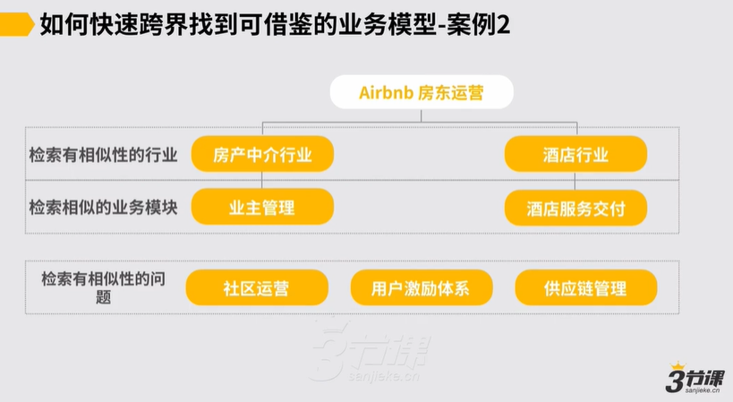

# 4.1.3 案例2 - airbnb房东运营.mp4

**举例：如何解决Airbnb房东运营的问题**

1.先检索相似行业和业务模型：房产中介行业的业主管理模型、酒店行业的酒店服务交付模型

2.除此之外，还有未解答的问题，再去检索相似性问题：社区运营、用户激励体系、供应链管理👇

然后再看另一个案例，例如mbnb的房东的运营，假设我们要解决的是这么一个问题，那也是一样，我们首先要去检索说跟我们所处的业务有相似性的行业，我们就发现 ABB的房东的运营似乎跟两个行业似乎都有点相关。

第一个是房地产中介的行业，第二个是酒店管理的这样的一种行业，对然后我们就发现说这里边这两个行业当中可能也跟我们的业务有相似性的业务模块，说房地产中介行业里边的业主管理可能跟我们的房东管理是十分的，

然后怎么去签约，怎么去跟他们去持续的沟通和互动，怎么定期的可能做一些用户的这种维系，保证我们的例如房源可能相对是稳定的之类的，

这里边有一套逻辑，包括怎么预防说房东这边可能因为有些变故，导致我们的房源有不稳定有风险之类的，这里面有一套逻辑我们也许可以借鉴过来

然后另外可能在酒店的行业里边，我们也会发现说酒店的它的处理个服务交付的这套体系，似乎对于说我们处理个房东和房源的运营似乎是能有些借鉴的，我们可能就据此来要求，好我跟你签约，你要给到我一套房

房它处理体上可能按照参照什么酒店的服务交付的标准，应该符合12345这么5标准

我就据此来去要求你，我是可以这样来去做的，所以检索有相似性行业和检索有相似的这种业务模块，约我们找到这么2参照，但是这两个参照炒完之后也是一样， Mbnb的房东运营这件事儿对讲就所有的问题都解决了。

有可能在我们想象当中，我们觉得说似乎这件事儿也没有太完全解决因此，这里边还会有些什么问题，我们就发现说这里边可能还会有像例如我们希望房东们他们本身应该是个社群，他们彼此应该有交流的，所以这里边涉及到有社群或社区运营的这样的一种问题，也有说像这些房东们，我们希望他们跟我们之间的关系还是更紧密的，甚至我们希望部分的房东参与到处理个我们业务的这种经营里边来，包括参与到我们的这种服务当中来，有部分房东我们是鼓励这样做的，所以这里边有可能也涉及到我们要搭一套用户激励体系的这样的一个逻辑，再包括说我们不同地区的这种房源，如果要分类，怎么去支撑？

像我们前面提到的说我们处理个在前端的业务增长，然后可能中间涉及到有供应链管理的问题，所以可能按照我们还没解决完的问题，约再去定一下说还有些问题我们没解决的，我们约找到这么三个方向。

随后我们就可以说去查看别的地方社区运营是怎么做的，用户激励是怎么做的，供应链管理是怎么做的，从中再去找这些参照来赋能我们自己的业务，约就这样一个逻辑，所以到这儿到底可能怎么去从外部跨界去找到可参照的这种模型，来去赋能我们的业务基本逻辑，我们就讲完了。
