# 4.2 常见可借鉴的业务模型.mp4

## **常见可参考的业务模型**

随后看每个业务模块下，常见的业务模型：

但是可能还存在一个问题，我们说各位可能优先第一件要做的事儿，第一件要做的事一定是说去检索那些跟我们的业务有高度相似性的行业和业务模块，对这里边可能对很多人来讲存在一个问题，说行业事还好，有些常见的行业对最不济可能我自己去查查什么招聘网站，茶什么这种投资分类信息网站还能查到的，但是我到底怎么能知道存在些常见的业务模块，以及每类业务模块下到底有些常见的模型类别，

然后这件事我是不知道的。如果不知道，你说让我对外部去借鉴，有可能我例如按部就班的，例如我做教育，我也去教育里边找，然后找来找去，反正还是那几样，找来找去还是那几个解决方案，我们所提到的见识少，然后很多思维或者说视角没有被打开，问题可能一定程度上还是存在的，或者即便我想打破，我有可能还是没方向的。

所以在这我们也在想，我们能不能在问题上再给到各位一些帮助，所以我们就想如果我们还可在上面讲到所有的方法之上，再给到各位一些说常见的业务模块和每一种模块上常见的模型，我们再试着给各位分一下类，让各位知道说原来在我们的处理个的这种商业的语境下，常见的业务模块约就这么几类，以及说每一类下边它可能常见可依赖的模型也就有这么几种，我们给各位建立起来这样一个这种框架，各位将来再要去找一些借鉴的时候，第一会更高效。

第二当你自己在看到一些新的模型的时候，你也能快速的回到基本的框架里面来，去把新的模型再填充到框架里边去，然后你将来去检索它也一定会更高效的。

，所以我们在这儿也试着想给到各位这样一个参考的这种借鉴。

，我们就依次来讲一下部分两个部分，第一部分是到底在业务当中有些常见的业务模块，对以及每类业务模块上有些常见的模型类别，我们快速的给各位去过一下。

，首先是说常见的业务模块，我们也按照研习第一章的分类的逻辑，常见模块我们首先就分成两个方面，第一方面就增长方面，第二方面就交付保障方面。在增长方面又分成说外部获客和获完客之后单体用户价值的放大，约就分成这么两个业务模块。在交互保障方面就三个业务模块，分别是生产、交付、供给、流通，约就有这么几类的这种业务模块。然后我们再来去具体来去查看每一类模块下有些常见的模型。

***

**如何知道某个行业下常见的业务模块？以及每类业务模块下有些常见的模型类别？**

**灰色字是自己的总结理解**

**业务三要素： 1.用户价值成立（即获客路径） 2.用户价值放大 3.交付稳定。**

**1和3成立，则商业价值成立；2用来放大价值**

**1和2成立，则驱动商业价值提升，3用来给1+2提供支持。**

**相通的逻辑：**

**全局业务模型：第一部分是驱动商业价值提升的业务模型（包括1.获客路径稳定 2.单体用户价值提升），在公司往往是利润中心。**

**另一部分是生产、供给、交付、效率提升导向的业务模型和系统，在公司往往是成本中心。**

**相通的逻辑：**

**其他行业常见的业务模块：1.用户价值成立（获客路径）的业务模块；2.单体用户价值放大的业务模块；3.交付保障的业务模块。**

## **2.**

### **1.增长获客方面的业务模型：营销转化漏斗**

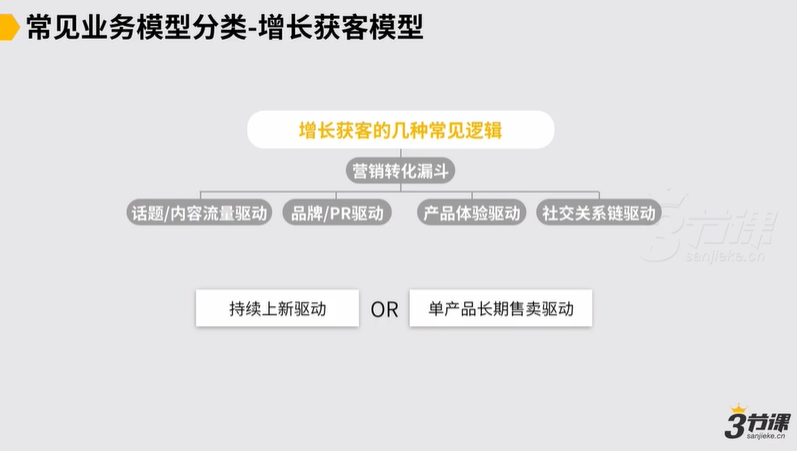

增长获客的几种常见模型：

**1.话题/内容/流量驱动**

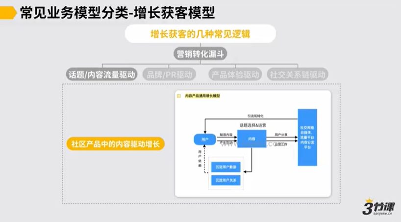

好内容的诞生模型：好题+对的人=流量+传播性内容

可以是先有话题，再进行人，通过对人提问题，生产出很多内容；要么把内容生产工具给到很多人，从中找出十分有传播性的内容。将上述内容对外分发（包括官方分发+用户分发），对自己产品产生进一步的引流和转化。

**2.品牌/PR驱动**

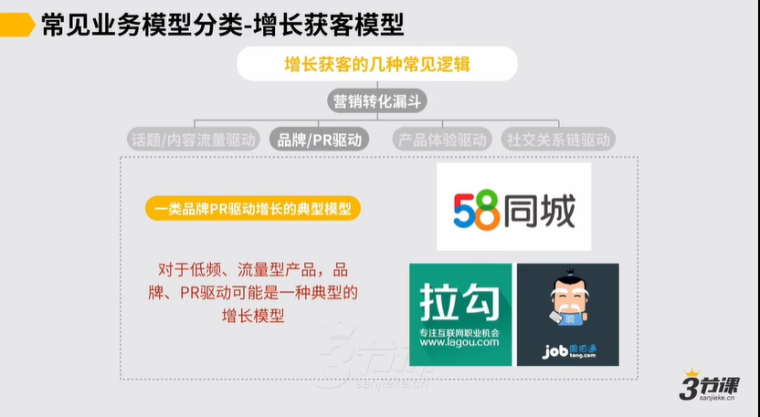

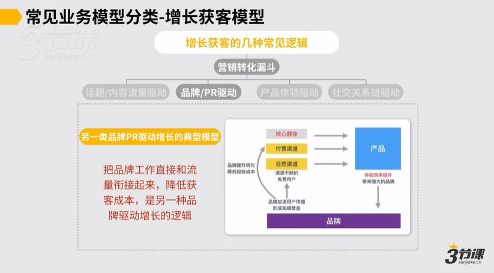

上述第一种，品牌宣传是为了占据用户心智，在用户心里，把用户需求与品牌名划等号。

上述第二种，品牌宣传是为了降低投放的获客成本，把品牌和流量获取结合起来，这样品牌的价值更容易被评估。

**3.产品体验驱动**

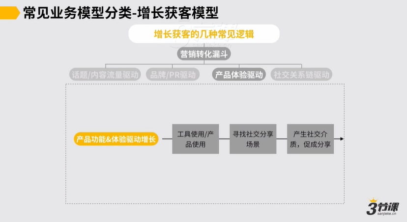

在用户使用路径中，寻找用户有分享动机的场景和节点，围绕场景设计社交介质，促成分享，也能源源不断给产品带来新的流量。

**4.社交关系链驱动**

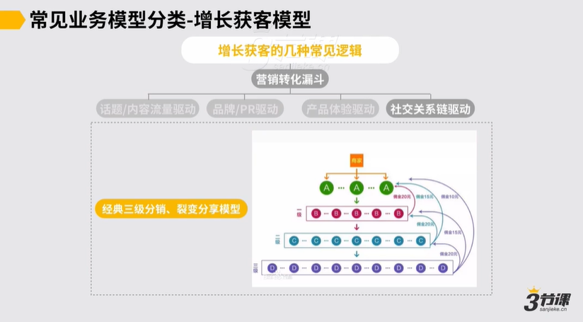

**5.根据产品生命周期不同，驱动因素也不同**

单产品生命周期短，靠持续上新驱动增长

单产品生命周期长，靠单产品持续售卖驱动增长

### **2.单体用户价值放大方面的业务模型**

单体用户价值（留存、促活、LTV）放大的几种常见模型：

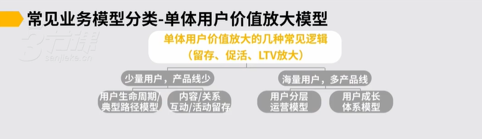

对于用户量少、产品线少的情况：

**2.1用户生命周期/典型路径模型**

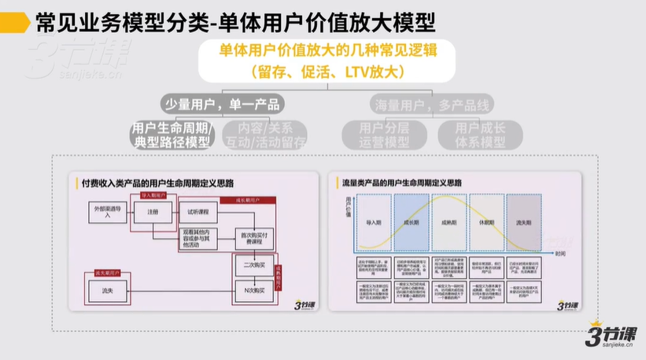

**2.2 内容/社交关系/功能服务留存模型**

对于用户海量、产品线多的情况：

**2.3 用户分层运营模型**

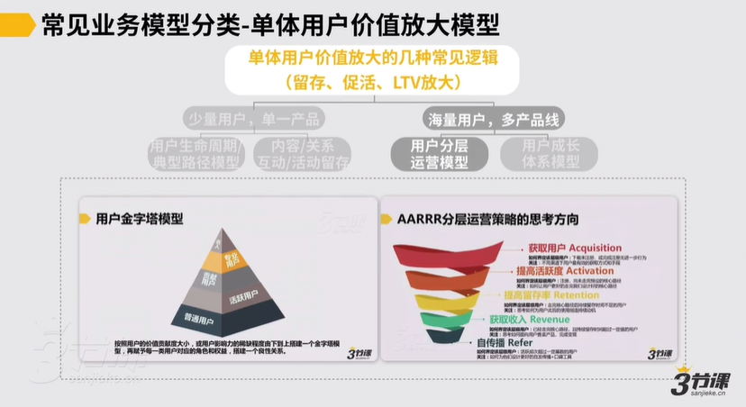

**2.4 用户成长体系模型**

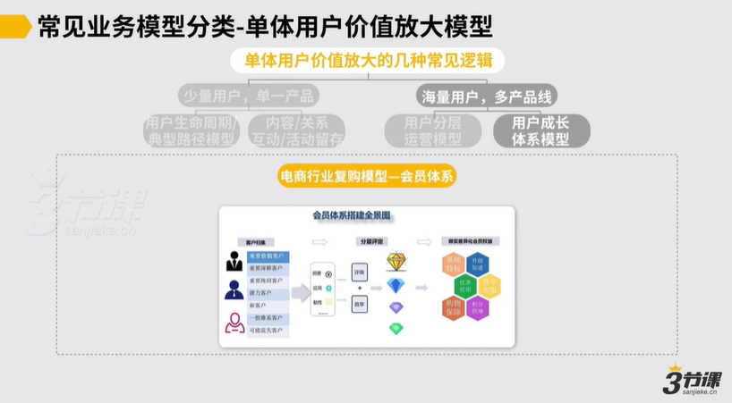

### **3.交付保障方面的业务模型**

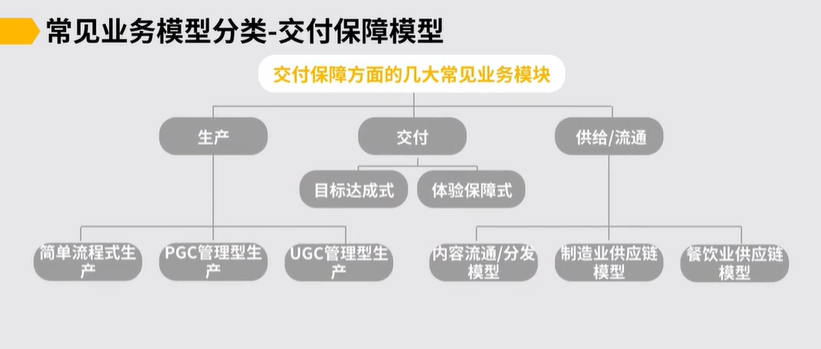

**生产方面：**

**3.1 传统行业生产方面的模型：单线流程式生产**

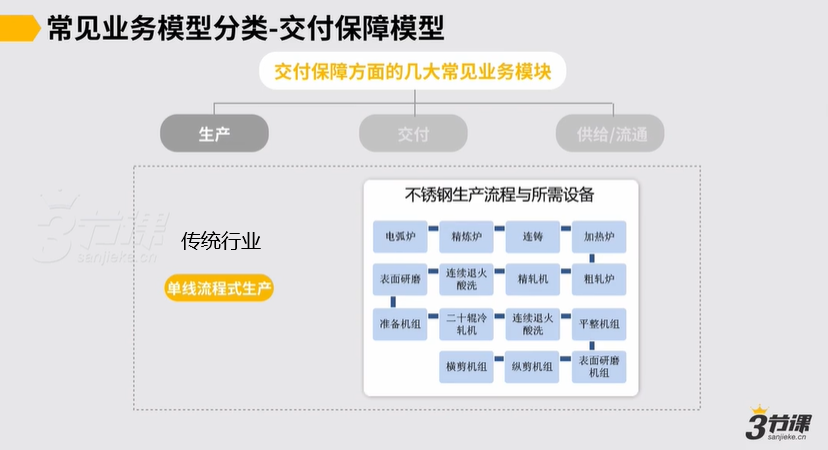

**3.2 互联网行业UGC内容生产模型：**

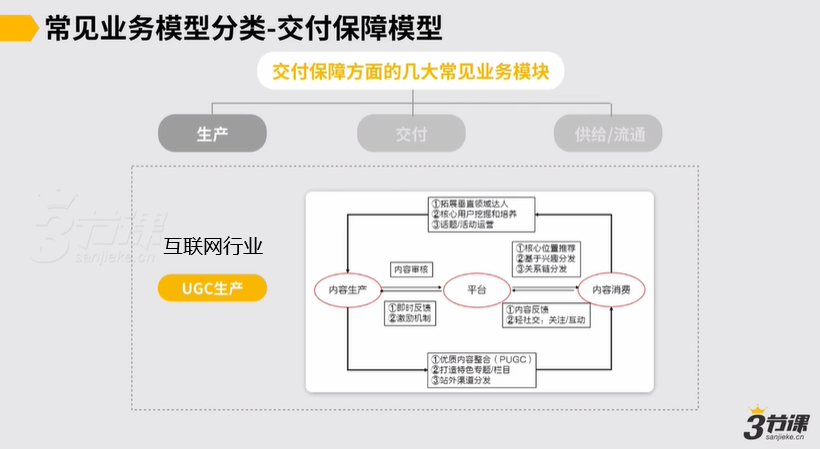

UGC内容生产核心：

海量用户+海量内容+筛选机制

对海量用户要有激励（包括物质和精神）、有反馈、有引导，来支撑内容生产体系。

**3.3 互联网行业PGC内容生产模型：**

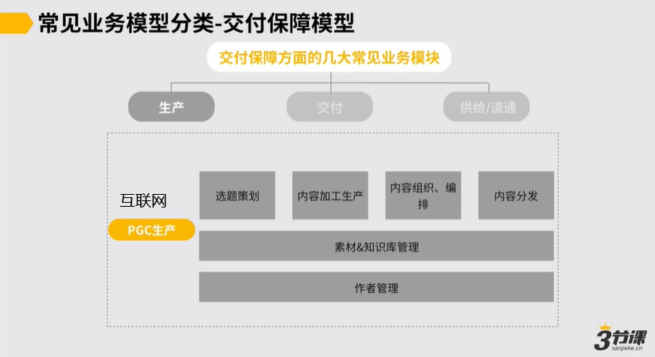

PGC内容生产：有生产流程、有素材库、有作者管理

**交付方面：**

**3.4目标达成式交付模型**

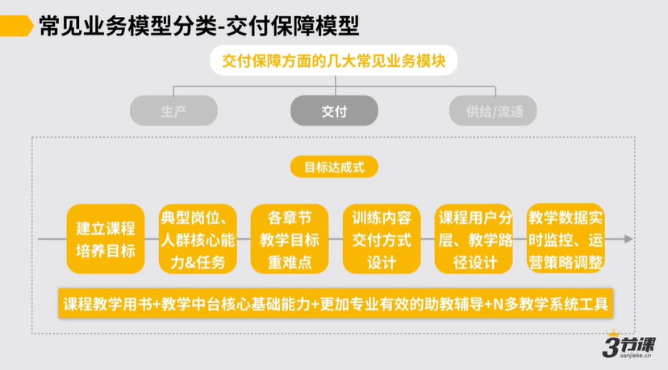

**3.5 体验保障式交付模型**

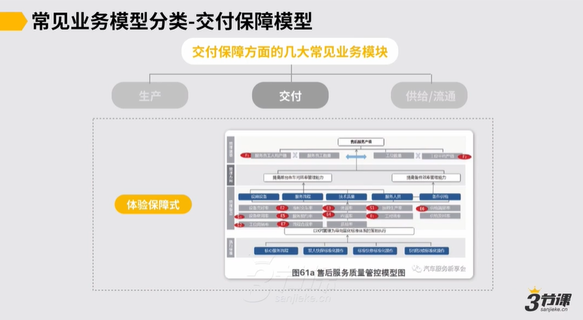

**供给/流通方面：**

**3.6 内容流通/分发模型**

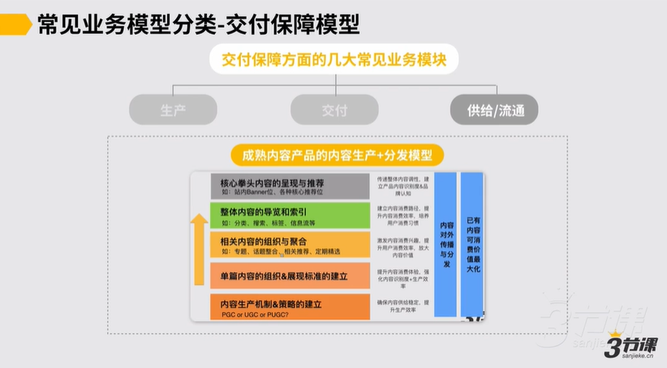

**3.7 制造业供应链模型**

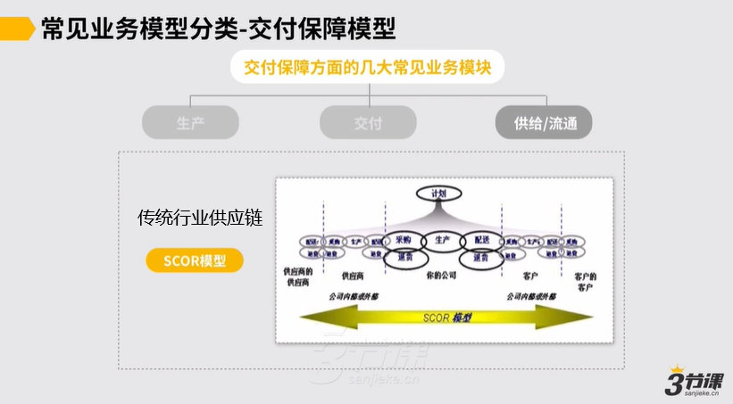

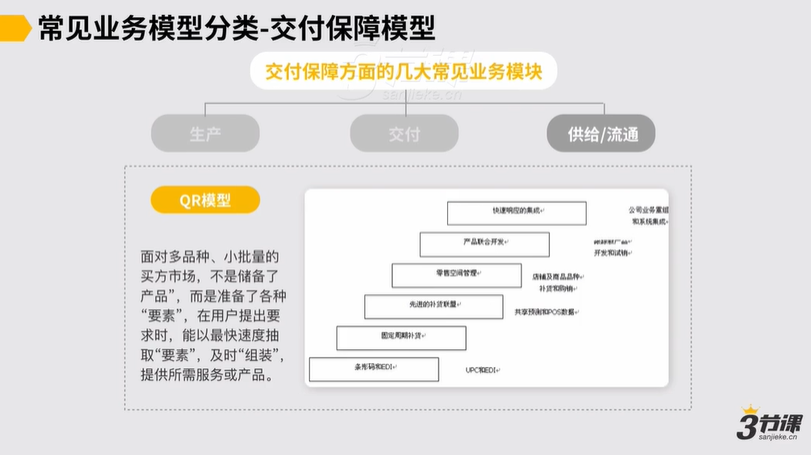

**3.8 餐饮行业供应链模型**

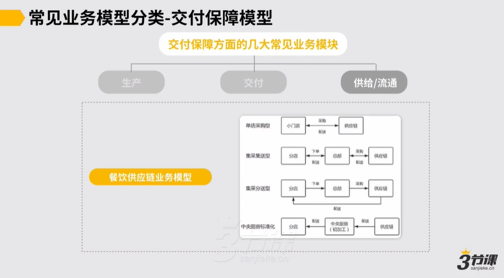

***

以下内容已被迭代：如何梳理“商业价值提升”导向的业务模型1.梳理用户从外部转化为注册/付费用户的路径+单体用户价值得到提升的典型路径

产品处理体商业价值=有效用户总量\*平均单体用户价值

关于有效用户总量，从梳理路径开始。

关于平均单体用户价值，用户的停留时长或付费金额

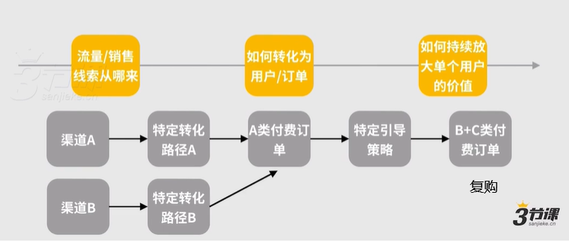

梳理的过程要评估两点：

**第一点 判断业务是否单一产品线**

对于单一产品线，用户路径必须尽可能单一

对于多产品线，要考虑产品线分类和产品线之间的关系

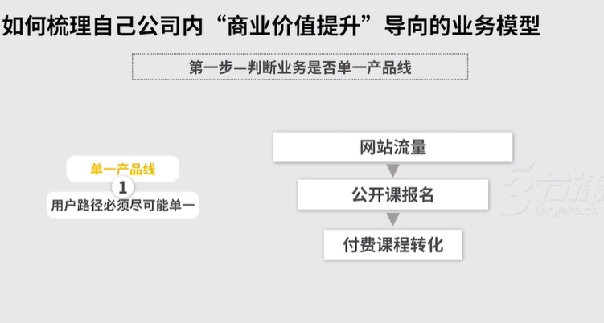

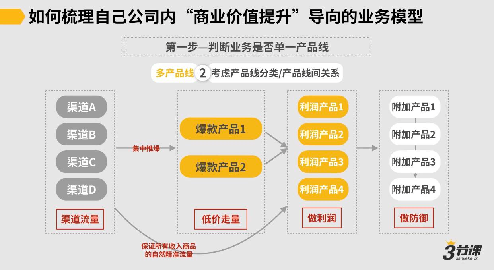

**第二点 评估该业务单一产品的产品生命周期**

注意事项：评估主要针对出售商品或服务的业务，而非APP

举例：通过知识付费类产品和在线教育类产品的区别，来论证评估产品生命周期对于搭建业务模型的重要性。

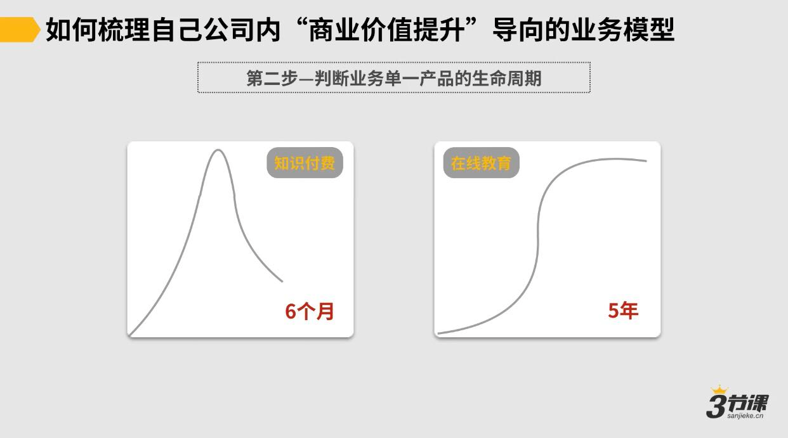

👆注意事项：从曲线对比可以看出，知识付费类产品的营销策略，要么海量生产产品，要么产品的迭代速度要极其快。知识付费和在线教育类产品，在用户转化路径方面虽然差不多，但是后端的驱动力和基本保障是不一样的。

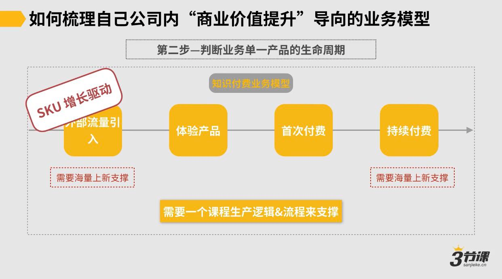

👆注意事项：在“外部流量引入”和“持续付费”环节，知识付费是需要高频的海量上新来支撑的，而且需要不断有新的概念，新题，新的IP，才能吸引外部流量，来支撑业务模型的运转。

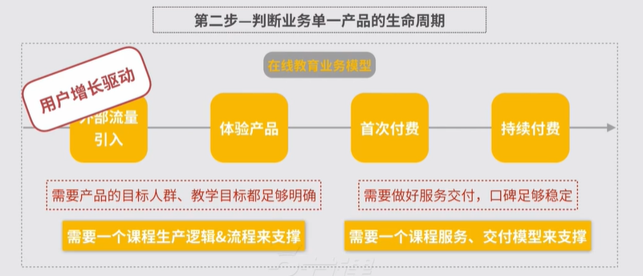

👆注意事项：知识付费用户用户本来冲着话题、概念、IP来的，用户需求和用户画像较为离散，用户预期较为杂乱，导致运营方一定不能满足所有用户的所有需求，造成用户口碑不稳定。

但是在线教育类产品在宣传时会强调面对什么样的用户，解决什么样的具体问题，所以用户需求较为聚焦，对课程的期待也较为明确，解决方案和交流流程就可以是标准化的，口碑十分稳定。这样就会造成随后每一年销量更高。

**总结：**

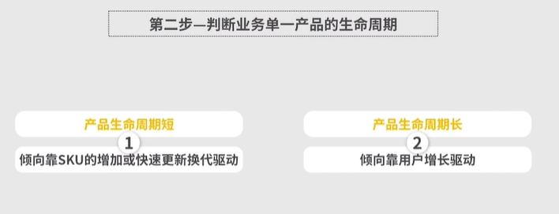

知识付费业务增长的核心依赖SKU增加，产品生命周期太短，不能依赖少数几款产品持续产生商业价值

在线教育业务增长的核心依赖用户增长，产品生命周期很长，即便只有少数几款产品，商业价值增长就可以有保障。

2.评估用户在产品内的“用户生命周期”长短

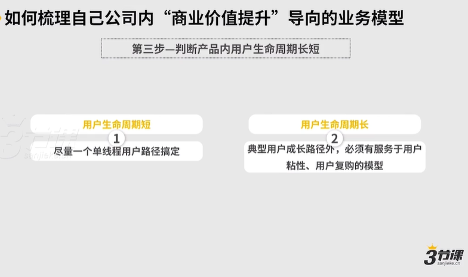

***

