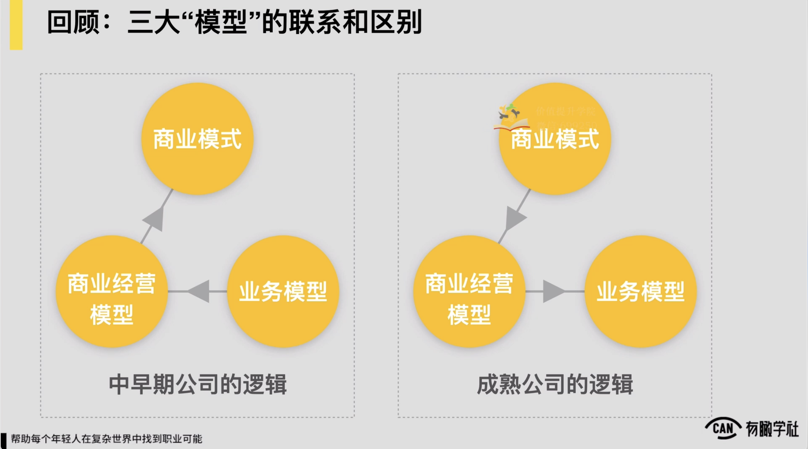
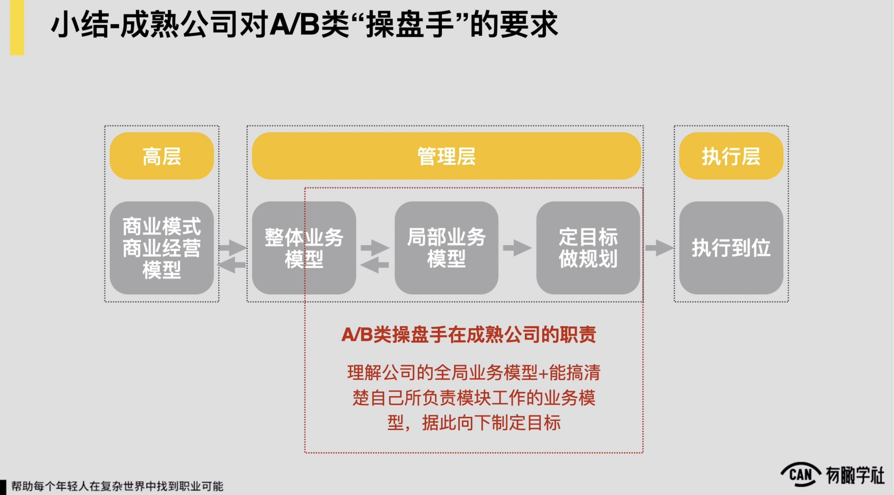
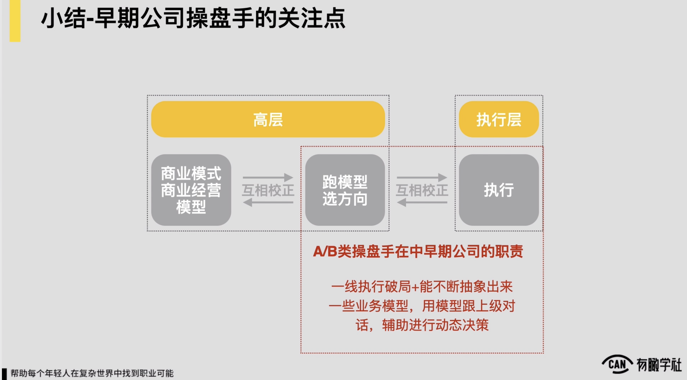

# 01、商业系统中的3大“模型”及其关系

***

# 商业系统中的3大“模型”及其关系

以上，我们就先进入到第一小节，然后商业系统当中的三大模型及其关系，商业模式、业务模型、商业经营模型各自它是什么东西。随后我们可能再理解一下这三者之间的关系是怎样的。对这三者之间的关系，本质上在中早期公司和在成熟公司里边也会不太一样。

对一般来讲，在一家中早期公司中早期公司，很多公司刚创办的时候，它的商业逻辑，它的商业模式等等都是不清晰的，它都是要在不断的摸索，不断的这种奔跑的过程中，慢慢才可对于说我家公司的商业逻辑，商业模式之类的会有更强的这种概念。

就像我之前提到例子。三节课的第一年通常啥都干，这家公司将来到底靠什么挣钱不知道。反正先干再，干到块，反正凿出水来了就往下继续深找。

所以在中早期公司里边，它往往的逻辑是，我要重点先关注我的业务模型，我的业务要先能成型，一定说在某件事上，先能创造一定的商业价值，不管是收入还是流量，然后我再去看创造商业价值的过程，是否可以标准化的。

**如果它可以标准化，就意味着说商业价值它的放大是也许有机会可以被规模化。**

然后看完这件事之后，往上慢慢的再去看，我商业经营的模型是怎样的，以及说我这家公司到底，最后我的商业模式是它会定型成一个什么样的样子。

所以中早期公司的逻辑是，优先重点关注业务模型，再往上，业务模型逐渐成型了。我们就往上渐渐的推演出来，我的商业经营模型和商业模型和商业模式是怎样的。约会是逻辑，但是这只是说一家中早期公司里边，它这三个模型最终的成型，下边业务模型要先成型。

上边这两者一般来讲慢慢才可更加的清晰， 但这并不意味着中早期公司的上级的脑海里边，他不会有这些商业、利润成本的这些思考，它同样会有，只不过在中早期公司如果的业务还没定型， 他脑海中虽然也会关注利润，也会关注成本，但所有这些东西它是较为零散的，它并没有一个很清晰的模型，可能在中早期公司的这种上级的脑海里边，通常就只能很粗放的看，基本就只是说我这一年到底花了多少钱。有没有收入，只能是按逻辑来去看了。

但是你把它绝对的模型化，如果我的业务没有成型，我是做不到的， 所以约是这么一个逻辑。这是在中早期公司里边的情况。

如果是在一家成熟公司里边，逻辑是反过来的，再加成熟公司里边，一定说本质上我这家公司我的商业模式已经很清晰了，我的商业经营模型可能也较为稳定了，例如像在滴滴或者像美团这样的这种公司。

它的商业的模式和它商业经营的这种逻辑，通常都是说结构是较为明确的，这时候是说他很难允许说我在我家公司里边有人去说做一个跟我现有的商业模式和我的商业经营的逻辑完全背道而驰的一件事儿，他很难接受的，如果真要有这种事儿。我还不如说人你就出外边去创业，我就投你。

你就不需要在我内部自己单独来去做了，所以在成熟公司里边，更多的视角是说上级牢牢的守住上面，然后往下去看我的业务模型怎么来优化，怎么来去升级，能支持我上边的这部分的这种模型，它会更加的这种强势， 所以这是在两种不同公司里面这三者的区别，或者是联系， 这是简单说一下这三者之间的关系。

我们再来去看这三个模型在企业经营管理当中的应用，跟我们第一章里边提到的一张图差不多，但是我们稍微的把一些词修改一下， 通常是说在高层的部分，在成熟公司里面，高层会重点来关注商业模式，商业经营模型，重点会去看好，我们每一块业务它的成本结构，它的这种利润。

就像我们第一章里面举的例子，一家公司成熟到像新东方那样的这种程度，它的最高层看这家公司它的经营管理第一逻辑一定，是一个财务或者说商业经营的一个逻辑。我的业务一共分几个板块，每个板块它的成本利润约是怎样的增长，怎样的，它一定会是这样的一个这种逻辑。然后他通常是说我会依据逻辑往下去看，往下去推出来说我这家公司里边的业务模型，每一个板块里边它处理体业务模型可能当前是怎样的，有没有什么问题。以及可能最多他会再往下去再看到一层，局部的这种业务模型会是怎样的，对从高层的视角来看，他最多可能要看的通常前三者了，通常最多就看到局部业务模型部分。

&#x20;然后从中层管理层的这种角色，中层管理层的这种角色说他重点在看的是中间的这三个部分，对重点说就像我们的，我要在模型上跟上级去同频去交流去沟通我所有的工作，我要交付给上级一个模型。

要么我就讲数据，要么我就告诉说上级说我这儿肯定有一个什么样稳定的模型，模型稳定跑下来，它能给这家公司带来多少商业价值上的增长，它核心在这块跟上级同频以及往下，它要基于我们的局部的一个模型去定目标做规划，然后下放到执行层，最后让执行层去执行到位。

&#x20;约是这么一个逻辑，在成熟公司里边是这样的。

在成熟公司里面，对于我们提到的合格的a类和b类的操盘手，它的主要的这种职责可能说在处理体业务模型上面， 因为我们提到a类和b类操盘手，通常是说大公司里面的项目负责人，小公司里面的部门leader。

可能还没有绝对到说你要在大公司里边，你本身一个说管着大几十号人，然后一两百号人的总监还没到程度，所以如果是 如果是这样的这种画像，你会发现这样的这种人，你让他直接说我要能去看清楚，要能梳理清楚处理体这家公司所有全局的这种业务模型是较为有挑战的，所以ab类操盘手对他并没有说你要去处理体把这家公司的业务模型全都给我梳理清楚，并没有这样的要求，但是我至少要知道这家公司它至少是商业价值提升的，商业价值增长的这样的一个这种模型约是长什么样的，我们至少有概念以及有了这个概念之后，往下我们要可把我们所负责的局部它的一个模型要进行清楚，以及往下基于此再去定目标做规划，给到我们一线的同学们，让他们去做执行，这在成熟公司里面。

然后对于ab类操盘手，他的要求理解公司的全球模型，加上能进行清楚自己负责板块的这种业务模型往下定目标就ok了。

成熟公司这边是这样的， 如果是在中早期项目里头，然后这三个模型之间的关系，然后就较为好玩了，它通常是这么一种认为，通常说中早期公司里边，然后在商业模式经营模型，然后业务模型，然后执行这三件事上，通常都是一个不断的动态在调处理，不断的动态在互相校正的这样一个过程。

&#x20;所以通常对于像中早期项目里边的负责人或像创始人之类的，你会发现他通常有些时候他必须扎到一线去，有些一线上面的这种战线，甚至说必须依赖于他本人才能打开。

有些时候他又是说我一线跑了一阵，我得往上，然后退一步，我得来开始去思考一些模型，约是这样的认为，所以假设一家公司它是说跑过了初创期，十分原始的初创期的阶段，它的高层的这种视角通常会在前两件事上面，它的高层的视角，如果一家过了初创期的公司，它高层的这种视角通常是说更多的就会在说不断的跑模型，选方向，然后有一个模型出来了，在方向下它的商业可能性是怎样的？

它商业经营的逻辑成本利润能不能打平，然后能不能挣到钱之类的，我要不断去算。算完之后发现说我靠方向不靠谱，我得换我就再跑一个新的模型，就再找一个新的方向，然后再去干。

&#x20;换完之后如果靠谱，那有可能我就要去强化它， 所以约是这样的一种认为。

所以如果是对于说你是在这种中早期公司里面工作，中早期公司的ab类的操盘手在项目内的职责核心说你在一线得可去执行破局，以及你也要可不断的抽象出来一些业务模型，用模型来跟上级去对话，辅助上级来进行一些动态的决策。

这是我们ab类操盘手在中早期公司里面，然后我们会对他需要去有的这样的这种要求。然后通常到这儿为止，我们约就讲完了说在一家公司商业系统上这三个模型之间的关系，这通常是我们第一节里边有的内容。 通常我觉得第一节的内容还是跟我们第一章的内容是有很强的这种呼应关系的，也希望通过第一节内容帮各位更好的消化和理解。我们第一章之前所讲过的所有的内容。&#x20;
