# 03、如何从一线执行跑出一个好用的“模型”

## 1. 业务模型的本质

一套体系或逻辑，输入A，一定能得到B，判断模型是否成型，核心就看模型的稳定性。

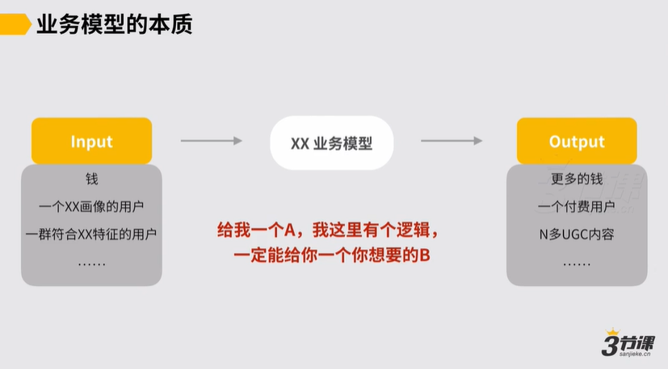

## 2. 一个“局部模型”的常见基本要素

### 1.流程

### 2.SOP

### 3.约束机制

约束机制的定义：举例，Airbnb的房东群体的维护，也许需要有一些激励机制和品控机制来约束，才能保证房东跟我们之间的协作关系是稳定可依赖的。这些为了保证一个系统可以稳定运转，或者是为了保证系统中多个角色间的协作关系可以更稳定的机制，都可以被称为约束机制。

### 4.角色分工

如果是向上沟通或者宏观思考，“业务模型”中更多把流程和相关约束机制进行清楚，知道模型的Input和Output各自是什么就可以了。

涉及到要向下沟通，才更需要有角色分工和SOP，让一线的同学明白自己该干什么。

## 3. 一家公司的局部“模型”逐渐成型的过程是怎样的

&#x20;早期👇

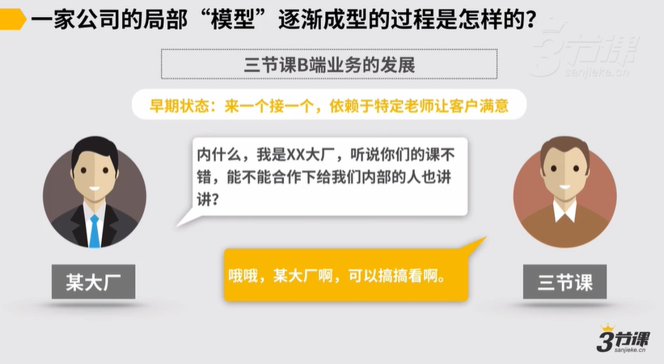

中期👇

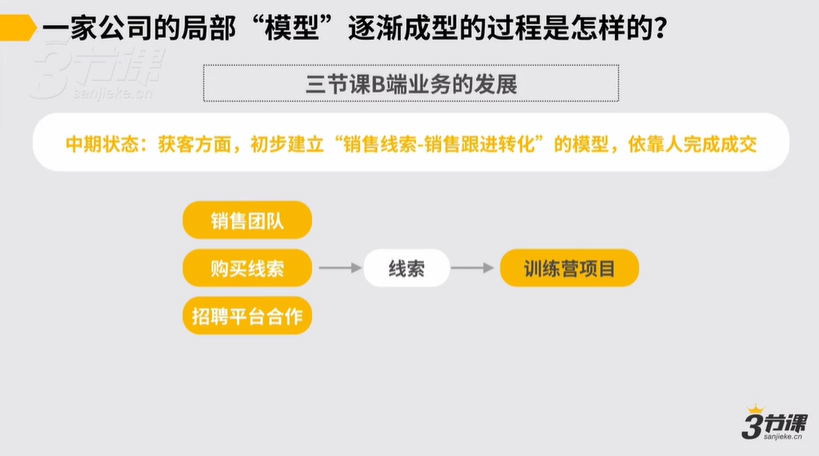

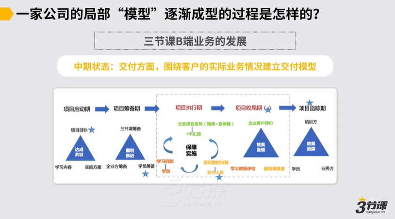

继续优化前端获客环节，加入体验产品，辅助转化重决策产品，使得前端增长获客模型稳定👇

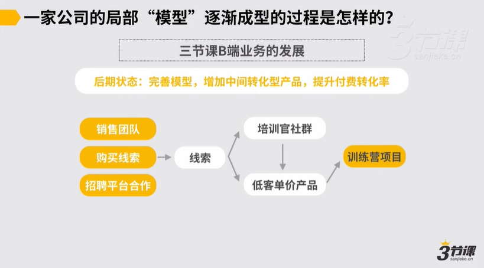

最终，历经1年时间，初步趋于稳定，成为一个初步可稳定评估衡量成本、收益和价值的“业务”👇

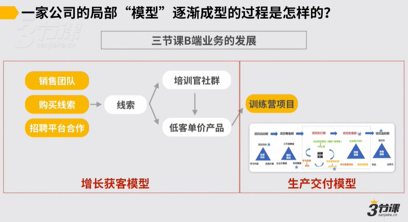

**跑通一个模型的真相👇**

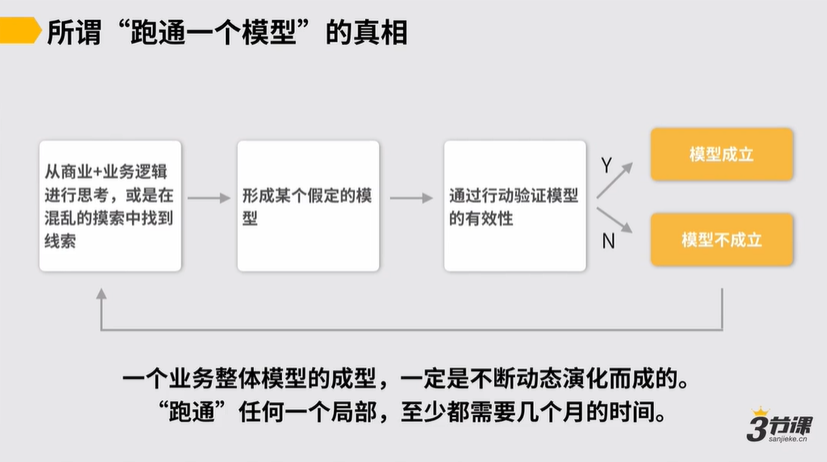

跑通模型的前提，是你得知道怎么思考。

## 4.如何在业务中从0搭建出一个“模型”

### **思考逻辑一：先找到外部的模型，再看它能否帮助你获得预期稳定的Input和Output**

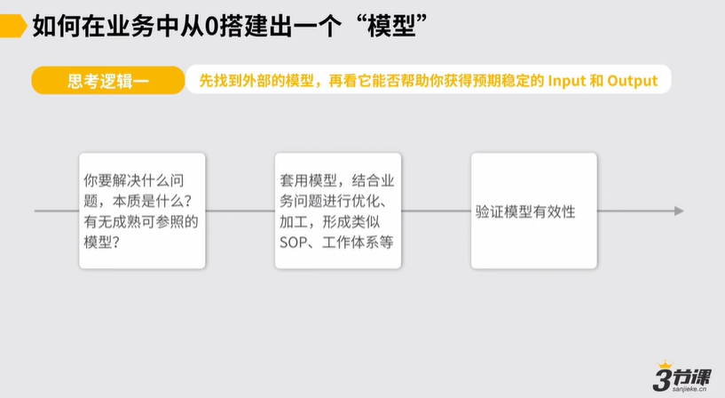

### **思考逻辑二：先自己能做到某件事已经有稳定的Input和Output，再看如何复制**

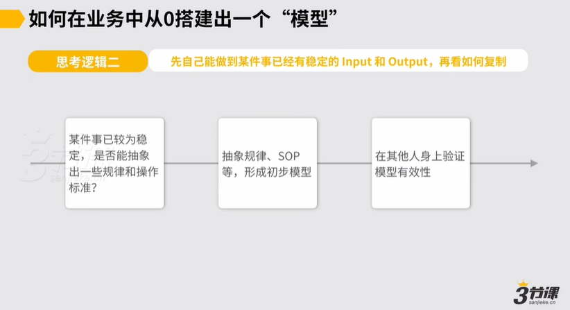

更多时候，上述两种逻辑都必须交替着综合使用。

### **举例：三节课“品类运营”岗位下的人才培养**

###

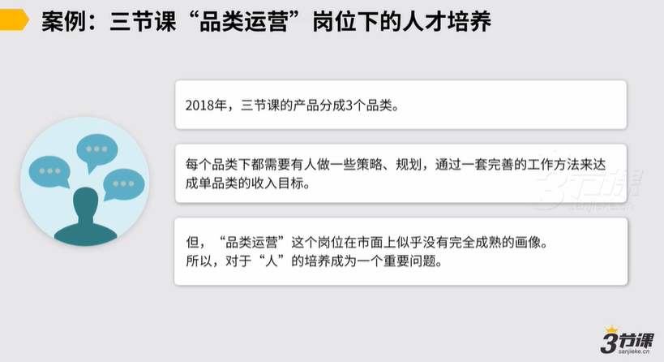

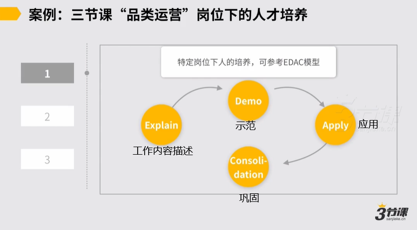

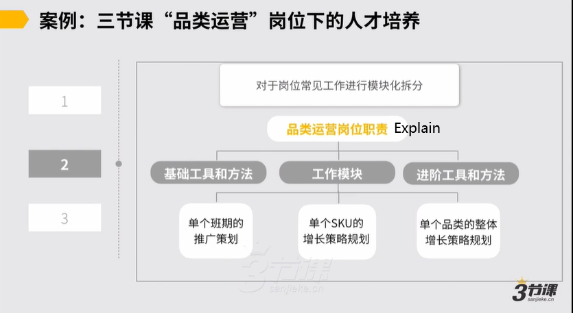

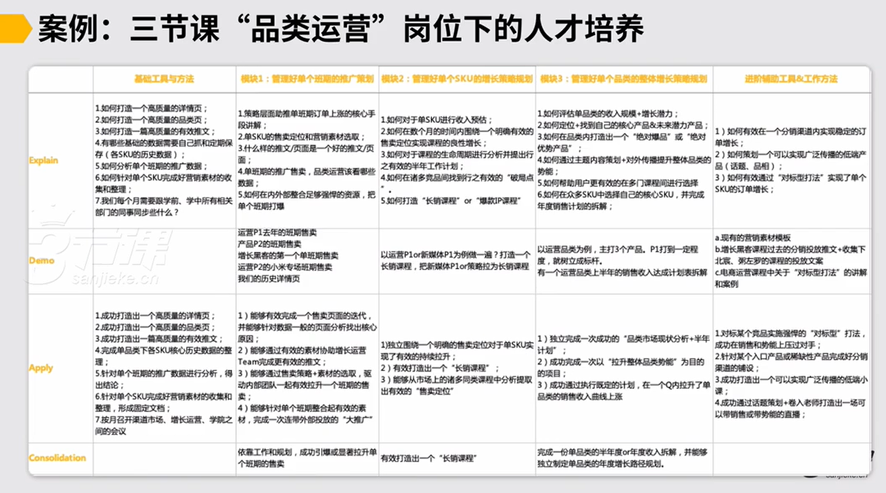

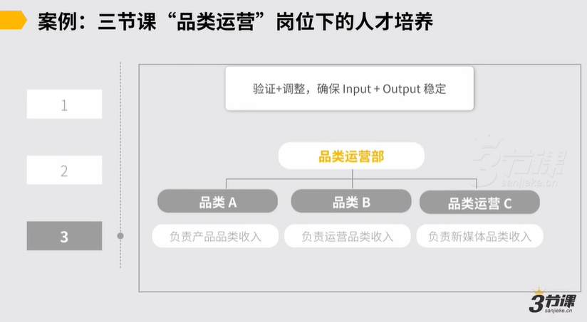

## **5.几点忠告**

6.1 越复杂的业务模型，想要跑通，挑战和风险更大，需要的时间也更长。如果你在一个新项目中，尽量让你在初始要搭建的业务模型要么是成熟可借鉴的（成熟的模型定量多，变量少），要么足够简单的。

6.2 如果不是有过成功经验，尽量不要在没有任何经验、手感、成熟参考借鉴的情况下，直接上手搭一个十分复杂的模型。

**简单的业务模型**一般是单线程、变量少、线条少的业务，一般1月内就能看出模型能不能跑通；

**复杂的业务模型**指线程多、有N多人和人的互动和N多信息交互的业务，它的复杂性就在于人的复杂性。

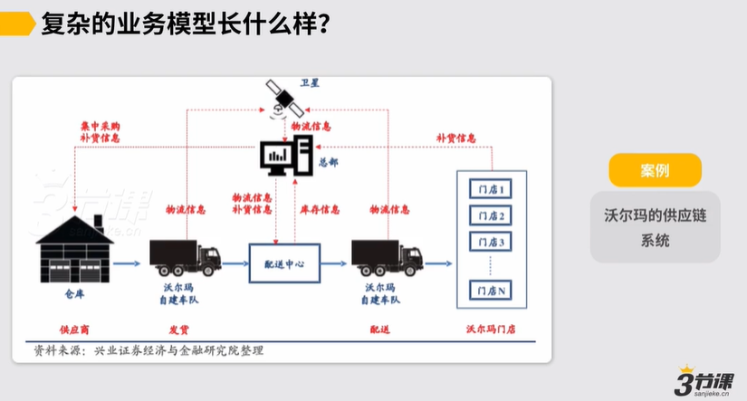

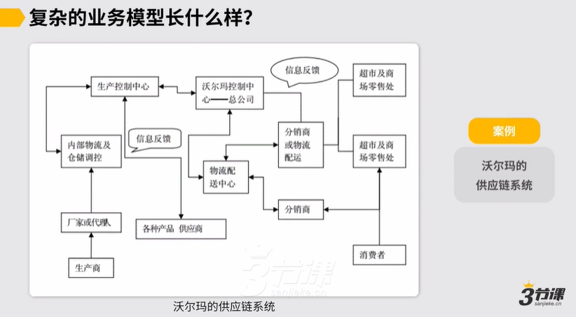

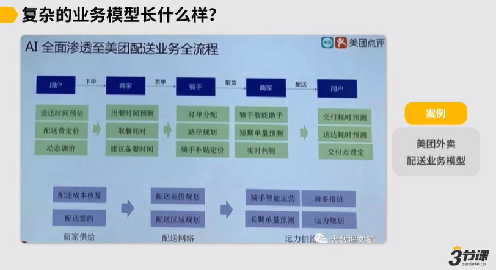

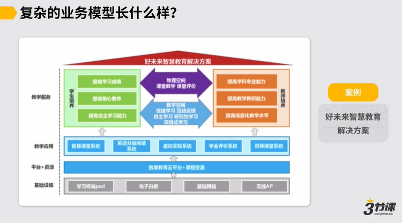

**一个负面的例子：**

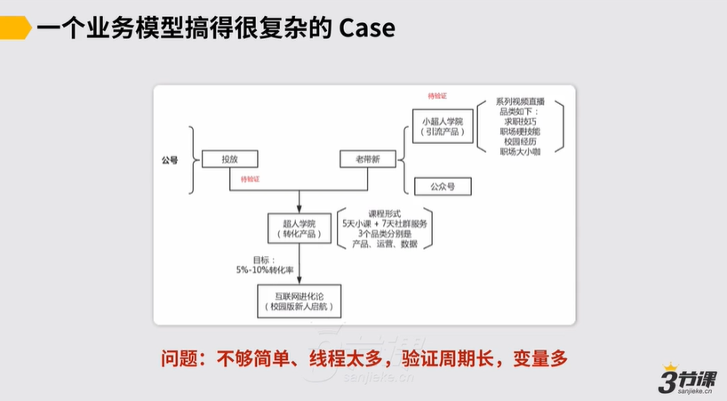

这家教育公司准备探索一条用户转化通路。它同时做了几件事：

1.在外部公号做投放

2.做老带新的转化：分享送40场直播

上述模型的问题在于不够简单、线程太多，验证周期长，变量多。

最主要问题是“变量多”：

1.转化产品本身的质量没有验证，就开始投放

2.外部公号投放是个待验证的事情

3.为了老带新，要进行系列大咖直播，作为权益送给分享用户

4.所有这几件事，是互相影响的，比如，转化率最终结果不稳定，原因到底是转化产品本身有问题？还是外部公号带来的用户有问题？转化率不高，是否因为做了系列大咖直播，让老用户都去老带新了，而不去购买产品了？

**重要建议：**&#x4E0D;要在假想中把自己要搭建的模型想的很复杂，想的变量十分多，当一个模型中到处都是变量，没有定量的时候，模型很难验证成功。

***

