# 二、如何制定北极星指标

## 1.明确商业目标和用户价值，找到2者交集

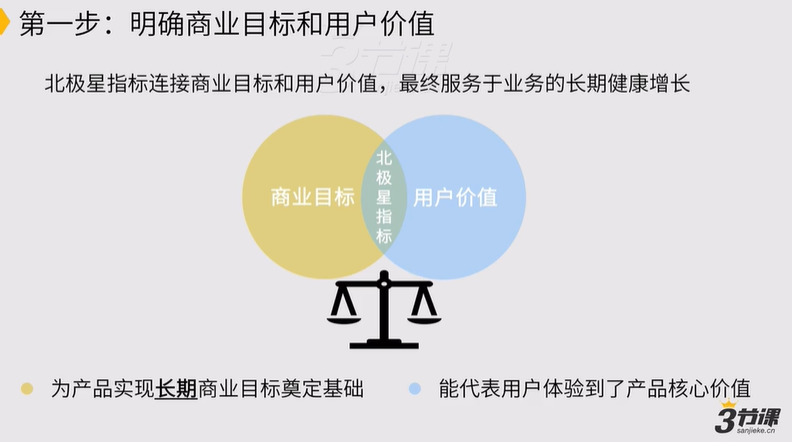

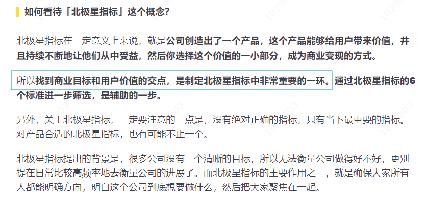

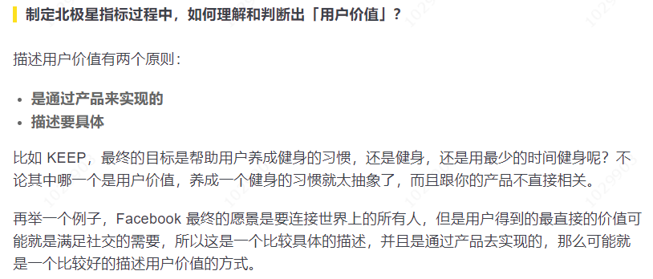

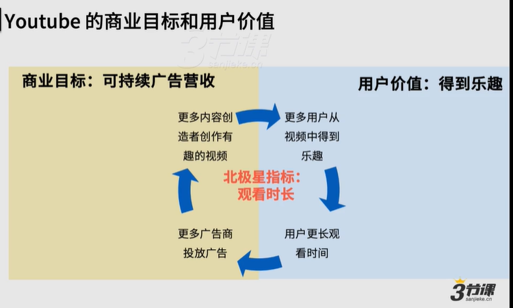

## 2.列出备选指标，通过6标准进一步筛选

通过找到长期商业目标和用户价值的交集，列出几个备选指标

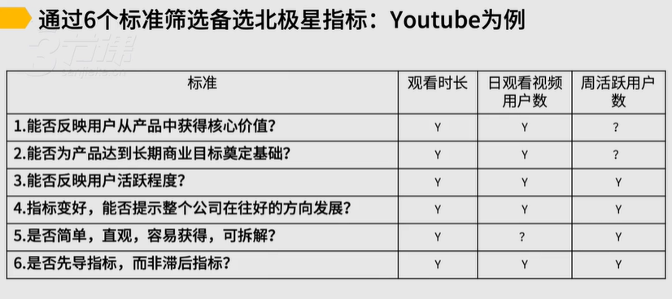

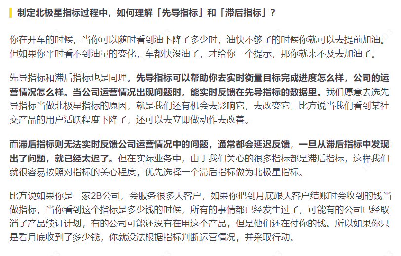

## 3.确认最终北极星指标，结合公司情况和战略决定

### **原则1：**&#x5BFB;找北极星指标并非一蹴而就，对用户和产品理解都需要时间

### **原则2：**&#x5317;极星指标并非绝对唯一，许多指标之间都存在相关性，在公司的一定阶段，都可以化为北极星指标

### **原则3：**&#x5317;极星指标代表了公司的战略方向，变动周期应该是以“年”为单位，但可能随着公司不同阶段的战略重点而变化

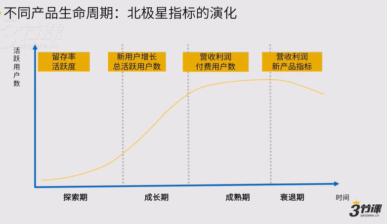

### **原则4：**&#x5982;果单一指标不能全面体现公司的经营情况，可以考虑加入重要的反向指标作为“制衡指标”

### **总结**

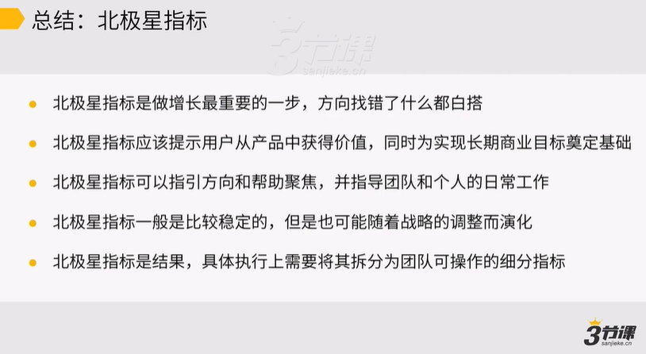

### 案例：猎聘、JIRA、小红书

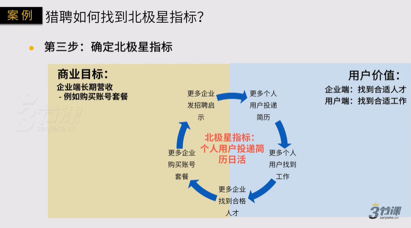

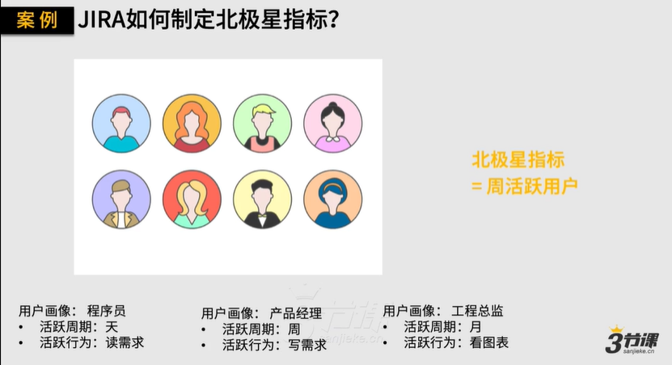

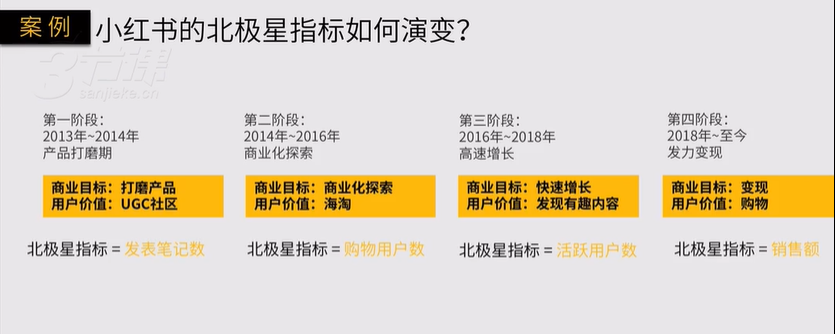

