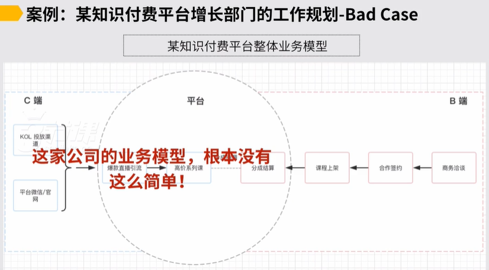

# 案例 - 某知识付费公司增长部门的工作规划

随后我们就进入到一个例子，我们直接用一个例子可能去处理个把我们从目标要下载到工作规划，甚至可能再推前一步，就从一家公司对它处理个的这种战略或者业务模型的层面怎么往下落实成我们的规划中间会遇到一些什么样的坑和障碍，我们拿一个例子来把处理个这件事去串一遍，案例是十分重要的，所以这部分各位一定认教化他，案例是这样的，这是一家知识付费的平台，这是一个真实的案例，知识付费平台它成立于2016年的年底，它基本的商业模式说它是通过平台交易来去做抽成，它是这么着盈利的。

，然后到2017年的上半年的时候，它通常它主要是通过微信渠道在微信的服务号里边，它自己积累起来了约有50万的粉丝。，然后处理个可能在2017年的上半年，它的处理个的平台纤维约1,000万出头，单月的gmv可能停留在100\~200万之间，上下浮动一点，约是这么一个这种现状。

在它的产品形态上，它处理个平台上做了一年半之后，通常它的平台上面的这种课程分为这两种课程，第一种叫做话题直播课。

，基本找一些大咖包装一些话题对然后可能就一个题来做直播，做完直播之后内容还可以录下来，回头还可以持续卖，约是这么一类课程，在他平台上有着第一类课程，它有的第二类课程就叫做系列课。

，基本说可能也是找一个老师，老师要讲，他又不是讲一个话题了，他讲一个系列，例如健身的系列，或者说如何阅读的系列，然后如何什么背单词的系列等等之类的，它有这两类课程。

这两类课程定价不太一样的。

，然后话题直播课它在平台上有约五六十个了，定价在50块以内，单个然后系列课通常定价会高一点，然后目前只有5，做了一年半只有5，定价可能在100\~500块之间，约就这家公司案例的标的的基本的背景，约它是这么一家公司，然后公司的背景我们约就进行明白了，然后随后可能到2017年的上半年结束的时候，这家公司里边有一个小a他是这家公司的增长的负责人

然后上级就来告诉他了，说到2017年的下半年，我们的建木微处理个在这6月之间我们要做到3,000万，

然后说你来给我做一个这种工作规划，这时候相当于上级给了他一个目标，他这家公司基本的背景我们了解了，上级给了他一个目标，然后围绕着目标，他要来去做他团队里边的这种工作规划，对这时候他该怎么去思考？

于是小a拿到这样一个命题之后，他就开始按照我们课程里面讲到的基本的逻辑和基本的方法可能往下去做梳理。

首先他做了第一步，他就去梳理了一下，说我们支付平台它处理体业务模型应该是怎样的，他就自己按照他的思考做了一轮梳理，他觉得说我们平台它业务模型肯定说联通c端b端两块，在c端部分，反正我主要是有两个渠道，一个渠道是说我每次反正上这种什么爆款的这种话题直播课对我都会通过kl去做很多的微信生态类的渠道投放。

另外一个我自己对我自己现在有个50万粉丝的这种大号，它也是一个渠道，我们有微信的这种流量，还有我们官网的流量，也可以往里面去导。

，所以我们基本说往我们直播课程去导流，直播课程听完之后，很多用户他会去买高价的这种系列课，他就想说我公司c端的业务模型约是这样的， B端这边反正通常说我们有一套流程，跟讲师反正怎么着去谈合作，最后签约，最后跟他分成结算就ok了，那平台在其中挣的钱是分成抽佣

他这么着梳理的，梳理完之后得到这么一张图，这张图看起来并没有任何的问题，所以他继续就往下走了。

随后他就往下去走，说好业务模型我梳理出来了，随后可能我就要往下去做一些这种拆解了，上级给到我的工作说是3,000万的流水，按照我们课程里面讲的方法，这3,000万流水要达成他的进攻叠加性目标和前提保障性条件，可能各自应该是怎样的，进攻叠加性目标，我肯定应该从收入上对吧去分别做拆解。

前提保障性条件他就想了一下，说似乎有可能有这三个，首先我在下半年对如果我要去做，例如我的收入增长，然后我似乎每个月都得做一些活动，所以它的活动营销的后台必须上线，其次是说我当前看数据效率十分的

然后所以我也希望公司的产品部门给我做一个数据后台，来提升我的工作效率，所以数据后台肯定必须上线。再一个我们b端这边引入课程的这种进度或数量，必须稳定，他想了约这么三件事儿，然后这是他梳理的前提保障性条件。

另外在进攻叠加性目标上，然后他就继续往下去拆解了，他就梳理他们公司的处理个收入的公式，它是按一个十分简单逻辑来梳理公式的。

，基本说我们公司下半年的收入的这种流水gmv它应该等于什么？应该等于每个月流水的加重。所以他预计可能简单又猜了一下，说似乎我月均的流水我得做到500万，注意这一步它是按照逻辑来拆的，就按自然月先做叠加来去拆，它是这么着拆的。

，然后他思考到了说我月均流水要做到500万之后，再往下一步，他就再回归到说他前面说的业务模型对那里边有一套用户从外边怎么来怎么转化的这样一套流程，他这时候才想到说我要跟业务模型可能对应上，对应上他就又形成了一个基本的收入公式，我的月流水等于我的我外围渠道的流量乘于转化率，我们直播课的转化率。

，再乘以我们的直播课到系列课的转化率，再乘以我们平均的APP，他可能就理出来这么一个公式，然后理出来这么一个公式之后，他又看了一下他当前数据月流水是200万

他当前渠道流量这边每个月可能做1,300万的外边的这样的这种流量被引进来，然后在直播课上的转化率是30%，直播课转到付费课5%，然后课程的up值现在是10块钱，约当前它的200万是这么来的，随后他做500万500万这边他应该怎么做？

他简单想了一下，说渠道流量1,300万偏高的，也许渠道流量我稳定在每个月1,100万可能就差不多了，但是到直播的转化率，他觉得说我有机会提升，要提升到50%

然后再往后边系列课的转化率有可能来讲，例如3\~5之间可能也就这样，所以系列课的转化率我提升空间不大，但 Up值我是有机会提升的，所以我想把up值从10块提升到30，这样我约每个月就能做到500万了。

，他约梳理完了之后，就得到了自己的这样的一个这种假想。所以这里边它有两个重要的提升的指标，对他就按照他的想象，他两个必须要提升的指标分别是什么？分别是直播课的转化率，还有我们的up值，他要重点提升这样两个目标，以上，到此为止。

我不知道各位在刚才听故事的过程当中有没有发现什么问题，各位停下来可能消化一下，酝酿一下，认为一下刚才我们讲的案例，讲到这一步为止，有些什么问题查看。

结合刚才我们处理个讲完的案例 Case，它的问题到底在里？第一个重要的问题，各位请注意，这家公司这家支付平台我们刚才讲过了，它的直播课对我们刚才看业务模型里边，它核心是说外边有流量，转到直播直播课转到系列课对以上各位，直播课是一场一场做的，所以到这儿对你说我外边渠道流量每个月1,100万，我要稳定我的外边的流量和转化率，但是直播课是一场接一场做的，我的直播话题课，每一场题IP和资源都不一样，然后都不一样。

我似乎在处理个下半年我要做n多场的这种直播课，对各位如果我每个月要做3\~4场，我的处理个外边的流量和转化率，我每一场的直播课，例如因为我是跟外边的一个kl合作

我谈了azkl假设他自己话题做得因此，或者说他自己就有很多的流量资源，他能绑定过来跟我一起玩，这一场直播可能我的流量和转化率就会高一点，但下一场直播如果再做，我的流量和转化率能稳定在一个区间吗？这可能打一个问号，因为我直播是一一场做的，所以你说要让这一块我的渠道流量，还有我的直播转化率要稳定，在逻辑下似乎有点不太容易的，这是第一个问题。以上继续往后。

那么第二个问题是说我直播课到系列课的转化率，我也想稳定在一个数字上，想稳定在3%或5%。各位刚才我们提到了，这家公司只有5系列课，各位但凡做过这种例如偏教育产品的转化或偏课程产品的转化，或者但凡了解过一些，各位一定都会知道，说如果我想卖一个课程，我想卖a课程，我前边我要设计一个例如一个讲座去卖它，讲座一定要跟a课程他有些关系，他才可卖出去的，

你很难想象说我开了一个美妆的直播，然后最后我告诉你你要买一个英语的课程，

太扯了，差的太远了，这儿存在第二个问题，我一共目前就这么5系列课，我也不是每一个直播话题都能卖他们，转化率我到底怎么能控制，似乎我根本不可控。如果我根本不可控，公式对于我而言到底它是怎么成立的各位？所以公式有可能在真实这家公司业务当中它根本就不成立，公式根本就无法代表这家公司的业务，这是它真正的问题。以上，问题的根源在里对我们回到小a所梳理的这家公司的业务模型上面来。

各位再查看，它梳理业务模型是说c端在外边有流量，我有自有的流量来自于平台微信和官网，还有外围的渠道是ql投放，中间直接就转到爆款直播引流，爆款直播引流再到高价系列课他这么梳理的，但是按照我们刚才说的爆款直播的引流，它是一一场做的，所以它并不是一个恒定的稳定的产品，各位，包括我们后面的高价系列课也有5，每1高价系列课它对应的爆款直播引流的课程也是不一样的各位。

所以是这么一个逻辑，所以好到此你会发现这家公司的业务模型根本就没有这么简单，它不是这么一个简单的逻辑。

，所以在小a他的工作规划，初期可能刚才我们看到的是一个负面的案例，他处理个在案例当中他工作规划没有梳理清楚，没有去给到一个最终可较为落地可行的这样的一个这种规划核心，会在于说他对于这家公司的业务模型根本就没有梳理清楚，这家公司业务根本就没有这么简单，核心在于这儿。

所以各位一定要知道，业务模型如果你梳理的不够清晰，这就要再一次强调，业务模型如果梳理的不够清晰，不够准确，你做出来的规划很不靠谱的。以上，还是这家公司还是小a这个人，小a在得到了一些反馈之后，他把这件事儿可能就重新就捋了一遍，然后又重新做了一遍，简单查看他重新做的时候，它的处理个的思路会是怎样的。

首先说我们再去说定目标的时候，我们一定要向上看对我们昨天说了一定是我们要先理解说一家公司它的商业模式是什么，商业模式推出来一个基本的收入公式，然后我们会在细致的去梳理它的处理个的业务模型，依据梳理业务模型就得到一个更精细的公式，

所以我们先要知道这家公司它基本的收入公式是怎样的。，然后其次我们可能follow我们的业务模型对我们要去把这家公司的所有公式要梳理的极精细，我们要先做到这两步，我们的工作往下再去落对才会更加的具才会更加的可做到跟高层他的关注点可接得上轨，约是这样。

所以好小a可能就按照我们刚才讲的逻辑，把它重新捋了一遍，说这家公司我所在家知识付费平台，它处理个的增长导向的业务模型到底应该是怎样的为了把这件事儿梳理得更细致更真实，他按照他们的最终的收入产品的逻辑，可能往前又推了一轮，首先是从前往后推，然后现在他是从后往前推，又推了一轮，从后往前推，首先他们的高价系列课有5

然后约是这样的，这5课当前主要是怎么卖的他会发现好我不同的课通过不同的爆款直播话题课来去卖的，这里边有一个对应关系，例如 ade这三个课能卖我的高价系列课小a对然后bf aitch这三个爆款直播课能卖我高价系列课小b它是这么一个对应逻辑，而并不是说我一个直播课，反正现在对多个课程，现在我的逻辑不是这样的。

，然后再往前看，我每一个爆款直播课，然后它对应的我所需要的这种流量，相当于每一个课程一次营销活动，通常是这样的认为。

所以每一次爆款直播的这种课程上线之后，一定都会同时配我的平台的流量，加上我渠道外围还有一系列的投放，它一定都会配这样的一些配套的资源来去推，所以这家公司真实意义上的这种业务模型，它约是这样一个认为。

以及在认为上，好这里边还有一些基本的这种约束条件是什么？

我们会看到本质上因为他们公司自有的渠道主要是服务号，服务号通常当前的认为是说每周可能推4次，然后每次约差不多平均2万阅读，服务号内有一个商城，商城通常稳定，就h5做了一个小商城，然后商城通常他每天可能差不多1000左右的UV，所以你发现他们公司处理个在增长导向的业务模型上，他不太可能在当下快速的能通过我自有的平台流量来去驱动，除非说我平台流量前面又加了一个动作

我就通过什么样的这种工作，例如通过投放也因此，通过别的什么工作也因此，我能持续给平台可能去涨粉。，除非前面有这么一个前提条件，否则就在当下，如果本身平台它涨粉也不那么犀利，

本质上我这家公司增长很难通过说平台流量去驱动的，然后在渠道投放上，它通常是一个说投放的节奏，会完全follow我们直播上线的这样的这种节奏，而他每个月最多只有三次直播，因为每一次直播可能他都要去，例如谈一个大咖，进行话题包装策划，外边谈好多渠道配套去进行，十分占人力，十分占资源。

所以本质上它通常说每个月最多我只能进行三次，每一次外围我都配一堆投放对所以这才是它真实的业务模型。

以上，在真实业务模型上我们再查看本质上按照我们刚才捋的，它的爆款课能不能在外持续的打爆，才是这家公司增长的前端的一个关键。，例如每个月就做三次对说做三次舍两次，这家公司增长肯定不可持续，但你例如我每个月做三次，每一次做的都很火爆，每一次可能都能带来约十几万人来去参加课程，对这事就有意思了。

，所以这是一个它业务模型里面的关键。另外一个说要能带货的爆款客，必须得专门对口策划跟我们的高价系列课去对应，事儿才可做到我们的收入是可驱动的。所以在它业务模型处理个梳理完之后，我们对它业务模型有了一个更真实更具体的认知。

以上，如果是follow认知，你会发现业务实际上的收入公式它是怎样的，它实际上收入公式是这么一个样子。

，它实际上的收入公式本质上说我每月的收入公式可能说我每个月就做三次直播，然后每次直播有专门它外围的渠道和流量，每次直播转化率都不一样的，每次直播往后要转化的付费课程也是不一样的，

所以本质上我每个月就做三次直播，这三次直播每次累计加在一起，每一次做完对我而言一笔收入，对它本质上它的业务是这么一个逻辑，一次直播意味着一波收入，每个月就三波收入，本质上它是这样一个认为，所以它真正意义上的收入公式应该是这样的。

，这就回归到我们所讲的你的业务模型一定要梳理清楚，你才能得到一个真实的这家公司它真实的一个这种收入公式，约是这样的。

以上，到了这一步我们往下要再去看，说同学小a他的工作规划到底该怎么来去做，对以上，这时候我们就回归到另外一部分，我们一在昨天上一节的时候讲过的，我们业务模型对我们局部当前所处局部工作目标的影响到底是怎样的，对我们说了是你的处理体业务成型没成型，以及你所负责的局部稳定还是不稳定，

我们在每一个不同状态下，我们的思考肯定应该是不一样的。

，我们基本发现像小a他所处这家公司，他负责的增长部门，有更接近于说下面的这两种情况，他公司的处理体业务算是成型的，处理体业务，反正一个做gmv，要不断的把BC2端好的，现在我也往上去做对除非你说公司老大他的战略都要变了，我要换一个模式了，对如果老大没有拍板，它处理体业务还算成型的，然后他负责局部，你说有没有个雏形算是有的。

，所以他可能有两种选项，第一种选项说提升我所负责局部它处理个的运转效率和放大它的开口，对这是一种选项。

另外一种选项说我所在局部我也可以思考一下，它当前的增长是否有瓶颈，如果有瓶颈，我是否也可以考虑说我在我所负责局部去升级一个新的这种模型，这两个部分是各位可以去思考的。所以小a推演出来两个思考，第一个思考叫做什么？反正我每个月就三场直播，对然后每次直播对我一波收入。

，所以我可以有的思考，说我干脆就把我所有资源收回来，我重点着力做少量的这种爆款话题，因为有可能对直播话题课来讲，例如我一个月就做一场，这一场比如打得很爆，他有可能比我一个月平均做三三场可能都是六七十分，有可能效果完全前面我只做一场打得很棒，效果后者的2\~3倍

所以我有可能的其中一个思考是说我先重点着力做少量的极其精品的这种爆款话题，把它爆到极致，从选品到开完的拓展，到我外围的care的投放上，再到我的后边的对系付费系列课的转化上，全部都做到极致，这是我可以有的一种思考方向。

另外一种思考方向什么？另外一种思考方向可能说我也许发现说这家公司有可能它收入公式太复杂了，为什么你看月我每个月的收入是通过我做三场直播，一场直播带一轮收入这么来的，对处理个下半年我的收入是怎么最终被驱动的？

处理个下半年等于说我是每个月3场，然后6月我做18场，处理个下半年我的收入是堵在这18场收入上，这18场收入我有可能还得说每一次我都得做因此，每一次都在一个及格线上，我的收入才有保障。

如果说但凡你说这18场里头，如果一旦不幸我折了1/3，这家公司的收入它就不可驱动了，我的目标就达不成了。

所以有有第二个思考，说我的收入公司太复杂了，但凡你把你公司的业务模型梳理清楚，最后得到一个收入公式，公式如果是说它十分长，然后组成的项目就十分多，对有可能收入公式都会是较为复杂的。，包括爆款直播引流中间也不可依赖业务模型，处理个我也很难去驱动

所以有可能我的第二个思考，也许我也可以考虑说升级我的业务模型，让我们的处理个业务模型足够简单，对于是小a再往下他就又有了一个思考，说我这家公司如果要升级业务模型，也许可以怎么思考，也许我可以试试看，说我在中间所有的例如话题的爆款课在部分，然后我让物业模型有个升级，我把过去么多的这种题的爆款课往我的高价系列课去引流，把逻辑做一个改变，我试着只做一款引流的产品，例如举例子，我让某个学习大咖对吧去给各位去讲一下，说我们人生当中可能要学习就分五大方面，对这5大方面你身处不同的阶段，你应该分别选择ABC，然后这几个东西，我就通过这么一个例如半洗脑或者是半强势转化的这样的一个这种课程，把它作为一个引流转化产品，我让产品要变得足够稳定。

，我可能让我一个模型变成这样的一个认为，我让产品变得足够稳定，它可它能做到第一它放在这儿长期不变。

其次，他也许例如同时往后卖我的高价系列课，abcdef1转化产品同时卖5课。，他如果能做到这一点之后，我处理个的1模型就简单多了，我一下就变成了说我无非外边的渠道投放和平台流量玩命就往我的引流产品倒

我这就有一个产品，这产品是稳定的，对它永远不会变，然后产品往后我就看一个转化率，在逻辑下，当我的业务模型实现一个升级之后，你发现它的收入公式就变得就简单多了，它的收入公式立即就变成了这样，我的流量乘以我引流产品的转化率，再乘以说我引流产品分别到ABC这三个课程的这种转化率，再乘以我最后的 up，它会变成这样一个公式，你发现如果它是这样一个公式，它在例如放到半年或一年周期里边说我要提升这家公司的收入，他的收入是更可驱动的，各位。

它无非说我流量做大，转化率提升

Up值提高，然后它会变成这么一个逻辑，所以这时候他业务模型变得更简单了，他的收入也就更可驱动了。，到了时候他再去想，如果我要达成我的3,000万的流水，我还需要什么前提保障条件或者进攻叠加性目标对目标就按照我们刚才说的收入公式来去拆借，说外围要进行多少流量，我的新的转化产品它的转化率要稳定在多少，我的up值要提升到多少

然后它的例如处理个3,000万目标基本就这三方面拆完就ok了。

，然后前提保障性条件就变成了是什么？变成了说我在引流产品这我一系列的这种配套工作，例如引流产品需要说一些平台和工具来去支持，我在引流产品部分，我要组建一个这种团队

团队要具备说什么样的这种能力，然后引流产品我必须得在多长时间内，然后我先上线完成一轮小的测试之类的，这些构成了它的前提保障性条件。

所以最后依据这么一个思考完了之后，它处理个的工作的规划通常就变成了说我可能先做好我的前提保障性条件，一共有5条件，我先让他们发声，发生完了之后，好随后我要去进攻达阵了，达成我的目标了，

所以我在进攻达阵方面，我分别去说一个部队提升我的转化率，另外部队提升我的外围的流量，还有一个部队可能去提升我处理个付费产品的up值，这样我工作目标往下完成拆解，我的规划就变得十分之清晰。

以上，这是同一家公司内，然后一个部门负责人在做规划时候，前后两种状态下的这一个对比，case是一个真实的case，所以这儿有一个小的tips，就我们刚才讲的一家中早期公司和中早期项目，它的收入公式和业务模型如果过于复杂，很容易就会变得不可驱动，它一定会需要优化。

对这句话希望各位能牢牢的记在你的脑海当中，一家中早期公司的收入公式和业务模型，如果是过于复杂的，它很容易会变得不可驱动，这时候往往它需要优化。，这是我们在目标拆解到你的执行规划这一节，我们在第一部分要跟各位分享的一个信息，就拿到一个目标之后，怎么往下完成一个基本的达成路径的拆解。这里边我们讲了一个真实的案例。
